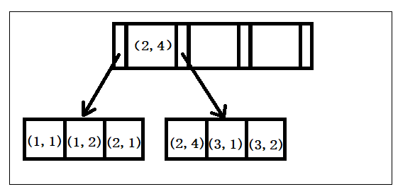
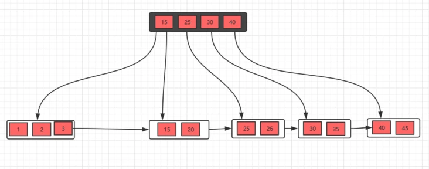
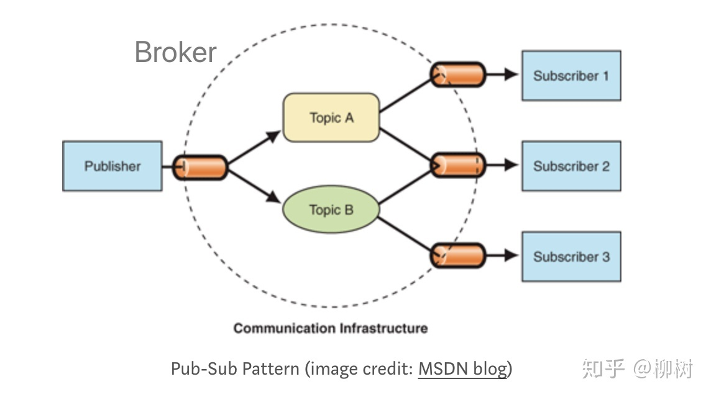

[toc]

### 关注订阅

##### 数据库表

`t_following_group`用于存贮分组类别，预设三个分组： type=1，name=悄悄关注 ；type=2，name=默认分组  ; type=3用于用户自定义分组，预设分组每个用户都有，不需要关联用户；自定义分组为某个用户特有，需要与创建该分组的特定用户使用`usrId`关联。由于经常根据用户ID查询该用户拥有的分组，`userId`经常被查询所以添加索引。同时对`userId`添加外键约束。


`t_user_following`用于存储关注者ID、被关注者ID、关注类别ID。由于经常进行<关注者ID，被关注者ID>的查询，所以建立联合索引( `userId`,`followingId`)，在查询当前用户关注的用户时使用`userId`字段，根据最左匹配原则可以重用联合索引( `userId`,`followingId`)，在查询当前用户关注的粉丝使用`followingId`字段，根据最左匹配原则不能重用联合索引( `userId`,`followingId`)，需要新建索引`followingId`。同时对`userId`和`followingId`添加外键约束。

```sql
-- ----------------------------
-- Table structure for t_following_group
-- ----------------------------
DROP TABLE IF EXISTS `t_following_group`;
CREATE TABLE `t_following_group` (
    `id` bigint NOT NULL AUTO_INCREMENT COMMENT '主键id',
    `userId` bigint DEFAULT NULL COMMENT '用户id',
    `name` varchar(50) DEFAULT NULL COMMENT '关注分组名称',
    `type` varchar(5) DEFAULT NULL COMMENT '关注分组类型：0特别关注  1悄悄关注 2默认分组  3用户自定义分组',
    `createTime` datetime DEFAULT NULL COMMENT '创建时间',
    `updateTime` datetime DEFAULT NULL COMMENT '更新时间',
    PRIMARY KEY (`id`),
    								 INDEX  userId_index ( `userId`)
) ENGINE=InnoDB AUTO_INCREMENT=16 DEFAULT CHARSET=utf8mb4 COLLATE=utf8mb4_0900_ai_ci COMMENT='用户关注分组表';
alter table `t_following_group` add constraint FK_following_group_userId foreign key (`userId`) references `t_user`(`id`);

-- ----------------------------
-- Table structure for t_user_following
-- ----------------------------
DROP TABLE IF EXISTS `t_user_following`;
CREATE TABLE `t_user_following` (
    `id` bigint NOT NULL AUTO_INCREMENT COMMENT '主键id',
    `userId` bigint DEFAULT NULL COMMENT '用户id',
    `followingId` bigint DEFAULT NULL COMMENT '关注用户id',
    `groupId` int DEFAULT NULL COMMENT '关注分组id',
    `createTime` datetime DEFAULT NULL COMMENT '创建时间',
    PRIMARY KEY (`id`),
    INDEX  followingId_index ( `followingId`),
    INDEX  userId_followingId_index ( `userId`,`followingId`)
) ENGINE=InnoDB AUTO_INCREMENT=26 DEFAULT CHARSET=utf8mb4 COLLATE=utf8mb4_0900_ai_ci COMMENT='用户关注表';
alter table `t_user_following` add constraint FK_user_following_userId foreign key (`userId`) references `t_user`(`id`);
alter table `t_user_following` add constraint FK_user_following_followingId foreign key (`followingId`) references `t_user`(`id`);

```

##### 索引

1，最左匹配原则

如果查询的时候查询条件精确匹配索引的左边连续一列或几列，则此列就可以被用到，同时遇到范围查询(>、<、between、like)就会停止匹配。构建一颗 B+ 树只能根据一个值来构建，因此数据库依据联合索引最左的字段来构建 B+ 树，叶子节点存储的是第一个关键字的索引 a，而叶子节点存储的是三个关键字的数据。这里可以看出 a 是有序的，而 b，c 都是无序的。但是当在 a 相同的时候，b 是有序的，a,b 相同的时候，c 又是有序的。所以查询a=0,b=1,c=2时，过滤完a=0的数据后b有序，过滤完b=1数据后c有序，可以利用到abc的索引。a=0,b>1,c=2经过a,b过滤后c无需，只能用到索引a,b。



2，联合索引 

* 减少开销。建一个联合索引(col1,col2,col3)，实际相当于建了(col1),(col1,col2),(col1,col2,col3)三个索引。每多一个索引，都会增加写操作的开销和磁盘空间的开销。对于大量数据的表，使用联合索引会大大的减少开销。

* 覆盖索引。对联合索引(col1,col2,col3)，如果有如下的sql: select col1,col2,col3 from test where col1=1 and col2=2。那么MySQL可以直接通过遍历索引取得数据，而无需回表，这减少了很多的随机io操作。

* 效率高。索引列越多，通过索引筛选出的数据越少。有1000W条数据的表，有如下sql:select from table where col1=1 and col2=2 and col3=3,假设假设每个条件可以筛选出10%的数据，如果只有单值索引，那么通过该索引能筛选出1000W10%=100w条数据，然后再回表从100w条数据中找到符合col2=2 and col3= 3的数据，然后再排序，再分页；如果是联合索引，通过索引筛选出1000w10% 10% *10%=1w，效率提升可想而知！

3，索引优化

* 如果查询语句中的where、order by、group 涉及多个字段，一般需要创建多列索引。
* 一般情况下，把选择性区分度高的字段放在前面，过滤后剩下更少数据（age/gender）。
* 避免使用范围查询很多情况下，范围查询都可能导致无法使用索引。
* 尽量避免查询不需要的数据（回表）。

4，查询缓慢排查

* 偶尔慢

  > 1，数据库会在内存中把对应字段的数据更新了，并把这些更新的记录写入到 redo log 日记中去，等到空闲的时候，在通过 redo log 里的日记把最新的数据同步到磁盘中去。如果更新很频繁，这个时候 redo log 很快就会被写满了，需要立即把数据同步到磁盘的，只能暂停其他操作，就会导致我们平时正常的SQL语句突然执行的很慢。
  >
  > 2，语句涉及到的表锁或者行锁，并且被别人占据，只能慢慢等待别人释放锁了。使用`show processlist`命令来查看当前的状态哦。

* 频繁慢

  >  1，字段没有索引：刚好查询的字段上没有索引，只能走全表扫描了，导致这条查询语句很慢。建立字段索引字段；复合字段索引，将经常访问的多个字段构建索引。
  >
  > 2，字段有索引，但却没有用索引：在字段的左边做了运算或者使用函数（where x-1>1000，where f(x)>1000），在查询的时候就不会用上索引。
  >
  > 3，字段有索引，但却没有用索引：非主键索引保存主键，需要到主键索引树中查询（回表），需要两次查询，如果所有行都匹配查询结果，就相当于全表扫描，并且每行数据走了两次索引，引擎会判断认为走两次所用还不如直接全表扫描开销小。系统是通过索引的区分度来判断的，一个索引上不同的值越多，意味着出现相同数值的索引越少，意味着索引的区分度越高，满足查询条件的数据越少，意味着走索引查询越有优势。通过采样的方式，来预测索引的区分度，由于统计的失误，导致区分度估计偏小，导致系统没有走索引，而是走了全表扫描。强制走索引：`select * from t force index(x) where x < 100 ;`，重新进行抽样：`analyze table t;`

5，B树、B+树

* B树是一颗多路平衡查找树：阶数m，每个节点最多有m-1个关键字，非根节点至少有m/2个关键字。每个节点中的关键字都按照从小到大的顺序排列，每个关键字的左子树中的所有关键字都小于它，而右子树中的所有关键字都大于它。

* B+树：非根节点元素范围：m/2 <= k <= m-1；内部节点就是非叶子节点，内部节点不存储数据，只存储索引，数据都存储在叶子节点。内部结点中的key都按照从小到大的顺序排列，对于内部结点中的一个key，左树中的所有key都小于它，右子树中的key都大于等于它。叶子结点中的记录也按照key的大小排列。当节点元素数量大于m-1的时候，按中间元素分裂成左右两部分，中间元素分裂到父节点当做索引存储，上移，高度增加。删除操作导致数量<m/2时，如果兄弟节点的元素大于m/2，可以直接通过兄弟节移动，然后更新父节点的索引，如果兄弟节点的元素不大于m/2，则将当前节点和兄弟节点合并，并且删除父节点中的key，上移，高度减少。

* B+树优势：非叶子结点只保存指针，所有关键字都在叶子结点，非叶子结点存储的元素更多，使得查询的IO次数更少。所有的查询都要查找到叶子节点，查询性能是稳定的，而B树，每个节点都可以查找到数据，所以不稳定。所有的叶子节点形成了一个有序链表，更加便于查找（区间查询： 查询5-10，把到5这个标记，再找到10，然后串起来就行了）。

  

##### 添加关注

检查选择分组、被关注用户是否存在。删除<关注者,被关注者>记录并插入新记录。由于涉及到多个对数据库更改的操作，需要事务保证原子性和一致性。

```java
// 涉及到多个对数据库更改的操作，需要事务保证原子性和一致性
@Transactional
public void addUserFollowings(UserFollowing userFollowing) {
    Long groupId = userFollowing.getGroupId();
    if (groupId == null) {
        // 未设定关注分组时使用默认分组，type=2
        FollowingGroup followingGroup = followingGroupService.getByType(UserConstant.USER_FOLLOWING_GROUP_TYPE_DEFAULT);
        userFollowing.setGroupId(followingGroup.getId());
    } else {
        // 设置的分组不存在
        FollowingGroup followingGroup = followingGroupService.getById(groupId);
        if (followingGroup == null) {
            throw new ConditionException("关注分组不存在！");
        }
    }
    // 被关注者ID
    Long followingId = userFollowing.getFollowingId();
    User user = userService.getUserById(followingId);
    if (user == null) {
        throw new ConditionException("被关注的用户不存在！");
    }
    // 删除原始关注者和被关注者的记录
    userFollowingDao.deleteUserFollowing(userFollowing.getUserId(), followingId);
    userFollowing.setCreateTime(new Date());
    // 保存新的关注者和被关注者的记录
    userFollowingDao.addUserFollowing(userFollowing);
}
```

##### 事务

1，ACID：原子性（ Atomicity ）、一致性（ Consistency ）、隔离性（ Isolation ）和持续性（ Durability ）。事务中的所有操作要么全部执行，要么都不执行。⑴ 原子性：全部成功/全部失败回滚⑵ 一致性一致性状态变换到另一个一致性状态(2000+3000=1000+4000)。⑶ 隔离性并发多事务间无干扰（T1/T2=>T1+T2，T2+T1）⑷ 持久性：事务提交改变永久。

2，隔离特性：

* 脏读：一个事务处理过程里读取了另一个未提交的事务中的数据、注意回滚。读取了另一个事务未提交的脏数据。不加锁。


* 不可重复读：一个事务范围内多次查询却返回了不同的数据值。读取了前一事务提交的数据。重点是修改数据。

* 幻读：读取了另一条已经提交的事务。幻读就是没有读到的记录，以为不存在，但其实是可以更新成功的，并且更新成功后，再次读取，就出现了。重点是增加数据。

3，事务隔离：

* TransactionDefinition.ISOLATION_DEFAULT:  使用后端数据库默认的隔离级别，Mysql 默认采用的 REPEATABLE_READ隔离级别 Oracle 默认采用的 READ_COMMITTED隔离级别.

* TransactionDefinition.ISOLATION_READ_UNCOMMITTED: 最低的隔离级别，允许读取尚未提交的数据变更，可能会导致脏读、幻读或不可重复读

* TransactionDefinition.ISOLATION_READ_COMMITTED:   允许读取并发事务已经提交的数据，可以阻止脏读，但是幻读或不可重复读仍有可能发生

* TransactionDefinition.ISOLATION_REPEATABLE_READ:  对同一字段的多次读取结果都是一致的，除非数据是被本身事务自己所修改，可以阻止脏读和不可重复读，但幻读仍有可能发生。

* TransactionDefinition.ISOLATION_SERIALIZABLE:   最高的隔离级别，完全服从ACID的隔离级别。所有的事务依次逐个执行，这样事务之间就完全不可能产生干扰，也就是说，该级别可以防止脏读、不可重复读以及幻读。但是这将严重影响程序的性能。通常情况下也不会用到该级别。

4，声明式事务：通过声明的方式，在IoC配置中指定事务的边界和事务属性，方法、类上增加@Transactional注解，声明事务的隔离级别、传播机制。

* TransactionDefinition.PROPAGATION_REQUIRED： 如果当前存在事务，则加入该事务；如果当前没有事务，则创建一个新的事务。
* TransactionDefinition.PROPAGATION_SUPPORTS： 如果当前存在事务，则加入该事务；如果当前没有事务，则以非事务的方式继续运行。
* TransactionDefinition.PROPAGATION_MANDATORY： 如果当前存在事务，则加入该事务；如果当前没有事务，则抛出异常。（mandatory：强制性）
* TransactionDefinition.PROPAGATION_REQUIRES_NEW： 创建一个新的事务，如果当前存在事务，则把当前事务挂起。
* TransactionDefinition.PROPAGATION_NOT_SUPPORTED： 以非事务方式运行，如果当前存在事务，则把当前事务挂起。
* TransactionDefinition.PROPAGATION_NEVER： 以非事务方式运行，如果当前存在事务，则抛出异常。

5，引擎

* MyISAM：不支持事务，不支持外键，访问速度快，B+Tree 作为索引结构，索引和数据文件是分离的，能加载更多索引；支持表级锁，并发度有限；可以没有主键；
* InnoDB：更新密集的表，适合处理多重并发的更新请求；事务，默认的事务隔离级别为可重复读（REPEATABLE-READ），通过MVCC（并发版本控制）来实现；支持在线热备，有很成熟的在线热备解决方案；外键约束；支持自动增加列AUTO_INCREMENT属性；B+树构建索引，主键索引的叶子节点就是数据文件；支持表、行级锁，可以支持更高的并发；必须有唯一索引（如主键）；DELETE FROM table时，InnoDB不会重新建立表，而是一行一行的删除。

6，ACID实现

* 为了提升性能不会把每次的修改都实时同步到磁盘，然后使用后台线程去做缓冲池和磁盘之间的同步。更新数据到内存中->写redo log，prepare态->写bin log->事务提交 redo log变为commit态->写入磁盘。两阶段提交保证两份日志保持一致，当在写binlog之前崩溃时重启恢复后发现没有commit，回滚。当在commit之前崩溃,重启虽没有commit，但满足prepare和binlog完整，所以重启后会自动commit。系统对binlog定期做整库备份，崩溃时读取binlog进行恢复。用于保障已提交事务的持久化特性。
* undo log 提供了回滚和多个行版本控制（MVCC），对记录做变更操作时不仅会产生 redo 记录，也会产生 undo 记录，存放数据被修改前的值,用于在发生错误时才可以回滚。mvcc当读取的某一行被其他事务锁定时，它可以根据事务id从 undo log 中获取该行记录以前的数据是什么，从而提供该行版本信息。 
* 读写锁：读锁是可以共享的，写锁会排斥其他所有获取锁的请求。
* 事务的原子性是通过 undo log 来实现的；事务的持久性性是通过 redo log 来实现的；事务的隔离性是通过 (读写锁 + MVCC) 来实现的；事务的一致性是通过原子性，持久性，隔离性来实现的。

##### 获得关注分组

返回默认分组被关注者信息+各个种类下被关注者信息。返回`[group0:[userInfo0,userInfo1,...],group1:[userInfo2,userInfo3,...]]`

```java
public List<FollowingGroup> getUserFollowings(Long userId) {

    // 获得当前用户的全部关注记录
    List<UserFollowing> list = userFollowingDao.getUserFollowings(userId);
    // 被关注者ID集合
    Set<Long> followingIdSet = list.stream().map(UserFollowing::getFollowingId).collect(Collectors.toSet());
    // 被关注者信息集合
    List<UserInfo> userInfoList = new ArrayList<>();
    if (followingIdSet.size() > 0) {
        userInfoList = userService.getUserInfoByUserIds(followingIdSet);
    }
    // 填充被关注者集合中，被关注者者自身的信息
    for (UserFollowing userFollowing : list) {
        for (UserInfo userInfo : userInfoList) {
            if (userFollowing.getFollowingId().equals(userInfo.getUserId())) {
                // 为每条关注记录注入被关注者信息
                userFollowing.setUserInfo(userInfo);
            }
        }
    }
    // 获得用户的全部分组+默认+自定义
    List<FollowingGroup> groupList = followingGroupService.getByUserId(userId);
    // 该用户下全部分组的被关注者信息
    FollowingGroup allGroup = new FollowingGroup();
    allGroup.setName(UserConstant.USER_FOLLOWING_GROUP_ALL_NAME);
    allGroup.setFollowingUserInfoList(userInfoList);
    // 用户所有的关注分组：全部种类（自定义）被关注者信息+各个种类下被关注者信息
    List<FollowingGroup> result = new ArrayList<>();
    result.add(allGroup);
    // 遍历所有分组，
    for (FollowingGroup group : groupList) {
        List<UserInfo> infoList = new ArrayList<>();
        // 遍历所有关注记录
        for (UserFollowing userFollowing : list) {
            // 如果当前关注记录的种类和group种类匹配，将当前记录加入group种类下的集合中
            if (group.getId().equals(userFollowing.getGroupId())) {
                infoList.add(userFollowing.getUserInfo());
            }

        }
        // 将当前group种类对应的被关注者信息注入集合
        group.setFollowingUserInfoList(infoList);
        result.add(group);
    }
    return result;
}
```

用户26获得的关注列表：

```json
{
    "createTime": null,
    "followingUserInfoList": [
        {
            "avatar": "",
            "birth": "1999-10-01",
            "createTime": "2022-04-11 15:34:58",
            "followed": null,
            "gender": "0",
            "id": 10,
            "nick": "萌新",
            "sign": "",
            "updateTime": null,
            "userId": 17
        }
    ],
}
```

##### 获得粉丝信息

获得当前关注当前用户的用户信息，以及粉丝与当前用户是否互关。

```java
public List<UserFollowing> getUserFans(Long userId) {
    // 获取关注当前用户的关注记录
    List<UserFollowing> fanList = userFollowingDao.getUserFans(userId);
    // 关注当前用户的用户ID
    Set<Long> fanIdSet = fanList.stream().map(UserFollowing::getUserId).collect(Collectors.toSet());
    List<UserInfo> userInfoList = new ArrayList<>();
    if (fanIdSet.size() > 0) {
        // 关注当前用户的用户信息
        userInfoList = userService.getUserInfoByUserIds(fanIdSet);
    }
    // 获取当前用户的关注记录
    List<UserFollowing> followingList = userFollowingDao.getUserFollowings(userId);
    for (UserFollowing fan : fanList) {
        for (UserInfo userInfo : userInfoList) {
            // 关注记录下关注者与用户信息相匹配
            if (fan.getUserId().equals(userInfo.getUserId())) {
                userInfo.setFollowed(false);
                fan.setUserInfo(userInfo);
            }
        }
        // 从粉丝中找的互关的粉丝
        for (UserFollowing following : followingList) {
            if (following.getFollowingId().equals(fan.getUserId())) {
                fan.getUserInfo().setFollowed(true);
            }
        }
    }
    return fanList;
}
```

用户26获得的粉丝列表：

```json
{
    "createTime": "2022-04-11 22:19:39",
    "followingId": 26,
    "groupId": 18,
    "id": 29,
    "userId": 17,
    "userInfo": {
        "avatar": "",
        "birth": "1999-10-01",
        "createTime": "2022-04-11 15:34:58",
        "followed": true, #用户26与17互关
        "gender": "0",
        "id": 10,
        "nick": "萌新",
        "sign": "",
        "updateTime": null,
        "userId": 17
    }
}

```

##### 分页模糊查询

根据昵称惊醒分页模糊查询，先根据查询条件统计符合条件的用户数，若大于0才进行后续分页查询。并检查当前用户是否关注查询到的用户。

```sql
<!--根据昵称模糊查询匹配用户数-->
<select id="pageCountUserInfos" parameterType="java.util.Map" resultType="java.lang.Integer">
        select
        count(1)
        from
        t_user_info
        where
        1=1
        <if test="nick != null and nick != '' ">
            and nick like '%${nick}%'
        </if>
</select>
    
<!--根据昵称分页模糊查询匹配用户数-->
<select id="pageListUserInfos" parameterType="java.util.Map" resultType="com.imooc.bilibili.domain.UserInfo">
        select
        *
        from
        t_user_info
        where
        1=1
        <if test="nick != null and nick != '' ">
            and nick like '%${nick}%'
        </if>
        order by id desc
        limit #{start}, #{limit}
</select>
```

```java
//  分页查询用户
public JsonResponse<PageResult<UserInfo>> pageListUserInfos(@RequestParam Integer no, @RequestParam Integer size, String nick) {
    Long userId = userSupport.getCurrentUserId();
    JSONObject params = new JSONObject();
    params.put("no", no);
    params.put("size", size);
    params.put("nick", nick);
    params.put("userId", userId);
    // 分页模糊查询
    PageResult<UserInfo> result = userService.pageListUserInfos(params);
    // 检查当前用户是否关注查询到的用户
    if (result.getTotal() > 0) {
        List<UserInfo> checkedUserInfoList = userFollowingService.checkFollowingStatus(result.getList(), userId);
        result.setList(checkedUserInfoList);
    }
    return new JsonResponse<>(result);
}
```

```java
// 检查当前用户是否关注查询到的用户
public List<UserInfo> checkFollowingStatus(List<UserInfo> userInfoList, Long userId) {

    // 关注的用户
    List<UserFollowing> userFollowingList = userFollowingDao.getUserFollowings(userId);
    for (UserInfo userInfo : userInfoList) {
        userInfo.setFollowed(false);
        for (UserFollowing userFollowing : userFollowingList) {
            // 粉丝ID能在当前用户的关注列表中找到
            if (userFollowing.getFollowingId().equals(userInfo.getUserId())) {
                userInfo.setFollowed(true);
            }
        }
    }
    return userInfoList;
}
```

### 动态管理

##### 数据表

创建动态条目数据表`t_user_moments`。由于`userId`经常被用来查询用户发表过的动态，所以需要建立索引。并对`userId`添加外键约束。

```sql
DROP TABLE IF EXISTS `t_user_moments`;
CREATE TABLE `t_user_moments` (
    `id` bigint NOT NULL AUTO_INCREMENT COMMENT '主键id',
    `userId` bigint DEFAULT NULL COMMENT '用户id',
    `type` varchar(5) DEFAULT NULL COMMENT '动态类型：0视频 1直播 2专栏动态',
    `contentId` bigint DEFAULT NULL COMMENT '内容详情id',
    `createTime` datetime DEFAULT NULL COMMENT '创建时间',
    `updateTime` datetime DEFAULT NULL COMMENT '更新时间',
    PRIMARY KEY (`id`),
    INDEX  userId_index ( `userId`)
) ENGINE=InnoDB AUTO_INCREMENT=4 DEFAULT CHARSET=utf8mb4 COLLATE=utf8mb4_0900_ai_ci COMMENT='用户动态表';
alter table `t_user_moments` add constraint FK_user_moments_userId foreign key (`userId`) references `t_user`(`id`);

```

##### 发布订阅模型

1，发布订阅模式：核心基于一个中心来建立整个体系。其中发布者和订阅者不直接进行通信，而是发布者将要发布的消息交由中心管理，订阅者也是根据自己的情况，按需订阅中心中的消息。发布者的发布动作和订阅者的订阅动作相互独立，无需关注对方，消息派发由发布订阅中心负责，生产者、订阅者完全解耦的。



2，观察者模式：一般至少有一个可被观察的对象 Subject ，可以有多个观察者去观察这个对象。二者的关系是通过被观察者主动建立的，被观察者至少要有三个方法——添加观察者、移除观察者、通知观察者。观察者主动申请加入被观察者的列表，此后只要被观察者在某种时机触发通知观察者方法时，观察者即可接收到来自被观察者的消息。实现上：被观察者它引用一个`Observer`接口对象的集合，任何想要得到通知的对象，只要实现该接口，并且把自己注册到通知者即可，每当要发通知时，通知者遍历集合给被通知者发送消息，实现松耦合的关系。


3，区别：观察者是软件设计模式中的一种，发布订阅只是软件架构中的一种消息范式。


##### 消息队列

当不需要立即获得结果，但是并发量又需要进行控制的时候。

1，优点：

* 异步处理：写入消息队列后立即返回客户端，无需等待，相比串行处理，减少等待时间，任务由信息接收者处理；
* 限流削峰：请求先入消息队列，而不是由业务处理系统直接处理，做了一次缓冲，消息接收者根据自己的处理能力，从MQ中慢慢拉取请求，这样即使在高峰期也能避免系统崩溃，而发生损失，极大地减少了业务处理系统的压力，避免流量过大导致应用系统挂掉的情况。
* 应用耦合：将任务的调用方与真正执行任务方解耦，往消息队列中写入消息的一方与从队列中读取消息的一方相关性较低，二者可能由不同技术栈实现，也可能不在同一台物理机器上，避免调用接口失败导致整个过程失败。
* 消息驱动的系统：系统分为消息队列、消息生产者、消息消费者，生产者负责产生消息，消费者(可能有多个)负责对消息进行处理。流水线处理，通过消息队列连接各个处理部分，前一个阶段的处理结果放入队列中，后一个阶段从队列中获取消息继续处理。


2，工作模式

* 点对点：消息发送者生产消息发送到queue中，然后消息接收者从queue中取出并且消费消息。消息被消费以后，queue中不再有存储，所以消息接收者不可能消费到已经被消费的消息。

  每个消息只有一个接收者（Consumer）(即一旦被消费，消息就不再在消息队列中)；接收者在成功接收消息之后需向队列应答成功，以便消息队列删除当前接收的消息；发送者和接收者间没有依赖性，发送者发送消息之后，不管有没有接收者在运行，都不会影响到发送者下次发送消息；

  

* 发布/订阅模式：发布者将消息发送到Topic,系统将这些消息传递给多个订阅者。

  每个消息可以有多个订阅者；发布者和订阅者之间有时间上的依赖性。针对某个主题（Topic）的订阅者，它必须创建一个订阅者之后，才能消费发布者的消息。


3，RabbitMQ

* 灵活的路由： 消息在到达队列前是通过交换机（exchange），依据路由键(routing-key)进行路由，投递到不同的消息队列。发送消息时，使用`rabbitTemplate.convertAndSend(exchange, routingKey, message)`可以指定Exchange、Routing Key以及消息本身。接收消息时，需要在消息处理的类上标注`@RabbitListener`指明要监听的queue，通过多个`@RabbitHandler`标注的方法接收不同类型的消息。

  

* 持久化机制，可靠性高；跨平台和语言。

4，问题

* 高可用：消息队列肯定不能是单机的，万一这台机器挂了，那我们整个系统几乎就是不可用了，都是得集群 / 分布式。

* 数据丢失：将数据写到消息队列上，没来得及取消息队列的数据，就挂掉了，将导致数据丢失。如果没有做任何的措施，我们的数据就丢了。消息持久化。

* 获取消息

  生产者将数据放到消息队列中，消息队列有数据了，主动叫消费者去拿 (俗称 push)

  消费者不断去轮训消息队列，看看有没有新的数据，如果有就消费 (俗称 pull)

##### 发送动态

往指定的exchange中发送消息，消息在exchange上可以根据routing key 发送到多个queue。

MessageConverter用于将Java对象转换为RabbitMQ的消息。默认情况下，Spring Boot使用SimpleMessageConverter，只能发送String和byte[]类型的消息，使用Jackson2JsonMessageConverter，就可以发送JavaBean对象，由Spring Boot自动序列化为JSON并以文本消息传递。

```java
@Bean
MessageConverter createMessageConverter() {
    return new Jackson2JsonMessageConverter();
}
```

`rabbitTemplate.convertSend()`方法立即返回（异步发送）无法得到接收端反馈，如果想得到反馈可以使用`convertSendAndReceive()`该该方法为同步方法，只有在接收端处理完信息后才会返回，使用`AsyncRabbitTemplate(rabbitTemplate)`获得异步`rabbitTemplate`，`convertSendAndReceive()`该方法变成异步方法，发送后立即返回，在接收端处理后调用设定的回调方法。

```java
// 异步方式获得接收者反馈。
AsyncRabbitTemplate.RabbitConverterFuture<Object> future = rabbitTemplate
    .convertSendAndReceive("directExchange", "warn-msg", content);
future.addCallback(new ListenableFutureCallback<Object>() {
    @Override
    public void onFailure(Throwable throwable) {
    }

    @Override
    public void onSuccess(Object o) {
        System.out.println("aaa : " + o);
    }
});
```

此处不接受接收者反馈，异步发送，发送后立即返回。

```java
// 发送消息
public void sendMessage(UserMoment userMoment) {
    //给队列发送消息
    amqpTemplate.convertAndSend(UserMomentsConstant.Exchange_MOMENTS, "", userMoment);
}
```

##### 接收动态

接收器：监听特定queue下的消息，此处broker与用户使用推送(push)的方式传递消息，当监听器收到消息时执行回调方法，在获取当前动态对应用户的粉丝集合后，构建`<follwingUserId,msg>`键值对存入redis，等待用户查询关注用户动态时从redis获取。

```java
@Component
@RabbitListener(queues = "q-user-moment")
public class RabbitMQConsumerConfig {

    @Autowired
    UserFollowingService userFollowingService;
    @Autowired
    RedisTemplate<String, String> redisTemplate;

    @RabbitHandler
    public void handle(UserMoment userMoment) {
        // 动态发布者
        Long userId = userMoment.getUserId();
        // 该用户的粉丝都会收到该通知
        List<UserFollowing> fanList = userFollowingService.getUserFans(userId);
        for (UserFollowing fan : fanList) {
            // 接收到通知后将用户动态放入redis等待用户来取
            String key = "subscribed-" + fan.getUserId();
            // 该用户可能关注多个用户，收到多个用户的动态通知
            String subscribedListStr = redisTemplate.opsForValue().get(key);
            List<UserMoment> subscribedList;
            if (StringUtil.isNullOrEmpty(subscribedListStr)) {
                subscribedList = new ArrayList<>();
            } else {
                subscribedList = JSONArray.parseArray(subscribedListStr, UserMoment.class);
            }
            // 键入该用户的待消费动态通知集合
            subscribedList.add(userMoment);
            redisTemplate.opsForValue().set(key, JSONObject.toJSONString(subscribedList));
        }

    }
}
```

用户26关注了用于17、25，当17、25发表动态后，26将在redis中获取到动态消息。

```json
{
    "contentId": null,
    "createTime": "2022-04-13 01:20:01",
    "id": 21,
    "type": "0",
    "updateTime": null,
    "userId": 17
},
{
    "contentId": null,
    "createTime": "2022-04-22 18:06:25",
    "id": 31,
    "type": "1",
    "updateTime": null,
    "userId": 25
}
```

##### Redis

性能优秀，数据在内存中，读写速度非常快。单进程单线程，是线程安全的，采用 IO 多路复用机制。丰富的数据类型，支持字符串 (strings)、散列(hashes)、列表(lists)、集合(sets)、有序集合(sorted sets) 等。支持数据持久化,可以将内存中数据保存在磁盘中，重启时加载。主从复制，哨兵，高可用。

1，数据类型

* String 数据结构是简单的 key-value 类型，value 其实不仅可以是 String，可以包含任何数据，比如 数字、jpg 图片或者序列化的对象。

* Hash 是一个 string 类型的 field 和 value 的映射表，Key仍然是设定的值， value是一个Map，这个Map的key是成员的属性名，value是属性值hash 。特别适合用于存储对象，后续操作的时候，你可以直接仅仅修改这个对象中的某个字段的值。避免取出、保存完整对象的开销，同时避免了序列化、反序列化开销。

* Redis list 的实现为一个双向链表，即可以支持反向查找和遍历，更方便操作，不过带来了部分额外的内存开销。

* set 元素是没有顺序的，通过 HashMable 实现的，只是 value永远为null，通过计算key的hash的方式来快速去重。

* sorted set 和 set 相比，增加了一个权重参数 score，使得集合中的元素能够按 score 进行有序排列。内部使用 HashMap 和跳跃表 (skipList，多级索引) 来保证数据的存储和有序，HashMap 里放的是成员到 Score 的映射。而跳跃表里存放的是所有的成员，排序依据是 HashMap 里存的 Score，使用跳跃表的结构可以获得比较高的查找效率。

  

2，有效期

Redis 中有个设置缓存时间过期的功能，即对存储在 redis 数据库中的值可以设置一个过期时间。

* 定期删除：redis 默认是每隔 100ms 就随机抽取(降低遍历开销)一些设置了过期时间的 key，检查其是否过期，如果过期就删除。
* 惰性删除：定期删除可能会导致很多过期 key 到了时间并没有被删除掉，假如过期 key，靠定期删除没有被删除掉，还停留在内存里，除非手动去查一下那个 key，才会被 redis 给删除掉。

3，内存淘汰机制

如果定期删除漏掉了很多过期 key，然后也没及时去查，也就没走惰性删除，如果大量过期 key 堆积在内存里，导致 redis 内存块耗尽。

* volatile-lru：从已设置过期时间的数据集（server.db[i].expires）中挑选最近最少使用的数据淘汰
* volatile-ttl：从已设置过期时间的数据集（server.db[i].expires）中挑选将要过期的数据淘汰
* volatile-random：从已设置过期时间的数据集（server.db[i].expires）中任意选择数据淘汰
* allkeys-lru：当内存不足以容纳新写入数据时，在键空间中，移除最近最少使用的 key
* allkeys-random：从数据集（server.db[i].dict）中任意选择数据淘汰
* no-eviction：禁止驱逐数据，也就是说当内存不足以容纳新写入数据时，新写入操作会报错。

4，持久化机制

* 快照（snapshotting，RDB）：Redis 可以通过创建快照来获得存储在内存里面的数据在某个时间点上的副本。Redis 创建快照之后，可以对快照进行备份，可以将快照复制到其他服务器从而创建具有相同数据的服务器副本（Redis 主从结构，主要用来提高 Redis 性能），还可以将快照留在原地以便重启服务器的时候使用。
* 只追加文件（append-only file，AOF）：类似mysql的基于语句的binlog方式，每执行一条会更改 Redis 中的数据的命令，Redis 就会将该命令写入硬盘中的 AOF 文件，写文件频率可以根据需求调节。

5，缓存雪崩

缓存同一时间大面积的失效，所以后面的请求都会落到数据库上，造成数据库短时间内承受大量请求而崩掉。

解决办法：1，尽量保证整个 redis 集群的高可用性，发现机器宕机尽快补上；2，把每个 Key 的失效时间都加个随机值，保证数据不会再同一时间大面积失效。3，选择合适的内存淘汰策略，防止爆内存。对请求限流 ，避免 MySQL在redis崩溃后也崩掉，只要数据库正常工作，就可以处理用户请求，保证系统仍然可用。4，利用 redis 持久化机制保存的数据尽快恢复缓存。


6，缓存穿透

大量请求缓存中不存在的数据，导致所有的请求都落到数据库上，造成数据库短时间内承受大量请求而崩掉。

解决办法：1，在接口层增加校验，比如用户鉴权，参数做校验；2，采用布隆过滤器，将所有可能存在的数据哈希到一个足够大的 bitmap 中，用于快速判断出 Key 是否在数据库中存在，一个一定不存在的数据会被这个 bitmap 拦截掉，这个恶意请求就会被提前拦截，从而避免了对底层存储系统的查询压力。3，如果一个查询返回的数据为空（不管是数据不存在，还是系统故障），仍然把这个空结果进行缓存，但它的过期时间会很短，最长不超过五分钟。4，在访问数据据时加上互斥锁。

7，缓存击穿

缓存击穿是指一个 Key 非常热点，在不停地扛着大量的请求，大并发集中对这一个点进行访问，当这个 Key 在失效的瞬间，持续的大并发直接落到了数据库上，就在这个 Key 的点上击穿了缓存。

解决办法：1，设置热点数据永不过期。2，在访问数据据时加上互斥锁。

8，底层实现

Redis 内部使用一个 redisObject 对象来表示所有的 key 和 value。type 表示一个 value 对象具体是何种数据类型，encoding 是不同数据类型在 Redis 内部的存储方式。

9，快

Redis 单进程单线程的模型，因为 Redis 完全是基于内存的操作，CPU 不是 Redis 的瓶颈，Redis 的瓶颈最有可能是机器内存的大小或者网络带宽。既然单线程容易实现，而且 CPU 不会成为瓶颈，那就顺理成章的采用单线程的方案了。

* Redis 完全基于内存，绝大部分请求是纯粹的内存操作，非常迅速，数据存在内存中，类似于 HashMap，HashMap 的优势就是查找和操作的时间复杂度是 O(1)。

* 数据结构简单，对数据操作也简单。

* 采用单线程，避免了不必要的上下文切换和竞争条件，不存在多线程导致的 CPU 切换，不用去考虑各种锁的问题，不存在加锁释放锁操作，没有死锁问题导致的性能消耗。

* 使用多路复用 IO 模型，非阻塞 IO。

10，主从复制

* 全量同步
  Redis全量复制一般发生在Slave初始化阶段，这时Slave需要将Master上的所有数据都复制一份。

  1，从服务器连接主服务器，发送SYNC命令； 
  2， 主服务器接收到SYNC命名后，开始执行BGSAVE命令生成RDB文件并使用缓冲区记录此后执行的所有写命令(不阻塞主服务器端)； 
  3， 主服务器BGSAVE执行完后，向所有从服务器发送快照文件，并在发送期间继续记录被执行的写命令； 
  4， 从服务器收到快照文件后丢弃所有旧数据，载入收到的快照； 从复制对于从redis服务器来说也是非阻塞的，进行主从复制过程中也可以接受外界的查询请求，只不过这时候从redis返回的是以前老的数据，
  5， 主服务器快照发送完毕后开始向从服务器发送缓冲区中的写命令； 
  6， 从服务器完成对快照的载入，开始接收命令请求，并执行来自主服务器缓冲区的写命令；

* 增量同步
  Redis增量复制是指Slave初始化后开始正常工作时主服务器发生的写操作同步到从服务器的过程。 增量复制的过程主要是主服务器每执行一个写命令就会向从服务器发送相同的写命令，从服务器接收并执行收到的写命令。

11，redis和数据库双写一致性问题

数据库和缓存双写，就必然会存在不一致的问题。如果对数据有强一致性要求，不能放缓存。如果一致性不是太高可以采取正确更新策略，先更新数据库，再删缓存。

12，工作模式

* 单机：一个节点、简单低成本、数据一致、可靠性差、性能有限。
* 主从复制：master只写、slave只读；master到slave单向复制保证一致性；数据冗余、master宕机选取新master、读取分流高性能、master宕机后要通知外界新master地址并复制新master数据到slave上，写能力受单个master限制。
* 哨兵模式：自动化的故障恢复、哨兵节点（不存储数据）和数据节点（主节点和从节点），访问redis集群的数据都是通过哨兵集群的，哨兵监控整个redis集群，新master产生不对外界产生影响，哨兵维护集群信息。哨兵定时发送询问信号监控其它哨兵和数据节点，主节点下线进行选取和数据复制。主从复制优点、健康监控、对外界屏蔽内部信息，难支持在线扩容。
* 集群： 高可用、可扩展性、分布式、容错。分布式：集群的键空间被分割为多个hash槽，通过hash的方式将数据分到不同的分片上的，每个分片认为主从结构，读请求分配给slave节点，写请求分配给master，数据同步从master到slave节点，高并发。可扩展：master节点可以做扩充，从新分配每个分片对应的hash值范围，数据迁移redis内部自动完成。容错：master故障，其slave节点选取产生新master节点并完成数据复制。

##### 柱塞、非柱塞、异步、同步

* 阻塞和非阻塞关注的是程序在等待调用结果（消息，返回值）时的状态，对同一个线程来说的，阻塞IO和非阻塞IO的区别在于第一步发起IO请求是否会被阻塞。阻塞调用是指调用结果返回之前，主动挂起自己的操作，进程转变为“等待”的状态，调用线程只有在得到结果之后（同步：监测，异步：通知）才会返回。非阻塞调用指被调用后立即返回一个状态值，无需等I/O操作彻底完成，根据返回的状态，线程可以自行其它任务，（同步：轮询，异步：通知）。
* 同步和异步对应于调用者与被调用者，它们是线程之间的关系，关注的是消息通知的机制。同步IO和异步IO的区别就在于第二个步骤是否阻塞，如果不阻塞，发起I/O请求后仍需要继续执行，返回时不一定知道结果，当内核I/O操作完成后会通知用户线程，或者调用用户线程注册的回调函数，操作系统帮你做完IO操作再将结果返回给你，那么就是异步IO。同步IO即调用者需要等待被调用者返回结果，由处理消息者自己去等待消息是否被触发，之后才会进行下一步操作（需要等待或者轮询内核I/O操作完成后才能继续执行）。
* 阻塞与非阻塞与是否同步异步无关。
* 一个非阻塞I/O 系统调用 read() 操作立即返回的是任何可以立即拿到的数据，可以是完整的结果，也可以是不完整的结果，还可以是一个空值。而异步I/O系统调用 read（）结果必须是完整的， 但是这个操作完成的通知可以延迟到将来的一个时间点。

##### I/O多路复用

通过一种机制，可以监视多个文件描述符，一旦某个描述符就绪（一般是读就绪或者写就绪），能够通知程序进行相应的读写操作，没有就绪事件时，就会阻塞交出cpu。多路是指多个链接，复用指的是复用同一线程。但select，poll，epoll本质上都是同步I/O，因为他们都需要在读写事件就绪后自己负责进行读写，也就是说这个读写过程是阻塞的。

* select：时间复杂度O(n)，通过设置或者检查存放fd标志位的数据结构（fd数组为整型数组，用于保存文件描述符）来进行下一步处理，它仅仅知道有I/O事件发生了，却并不知道是哪那几个流，只能无差别轮询所有流，找出能读出数据，或者写入数据的流，效率较低。单个进程可监视的fd数量被限制，即能监听端口的大小有限。内核需要将消息传递到用户空间时需要内核拷贝动作，每次调用select，都需要把fd集合从用户态拷贝到内核态。

  1，用户线程调用select，将fd_set从用户空间拷贝到内核空间 2. 内核在内核空间对fd_set遍历一遍，检查是否有就绪的socket描述符，如果没有的话，就会进入休眠，直到有就绪的socket描述符 3. 内核返回select的结果给用户线程，即就绪的文件描述符数量 4. 用户拿到就绪文件描述符数量后，再次对fd_set进行遍历，找出就绪的文件描述符 5. 用户线程对就绪的文件描述符进行读写操作。

* poll：时间复杂度O(n)，本质上和select没有区别，它将用户传入的数组拷贝到内核空间，然后查询每个fd对应的设备状态，如果设备就绪则在设备等待队列中加入一项并继续遍历，如果遍历完所有fd后没有发现就绪设备，则挂起当前进程，直到设备就绪或者主动超时，被唤醒后它又要再次遍历fd。但是它没有最大连接数的限制，原因是它是基于链表来存储fd的。每次调用poll，都需要把fd集合从用户态拷贝到内核态。

  1,用户线程调用poll系统调用，并将文件描述符链表拷贝到内核空间。2，内核对文件描述符遍历一遍，如果没有就绪的描述符，则内核开始休眠，直到有就绪的文件描述符。3，返回给用户线程就绪的文件描述符数量。4，用户线程再遍历一次文件描述符链表，找出就绪的文件描述符。5，用户线程对就绪的文件描述符进行读写操作。

* epoll：时间复杂度O(1)，epoll可以理解为event poll，给每个fd注册一个回调函数，当fd对应的设备发生IO事件时，就会调用这个回调函数，将该fd放到一个链表中，然后唤醒在epoll_wait中进入睡眠的进程，最后只要判断一下就绪链表是否为空就行了，非空就从该链表中取出一个fd，以此达到O（1）的时间复杂度。效率提升，不是轮询的方式；根据每个fd上的callback函数来实现的，只有活跃的socket才会主动调用callback，而跟连接总数无关，会随着fd数量上升而效率下降。使用内存映射(mmap)，不需要从用户空间频繁拷贝fd数据到内核空间。

  mmap，是将文件/设备映射到内存中，进程可以通过读写内存的方式，实现对被mmap文件的操作。进程通过mmap映射相同的文件，实现共享内存方式的通信。对于大量频繁读写的文件，mmap相对read/write的方式，避免了内核空间->用户空间的数据传输和切换（epoll）。

  具体实现：对应着有三个函数：

  **epoll_create**：epoll_create相当于在内核中创建一个存放fd的数据结构。在select和poll方法中，内核都没有为fd准备存放其的数据结构，只是简单粗暴地把数组或者链表复制进来；而epoll则不一样，epoll_create会在内核建立一颗专门用来存放fd结点的红黑树，储监控的文件描述符，后续如果有新增的fd结点，都会注册到这个epoll红黑树上。

  **epoll_ctr**：select和poll会一次性将监听的所有fd都复制到内核中，而epoll不一样，当需要添加一个新的fd时，会调用epoll_ctr，给这个fd注册一个回调函数，然后将该fd结点注册到内核中的红黑树中。当该fd对应的设备活跃时，会调用该fd上的回调函数，将该结点存放在一个就绪链表（存储就绪的文件描述符）中。这也解决了在内核空间和用户空间之间进行来回复制的问题。

  **epoll_wait**：epoll_wait的做法也很简单，其实直接就是从就绪链表中取结点，这也解决了轮询的问题，时间复杂度变成O(1)

  Level和Edge指的就是触发点，Level为只要处于水平，那么就一直触发，而Edge则为上升沿和下降沿的时候触发。当缓冲区有数据可取的时候，ET会触发一次事件，之后就不会再触发，而LT只要我们没有取完缓冲区的数据，就会一直触发。

##### NIO

是一种同步非阻塞的 I/O 模型，在等待就绪阶段都是非阻塞的，真正的 I/O 操作是同步阻塞。是 I/O 多路复用的基础，成为解决高并发与大量连接、I/O 处理问题的有效方式。

服务器端同步阻塞 I/O 处理:socket.accept()、socket.read()、socket.write() 三个主要函数都是同步阻塞的，当一个连接在处理 I/O 的时候，系统是阻塞的，所以使用多线程时，就可以让 CPU 去处理更多的事情。低并发下结合线程池使得创建和回收成本相对较低，并且编程模型简单。创建和销毁都是重量级的系统函数，线程本身占用较大内存，线程的切换成本是很高的，无法应对百万级连接。

所有的系统 I/O 都分为两个阶段：等待就绪和操作。举例来说，读函数，分为等待系统可读和真正的读；同理，写函数分为等待网卡可以写和真正的写。NIO 里用户最关心” 我可以读了”。NIO的读写函数可以立刻返回而不是柱塞，如果一个连接不能读写（socket.read()返回0或者socket.write()返回0），我们可以把这件事记下来，将用于传输的通道全部注册到选择器上，选择器监控通道，当某一通道就绪后连接继续进行读写，没有必要开启多线程。没有线程切换，只是拼命的读、写、选择事件。


Java NIO 实际读写时的核心在于：通道（Channel）和缓冲区（Buffer），选择器。通道表示打开到 IO 设备（文件流、套接字）的连接，对原 I/O 包中的流的模拟，负责传输；缓冲区用于容纳数据，负责存储，Channel的读写必须通过buffer对象，然后操作缓冲区，对数据进行处理。缓存区是双向的，既可以往缓冲区写入数据，也可以从缓冲区读取数据：缓冲区<->然后缓冲区通过通道进行传输<->从缓冲区取数据。选择器：把Channel通道注册到Selector中，通过Selecotr监听Channel中的事件状态，这样就不需要阻塞等待客户端的连接，从主动等待客户端的连接，变成了通过事件驱动，通过事件驱动实现单线程管理多个Channel的目的。


缓冲区根据数据类型的不同，可以进行划分ByteBuffer、CharBuffer等。根据工作方式分：直接缓冲区(磁盘->内核地址空间中->用户地址空间中->读取到应用程序)与非直接缓冲区(将缓冲区建立在物理内存之中,读写数据直接通过物理内存进行)。