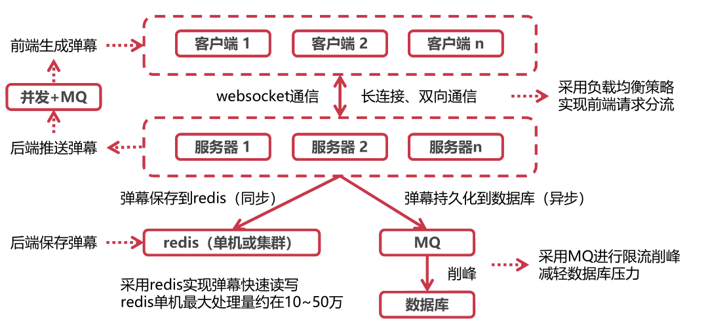
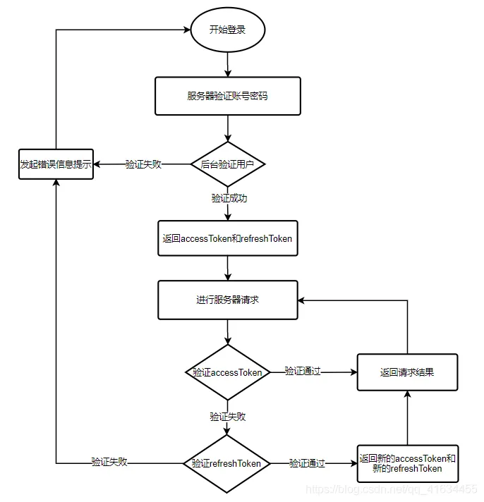
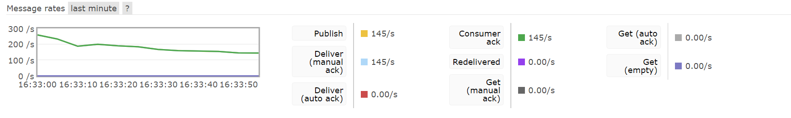
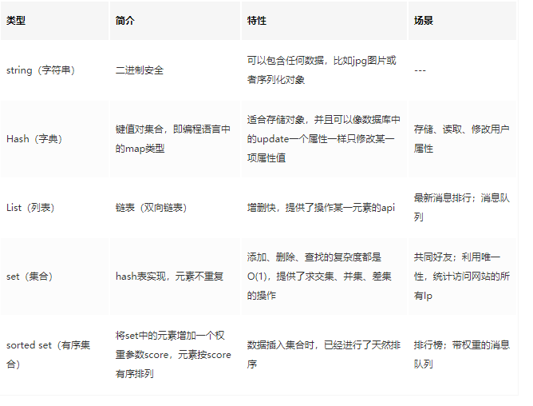

### 弹幕系统

[toc]

##### 长连接

1，当用户在观看视频时，如果客户端针对某一视频创建了弹幕，发送后端进行处理，后端需要对所有正在观看该视频的用户推送该弹幕。如果使用短连接进行通信进行通信，HTTP协议是一个请求－响应协议，请求必须先由浏览器发给服务器，服务器才能响应这个请求，再把数据发送给浏览器。所有观看视频的客户端不断轮询后端，若有新的弹幕则拉取后进行显示，即使无新弹幕也不断发起连接以了解服务器有没有新的信息，故必须不停连接后端轮询的效率低或者 HTTP 连接始终打开（长连接存在一个保持时间限制，一个HTTP连接在长时间没有数据传输的情况下，链路上的任何一个网关都可能关闭这个连接，而网关是我们不可控的，必须定期发一些ping数据表示连接“正常工作”，虽然可以在一次 TCP 连接中完成多个 HTTP 请求，但是对每个请求仍然要单独发 header，要大量交换 HTTP header），非常浪费资源。

采用WebSocket进行前后端通信，建立持久的双边通信通道。WebSocket协议是基于TCP的一种新的网络协议。它实现了浏览器与服务器全双工(Full-Duplex)通信，可在单个TCP连接上进行全双工通信，位于OSI模型的应用层。WebSocket允许服务端主动向客户端推送数据。在WebSocket API中，浏览器和服务器只需要完成一次握手，两者之间就可以创建持久性的连接，并进行双向数据传输。WebSocket与HTTP协议兼容，默认端口也是80和443，并且握手阶段采用 HTTP 协议，使用HTTP Upgrade头从HTTP协议更改为WebSocket协议，响应代码`101`表示本次连接的HTTP协议即将被更改，因此握手时不容易屏蔽，能通过各种 HTTP 代理服务器。

```
# 建立连接请求
GET /chat HTTP/1.1
Upgrade: websocket
Connection: Upgrade
# 连接请求响应
HTTP/1.1 101 Switching Protocols
Upgrade: websocket
Connection: Upgrade
```

* websocket请求头较小，效率高，体积小，相对于HTTP请求每次都要携带完整的头部，此项开销显著减少了，支持长连接，缺点是扩展性不如有丰富请求头的http协议报文。
* 协议是全双工的，所以服务器可以随时主动给客户端下发数据。相对于HTTP请求需要等待客户端发起请求服务端才能响应，延迟明显更少（TCP协议本身就实现了全双工通信，但是HTTP协议的请求－应答机制限制了全双工通信）。
* 由于HTTP是非状态性的，每次都要重新传输鉴别信息，Websocket的整个通讯过程是建立在一次连接/状态中，服务端会一直知道对方信息，这就使得其成为一种有状态的协议，之后通信时可以省略部分状态信息。
* 需要通过网络传输的任何实时更新或连续数据流，则可以使用`WebSocket`。如果我们要获取旧数据，或者只想获取一次数据供应用程序使用，则应该使用`HTTP`协议。


2，整体架构



客户端与服务器间建立websocket通信。在向用户发送新建弹幕时，服务压力较大，比如1000人同时观看同一个视频，并且同时发送一条弹幕，对于服务器端需要向1000人发送新建弹幕，每人发送1000条新建弹幕，共计1000000次请求。对此使用消息队列进行削峰，每次只处理部分发送请求，其余请求放在MQ中等待被处理，对于用户来说，弹幕存在3妙内的延迟是可以接受的，根据服务器最大吞吐量时的并发处理数量，决定每次从MQ中拉取的任务数。

数据保存到数据库时，由于弹幕的保存对用户无感，且操纵耗时，可以使用异步操作；使用redis保存新添加弹幕，下次读取弹幕直接从redis中读取，避免访问数据库，降低数据库压力，向redis写入当弹幕数据时，由于redis读写快速，可以使用同步操作，同时也是为了保证下一次查询数据时，即使数据还没落盘，也能在redis中找到。

##### 数据库表

`t_danmu`保存单挑弹幕信息，包括：发送者ID、弹幕所属视频ID、弹幕内容、弹幕在视频哪个时间发送。由于经常需要查询`userId,videoId`字段，所以添加索引以加快查询速度，同时他们还是其余表的主键，需要添加外键约束。

```sql
DROP TABLE IF EXISTS `t_danmu`;
CREATE TABLE `t_danmu`  (
`id` bigint NOT NULL AUTO_INCREMENT COMMENT '主键id',
`userId` bigint NULL DEFAULT NULL COMMENT '用户id',
`videoId` bigint NULL DEFAULT NULL COMMENT '视频Id',
`content` text CHARACTER SET utf8 COLLATE utf8_general_ci NULL COMMENT '弹幕内容',
`danmuTime` varchar(50) CHARACTER SET utf8 COLLATE utf8_general_ci NULL DEFAULT NULL COMMENT '弹幕出现时间',
`createTime` datetime NULL DEFAULT NULL COMMENT '创建时间',
PRIMARY KEY (`id`) USING BTREE,
INDEX  userId_index ( `userId`),
INDEX  videoId_index ( `videoId`)
) ENGINE = InnoDB CHARACTER SET = utf8 COLLATE = utf8_general_ci COMMENT = '弹幕记录表' ROW_FORMAT = Dynamic;
alter table `t_danmu` add constraint FK_danmu_videoId foreign key (`videoId`) references `t_video`(`id`);
alter table `t_danmu` add constraint FK_danmu_userId foreign key (`userId`) references `t_user`(`id`);

```

##### 消息队列

当不需要立即获得结果，但是并发量又需要进行控制的时候。

1，优点：

* 异步处理：写入消息队列后立即返回客户端，无需等待，相比串行处理，减少等待时间，任务由信息接收者处理；
* 限流削峰：请求先入消息队列，而不是由业务处理系统直接处理，做了一次缓冲，消息接收者根据自己的处理能力，从MQ中慢慢拉取请求，这样即使在高峰期也能避免系统崩溃，而发生损失，极大地减少了业务处理系统的压力，避免流量过大导致应用系统挂掉的情况。
* 应用耦合：将任务的调用方与真正执行任务方解耦，往消息队列中写入消息的一方与从队列中读取消息的一方相关性较低，二者可能由不同技术栈实现，也可能不在同一台物理机器上，避免调用接口失败导致整个过程失败。
* 消息驱动的系统：系统分为消息队列、消息生产者、消息消费者，生产者负责产生消息，消费者(可能有多个)负责对消息进行处理。流水线处理，通过消息队列连接各个处理部分，前一个阶段的处理结果放入队列中，后一个阶段从队列中获取消息继续处理。


2，工作模式

* 点对点：消息发送者生产消息发送到queue中，然后消息接收者从queue中取出并且消费消息。消息被消费以后，queue中不再有存储，所以消息接收者不可能消费到已经被消费的消息。

  每个消息只有一个接收者（Consumer）(即一旦被消费，消息就不再在消息队列中)；接收者在成功接收消息之后需向队列应答成功，以便消息队列删除当前接收的消息；发送者和接收者间没有依赖性，发送者发送消息之后，不管有没有接收者在运行，都不会影响到发送者下次发送消息；

  

* 发布/订阅模式：发布者将消息发送到Topic,系统将这些消息传递给多个订阅者。

  每个消息可以有多个订阅者；发布者和订阅者之间有时间上的依赖性。针对某个主题（Topic）的订阅者，它必须创建一个订阅者之后，才能消费发布者的消息。


3，RabbitMQ

* 灵活的路由： 消息在到达队列前是通过交换机（exchange），依据路由键(routing-key)进行路由，投递到不同的消息队列。
* 持久化机制，可靠性高；跨平台和语言。

4，问题

* 高可用：消息队列肯定不能是单机的，万一这台机器挂了，那我们整个系统几乎就是不可用了，都是得集群 / 分布式。

* 数据丢失：将数据写到消息队列上，没来得及取消息队列的数据，就挂掉了，将导致数据丢失。如果没有做任何的措施，我们的数据就丢了。消息持久化。

* 获取消息

   生产者将数据放到消息队列中，消息队列有数据了，主动叫消费者去拿 (俗称 push)

   消费者不断去轮训消息队列，看看有没有新的数据，如果有就消费 (俗称 pull)

##### 阻塞非阻塞与同步异步

* 阻塞和非阻塞关注的是程序在等待调用结果（消息，返回值）时的状态，对同一个线程来说的，阻塞IO和非阻塞IO的区别在于第一步发起IO请求是否会被阻塞。阻塞调用是指调用结果返回之前，主动挂起自己的操作，进程转变为“等待”的状态，调用线程只有在得到结果之后（同步：监测，异步：通知）才会返回。非阻塞调用指被调用后立即返回一个状态值，无需等I/O操作彻底完成，根据返回的状态，线程可以自行其它任务，（同步：轮询，异步：通知）。
* 同步和异步对应于调用者与被调用者，它们是线程之间的关系，关注的是消息通知的机制。同步IO和异步IO的区别就在于第二个步骤是否阻塞，如果不阻塞，发起I/O请求后仍需要继续执行，返回时不一定知道结果，当内核I/O操作完成后会通知用户线程，或者调用用户线程注册的回调函数，操作系统帮你做完IO操作再将结果返回给你，那么就是异步IO。同步IO即调用者需要等待被调用者返回结果，由处理消息者自己去等待消息是否被触发，之后才会进行下一步操作（需要等待或者轮询内核I/O操作完成后才能继续执行）。
* 阻塞与非阻塞与是否同步异步无关。
* 一个非阻塞I/O 系统调用 read() 操作立即返回的是任何可以立即拿到的数据，可以是完整的结果，也可以是不完整的结果，还可以是一个空值。而异步I/O系统调用 read（）结果必须是完整的， 但是这个操作完成的通知可以延迟到将来的一个时间点。

##### IO多路复用

通过一种机制，可以监视多个文件描述符，一旦某个描述符就绪（一般是读就绪或者写就绪），能够通知程序进行相应的读写操作，没有就绪事件时，就会阻塞交出cpu。多路是指多个链接，复用指的是复用同一线程。但select，poll，epoll本质上都是同步I/O，因为他们都需要在读写事件就绪后自己负责进行读写，也就是说这个读写过程是阻塞的。

* select：时间复杂度O(n)，通过设置或者检查存放fd标志位的数据结构（fd数组为整型数组，用于保存文件描述符）来进行下一步处理，它仅仅知道有I/O事件发生了，却并不知道是哪那几个流，只能无差别轮询所有流，找出能读出数据，或者写入数据的流，效率较低。单个进程可监视的fd数量被限制，即能监听端口的大小有限。内核需要将消息传递到用户空间时需要内核拷贝动作，每次调用select，都需要把fd集合从用户态拷贝到内核态。

  1，用户线程调用select，将fd_set从用户空间拷贝到内核空间 2. 内核在内核空间对fd_set遍历一遍，检查是否有就绪的socket描述符，如果没有的话，就会进入休眠，直到有就绪的socket描述符 3. 内核返回select的结果给用户线程，即就绪的文件描述符数量 4. 用户拿到就绪文件描述符数量后，再次对fd_set进行遍历，找出就绪的文件描述符 5. 用户线程对就绪的文件描述符进行读写操作。

* poll：时间复杂度O(n)，本质上和select没有区别，它将用户传入的数组拷贝到内核空间，然后查询每个fd对应的设备状态，如果设备就绪则在设备等待队列中加入一项并继续遍历，如果遍历完所有fd后没有发现就绪设备，则挂起当前进程，直到设备就绪或者主动超时，被唤醒后它又要再次遍历fd。但是它没有最大连接数的限制，原因是它是基于链表来存储fd的。每次调用poll，都需要把fd集合从用户态拷贝到内核态。

  1,用户线程调用poll系统调用，并将文件描述符链表拷贝到内核空间。2，内核对文件描述符遍历一遍，如果没有就绪的描述符，则内核开始休眠，直到有就绪的文件描述符。3，返回给用户线程就绪的文件描述符数量。4，用户线程再遍历一次文件描述符链表，找出就绪的文件描述符。5，用户线程对就绪的文件描述符进行读写操作。

* epoll：时间复杂度O(1)，epoll可以理解为event poll，给每个fd注册一个回调函数，当fd对应的设备发生IO事件时，就会调用这个回调函数，将该fd放到一个链表中，然后唤醒在epoll_wait中进入睡眠的进程，最后只要判断一下就绪链表是否为空就行了，非空就从该链表中取出一个fd，以此达到O（1）的时间复杂度。效率提升，不是轮询的方式；根据每个fd上的callback函数来实现的，只有活跃的socket才会主动调用callback，而跟连接总数无关，会随着fd数量上升而效率下降。使用内存映射(mmap)，不需要从用户空间频繁拷贝fd数据到内核空间。

  mmap，是将文件/设备映射到内存中，进程可以通过读写内存的方式，实现对被mmap文件的操作。进程通过mmap映射相同的文件，实现共享内存方式的通信。对于大量频繁读写的文件，mmap相对read/write的方式，避免了内核空间->用户空间的数据传输和切换（epoll）。

  具体实现：对应着有三个函数：

  **epoll_create**：epoll_create相当于在内核中创建一个存放fd的数据结构。在select和poll方法中，内核都没有为fd准备存放其的数据结构，只是简单粗暴地把数组或者链表复制进来；而epoll则不一样，epoll_create会在内核建立一颗专门用来存放fd结点的红黑树，储监控的文件描述符，后续如果有新增的fd结点，都会注册到这个epoll红黑树上。

  **epoll_ctr**：select和poll会一次性将监听的所有fd都复制到内核中，而epoll不一样，当需要添加一个新的fd时，会调用epoll_ctr，给这个fd注册一个回调函数，然后将该fd结点注册到内核中的红黑树中。当该fd对应的设备活跃时，会调用该fd上的回调函数，将该结点存放在一个就绪链表（存储就绪的文件描述符）中。这也解决了在内核空间和用户空间之间进行来回复制的问题。

  **epoll_wait**：epoll_wait的做法也很简单，其实直接就是从就绪链表中取结点，这也解决了轮询的问题，时间复杂度变成O(1)

  Level和Edge指的就是触发点，Level为只要处于水平，那么就一直触发，而Edge则为上升沿和下降沿的时候触发。当缓冲区有数据可取的时候，ET会触发一次事件，之后就不会再触发，而LT只要我们没有取完缓冲区的数据，就会一直触发。

##### NIO

是一种同步非阻塞的 I/O 模型，在等待就绪阶段都是非阻塞的，真正的 I/O 操作是同步阻塞。是 I/O 多路复用的基础，成为解决高并发与大量连接、I/O 处理问题的有效方式。

服务器端同步阻塞 I/O 处理:socket.accept()、socket.read()、socket.write() 三个主要函数都是同步阻塞的，当一个连接在处理 I/O 的时候，系统是阻塞的，所以使用多线程时，就可以让 CPU 去处理更多的事情。低并发下结合线程池使得创建和回收成本相对较低，并且编程模型简单。创建和销毁都是重量级的系统函数，线程本身占用较大内存，线程的切换成本是很高的，无法应对百万级连接。

所有的系统 I/O 都分为两个阶段：等待就绪和操作。举例来说，读函数，分为等待系统可读和真正的读；同理，写函数分为等待网卡可以写和真正的写。NIO 里用户最关心” 我可以读了”。NIO的读写函数可以立刻返回而不是柱塞，如果一个连接不能读写（socket.read()返回0或者socket.write()返回0），我们可以把这件事记下来，将用于传输的通道全部注册到选择器上，选择器监控通道，当某一通道就绪后连接继续进行读写，没有必要开启多线程。没有线程切换，只是拼命的读、写、选择事件。


Java NIO 实际读写时的核心在于：通道（Channel）和缓冲区（Buffer），选择器。通道表示打开到 IO 设备（文件流、套接字）的连接，对原 I/O 包中的流的模拟，负责传输；缓冲区用于容纳数据，负责存储，Channel的读写必须通过buffer对象，然后操作缓冲区，对数据进行处理。缓存区是双向的，既可以往缓冲区写入数据，也可以从缓冲区读取数据：缓冲区<->然后缓冲区通过通道进行传输<->从缓冲区取数据。选择器：把Channel通道注册到Selector中，通过Selecotr监听Channel中的事件状态，这样就不需要阻塞等待客户端的连接，从主动等待客户端的连接，变成了通过事件驱动，通过事件驱动实现单线程管理多个Channel的目的。


缓冲区根据数据类型的不同，可以进行划分ByteBuffer、CharBuffer等。根据工作方式分：直接缓冲区(磁盘->内核地址空间中->用户地址空间中->读取到应用程序)与非直接缓冲区(将缓冲区建立在物理内存之中,读写数据直接通过物理内存进行)。

##### 连接建立

1，信息保存，使用`AtomicInteger`记录在线人数，每新建一个连接就加一，断开连接就减一；由于每新建一个连接都会新建一个`ServerEndpoint`，所以使用`ConcurrentHashMap`用于保持`<sessionId,WebSocketService>`，保存用户连接信息，每新建一个连接就添加新的连接信息，断开连接就删除连接信息。使用`Session`于连接绑定，保存于某个用户会话信息。

```java
// 用于统计当前视频在线观看人数，静态变量，当前视频连接下所有bean公用，保证数据一致和正确。
private static final AtomicInteger ONLINE_COUNT = new AtomicInteger(0);

// 用于保持<sessionId,WebSocketService>，保存用户连接信息，静态变量，当前视频连接下所有bean公用，保证数据一致和正确。
public static final ConcurrentHashMap<String, WebSocketService> WEBSOCKET_MAP = new ConcurrentHashMap<>();

// 与某个用户会话
private Session session;
```

同时由于`WebSocketService`非单列，spring只会对第一个`WebSocketService`注入所需依赖，后续`WebSocketService`无法获得需要的依赖，需要手动从`ApplicationContext`获取需要的依赖，而`ApplicationContext`的注入在当前项目的`main`方法完成。

```java
private static ApplicationContext APPLICATION_CONTEXT;
// 在启动类的main方法中调用，传入ApplicationContext
public static void setApplicationContext(ApplicationContext applicationContext) {
    WebSocketService.APPLICATION_CONTEXT = applicationContext;
}
```

##### Bean作用域

* 单例：一个bean。
* 原型：每次注入都创建新的bean。
* 会话：每个会话一个bean,购物车；单例bean依赖会话bean：创建代理类（接口：动态代理，类：cglib）注入到单例类，代理类暴露和会话bean 相同方法，具体调用时间委托给会话作用域内具体的会话bean实现。
* 请求：一个请求一个bean，原题同会话bean。
* 全局会话：在一个全局的 HTTP Session 中，一个 bean 定义对应一个实例。该作用域仅在基于 web 的 Spring ApplicationContext 情形下有效。 

##### Map

1，填装因子

loadFactor是HashMap负载程度的一个度量，即HashMap持有的元素数量和HashMap大小的比值，loadFactor是为了让HashMap尽可能不满而存在的，理论上一次成功/不成功的查找耗时均为O(1+a)，a为装载因子，加载因子越大,填满的元素越多,空间利用率越高，但冲突的机会加大了，查找时间复杂度上升。反之加载因子越小，填满的元素越少，冲突的机会减小，查找时间复杂度下降，但空间浪费多了。当HashMap中的元素数量大于`capacity*loadFactor`时，HashMap就要扩容，并进行重新计算元素存储位置。

HashMap碰撞与否，其实是与hashCode()的设计有很大关系，如果哈希函数得当，就可以使哈希地址尽可能的均匀分布在哈希地址空间上，从而减少冲突的产生，但一个良好的哈希函数的得来很大程度上取决于大量的实践，此外各种情形下设置也不尽相同，比如`ThreadLocalMap`的装载因子为2/3,，因为`ThreadLocalMap`使用线性探查解决冲突，转载因子太大将导致错位区块的产生。转载因子变大查询复杂度升高，但是占用的空间降低了，对于内存消耗频繁/GC频繁的应用来说，如果能接受hashmap的查询耗时损耗，将转载因子变大可能是非常值得的。

2，链表转红黑树阈值

虽然红黑树有更好的查找效率`O(log(N))`，但是`TreeNode`的大小约为链表节点的两倍，在红黑树进行插入、删除等操作时为了平衡红黑树还要进行额外的操作，维护成本明显高于链表。所以只有在一个拉链已经拉了足够节点（默认为8）并且`HashMap`容量大于等于64的时候才会转为tree，否则进行扩容。当这个hash桶的节点因为移除后resize数量变小（默认为6）的时候，会将树再转为拉链。

哈希DoS攻击：RESTful兴起，数据传输使用Json，在收到Json字符串后进行jsonDecode操作，攻击者借由发送一条充满数千个变量的POST报文，所有变量的hashcode相同，在将数据存入HashMap时，某个哈希桶中有大量数据，导致哈希函数就会超载，仅是处理此单一请求也需要大量时间,n个数据插入复杂度O(N^2)），使用红黑树实现更快的查找，实现兜底。

3，哈希计算

`hash=(h=key.hashCode())^(h>>>16)`，key的hash值高16位不变，低16位与高16位异或作为key的最终hash值，最后元素下标为：`index=（n-1）&hash`，(本质为除n取余，当且仅当n=2^k时成立)，其中n=table.length。


因为table的长度都是2的幂，因此如果对hashCode直接取余，index仅与hashCode的低n位有关，hashCode的高位都被与操作置为0了，这样做很容易产生碰撞。通过将高16位与低16位异或来获得hsah值，使下标值同时用到高位与低位的信息，hashCode只要有一位发生改变，整个hash返回值就会改变，保证了hash值的随机性。

3，扩容

容量变为以前的两倍。对于每个哈希桶，如果桶里面只有一个元素，直接重新计算下标``newIndex=(e.hash&(newCap-1))``放入新的哈希表；挨个计算``(e.hash&oldCap)==0`(其中`oldCap=2^k`)是否成立，如果成立表明hash的第k+1个二进制为0，此时`newIndex=(newCap-1)&hash`的最高位也就是第k+1个二进制位为0，也是时`newIndex=oldIndex`，newIndex仍旧在原先的旧位置，如果hash的第k+1个二进制为1，则newIndex相较于oldIndex多出来第k+1位，也就是`newIndex=2^k+oldIndex=oldCap+oldIndex`。通过遍历桶中元素，将元素分为低位(oldIndex)、高位(oldCap+oldIndex)两个链表。如果桶里面原先装的是红黑树还要判断各自是否满足树化条件，如果满足还要转换为红黑树。扩容的时间复杂度为O(N)，一次扩容后还能再插入N个数据，所以扩容的成本可以均摊到后续N个元素中，每个元素的扩容成本为O(1)，最终元素的插入时间复杂度仍为O(1）。

4，添加

HashMap使用延迟初始化，在第一次添加数据时才初始化数据结构，如果table没有使用过的情况则以默认大小进行一次resize。计算key的hashCode、hash、索引值，然后获取底层table数组的数据，如果获取的数据为null，表明不存在hash冲突，则直接插入；如果不为null先检查该bucket第一个元素是否是和插入的key相等,相等则直接替换；如果和第一个元素的key不相等并且是TreeNode的情况，调用TreeNode的put方法将数据插入红黑树，并进行相应的左旋、右旋等平衡操作；否则桶内就存储的是单链表，循环遍历链表，如果找到相等key的节点则跳出循环，替换节点的值，并将旧值返回；如果链表中没找到key相等的节点达到最后一个节点时将新的节点添加到链表最后，此时新增了key-value对，如果桶内元素个数达到树化的阈值就将单链表转换为红黑树。最后判断总的元素个数判断是否超过了threshold,如果超过则需要进行resize扩容，然后返回null。

5，初始化参数

初始化容量：initialCapacity的默认值是16，即使内存足够，也不能将initialCapacity设得过大，虽然大初始化容量可避免扩容导致的效率的下降，get和put方法都是常数复杂度的，也不是因此而增加时间复杂度。但是实际的程序可能不仅仅使用get和put方法，也有可能使用迭代器，如使用EntrySet迭代时，底层实现时挨个遍历哈希桶，再在桶里挨个遍历节点，如果initialCapacity容量较大，导致大量空哈希桶，那么会使迭代器效率降低。所以理想的情况还是在使用HashMap前估计一下数据量，太小反复扩容导致得数组复制、重新计算下标、重新构建红黑树的开销，太大空间利用率低，迭代器遍历成本上升。

6，key选择

key一般选择Immutable对象（Immutable：创建之后就不能发生改变，任何对它的改变都应该产生一个新的对象；对象应该是final的，以此来限制子类继承父类，以避免子类改变了父类的immutable特性；如果类中包含mutable类对象，那么返回给客户端的时候，返回该对象的一个拷贝，而不是该对象本身，防止用户修改。这也不绝对，只要参与计算hashCode、equals、compare得字段不变即可），并且覆写hashCode()以及equals()方法，如果在HashMap中使用可变对象作为Key带来的问题：如果HashMapKey发生变化，导致hashCode()/equal()的结果改变，那么该key在HashMap中的存取时可能再也查找不到这个Entry了。常见的Key比如String、Integer这些类已经很规范的覆写了hashCode()以及equals()方法，并且作为不可变类天生是线程安全的，可以不用被synchronize就在并发环境中共享，可以很好的优化比如因为不可变所以可以缓存hash值，避免重复计算等。

##### HashMap , Hashtable , ConcurrentHashMap

1，线程安全

`Hashtable`、`ConcurrentHashMap`是线程安全，`HashMap`是非线程安全。多线程环境下`HashTable`的对数据进行修改的方法都使用了`synchronized`描述符，来满足线程安全的特性，使用了对象级别的同步锁，读和写操作都需要获取锁，本质上仍然只允许一个线程访问，其他线程被排斥在外，当每次对Map做修改操作的时候都会锁住这个`Map`对象。`HashMap`在多线程环境下也可以使用`Collections.synchronizedMap()`方法来获取一个线程安全的集合。`Collections.synchronizedMap()`实现原理是`Collections`定义了一个`SynchronizedMap`的内部类，这个类实现了`Map`接口，在调用方法时使用`synchronized`来保证线程同步，虽然`synchronized`不再放在方法上，而是放在方法内部，使用this作为互斥量作为同步块出现，但仍然是对象级别的同步锁，和`HashTable`没有太大区别。`HashTable`已经被淘汰了，如果不需要线程安全，那么使用`HashMap`，如果需要线程安全，那么使用`ConcurrentHashMap`。

`HashMap`并发不安全：两个put的key发生了碰撞(hash值一样)，那么根据`HashMap`的实现，这两个key会添加到数组的同一个位置，这样最终就会发生其中一个线程的put的数据被覆盖。此外如果多个线程同时检测到元素个数超过数组大小*loadFactor，会发生多个线程同时对hash数组进行扩容，可能会引起链表成环而导致死循环的错误。`ConcurrentHashMap`是并发安全的，插入数据时通过原子操作判断哈希桶下有没有其它线程对数据进行了修改，保证了同时只有一个线程修改链表，防止出现链表成环，然后开始写入数据；读取时按照链表或者红黑树正常读取即可（Node字段value、next都用了volatile修饰，保证了可见性）。

`ConcurrentHashMap`底层使用Node(value 、next都用了volatile修饰，保证了可见性)数组+链表+红黑树的数据结构来实现，并发控制使用`synchronized`和`CAS`来操作：写入数据时调用Unsafe的本地方法获取指定内存中的数据，保证每次拿到的数据都是最新的，定位出的节点如果为空表示当前位置可以写入数据，利用`CAS`尝试写入，失败则不断尝试保证成功；如果获得的元素非空利用`synchronized`锁住桶中的第一个节点，这里是对数组元素加锁（`Node`），无论是相较于`Collections.synchronizedXXX`返回的包装类还是`HashTable`，加锁粒度更细，多个桶可以并发读写。

并发问题的三个来源：原子性、可见性、有序性。`ConcurrentHashMap`只能保证提供的原子性读写操作是线程安全的，也就是`put()`、`get()`操作是线程安全的。可见性问题： CPU 在计算时优先从离自己最近、速度最快的 CPU 缓存中获取数据去计算，其次再从内存中获取数据，导致数据不一致。原子性问题：比如注册用户，使用先判断是否存在，再写入数据，如果两个线程同时发现用户不存在，之后都进行写数据，将导致出现重复添加问题，可以两个操作放在一起执行完，这与数据库事务的原子性理解差不多。有序性：编译器为了提高性能有时候会改变代码执行的顺序，对于单线程代码指令重排序对于执行没有什么影响，但是会对多线程并发代码执行产生不可预知的结果。提供的`putIfAbsent`接口，其含义是如果 key 已经存在则返回存储的对象，否则返回`null`，这个方法实现加了`synchronized`锁，为线程安全。在这个场景中如果不使用`putIfAbsent`就要对register(User user)方法加锁，对于性能的影响更大。

2，底层实现

`HashTable`底层实现是数组+单链表；`HashMap`是数组+单链表/红黑树；`ConcurrentHashMap`是数组+单链表/红黑树。`HashMap`的初始容量为16，`Hashtable`初始容量为11，两者的填充因子默认都是0.75。`HashMap`扩容时是`capacity*2`，`Hashtable`扩容时是capacity*2+1。`HashTable`会尽量使用素数、奇数。而`HashMap`则总是使用2的幂作为哈希表的大小。当哈希表的大小为素数时，简单的取模哈希的结果会更加均匀，而`HashMap`使用对`hashCode`二次运算增强`hash`值得随机性，来弥补容量不是素数的缺点，同时将哈希表的大小固定为了2的幂可以用位运算来替代取余速度更快。

3，null处理

`HashMap`支持null键和null值，而`HashTable`、`ConcurrentHashMap`在遇到key或者value为null时，会抛出`NullPointerException`异常。这仅仅是因为`HashMap`在实现时对null做了特殊处理，将null的hashCode值定为了0，从而将其存放在哈希表的第0个bucket中，因此在`HashMap`中不能由get()方法来判断`HashMap`中是否存在某个key，应该用`containsKey`()方法（containsKey，根据key获得节点，通过判断节点是否为null来判断key是否存在，即使key和value都为null的节点，节点本身也不为null）来判断。而`concurrenthashmap`它们是用于多线程的，并发的，如果map.get(key)得到了null，不能判断到底是映射的value是null,还是因为没有找到对应的key而为空，相较于单线程状态的hashmap却可以用containKey（key）去判断到底是否包含了这个null；支持并发的`ConcurrentHashMap`在调用`containskey`和m.get(key)时`ConcurrentHashMap`可能已经不同了。

4，fail-fast

`HashMap`的迭代器是`fail-fast`（旨在停止正常运行，而不是尝试继续可能存在缺陷的过程）迭代器，而`ConcurrentHashMap`、`HashTable`的迭代器不是fail-fast的，因为要支持并发。所以当在使用迭代器遍历`HashMap`时数据结构上被修改（增加或者移除元素不包括更新节点值），将会抛出`ConcurrentModificationException`，但迭代器本身的remove()方法移除元素则不会抛`ConcurrentModificationException`异常。

##### 应用上下文

运行环境，保证应用的正常运行，具体就是管理应用所依赖的bean，并在需要该bean的地方注入依赖，容器是Spring框架实现功能的核心，容器不只是帮我们创建了对象那么简单，它负责了对象整个的生命周期的管理——创建、装配、销毁。应用上下文即是Spring容器的一种抽象化表述，是一维护Bean定义以及对象之间协作关第的高级接口。将需要管理的对象（Spring中我们都称之问bean）、bean之间的协作关系配置好，然后利用应用上下文对象加载进我们的Spring容器，容器就能为你的程序提供你想要的对象管理服务。

DefaultListableBeanFactory：这就是大家常说的 ioc 容器，它里面有很多 map、list。spring 帮我们创建的 singleton 类型的 bean 就存放在其中一个 map 中。扩展点集合：存放 spring 扩展点（BeanPostProcessor）接口的 list 集合。 启动其实就是调用refresh 完成 spring context 的初始化和启动过程：创建 BeanFactory、注册 BeanPostProcessor 等。

##### 原子类

确保线程安全最常见的做法是利用锁机制来对共享数据做互斥同步，互斥同步最主要的问题是线程阻塞和唤醒所带来的性能问题。`volatile` 是轻量级的锁，它保证了共享变量在多线程中的可见性，但无法保证复合操作的原子性。

CAS：根据地址v取值A=get(v)->B=f(A)->A==get(v)->成立则将B写入v,失败则不断重复至成功，实现非阻塞同步（乐观锁）；缺点：重复读取get(v)，单变量原子性（封装，AtomicReference），ABA问题（AtomicStampedReference，版本号比较）。

使用`private volatile int value;`保证值得可见性以及禁止重排序，将`volatile`的概念延伸到那些提供原子条件更新操作的字段和数组元素。

```java
compareAndSet(V expectedReference,V   newReference,int expectedStamp,int newStamp)
```

具体实现以`getAndIncrement`为例：

```java
public final int getAndIncrement() {
	// 将this对象中内存地址偏移为valueOffset的字段的值加一
    return unsafe.getAndAddInt(this, valueOffset, 1);
}

// var1:要操作的对象，var2：要设置的字段在该对象中的内存偏移量，var4:增量
public final int getAndAddInt(Object var1, long var2, int var4) {
    int var5;
    // do-whilie循环中会利用volatile语义取到字段value的最新值var5，然后再下一步尝试CAS，如果成功就返回var5; 否则如果有其他线程CAS成功，则进入循环重新在走一遍。
    do {
        // 利用volatile语义取出对应字段的最新值
        var5 = this.getIntVolatile(var1, var2);
    } while(!this.compareAndSwapInt(var1, var2, var5, var5 + var4));

    return var5;
}

// 从对象o，偏移量为offset的内存地址，利用volatile语义取出对应字段的最新值
 public native int getIntVolatile(Object o, long offset);

// 0:操作对象，offset：Java变量在内存中的偏移量, expected：期望值，x:新值
// 如果o[offset]==expected为true，将o[offset]=x;返回true,o[offset]==expected为false，返回false
public final native boolean compareAndSwapInt(Object o,long offset, int expected, int x)
```

##### volatile

可见性：每次读取volatile时，都会看到任意一个线程对该volatile的最后一次写入。确保在写入后将其从高速缓存（cache）中刷新到主存(memory)，以便它们可以立即对其他线程可见。 同样，在读取volatile字段之前，必须使高速缓存无效，以便可以看到主内存中的值而不是本地处理器高速缓存中的值。

重排序：由于对volatile 字段重新排序添加了严格约束，因此当线程A写入volatile 字段f时，对线程A可见的任何内容，这些内容在线程B读取f时都可见。读取在写入之后，保证正确的happens-before 关系。

内存屏障，使中央处理单元（CPU）或编译器对于在屏障指令之前和之后发出的存储器操作执行一种排序约束，可以保证在屏障之前发布的操作可以在屏障之后发布的操作之前执行。

```java
class VolatileExample {
  int x = 0;
  volatile boolean v = false;
  public void writer() {
    x = 42;
      // 在这之间插入StoreStore屏障, 等价于在v的值true刷到主存之前，先将x的值42刷到主存。
    v = true;
  }

  public void reader() {
      //在获取v的值之后插入LoadLoad屏障，等价于先从主存加载v的值，如果v的值为true，再从主存加载x的值。
    if (v == true) {
      //uses x - guaranteed to see 42.
    }
  }
}
```

原子性：保证对变量的单次读写是原子的（即使是64位数据类型），而`x++`为复合操作，不具备原子性。

* `getfield` 获取字段x的值并放入操作数栈顶，
* `iconst_1` 将1放入操作数栈栈顶；
* `iadd` 从操作数栈顶取出两个元素相加并将结果放回到栈顶；
* `putfield` 从操作数栈顶拿到上面的相加结果，并赋值给字段x。

##### 状态保存

HTTP 无状态协议。

- cookie 是服务器发送到用户浏览器并保存在本地的一小块数据，它会在浏览器下次向同一服务器再发起请求时被携带并发送到服务器上，用于告知服务端前后两个请求是否来自同一浏览器。本地保存别人可以分析存放在本地的COOKIE并进行COOKIE欺骗。

- session 是基于 cookie 实现的一种认证方式，主要作用就是通过服务端记录用户的状态。服务器端接受客户端请求后，建立一个session，并发送一个http响应到客户端，在响应中包含sessionId，客户以cookie的方式保存sessionId，在客户端发起的第二次请求时，浏览器会自动在请求头中带上cookie，服务器根据cookie找到session恢复数据环境。随着用户的增多，服务端压力增大。分布式下拓展性不强，粘性会话 Sticky Session：尽量让同一个用户的请求落到一台机器上。缺点：如果当前机器下线则用户的信息全部丢失。会话复制 Session Replication：将会话信息复制到所有机器上，无论用户请求落到哪台机器上都能取到之前的会话信息。缺点：复制需要成本，冗余过大，难以保证所有机器上会话信息一致。集中会话 Centralized Session：JDBC、Redis等集中保存信息，机器需要信息时到JDBC,Redis中取。

  CSRF（Cross-site request forgery）跨站请求伪造：攻击者诱导受害者进入第三方网站，在第三方网站中，向被攻击网站发送跨站请求。利用受害者在被攻击网站已经获取的注册凭证，绕过后台的用户验证，达到冒充用户对被攻击的网站执行某项操作的目的。

  受害者登录a.com，并保留了登录凭证（Cookie）->攻击者引诱受害者访问了b.com->b.com 向 a.com 发送了一个请求：a.com/act=xx->浏览器会默认携带a.com的Cookie->a.com接收到请求后，对请求进行验证，并确认是受害者的凭证，误以为是受害者自己发送的请求->a.com以受害者的名义执行了act=xx->攻击完成，攻击者在受害者不知情的情况下，冒充受害者，让a.com执行了自己定义的操作。

- token：类似于无状态的临时的证书签名，由uid+time+sign[+固定参数]组成，服务端验证浏览器携带的用户名和密码，验证通过后生成用户令牌（token）并返回给浏览器，浏览器再次访问时携带token，服务端校验token并返回相关数据。服务端不用存放 token 数据，用解析 token 的计算时间换取 session 的存储空间，减轻服务器存储压力。安全性高，分布式系统下扩展性强。

- JWT：全称是JSON Web Token，用于在空间受限环境下安全传递“声明”，JWT跨语言支持、便于传输、易于扩展。JWT分成三部分，头部（header：声明的类型、声明的加密算法），第二部分是载荷（payload：存放有效信息，一般包含签发者、所面向的用户、接受方、过期时间、签发时间以及唯一身份标识，防篡改，不防泄露），第三部分是签名（signature：主要由头部、载荷以及秘钥组合加密而成）。

  缺点：用户状态变化（删除，禁用，注销等）影响到业务而Token仍然有效时，仍然能利用token完成认证，当token过期后需要用户重新登录，用户体验差。

  解决办法使用 accessToken （负责后端业务验证）+ refreshToken（负责续签验证）。认证后返回 accessToken + refreshToken，并保存在本地，服务端保存refreshToken，accessToken 失效时间应该设置较短，比如10分钟，refreshToken 失效时间可以长一点，比如 7 天。请求时只用 accessToken，客户端在 accessToken 在失效前主动发起请求用 refreshToken 返回一个新的 accessToken，或者在正常业务请求时判断access-token是否过期，过期了就顺带更新，用户无感提高用户体验。退出时客户端删除accessToken + refreshToken，服务端删除refresh-token。
  
  

##### 接收消息

1，前端传送的是JSON字符串格式的弹幕信息对象，在收到消息后，查询`WEBSOCKET_MAP`获得当前视频的在线用户连接信息。构建键值对`<sessionId,danmu>`表示要向`sessionId`的连接会话发送指定的弹幕信息。然后将发送任务交给信息队列后立即返回，进行下一个用户弹幕的发送，而不必等待当前弹幕真正发送完成才返回，实现异步处理以及削峰，而在消息的接收端，根据服务器最大吞吐量时的并发处理数量，决定每次从MQ中拉取的任务数，完成弹幕信息的真正发送。注意由由于`WebSocketService`非单列，需要手动从`ApplicationContext`获取需要的依赖。

在向用户推送完成弹幕信息后，将弹幕保存到数据库和`redis`。由于弹幕保存到数据库对用户无感，且操纵耗时，可以使用异步操作，减轻数据库压力，同时让调用立即返回不必等待最终结果，调高了并发处理能力；之后使用redis保存新添加弹幕，使用的key是视频的id，value是该视频对应的弹幕，下次读取弹幕直接从redis中读取，避免访问数据库，降低数据库压力，由于redis读写快速，可以使用同步操作，同时也是为了保证下一次查询数据时，即使数据还没落盘，也能在redis中找到。存储的key为`dm-video-videoId`，value为当前视频对应的弹幕列表对象格式化后的字符串。

```java
// 监听"/danmu/{token}"上的WebSocket连接
@OnMessage
public void onMessage(String message) {
    if (!StringUtil.isNullOrEmpty(message)) {
        try {
            Danmu danmu = JSONObject.parseObject(message, Danmu.class);
            //向当前在线用户推送新弹幕消息
            for (Map.Entry<String, WebSocketService> entry : WEBSOCKET_MAP.entrySet()) {
                String sessionId = entry.getValue().getSessionId();
                Map<String, Object> map = new HashMap<>();
                map.put("sessionId", sessionId);
                map.put("danmu", danmu);
                RabbitMQProducerConfig producer = (RabbitMQProducerConfig) APPLICATION_CONTEXT.getBean("rabbitMQProducerConfig");
                producer.sendMessage(map);
            }
            if (this.userId != null) {
                //保存弹幕到数据库
                danmu.setUserId(userId);
                danmu.setCreateTime(new Date());
                DanmuService danmuService = (DanmuService) APPLICATION_CONTEXT.getBean("danmuService");
                danmuService.asyncAddDanmu(danmu);
                //保存弹幕到redis
                danmuService.addDanmusToRedis(danmu);
            }
        } catch (Exception e) {
            logger.error("弹幕接收出现问题");
            e.printStackTrace();
        }
    }
}
```

将弹幕推送消息发送到交换机`user-danmu`，经过exchange到达消息队列`q-user-danmu`。

```java
// 发送弹幕消息
public void sendMessage(Map<String, Object> map) {
    //给延迟队列发送消息
    amqpTemplate.convertAndSend(UserMQConstant.Exchange_DANMU, "", map);
    System.out.println("send user: " + map.get("sessionId") + map.get("danmu"));
}
```

消息接收者监听消息队列`q-user-danmu`，从消息队列中获取消息并发送给指定用户。

```java
@Component
@RabbitListener(queues = "q-user-danmu")
public class RabbitMQDanmuConsumerConfig {

    @RabbitHandler
    public void handle(Map<String, Object> map) {
        String sessionId = (String) map.get("sessionId");
        String message = (String) map.get("danmu");
        // 将消息并发送给指定用户
        WebSocketService webSocketService = WebSocketService.WEBSOCKET_MAP.get(sessionId);
        if (webSocketService.getSession().isOpen()) {
            webSocketService.sendMessage(message);
        }
    }
}
```

消息队列运行状态：



用户0收到其它用户和自己（0，1，2）发送的实时弹幕：

```
{"content":"我是用户：0，这是我的第:582条弹幕","danmuTime":"582","videoId":33}
{"content":"我是用户：1，这是我的第:610条弹幕","danmuTime":"610","videoId":33}
{"content":"我是用户：2，这是我的第:619条弹幕","danmuTime":"619","videoId":33}
{"content":"我是用户：0，这是我的第:583条弹幕","danmuTime":"583","videoId":33}
{"content":"我是用户：1，这是我的第:611条弹幕","danmuTime":"611","videoId":33}
{"content":"我是用户：2，这是我的第:620条弹幕","danmuTime":"620","videoId":33}
{"content":"我是用户：0，这是我的第:584条弹幕","danmuTime":"584","videoId":33}
{"content":"我是用户：1，这是我的第:612条弹幕","danmuTime":"612","videoId":33}
{"content":"我是用户：2，这是我的第:621条弹幕","danmuTime":"621","videoId":33}
```

异步保存数据到数据库：

```java
// 异步保存数据到数据库
@Async
public void asyncAddDanmu(Danmu danmu) {
    danmuDao.addDanmu(danmu);
}
```

##### @Async 

将任务交于线程池，由指定的线程池中的线程执行，调用方立即返回。

1，需要配置执行的线程池和异常处理。执行的线程池默认情况下使用org.springframework.core.task.TaskExecutor，或者一个 Bean 的 Name 为 taskExecutor 的 `java.util.concurrent.Executor` 作为执行任务的线程池。如果都没有的话，会创建 `SimpleAsyncTaskExecutor `线程池来处理异步方法调用，当然 @Async 注解支持一个 String 参数，来指定一个类型是 Executor 或 TaskExecutor的Bean，表示使用这个指定的线程池来执行这个异步任务。

@Async 标记的方法只能是 void 或者 Future 返回值，在无返回值的异步调用中，异步处理抛出异常，并会捕获指定异常，原有任务还会继续运行，直到结束。而在有返回值的异步调用中，异步处理抛出了异常，会直接返回主线程处理，异步任务结束执行，主线程也会被异步方法中的异常中断结束执行。

本质基于动态代理实现：Spring容器启动初始化bean时，判断类中是否使用了@Async注解，创建切入点和切入点处理器，根据切入点创建代理，在调用@Async注解标注的方法时，会调用代理，执行切入点处理器invoke方法，根据要执行的任务创建`Callable`接口对象，将方法的执行提交给线程池，实现异步执行。所以如果A类的a方法(没有标注@Async)调用它自己的b方法(标注@Async)是不会异步执行的，因为从a方法进入调用的都是它本身，不会进入代理。 

创建AOP代理的切面：

```java
//org.springframework.scheduling.annotation.AsyncAnnotationAdvisor;
// 根据给定的线程池和异常处理器构建切面
public AsyncAnnotationAdvisor(
    @Nullable Supplier<Executor> executor, @Nullable Supplier<AsyncUncaughtExceptionHandler> exceptionHandler) {

    Set<Class<? extends Annotation>> asyncAnnotationTypes = new LinkedHashSet<>(2);
    asyncAnnotationTypes.add(Async.class);
    try {
        asyncAnnotationTypes.add((Class<? extends Annotation>)
                                 ClassUtils.forName("javax.ejb.Asynchronous", AsyncAnnotationAdvisor.class.getClassLoader()));
    }
    catch (ClassNotFoundException ex) {
        // If EJB 3.1 API not present, simply ignore.
    }
    // 构建通知
    this.advice = buildAdvice(executor, exceptionHandler);
    // 构建切入点
    this.pointcut = buildPointcut(asyncAnnotationTypes);
}
```

异步方法的执行：

```java
// org.springframework.aop.intercepto.AsyncExecutionInterceptor
public Object invoke(final MethodInvocation invocation) throws Throwable {
    Class<?> targetClass = (invocation.getThis() != null ? AopUtils.getTargetClass(invocation.getThis()) : null);
    Method specificMethod = ClassUtils.getMostSpecificMethod(invocation.getMethod(), targetClass);
    final Method userDeclaredMethod = BridgeMethodResolver.findBridgedMethod(specificMethod);
	// 查找指定的线程池
    AsyncTaskExecutor executor = determineAsyncExecutor(userDeclaredMethod);
    if (executor == null) {
        throw new IllegalStateException(
            "No executor specified and no default executor set on AsyncExecutionInterceptor either");
    }
	// 根据要执行的任务创建`Callable`接口对象
    Callable<Object> task = () -> {
        try {
            Object result = invocation.proceed();
            if (result instanceof Future) {
                return ((Future<?>) result).get();
            }
        }
        catch (ExecutionException ex) {
            handleError(ex.getCause(), userDeclaredMethod, invocation.getArguments());
        }
        catch (Throwable ex) {
            handleError(ex, userDeclaredMethod, invocation.getArguments());
        }
        return null;
    };
	// 提交给线程池处理
    return doSubmit(task, executor, invocation.getMethod().getReturnType());
}
```

```java
// org.springframework.aop.intercepto.AsyncExecutionInterceptor
// 提交给线程池执行的，实现了异步执行。
protected Object doSubmit(Callable<Object> task, AsyncTaskExecutor executor, Class<?> returnType) {
		if (CompletableFuture.class.isAssignableFrom(returnType)) {
			return CompletableFuture.supplyAsync(() -> {
				try {
					return task.call();
				}
				catch (Throwable ex) {
					throw new CompletionException(ex);
				}
			}, executor);
		}
		else if (ListenableFuture.class.isAssignableFrom(returnType)) {
			return ((AsyncListenableTaskExecutor) executor).submitListenable(task);
		}
		else if (Future.class.isAssignableFrom(returnType)) {
			return executor.submit(task);
		}
		else {
			executor.submit(task);
			return null;
		}
	}
```

注意事项：默认线程池大小、核心线程大小为INT的最大值，当方法频繁调用的时候，异步任务的数量就会大量增长，如果任务处理不够快，就很可能会出现内存溢出的情况。最好手动配置线程池参数。

2，在消息队列的接收端，根据传递过来的`<sessionId,danmu>`，向`sessionId`的连接会话发送指定的弹幕信息，完成弹幕信息的真正发送。将任务的调用方与真正执行任务方解耦，往消息队列中写入消息的一方与从队列中读取消息的一方相关性较低，二者可能由不同技术栈实现，也可能不在同一台物理机器上。

```java
@RabbitHandler
public void handle(Map<String, Object> map) {

    String sessionId = (String) map.get("sessionId");
    String message = (String) map.get("danmu");
    WebSocketService webSocketService = WebSocketService.WEBSOCKET_MAP.get(sessionId);
    if (webSocketService.getSession().isOpen()) {
        webSocketService.sendMessage(message);
    }
}
```

##### Redis

性能优秀，数据在内存中，读写速度非常快。单进程单线程，是线程安全的，采用 IO 多路复用机制。丰富的数据类型，支持字符串 (strings)、散列(hashes)、列表(lists)、集合(sets)、有序集合(sorted sets) 等。支持数据持久化,可以将内存中数据保存在磁盘中，重启时加载。主从复制，哨兵，高可用。

1，数据类型

* String 数据结构是简单的 key-value 类型，value 其实不仅可以是 String，可以包含任何数据，比如 数字、jpg 图片或者序列化的对象。

* Hash 是一个 string 类型的 field 和 value 的映射表，Key仍然是设定的值， value是一个Map，这个Map的key是成员的属性名，value是属性值hash 。特别适合用于存储对象，后续操作的时候，你可以直接仅仅修改这个对象中的某个字段的值。避免取出、保存完整对象的开销，同时避免了序列化、反序列化开销。

* Redis list 的实现为一个双向链表，即可以支持反向查找和遍历，更方便操作，不过带来了部分额外的内存开销。

* set 元素是没有顺序的，通过 HashMable 实现的，只是 value永远为null，通过计算key的hash的方式来快速去重。

* sorted set 和 set 相比，增加了一个权重参数 score，使得集合中的元素能够按 score 进行有序排列。内部使用 HashMap 和跳跃表 (skipList，多级索引) 来保证数据的存储和有序，HashMap 里放的是成员到 Score 的映射。而跳跃表里存放的是所有的成员，排序依据是 HashMap 里存的 Score，使用跳跃表的结构可以获得比较高的查找效率。

  

2，有效期

Redis 中有个设置缓存时间过期的功能，即对存储在 redis 数据库中的值可以设置一个过期时间。

* 定期删除：redis 默认是每隔 100ms 就随机抽取(降低遍历开销)一些设置了过期时间的 key，检查其是否过期，如果过期就删除。
* 惰性删除：定期删除可能会导致很多过期 key 到了时间并没有被删除掉，假如过期 key，靠定期删除没有被删除掉，还停留在内存里，除非手动去查一下那个 key，才会被 redis 给删除掉。

3，内存淘汰机制

如果定期删除漏掉了很多过期 key，然后也没及时去查，也就没走惰性删除，如果大量过期 key 堆积在内存里，导致 redis 内存块耗尽。

* volatile-lru：从已设置过期时间的数据集（server.db[i].expires）中挑选最近最少使用的数据淘汰
* volatile-ttl：从已设置过期时间的数据集（server.db[i].expires）中挑选将要过期的数据淘汰
* volatile-random：从已设置过期时间的数据集（server.db[i].expires）中任意选择数据淘汰
* allkeys-lru：当内存不足以容纳新写入数据时，在键空间中，移除最近最少使用的 key
* allkeys-random：从数据集（server.db[i].dict）中任意选择数据淘汰
* no-eviction：禁止驱逐数据，也就是说当内存不足以容纳新写入数据时，新写入操作会报错。

4，持久化机制

* 快照（snapshotting，RDB）：Redis 可以通过创建快照来获得存储在内存里面的数据在某个时间点上的副本。Redis 创建快照之后，可以对快照进行备份，可以将快照复制到其他服务器从而创建具有相同数据的服务器副本（Redis 主从结构，主要用来提高 Redis 性能），还可以将快照留在原地以便重启服务器的时候使用。
* 只追加文件（append-only file，AOF）：类似mysql的基于语句的binlog方式，每执行一条会更改 Redis 中的数据的命令，Redis 就会将该命令写入硬盘中的 AOF 文件，写文件频率可以根据需求调节。

5，缓存雪崩

缓存同一时间大面积的失效，所以后面的请求都会落到数据库上，造成数据库短时间内承受大量请求而崩掉。

解决办法：1，尽量保证整个 redis 集群的高可用性，发现机器宕机尽快补上；2，把每个 Key 的失效时间都加个随机值，保证数据不会再同一时间大面积失效。3，选择合适的内存淘汰策略，防止爆内存。对请求限流 ，避免 MySQL在redis崩溃后也崩掉，只要数据库正常工作，就可以处理用户请求，保证系统仍然可用。4，利用 redis 持久化机制保存的数据尽快恢复缓存。


6，缓存穿透

大量请求缓存中不存在的数据，导致所有的请求都落到数据库上，造成数据库短时间内承受大量请求而崩掉。

解决办法：1，在接口层增加校验，比如用户鉴权，参数做校验；2，采用布隆过滤器，将所有可能存在的数据哈希到一个足够大的 bitmap 中，用于快速判断出 Key 是否在数据库中存在，一个一定不存在的数据会被这个 bitmap 拦截掉，这个恶意请求就会被提前拦截，从而避免了对底层存储系统的查询压力。3，如果一个查询返回的数据为空（不管是数据不存在，还是系统故障），仍然把这个空结果进行缓存，但它的过期时间会很短，最长不超过五分钟。4，在访问数据据时加上互斥锁。

7，缓存击穿

缓存击穿是指一个 Key 非常热点，在不停地扛着大量的请求，大并发集中对这一个点进行访问，当这个 Key 在失效的瞬间，持续的大并发直接落到了数据库上，就在这个 Key 的点上击穿了缓存。

解决办法：1，设置热点数据永不过期。2，在访问数据据时加上互斥锁。

8，底层实现

Redis 内部使用一个 redisObject 对象来表示所有的 key 和 value。type 表示一个 value 对象具体是何种数据类型，encoding 是不同数据类型在 Redis 内部的存储方式。

9，快

Redis 单进程单线程的模型，因为 Redis 完全是基于内存的操作，CPU 不是 Redis 的瓶颈，Redis 的瓶颈最有可能是机器内存的大小或者网络带宽。既然单线程容易实现，而且 CPU 不会成为瓶颈，那就顺理成章的采用单线程的方案了。

* Redis 完全基于内存，绝大部分请求是纯粹的内存操作，非常迅速，数据存在内存中，类似于 HashMap，HashMap 的优势就是查找和操作的时间复杂度是 O(1)。

* 数据结构简单，对数据操作也简单。

* 采用单线程，避免了不必要的上下文切换和竞争条件，不存在多线程导致的 CPU 切换，不用去考虑各种锁的问题，不存在加锁释放锁操作，没有死锁问题导致的性能消耗。

* 使用多路复用 IO 模型，非阻塞 IO。

10，主从复制

* 全量同步
  Redis全量复制一般发生在Slave初始化阶段，这时Slave需要将Master上的所有数据都复制一份。

  1，从服务器连接主服务器，发送SYNC命令； 
  2， 主服务器接收到SYNC命名后，开始执行BGSAVE命令生成RDB文件并使用缓冲区记录此后执行的所有写命令(不阻塞主服务器端)； 
  3， 主服务器BGSAVE执行完后，向所有从服务器发送快照文件，并在发送期间继续记录被执行的写命令； 
  4， 从服务器收到快照文件后丢弃所有旧数据，载入收到的快照； 从复制对于从redis服务器来说也是非阻塞的，进行主从复制过程中也可以接受外界的查询请求，只不过这时候从redis返回的是以前老的数据，
  5， 主服务器快照发送完毕后开始向从服务器发送缓冲区中的写命令； 
  6， 从服务器完成对快照的载入，开始接收命令请求，并执行来自主服务器缓冲区的写命令；

* 增量同步
  Redis增量复制是指Slave初始化后开始正常工作时主服务器发生的写操作同步到从服务器的过程。 增量复制的过程主要是主服务器每执行一个写命令就会向从服务器发送相同的写命令，从服务器接收并执行收到的写命令。

11，redis和数据库双写一致性问题

数据库和缓存双写，就必然会存在不一致的问题。如果对数据有强一致性要求，不能放缓存。如果一致性不是太高可以采取正确更新策略，先更新数据库，再删缓存。

12，工作模式

* 单机：一个节点、简单低成本、数据一致、可靠性差、性能有限。
* 主从复制：master只写、slave只读；master到slave单向复制保证一致性；数据冗余、master宕机选取新master、读取分流高性能、master宕机后要通知外界新master地址并复制新master数据到slave上，写能力受单个master限制。
* 哨兵模式：自动化的故障恢复、哨兵节点（不存储数据）和数据节点（主节点和从节点），访问redis集群的数据都是通过哨兵集群的，哨兵监控整个redis集群，新master产生不对外界产生影响，哨兵维护集群信息。哨兵定时发送询问信号监控其它哨兵和数据节点，主节点下线进行选取和数据复制。主从复制优点、健康监控、对外界屏蔽内部信息，难支持在线扩容。
* 集群： 高可用、可扩展性、分布式、容错。分布式：集群的键空间被分割为多个hash槽，通过hash的方式将数据分到不同的分片上的，每个分片认为主从结构，读请求分配给slave节点，写请求分配给master，数据同步从master到slave节点，高并发。可扩展：master节点可以做扩充，从新分配每个分片对应的hash值范围，数据迁移redis内部自动完成。容错：master故障，其slave节点选取产生新master节点并完成数据复制。

##### 查询弹幕

查询策略是优先查`redis`中的弹幕数据，如果没有的话查询数据库，然后把查询的数据写入`redis`当中，以便下次查询。

```java
public List<Danmu> getDanmus(Long videoId, String startTime, String endTime) throws Exception {

    String key = DANMU_KEY + videoId;
    String value = redisTemplate.opsForValue().get(key);
    List<Danmu> list;
    if (!StringUtil.isNullOrEmpty(value)) {
        list = JSONArray.parseArray(value, Danmu.class);
        if (!StringUtil.isNullOrEmpty(startTime)
            && !StringUtil.isNullOrEmpty(endTime)) {
            // 根据时间筛选，在redis中无法自动筛选日期需要手动处理
            SimpleDateFormat sdf = new SimpleDateFormat("yyyy-MM-dd HH:mm:ss");
            Date startDate = sdf.parse(startTime);
            Date endDate = sdf.parse(endTime);
            List<Danmu> childList = new ArrayList<>();
            for (Danmu danmu : list) {
                Date createTime = danmu.getCreateTime();
                if (createTime.after(startDate) && createTime.before(endDate)) {
                    childList.add(danmu);
                }
            }
            list = childList;
        }
    } else {
        // redis中没有数据就查询数据库，然后把查询的数据写入redis当中
        Map<String, Object> params = new HashMap<>();
        params.put("videoId", videoId);
        params.put("startTime", startTime);
        params.put("endTime", endTime);
        list = danmuDao.getDanmus(params);
        //保存弹幕到redis
        redisTemplate.opsForValue().set(key, JSONObject.toJSONString(list));
    }
    return list;
}
```

客户端获取到的id为33的视频的弹幕数据

```json
{
    {
        "content": "我是用户：1，这是我的第:617条弹幕",
        "createTime": "2022-04-22 16:35:48",
        "danmuTime": "617",
        "id": null,
        "userId": 17,
        "videoId": 33
    },
    {
        "content": "我是用户：0，这是我的第:590条弹幕",
        "createTime": "2022-04-22 16:35:48",
        "danmuTime": "590",
        "id": null,
        "userId": 26,
        "videoId": 33
    },
    {
        "content": "我是用户：0，这是我的第:591条弹幕",
        "createTime": "2022-04-22 16:35:48",
        "danmuTime": "591",
        "id": null,
        "userId": 26,
        "videoId": 33
    }
}
```


##### 人数更新

由于在线观看的人数是不断变化的，需要不断更新客户端显示的在线人数。同样，如果使用短连接轮询的方式将对服务器造成较大的压力，这里利用之前处理弹幕信息的`websocket`连接，每隔一定时间，就向当前视频的在线用户发送更新后的在线人数。

```java
//指定时间向在线客户发送在线人数
@Scheduled(fixedRate = 5000)
private void noticeOnlineCount() throws IOException {
    // 轮询在线用户
    for (Map.Entry<String, WebSocketService> entry : WebSocketService.WEBSOCKET_MAP.entrySet()) {
        WebSocketService webSocketService = entry.getValue();
        if (webSocketService.session.isOpen()) {
            JSONObject jsonObject = new JSONObject();
            jsonObject.put("onlineCount", ONLINE_COUNT.get());
            webSocketService.sendMessage(jsonObject.toJSONString());
        }
    }
}
```

用户0每隔5s都能收到服务端推送的视频在线人数

```
time:1650617902729:{"onlineCount":3}
time:1650617907736:{"onlineCount":3}
time:1650617912726:{"onlineCount":3}
time:1650617917737:{"onlineCount":3}
```
