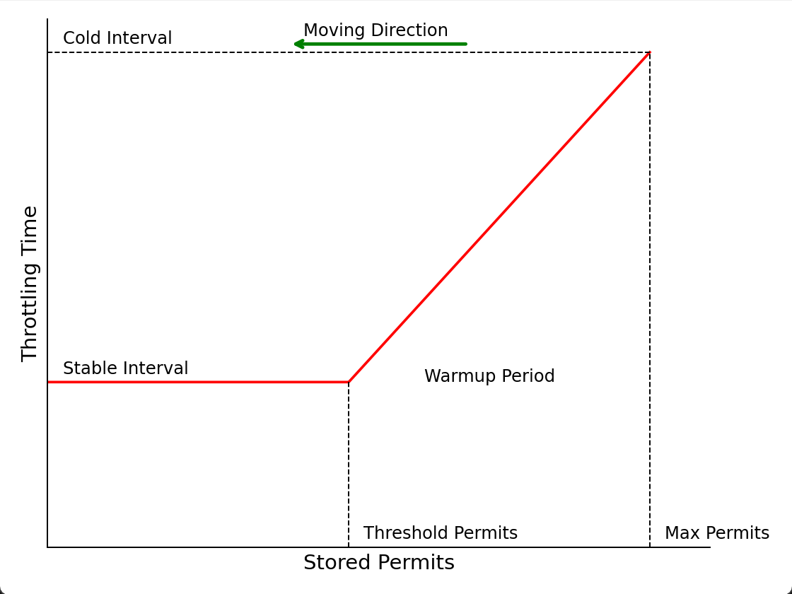

## 实例化

* 限流器的入口为`RateLimiter`，本质为实际上结合漏桶和令牌桶概念的限流算法。`RateLimiter`使用令牌桶缓存令牌，在流量低时令牌可以积累起来，从而允许在高峰时短时间内处理较多的请求，突发请求获得获得令牌即可被放行，允许一定程度的突发，更好的应对抖动的突发流量。同时使用漏桶算法限流思想，在请求量较大时强制排队，控制请求通过速率，避免瞬间过载，防止系统承受不稳定的压力。

* `RateLimiter`子类为`SmoothRateLimiter`实现平滑流量的限流器，`SmoothRateLimiter`有两个子类`SmoothBursty`和`SmoothWarmingUp`为具体的限流器实现。

* 组件设计遵循静态工厂方法代替构造函数的建议。`RateLimiter`提供静态工厂方法，替代原始的构造器。通过重载`create`方法，根据传入参数的不同，生成并返回不同的限流器实现类。

    如果获取限流器对象时，只传递了`QPS`和计时器工器，则返回`SmoothBursty`，使用不带预热的令牌桶限流算法；如果额外传递预热时长、预热冷因子，则返回带预热功能的`SmoothWarmingUp`，使用带预热的令牌桶限流算法。

```java
public abstract class RateLimiter {
    // 不带预热的令牌桶限流算法
    static RateLimiter create(double permitsPerSecond, SleepingStopwatch stopwatch) {
        RateLimiter rateLimiter = new SmoothBursty(stopwatch, 1.0 /* maxBurstSeconds */);
        rateLimiter.setRate(permitsPerSecond);
        return rateLimiter;
    }

    // 带预热的令牌桶限流算法
    static RateLimiter create(
            double permitsPerSecond,
            long warmupPeriod,
            TimeUnit unit,
            double coldFactor,
            SleepingStopwatch stopwatch) {
        RateLimiter rateLimiter = new SmoothWarmingUp(stopwatch, warmupPeriod, unit, coldFactor);
        rateLimiter.setRate(permitsPerSecond);
        return rateLimiter;
    }
}
```

* 在设施限流器流量上限时，添加了互斥锁`mutex`，保证对一个限流器对象的修改必须是单线程互斥的。这是因为在`doSetRate`方法中不仅更新流量上限，还涉及到内部状态的复杂计算，如剩余令牌数、下一个请求允许的时间等。这些状态的改变必须是原子操作，任何时候都不应该在多个线程之间交错执行。从而保证对共享状态的修改是安全且一致的。

```java
public abstract class RateLimiter {
    // 设置限流器稳定时的速率上限
    public final void setRate(double permitsPerSecond) {
        // 设置速率上限前需要获取互斥锁
        synchronized (mutex()) {
            // doSetRate方法由`SmoothBursty`和`SmoothWarmingUp`实现
            // doSetRate设计大量字段变量计算，需要互斥锁保证修改完整，限流器状态一致。
            doSetRate(permitsPerSecond, stopwatch.readMicros());
        }
    }

    private volatile Object mutexDoNotUseDirectly;
    // 双检查方式生成互斥锁
    private Object mutex() {
        Object mutex = mutexDoNotUseDirectly;
        if (mutex == null) {
            synchronized (this) {
                mutex = mutexDoNotUseDirectly;
                if (mutex == null) {
                    mutexDoNotUseDirectly = mutex = new Object();
                }
            }
        }
        return mutex;
    }
}
```

* `RateLimiter`使用了模板模式，在`RateLimiter`中定义限流器的初始化`doSetRate()`逻辑流程，而具体的实现交由其子类`SmoothBursty`和`SmoothWarmingUp`完成。

### `SmoothWarmingUp`初始化

* `SmoothWarmingUp`实现带预热的限流器。在实际系统中，当服务未达到一个稳定状态时，即仍在初始化时，服务的承载能力可能会远低于稳定状态，所以需要预热，让处理请求的数量缓缓增多。此时传统的令牌桶算法，当系统之前请求数较少，令牌桶中堆积大量令牌，此时突发大量请求，因为令牌桶中会有过往的令牌，能允许短时间内通过比阈值更大的流量，此时系统可能面临极大的压力，所以需要控制系统由空闲转为繁忙时，放行的请求数。

* `SmoothWarmingUp`设定令牌生成间隔和令牌桶中剩余令牌数成反比，通过这种策略，当系统处于空闲状态时，请求数突增，请求数达到冷启动阈值时，触发预热，流量缓缓增加，直到达到限流阈值。当单位时间请求数逐渐增大时，令牌生成间隔不断减少，单位时间放行的请求将逐渐增多，直至到达设定的最大放行请求数。等价于给冷系统一个预热的时间，给出额外时间进行初始化，避免流量突然增加时，大量请求直接获得令牌进入系统，瞬间把系统压垮。

    

* 当请求到来时，下图的横轴从左向右移动，堆积令牌数不断减少；当无请求到来时，横轴向右移动，堆积令牌数减少。

* 规定当无请求到来时，限流器以恒定的速率`mps/wp` 生成令牌，以确保从 0 到 `mps`时间等于 `wp`；

    规定当有请求到来时，如果桶内堆积令牌数大于`tps`，处于预热阶段，预热阶段令牌生成间隔和堆积令牌数成正比。当堆积令牌数为令牌桶允许最大容量时，令牌生成间隔`ci=cf/count`。堆积令牌等于预热阈值`tps`时，令牌生成间隔为`si=1/count`。整个预热时长`wp` ，随着堆积令牌数的减少，令牌生成间隔线性减少，直至堆积令牌数小于`tps`，令牌生成间隔稳定为`1/count`。

    

    

* 预热阈值`tps`的定义为：令牌数从`Max Permits`减少到0这个过程中，期望在稳定状态下的时间是总时间的 `1/cf`。对于曲线`Stored Permits-Throtting Time`，如果在横轴上取长为$\Delta permits$的区间，假设其长度极短，其与曲线取围成的图形可近似为矩形，矩形面积为
    $$
    \Delta permits\times interval=\Delta permits\times 1/QPS=\Delta t
    $$
    即围成面积为时间，即状态向左移动消耗 K 个许可所需的时间等于函数与横轴围成的面积。

    所以稳定阶段时长：
    
    
    $$
    sp=tps\times1/count
    $$
    
    根据定义稳定区间时间占据整个时长的比例为$1/cf$，Guava实现上为了保持和之前版本行为一致，`cf`被硬编码为3：
    $$
    \frac{sp}{sp+wp}=\frac{1}{3}
    $$
    求解得到预热开启阈值：
    $$
    tps=\frac{wp}{2si}
    $$
    预热阶段的时长为梯形面积：
    $$
    wp=\frac{(si+ci)\times(mps-tps)}{2}
    $$
    求解得到最大堆积令牌数：
    $$
    mps=tps+\frac{2wp}{si+ci}
    $$
    在预热阶段，令牌生成间隔与堆积令牌数曲线的斜率等于预热开始与终止时，令牌生成时间间隔之差除以预热开始与终止时令牌堆积数之差
    $$
    k=\frac{ci-si}{mps-tps}
    $$
    得到预热阶段令牌生成速率`wcount`与当前堆积令牌数`ps`的关系

$$
wcount=\frac{1}{(ps-tps)\times k+1/count}
$$

* 根据上述分析，`SmoothWarmingUp`的初始化参数与上述公式一致，可以看到由于需要更新大量数值，`doSetRate`方法需要加互斥锁，保证只能串行化更新限流器状态，保证限流器状态一致。

```java
static final class SmoothWarmingUp extends SmoothRateLimiter {
    // 预热时长wp
    private final long warmupPeriodMicros;
    // 预热期间令牌生成间隔-令牌堆积数直线斜率
    private double slope;
    // 预热期令牌桶堆积令牌阈值
    private double thresholdPermits;
    // 冷启动因子，令牌桶满时，令牌生成间隔ci=si*cf
    private double coldFactor;

    // 初始化限流器参数
    void doSetRate(double permitsPerSecond, double stableIntervalMicros) {
        double oldMaxPermits = maxPermits;
        // ci=si/cf
        double coldIntervalMicros = stableIntervalMicros * coldFactor;
        // tps=wp/(2*si)
        thresholdPermits = 0.5 * warmupPeriodMicros / stableIntervalMicros;
        //mps=tps+2*wp/(si+ci)
        maxPermits =thresholdPermits + 2.0 * warmupPeriodMicros / (stableIntervalMicros + coldIntervalMicros);
        // k=(ci-si)/(mps-tps)
        slope = (coldIntervalMicros - stableIntervalMicros) / (maxPermits - thresholdPermits);
    }
}
```

### `SmoothBursty`初始化

* `SmoothBursty`实现不带预热的令牌桶限流算法。限流器将以很低速率生成令牌，其默认的令牌桶默认可以缓存1s类生成的令牌，即最多可以缓存`permitsPerSecond`个令牌。

```java
static final class SmoothBursty extends SmoothRateLimiter {
	// 令牌桶容量
    final double maxBurstSeconds;
    void doSetRate(double permitsPerSecond, double stableIntervalMicros) {
        // maxBurstSeconds默认为1
        // 最多可以缓存`permitsPerSecond`个令牌。
        maxPermits = maxBurstSeconds * permitsPerSecond;
    }
}
```

## 获取令牌

* Guava限流器实现较为特别。相较于`Sentinel`的令牌桶限流方法，直接判断令牌桶是否有足够的令牌，如果有则放行，如果没有则直接拒绝。即请求只有放行个拒绝两种情况，请求不会柱塞等待。Guava限流器会在没有足够令牌发放时，==采用滞后处理的方式，前一个请求获取令牌所需等待的时间由下一次请求来承受，也就是代替前一个请求进行等待。==
* 尝试获取令牌的逻辑定义在`RateLimiter`中，由于`RateLimiter`允许预消费，当前请求需要等待前一次请求造成的等待时间结束后才可以获取令牌，先计算前一个请求造成的等待时间还剩多长，之后休眠前一个请求造成的等待时间，填补时间空缺，实现流量控制。具体在获取剩余等待时间时，同样需要加锁，保证互斥更新限流器状态，保证限流器状态一致。更为具体的计算逻辑在`SmoothRateLimiter#reserveEarliestAvailable`中

```java
public abstract class RateLimiter {
    public double acquire(int permits) {
        // 计算前一个请求造成的等待时间
        long microsToWait = reserve(permits);
        // 休眠前一个请求造成的等待时间
        stopwatch.sleepMicrosUninterruptibly(microsToWait);
        return 1.0 * microsToWait / SECONDS.toMicros(1L);
    }

    final long reserve(int permits) {
        // 互斥锁更新限流器状态，保证限流器状态一致
        synchronized (mutex()) {
            return reserveAndGetWaitLength(permits, stopwatch.readMicros());
        }
    }
}
```

### 超前消费

* `SmoothRateLimiter#reserveEarliestAvailable`用于更新令牌桶剩余令牌数，并计算当前申请的令牌数造成的超强消费，需要等待多长时间。首先更新前一次放行和当前时刻之前生成的令牌数，如果累计令牌够当前请求消费，则累计令牌减去当前消费令牌，下一次请求可以获取令牌的起始时间即为当前；如果累计令牌不够当前请求消费，需要计算计算超前消费造成的等待时间空洞，时间空洞造成的柱塞将有下一次申请承担。

```java
abstract class SmoothRateLimiter extends RateLimiter {
    // 下一次请求可以获取令牌的起始时间
    private long nextFreeTicketMicros = 0L;

    final long reserveEarliestAvailable(int requiredPermits, long nowMicros) {
        // 更新剩余令牌数
        resync(nowMicros);
        long returnValue = nextFreeTicketMicros;
        // 计算超前消费令牌数
        double storedPermitsToSpend = min(requiredPermits, this.storedPermits);
        double freshPermits = requiredPermits - storedPermitsToSpend;
        // 计算超前消费造成的等待时间空洞
        long waitMicros =
                storedPermitsToWaitTime(this.storedPermits, storedPermitsToSpend)
                        + (long) (freshPermits * stableIntervalMicros);
        // 更新剩余令牌和下一次请求可以获取令牌的起始时间
        this.nextFreeTicketMicros = LongMath.saturatedAdd(nextFreeTicketMicros, waitMicros);
        this.storedPermits -= storedPermitsToSpend;
        return returnValue;
    }
}
```

### 刷新令牌桶

* 在更新前一次放行和当前时刻之前生成的令牌数时，需要判断当前时刻是否已经到达可以获取令牌的起始时间`nextFreeTicketMicros`，由于`nextFreeTicketMicros`之前时刻生成的令牌用于填补上一次超前消费造成的负债，并不能用于当前请求的消费。只有大于`nextFreeTicketMicros`时刻生成的令牌才能用于当前请求消费。

```java
abstract class SmoothRateLimiter extends RateLimiter {
    // 更新前一次放行和当前时刻之前生成的令牌数
    void resync(long nowMicros) {
        // `nextFreeTicketMicros`之前时刻生成的令牌用于填补上一次超强消费造成的负债，并不能用于当前请求的消费。
        // 只有大于`nextFreeTicketMicros`时刻生成的令牌才能用于当前请求消费。
        if (nowMicros > nextFreeTicketMicros) {
            double newPermits = (nowMicros - nextFreeTicketMicros) / coolDownIntervalMicros();
            storedPermits = min(maxPermits, storedPermits + newPermits);
            nextFreeTicketMicros = nowMicros;
        }
    }
}
```

* 在计算无请求到来时生成的令牌数时`newPermits`时，不同的限流器有不同的令牌生成间隔。`SmoothBursty`限流器由于没有预热功能，以恒定的速率生成令牌，所以其令牌生成间隔恒定为`si`；`SmoothWarmingUp`限流器由于有预热功能，根据定义：当没有请求到来时，将以`wp/mps`的间隔生成令牌，以保证堆积令牌数从0到`mps`的时间等于预热时间`wp`。

```java
// SmoothBursty
double coolDownIntervalMicros() {
  return stableIntervalMicros;
}
// SmoothWarmingUp
double coolDownIntervalMicros() {
  return warmupPeriodMicros / maxPermits;
}
```

### 令牌发放成本

* 对于如何发放已存储令牌，不同的限流器有不同的实现。`SmoothBursty`更加关注由堆积令牌造成的资源利用不充分，当请求到达时，以无成本的方式向请求发放令牌，请求可以免费获得资源，尽快提高资源利用率，此时存储许可发放速率比比新许可生成速率更快。

```java
// SmoothBursty
long storedPermitsToWaitTime(double storedPermits, double permitsToTake) {
    // 令牌发放无成本
  return 0L;
}
```

* `SmoothWarmingUp`限流器更加关注机器资源超负荷溢出的问题，令牌发放是有成本的，类似于漏桶的行为。缓存的令牌不会立即被全部使用，而是需要一定的延迟来逐步消耗，防止节点超负荷运行，确保系统在高峰期间依旧可以平稳运行。

    例如机器每秒可以处理10个请求，即`QPS=10`，`t=0,t=1`时刻无请求，此时令牌桶中堆积20个令牌，`t=2`时到来大量请求，将有20个请求获得令牌被放行。但是`t=0,t=1`时刻空闲的计算资源无法累计到`t=2`时刻，`t=2`时刻计算资源上限仍然为10。此时机器超负荷运转，需要至少2s的时间处理放行的20个请求，下一次请求放行时间不应该是`t=3`而是`t=4`。即令牌请求发送的成本转接到下一次请求，通过延迟下一次请求放行时间达到防止机器超负荷运行的目的。

* `SmoothWarmingUp`限流器使用带预热的生成间隔曲线计算获取缓存令牌的时间成本。具体计算方式是计算曲线与横轴间面积即为生成横轴对应区间令牌数的时间。

    如果当前缓存令牌数`sps`超过预热阈值`tps`，且获取的令牌数`rps`小于等于当前已缓存令牌数减去预热阈值`sp- tps`，则获取缓存令牌的时间成本即为蓝色的梯形面积：
    $$
    time=[k(sps-tps)+si+k(sps-rps-tps)+si] \frac{rps}{2}
    $$
    

    

    如果当前缓存令牌数`sps`超过预热阈值`tps`，且获取的令牌数`rps`大于当前已缓存令牌数减去预热阈值`sp- tps`，则获取缓存令牌的时间成本分为下图`p0,p1`两个部分面积之和：
    $$
    time=[rps-(sps-tps)]si+[si+k(sps-tps)+si]\frac{sps-tps}{2}
    $$
    

    

```java
// SmoothWarmingUp
// 计算令牌发放成本，并将成本转接到下一次请求，防止机器超负荷运行
long storedPermitsToWaitTime(double storedPermits, double permitsToTake) {
    double availablePermitsAboveThreshold = storedPermits - thresholdPermits;
    long micros = 0;
    // 是否获取预热器生成的令牌
    if (availablePermitsAboveThreshold > 0.0) {
        // 需要获取的位于预热器生成令牌数
        double permitsAboveThresholdToTake = min(availablePermitsAboveThreshold, permitsToTake);
        // 蓝色梯形上下底边之和
        double length =
                permitsToTime(availablePermitsAboveThreshold)
                        + permitsToTime(availablePermitsAboveThreshold - permitsAboveThresholdToTake);
        // 蓝色梯形面积
        // 即缓存令牌数从thresholdPermits+permitsAboveThresholdToTake到thresholdPermits+availablePermitsAboveThreshold 所需时间
        micros = (long) (permitsAboveThresholdToTake * length / 2.0);
        // 获取的令牌有稳定期生成的数量
        permitsToTake -= permitsAboveThresholdToTake;
    }
    // 累加稳定器生成所需令牌时间，即橘色部分面积
    micros += (long) (stableIntervalMicros * permitsToTake);
    return micros;
}
// 计算生成令牌时间间隔
private double permitsToTime(double permits) {
  return stableIntervalMicros + permits * slope;
}
```

