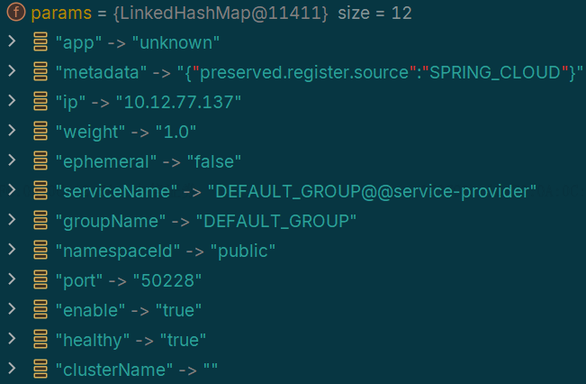

## 

[toc]

## 服务注册机制

### 开启注册配置原理

* 服务自动注册可以通过使用注解`EnableDiscoveryClient`实现。该注解本质上是在配置项中开启自动服务注册，第三方服务组件根据`Spring-Cloud-Commons`中的`discovery,serviceregistry`模块标准规范，读取配置，实现自己的服务发现和注册机制。

* `EnableDiscoveryClient`注解的作用是手动引入选择器组件`EnableDiscoveryClientImportSelector`

```java
@Import(EnableDiscoveryClientImportSelector.class)
public @interface EnableDiscoveryClient {
	boolean autoRegister() default true;
}
```

* `EnableDiscoveryClientImportSelector`继承`SpringFactoryImportSelector`，用于选择需要装配的配置类。`selectImports`将根据是否开启自动注册，决定是否导入配置类`AutoServiceRegistrationConfiguration`，是的配置项生效。

```java
public class EnableDiscoveryClientImportSelector extends SpringFactoryImportSelector<EnableDiscoveryClient> {
    // 选择需要装配的配置类
	@Override
	public String[] selectImports(AnnotationMetadata metadata) {
		String[] imports = super.selectImports(metadata);
		AnnotationAttributes attributes = AnnotationAttributes
				.fromMap(metadata.getAnnotationAttributes(getAnnotationClass().getName(), true));
		boolean autoRegister = attributes.getBoolean("autoRegister");
        // 是否开启自动注册
		if (autoRegister) {
			List<String> importsList = new ArrayList<>(Arrays.asList(imports));
            // 手动导入配置类AutoServiceRegistrationConfiguration
importsList.add("org.springframework.cloud.client.serviceregistry.AutoServiceRegistrationConfiguration");
			imports = importsList.toArray(new String[0]);
		}
		return imports;
	}
```

* `AutoServiceRegistrationConfiguration`的作用是将配置信息`AutoServiceRegistrationProperties`装配为Bean放入容器中，用于服务自动注册的配置数据源。

```java
@EnableConfigurationProperties(AutoServiceRegistrationProperties.class)
public class AutoServiceRegistrationConfiguration {
}
```

* `AutoServiceRegistrationProperties`中保存是否开启自动注册、管理类的配置信息，以及快速失败策略。

```java
@ConfigurationProperties("spring.cloud.service-registry.auto-registration")
public class AutoServiceRegistrationProperties {
    // 等价于添加配置型 spring.cloud.service-registry.auto-registration.enabled= true
	private boolean enabled = true;
	private boolean registerManagement = true;
	private boolean failFast = false;
}
```

### 


### 启动配置类

* Nacos主动注册的启动包`com.alibaba.cloud.nacos.discovery`的`META-INF/Spring/org.springframework.boot.autoconfigure.AutoConfiguration.imports`添加配置类信息

```
com.alibaba.cloud.nacos.registry.NacosServiceRegistryAutoConfiguration
```

* `META-INF/Spring/xxx.imports`为`SpringBoot3`新引入特性，作用和`Spring.factories`相似，都是在模块启动时加在装配指定的配置类。

* 自动注册配置类`NacosServiceRegistryAutoConfiguration`使用条件装配，当`spring.cloud.service-registry.auto-registration.enabled=true`时被装配，通过添加注解`EnableDiscoveryClient`，该配置项目已设置为`true`。

  生成Bean中`NacosServiceRegistry`用于执行向NacosServer执行注册操作，`NacosAutoServiceRegistration`接收`NacosServiceRegistry`作为构造器参数，用于在`WebServer`就绪时，调用`NacosServiceRegistry`完成自动注册。

```java
// AutoServiceRegistrationProperties配置了enabled=true，当前配置类将被装配
@ConditionalOnProperty(value = "spring.cloud.service-registry.auto-registration.enabled",
		matchIfMissing = true)
public class NacosServiceRegistryAutoConfiguration {
	@Bean
	public NacosServiceRegistry nacosServiceRegistry(
			NacosServiceManager nacosServiceManager,
			NacosDiscoveryProperties nacosDiscoveryProperties) {
		return new NacosServiceRegistry(nacosServiceManager, nacosDiscoveryProperties);
	}
	@Bean
	@ConditionalOnBean(AutoServiceRegistrationProperties.class)
	public NacosAutoServiceRegistration nacosAutoServiceRegistration(
			NacosServiceRegistry registry,
			AutoServiceRegistrationProperties autoServiceRegistrationProperties,
			NacosRegistration registration) {
		return new NacosAutoServiceRegistration(registry,
				autoServiceRegistrationProperties, registration);
	}
}
```

### 注册行为发起

* 自动注册协调类`NacosAutoServiceRegistration`继承自`AbstractAutoServiceRegistration`。`AbstractAutoServiceRegistration`实现了`ApplicationListener`接口，用于监听服务就绪事件`WebServerInitializedEvent`。当事件发布时，触发服务注册，而注册的真正执行者为作为构造器参数传入的`NacosServiceRegistry`。

```java
public abstract class AbstractAutoServiceRegistration<R extends Registration>
		implements ApplicationListener<WebServerInitializedEvent> {
    // 监听服务就绪事件 WebServerInitializedEvent
	public void onApplicationEvent(WebServerInitializedEvent event) {
		this.port.compareAndSet(0, event.getWebServer().getPort());
		this.start();
	}
	// 委托NacosServiceRegistry完成注册
	protected void register() {
		this.serviceRegistry.register(getRegistration());
	}
}
```

* `NacosServiceRegistry`实现了`spring-cloud-commons`提供的`ServiceRegistry`接口，重写了register方法，在register方法中将配置文件装换成Instance实例。在`NacosServiceRegistry#register`方法，在设置完服务ID、group后，调用命名服务器`NamingService#registerInstance`方法注册服务实例。

```java
public class NacosServiceRegistry implements ServiceRegistry<Registration> {
	@Override
	public void register(Registration registration) {
        // 基本参数设置
		NamingService namingService = namingService();
		String serviceId = registration.getServiceId();
		String group = nacosDiscoveryProperties.getGroup();
		Instance instance = getNacosInstanceFromRegistration(registration);
		namingService.registerInstance(serviceId, group, instance);
	}
```

* 命名服务器`NamingService`为当前服务实例设置IP、port、负载均衡权重、集群名称后传递到下游的命名服务器客户端代理，执行`NamingHttpClientProxy#registerService`方法。

```java
public class NacosNamingService implements NamingService {
    public void registerInstance(String serviceName, String groupName, String ip, int port, String clusterName){
        // 设置基本参数
        Instance instance = new Instance();
        instance.setIp(ip);
        instance.setPort(port);
        instance.setWeight(1.0);
        instance.setClusterName(clusterName);
        registerInstance(serviceName, groupName, instance);
    }
```

### 注册行为执行

* `NamingHttpClientProxy#registerService`方法中，将根据当前服务实例是否是临时实例（实例的生命周期通常由客户端的心跳机制来维持），以及NacosServer是否支持RPC协议，决定使用`HTTP`或者`gRPC`方式完成服务注册。

#### 使用`HTTP`协议

* 如果使用`HTTP`协议，将由`NamingHttpClientProxy`代理命名服务器客户端，根据当前服务实例构建`HTTP`请求头信息，传递到`callServer`方法，构建请求URL，并通过`NacosRestTemplate`向NacosServer发送服务注册请求，完成注册。

```java
public class NamingHttpClientProxy extends AbstractNamingClientProxy {
    public void registerService(String serviceName, String groupName, Instance instance) throws NacosException {
        // 请求头参数
        final Map<String, String> params = new HashMap<>(32);
        params.put(CommonParams.NAMESPACE_ID, namespaceId);
        params.put(CommonParams.SERVICE_NAME, groupedServiceName);
        params.put(CommonParams.GROUP_NAME, groupName);
        params.put(CommonParams.CLUSTER_NAME, instance.getClusterName());
        params.put(IP_PARAM, instance.getIp());
        params.put(PORT_PARAM, String.valueOf(instance.getPort()));
        params.put(WEIGHT_PARAM, String.valueOf(instance.getWeight()));
        params.put(REGISTER_ENABLE_PARAM, String.valueOf(instance.isEnabled()));
        params.put(HEALTHY_PARAM, String.valueOf(instance.isHealthy()));
        params.put(EPHEMERAL_PARAM, String.valueOf(instance.isEphemeral()));
        params.put(META_PARAM, JacksonUtils.toJson(instance.getMetadata()));
        reqApi(UtilAndComs.nacosUrlInstance, params, HttpMethod.POST);
    }
    
 public String callServer(String api, Map<String, String> params, Map<String, String> body, String curServer,
            String method) {
        String namespace = params.get(CommonParams.NAMESPACE_ID);
        String group = params.get(CommonParams.GROUP_NAME);
        String serviceName = params.get(CommonParams.SERVICE_NAME);
        params.putAll(getSecurityHeaders(namespace, group, serviceName));
        Header header = NamingHttpUtil.builderHeader();
        String url;
     	// 通过POST方法向服务注册地址 http://127.0.0.1:8848/nacos/v1/ns/instance 发起请求
        url = NamingHttpClientManager.getInstance().getPrefix() + curServer + api;
        HttpRestResult<String> restResult = nacosRestTemplate.exchangeForm(url, header,
                    Query.newInstance().initParams(params), body, method, String.class);
    }
}
```



#### 使用`gRPC`协议

* Nacos2.0新增`gRPC`协议作为默认的服务注册协议，`gRPC`使用`HTTP2`协议跟服务端建立长连接，相较于`HTTP`协议下频繁创建和销毁连接，使用`gRPC`协议可以降低服务器资源消耗，提升服务注册流程的性能。此时将由`NamingGrpcClientProxy`代理命名服务器客户端，完成服务注册。

```java
public class NamingGrpcClientProxy extends AbstractNamingClientProxy {
    
    public void registerService(String serviceName, String groupName, Instance instance) {
    if (instance.isEphemeral()) {
        // 临时实例
        registerServiceForEphemeral(serviceName, groupName, instance);
    } else {
        // 永久实例
        doRegisterServiceForPersistent(serviceName, groupName, instance);
    }
    
    private void registerServiceForEphemeral(String serviceName, String groupName, Instance instance){
     // 将服务实例存储到客户端缓存
    redoService.cacheInstanceForRedo(serviceName, groupName, instance);
    doRegisterService(serviceName, groupName, instance);
    }

    private <T extends Response> T requestToServer(AbstractNamingRequest request, Class<T> responseClass){
    Response response = null;
    request.putAllHeader(getSecurityHeaders(request.getNamespace(), request.getGroupName(), request.getServiceName()));
    }
}
    
```

* 对于临时实例将被缓存到客户端缓存，用于客户端与服务端重新建立连接时自动注册到服务端。之后进入`requestToServer`执行注册请求的发送，完成服务单位注册。注册请求中包含实例对象以及实例所对应的服务基本信息。


### 保活机制

* 对于一个实例和健康状态相关的属性有：是否健康、是否开启、是否是临时实例。其中临时实例是指在服务注册时被标记为“短暂”的实例，会根据需求随时上线或者下线实例。与之相对应好的是永久实例，该种实例将会一直在线，例如数据节点实例。

```java
public class Instance implements Serializable {
    private boolean healthy = true;
    private boolean enabled = true;
    // 是否是临时实例
    private boolean ephemeral = true;
}
```

#### 临时实例保活机制

* 对于临时实例，老版本Nacos使用主动上传`BeatInfo`，完成自身实例保活。新版本Nacos要求临时实例必须通过`gRPC`协议完成与Nacos的通信。`gRPC`协议底层使用`HTTP2`通信协议，通过gGPC主动发起心跳，保持`HTTP2`长连接。Nacos通过检测连接是否存在来判断服务实例是否可用，主动心跳上报已废弃。如果客户端和注册中心的连接断开，那么注册中心会主动剔除该client所注册的服。

```java
public class NamingClientProxyDelegate implements NamingClientProxy {
    // 通过客户端完成服务注册
    public void deregisterService(String serviceName, String groupName, Instance instance){
        getExecuteClientProxy(instance).deregisterService(serviceName, groupName, instance);
    }
    private NamingClientProxy getExecuteClientProxy(Instance instance) {
        // 如果是临时实例或者Nacos支持GRPC协议，将使用GRPC完成与Nacos的通信
        if (instance.isEphemeral() || grpcClientProxy.isAbilitySupportedByServer(AbilityKey.SERVER_SUPPORT_PERSISTENT_INSTANCE_BY_GRPC)) {
            return grpcClientProxy;
        }
        return httpClientProxy;
    }
}
```

* NacosServer同时存在主动检测机制，`NacosServer`通过定时任务，每隔`3s`检查超过`20s`没有发送请求数据的连接。并向对应的客户端发送一个存活探测请求，如果请求不通或者响应失败，NacosServer将认为服务实例不可用，服务实例将从服务注册表中剔除。


#### 永久实例保活机制

* 对于永久实例的的健康检查，Nacos 采用注册中心探测机制，注册中心会在持久化服务初始化时根据客户端选择的协议类型注册探活的定时任务。

## 服务发现

* `spring-cloud-commons`模块给定了服务发现规范，第三方中间件需要实现`DiscoveryClient`接口，执行自定义的服务发现规则。

    `Nacos`提供主动查询和服务订阅这两种服务发现方式

    - 主动查询：客户端主动向服务端查询需要关注的服务实例，也就是拉(pull)的模式。
    - 服务订阅：客户端向服务端发送一个订阅服务的请求，当被订阅的服务有信息变动就会主动将服务实例的信息推送给订阅的客户端，本质就是推（push）模式，默认使用推送模式。

### 服务订阅

* 服务发现客户端实现了`spring-cloud-commons`模块定义的服务发现接口`DiscoveryClient`。当第一次发起调用时，由服务发现客户端触发获取服务实例。`NacosDiscoveryClient#getInstances`就是服务发现的入口，内部涉及通信协议、订阅流程、本地缓存、故障转移等。

```java
public class NacosDiscoveryClient implements DiscoveryClient
    
    public List<ServiceInstance> getInstances(String serviceId) {
    return Optional.of(serviceDiscovery.getInstances(serviceId))
            .map(instances -> {
                ServiceCache.setInstances(serviceId, instances);
                return instances;
            }).get();
}
```

* 服务发现的请求将流转到命名服务器`NacosNamingService#getServiceInfoBySubscribe`，方法参数有服务名称、分组名、集群列表、是否订阅。方法中先到缓存中查询服务实例，订阅机制会自动同步实例信息本地，如果本地缓存没有命中，证明当前是第一次服务调用，需要向Nacos订阅服务，以在后续获得可用服务实例。

```java
public class NacosNamingService implements NamingService {
    
  private ServiceInfo getServiceInfoBySubscribe(String serviceName, String groupName, String clusterString,boolean subscribe) {
        ServiceInfo serviceInfo;
        // 尝试从缓存中获取服务实例
        serviceInfo = serviceInfoHolder.getServiceInfo(serviceName, groupName, clusterString);
        if (null == serviceInfo || !clientProxy.isSubscribed(serviceName, groupName, clusterString)) {
            // 不存在缓存，需要发起服务订阅
            serviceInfo = clientProxy.subscribe(serviceName, groupName, clusterString);
        }
        return serviceInfo;
    }
}
```

* 订阅服务请求将被委托给`NamingClientProxyDelegate`，此处同样先到缓存中查询服务信息例，当不存在实例信息时，才会向Nacos继续发起服务订阅，同时还会开启定时任务实现实例信息同步。

```java
public class NamingClientProxyDelegate implements NamingClientProxy {
    public ServiceInfo subscribe(String serviceName, String groupName, String clusters) {
        String serviceNameWithGroup = NamingUtils.getGroupedName(serviceName, groupName);
        String serviceKey = ServiceInfo.getKey(serviceNameWithGroup, clusters);
        // 开启服务同步定时任务
        serviceInfoUpdateService.scheduleUpdateIfAbsent(serviceName, groupName, clusters);
        // 先到缓存中查询服务信息
        ServiceInfo result = serviceInfoHolder.getServiceInfoMap().get(serviceKey);
        if (null == result || !isSubscribed(serviceName, groupName, clusters)) {
            // 当不存在实例信息时，才会向Nacos继续发起服务订阅
            result = grpcClientProxy.subscribe(serviceName, groupName, clusters);
        }
        // 加入缓存
        serviceInfoHolder.processServiceInfo(result);
        return result;
    }
}
```

* 订阅模式只在使用`gRPC`协议时生效，订阅请求需要通过`NamingGrpcClientProxy`构建并发送。构建的请求中包含目标服务的分组、命名空间、集群、服务名称。请求最终由`RpcClient`发出，最终得到目标服务实例列表，完成第一次服务实例获取与服务订阅，后续当订阅服务的实例发生变化时，客户端将自动收到更新的实例信息。

```java
public class NamingGrpcClientProxy extends AbstractNamingClientProxy {
    public ServiceInfo doSubscribe(String serviceName, String groupName, String clusters){
        // 构建订阅请求
        SubscribeServiceRequest request = new SubscribeServiceRequest(namespaceId, groupName, serviceName, clusters,true);
        // 发送请求
        SubscribeServiceResponse response = requestToServer(request, SubscribeServiceResponse.class);
        redoService.subscriberRegistered(serviceName, groupName, clusters);
        return response.getServiceInfo();
    }
```


### 主动实例更新

* 当发起服务订阅时，先是否开启异步订阅，以及当前服务是否已经存在的更新任务，如果当前未开启异步订阅以及当前服务不存在的更新任务，则会创建延时任务完成从Nacos更新服务信息，延时任务默认延迟1S执行。所以主动拉取模式和被动推送模式只能二选一。

```java
public class ServiceInfoUpdateService implements Closeable {
	public void scheduleUpdateIfAbsent(String serviceName, String groupName, String clusters) {
        // 是否开启异步订阅，默认开启
        if (!asyncQuerySubscribeService) {
            return;
        }
        // 当前服务是否已经存在的更新任务
        String serviceKey = ServiceInfo.getKey(NamingUtils.getGroupedName(serviceName, groupName), clusters);
        if (futureMap.get(serviceKey) != null) {
            return;
        }
        synchronized (futureMap) {
            if (futureMap.get(serviceKey) != null) {
                return;
            }
        // 创建定时任务完成从Nacos更新服务信息
        ScheduledFuture<?> future = addTask(new UpdateTask(serviceName, groupName, clusters));
        futureMap.put(serviceKey, future);
        }
    }
    private synchronized ScheduledFuture<?> addTask(UpdateTask task) {
        // 定时任务默认1S同步一次
        return executor.schedule(task, DEFAULT_DELAY, TimeUnit.MILLISECONDS);
    }
    
}
```

* 延时任务`UpdateTask`用于固定延时从Nacos主动拉取服务实例信息，拉取成功后在内存中记录最新的的`ServiceInfo`数据，同时会比对`ServiceInfo`是否发生了变更。如果`ServiceInfo`发生了变更，则发布`InstancesChangeEvent`事件，同时将`ServiceInfo`写入本地缓存。最后再次构建延时任务，用于下次更新服务实例。

```java
public class UpdateTask implements Runnable {
    public void run() {
        long delayTime = DEFAULT_DELAY;
        // 参看当前服务是否已经存在NacosWatch处理逻辑，如果存在则放弃主动更新
        if (!changeNotifier.isSubscribed(groupName, serviceName, clusters) && !futureMap.containsKey( serviceKey)) {
            isCancel = true;
            return;
        }
         // 获取本地缓存中的service信息
        ServiceInfo serviceObj = serviceInfoHolder.getServiceInfoMap().get(serviceKey);
        if (serviceObj == null) {
            // 直接从服务的拉去最新的Service信息
            serviceObj = namingClientProxy.queryInstancesOfService(serviceName, groupName, clusters, false);
            // 更新实例信息
            serviceInfoHolder.processServiceInfo(serviceObj);
            // TODO multiple time can be configured.
            delayTime = serviceObj.getCacheMillis() * DEFAULT_UPDATE_CACHE_TIME_MULTIPLE;
            lastRefTime = serviceObj.getLastRefTime();
            return;
        }
		// 如果服务的最新更新时间小于等于最后一次拉取数据的时间，从注册中心重新查询
        if (serviceObj.getLastRefTime() <= lastRefTime) {
            serviceObj = namingClientProxy.queryInstancesOfService(serviceName, groupName, clusters, false);
            // 在内存中记录最新的的ServiceInfo数据，同时会比对ServiceInfo是否发生了变更。
            // 如果ServiceInfo发生了变更，则发布InstancesChangeEvent事件，同时将ServiceInfo写入本地缓存
            serviceInfoHolder.processServiceInfo(serviceObj);
        }
        // 下次更新缓存时间设置，默认6秒
        lastRefTime = serviceObj.getLastRefTime();
        delayTime = serviceObj.getCacheMillis() * DEFAULT_UPDATE_CACHE_TIME_MULTIPLE;
        // 定义下一次延时任务
        executor.schedule(this, Math.min(delayTime << failCount, DEFAULT_DELAY * 60), TimeUnit.MILLISECONDS);
    }
}
```

### 被动实例更新

* 除了客户端主动从Nacos拉取某个服务实例信息，客户端也可以通过订阅的方式，即使用推模式的方式被动获取Nacos推送的实例信息。

#### WatchDog机制

* Nacos主动注册的启动包`com.alibaba.cloud.nacos.discovery`的`META-INF/Spring/org.springframework.boot.autoconfigure.AutoConfiguration.imports`添加配置类信息

```
com.alibaba.cloud.nacos.discovery.NacosDiscoveryClientConfiguration
```

* 配置类`NacosDiscoveryClientConfiguration`在开启服务发现，并且手动配置`spring.cloud.nacos.discovery.watch.enabled=true`时才被实例化，默认状态下不会触发被动推送模式，原因见 https://github.com/alibaba/spring-cloud-alibaba/issues/2868。

```java
@ConditionalOnDiscoveryEnabled
public class NacosDiscoveryClientConfiguration {
	/**
	 * NacosWatch is no longer enabled by default .
	 * see https://github.com/alibaba/spring-cloud-alibaba/issues/2868
	 */
	@Bean
	@ConditionalOnMissingBean
	@ConditionalOnProperty(value = "spring.cloud.nacos.discovery.watch.enabled", matchIfMissing = false)
	public NacosWatch nacosWatch(NacosServiceManager nacosServiceManager,
			NacosDiscoveryProperties nacosDiscoveryProperties) {
		return new NacosWatch(nacosServiceManager, nacosDiscoveryProperties);
	}
}
```

* `NacosWatch`实现了`Lifecycle`接口，通过Spring容器自动启动和停止，通常用于需要管理生命周期的资源或服务，如消息监听器、后台任务等。在`start`方法构建`EventListener`用于监听Nacos推送实例事件，并向`NamingService`主动订阅服务实例。当收到Nacos推送服务实例信息时，触发执行更新实例信息的`metadata`。

```java
public class NacosWatch implements SmartLifecycle, DisposableBean {
    @Override
	public void start() {
		if (this.running.compareAndSet(false, true)) {
            // 监听Nacos推送实例事件
			EventListener eventListener = listenerMap.computeIfAbsent(buildKey(),
					event -> new EventListener() {
						@Override
						public void onEvent(Event event) {
							if (event instanceof NamingEvent namingEvent) {
                                // 触发执行更新实例信息的`metadata`
								List<Instance> instances = namingEvent.getInstances();
								Optional<Instance> instanceOptional = selectCurrentInstance(
										instances);
								instanceOptional.ifPresent(currentInstance -> {
									resetIfNeeded(currentInstance);
								});
							}
						}
					});

			NamingService namingService = nacosServiceManager.getNamingService();
			// 向NamingService主动订阅服务实例
			namingService.subscribe(properties.getService(), properties.getGroup(),
						Arrays.asList(properties.getClusterName()), eventListener);
		}
	}
```

* `NacosNamingService#subscribe`方法，相较于`NacosNamingService#getServiceInfoBySubscribe`的主要区别在于前者参数有`EventListener`，并且将`EventListener`注入`InstancesChangeNotifier`中，当实例信息发生变化时，将主动执行`EventListener`中定义的更新实例逻辑。

```java
public class NacosNamingService implements NamingService {
    public void subscribe(String serviceName, String groupName, List<String> clusters, EventListener listener){
        String clusterString = StringUtils.join(clusters, ",");
        // 注册Listener，当实例信息发生变化时，将主动执行`EventListener`中定义的更新实例逻辑
        changeNotifier.registerListener(groupName, serviceName, clusterString, listener);
        clientProxy.subscribe(serviceName, groupName, clusterString);
    }
}
```

* `InstancesChangeNotifier#registerListener`将`EventListener`存储在`ConcurrentHashMap<String, ConcurrentHashSet>`中，其中`key`是服务标识，`value`是监听该`key`对应的`EventListener`的集合。注意在`UpdateTask#run`方法中会判断当前服务是否已经存在NacosWatch监听器，如果存在则不会执行主动拉取实例信息的任务。

```java
public class InstancesChangeNotifier extends Subscriber<InstancesChangeEvent> {
        public void registerListener(String groupName, String serviceName, String clusters, EventListener listener) {
        String key = ServiceInfo.getKey(NamingUtils.getGroupedName(serviceName, groupName), clusters);
        // 将EventListener加入所监听的服务为key的集合中
        ConcurrentHashSet<EventListener> eventListeners = listenerMap.computeIfAbsent(key, keyInner -> new ConcurrentHashSet<>());
        eventListeners.add(listener);
    }
}
```

#### 服务端更新请求

* 在`NamingGrpcClientProxy#start`方法中定义了当`RpcClient`接收到Nacos推送的服务实例更新信息时，将`NamingPushRequestHandler#requestReply`方法作为回调。

```java
public class NamingGrpcClientProxy extends AbstractNamingClientProxy {
    private void start(ServerListFactory serverListFactory, ServiceInfoHolder serviceInfoHolder) throws NacosException {
        rpcClient.serverListFactory(serverListFactory);
        rpcClient.registerConnectionListener(redoService);
        // 当`RpcClient`接收到Nacos推送的服务实例更新信息时回调
        rpcClient.registerServerRequestHandler(new NamingPushRequestHandler(serviceInfoHolder));
        rpcClient.start();
        NotifyCenter.registerSubscriber(this);
    }
}
```

* 在`NamingGrpcClientProxy#start`中接收Nacos服务的主动推送实例信息，更新请求中包括实例命名空间、服务名、分组等基本元数据。之后执行`ServiceInfoHolder#processServiceInfo`方法，用于更新服务实例信息。

```java
public class NamingPushRequestHandler implements ServerRequestHandler {
    public Response requestReply(Request request, Connection connection) {
        if (request instanceof NotifySubscriberRequest) {
            NotifySubscriberRequest notifyRequest = (NotifySubscriberRequest) request;
            // 在内存中记录最新的的ServiceInfo数据，同时会比对ServiceInfo是否发生了变更。
            // 如果ServiceInfo发生了变更，则发布InstancesChangeEvent事件，同时将ServiceInfo写入本地缓存
            serviceInfoHolder.processServiceInfo(notifyRequest.getServiceInfo());
            return new NotifySubscriberResponse();
        }
        return null;
    }
}
```


* `ServiceInfoHolder#processServiceInfo`方法主要是在内存中记录最新的的`ServiceInfo`数据，同时会比对`ServiceInfo`是否发生了变更。如果`ServiceInfo`发生了变更，则发布`InstancesChangeEvent`事件，同时将`ServiceInfo`写入本地缓存。如果开启了`NacosWatch`，此时注册在`InstancesChangeNotifier`中的监听器将收到事件触发通知，`EventListener`中定义逻辑被触发执行，完成服务实例元数据的更新。

```java
public class ServiceInfoHolder implements Closeable {
    public ServiceInfo processServiceInfo(ServiceInfo serviceInfo) {
        // 缓存服务信息
        serviceInfoMap.put(serviceInfo.getKey(), serviceInfo);
        // 判断注册的实例信息是否已变更
        boolean changed = isChangedServiceInfo(oldService, serviceInfo);
        if (StringUtils.isBlank(serviceInfo.getJsonFromServer())) {
            serviceInfo.setJsonFromServer(JacksonUtils.toJson(serviceInfo));
        }
        // 服务实例是否更变
        if (changed) {
            // 添加实例变更事件，订阅者EventListene被执行
            NotifyCenter.publishEvent(new InstancesChangeEvent(serviceInfo.getName(), serviceInfo.getGroupName(),serviceInfo.getClusters(), serviceInfo.getHosts()));
            // 记录Service本地文件
            DiskCache.write(serviceInfo, cacheDir);
        }
        return serviceInfo;
    }
}
```

## 负载均衡

### 服务负载均衡原理

* 客户端通过配置`@LoadBalancerClient`注解实现为特定的服务设置指定的负载均衡配置类，完成为为特定服务实现特定的负载均衡策略。

```java
@Import(LoadBalancerClientConfigurationRegistrar.class)
public @interface LoadBalancerClient {
	// 服务名称
	String name() default "";
	// 服务负载均衡配置类
	Class<?>[] configuration() default {};
}

```

* 服务级负载均衡的配置通过`@LoadBalancerClient`手动引入的`LoadBalancerClientConfigurationRegistrar`实现。`LoadBalancerClientConfigurationRegistrar`是注册负载均衡器客户端配置的类，用于注册配置类、管理和注册特定服务的负载均衡配置、启用自定义配置。`LoadBalancerClientConfigurationRegistrar#registerBeanDefinitions`通过获取全部的`LoadBalancerClient`注解，通过`DefaultListableBeanFactory#registerBeanDefinition`，将负载均衡配置类的`BeanDefinition`注册到到`BeanFactory`，并关联一个唯一的`beanName`，通过`beanName`可以在`context`获取这个bean的实例，由此实现为每个服务关联指定的负载均衡策略。

```java
public class LoadBalancerClientConfigurationRegistrar implements ImportBeanDefinitionRegistrar {
	// 注册配置类定义
	public void registerBeanDefinitions(AnnotationMetadata metadata, BeanDefinitionRegistry registry) {
		Map<String, Object> attrs = metadata.getAnnotationAttributes(LoadBalancerClients.class.getName());
		if (attrs != null && attrs.containsKey("value")) {
            // 服务名称
			AnnotationAttributes[] clients = (AnnotationAttributes[]) attrs.get("value");
            // 为特定服务注册指定的负载均衡策略
			for (AnnotationAttributes client : clients) {
				registerClientConfiguration(registry, getClientName(client), client.get("configuration"));
			}
		}
	}
    // 注册服务配置类
	private static void registerClientConfiguration(BeanDefinitionRegistry registry, Object name,
			Object configuration) {
		BeanDefinitionBuilder builder = BeanDefinitionBuilder
				.genericBeanDefinition(LoadBalancerClientSpecification.class);
		builder.addConstructorArgValue(name);
		builder.addConstructorArgValue(configuration);
        // 负载均衡配置类的 `BeanDefinition` 注册到到 `BeanFactory`
        // 并关联唯一的 `beanName`，通过 `beanName` 可以在运行时获取这个 bean 的实例
		registry.registerBeanDefinition(name + ".LoadBalancerClientSpecification", builder.getBeanDefinition());
	}
}
```

### RestTemplate负载均衡

#### 启动配置

* `RestTemplate`实现对`Restful`请求的收发，通过对实例化`RestTemplate`的`Bean`方法添加`@LoadBalanced`注解，实现对`RestTemplate`的负载均衡。

```java
@Configuration
public class RestTemplateConfiguration {
	@LoadBalanced
	@Bean
	public RestTemplate restTemplate() {
		return new RestTemplate();
	}
}
```

* 在``spring-cloud-commons``启动包的`org.springframework.boot.autoconfigure.AutoConfiguration.imports`w文件中存在如下配置。`LoadBalancerAutoConfiguration`在程序启动时即被装配，负责加载和配置SpringCloudLoadBalancer的默认组件和设置。生成了`SmartInitializingSingleton`，用于修改所有被`@LoadBalanced`修饰的`RestTemplate`对象，以及`RestTemplateCustomizer`用于为`RestTemplate`添加拦截器。

```java
org.springframework.cloud.loadbalancer.config.LoadBalancerAutoConfiguration
```

```java
public class LoadBalancerAutoConfiguration {
    // @LoadBalanced 本身包含@Qualifier 注解可以实现过滤，
    // 收集被 @LoadBalanced 修饰的 RestTemplate 对象
	@LoadBalanced
	@Autowired(required = false)
	private List<RestTemplate> restTemplates = Collections.emptyList();
    
    // 修改所有被@LoadBalanced 修饰的 RestTemplate 对象
    @Bean
    public SmartInitializingSingleton loadBalancedRestTemplateInitializerDeprecated(
           ObjectProvider<List<RestTemplateCustomizer>> restTemplateCustomizers) {
        return () -> restTemplateCustomizers.ifAvailable(customizers -> {
           for (RestTemplate restTemplate : restTemplates) {
              for (RestTemplateCustomizer customizer : customizers) {
                 customizer.customize(restTemplate);
              }
           }
        });
    }
    
	@AutoConfiguration
	@Conditional(RetryMissingOrDisabledCondition.class)
	static class LoadBalancerInterceptorConfig {
        // 声明负载均衡拦截器Bean
		@Bean
		public LoadBalancerInterceptor loadBalancerInterceptor(LoadBalancerClient loadBalancerClient,
				LoadBalancerRequestFactory requestFactory) {
			return new LoadBalancerInterceptor(loadBalancerClient, requestFactory);
		}
    	// 声明RestTemplateCustomizer类型Bean，为RestTemplate 对象添加拦截器
        @Bean
        @ConditionalOnMissingBean
        public RestTemplateCustomizer restTemplateCustomizer(LoadBalancerInterceptor loadBalancerInterceptor) {
            return restTemplate -> {
                List<ClientHttpRequestInterceptor> list = new ArrayList<>(restTemplate.getInterceptors());
                list.add(loadBalancerInterceptor);
                restTemplate.setInterceptors(list);
            };
        }
    }
}
```

* `SmartInitializingSingleton#afterSingletonsInstantiated`方法将在Spring容器中所有单例bean完成初始化后，触发执行。此处用于将所有被@LoadBalanced修饰的RestTemplate对象强转为RestTemplateCustomizer对象，转换过程实际由`RestTemplateCustomizer#customize`完成。转换过程主要的操作逻辑为`RestTemplate`添加拦截器`LoadBalancerInterceptor`。

#### 拦截请求

* `LoadBalancerInterceptor`用于在使用`RestTemplate`发起请求时拦截请求并进行负载均衡，会根据配置选择合适的服务实例，并将请求路由到该实例。`LoadBalancerInterceptor#intercept`将拦截`RestTemplate`的请求调用，转发给`BlockingLoadBalancerClient`，由对方完成服务实例选择，并完成服务远程调用。

```java
public class LoadBalancerInterceptor implements BlockingLoadBalancerInterceptor {

	private final LoadBalancerClient loadBalancer;
	@Override
	public ClientHttpResponse intercept(HttpRequest request, byte[] body, ClientHttpRequestExecution execution){
		URI originalUri = request.getURI();
		String serviceName = originalUri.getHost();
        // 转发给`BlockingLoadBalancerClient`，完成服务实例选择和远程调用
		return loadBalancer.execute(serviceName, requestFactory.createRequest(request, body, execution));
	}
}
```

* `BlockingLoadBalancerClient` 在`RestTemplate`发起同步请求时执行负载均衡逻辑。`BlockingLoadBalancerClient#execute`调用负载均衡器客户端完成服务实例选择，以及服务远程调用。

```java
public class BlockingLoadBalancerClient implements LoadBalancerClient {
    	@Override
	public <T> T execute(String serviceId, LoadBalancerRequest<T> request) throws IOException {
		// 由负载均衡器选择要调用的服务实例
		ServiceInstance serviceInstance = choose(serviceId, lbRequest);
        // 执行远程调用
		return execute(serviceId, serviceInstance, lbRequest);
	}
}
```

* 负载均衡器客户端根据服务名称从`context`中获取通过`@LoadBalancerClient`注解设置的该服务对应的负载均衡器，并调用负载均衡器的`choose`方法获得一个服务实例。

```java
public class BlockingLoadBalancerClient implements LoadBalancerClient {
    public <T> ServiceInstance choose(String serviceId, Request<T> request) {
        // 根据服务名称，从context中获取对应的负载均衡器
        // 与LoadBalancerClient注解设置的服务负载均衡器相对应
        ReactiveLoadBalancer<ServiceInstance> loadBalancer = loadBalancerClientFactory.getInstance(serviceId);
		// 从负载均衡器中获取服务实例
        Response<ServiceInstance> loadBalancerResponse = Mono.from(loadBalancer.choose(request)).block();
        return loadBalancerResponse.getServer();
    }
}
```

* 以服务默认的负载均衡器`NacosLoadBalancer`为例，`NacosLoadBalancer`通过与Nacos的集成，从Nacos注册中心获取服务实例列表，并根据负载均衡策略选择一个合适的服务实例，用于处理请求。它默认使用`RoundRobinLoadBalancer`负载均衡策略，根据实例权值，通过加权随机的方式选择服务实例。

    `choose`方法中`ServiceInstanceListSupplier`包含所有的服务实例，实例信息从`NacosNamingService#getServiceInfoBySubscribe`获得，流程和服务发现流程相同。`supplier.get(request)`返回`Flux<List<ServiceInstance>>`，包含多个`ServiceInstance`。再通过`next()`方法从`Flux`序列中提取下一个元素，返回服务实例列表`Mono<List<ServiceInstance>>`。最后通过`getInstanceResponse`方法从服务列表中选择一个服务实例。

    服务实例的获取使用了`WebFlux`非阻塞、异步I/O模型，是为了能处理更多的并发请求，不会因为获取服务实例列表而阻塞线程，能够提高系统的响应性和吞吐量。另外在微服务环境中，服务实例的上线下线可能非常频繁，异步获取方式允许可以在不阻塞请求处理线程的情况下，及时获取最新的服务实例列表。

```java
public class NacosLoadBalancer implements ReactorServiceInstanceLoadBalancer {
    @Override
	public Mono<Response<ServiceInstance>> choose(Request request) {
        // 获得服务实例生产者，如果没有手动指定，则使用NoopServiceInstanceListSupplier
        // 实例信息从NacosNamingService#getServiceInfoBySubscribe获得
		ServiceInstanceListSupplier supplier = serviceInstanceListSupplierProvider
				.getIfAvailable(NoopServiceInstanceListSupplier::new);
        // 选取服务实例
		return supplier.get(request).next().map(this::getInstanceResponse);
	}
}
```

* 获取下一个服务实例时，先根据集群信息和IP协议类型信息过滤，获得具有良好亲和性的服务实例列表，最后再过滤掉权重小于等于0的实例，最后对可供选择的服务列表权重进行归一化并做累加，类似于`[1,2,3]->[1/6,2/6,3/6]->[1/6,1/3,1]`。具体的选择策略默认使用`NacosBalancer.getHostByRandomWeight3`，使用加权随机的方式选择实例，选择累加概率数组中第一个大于等于随机值的下标所对应的实例。

```java
public class Chooser<K, T> { 
    public T randomWithWeight() {
        Chooser<K, T>.Ref<T> ref = this.ref;
        // 生成随机数，
        double random = ThreadLocalRandom.current().nextDouble(0.0, 1.0);
    	// 查找等于 random 的位置
        // index>=0表示找到，index<0表示没找到，并且-index-1表示random可以插入有序绪列的位置
        int index = Arrays.binarySearch(ref.weights, random);
        if (index < 0) {
            // 插入有序绪列的位置，插入后仍然保持有序性
            index = -index - 1;
            // 返回第一个大于等于随机值的下标所对应的实例
            if (index < ref.weights.length && random < ref.weights[index]) {
                return ref.items.get(index);
            } else if (ref.weights.length == 0) {
                throw new IllegalStateException("array length is equal to 0.");
            } else {
                // 由于浮点精度问题，weight[-1]可能小于1，如果生成的随机数位于[weight[-1], 1.0)
                // -index-1就等于len(weight)，此时需要返回最后一个实例
                return ref.items.get(ref.items.size() - 1);
            }
        } else {
            // 存在权重概率等于随机值
            return ref.items.get(index);
        }
    }
}
```


### WebClient负载均衡

#### 启动配置

* `LoadBalancerAutoConfiguration#loadBalancedRestTemplateInitializerDeprecated`方法名称已添加`Deprecated`，官方不再推荐使用`RestTemplate`发起远程调用，更推荐使用`WebClient`。为`WebClient`添加负载均衡策略和`RestTemplate`相似，为生成的`WebClient.Builder`的Bean方法添加`@LoadBalanced`即可。

```java
@Bean
@LoadBalanced
public WebClient.Builder webClientBuilder() {
    return WebClient.builder();
}
```

* 其负载均衡生效原理为当存在`WebClient`时，将触发配置类`LoadBalancerBeanPostProcessorAutoConfiguration`的条件装配，负责配置与负载均衡相关的`BeanPostProcessor`，生成`WebClientBuilder`的后置处理类`LoadBalancerWebClientBuilderBeanPostProcessor`。

```java
@ConditionalOnClass(WebClient.class)
public class LoadBalancerBeanPostProcessorAutoConfiguration {
    	@Bean
	public LoadBalancerWebClientBuilderBeanPostProcessor loadBalancerWebClientBuilderBeanPostProcessor(
			DeferringLoadBalancerExchangeFilterFunction deferringExchangeFilterFunction, ApplicationContext context) {
		return new LoadBalancerWebClientBuilderBeanPostProcessor(deferringExchangeFilterFunction, context);
	}
```

* `WebClientBuilder`的后置处理类`LoadBalancerWebClientBuilderBeanPostProcessor`用于在`WebClient`或`RestTemplate`等客户端Bean创建时，为每一个添加`@LoadBalanced`的`WebClientBuilder`设置请求拦截器，自动应用负载均衡的功能。

```java
public class LoadBalancerWebClientBuilderBeanPostProcessor implements BeanPostProcessor {
    @Override
	public Object postProcessBeforeInitialization(Object bean, String beanName) throws BeansException {
		if (bean instanceof RestClient.Builder) {
			if (context.findAnnotationOnBean(beanName, LoadBalanced.class) == null) {
				return bean;
			}
            // 为添加`@LoadBalanced`的`WebClientBuilder`设置请求拦截器
			((RestClient.Builder) bean).requestInterceptor(loadBalancerInterceptor);
		}
		return bean;
	}
```

#### 拦截请求

* 拦截器`DeferringLoadBalancerExchangeFilterFunction`将请求再委托给`ReactorLoadBalancerExchangeFilterFunction`，再流转到`ReactorLoadBalancerExchangeFilterFunction`。`ReactorLoadBalancerExchangeFilterFunction`是用于`WebClient`的过滤器，拦截请求并通过负载均衡器选择合适的服务实例，并完成请求收发，实现基于Reactor的异步负载均衡功能。

```java
public class ReactorLoadBalancerExchangeFilterFunction implements LoadBalancedExchangeFilterFunction {

	@Override
	public Mono<ClientResponse> filter(ClientRequest clientRequest, ExchangeFunction next) {
        // 请求基本信息
		URI originalUrl = clientRequest.url();
		String serviceId = originalUrl.getHost();
        String hint = getHint(serviceId, loadBalancerFactory.getProperties(serviceId).getHint());
		RequestData requestData = new RequestData(clientRequest);
		DefaultRequest<RequestDataContext> lbRequest = new DefaultRequest<>(new RequestDataContext(requestData, hint));
        // 通过负载均衡器选择一个服务实例，并执行请求
		return choose(serviceId, lbRequest).flatMap(lbResponse -> {
			ServiceInstance instance = lbResponse.getServer();
            // excute request and return response
        });
	}
    
	protected Mono<Response<ServiceInstance>> choose(String serviceId, Request<RequestDataContext> request) {
        // 获得服务设置的负载均衡器
		ReactiveLoadBalancer<ServiceInstance> loadBalancer = loadBalancerFactory.getInstance(serviceId);
		if (loadBalancer == null) {
			return Mono.just(new EmptyResponse());
		}
        // 从负载均衡器中获取服务实例
		return Mono.from(loadBalancer.choose(request));
	}

```

* 这里和`RestTemplate`同样`NacosLoadBalancer`负载均衡器，使用`RoundRobinLoadBalancer`负载均衡策略，根据实例权值，通过加权随机的方式选择服务实例。`ServiceInstanceListSupplier`包含所有的服务实例，实例信息从`NacosNamingService#getServiceInfoBySubscribe`获得。`supplier.get(request)`返回`Flux<List<ServiceInstance>>`，包含多个`ServiceInstance`。再通过`next()`方法从`Flux`序列中提取服务实例列表`Mono<List<ServiceInstance>>`。最后通过`getInstanceResponse`方法从服务列表中选择一个服务实例。

```java
public class NacosLoadBalancer implements ReactorServiceInstanceLoadBalancer {
    @Override
	public Mono<Response<ServiceInstance>> choose(Request request) {
        // 获得服务实例生产者，如果没有手动指定，则使用NoopServiceInstanceListSupplier
        // 实例信息从NacosNamingService#getServiceInfoBySubscribe获得
		ServiceInstanceListSupplier supplier = serviceInstanceListSupplierProvider
				.getIfAvailable(NoopServiceInstanceListSupplier::new);
        // 选取服务实例
		return supplier.get(request).next().map(this::getInstanceResponse);
	}
}
```

