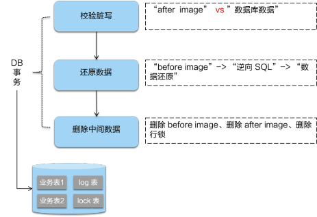

[TOC]

## 概述

* `Seata`中有三大模块，分别是`TC`(事务协调器):维护全局事务的运行状态，负责协调并驱动全局事务的提交或回滚；`TM`(事务管理器)：控制全局事务的边界，负责开启一个全局事务，并最终发起全局提交或全局回滚的决议;`RM`(资源管理器)：控制分支事务，负责分支注册、状态汇报，并接收事务协调器的指令，驱动本地事务的提交和回滚。其中`TM`和`RM`是作为`Seata`的客户端与业务系统集成在一起，`TC`作为`Seata`的服务端独立部署。


* 执行分布式事务时：->`TM`向`TC`请求发起（Begin）、提交（Commit）、回滚（Rollback）全局事务；->`TM`把代表全局事务的`XID`绑定到分支事务上；->`RM`向`TC`注册，把分支事务关联到`XID`代表的全局事务中；->`RM`把分支事务的执行结果上报给`TC`（可选，默认关闭）；->`TM`结束分布式事务，事务一阶段结束，`TM`通知`TC`提交/回滚分布式事务；->`TC`汇总事务信息，决定分布式事务是提交还是回滚；->`TC`通知所有`RM`提交/回滚资源，事务二阶段结束；

## AT方案

* AT属于无侵入的分布式事务解决方案，为两阶段提交的变种。

    

* 在一阶段，`Seata`通过代理数据源，拦截解析业务SQL语义，找到业务SQL要更新的业务数据，在业务数据被更新前，将其保存成`beforeimage`，然后执行业务SQL更新业务数据，在业务数据更新之后，将其保存成`afterimage`，把业务数据在更新前后的数据镜像组织成回滚日志。

    先申请本地数据库写锁，成功后向`TC`申请关于这条记录的全局行锁，成功后将业务SQL和`undolog`写入同一个事务中，提交到数据库中，保证业务SQL必定存在相应的回滚日志，保证一阶段操作的原子性，最后释放本地数据库锁，对分支事务状态向`TC`上报执行成功。如果获取全局锁失败，重试失败则回滚本地事务，并向`TC`汇报本地事务执行失败。


* 二阶段如果提交，立即释放相关记录的全局锁。因为业务SQL在一阶段已经提交至数据库，所以把提交请求放入一个异步任务的队列中，马上返回提交成功的结果给`TC`。异步队列中的提交请求真正执行时，只是删除相应`UNDOLOG`和行锁，可以快速完成。


* 二阶段回滚，需要回滚一阶段已经执行的业务SQL，还原业务数据。`RM`通过`XID`找到对应的`undolog`回滚日志。首先校验脏写，对比数据库当前业务数据和`afterimage`，如果两份数据完全一致就说明没有脏写，可以还原业务数据，生成并执行回滚的语句；如果不一致就说明有脏写，需要额外处理。最后用`beforeimage`还原业务数据，并删除`undolog`日志，释放全局锁。




#### 隔离级别

* 读取：由于一阶段`RM`自动提交本地事务的原因，默认隔离级别为`ReadUncommitted`，即可以读取到其他分布式事务未提交数据，本地事务隔离级别由本地DB决定。如果希望隔离级别为`ReadCommitted`，需要使用`SELECT...FORUPDATE`语句进行当前读，同时代理方法增加`@GlobalLock`注解。此时会先申请本地锁再申请全局锁。如果获取全局锁失败，则释放本地锁并重试，直到持有该全局锁的分布式事务提交，当前查询获得全局锁，读取到其他分布式事务已提交数据。

#### 性能

`XA`方案事务性资源的锁都要保持到Phase2完成才释放。`AT`将锁分为了本地锁和全局锁，本地锁由本地事务管理，在分支事务一阶段结束时释放，全局锁由`TC`管理，在二阶段全局提交时，全局锁立即释放，二阶段回滚时，全局锁被持有至分支的二阶段结束。`AT`剥离了分布式事务方案对数据库在协议支持上的要求，避免XA协议需要同步协调导致资源锁定时间过长的问题。


## TCC方案

#### 概述

* TCC属于两阶段提交的改进，同时属于有侵入的分布式事务方案。需要在`RM`处手动实现`Try,Comform,Cancel`，并且由业务层面实现`Cancel`保证可回滚以及回滚数据的持久化。`TM`在第一阶段询问所有`RM`是否成功，如果所有资源均准备成功，则在第二阶段执行所有资源的`Comform`操作，否则在第二阶段执行所有资源的`Cancel`操作。由于`Try`同步调用，其结果会影响到二阶段决策，因此TCC分布式事务解决方案适用于执行时间确定且较短的业务。
* 在TCC方案中，`RM`（资源管理器）需要提供准备、提交和回滚3个操作；


* 一阶段：`TRY`检查资源是否充足，并进行资源冻结，此时资源总数不变，被冻结资源将不能挪用。此时其他并发事务可以继续消费未被冻结资源，不阻塞其余事务。
* 二阶段：使用一阶段预冻结资源完成业务流程，执行成功后变更资源总数和被冻结资源，执行失败后释放冻结资源。由于只使用本事务一阶段冻结资源，其余事务冻结资源不会对当前事务的第二阶段执行产生影响。


#### 容错性

* 允许空回滚：在`TRY`接口因为丢包时没有收到，事务管理器会触发回滚，这时会触发`Cancel`接口，这时`Cancel`执行时发现没有对应的事务`XID`或主键时，需要返回回滚成功。


* 防悬挂控制：`TRY`由于网络拥堵而超时，`Cancel`比`TRY`接口先执行，成功空回滚，此时如果`TRY`请求到达，则不应该执行。通过在`RM`处保留已执行回滚事务`XID`，`TRY`接口先检查事务`XID`是否回滚，如果已回滚则不执行`TRY`的业务操作。


* 幂等性：一次请求和重复的多次请求对系统资源的影响是一致的，在`RM`处保留`XID`对应事务`Try,Comform,Cancel`执行情况，用事务`XID`判重。

## saga方案

* Saga模式属于有侵入是分布式事务方案。各个阶段无直接耦合，参与者可以采用事务驱动异步执行高吞吐，通过逆向操作完成回滚。每个阶段完成后提交本地事务，无全局锁，长流程情况下可以保证性能。由于正向阶段无全局锁，且未进行进行资源预留，其他事务可以在分布式事务未完成时，读取到已完成阶段修改的数据，不能保证隔离性


## XA方案

* XA属于无侵入式两阶段提交变种，通过分布式事务提交前一直持有锁的方式，保障从任意视角对数据的访问有效隔离，满足全局数据一致性，性能很差。

## AT实现

### 分布式事务入口

* 启动配置类`GlobalTransactionScanner`实现了`AbstractAutoProxyCreator`接口，本质上是一个`BeanPostProcessor`，会扫描全部bean，在`bean`初始化之前，调用内部的`postProcessBeforeInstantiation`方法，获取与被代理对象匹配的拦截器，创建AOP代理bean，完成逻辑增强。

```java
public abstract class AbstractAutoProxyCreator implements SmartInstantiationAwareBeanPostProcessor,
	// 获取bean匹配拦截器，完成代理对象创建
	public Object postProcessBeforeInstantiation(Class<?> beanClass, String beanName) {
		Object cacheKey = getCacheKey(beanClass, beanName);
		TargetSource targetSource = getCustomTargetSource(beanClass, beanName);
		if (targetSource != null) {
			if (StringUtils.hasLength(beanName)) {
				this.targetSourcedBeans.add(beanName);
			}
            // 获取bean匹配拦截器
			Object[] specificInterceptors = getAdvicesAndAdvisorsForBean(beanClass, beanName, targetSource);
            // 创建代理对象
			Object proxy = createProxy(beanClass, beanName, specificInterceptors, targetSource);
			this.proxyTypes.put(cacheKey, proxy.getClass());
			return proxy;
		}
		return null;
	}
}
```

* 与分布式事务相关的拦截器由`GlobalTransactionScanner#wrapIfNecessary`生成。他将为添加有`@GlobalTransactional`的类创建拦截器`AdapterSpringSeataInterceptor(ProxyInvocationHandler)`。由`ProxyInvocationHandler`真正执行代理拦截。

```java
public class AdapterSpringSeataInterceptor implements MethodInterceptor, SeataInterceptor, Ordered {

    private ProxyInvocationHandler proxyInvocationHandler;
	// 拦截器持有proxyInvocationHandler用于拦截DB调用
    public AdapterSpringSeataInterceptor(ProxyInvocationHandler proxyInvocationHandler) {
        this.proxyInvocationHandler = proxyInvocationHandler;
    }
	// 请求拦截交由proxyInvocationHandler实现
    public Object invoke(@Nonnull MethodInvocation invocation) throws Throwable {
        AdapterInvocationWrapper adapterInvocationWrapper = new AdapterInvocationWrapper(invocation);
        Object result = proxyInvocationHandler.invoke(adapterInvocationWrapper);
        return result;
    }
}
```

* `ProxyInvocationHandler`通过`GlobalTransactionalInterceptorHandler`代理`doInvoke`方法，拦截带有`GlobalTransactional`注解或者`GlobalLock`注解的方法，构建当前操作事务，交由`handleGlobalTransaction`或者`handleGlobalLock`执行。

    对于`handleGlobalTransaction`由于需要开启新的分布式事务，由模板类`TransactionalTemplate`执行事务方法的反射调用。

```java
public class GlobalTransactionalInterceptorHandler extends AbstractProxyInvocationHandler implements ConfigurationChangeListener {

    private static final Logger LOGGER = LoggerFactory.getLogger(GlobalTransactionalInterceptorHandler.class);

    private final TransactionalTemplate transactionalTemplate = new TransactionalTemplate();
    private final GlobalLockTemplate globalLockTemplate = new GlobalLockTemplate();

    @Override
    protected Object doInvoke(InvocationWrapper invocation) throws Throwable {
        Class<?> targetClass = invocation.getTarget().getClass();
        // 事务方法信息
        Method specificMethod = ClassUtils.getMostSpecificMethod(invocation.getMethod(), targetClass);
        if (specificMethod != null && !specificMethod.getDeclaringClass().equals(Object.class)) {
            // 拦截带有`GlobalTransactional`注解的方法
            final GlobalTransactional globalTransactionalAnnotation = getAnnotation(specificMethod, targetClass, GlobalTransactional.class);
            // 拦截带有`GlobalLock`注解的方法
            final GlobalLock globalLockAnnotation = getAnnotation(specificMethod, targetClass, GlobalLock.class);
            // 是否开启分布式事务
            boolean localDisable = disable || (ATOMIC_DEGRADE_CHECK.get() && degradeNum >= degradeCheckAllowTimes);
            if (!localDisable) {
                if (globalTransactionalAnnotation != null || this.aspectTransactional != null) {
                    // 如果是带有`GlobalTransactional`注解的方法，通过handleGlobalTransaction执行
                    AspectTransactional transactional=initTransactional()
                    return handleGlobalTransaction(invocation, transactional);
                } else if (globalLockAnnotation != null) {
                    // 如果是带有`GlobalLock`注解的方法，通过handleGlobalLock执行
                    return handleGlobalLock(invocation, globalLockAnnotation);
                }
            }
        }
        return invocation.proceed();
    }

    Object handleGlobalTransaction(final InvocationWrapper methodInvocation,
                                   final AspectTransactional aspectTransactional) throws Throwable {
        boolean succeed = true;
        return transactionalTemplate.execute(new TransactionalExecutor() {
            @Override
            public Object execute() throws Throwable {
                return methodInvocation.proceed();
            }
        });
        
    }
}

```

* `TransactionalTemplate`用于在分布式事务下执行本地事务方法，同时向`TC`发起开始、提交、回滚请求。其中与`TC`通信部分由`DefaultGlobalTransaction`实现。

```java
public class TransactionalTemplate {
  public Object execute(TransactionalExecutor business) throws Throwable {
    // 1. 获取分布式事务
    GlobalTransaction tx = GlobalTransactionContext.getCurrent();
    try {
        // 2. 向TC发起请求开始全局事务
        beginTransaction(txInfo, tx);
        Object rs = null;
        try {
            // 执行业务逻辑
            rs = business.execute();
        } catch (Throwable ex) {
            // 3.业务逻辑异常，rollback全局事务
            completeTransactionAfterThrowing(txInfo,tx,ex);
            throw ex;
        }
        // 4. commit全局事务
        commitTransaction(tx);
        return rs;
    } finally {
        //5. 清理
        triggerAfterCompletion();
        cleanUp();
    }
}
```

### 启动配置

* `seata`启动依赖自动配置类。在`io.seata-spring-boot-starter`下的`spring.factories`中包含以下启动配置类

    ```properties
    # Auto Configure
    org.springframework.boot.autoconfigure.EnableAutoConfiguration=\
    io.seata.spring.boot.autoconfigure.SeataAutoConfiguration,\
    io.seata.spring.boot.autoconfigure.SeataDataSourceAutoConfiguration,\
    ```

    用于配置全局事务扫描器`GlobalTransactionScanner`用于`TM, MC`实例化数据源代理`SeataAutoDataSourceProxyCreator`用于拦截业务操作，生成`boforeImage, afterImage`，保证分布式事务的持久化和可回滚特性。

### 数据源代理

`Seata`为与数据源相关的组件构建包装类`DataSourceProxy, ConnectionProxy, StatementProxy, PreparedStatementProxy`，用于在 SQL 语句执行前后、事务 commit 或者 rollback 前后进行与分布式事务相关的操作，例如分支注册、状态上报、全局锁生成、全局锁查询、快照存储、反向SQL生成等。


* `SeataDataSourceAutoConfiguration`自动配置类中实例化了`SeataAutoDataSourceProxyCreator`，`SeataAutoDataSourceProxyCreator`继承了`AbstractAutoProxyCreator`，通过`AOP`方式把目标对象转换成代理对象的后置处理器。即`SeataAutoDataSourceProxyCreator`实现为数据源对象创建代理。

```java
public class SeataAutoDataSourceProxyCreator extends AbstractAutoProxyCreator {
    private final Object[] advisors;
    
    private Object[] buildAdvisors(String dataSourceProxyMode) {
        Advice advice = new SeataAutoDataSourceProxyAdvice(dataSourceProxyMode);
        return new Object[]{new DefaultIntroductionAdvisor(advice)};
    }

    @Override
    protected boolean shouldSkip(Class<?> beanClass, String beanName) {
        if (excludes.contains(beanClass.getName())) {
            return true;
        }
        return SeataProxy.class.isAssignableFrom(beanClass);
    }
}
```

* `SeataAutoDataSourceProxyAdvice`用于拦截原始数据源的方法调用，具体的在`invoke`方法中通过反射使用代理对象执行方法调用，添加自身逻辑。

```java
public class SeataAutoDataSourceProxyAdvice implements MethodInterceptor, IntroductionInfo {
    // 拦截原始数据源方法调用，将原始数据源替换为代理数据源
    public Object invoke(MethodInvocation invocation) throws Throwable {
		// 方法执行的基本信息
        Method method = invocation.getMethod();
        String name = method.getName();
        Class<?>[] parameterTypes = method.getParameterTypes();
        declared = DataSource.class.getDeclaredMethod(name, parameterTypes);
        // 将原始数据源替换为代理数据源
        DataSource origin = (DataSource) invocation.getThis();
        SeataDataSourceProxy proxy = DataSourceProxyHolder.get(origin);
        Object[] args = invocation.getArguments();
        // 使用代理数据源执行方法调用
        return declared.invoke(proxy, args);
    }
}
```

* 数据源代理对象`SeataDataSourceProxy`的构建由`SeataAutoDataSourceProxyCreator`的父类`AbstractAutoProxyCreator`触发，由于`AbstractAutoProxyCreator`实现`SmartInstantiationAwareBeanPostProcessor`接口，`postProcessAfterInitialization`方法将会被自动执行，从而触发`SeataAutoDataSourceProxyCreator#buildProxy`执行，之后`dataSource.getConnection`获得的对象是 `ConnectionProxy `对象。

    `buildProxy`中根据当前分布式事务方案选择不同的`SeataDataSourceProxy`。由于`TCC, Saga`通过有侵入方式执行分布式事务，由人工控制事务回滚，不要数据源代理。只有`TA, XA`方案需要数据源代理。

```java
public class SeataAutoDataSourceProxyCreator extends AbstractAutoProxyCreator {
    SeataDataSourceProxy buildProxy(DataSource origin, String proxyMode) {
        // 为AT方案生成代理
        if (BranchType.AT.name().equalsIgnoreCase(proxyMode)) {
            return new DataSourceProxy(origin);
        }
        // 为XA方案生成数据源代理
        if (BranchType.XA.name().equalsIgnoreCase(proxyMode)) {
            return new DataSourceProxyXA(origin);
        }
        throw new IllegalArgumentException("Unknown dataSourceProxyMode: " + proxyMode);
    }
}
```

#### 连接代理

* 数据源代理对象根据传递的原始数据源，获得原始数据源的连接对象，并得到代理的连接对象`ConnectionProxyXA, ConnectionProxyXA`，代理`commit`方法，实现提交本地事务前获取行锁，之后根据被拦截方法备注类型执行不同调用。

    如果使用`@GlobalTransaction`注解，将会开启分布式事务，调用`processGlobalTransactionCommit`完成提交事务时生成并写入`undolog`、最后提交本地事务，将业务修改和`UndoLog`一并提交。

    如果使用`@GlobalLock`注解，说明该方法并非某个全局事务下的分支事务，希望某个不在全局事务下的操作不影响分布式事务。此时对数据资源的操作也需要先查询全局锁，如果存在其全局事务正在修改，则该方法也需等待，以在分布式事务下防止脏读。此时将调用`processLocalCommitWithGlobalLocks`，通过`RM`完成全局锁获取，获取成功后再提交本地事务，获取失败则进入等待重试阶段。

```java
public class ConnectionProxy extends AbstractConnectionProxy {
    public void commit() throws SQLException {
        // 提交本地事务前需要获取行锁
        lockRetryPolicy.execute(() -> {
            doCommit();
            return null;
        });
    }
    
    private void doCommit() throws SQLException {
        // 根据事务添加注解不同有不同处理方式
        if (context.inGlobalTransaction()) {
            // 使用@GlobalTransaction注解修饰方法
            processGlobalTransactionCommit();
        } else if (context.isGlobalLockRequire()) {
            // 使用@GlobalLock注解修饰方法
            processLocalCommitWithGlobalLocks();
        } else {
            targetConnection.commit();
        }
    }
    
    private void processGlobalTransactionCommit() throws SQLException {
        // 调用RM#branchRegister注册分支事务，获得branchid
        register();
        // 刷新写入undolog
        UndoLogManagerFactory.getUndoLogManager(this.getDbType()).flushUndoLogs(this);
        // 向原始数据源写入数据，将业务修改和UndoLog一并提交
        targetConnection.commit();
        // 是否报告一阶段提交完成，默认为false
        if (IS_REPORT_SUCCESS_ENABLE) {
            // 通过RM#branchReport向TC汇报分支状态为一阶段成功 
            report(true);
        }
        context.reset();
    }
    
    private void processLocalCommitWithGlobalLocks() throws SQLException {
        // 尝试获取全局锁，在分布式事务下防止脏读
        checkLock(context.buildLockKeys());
        try {
            // 不存在占据当前行的分布式事务，则提交本地事务
            targetConnection.commit();
        } catch (Throwable ex) {
            throw new SQLException(ex);
        }
        context.reset();
    }
}
```

#### 执行代理


* 当通过连接代理`conn.prepareStatement`获得`PreparedStatement`时同样返回生成的代理实现`PreparedStatementProxy`，`connection.prepareStatement`获得的是`PreparedStatementProxy` 对象。`PreparedStatementProxy#execute`在被调用后完成SQL解析和执行。当使用`PreparedStatementProxy#execute`执行SQL时，将委托`ExecuteTemplate`代为执行。

```java
public class PreparedStatementProxy extends AbstractPreparedStatementProxy
    implements PreparedStatement, ParametersHolder {
    // 委托`ExecuteTemplate`代为执行
	public boolean execute() throws SQLException {
        return ExecuteTemplate.execute(this, (statement, args) -> statement.execute());
    }
}
```

* `ExecuteTemplate`根据SQL类型生成具体执行类：`InsertExecutor, SqlServerUpdateExecutor, SqlServerDeleteExecutor, SqlServerSelectForUpdateExecutor`。

```java
public class ExecuteTemplate {
   public static <T, S extends Statement> T execute(List<SQLRecognizer> sqlRecognizers,
                                                     StatementProxy<S> statementProxy,
                                                     StatementCallback<T, S> statementCallback,
                                                     Object... args) throws SQLException {
        Executor<T> executor;
        SQLRecognizer sqlRecognizer = sqlRecognizers.get(0);
       // 根据SQL类型生成具体执行类
        switch (sqlRecognizer.getSQLType()) {
            case INSERT: getExecutor
            case UPDATE: getExecutor
            case DELETE: getExecutor
            case SELECT_FOR_UPDATE: getExecutor
        }
        T rs;
        // 调用执行器的 execute 方法
        rs = executor.execute(args);
        return rs;
    }
```

### 一阶段拦截

* 此处同样使用了模板模式，上述执行类都继承自`AbstractDMLBaseExecutor`，`AbstractDMLBaseExecutor`实现了`executeAutoCommitFalse`方法，完成SQL执行、`boforeImage, afterImage`、全局锁记录、构建回滚日志对象添加到`ConnectionProxy`上下文，尝试将其和业务修改在同一事务中提交，保证了一阶段操作的原子性。由于不同数据库针对`INSERT、UPDATE、DELETE` 有不同的实现具体，`boforeImage, afterImage`生成由子类具体实现。

    生成全局锁记录时根据表名+主键值生成全局锁，如果是增加或者更改则使用更新后的`afterImage`生成锁记录；如果是删除使用`beforeImage`生成锁记录。生成锁记录放入`connectionProxy`，等待向`TC`发起获取全局锁申请，如果获取成功，则提交本地事务，如果失败进入等待重试。

```java
public abstract class AbstractDMLBaseExecutor<T, S extends Statement> extends BaseTransactionalExecutor<T, S> {
    // 执行SQL执行、`boforeImage, afterImage`生成
    protected T executeAutoCommitFalse(Object[] args) throws Exception {
        // 执行SQL前生成快照
        TableRecords beforeImage = beforeImage();
        // 本地DB执行SQL
        T result = statementCallback.execute(statementProxy.getTargetStatement(), args);
        // 执行SQL后生成快照
        TableRecords afterImage = afterImage(beforeImage);
        // 整合beforeImage和afterImage，生成undolog插入到代理连接的上下文，用于后续回滚分布式事务
        prepareUndoLog(beforeImage, afterImage);
        return result;
    }
    
    // 具体的`boforeImage, afterImage`生成由子类具体实现
    protected abstract TableRecords beforeImage() throws SQLException;
    protected abstract TableRecords afterImage(TableRecords beforeImage) throws SQLException;
    
    // 准备undolog
    protected void prepareUndoLog(TableRecords beforeImage, TableRecords afterImage) throws SQLException {
        ConnectionProxy connectionProxy = statementProxy.getConnectionProxy();
        // 生成根据表名+主键值生成全局锁
        // 如果是增加或者更改则使用更新后的afterImage生成锁记录
        // 如果是删除使用beforeImage生成锁记录
        TableRecords lockKeyRecords = sqlRecognizer.getSQLType() == SQLType.DELETE ? beforeImage : afterImage;
        String lockKeys = buildLockKey(lockKeyRecords);
        if (null != lockKeys) {
            // 添加lockKey全局记录锁放入`ConnectionProxy`上下文
            connectionProxy.appendLockKey(lockKeys);
            // 根据beforeImage, afterImage生成undolog
            SQLUndoLog sqlUndoLog = buildUndoItem(beforeImage, afterImage);
            // 将回滚日志添加到`ConnectionProxy`上下文
            connectionProxy.appendUndoLog(sqlUndoLog);
        }
    }
}

```


### TM初始化

* 全局事务扫描器`GlobalTransactionScanner`实现了`InitializingBean`接口，将有`spring`自动调用`afterPropertiesSet`完成`initClient`调用，从而完成`RM, TM`初始化，初始化的参数来自`application.yml`。

```java
public class GlobalTransactionScanner implements InitializingBean, 
    private void initClient() {
        //初始化 TM
        TMClient.init(applicationId, txServiceGroup, accessKey, secretKey);
        //初始化 RM
        RMClient.init(applicationId, txServiceGroup);
        registerSpringShutdownHook();
    }
    public void afterPropertiesSet() {
        // cas保证每个节点RM，TM只会初始化一次
        if (initialized.compareAndSet(false, true)) {
            initClient();
        }
    }
}
```

* `TM`的作用是开启以及提交全局事务，`TMClient`初始化主要完成:创建连接池；创建并启动客户端`Netty`；创建并启动用于`RPC`交互的线程池。

    `TM`的实例由`TmNettyRemotingClient#getInstance`获得。获取时使用双检查模式，保证每个节点只存在一个`TM`。内部持有一个线程池，用于处理与`TC, RM`之间的`RPC`通信。

    初始化`TM`时，根据service_group得到cluster_name，从注册中心(例如`Nacos`)获得`TC`地址，建立与`TC`之间的连接，并注册自身，`TC`地址通过注册中心(例如`Nacos`)获得，此时同样使用双检查，避免重复连接。

```java
public final class TmNettyRemotingClient extends AbstractNettyRemotingClient {    
	public static TmNettyRemotingClient getInstance() {
   		 // 双检查模式, 保证单例
        if (instance == null) {
            synchronized (TmNettyRemotingClient.class) {
                if (instance == null) {
                    NettyClientConfig nettyClientConfig = new NettyClientConfig();
                    // 线程池用于处理与TC， RM之间的`RPC`通信
                    final ThreadPoolExecutor messageExecutor = new ThreadPoolExecutor(
                            nettyClientConfig.getClientWorkerThreads(), nettyClientConfig.getClientWorkerThreads(),
                            KEEP_ALIVE_TIME, TimeUnit.SECONDS,
                            new LinkedBlockingQueue<>(MAX_QUEUE_SIZE),
                            new NamedThreadFactory(nettyClientConfig.getTmDispatchThreadPrefix(),
                                    nettyClientConfig.getClientWorkerThreads()),
                            RejectedPolicies.runsOldestTaskPolicy());
                    instance = new TmNettyRemotingClient(nettyClientConfig, null, messageExecutor);
                }
            }
        }
        return instance;
    }
    private void initConnection() {
        // 与TC之间建立连接，`TC`地址通过注册中心获得， 前置双检查保证连接唯一
        getClientChannelManager().reconnect(transactionServiceGroup);
    }
}
```

### RM初始化

* `RM`控制分支事务，负责分支注册、状态汇报，并接收`TC`的指令，驱动本地事务的提交和回滚。由于`RM`需要与本地数据库交互，同时接收`TC`指令，完成分布式事务的提交或者回滚，`TM`需要设置资源管理器`DefaultResourceManager`和分布式事务指令处理器`DefaultRMHandler`。

    `RM`的初始化和`TM`类似，实例对象通过`RmNettyRemotingClient#getInstance`获得。获取时使用双检查模式，保证每个节点只存在一个`RM`。同时内部持有一个线程池，用于处理与`TC, TM`之间的`RPC`通信，详见`RmNettyRemotingClient#getInstance`。

    初始化`RM`时，根据`service_group`得到`cluster_name`，从注册中心(例如`Nacos`)获得`TC`地址，建立与`TC`之间的连接，并注册自身，`TC`地址通过注册中心(例如`Nacos`)获得，此时同样使用双检查，避免重复连接，详见`NettyClientChannelManager#reconnect`。

    ```java
    public class RMClient {
        public static void init(String applicationId, String transactionServiceGroup) {
            // 初始化
            RmNettyRemotingClient rmNettyRemotingClient = RmNettyRemotingClient.getInstance(applicationId, transactionServiceGroup);
            // 设置资源管理器，与本地数据库交互
            rmNettyRemotingClient.setResourceManager(DefaultResourceManager.get());
            // 布式事务指令处理器,完成分布式事务的提交或者回滚
            rmNettyRemotingClient.setTransactionMessageHandler(DefaultRMHandler.get());
            rmNettyRemotingClient.init();
        }
    }
    ```

#### 指令Handler

* `RM`的`DefaultRMHandler`属于适配器，适配所有分布式事务方案(`AT, TCC, SAGA, XA`)下`TC`发送的`RPC`通信调用处理，接受`TC`的分支提交/回滚请求，内部持有真正的`RMHandler`用于处理`TC`发送的提交或者回滚分布式事务`RPC`指令。

```java
public class DefaultRMHandler extends AbstractRMHandler {
	// 存储`AT, TCC, SAGA, XA`下处理`TC`发送的`RPC`通信调用的Handler
    protected static Map<BranchType, AbstractRMHandler> allRMHandlersMap = new ConcurrentHashMap<>();

    // 收到TC提交指令时，委托当前事务模式下真正的Handler完成事务提交
    public BranchCommitResponse handle(BranchCommitRequest request) {
        return getRMHandler(request.getBranchType()).handle(request);
    }

    // 收到TC回滚指令时，委托当前事务模式下真正的Handler完成事务回滚
    public BranchRollbackResponse handle(BranchRollbackRequest request) {
        return getRMHandler(request.getBranchType()).handle(request);
    }
```

- `AbstractRMHandler`主要有四种实现类：`RMHandlerAT, RMHandlerXA, RMHandlerSaga, RMHandlerTCC`，分别对应于`AT, XA, Saga, TCC`这四种分布式事务方案。四个具体的`RM`都继承自`AbstractRMHandler`，此处使用模板模式，`AbstractRMHandler`实现了处理`TC`发送的提交或者回滚分布式事务指令的方法。无论是提交还是回滚都将请求转发给当前分布式事务方案下的`RM`，完成`undolog`的删除或者根据`undolog`还原本地数据。

```java
public abstract class AbstractRMHandler extends AbstractExceptionHandler
    implements RMInboundHandler, TransactionMessageHandler {

    // 处理TC发送的提交分布式事务请求
    public BranchCommitResponse handle(BranchCommitRequest request) {
        BranchCommitResponse response = new BranchCommitResponse();
        exceptionHandleTemplate(new AbstractCallback<BranchCommitRequest, BranchCommitResponse>() {
            @Override
            public void execute(BranchCommitRequest request, BranchCommitResponse response)
                throws TransactionException {
                // 触发对应分布式事务方案下ResourceManager#branchRollback执行，委托RM完成事务提交
                doBranchCommit(request, response);
            }
        }, request, response);
        return response;
    }

    // 处理TC发送的回滚分布式事务请求
    public BranchRollbackResponse handle(BranchRollbackRequest request) {
        BranchRollbackResponse response = new BranchRollbackResponse();
        exceptionHandleTemplate(new AbstractCallback<BranchRollbackRequest, BranchRollbackResponse>() {
            @Override
            public void execute(BranchRollbackRequest request, BranchRollbackResponse response)
                throws TransactionException {
                // 触发对应分布式事务方案下ResourceManager#branchRollback执行，委托RM完成事务回滚
                doBranchRollback(request, response);
            }
        }, request, response);
        return response;
    }
}
```
#### RM适配

* `DefaultResourceManager`属于适配器，适配所有分布式事务方案(`AT, TCC, SAGA, XA`)下的`RM`调用，内部持有真正的`RM`用于执行真正的方法调用。

```java
public class DefaultResourceManager implements ResourceManager {
    // 持有真正的RM对象
    protected static Map<BranchType, ResourceManager> resourceManagers
        = new ConcurrentHashMap<>();
	// 向TC注册本地分支
    public Long branchRegister(BranchType branchType, String resourceId,
                               String clientId, String xid, String applicationData, String lockKeys){
        return getResourceManager(branchType).branchRegister(branchType, resourceId, clientId, xid, applicationData,
            lockKeys);
    }
	// 向TC汇报本地事务执行状况
    public void branchReport(BranchType branchType, String xid, long branchId, BranchStatus status,
                             String applicationData){
        getResourceManager(branchType).branchReport(branchType, xid, branchId, status, applicationData);
    }
    // 接收TC指令提交分布式事务
    public BranchStatus branchCommit(BranchType branchType, String xid, long branchId,
                                     String resourceId, String applicationData){
        return getResourceManager(branchType).branchCommit(branchType, xid, branchId, resourceId, applicationData);
    }
	// 接收TC指令回滚分布式事务
    public BranchStatus branchRollback(BranchType branchType, String xid, long branchId,
                                       String resourceId, String applicationData){
        return getResourceManager(branchType).branchRollback(branchType, xid, branchId, resourceId, applicationData);
    }
}
```

### 二阶段提交

* 如果一阶段完成未抛异常，全局事务的发起方会向服务端申请提交全局事务，服务端根据 `xid` 查询加锁并关闭全局事务，防止该事务后续还有分支继续注册，同时将其状态从 `Begin` 修改为 `Committing`。二阶段提交时，客户端接收到服务端发送的 `branch commit` 请求，交由`AbstractRMHandler#handle`处理，之后根据 `resourceId` 找到相应的 `ResourceManager`进行后续处理。
  
* `ResourceManager`主要有四种实现类：`DataSourceManager, ResourceManagerXA, SagaResourceManager, TCCResourceManager`，分别对应于`AT, XA, Saga, TCC`这四种分布式事务方案。四个具体的`RM`都继承自`AbstractResourceManager`，此处使用模板模式，`AbstractResourceManager`实现了向TC注册和汇报的方法，由于各个分布式方案的提交与回滚方式不一致，提交与回滚方法由具体`RM`实现。

    注册时携带分支的`xid`, `resourceId`, 分布式事务方案类型, 行锁注册到TC，获得分支ID。如果行锁指定的记录被其他分布式事务锁定，将注册失败，等待后续重试。

```java
public abstract class AbstractResourceManager implements ResourceManager {
    // 携带分支的xid, resourceId, 分布式事务方案类型, 行锁注册到TC，获得分支ID
    public Long branchRegister(BranchType branchType, String resourceId, String clientId, String xid, String applicationData, String lockKeys) throws TransactionException {
            BranchRegisterRequest request = new BranchRegisterRequest();
            request.setXid(xid);
        	// 行锁指定的记录被其他分布式事务锁定，将注册失败，等待后续重试
            request.setLockKey(lockKeys);
            request.setResourceId(resourceId);
            request.setBranchType(branchType);
            request.setApplicationData(applicationData);
            BranchRegisterResponse response = (BranchRegisterResponse) RmNettyRemotingClient.getInstance().sendSyncRequest(request);
            return response.getBranchId();
    }
	// 携带分支的xid, 分支ID, 本地事务执行状态向TC汇报
    public void branchReport(BranchType branchType, String xid, long branchId, BranchStatus status, String applicationData) throws TransactionException {
            BranchReportRequest request = new BranchReportRequest();
            request.setXid(xid);
            request.setBranchId(branchId);
            request.setStatus(status);
            request.setApplicationData(applicationData);
            BranchReportResponse response = (BranchReportResponse) RmNettyRemotingClient.getInstance().sendSyncRequest(request);
    }
}
```

* 以实现`AT`方案的`DataSourceManager`为例，继承自`AbstractResourceManager`，实现自己的执行本地事务、提交与回滚分布式事务的方法。

* 在向`TC`汇报本地事务执行成功前，需要根据数据库表名和主键值生成`lockKeys`，用于标识需要锁定的数据库记录，通过`lockQuery`向`TC`发起获取数据库记录全局锁请求，如果成功这本地事务上报为成功，否则证明记录被其他尚未提交分布式事务占有，获取全局锁失败，进入等待重试阶段。

```java
public class DataSourceManager extends AbstractResourceManager {
    // 在TC处尝试获取全局记录锁，锁定要修改记录
    public boolean lockQuery(BranchType branchType, String resourceId, String xid, String lockKeys){
        GlobalLockQueryRequest request = new GlobalLockQueryRequest();
        request.setXid(xid);
        // 根据数据库表名和主键值生成`lockKeys`，用于标识需要锁定的数据库记录
        request.setLockKey(lockKeys);
        request.setResourceId(resourceId);
        GlobalLockQueryResponse response;
        response = (GlobalLockQueryResponse) RmNettyRemotingClient.getInstance().sendSyncRequest(request);
        return response.isLockable();
    }
}
```

* 通过`branchCommit`提交分布式事务时，由于本地事务已提交，数据已被持久化修改，立即释放相关记录的全局锁，修改全局事务状态为 `AsyncCommitting`，把提交请求放入一个异步任务的队列中，马上返回提交成功的结果给`TC`。异步队列中的提交请求真正执行时，只是删除相应`UNDOLOG`和行锁，可以快速完成。


```java
public class DataSourceManager extends AbstractResourceManager {    
    private final AsyncWorker asyncWorker = new AsyncWorker(this);
    // 接受TC指令，提交分布式事务
    public BranchStatus branchCommit(BranchType branchType, String xid, long branchId, String resourceId,  String applicationData){
        // 提交任务至任务队列，异步执行
        return asyncWorker.branchCommit(xid, branchId, resourceId);
    }
}
```

* `AsyncWorker`为异步任务执行者，内部持有柱塞式任务队列`BlockingQueue`，提交的分布式事务加入柱塞队列，并通过`ScheduledExecutorService`，每隔1s从队列中取出要提交的事务，`undoLogManager`根据`xid, branchid`生成删除`undolog`的sql语句,并通过`DataSourceProxy`执行sql，批量删除`undolog`，完成分布式事务的提交。


```java
public class AsyncWorker {
    // 柱塞式任务队列，任务直接加入队列即返回
    private final BlockingQueue<Phase2Context> commitQueue;
	// 定时任务消费任务队列中任务，完成批量提交分布式事务
    private final ScheduledExecutorService scheduledExecutor;

    public AsyncWorker(DataSourceManager dataSourceManager) {
        this.dataSourceManager = dataSourceManager;
        commitQueue = new LinkedBlockingQueue<>(ASYNC_COMMIT_BUFFER_LIMIT);
        ThreadFactory threadFactory = new NamedThreadFactory("AsyncWorker", 2, true);
        scheduledExecutor = new ScheduledThreadPoolExecutor(2, threadFactory);
        // 定时任务每隔1s执行一次
        scheduledExecutor.scheduleAtFixedRate(this::doBranchCommitSafely, 10, 1000, TimeUnit.MILLISECONDS);
    }
    
	// DataSourceManager提交分布式事务时，加入队列即返回，任务异步执行
    public BranchStatus branchCommit(String xid, long branchId, String resourceId) {
        Phase2Context context = new Phase2Context(xid, branchId, resourceId);
        addToCommitQueue(context);
        return BranchStatus.PhaseTwo_Committed;
    }

    // 固定延迟调度消费任务队列中任务
    private void dealWithGroupedContexts(String resourceId, List<Phase2Context> contexts) {
        // DataSourceProxy为数据源代理，实现undolog的生成、提交、删除，undolog的操作交与 DataSourceProxy执行
        DataSourceProxy dataSourceProxy = dataSourceManager.get(resourceId);
        Connection conn = null;
        conn = dataSourceProxy.getPlainConnection();
        UndoLogManager undoLogManager = UndoLogManagerFactory.getUndoLogManager(dataSourceProxy.getDbType());
        // 任务任务分为多个组，每组长为1000
        List<List<Phase2Context>> splitByLimit = Lists.partition(contexts, UNDOLOG_DELETE_LIMIT_SIZE);
        for (List<Phase2Context> partition : splitByLimit) {
            // undoLogManager根据xid, branchid生成删除undolog的sql语句
            // 并通过conn.prepareStatement执行sql，批量删除undolog
            deleteUndoLog(conn, undoLogManager, partition);
        IOUtil.close(conn);
    }
}
```

### 二阶段回滚

* 回滚该全局事务时服务端会根据 `xid` 查询全局事务，加锁关闭事务防止后续分支注册，并同时将状态 `Begin` 从变更为 `Rollbacking`，再先客户端发送回滚指令。客户端收到`TC`发送的回滚指令时`DefaultRMHandler#handle`触发`RM`执行回滚。

* 通过`branchRollback`回滚分布式事务时，需要回滚一阶段已经执行的业务SQL，还原业务数据。`RM`通过`XID`找到对应的`undolog`回滚日志。首先校验脏写，对比数据库当前业务数据和`afterimage`，如果两份数据完全一致就说明没有脏写，可以还原业务数据，生成并执行回滚的语句；如果不一致就说明有脏写，需要额外处理。最后用`beforeimage`还原业务数据，并删除`undolog`日志，释放全局锁。


* 回滚时先根据 `resourceId` 拿到对应的数据源代理，交由`UndoLogManager`执行回滚方法。

```java
public class DataSourceManager extends AbstractResourceManager {  
    private final Map<String, Resource> dataSourceCache = new ConcurrentHashMap<>();
    // 接受TC指令，混滚分布式事务
    public BranchStatus branchRollback(BranchType branchType, String xid, long branchId, String resourceId, String applicationData) throws TransactionException {
        DataSourceProxy dataSourceProxy = get(resourceId);
 UndoLogManagerFactory.getUndoLogManager(dataSourceProxy.getDbType()).undo(dataSourceProxy, xid, branchId);
        return BranchStatus.PhaseTwo_Rollbacked;
    }
}
```

- `UndoLogManager`同样使用了模板模式，回滚的逻辑调用流程由`UndoLogManager`的实现类`AbstractUndoLogManager`完成，流程中涉及到与数据库的具体操作将由`AbstractUndoLogManager`的之类实现，`AbstractUndoLogManager`的之类有`MySQLUndoLogManager, OracleUndoLogManager`等，由他们实现和数据库的底层交互。

  在回滚方法中先关闭自动提交，保证回滚过程的原子性，从回滚数据表中根据`xid， branch`找到`undolog`，并构建并执行回滚SQL， 数据回滚执行成功，从`undolog`表中删除对应的`undolog`记录，如果执行数据回滚或者删除回滚日志失败，回滚当前操作。失败时如果`afterimage`数据与当前数据库数据不匹配，证明存在脏数据，上报`BranchTransactionException`错误需要手动处理。

```java
public abstract class AbstractUndoLogManager implements UndoLogManager {
    public void undo(DataSourceProxy dataSourceProxy, String xid, long branchId) throws TransactionException {
        ConnectionProxy connectionProxy = null;
        Connection conn = null;
        ResultSet rs = null;
        PreparedStatement selectPST = null;
        boolean originalAutoCommit = true;
        for (; ; ) {
            try {
                connectionProxy = dataSourceProxy.getConnection();
                conn = connectionProxy.getTargetConnection();
                // 关闭自动提交，保证回滚过程的原子性
                if (originalAutoCommit = conn.getAutoCommit()) {
                    conn.setAutoCommit(false);
                }
                // 从回滚数据表总根据xid， branch找到undolog
                selectPST = conn.prepareStatement(buildSelectUndoSql());
                selectPST.setLong(1, branchId);
                selectPST.setString(2, xid);
                rs = selectPST.executeQuery();
                boolean exists = false;
                while (rs.next()) {
                    exists = true;
                    // 获得回滚日志对象
                    String contextString = rs.getString(ClientTableColumnsName.UNDO_LOG_CONTEXT);
                    Map<String, String> context = parseContext(contextString);
                    byte[] rollbackInfo = getRollbackInfo(rs);
                    String serializer = context == null ? null : context.get(UndoLogConstants.SERIALIZER_KEY);
                    UndoLogParser parser = serializer == null ? UndoLogParserFactory.getInstance()
                        : UndoLogParserFactory.getInstance(serializer);
                    BranchUndoLog branchUndoLog = parser.decode(rollbackInfo);
                    // 获得回滚SQL
                    setCurrentSerializer(parser.getName());
                    List<SQLUndoLog> sqlUndoLogs = branchUndoLog.getSqlUndoLogs();
                    // 如果日志数量大于一，将SQL顺序反转，保证能还原到原始状态
                    // 正向：1->2->3 回滚：3->2->1
                    if (sqlUndoLogs.size() > 1) {
                        Collections.reverse(sqlUndoLogs);
                    }
                    // 执行回滚SQL，
                    for (SQLUndoLog sqlUndoLog : sqlUndoLogs) {
                        TableMeta tableMeta = TableMetaCacheFactory.getTableMetaCache(dataSourceProxy.getDbType()).getTableMeta(
                            conn, sqlUndoLog.getTableName(), dataSourceProxy.getResourceId());
                        sqlUndoLog.setTableMeta(tableMeta);
                        AbstractUndoExecutor undoExecutor = UndoExecutorFactory.getUndoExecutor(
                            dataSourceProxy.getDbType(), sqlUndoLog);
                        undoExecutor.executeOn(connectionProxy);
                    }
                }
                // 数据回滚执行成功，从undolog表中删除undolog
                if (exists) {
                    deleteUndoLog(xid, branchId, conn);
                    conn.commit();
                } else {
                    insertUndoLogWithGlobalFinished(xid, branchId, UndoLogParserFactory.getInstance(), conn);
                    conn.commit();
                }
                return;
            } catch (Throwable e) {
                // 执行数据回滚或者删除回滚日志失败，回滚当前操作
                conn.rollback();
                }
                // 如果afterimage数据与当前数据库数据不匹配，证明存在脏数据，需要手动处理
                if (e instanceof SQLUndoDirtyException) {
                    throw new BranchTransactionException();
                }
                throw new BranchTransactionException();
            } 
    }
}
```
