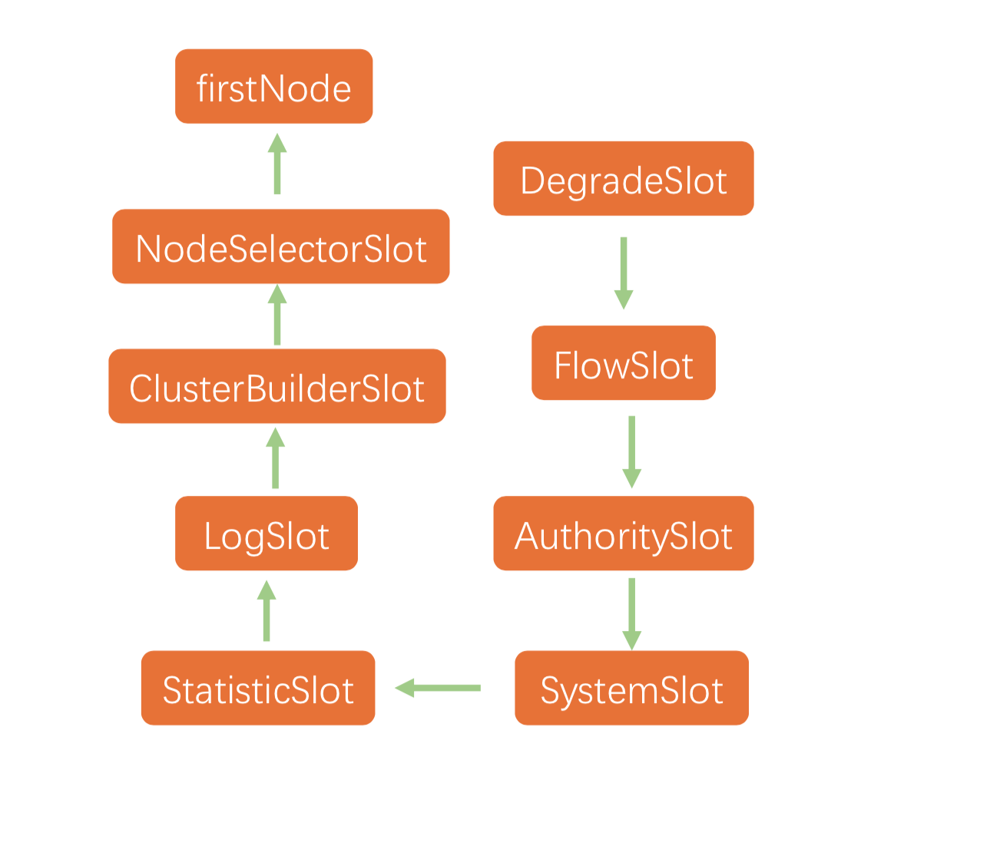
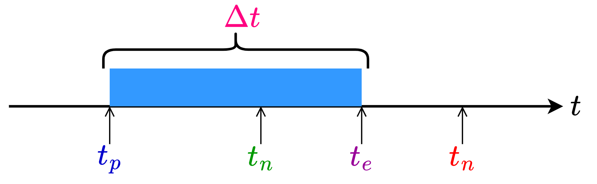
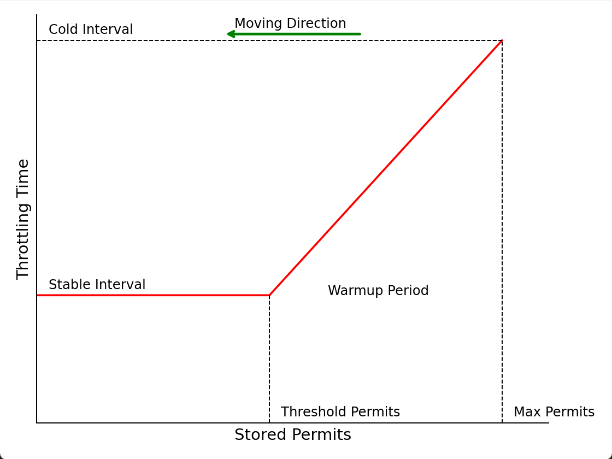
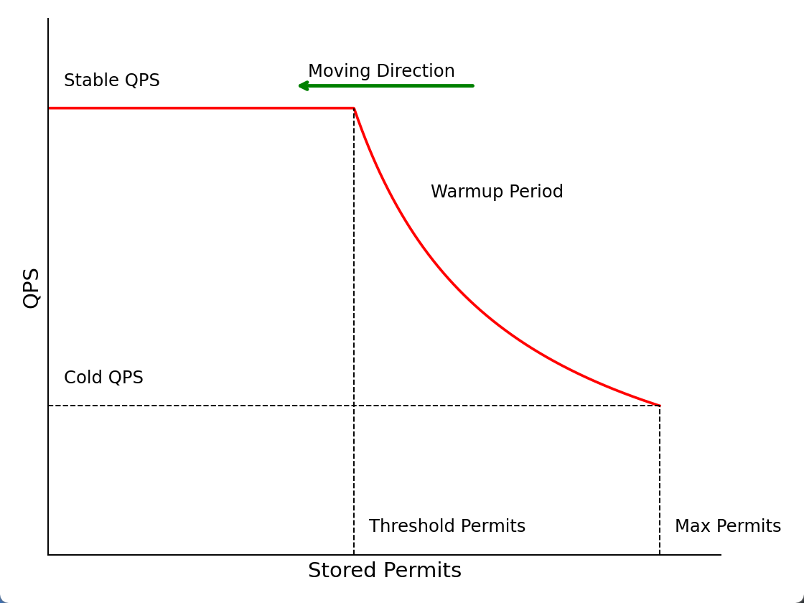

[toc]

## 数据统计

### 数据结构

* `sentinel`使用滑动窗口方式统计一分钟内放行请求数、阻塞请求数、异常请求数、成功请求数和请求响应时间。

* 数据统计由`StatisticNode`类完成，内部保有数据统计数组`rollingCounterInMinute`，数组统计的时间范围为`60*1000ms`，统计范围内均匀采样`60`次，以`1000ms`为统计基本单位。同时记录下最近一次更新数据的时间`lastFetchTime`作为时间范围的上界，`lastFetchTime-6000ms`作为时间范围的下界，通过上下界过滤出`rollingCounterInMinute`中有效的统计单位节点。`curThreadNum`记录正在处理的请求数。

```java
public class StatisticNode implements Node {
	// 数据统计的时间范围为60*1000ms，统计范围内均匀采样60次，以1000ms为统计基本单位
    private transient Metric rollingCounterInMinute = new ArrayMetric(60, 60 * 1000, false);
    private long lastFetchTime = -1;
    // 正在处理的请求数
    private LongAdder curThreadNum = new LongAdder();
}
```

* 滑动窗口`ArrayMetric`最终指向`WindowWrap<MetricBucket>`数组。`WindowWrap<MetricBucket>`是对`MetricBucket`的包装，`MetricBucket`用于统计一个统计基本单位，即`1000ms`内被保护资源的基础统计信息，其内部持有一个长度为6的数组，分别表示统计基本单位内放行请求数、阻塞请求数、异常请求数、成功请求数、请求响应时间和通过未来配额的请求数(请求触发限流，但由于请求的高优先级占用下一个时间窗口，最后被放行)。`WindowWrap<MetricBucket>`还额外添加`Bucket`开始时间及`Bucket`的长度。

```java
public class WindowWrap<T> {
    // bucket长度
    private final long windowLengthInMs;
    // 开始时间
    private long windowStart;
    // Bucket本身
    private T value;
}

public class MetricBucket {
	
    private final LongAdder[] counters;

    public MetricBucket() {
        // MetricEvent表示统计的维度，当前版本下为6个维度
        MetricEvent[] events = MetricEvent.values();
        this.counters = new LongAdder[events.length];
        // 将各个统计维度下统计值初始化为0
        for (MetricEvent event : events) {
            counters[event.ordinal()] = new LongAdder();
        }
    }
}
```

### 定时更新

* 在定义完规则并通过`FlowRuleManager.loadRules(rule)`时，触发`FlowRuleManager`的类加载。`FlowRuleManager`包含静态初始化代码块，用于启动定时任务`MetricTimerListener`，该任务每秒触发一次，即每个统计基本单位时间触发一次，用于清理统计数据结构中位于窗口外的数据。

```java
public class FlowRuleManager { 
    static {
            startMetricTimerListener();
        }
    private static void startMetricTimerListener() {
        // 1000ms
        long flushInterval = SentinelConfig.metricLogFlushIntervalSec();
        // 启动定时任务，清理统计数据结构中位于窗口外的数据
        SCHEDULER.scheduleAtFixedRate(new MetricTimerListener(), 0, flushInterval, TimeUnit.SECONDS);
    }
}
```

* `MetricTimerListener#run`方法中将调用`StatisticNode#metrics`方法，用于更新数据。

    `metrics`方法的主要内容是：

    * 更新当前时刻对应统计基本单位的有效期，如果当前时刻对应的统计基本单位过期，则重置统计数据；
    * 从全部统计基本单位中筛选出滑动窗口时间区间`[lastFetchTime-6000ms, lastFetchTime]`内有效的统计基本单位，并更新最近一次更新数据的时间`lastFetchTime`。

```java
public class StatisticNode implements Node {
    
    public Map<Long, MetricNode> metrics() {
        long currentTime = TimeUtil.currentTimeMillis();
        // 每个统计单位为1000ms，(currentTime%1000)为当前时刻与当前时刻所在统计基本单位起始时刻的差值
        // (currentTime-currentTime%1000)为当前时刻所在统计基本单位的起始时刻
        currentTime = currentTime - currentTime % 1000;
        Map<Long, MetricNode> metrics = new ConcurrentHashMap<>();
        // 从全部统计基本单位中筛选出滑动窗口时间区间[lastFetchTime-6000ms, lastFetchTime]内有效的统计基本单位
        List<MetricNode> nodesOfEverySecond = rollingCounterInMinute.details();
        long newLastFetchTime = lastFetchTime;
        for (MetricNode node : nodesOfEverySecond) {
            // 筛选出新增并且统计数据有效的bucket
            if (isNodeInTime(node, currentTime) && isValidMetricNode(node)) {
                metrics.put(node.getTimestamp(), node);
                newLastFetchTime = Math.max(newLastFetchTime, node.getTimestamp());
            }
        }
        // 更新最近一次更新数据的时间
        lastFetchTime = newLastFetchTime;
        return metrics;
    }
}
```

* 更新当前时刻对应`bucket`有效期的任务由`ArrayMetric#details`调用`LeapArray#currentWindow`完成。先计算当前实际属于`bucket`的编号`new_bucket_no=time_millis/1000ms`，再通过对编号取余的方式定位到该`new_bucket`在数组中下标`idx=new_bucket_no%60`。根据下标处原有`old_bucket=array[idx]`可能存在三种可能：
    * `old_bucket`为空，说明这是第一次访问`idx`所在`bucket`，需要初始化该`bucket`，由于可能有多个线程同时尝试添加，因此使用乐观锁CAS保证线程安全。
    * `old_bucket`与`new_bucket`对应的起始时间相同，说明这是在`old_bucket`负责的时间范围内再次访问`idx`处数据，此时`old_bucket`生命周期已被更新，不用处理；
    * `old_bucket`的起始时间小于`new_bucket`的起始时间，说明`new_bucket_no=old_bucket_no+60*k`，虽然`old_bucket_no`和`new_bucket_no`都会定位到同一个下标，但是当前已经完成至少一轮数组扫描，`old_bucket`已经过期，需要更新`bucket`起始时间，并将统计值置零。
    
    更新当前bucket方法可能会存在多个线程同时更新同一个bucket，通过`CAS`以及加锁方式保证线程安全，同时如果竞争线程资源失败使用`Thread.yield`主动放弃CPU时间片，通过`while`循环，自旋方式重试更新操作。

```java
public abstract class LeapArray<T> {
     public WindowWrap<T> currentWindow(long timeMillis) {
        // 当前时刻在数组的下标，idx=(tm/1000)%60
        int idx = calculateTimeIdx(timeMillis);
        // 当前时刻对应bucket的起始时间：timeMillis - timeMillis % 1000ms;
        // (timeMillis%1000)为当前时刻与当前时刻所在bucket起始时刻的差值
        // (timeMillis-timeMillis%1000)为当前时刻所在bucket的起始时刻
        long windowStart = calculateWindowStart(timeMillis);
         
		// 与Thread.yield()配合，自旋重试更新操作
        while (true) {
            WindowWrap<T> old = array.get(idx);
            
            if (old == null) {
				// 如果所在bucket为空，说明这是第一次访问该idx，需要完成bucket初始化
                WindowWrap<T> window = new WindowWrap<T>(windowLengthInMs, windowStart, newEmptyBucket(timeMillis));
                // cas替换bucket
                if (array.compareAndSet(idx, null, window)) {
                    return window;
                } else {
                    // 替换失败说明发生多线程竞争，主动放弃CPU资源
                    Thread.yield();
                }
            } else if (windowStart == old.windowStart()) {
              	// 定位到的bucket的起始时间戳和当前一致
                // 说明再old负责的时间范围内再次访问该bucket，此时bucket生命周期已被更新，不用处理
                return old;
            } else if (windowStart > old.windowStart()) {
                // 定位到的bucket的起始时间戳小于当前当前时刻对应bucket的起始时间
                // 说明在上一次访问该bucket后，已经在数组上至少扫描一次，虽然会定位到数组的同一个下标，但原始bucket已经过期，需要更新
                if (updateLock.tryLock()) {
                    try {
                        // 更新bucket开始时间，并将统计值置零
                        return resetWindowTo(old, windowStart);
                    } finally {
                        updateLock.unlock();
                    }
                } else {
                    // 多线程竞争资源失败，主动放弃CPU时间片
                    Thread.yield();
                }
            } else if (windowStart < old.windowStart()) {
                return new WindowWrap<T>(windowLengthInMs, windowStart, newEmptyBucket(timeMillis));
            }
        }
    }
}
```

* 筛选位于当前滑动窗口内有效的bucket的任务由`ArrayMetric#details`调用`LeapArray#list`完成。筛选出`bucket`不为空，并且`bucket`的起始时间在滑动窗口范围`[curr_time-60000ms, curr_time]`内的`bucket`。

```java
public abstract class LeapArray<T> {
    public List<WindowWrap<T>> list(long validTime) {
        int size = array.length();
        List<WindowWrap<T>> result = new ArrayList<WindowWrap<T>>(size);
        for (int i = 0; i < size; i++) {
            WindowWrap<T> windowWrap = array.get(i);
            // 当前bucket不为空，并且bucket的起始时间在滑动窗口范围[curr_time-60000ms, curr_time]内
            if (windowWrap == null || isWindowDeprecated(validTime, windowWrap)) {
                continue;
            }
            result.add(windowWrap);
        }
        return result;
    } 
}
```

## 拦截责任链

### 资源入口

* 资源保护的入口为`SphU.entry`，该方法尝试获取调用凭证，如果能通过请求拦截过滤，则将成功返回，并得到调用凭证`Entry`，开始访问被保护的资源，最后通过`Entry#exit`释放获得的调用凭证；如果请求被拦截将抛出异常，进入异常处理逻辑。

```java
    Entry entry = null;
    try {
        // 尝试获取调用凭证
        entry = SphU.entry("myResource");
        // 被保护的业务逻辑
        return String.valueOf(System.currentTimeMillis());
    } catch (Exception ex) {
        // 请求被拦截后处理逻辑
        return "blocked";
    } finally {
        // 释放获得的调用凭证
        if (entry != null) {
            entry.exit();
        }
    }
```

### 初始化

* 拦截入口为`SphU#entry`方法，`SphU#entry`方法将调用拦截的逻辑处理类`CtSph`，用于构建上下文、拦截责任链构建以及调用。

```java
public class CtSph implements Sph {
    
    private Entry entryWithPriority(ResourceWrapper resourceWrapper, int count, boolean prioritized, Object... args){
        // 获取拦截链路上下文，上下文存储在ThreadLocal中
        Context context = ContextUtil.getContext();
        if (context == null) {
            // 第一次调用需要初始化上下文
            context = InternalContextUtil.internalEnter(Constants.CONTEXT_DEFAULT_NAME);
        }
		// 查找当前资源对应的责任链，如果责任链不存在需要初始化
        ProcessorSlot<Object> chain = lookProcessChain(resourceWrapper);
        // 构建拦截责任链入口
        Entry e = new CtEntry(resourceWrapper, chain, context);
        // 执行责任链调用
        chain.entry(context, resourceWrapper, null, count, prioritized, args);
        return e;
    }
```

#### 上下文初始化

* `Context`是线程持有的，维持着入口节点、本次调用链路的当前节点、调用来源信息，利用``ThreadLocal`与当前线程绑定，`Context` 将贯穿一次调用链路中的所有 `Entry`，当任务执行完毕后被清除。

```java
public class Context {
    // Context name.
    private final String name;
    // 入口节点
    private DefaultNode entranceNode;
    // 正在处理entry
    private Entry curEntry;
	// 当前请求来源
    private String origin = "";
}
```

* 上下文初始时上下文由`ContextUtil#trueEnter`完成，将资源调用的节点和Entry信息放入上下文，

    该方法主要是先通过双检查机制保证在多个请求同时访问同一个资源，同时触发初始化上下文时，上下文只会被初始化一次；再构建名称为`sentinel_default_context`的入口节点，没有实际含义，仅代表一次调用的入口，一个`Context`会对应一个`EntranceNode`。最后生成上下文，并传入生成的入口节点node及名称，再将上下文加入`ThreadLocal`缓存，。

```java
public class ContextUtil {
    // 上下文通过ThreadLocal与当前线程绑定
    private static ThreadLocal<Context> contextHolder = new ThreadLocal<>();
    protected static Context trueEnter(String name, String origin) {
        // 双检查判断上下午是否未被生成，保证上下文只会被初始化一次
        Map<String, DefaultNode> localCacheNameMap = contextNameNodeMap;
        DefaultNode node = localCacheNameMap.get(name);
        if (node == null) {
            LOCK.lock();
            try {
                node = contextNameNodeMap.get(name);
                if (node == null) {
                    // 构建名称为sentinel_default_context的入口节点，作为责任链的入口
                    node = new EntranceNode(new StringResourceWrapper(name, EntryType.IN), null);
                    // 入口节点设置为全局根节点的子节点
                    Constants.ROOT.addChild(node);
                    // 更新上下文名称-上下文入口节点Map
                    Map<String, DefaultNode> newMap = new HashMap<>(contextNameNodeMap.size() + 1);
                    newMap.putAll(contextNameNodeMap);
                    newMap.put(name, node);
                    contextNameNodeMap = newMap;
                }
            } finally {
                LOCK.unlock();
            }
        }
        // 生成名称为上下文，设置入口节点node及名称
        context = new Context(node, name);
        context.setOrigin(origin);
        // 将生产上下文加入ThreadLocal缓存
        contextHolder.set(context);
    }
    return context;
}
```

#### 责任链初始化

* 拦截请求书使用责任链设计模式，每种规则都是责任链中的节点，分别对应不同的类，请求需要经过所有拦截节点的处理。查找责任链由`CtSph#lookProcessChain`完成，该过程同样使用双检查机制保证在多个请求同时访问同一个资源，同时触发初始化责任链时，责任链只会被初始化一次。该方法主要完成责任链的实例化，并添加`NodeSelector`,`SlotCluster`,`BuilderSlot`,`LogSlot`,`StatisticSlot`,`AuthoritySlot`,`SystemSlot`,`FlowSlot`,`DegradeSlot`这8个预加载的责任节点，最后以被保护资源为`key`，责任链为`value`加入缓存，一个资源对应一个拦截责任链。

```java
public class CtSph implements Sph {
    ProcessorSlot<Object> (ResourceWrapper resourceWrapper) {
        // 双检查机制保证责任链只会被初始化一次
        ProcessorSlotChain chain = chainMap.get(resourceWrapper);
        if (chain == null) {
            synchronized (LOCK) {
                chain = chainMap.get(resourceWrapper);
                if (chain == null) {
                    // 实例化责任链
                    chain = SlotChainProvider.newSlotChain();
                    // 更新资源-责任链缓存
                    Map<ResourceWrapper, ProcessorSlotChain> newMap = new HashMap<ResourceWrapper, ProcessorSlotChain>(
                        chainMap.size() + 1);
                    newMap.putAll(chainMap);
                    newMap.put(resourceWrapper, chain);
                    chainMap = newMap;
                }
            }
        }
        return chain;
    }
```



* 构建的责任链存入`CtEntry`， `CtEntry`表示是否通过拦截责任链的凭证，如果能通过，则说明可以访问被保护的后方服务，否则抛出异常，同时保存本次请的一些基本信息，如要访问的资源、需要执行的责任链、上下文、请求到来时间、请求返回时间、请求来源。

```java
class CtEntry extends Entry {
    // 保护资源的责任链
    protected ProcessorSlot<Object> chain;
    // 上下文
    protected Context context;
    // 请求到来时间
    private final long createTimestamp;
    // 请求返回时间
    private long completeTimestamp;
    // 请求来源
    private Node originNode;
    // 要访问的资源
    protected final ResourceWrapper resourceWrapper;
}
```

* `Node`继承自`StatisticNode`，是对资源的统计包装。内部持有当前资源的请求情况，同时可以通过入口节点的`childList`，追溯资源的调用情况。

```java
public class DefaultNode extends StatisticNode {
	// 资源
    private ResourceWrapper id;
	// 子节点
    private volatile Set<Node> childList = new HashSet<>();
}
```

### 责任链执行

* 所有的责任链节点均继承自`AbstractLinkedProcessorSlot`，在每个拦截节点的`entry`方法先执行自身拦截逻辑，再通过`fireEntry`作为执行下一个责任链节点的入口，之后流转到`transformEntry`执行类型转换，调用下一个节点`entry`方法执行。循环往复直至完成所有节点执行。最后当请求完成时，通过`Entry#exit`执行各个拦截节点的`exit`方法，用作统计请求执行状况。

```java
public abstract class AbstractLinkedProcessorSlot<T> implements ProcessorSlot<T> {
	//下一个责任链节点
    private AbstractLinkedProcessorSlot<?> next = null;
	
    // 执行下一个责任链节点的入口,触发类型转换执行
    public void fireEntry(){
        if (next != null) {
            next.transformEntry();
        }
    }
	// 执行责任链节点类型转换，触发责任链节点拦截逻辑调用
    void transformEntry()
        throws Throwable {
        T t = (T)o;
        entry();
    }
    // 执行自身拦截逻辑，触发下一个责任链节点调用
    public void entry() throws Throwable {
        doCheck();
        fireEntry();
    }
    // 退出当前拦截节点时执行，用于获取执行结果更新统计数据
    void exit(Context context, ResourceWrapper resourceWrapper, int count, Object... args){
        doCallback();
    }
}
```

## 限流实现

* 请求QPS限流通过`FlowSlot`实现，有漏桶限流算法、令牌桶限流算法等限流算法可供选择。`FlowSlot#entry`调用`FlowRuleChecker#checkFlow`方法，获取目标资源对应的全部规则，并依次完成规则校验，只有全部限流规则都通过，才能进入下一个责任链节点的处理，如果被限流，则抛出限流异常`FlowException`。

```java
public class FlowRuleChecker {
    public void checkFlow(Function<String, Collection<FlowRule>> ruleProvider, ResourceWrapper resource, Context context, DefaultNode node, int count, boolean prioritized){
        // 获取目标资源对应的全部规则
        Collection<FlowRule> rules = ruleProvider.apply(resource.getName());
        if (rules != null) {
            for (FlowRule rule : rules) {
                // 根据规则获得对应的规则校验器，判断当前请求是否能够通过
                if (!canPassCheck(rule, context, node, count, prioritized)) {
                    // 如果被限流，则抛出限流异常FlowException
                    throw new FlowException(rule.getLimitApp(), rule);
                }
            }
        }
    }
}
```

* 共有4种限流规则可供选择：`RateLimiterController`漏桶算法、`DefaultController`单位时间处理请求数或者正在处理请求数阈值限流、`WarmUpController`带预热的令牌桶算法，`WarmUpRateLimiterController`。

### 漏桶限流

#### 原理

* `RateLimiterController`使用漏桶算法，直接控制请求的速度，假定处理每个请求的时间相等，使用长度有限的队列存储请求，请求到来就放入队列中，直到超出队列容量，另一侧假定服务器以固定速率消耗请求。使用这种算法时希望系统能够在空闲期间逐渐处理突发请求，而不是在第一秒直接拒绝多余的请求。

* 漏桶限流按照固定速率放行请求，请求可能直接放行，可能直接拒绝，可能等待一段时间后放行。漏桶算法不允许突发流量，从而平滑突发流入速率，从而平滑流出速率。漏桶算法适合需要严格平稳地处理流量的场景，如任务队列处理。

* 假设系统最近一次放行请求的时间为$t_p$，每秒钟能处理$q$个请求。当有$n_r$个请求到达时，首先计算处理完这$n_r$个请求需要的时间$\Delta t=n_r\times\frac{1}{q}$，得到放行请求的时刻$t_e=t_p+\Delta t$，四个时间可以用下图表示

    

    比较期望放行时刻$t_e$与当前时刻$t_n$大小

    * 如果$t_e > t_n$：说明$t_n-t_p<\Delta t$，空闲的时间间隔无法处理新到来请求，需要等待$t_n$增大，等待时间为$t_p+\Delta t-t_n$，如果等待时间超限，则直接放弃。
    * 如果$t_e \leq  t_n$​：说明$t_n-t_p\ t_c$，空闲的时间间隔能够处理新到来请求，不需等待。


#### 实现

* 在实现细节上：

    * 由于在高并发下，线程在计算过程中可能被中断过，并且在大QPS下请求等待时间较短，中断时间不可忽略，所以每次用到当前时刻$t_n$都需要实时从系统获取，柱塞时间也需要重新计算；

    * 判断处请求将被柱塞时，需要提前将最近放行请求时间更新，相当于提前预支了服务器时间，当有新请求到来时，将在新设置的最近放行请求时间上计算，不影响之前被阻塞请求放行；

    * 更新最近放行请求时间的操作需要是原子操作，防止多个请求同时到到，并发修改最近放行请求时间。
    
    * 更新最近放行请求时间时，可能存在多个请求竞争修改`latestPassedTime`，如果存在其他请求插队，则当前请求预期放行时间将延后，需要重现判断是否超时。

```java
public class RateLimiterController implements TrafficShapingController {
    public boolean canPass(Node node, int acquireCount, boolean prioritized) {

        long currentTime = TimeUtil.currentTimeMillis();
        // 计算计算处理完这acquireCount个请求需要的时间
        long costTime = Math.round(1.0 * (acquireCount) / count * 1000);
        // 期望放行请求时刻
        long expectedTime = costTime + latestPassedTime.get();
		// 空闲的时间间隔能够处理新到来请求，不需等待
        if (expectedTime <= currentTime) {
            // 更新最近放行请求时间
            latestPassedTime.set(currentTime);
            return true;
        } else {
            // 空闲的时间间隔无法处理新到来请求，需要等
            // 等待时间时间为期望放心时间与当前时间差值
            long waitTime = costTime + latestPassedTime.get() - TimeUtil.currentTimeMillis();
            // 等待时间过长，直接拒绝
            if (waitTime > maxQueueingTimeMs) {
                return false;
            } else {
                // 此时请求将被诸塞后放行，需要提前将最近放行请求时间更新，相当于提前预支了服务器时间，当当前请求柱塞期间，有新请求到来时，将在新设置的最近放行请求时间上计算，不影响之前被阻塞请求放行
                // 原子操作防止多个请求同时到到，并发修改最近放行请求时间
                // 存在多个请求竞争修改latestPassedTime，如果存在其他请求插队，则当前请求预期放行时间将延后，需要重现判断是否超时
                long oldTime = latestPassedTime.addAndGet(costTime);
                try {
                    // 在高并发下，当前线程在第一次计算等待时间后被中断过，在大QPS下请求等待时间脚本，终端时间不可忽略，所以需要重新计算等待时间需要重新计算
                    waitTime = oldTime - TimeUtil.currentTimeMillis();
                    // 超过阈值，直接拒接
                    if (waitTime > maxQueueingTimeMs) {
                        latestPassedTime.addAndGet(-costTime);
                        return false;
                    }
                    if (waitTime > 0) {
                        Thread.sleep(waitTime);
                    }
                    return true;
                } catch (InterruptedException e) {
                }
            }
        }
        return false;
    }
}
```

### 令牌桶QPS限流

#### 原理

* 令牌桶算法中按照设定速率往令牌桶中加入令牌，请求如果能获得令牌则放行，否则拒绝。相较于漏桶算法，因为令牌桶中会有过往的令牌，能允许短时间内通过比阈值更大的流量，能更好的应对抖动的突发流量。

* 令牌桶限流通过控制令牌生成速率实现流量控制，只要存在令牌当前请求即可放行，请求要么放行、要不拒绝，不会等待。令牌桶算法限制平均请求速率，允许突发流量，在流量低时令牌可以积累起来，从而允许在高峰时短时间内处理较多的请求，突发请求获得获得令牌即可被放行，允许一定程度的突发。令牌桶算法适合偶尔需要处理大量请求但通常情况下较为平稳的服务。

* 在实际系统中，当服务未达到一个稳定状态时，即仍在初始化时，服务的承载能力可能会远低于稳定状态，所以需要预热，让处理请求的数量缓缓增多。此时传统的令牌桶算法，当系统之前请求数较少，令牌桶中堆积大量令牌，此时突发大量请求，因为令牌桶中会有过往的令牌，能允许短时间内通过比阈值更大的流量，此时系统可能面临极大的压力，所以需要控制系统由空闲转为繁忙时，放行的请求数。

* `WarmUpController`实现了带预热的令牌桶发算法。它设定令牌生成间隔和令牌桶中剩余令牌数成反比，通过这种策略，当系统处于空闲状态时，请求数突增，请求数达到冷启动阈值时，触发预热，流量缓缓增加，直到达到限流阈值。当单位时间请求数逐渐增大时，令牌生成间隔不断减少，单位时间放行的请求将逐渐增多，直至到达设定的最大放行请求数。等价于给冷系统一个预热的时间，给出额外时间进行初始化，避免流量突然增加时，大量请求直接获得令牌进入系统，瞬间把系统压垮。

    

* 当突发大量请求到来时，下图的横轴从左向右移动，堆积令牌数不断减少。当桶内堆积令牌数大于`tps`时，处于预热阶段，预热阶段令牌生成间隔和堆积令牌数成正比。当堆积令牌数为令牌桶允许最大容量时，令牌生成间隔`ci=fc/count`。堆积令牌等于预热阈值`tps`时，令牌生成间隔为`si=1/count`。整个预热时长`wp` ，随着堆积令牌数的减少，令牌生成间隔线性减少，直至堆积令牌数小于`tps`，令牌生成间隔稳定为`1/count`。

  

  

* 预热阈值`tps`的定义为：令牌数从`Max Permits`减少到0这个过程中，期望在稳定状态下的时间是总时间的 `1/cf`。对于曲线`Stored Permits-Throtting Time`，如果在横轴上取长为$\Delta permits$的区间，假设其长度极短，其与曲线取围成的图形可近似为矩形，矩形面积为
  $$
  \Delta permits\times interval=\Delta permits\times 1/QPS=\Delta t
  $$
  即围成面积为时间。
  
  则稳定阶段时长：
  $$
  sp=tps\times1/count
  $$
  
  
  根据定义得到：
  $$
  \frac{sp}{sp+wp}=\frac{1}{cf}
  $$
  
  
  求解得到预热开启阈值：
  $$
  tps=\frac{wp\times count}{cf-1}
  $$
  
  
  预热阶段的时长：
  $$
  wp=\frac{(1/count+cf/count)\times(mps-tps)}{2}
  $$
  
  
  求解得到最大堆积令牌数：
  $$
  mps=tps+\frac{2wp}{1/count+cf/count}
  $$
  
  
  在预热阶段，令牌生成间隔与堆积令牌数曲线的斜率等于预热开始与终止时，令牌生成时间间隔之差除以预热开始与终止时令牌堆积数之差
  $$
  k=\frac{ci-si}{mps-tps}=\frac{cf-1}{count\times (mps-tps)}
  $$
  
  得到预热阶段令牌生成速率`wcount`与当前堆积令牌数`ps`的关系
$$
wcount=\frac{1}{(ps-tps)\times k+1/count}
$$

#### 实现

* 根据上述分析，`WarmUpController`的初始化参数与上述公式一致。


```java
public class WarmUpController implements TrafficShapingController {

    private void construct(double count, int warmUpPeriodInSec, int coldFactor) {
        this.count = count;
        this.coldFactor = coldFactor;
        // 预热开始阈值与上述tps计算一致
        warningToken = (int)(warmUpPeriodInSec * count) / (coldFactor - 1);
        // 令牌桶内最大令牌数计算方式与mps一致
        maxToken = warningToken + (int)(2 * warmUpPeriodInSec * count / (1.0 + coldFactor));
        // 曲线斜率计算方式与k一致
        slope = (coldFactor - 1.0) / count / (maxToken - warningToken);
    }
}
```

* 当请求到来时，先通过`WarmUpController#coolDownTokens`计算当前令牌桶堆积令牌数，涉及计算最近一次生成令牌时间与当前时间之间生成的令牌数。

```java
public class WarmUpController implements TrafficShapingController {
    private long coolDownTokens(long currentTime, long passQps) {
        long oldValue = storedTokens.get();
        long newValue = oldValue;
        // 令牌堆积不严重，正常速率生成令牌
        if (oldValue < warningToken) {
            newValue = (long)(oldValue + (currentTime - lastFilledTime.get()) * count / 1000);
        } else if (oldValue > warningToken) {
            // 只有当令牌的消耗程度低于警戒线的时候，才会添加新的令牌
            if (passQps < (int)count / coldFactor) {
                newValue = (long)(oldValue + (currentTime - lastFilledTime.get()) * count / 1000);
            }
        }
        return Math.min(newValue, maxToken);
    }
}
```

* 判断请求是否被拦截由`WarmUpController#canPass`实现。先判断堆积令牌数是否超过预热阈值`tps`，如果未超过阈值，说明令牌堆积较少，系统QPS较高，正常速度生成令牌，系统QPS上限维持预定值`count`；堆积令牌超过阈值，说明消耗较慢，需要减少令牌生成速率，当前QPS上限降低为
    $$
    wcount=\frac{1}{(ps-tps)\times k+1/count}
    $$
    
    
    通过累计当前时刻内已通过请求数与当前请求，再与当前QPS上限比例，决定是否放行当前请求。

```java
public class WarmUpController implements TrafficShapingController {
    public boolean canPass(Node node, int acquireCount, boolean prioritized) {
        long passQps = (long) node.passQps();
        long previousQps = (long) node.previousPassQps();
        // 更新最近一次生成令牌时间与当前时间之间推挤的令牌数
        syncToken(previousQps);
        long restToken = storedTokens.get();
        if (restToken >= warningToken) {
            // 令牌堆积超过阈值，说明消耗较慢，需要减少令牌生成速率，降低放行QPS
            long aboveToken = restToken - warningToken;
            // 当前令牌生成间隔restToken*slope+1/count
            double warningQps = Math.nextUp(1.0 / (aboveToken * slope + 1.0 / count));
            // 令牌数足够则放行，否则阻止
            if (passQps + acquireCount <= warningQps) {
                return true;
            }
        } else {
            // 令牌堆积较少，正常生成令牌，系统QPS上限维持预定值
            if (passQps + acquireCount <= count) {
                return true;
            }
        }
        return false;
    }
}
```

### 阻塞式令牌桶限流

* `WarmUpRateLimiterController`限流器是柱塞式令牌桶算法。`WarmUpController`使用令牌桶缓存令牌时，如果缓存令牌不够当前请求消费，则直接拒绝当前请求。`WarmUpRateLimiterController`在缓存令牌不够当前请求消费时，计算出差额令牌需要的生成时间，让当前请求柱塞指定事件后放行。通过等待策略，可以减少请求被直接拒绝的情况，避免客户端频繁重试，减少重试引发的系统过载，维持系统的稳定性。此策略适合允许请求等待比直接拒绝更为合理的场景，如字符、订单等。
* 尝试放行请求时，先获取剩余令牌数，再根据生成间隔-剩余令牌数曲线计算当前令牌生成间隔，从而得到当前令牌生成间隔，再计算出生产当前请求所需请求需要耗费时间，最后得到该请求被放行时间。当前请求休眠指定事件后被放行。

```java
public class WarmUpRateLimiterController extends WarmUpController {

    public boolean canPass(Node node, int acquireCount, boolean prioritized) {
        // 更新令牌桶中令牌数
        long previousQps = (long) node.previousPassQps();
        syncToken(previousQps);
        long currentTime = TimeUtil.currentTimeMillis();
        long restToken = storedTokens.get();
        long costTime = 0;
        long expectedTime = 0;
        if (restToken >= warningToken) {
            // 剩余令牌数大于预热阈值，处于预热阶段
            long aboveToken = restToken - warningToken;
            // 计算在预热极端的最大QPS
            double warmingQps = Math.nextUp(1.0 / (aboveToken * slope + 1.0 / count));
            // 在当前QPS下生成所需的令牌数需要的时间
            costTime = Math.round(1.0 * (acquireCount) / warmingQps * 1000);
        } else {
            // 处于稳定阶段，以恒定速率生成令牌
            costTime = Math.round(1.0 * (acquireCount) / count * 1000);
        }
        // 请求期望被放行时间
        expectedTime = costTime + latestPassedTime.get();
        if (expectedTime <= currentTime) {
            // 已到达预定等待时间，直接放行
            latestPassedTime.set(currentTime);
            return true;
        } else {
            // 需要等待时间
            long waitTime = costTime + latestPassedTime.get() - currentTime;
             // 等待时间过长，直接拒绝
            if (waitTime > timeoutInMs) {
                return false;
            } else {
                // 当前请求将在柱塞后放行，需要更新最近放行请求为当前请求
                // 存在多个请求竞争修改latestPassedTime，如果存在其他请求插队，则当前请求预期放行时间将延后
                // 需要重新判断等待时长是否超限
                long oldTime = latestPassedTime.addAndGet(costTime);
                try {
                    waitTime = oldTime - TimeUtil.currentTimeMillis();
                    // 等待时间过长，直接拒绝
                    if (waitTime > timeoutInMs) {
                        latestPassedTime.addAndGet(-costTime);
                        return false;
                    }
                    // 柱塞指定时间
                    if (waitTime > 0) {
                        Thread.sleep(waitTime);
                    }
                    return true;
                } catch (InterruptedException e) {
                }
            }
        }
        return false;
    }
}
```

## 统计实现

* 请求统计由`StatisticSlot`实现，在拦截责任链中单请求通过`AuthoritySlot`,`SystemSlot`,`FlowSlot`,`DegradeSlot`拦截后，则认为请求被放行，更新当前时间`MetricBucket`中的放行请求数和正在处理请求数。也就是先触发下一个链接节点的执行，拿到拦截过滤结果后，最后执行自身的统计逻辑；如果请求被拦截，更新`MetricBucket`中被拦截请求数。

  数据的更新最终落实下`MetricBucket#counters`数组中，根据要更新数据的类型，找到该指标的下标并更新数值。

```java
public class StatisticSlot extends AbstractLinkedProcessorSlot<DefaultNode> {
    @Override
    public void entry(Context context, ResourceWrapper resourceWrapper, DefaultNode node, int count,boolean prioritized, Object... args) throws Throwable {
        try {
            // 执行`AuthoritySlot`,`SystemSlot`,`FlowSlot`,`DegradeSlot`拦截节点拦截
            fireEntry(context, resourceWrapper, node, count, prioritized, args);
            // 如果通过全部拦截节点，更新放行请求数和正在处理请求数，如果请求被拦截，将抛出异常不会执行下列更新
            node.increaseThreadNum();
            node.addPassRequest(count);
       catch (BlockException e) {
           // 如果请求被拦截，将抛出异常
            // 更新被拦截请求数
            node.increaseBlockQps(count);
            throw e;
        } catch (Throwable e) {
            throw e;
        }
    }
}
```

* 通过计数、阻塞计数、异常计数为执行``StatisticSlot#entry`方法更新，成功计数及响应时间为执行`StatisticSlot#exit`方法更新。当请求执行完毕，通过`Entry#exit`执行节点的`StatisticSlot#exit`方法，用作根据请求执行情况，更新请求异常、响应时间、正在处理请求数等统计数据，最终落实到`MetricBucket`中`counters`数组的更新。

```java
public class StatisticSlot extends AbstractLinkedProcessorSlot<DefaultNode> {
    public void exit(Context context, ResourceWrapper resourceWrapper, int count, Object... args) {
        Node node = context.getCurNode();
        // 请求执行成功
        if (context.getCurEntry().getBlockError() == null) {
            // 将当前请求的响应时间加入统计值
            long completeStatTime = TimeUtil.currentTimeMillis();
            context.getCurEntry().setCompleteTimestamp(completeStatTime);
            long rt = completeStatTime - context.getCurEntry().getCreateTimestamp();
            Throwable error = context.getCurEntry().getError();
            // 增加调用成功数，并减少正在处理请求数
            recordCompleteFor(node, count, rt, error);
            recordCompleteFor(context.getCurEntry().getOriginNode(), count, rt, error);
            if (resourceWrapper.getEntryType() == EntryType.IN) {
                recordCompleteFor(Constants.ENTRY_NODE, count, rt, error);
            }
        }
        fireExit(context, resourceWrapper, count, args);
    }
}
```

## 熔断实现

### 熔断检查

* 熔断功能由`DegradeSlot`实现，先获取该资源对应的全部断路器，再将请求依次通过全部断路器。

```java
public class DegradeSlot extends AbstractLinkedProcessorSlot<DefaultNode> {
    void performChecking(Context context, ResourceWrapper r) throws BlockException {
        // 获取该资源对应的全部断路器
        List<CircuitBreaker> circuitBreakers = DegradeRuleManager.getCircuitBreakers(r.getName());
        // 将请求依次通过全部断路器
        for (CircuitBreaker cb : circuitBreakers) {
            if (!cb.tryPass(context)) {
                throw new DegradeException(cb.getRule().getLimitApp(), cb.getRule());
            }
        }
    }
}
```

* 断路器的初始化在`DegradeRuleManager.RulePropertyListener#reloadFrom`中完成，通过读取`DegradeRule`列表，根据规则定义的断路器类型，返回指定类型的`CircuitBreaker`。

    如果规则指定以按照响应时间为降级依据，将生成`ResponseTimeCircuitBreaker`，如果以异常数、异常比例为降级依据，将生成`ExceptionCircuitBreaker`。

```java
public final class DegradeRuleManager {
    private static CircuitBreaker newCircuitBreakerFrom(/*@Valid*/ DegradeRule rule) {
        switch (rule.getGrade()) {
            // 规则指定以按照响应时间为降级依据 
            case RuleConstant.DEGRADE_GRADE_RT:
                return new ResponseTimeCircuitBreaker(rule);
            // 以异常比例为降级依据
            case RuleConstant.DEGRADE_GRADE_EXCEPTION_RATIO:
            // 以异常数为降级依据
            case RuleConstant.DEGRADE_GRADE_EXCEPTION_COUNT:
                return new ExceptionCircuitBreaker(rule);
            default:
                return null;
        }
    }
}
```

* 断路器的判断中，先判断当前断路器的状态：断路器如果处于开启状态，并且当前时间超过了熔断时间，则转为半开状态，并放行当前请求作为探测请求；断路器如果处于半开状态，将校验探测请求返回值，如果出现异常，则继续转为开启状态，如果返回值正常，说明链路恢复，转为关闭状态。断路器如果处于关闭状态，则说明当前断路器不拦截请求，直接放行请求。

    

```java
public abstract class AbstractCircuitBreaker implements CircuitBreaker {
    public boolean tryPass(Context context) {
        // 断路器闭合，请求直接放行
        if (currentState.get() == State.CLOSED) {
            return true;
        }
        // 断路器打开
        if (currentState.get() == State.OPEN) {
            // 到达重试期限并且成功将断路器状态由打开变为半开
            return retryTimeoutArrived() && fromOpenToHalfOpen(context);
        }
        return false;
    }
    
    protected boolean retryTimeoutArrived() {
        return TimeUtil.currentTimeMillis() >= nextRetryTimestamp;
    }
    
    protected boolean fromOpenToHalfOpen(Context context) {
        // CAS方法将断路器状态由打开变为半开
        if (currentState.compareAndSet(State.OPEN, State.HALF_OPEN)) {
            Entry entry = context.getCurEntry();
            // 设置请求返回时回调
            entry.whenTerminate(new BiConsumer<Context, Entry>() {
                @Override
                public void accept(Context context, Entry entry) {
                    if (entry.getBlockError() != null) {
                        // 如果请求失败，将断路器由半开改为打开，暂时不再放行后续请求
                        currentState.compareAndSet(State.HALF_OPEN, State.OPEN);
                    }
                }
            });
            return true;
        }
        return false;
    }
}
```

### 熔断后置处理

* `DegradeSlot`在退出时，调用`CircuitBreaker#onRequestComplete`方法，获取请求执行结果，更新统计数据，并更新断路器状态。

```java
public class DegradeSlot extends AbstractLinkedProcessorSlot<DefaultNode> {
        public void exit(Context context, ResourceWrapper r, int count, Object... args) {
        Entry curEntry = context.getCurEntry();
        if (curEntry.getBlockError() != null) {
            fireExit(context, r, count, args);
            return;
        }
        List<CircuitBreaker> circuitBreakers = DegradeRuleManager.getCircuitBreakers(r.getName());
        if (curEntry.getBlockError() == null) {
            // 请求被放行，更新断路器统计数据
            for (CircuitBreaker circuitBreaker : circuitBreakers) {
                circuitBreaker.onRequestComplete(context);
            }
        }
        fireExit(context, r, count, args);
    }
}
```

* `onRequestComplete`方法将自行统计值更新和断路器状态更新。断路器内部维护滑动窗口，记录统计基本单位内请求总数和慢请求数。请求滑动窗口计数器本质上指向`WindowWrap<SlowRequestCounter>`数组，和`StatisticNode`中的滑动窗口数组类似，`SlowRequestCounter`中记录慢请求和所有请求数量，用于更新断路器状态。`WindowWrap<SlowRequestCounter>`还额外添加`SlowRequestCounter`开始时间及`SlowRequestCounter`的长度。

```java
    
public class ResponseTimeCircuitBreaker extends AbstractCircuitBreaker {
    // 请求后置处理
    private final LeapArray<SlowRequestCounter> slidingCounter;
    public void onRequestComplete(Context context) {
        SlowRequestCounter counter = slidingCounter.currentWindow().value();
        Entry entry = context.getCurEntry();
        // 获取请求响应耗时，并更新时间窗口中慢请求计数器和放行请求计数器
        long completeTime = entry.getCompleteTimestamp();
        long rt = completeTime - entry.getCreateTimestamp();
        if (rt > maxAllowedRt) {
            counter.slowCount.add(1);
        }
        counter.totalCount.add(1);
        handleStateChangeWhenThresholdExceeded(rt);
    }
     static SlowRequestCounter {
        // 慢请求计数器
        private LongAdder slowCount;
        // 所有请求计数器
        private LongAdder totalCount;
    }
}
```

* 更新断路器状态时，如果断路器处理半开状态，则说明当前请求为探测请求，用于判断服务实例是否可用，如果探测请求响应时间未超时，则说明服务实例恢复正常，将断路器由半开修改为闭合，后续不再拦截请求，如果探测请求超时，说明服务实例仍旧不可用，将有半开变为打开，不再放行请求。

    如果杜鲁奇处于关闭状态，将获得滑动窗口类全部有效的`SlowRequestCounter`，并汇总`SlowRequestCounter`数据，计算慢请求比例。如果慢请求比例超过阈值，证明下游服务实例异常，将断路器由闭合变为打开。

```java
private void handleStateChangeWhenThresholdExceeded(long rt) {
    // 如果断路器处理半开状态，则说明当前请求为探测请求
    if (currentState.get() == State.HALF_OPEN) {
        // 探测请求响应时间未超时，则说明服务实例恢复正常，将断路器由半开修改为闭合
        if (rt > maxAllowedRt) {
            fromHalfOpenToOpen(1.0d);
        } else {
            // 探测请求超时，说明服务实例仍旧不可用，将有半开变为打开
            fromHalfOpenToClose();
        }
        return;
    }
    // 获得位于滑动窗口时间范围内的全部SlowRequestCounter
    List<SlowRequestCounter> counters = slidingCounter.values();
    long slowCount = 0;
    long totalCount = 0;
    // 汇总SlowRequestCounter数据 
    for (SlowRequestCounter counter : counters) {
        slowCount += counter.slowCount.sum();
        totalCount += counter.totalCount.sum();
    }
	// 计算慢请求比例
    double currentRatio = slowCount * 1.0d / totalCount;
	// 超过阈值，证明下游服务实例异常，将断路器由闭合变为打开
    if (currentRatio > maxSlowRequestRatio) {
        transformToOpen(currentRatio);
    }
}
```

