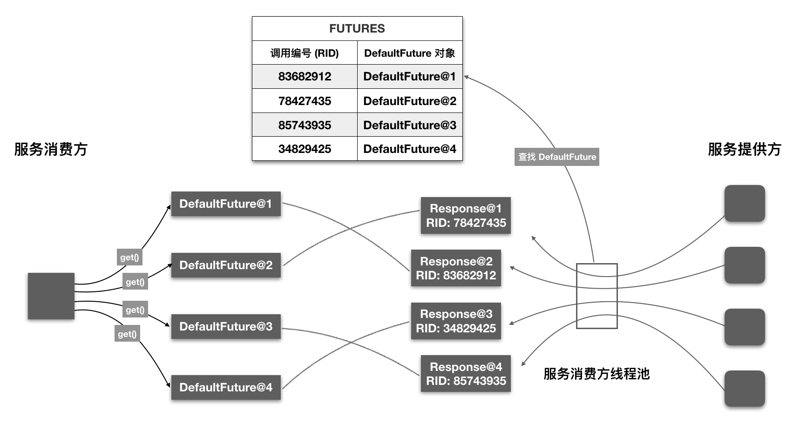

[toc]

## 服务加载机制

### SPI服务发现

* `SPI(Service Provider Interface)`机制通过将接口实现类的全限定名配置在`META-INF/dubbo`文件中，并由服务加载器读取配置文件，加载接口实现类，动态为接口替换实现类，增强扩展能力。

* ==`dubbo`使用增强的`Dubbo SPI`机制，可以配置和按需加载指定的实现类。同时具备`IOC、AOP`能力==：

    具备IOC能力：如果某扩展类属性依赖其他对象，则会自动完成该依赖对象的注入；

    具备AOP能力：自动发现扩展类的包装类，完成包装类的构造，使用包装类替代原始类别返回。


* SPI机制实例：首先定义接口及其实现类

    ```java
    // 服务接口
    // org.apache.dubbo.springboot.demo
    @SPI
    public interface Payment {
        void pay(double amount);
    }
    // 具体实现alipay
    // org.apache.dubbo.springboot.demo.impl.AlipayPayment
    public class .AlipayPayment implements Payment {
        @Override
        public void pay(double amount) {
            System.out.println("Paying " + amount + " using Alipay");
        }
    }
    // 具体实现wechatpay
    // org.apache.dubbo.springboot.demo.impl.WeChatPayPayment
    public class WeChatPayPayment implements Payment {
        @Override
        public void pay(double amount) {
            System.out.println("Paying " + amount + " using WeChatPay");
        }
    }
    ```

    之后将实现类信息配置在`META-INF/dubbo`目录下，以接口全限定名命名的文件中

    ```properties
    alipay=org.apache.dubbo.springboot.demo.consumer.impl.AlipayPayment
    wechatpay=org.apache.dubbo.springboot.demo.consumer.impl.WeChatPayPayment
    ```

    在使用时手动指定需要加载的实现类，完成服务调用

    ```java
    public class PaymentClient {
        public static void main(String[] args) {
            ExtensionLoader<Payment> loader = ExtensionLoader.getExtensionLoader(Payment.class);
            Payment alipay = loader.getExtension("alipay");
            alipay.pay(100);
            Payment wechatPay = loader.getExtension("wechatpay");
            wechatPay.pay(100);
        }
    }
    ```

### SPI机制优势

相较于使用`CGLIB `或`JDK Proxy`生成服务的动态代理机制，

* `SPI`方式可以根据需要，通过修改配置文件，==自动动态加载不同的服务实现，切换实现类无需修改代码==；
* ==自动完成扩展对象的实例化和属性自动装配==，无需手动处理；
* ==通过`ExtensionLoader`统一管理所有扩展点==，更加灵活和易于管理。


### SPI机制实现

* 通过`ExtensionLoader#getExtension(name)`方法获取服务实列时，将触发类加载和实例化，得到服务实例。在获取实例对象时，由于服务实例是单例的，双检查通过后，触发类加载和实例化。

    ```java
    // ExtensionLoader#getExtension
    // 根据服务名，获取配置文件中该服务名对应单例服务对象
    public T getExtension(String name, boolean wrap) {
        // 持有目标对象
        final Holder<Object> holder = getOrCreateHolder(cacheKey);
        Object instance = holder.get();
        // 双检测通过后，触发实例创建
        if (instance == null) {
            synchronized (holder) {
                instance = holder.get();
                if (instance == null) {
                    // 创建拓展实例
                    instance = createExtension(name, wrap);
                    holder.set(instance);
                }
            }
        }
        return (T) instance;
    }    
    ```

#### 类加载

* 创建实例时，首先触发类加载，到配置文件`META-INF/dubbo`读取服务实例列表，根据服务实例名称获得对应的`Class`对象。为了避免同一个类被重复加载，同样使用了双检查机制。

    ```java
    // ExtensionLoader#getExtensionClasses
    // 根据配置文件解析出服务名称到服务类全限定类名映射关系表
    private Map<String, Class<?>> getExtensionClasses() {
        Map<String, Class<?>> classes = cachedClasses.get();
        // 双重检查，防止重复加载
        if (classes == null) {
            synchronized (cachedClasses) {
                classes = cachedClasses.get();
                if (classes == null) {
                    // 触发加载服务Class对象
                    classes = loadExtensionClasses();
                    cachedClasses.set(classes);
                }
            }
        }
        return classes;
    }
    
    // ExtensionLoader#loadResource
    // 根据配置文件，获取服务对象Class对象，本方法位于loadExtensionClasses调用链路下游
    private void loadResource(ClassLoader classLoader,java.net.URL resourceURL) {
        // 获取配置文件内容
        List<String> newContentList = getResourceContent(resourceURL);
        String clazz;
        for (String line : newContentList) {
            String name = null;
            int i = line.indexOf('=');
            // 实例名称 
            name = line.substring(0, i).trim();
            // 实例全限定类名
            clazz = line.substring(i + 1).trim();
            // 加载服务实例class，并通过loadClass方法对类进行缓存
            loadClass(classLoader,extensionClasses,resourceURL,Class.forName(clazz, true, classLoader),name,overridden);
                }
            }
        }
    }
    ```

#### 类组装

* 获得服务实例`Class`对象后，将通过反射创建对象，并执行前置、后置处理器，再通过反射获取所有`setXXX`方法，自动注入依赖，实现`IOC`特性支持，最后完成包装类创建，并注入当前服务实例，完成`AOP`特性支持，最终得到指定的服务实例。

    ```java
    // ExtensionLoader#createExtension
    // 实例化、初始化服务对象
    private T createExtension(String name, boolean wrap) {
        // 从配置文件中加载所有的拓展类，得到“配置项名称”到“配置类”的映射关系表
        Class<?> clazz = getExtensionClasses().get(name);
        // 尝试根据Class信息获取服务实例对象，如果不存在则通过反射获取构造器创建对象
        extensionInstances.putIfAbsent(clazz, createExtensionInstance(clazz));
        instance = (T) extensionInstances.get(clazz);
        
        // 进行前置初始化，类似Spring的postProcessBeforeInitialization，默认无操作
        instance = postProcessBeforeInitialization(instance, name);
        // IOC特性：通过反射获取"setXXX"方法，再通过反射调用setter方法设置依赖
        injectExtension(instance);
        // 进行后置初始化，类似Spring的postProcessAfterInitialization，默认无操作
        instance = postProcessAfterInitialization(instance, name);
        
    	// AOP特性：如果实列存在包装类，初始化包装类并返回
        for (Class<?> wrapperClass : wrapperClassesList) {
            Wrapper wrapper = wrapperClass.getAnnotation(Wrapper.class);
            boolean match = xxx;
            if (match) {
                // 将当前instance作为参数传给Wrapper构造方法，通过反射创建Wrapper实例，然后向Wrapper实例中注入依赖
                instance = injectExtension(
                        (T) wrapperClass.getConstructor(type).newInstance(instance));
                // 后置处理器
                instance = postProcessAfterInitialization(instance, name);
            }
        }
        return instance;
    }
    ```

## 客户端服务请求

### 完整流程


* 当消费者通过dubbo远程调用生产者提供服务时，整个远程服务调用可分为：

    ->消费者通过代理对象`Proxy`发起远程调用；

    ->网络客户端`Client`将编码后的请求发送给服务提供方`Server`；

    ->`Server`收到请求后对数据包解码，将解码后的请求发送至分发器`Dispatcher`，将请求派发到指定的线程池；

    ->在线程池中执行请求的服务。

* 假设服务接口定义为

    ```java
    public interface HelloService {
        public String sayHello(String name);
    }
    ```

    服务端拥有该接口的实现，并通过`@DubboService`注解，将服务注册到`nacos`中

    ```java
    @DubboService
    public class HelloServiceImpl implements HelloService {
        @Override
        public String sayHello(String name) {
            return "Hello " + name;
        }
    }
    ```

    客户端通过注解`@DubboReference`，从`nacos`中获得远程服务的代理，可以通过该代理完成远程服务调用

    ```java
    public class Task {
        @DubboReference
        private HelloService helloService;
    }
    ```

### 服务代理

* `dubbo`使用`Javassist`框架为服务接口生成动态代理类，用以和消费者交互，以`HelloService`为例，通过`arthas`反编译得到生成的代理类

    ```java
    public class HelloServiceDubboProxy0 implements ClassGenerator.DC,EchoService,Destroyable,HelloService {
        // 接口的方法数组
        public static Method[] methods;
        // 请求处理执行方
        private InvocationHandler handler;
        public HelloServiceDubboProxy0(InvocationHandler invocationHandler) {
            this.handler = invocationHandler;
        }
        
    	// 执行服务调用
        public String sayHello(String string) {
            Object[] objectArray = new Object[]{string};
            // 调用 InvocationHandler 实现类的 invoke 方法得到调用结果
            Object object = this.handler.invoke(this, methods[0], objectArray);
            return (String)object;
        }
        // somecode
    }
    ```

* `InvocationHandler#invoke`及进入`InvokerInvocationHandler#invoke`方法，将请求的服务名称、方法名称、方法参数类型、方法实参构建`RpcInvocation`对象，进入请求的发送流程

    ```java
    // InvokerInvocationHandler#invoke
    // 包装远程调用请求，发往下游进行请求发送
    public Object invoke(Object proxy, Method method, Object[] args) throws Throwable {
        // 包装远程调用请求
        RpcInvocation rpcInvocation = new RpcInvocation(
                serviceModel,
                method.getName(),
                invoker.getInterface().getName(),
                protocolServiceKey,
                method.getParameterTypes(),
                args);
        // 发往下游进行请求发送
        return InvocationUtil.invoke(invoker, rpcInvocation);
    }
    ```

### 发起请求

`dubbo`支持同步请求和异步请求。对于同步请求，消费者线程间柱塞，直至请求的响应到来；对于异步请求，发起请求后，消费者线程将不会柱塞，响应到来后支持线程将处理响应数据。==同步请求和异步请求的区别在于，执行等待响应及响应数据反序列化的线程不同。==

#### 同步请求流程


1. 消费者发出请求，立即拿到`CompletableFuture`对象，不会在发送方法处阻塞；

2. 消费者线程自动调用`ThreadlessExecutor.waitAndDrain()`，在线程池任务队列上等待任务到来，此时==消费者线程阻塞==；

3. 当收到响应时，IO线程完成响应头反序列化，并生成响应数据部分反序列化任务，==填充到`ThreadlessExecutor`任务队列中==；

4. ==线程池中任务将由消费者线程执行==，得到业务结果之后，调用`Future.set()`方法进行设置，之后`waitAndDrain()`方法返回；

5. 消费者线程从`Future`中拿到结果值。


####  异步请求流程

1. 消费者发出请求，立即拿到`CompletableFuture`对象，不会在发送方法处阻塞；
2. 直接返回`CompletableFuture`对象，==此时消费者线程不会阻塞==；
3. 当收到响应时，IO 线程完成响应头反序列化，并生成响应数据部分==反序列化任务提交到该请求对应的共享线程池中==；
4. 数据部分反序列化任务完成后，调用`Future.set()`方法进行设置，并==唤醒等待在`CompletableFuture`上线程==，执行回调；
5. 消费者线程从`Future`中拿到结果值。

#### 发起请求入口

* 发起请求将由`AbstractInvoker#invoke`方法开始执行，该==发送方法为异步发送==，在发出请求后，立即拿到`AsyncRpcResult`对象，表示未完成的异步请求结果，消费者线程间不会在发送方法处阻塞。

    之后根据请求是否是同步请求，决定是否在`AsyncRpcResult`上等待响应到来。==如果是同步请求，消费者线程将阻塞，直至响应到来；如果是异步请求，将直接返回，不必等待==。

    ```java
    // AbstractInvoker#invoke
    // 执行发送请求流程
    public Result invoke(Invocation inv) throws RpcException {
        RpcInvocation invocation = (RpcInvocation) inv;
        prepareInvocation(invocation);
        // 发送请求并获得异步返回值
        AsyncRpcResult asyncResult = doInvokeAndReturn(invocation);
        // 如果是同步请求，将等待响应到来再返回
        waitForResultIfSync(asyncResult, invocation);
        return asyncResult;
    }
    // AbstractInvoker#doInvokeAndReturn
    // 发送请求并获得异步返回值
     private AsyncRpcResult doInvokeAndReturn(RpcInvocation invocation) {
         AsyncRpcResult asyncResult = (AsyncRpcResult) doInvoke(invocation);
         return asyncResult;
     }
    ```

* 发送请求之后的`AbstractInvoker#doInvokeAndReturn`方法，将调用`AbstractInvoker#doInvoke`抽象方法，该方法具体由子类实现，不同的RPC协议对应不同的`AbstractInvoker`实现类。下面以`dobbo`协议的`DubboInvoker`为例：

    * 如果是单向通信，直接将`Invocation`包装成`oneway`类型的请求发送，并立即返回内容为空的`RpcResult`，将不会有线程等待调用返回；

    * 如果是双向通信，将获取用于执行等待响应到来任务的线程池`executor`，并创建`DefaultFuture`，表示异步响应，==`executor`中线程在`DefaultFuture`上等待响应返回，并执行回调等逻辑==。然后`DefaultFuture`会被封装成`AsyncRpcResult`并立即返回，==发送过程异步实现，不会在发送处柱塞==。

    ```java
    // Dubbo协议对应的AbstractInvoker实现类
    public class DubboInvoker<T> extends AbstractInvoker<T> {
        // 异步发送请求，并获得异步返回值包装类
         protected Result doInvoke(final Invocation invocation) throws Throwable {
            RpcInvocation inv = (RpcInvocation) invocation;
            // 是否单向通信，不关心调用是否成功与返回值
            boolean isOneway = RpcUtils.isOneway(getUrl(), invocation);
            // 异步无返回值
            if (isOneway) {
                boolean isSent = getUrl().getMethodParameter(methodName, Constants.SENT_KEY, false);
                request.setTwoWay(false);
                // 直接将Invocation包装成oneway类型的Request发送出去，不会创建DefaultFuture
                currentClient.send(request, isSent);
                // 返回异步默认RpcResult
                return AsyncRpcResult.newDefaultAsyncResult(invocation);
            } else {
                // 异步有返回值
                request.setTwoWay(true);
                // 设置执行等待响应到来任务的线程池，同步和异步请求的线程池将不同
                ExecutorService executor = getCallbackExecutor(getUrl(), inv);
                // 创建请求的DefaultFuture对象，executor中线程将在DefaultFuture上等待响应返回，并执行回调
                CompletableFuture<AppResponse> appResponseFuture =
                        currentClient.request(request, timeout, executor).thenApply(AppResponse.class::cast);
                // 将AppResponse封装成AsyncRpcResult返回
                AsyncRpcResult result = new AsyncRpcResult(appResponseFuture, inv);
                result.setExecutor(executor);
                return result;
            } 
        }
    }
    ```

* `DefaultFuture` 继承JDK中的`CompletableFuture`，示未完成的请求结果。

    ==内部维护`CHANNELS`，用于管理请求与`Channe`之间关联，以及`FUTURES`用于管理请求与`DefaultFuture`之间关联==。

    初始化对象时，将完成请求信息存储，并创建定时到期检测任务。创建`DefaultFuture`对象时，可从传入的`Request`对象中，获取调用编号，并将 `<reqId, DefaultFuture>` 映射关系存入到静态`FUTURES`中，==便于在异步发送模式下，后续响应到来后，通过调用编号，找到请求对应的`DefaultFuture`==。

    ```java
    public class DefaultFuture extends CompletableFuture<Object> {
        // 请求与`Channe`之间关联
        private static final Map<Long, Channel> CHANNELS = new ConcurrentHashMap<>();
        // 请求与`DefaultFuture`之间关联
        private static final Map<Long, DefaultFuture> FUTURES = new ConcurrentHashMap<>();
        // 请求ID与请求本身
        private final Long id;
        private final Request request;
        private final Channel channel;
    	// 请求关联的线程池
        private ExecutorService executor;
        // 定时到期检测任务
        private Timeout timeoutCheckTask;
    }
    ```

    

#### 线程模型

* 发送请求的`doInvoke`方法异步执行，但消费者可以选择同步或者异步发送请求。`dubbo`通过使用不同的用于等待响应到来任务的线程池参数，实现消费者端的同步和异步发送。

* `doInvoke`中获取线程池的方法`getCallbackExecutor`的`InvokeMode`可分为： `SYNC`(默认调用模式)、`ASYNC`和`FUTURE`。`SYNC`模式下将返回`ThreadlessExecutor`线程池，另外两种调用模式属于异步调用模式，会根据URL选择对应的共享线程池。

    ```java
    // AbstractInvoker#getCallbackExecutor
    // 根据请求模式获取请求执行等待及回调的线程池
    protected ExecutorService getCallbackExecutor(URL url, Invocation inv) {
        // 同步调用
        if (InvokeMode.SYNC == RpcUtils.getInvokeMode(getUrl(), inv)) {
            return new ThreadlessExecutor();
        }
        // 异步调用
        return ExecutorRepository.getInstance(url.getOrDefaultApplicationModel())
                .getExecutor(url);
    }
    ```
    
* 其中`ThreadlessExecutor`是一种特殊线程池，其内部不管理任何线程。当执行`execute`方法时，只是将任务存储在任务队列中，不会被调度到任何线程执行。当其他线程调用`ThreadlessExecutor.waitAndDrain()`方法等待并执行任务时，将由==调用`waitAndDrain()`方法的线程执行队列中任务==。

    ```java
    public class ThreadlessExecutor extends AbstractExecutorService {
        // 存储提交的任务
        private final Queue<Runnable> queue = new ConcurrentLinkedQueue<>();
        // 保存正在等待任务的线程
        private final AtomicReference<Object> waiter = new AtomicReference<>();
    
        // 在指定的时间内等待任务的到来，并执行队列中的所有任务
        public void waitAndDrain(long deadline) throws InterruptedException {
            Runnable runnable = queue.poll();
            // 等待任务到来或超时
            while ((runnable = queue.poll()) == null && waiter.get() == Thread.currentThread()) {
                long restTime = deadline - System.nanoTime();
                if (restTime <= 0) {
                    return;
                }
                // 让线程等待一段时间，直到任务到来或超时
                LockSupport.parkNanos(this, restTime);
            }
            // 循环执行队列中的任务，直到队列为空
            do {
                if (runnable != null) {
                    runnable.run();
                }
            } while ((runnable = queue.poll()) != null);
        }
        
        // 提交任务到任务队列
        @Override
        public void execute(Runnable runnable) {
            // 将提交的任务封装成RunnableWrapper对象，并添加到队列
            RunnableWrapper run = new RunnableWrapper(runnable);
            queue.add(run);
            // 唤醒正在等待任务的线程
            LockSupport.unpark((Thread) waiter.get());
        }
    }
    ```

    


* 当完成请求发送后，得到异步请求结果`AsyncRpcResult`，表示未完成的RPC请求。之后将返回`AbstractInvoker#invoke`继续执行`AbstractInvoker#waitForResultIfSync`方法，等待请求到来。 

    ==如果是异步请求，将直接返回，不必等待；如果是同步请求，由消费者线程直接调用`AsyncRpcResult#get`方式柱塞消费者线程，直至获得请求结果==。

    ```java
    // AbstractInvoker#waitForResultIfSync
    // 等待请求到来
    private void waitForResultIfSync(AsyncRpcResult asyncResult, RpcInvocation invocation) {
        // 如果是异步请求，将直接返回，不必等待
        if (InvokeMode.SYNC != invocation.getInvokeMode()) {
            return;
        }
        Object timeoutKey = invocation.getObjectAttachmentWithoutConvert(TIMEOUT_KEY);
        long timeout = RpcUtils.convertToNumber(timeoutKey, Integer.MAX_VALUE);
        // 如果是同步请求，将在Future上等待响应到来再返回
        asyncResult.get(timeout, TimeUnit.MILLISECONDS);
        } 
    }
    ```

* 同步请求在发送请求后，将在`AsyncRpcResult#get`中使用`ThreadlessExecutor`执行等待响应到来的任务，即是消费者线程执行等待任务，消费者线程将被阻塞，直至响应到来，之后在`CompletableFuture`上获取响应结果并返回；

    异步请求时，一般由消费者使用`CompletableFuture`设置回调，由线程池线程执行`AsyncRpcResult#get`方法，消费者线程不会阻塞。

    ```java
    public class AsyncRpcResult implements Result {
        // 等待请求返回及执行回调的线程池
        private Executor executor;
        // 阻塞当前线程，等待响应到来
        public Result get() throws InterruptedException, ExecutionException {
            // 同步调用方式等待响应到来
            if (executor instanceof ThreadlessExecutor) {
                ThreadlessExecutor threadlessExecutor = (ThreadlessExecutor) executor;
                // 检测调用结果是否返回
                while (!responseFuture.isDone() && !threadlessExecutor.isShutdown()) {
                    // ThreadlessExecutor.waitAndDrain()方法将柱塞当前线程，同步等待
                    threadlessExecutor.waitAndDrain(Long.MAX_VALUE);
                }
            }
            // 结束阻塞或者异步请求，获取响应
            return responseFuture.get();
        }
    }
    ```

### 请求编码


发送请求的`ExchangeClient#request`方法执行消息编码，在编码后再发送出去。

* 数据包分为消息头和消息体。消息头用于存储元信息：魔数、数据包类型（Request/Response）、调用方式(单向调用/双向调用)、序列化器、请求编号、消息体长度；消息体中用于存储具体的调用消息：服务名、服务版本、方法名、参数列表。

    消息头将通过`ExchangeCodec#encodeRequest`方法编码后以NIO的方式写入请求数据，消息实参通过`DubboCodec#encodeRequestData`方法使用第三方序列化组件完成编码。

    ```java
    // DubboCodec#encodeRequestData
    // 对消息头和消息体编码
    protected void encodeRequestData(Channel channel, ObjectOutput out, Object data, String version)
            throws IOException {
        RpcInvocation inv = (RpcInvocation) data;
        // 要请求的服务名和版本
        out.writeUTF(version);
        String serviceName = inv.getAttachment(INTERFACE_KEY);
        if (serviceName == null) {
            serviceName = inv.getAttachment(PATH_KEY);
        }
        out.writeUTF(serviceName);
        out.writeUTF(inv.getAttachment(VERSION_KEY));
    	// 服务的方法和参数列表
        out.writeUTF(inv.getMethodName());
        out.writeUTF(inv.getParameterTypesDesc());
        Object[] args = inv.getArguments();
        if (args != null) {
            for (int i = 0; i < args.length; i++) {
                // 使用序列化组件对消息实参进行序列化
                out.writeObject(callbackServiceCodec.encodeInvocationArgument(channel, inv, i));
            }
        }
        out.writeAttachments(inv.getObjectAttachments());
    }
    
    ```

    

## 服务端服务响应

### 请求解码

* 服务端收到请求后，在`ExchangeCodec#decode`中，将通过检测消息头中的魔数是否与规定的魔数相等，以及收到数据长度是否和请求头中说明的请求头相等，提前拦截掉非常规数据包。

    最后调`DecodeableRpcInvocation#decode`进行后续的解码工作，得到服务方法名、调用参数列表，最终获得完整请求`request`对象。
    
    ```java
    // DecodeableRpcInvocation#decode
    // 对请求解码
    public Object decode(Channel channel, InputStream input) throws IOException {
    	// 获得服务路径、版本、方法、参数类型
        String path = in.readUTF();
        setAttachment(PATH_KEY, path);
        String version = in.readUTF();
        setAttachment(VERSION_KEY, version);
        String keyWithoutGroup = keyWithoutGroup(path, version);
        checkPayload(keyWithoutGroup);
        setMethodName(in.readUTF());
        String desc = in.readUTF();
        setParameterTypesDesc(desc);
        // somecode
        // 设置参数类型数组
        setParameterTypes(pts);
        // 解析运行时参数
        decodeArgument(channel, pts, args);
        return this;
    }
    
    ```

### 服务调用

* `AllChannelHandler`作为响应请求的入口，将消费者请求对象`Request`封装到`ChannelEventRunnable `中，`dubbo`根据不同任务分发策略，依据请求类型，决定`ChannelEventRunnable `由任务提交线程即当前IO线程执行，还是提交到线程池执行。

    | 策略       | 用途                                                         |
    | ---------- | ------------------------------------------------------------ |
    | all        | 所有消息都派发到线程池，包括请求，响应，连接事件，断开事件等。默认分发策略 |
    | direct     | 所有消息都不派发到线程池，全部在 IO 线程上直接执行           |
    | message    | 只有请求和响应消息派发到线程池，其它消息均在 IO 线程上执行   |
    | execution  | 只有请求消息派发到线程池，不含响应。其它消息均在 IO 线程上执行 |
    | connection | 在 IO 线程上，将连接断开事件放入队列，有序逐个执行，其它消息派发到线程池 |

* 在`ChannelEventRunnable`在被线程池中被调度执行时，先完成对请求数据的解码，然后执行`HeaderExchangeHandler#received`，执行后续服务调用逻辑。

    ```java
    // HeaderExchangeHandler#received
    // 处理服务调用
    public void received(Channel channel, Object message) throws RemotingException {
        final ExchangeChannel exchangeChannel = HeaderExchangeChannel.getOrAddChannel(channel);
        if (message instanceof Request) {
           // 处理请求对象
            Request request = (Request) message;
            // 双向通信
            if (request.isTwoWay()) {
                 // 向后调用服务，并返回调用结果，关注调用结果并形成 Response 返回给客户端
                handleRequest(exchangeChannel, request);
            } else {
                // 单向通信，直接交给上层的 DubboProtocol.requestHandler，不会返回任何 Response。
                handler.received(exchangeChannel, request.getData());
            }
        } 
    }
    // HeaderExchangeHandler#handleRequest
    // 处理服务调用
    void handleRequest(final ExchangeChannel channel, Request req) throws RemotingException {
        // 响应对象
        Response res = new Response(req.getId(), req.getVersion());
        // 获取 RpcInvocation 对象
        Object msg = req.getData();
        // 异步执行结果
        CompletionStage<Object> future = handler.reply(channel, msg);
        // 请求处理完成后回调
        future.whenComplete((appResult, t) -> {
            // 设置请求处理状态
            res.setStatus(Response.OK);
            // 设置调用结果
            res.setResult(appResult);
            // 发送请求响应
            channel.send(res);
        });
    }
    ```
    
* 服务端服务实例对象被封装成`DubboInvoker`对象，`DubboInvoker` 是`AbstractInvoker`的实现类，实现自己的`doInvoke`方法。==当服务端收到请求时，从导出服务容器`exporterMap `中取出请求的`DubboInvoker`，并调用`invoke()`处理请求==。

    ```java
    // DubboProtocol#ExchangeHandlerAdapter#reply
    // 回复请求
    public CompletableFuture<Object> reply(ExchangeChannel channel, Object message) throws RemotingException {
        Invocation inv = (Invocation) message;
        // 从导出服务容器`exporterMap `中获取 Invoker 实例
        Invoker<?> invoker = inv.getInvoker() == null ? getInvoker(channel, inv) : inv.getInvoker();
        RpcContext.getServiceContext().setRemoteAddress(channel.getRemoteAddress());
        // 通过 Invoker 调用具体的服务
        Result result = invoker.invoke(inv);
        return result.thenApply(Function.identity());
    }
    
    // DubboProtocol#getInvoker
    // 获取请求服务对用的Invoker
    Invoker<?> getInvoker(Channel channel, Invocation inv) throws RemotingException {
    	// 计算 service key，格式为 groupName/serviceName:serviceVersion:port
        String serviceKey = serviceKey(port, path, (String) inv.getObjectAttachmentWithoutConvert(VERSION_KEY), (String)
                inv.getObjectAttachmentWithoutConvert(GROUP_KEY));
        // 从 exporterMap 查找与 serviceKey 相对应的 DubboExporter 对象，
        DubboExporter<?> exporter = (DubboExporter<?>) exporterMap.get(serviceKey);
        Invoker<?> invoker = exporter.getInvoker();
        inv.setServiceModel(invoker.getUrl().getServiceModel());
        return invoker;
    }
    ```

* 执行请求响应的`Invoker#invoke `方法定义在 `AbstractProxyInvoker `中，执行服务调用，并构建异步请求响应。

    ```java
    // AbstractProxyInvoker#invoke 
    // 执行服务调用，并构建有异步请求响应
    public Result invoke(Invocation invocation) throws RpcException {
         // 调用 doInvoke 执行后续的调用
        Object value = doInvoke(
                proxy, invocation.getMethodName(), invocation.getParameterTypes(), invocation.getArguments());
    	// 构建有异步请求响应
        CompletableFuture<Object> future = wrapWithFuture(value, invocation);
        CompletableFuture<AppResponse> appResponseFuture = future.handle((obj, t) -> {
            result.setValue(obj);
            return result;
        });
        return new AsyncRpcResult(appResponseFuture, invocation);
     }
    ```

* `AbstractProxyInvoker#doInvoke`是一个抽象方法，由具体的`Invoker`实例实现，而==`Invoker`实例是在运行时通过 `JavassistProxyFactory`动态创建==。在`getInvoker`方法中将创建具备`doInvoke`方法的`Invoker`。

    ```java
    // JavassistProxyFactory#getInvoker
    // 创建具备`doInvoke`方法的`Invoker`
    public <T> Invoker<T> getInvoker(T proxy, Class<T> type, URL url) {
        // 创建匿名类对象
            final Wrapper wrapper =
                    Wrapper.getWrapper(proxy.getClass().getName().indexOf('$') < 0 ? proxy.getClass() : type);
            return new AbstractProxyInvoker<T>(proxy, type, url) {
                @Override
                protected Object doInvoke(T proxy, String methodName, Class<?>[] parameterTypes, Object[] arguments)
                        throws Throwable {
                    // 调用 wrapper.invokeMethod 方法进行真正的服务调用
                    return wrapper.invokeMethod(proxy, methodName, parameterTypes, arguments);
                }
            };
        } 
    }
    ```

* `doInvoke`方法中实际上使用了`Wrapper.invokeMethod`去真正执行服务调用，`Wrapper`是一个抽象类，其中`invokeMethod `是一个抽象方法。`Dubbo `会在运行时==通过`Javassist`框架为`Wrapper`生成实现类，并实现`invokeMethod`方法，在方法中根据请求信息找到并调用具体的服务==。以``HelloServiceImpl`为例，`Javassist`为其生成的`Wrapper#invokeMethod`如下

    ```java
    // Wrapper#invokeMethod
    // 根据请求信息找到并调用具体的服务
    public Object invokeMethod(Object object, String string, Class[] arrclass, Object[] arrobject) throws InvocationTargetException {
        // 具体要被调用的服务
        HelloService helloService;
        helloService = (HelloService)object;
        // 根据方法名调用指定的方法
        if ("sayHello".equals(string) && arrclass.length == 1) {
            // 真正的调用服务
            return helloService.sayHello((String)arrobject[0]);
        }
    }
    ```

    

## 客户端获取结果

### 响应解码

* 服务提供方调用指定服务后，会调用结果封装到`Response`对象中，并将该对象返回给服务消费方。服务消费方在收到响应数据后，首先对响应数据的数据头进行解码，并将待解码的数据体转换得到`DecodeableRpcResult`对象(==不在IO线程完成数据体的解码是为了防止IO线程被柱塞==)，向下游传递`Response`对象。

    ```java
    // DubboCodec  
    protected Object decodeBody(Channel channel, InputStream is, byte[] header){
         // 解码响应数据头，得到请求编号
        long id = Bytes.bytes2long(header, 4);
        Response res = new Response(id);
        // 响应数据部分待解码，由线程池中由线程池中线程完结解码，防止IO线程被柱塞
        DecodeableRpcResult result=xxx;    
    	data = result;
        res.setResult(data);
        return res;
     }
    ```
    
* 当响应到来时，消费者侧管道`Channel`就绪，可以进行数据读取，触发`AllChannelHandler#received`方法，将后续`ChannelHandler.received`方法的调用封装成任务，==提交到与该请求对应的`DefaultFuture `内部的线程池中==。

    ==在后续处理中由该响应对应的线程池，完成响应数据的解码，并将结果放入该响应对应的`DefaultFuture`。==

    ```java
    // AllChannelHandler#received
    // 将后续`ChannelHandler.received`方法的调用封装成任务提交到线程池
    public void received(Channel channel, Object message) throws RemotingException {
        ExecutorService executor = getPreferredExecutorService(message);
        executor.execute(new ChannelEventRunnable(channel, handler, 
        }
    }
    // WrappedChannelHandler#getPreferredExecutorService
    // 获取执行ChannelHandler.received任务的线程池
    public ExecutorService getPreferredExecutorService(Object msg) {
        if (msg instanceof Response) {
            Response response = (Response) msg;
            // 获取当前响应对应请求的DefaultFuture，返回其内部的ExecutorService
            DefaultFuture responseFuture = DefaultFuture.getFuture(response.getId());
            ExecutorService executor = responseFuture.getExecutor();
            return executor;
        } else {
            return getSharedExecutorService(msg);
        }
    }
    ```

### 唤醒消费者




* 发送请求时，得到`DefaultFuture`对象表示未完成的请求结果，`DefaultFuture`对象可从传入的`Request`对象中，获取调用编号，并将 `<reqId, DefaultFuture>` 映射关系存入到静态`Map`中。

    在收到`Response`对象后，根据`Response`对象中的调用编号到`FUTURES`集合中取出相应的`DefaultFuture`对象，==唤醒柱塞在`DefaultFuture#get`上的线程==。

    ```java
    public class DefaultFuture extends CompletableFuture<Object> {
        private static final Map<Long, DefaultFuture> FUTURES = new ConcurrentHashMap<>();
        // 获得响应对应的请求，唤醒等待线程
        public static void received(Channel channel, Response response, boolean timeout) {
            // 根据调用编号从 FUTURES 集合中查找指定的 DefaultFuture 对象
            // 服务消费方的线程池会收到多个响应对象，通过编号，将响应发送给正确的请求方
            DefaultFuture future = FUTURES.remove(response.getId());
            // 唤醒柱塞在`DefaultFuture#get`上的线程
            future.doReceived(response);
            shutdownExecutorIfNeeded(future);
    	}
    }
    ```

* `DefaultFuture` 继承JDK中的`CompletableFuture`，`DefaultFuture#doReceived`方法将调用`CompletableFuture#postComplete`用于唤醒阻塞线程。

    `postComplete`工作流程较为复杂，可以简单概述其流程为：

    * 将任务间依赖关系构建为一颗多叉树，`CompletableFuture`中的`stack`字段，保存依赖该任务完成的后续任务，可以将其理解为当前节点的子节点。
    * ==使用`DFS`方法遍历该多叉树==，首先构建任务栈`STACK`，其被初始化为根节点，节点`x`出栈表示该任务前置依赖已完成，可以执行。
    * 之后将`x`的全部子节点入栈，继续执行节点遍历，直至栈为空。

    ```java
    public class CompletableFuture<T> implements Future<T>, CompletionStage<T> {
        volatile Object result;   
        // 等待当前CompletableFuture完成的后置任务
        volatile Completion stack; 
    
        // DFS方式唤醒依赖依赖图中，等待当前CompletableFuture完成的后置任务
        final void postComplete() {
            // f=当前处理的任务；h=依赖f完成的后置任务
            CompletableFuture<?> f = this; Completion h;
            while ((h = f.stack) != null ||
                   (f != this && (h = (f = this).stack) != null)) {
                // d=依赖f完成的某个后置任务; t=stack中d的下一个后置任务
                CompletableFuture<?> d; Completion t;
                // 将 f 的栈顶任务 h 出栈
                if (STACK.compareAndSet(f, h, t = h.next)) {
                    // h 还不是 f 栈中的最后一个任务
                    if (t != null) {
                        if (f != this) {
                            // 如何已切换到后置任务，将f的栈顶任务h压入this栈中
                            pushStack(h);
                            continue;
                        }
                        // 将STACK的NEXT从指向h，改为指向t
                        NEXT.compareAndSet(h, t, null); 
                    }
                    // 直接执行任务 h，并尝试让f指向依赖h任务的节点，如果不存在则再次指向自身
                    f = (d = h.tryFire(NESTED)) == null ? this : d;
                }
            }
        }
    }
    ```

* ==当任务执行时，将唤醒等待在`CompletableFuture`上的线程==，对于同步调用场景，消费者线程将从`DefaultFuture#get`返回，并获得响应值；对于异步调用场景，设置在`DefaultFuture`上面的回调将被触发，并可以获取到响应结果，至此完成一次完整调用。
