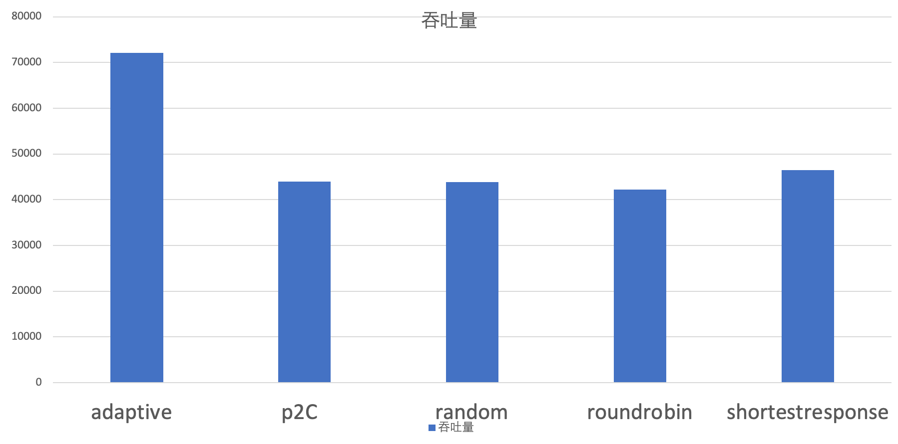
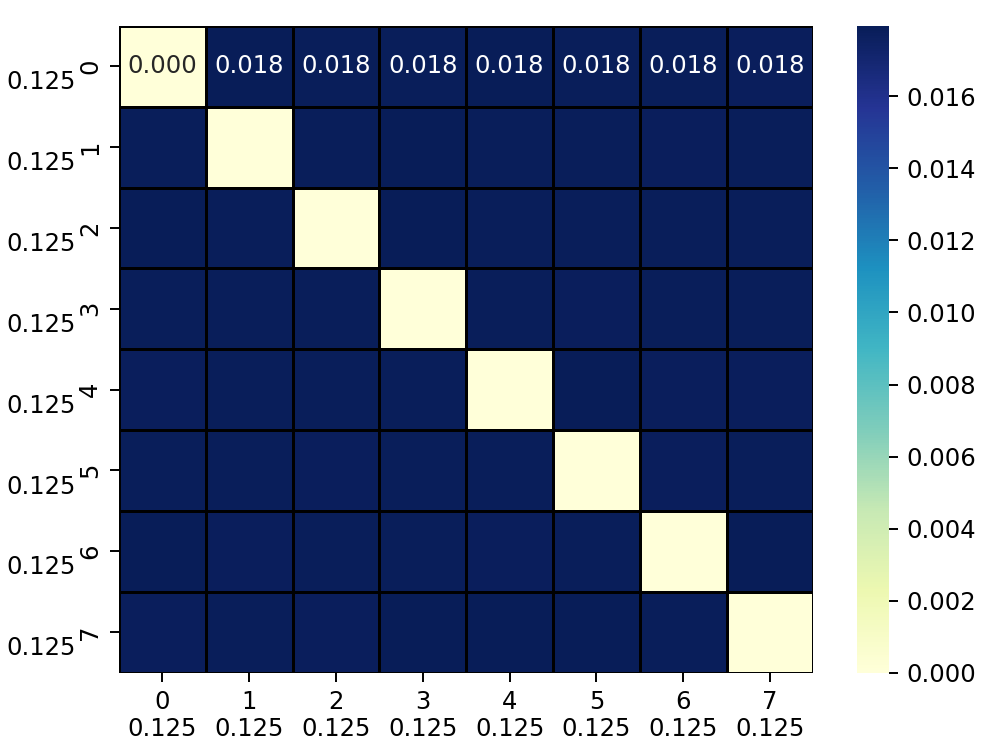
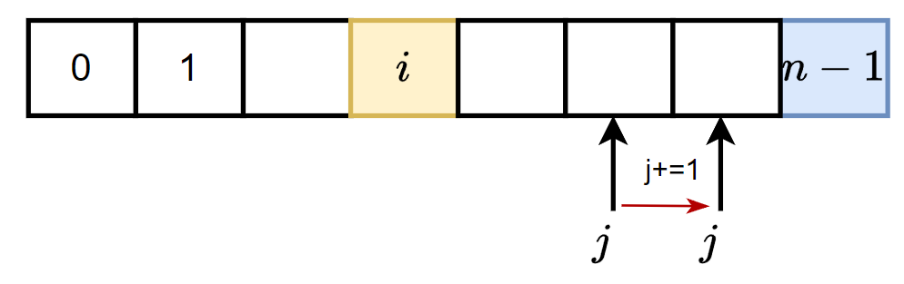

## 概念

路由、负载均衡、容错：

* 路由是多个Provider中按照路由规则，选出一个子集，比例按区域就近选择机房；
* 负载均衡：从子集中选出一个 Provider  进行本次调用；
* 集群容错：如果调用失败，根据集群容错策略，进行重试或定时重发或快速失败等。

## 概述

### 切入点

* `dubbo`支持服务端和客户端服务级别以及方法级别负载均衡。以客户端服务均衡为例，在`DefaultFilterChainBuilder`过滤器链路的`RouterSnapshotFilter`过滤器中实现负载均衡逻辑。

* 负载均衡模块使用模板模式，抽象类`AbstractLoadBalance`定义了负载均衡器的行为逻辑，具体的负责均衡策略由其之类实现。`dubbo`提供如下6种负载均衡策略，配置在`org.apache.dubbo.rpc.cluster.LoadBalance`文件中，通过`SPI`机制完成具体的均衡器加载。

```json
random=org.apache.dubbo.rpc.cluster.loadbalance.RandomLoadBalance
roundrobin=org.apache.dubbo.rpc.cluster.loadbalance.RoundRobinLoadBalance
leastactive=org.apache.dubbo.rpc.cluster.loadbalance.LeastActiveLoadBalance
consistenthash=org.apache.dubbo.rpc.cluster.loadbalance.ConsistentHashLoadBalance
shortestresponse=org.apache.dubbo.rpc.cluster.loadbalance.ShortestResponseLoadBalance
adaptive=org.apache.dubbo.rpc.cluster.loadbalance.AdaptiveLoadBalance
```

* 负载均衡的入口为`AbstractClusterInvoker#invoke`，完成负载均衡器的初始化以及负载均衡器调用。

```java
// org.apache.dubbo.rpc.cluster.support.AbstractClusterInvoker#invoke
public Result invoke(final Invocation invocation) throws RpcException {
    checkWhetherDestroyed();
    InvocationProfilerUtils.enterDetailProfiler(invocation, () -> "Router route.");
    List<Invoker<T>> invokers = list(invocation);
    InvocationProfilerUtils.releaseDetailProfiler(invocation);
    checkInvokers(invokers, invocation);
    // 初始化均衡器
    LoadBalance loadbalance = initLoadBalance(invokers, invocation);
    RpcUtils.attachInvocationIdIfAsync(getUrl(), invocation);
    InvocationProfilerUtils.enterDetailProfiler(
            invocation, () -> "Cluster " + this.getClass().getName() + " invoke.");
    try {
        // 执行负载均衡器选择策略
        return doInvoke(invocation, invokers, loadbalance);
    } finally {
        InvocationProfilerUtils.releaseDetailProfiler(invocation);
    }
}
```

* 负载均衡器的初始化依赖于请求中名称为`loadbalance`的参数，该参数来自于`@DubboReference(loadbalance = "lbname")`。将从第一个执行器中获取负载均衡名称，如果未手动指定负载均衡策略，则默认使用`random`策略，即`RandomLoadBalance`策略，最后通过`SPI`机制加载指定的负载均衡器。

```java
// org.apache.dubbo.rpc.cluster.support.AbstractClusterInvoker#initLoadBalance
protected LoadBalance initLoadBalance(List<Invoker<T>> invokers, Invocation invocation) {
    ApplicationModel applicationModel = ScopeModelUtil.getApplicationModel(invocation.getModuleModel());
    if (CollectionUtils.isNotEmpty(invokers)) {
        return applicationModel
            	// 获得lb加载器
                .getExtensionLoader(LoadBalance.class)
            	// 获得lb实例
                .getExtension(invokers.get(0)
                        .getUrl()
                         // 获得loadbalance参数值，默认random
                        .getMethodParameter(
                                RpcUtils.getMethodName(invocation), LOADBALANCE_KEY, DEFAULT_LOADBALANCE));
    } else {
        return applicationModel.getExtensionLoader(LoadBalance.class).getExtension(DEFAULT_LOADBALANCE);
    }
}
```

### 汇总

`dubbo`默认提供以下均衡策略

| 算法                        | 特性                    | 备注                                               |
| :-------------------------- | :---------------------- | :------------------------------------------------- |
| RandomLoadBalance           | 加权随机                | 默认算法，默认权重相同                             |
| RoundRobinLoadBalance       | 加权轮询                | 借鉴于 Nginx 的平滑加权轮询算法，默认权重相同，    |
| LeastActiveLoadBalance      | 最少活跃优先 + 加权随机 | 背后是能者多劳的思想                               |
| ShortestResponseLoadBalance | 最短响应优先 + 加权随机 | 更加关注响应速度                                   |
| ConsistentHashLoadBalance   | 一致性哈希              | 确定的入参，确定的提供者，适用于有状态请求         |
| AdaptiveLoadBalance         | 自适应负载均衡          | 随机选择两个节点后，选择二者中 load 最小的那个节点 |

## 自适应负载均衡

### 概述

* `AdaptiveLoadBalance`为[Power of Two Choice](http://www.eecs.harvard.edu/~michaelm/NEWWORK/postscripts/twosurvey.pdf)策略的变体，实现自适应负载均衡。对于每次调用，从可用的provider列表中做两次随机选择，选出两个节点`providerA`和`providerB`。比较`providerA`和`providerB`两个节点，选择负载较小的那个节点。通过随机选择两个节点的优胜者来避免羊群效应。

    ==负载均衡的羊群效应==：加权轮询、加权随机等策略倾向于选择权重更大的节点，导致选择具有盲从性，可能导致短时间内大量请求到达节点，导致节点高负荷运转。P2C 算法通过两次随机大大减少了多个请求同时选择同一台服务器的概率，节点选择具有分散性，避免盲从。

### 负载指标

* 该策略使用`AdaptiveMetrics`维护每个节点的负载状态，包括CPU负载、最近请求延迟、正在处理请求数、上次被调用时刻等。请求发出时、请求返回时更新统计信息。计算节点的负载时总分考虑了CPU负载、请求延时滑动均值、正在处理请求数、请求成功率、节点权重、请求剩余时间等因素，大致可以总结为：

$$
\frac{cpuLoad\times(\sqrt{meanLag}+1)\times(inflight+1)}{successRate\times nodeWeight+1}
$$

* 对权重有积极影响的因子，如成功率、节点权重位于分母，使得具有更高成功率、更高权重的节点负载更小，优先被选择；对权重有消极影响的因子，如cpu负载、lag延迟、积压请求数inflight，放在分子的位置，使得cpu负载高、延迟大、处理请求多的节点负载更大，选择优先级靠后。详情可见[Dubbo Adaptive 算法](https://cn.dubbo.apache.org/zh-cn/overview/reference/proposals/heuristic-flow-control/#adaptive算法)

```java
public class AdaptiveMetrics {
    // cpu负载
    private double providerCPULoad = 0;
    // 上一次请求时延
    private long lastLatency = 0;
    // 上次被请求时间
    private long pickTime = System.currentTimeMillis();
    // 请求总数
    private final AtomicLong consumerReq = new AtomicLong();
    // 成功请求数
    private final AtomicLong consumerSuccess = new AtomicLong();
    // 异常请求数
    private final AtomicLong errorReq = new AtomicLong();
    // 请求延时的滑动均值
    private double ewma = 0;
}
```

* 策略由于考虑到节点的负载特性，维护更新节点处理能力，将流量尽可能分配到吞吐能力高的机器上，适合提供端机器配置差距较大的情况，此时相较于注重公平性的 `Random`、`RoundRobin`、和 `ConsistentHash`策略`adaptive`能提供更好的吞吐量。



```java
public class AdaptiveLoadBalance extends AbstractLoadBalance {
    public static final String NAME = "adaptive";
    private final AdaptiveMetrics adaptiveMetrics;

    @Override
    protected <T> Invoker<T> doSelect(List<Invoker<T>> invokers, URL url, Invocation invocation) {
        Invoker<T> invoker = selectByP2C(invokers, invocation);
        // 更新统计值
        adaptiveMetrics.addConsumerReq(getServiceKey(invoker, invocation));
        adaptiveMetrics.setPickTime(getServiceKey(invoker, invocation), startTime);
        return invoker;
    }

    private <T> Invoker<T> selectByP2C(List<Invoker<T>> invokers, Invocation invocation) {
        int length = invokers.size();
        // 从可用的provider列表中做两次随机选择，选出两个节点
        int pos1 = ThreadLocalRandom.current().nextInt(length);
        int pos2 = ThreadLocalRandom.current().nextInt(length - 1);
        if (pos2 >= pos1) {
            pos2 = pos2 + 1;
        }
        // 比较两个节点，选择负载较小的那个节点
        return chooseLowLoadInvoker(invokers.get(pos1), invokers.get(pos2), invocation);
    }
}
```

### 选择公平性分析

* 在随机选择两个节点时，使用了两次随机，并且两次随机范围不一致，同时根据两次随机值调整节点顺序。该方法是一种简单高效且公平的从集合中选择两个不同节点的方法，假设共有`n`个可选节点，编号为`0`到`n-1`，两次选择及调整后获得节点编号为`i, j`。

    对于编号为0的节点，在经历两轮选择后，该节点被选择概率等于第一轮选中0号节点概率`P(i=0, j)`，或者第一轮选中节点`i>0`并且第二轮选中0号节点的概率`P(i>0,j=0)`之和，其中第二轮选中`j=0`号节点时需要保证第一轮选择时获得节点编号大于`i>0`，以保证`j`无需调整：
    $$
    \begin{align*}
    P_0   &= P(i=0,j)+P(i>0,j=0) \\
       &=\frac{1}{n}+\frac{n-1}{n}\frac{1}{(n-1)} \\
       &= \frac{2}{n}
    \end{align*}
    $$
    对于编号为`k`的节点(`0<k<n-1`)，在经历两轮选择后，该节点被选择概率等于第一轮选中k号节点的概率`P(i=k,j)`，或者第一轮选中节点`i>k`并且第二轮选中`j=k`号节点的概率`P(i>k,j=k)`，或者第一轮选中节点`i<=k-1`并且第二轮选中节点`j=k-1`概率`P(i<=k-1,j=k-1)`之和：
    $$
    \begin{align*}
    P_k   &= P(i=k,j)+P(i>k, j=k)+P( i\leq k-1, j=k-1)\\
       &=\frac{1}{n}+\frac{n-1-k}{n}\frac{1}{n-1}+\frac{k}{n}\frac{1}{n-1} \\
       &= \frac{2}{n}
    \end{align*}
    $$
    对于编号为`n-1`的节点，在经历两轮选择后，该节点被选择概率等于第一轮选中`n-1`号节点的概率`P(i=n-1,j)`，或者第一轮选中节点`i<=n-2`并且第二轮选中节点`j=n-2`的概率`P(i<=n-2,j=n-2)`之和：
    $$
    \begin{align*}
    P_{n-1}   &= P({i=n-1,j})+P({i\leq n-2,j=n-2} \\
       &=\frac{1}{n}+\frac{n-1}{n}\frac{1}{n-1} \\
       &= \frac{2}{n}
    \end{align*}
    $$
    可以看出$P_{n-1}= P_0=P_k$，所有节点被选择概率相同。下图展示了`p2c`策略下，`n=8`时经历1000000次模拟后，不同节点对被选择概率，可以看出节点对被选择概率分布均匀，汇总得到各个节点被选择概率`[0.25, 0.25, 0.25, 0.25, 0.25, 0.25, 0.25, 0.25]`，数据与推算理论概率值相符。证明`p2c`均衡策略是一种公平策略。



从另一种角度出发，上述选择方法可以看作是`Fisher-Yates shuffle`洗牌算法的变种。传统的洗牌算法要求集合支持随机下标访问，并且需要交换选择元素与待选择区间最后一个元素位置

```python
for l from n−1 down to 1 do
     i ← random integer such that 0 ≤ i ≤ l
     exchange a[i] and a[l]
```

`p2c`策略针对只选择两个随机元素的场景进行特定性优化，第一次选择得到区间`[0, n-1]`内的随机数`i`后，并不会真正交换选择元素`a[i]`与待选择区间最后一个元素`a[n-1]`位置，而只是标记二者已经完成交换。第二次生成随机数时，由于已经假定完成交换，所以生成随机数的范围变为`[0,n-2]`，得到随机数`j`。

此时如果`j<i`，由于`i`在`j`右侧，第一次是否真正交换`a[i]`与a[n-1]的位置并不会对`a[j]`产生影响。


如果`j>=i`则`a[i]`会对`a[j]`产生影响，`a[i]`占据一个下标，将可能导致重复选取，并且由于`a[i]`的存在导致`a[n-2]`不会被选择到，所以需要将`j+=1`，消除`a[i]`的影响。



通过上述策略，不涉及元素位置交换，也不要求待选择集合需要支持随机下标访问。

## 一致性哈希负载均衡

### 概述

* 一致性哈希策略，`ConsistentHashLoadBalance`内部维护`ConcurrentMap<<String, ConsistentHashSelector<?>>`保存远程调用的方法的选择器，`key`为远程调用的服务名+方法名，`value`为该方法对应的一致性哈希选择器`ConsistentHashSelector`。

* 选择器内部维护`TreeMap<Long, Invoker<T>>`用于构建哈希环，初始化时据节点地址哈希值确定物理节点在哈希环上位置，在获取执行请求的节点时，先根据请求参数计算请求的哈希值，找到在哈希环上顺时针方向，第一个物理节点即为调用节点。通过这种方法保证同一个远程方法调用将始终被同一个节点执行，实现了亲和性调度，适合于需要依赖上下文的任务。


```java
public class ConsistentHashLoadBalance extends AbstractLoadBalance {
    public static final String NAME = "consistenthash";
    // key为远程调用服务名+方法名，value为该方法节点选择器
    private final ConcurrentMap<String, ConsistentHashSelector<?>> selectors =
            new ConcurrentHashMap<String, ConsistentHashSelector<?>>();

    protected <T> Invoker<T> doSelect(List<Invoker<T>> invokers, URL url, Invocation invocation) {		 		// key=serviceName+methodName
        String methodName = RpcUtils.getMethodName(invocation);
        String key = invokers.get(0).getUrl().getServiceKey() + "." + methodName;
        // 计算节点列表的哈希值
        int invokersHashCode = invokers.hashCode();
        // 当远程方法可用物理节点发生变化时，重新构建哈希环
        ConsistentHashSelector<T> selector = (ConsistentHashSelector<T>) selectors.get(key);
        if (selector == null || selector.identityHashCode != invokersHashCode) {
            selectors.put(key, new ConsistentHashSelector<T>(invokers, methodName, invokersHashCode));
            selector = (ConsistentHashSelector<T>) selectors.get(key);
        }
        // 根据请求参数选择节点
        return selector.select(invocation);
    }
}
```

### 哈希环构建

* 此外由于哈希算法的随机性，每个物理节点负责的哈希值区间的任务数相近，保证了每个节点都具有相同的负载。此处使用`md5`算法构建32位的哈希值，相较于传统的基于字符串`ASCII`码的哈希值，可以减少哈希冲突，并提供更均匀的哈希值分布。

* 为保证每个节点节点负责请求数相近，为每个真实的节点节点构建默认160个虚拟节点，`TreeMap`中一个物理节点将对应多个`key`，但他们的`value`都指向相同的物理节点，实现一个物理节点负责多个均匀分布于哈希环上区间对应请求的执行，使得请求分配更加均衡。由于虚拟节点较多，频繁的md5计算需要消耗一定的性能，同时一次md5计算得到长为16的Byte数组，可以生成4个长为32位的哈希值，所以为了减少md5计算次数，一次md5计算结果将作为4个虚拟节点的哈希值。


```java
private static final class ConsistentHashSelector<T> {
    // 哈希环<hash, invoker>
    private final TreeMap<Long, Invoker<T>> virtualInvokers;
    // 一个物理节点对应虚拟节点数
    private final int replicaNumber;
    // 可用物理节点列表哈希值
    private final int identityHashCode;
    private final int[] argumentIndex;

    ConsistentHashSelector(List<Invoker<T>> invokers, String methodName, int identityHashCode) {
        this.virtualInvokers = new TreeMap<Long, Invoker<T>>();
        this.identityHashCode = identityHashCode;
        URL url = invokers.get(0).getUrl();
        // 一个物理节点默认对应160个虚拟节点
        this.replicaNumber = url.getMethodParameter(methodName, HASH_NODES, 160);
        // 用于计算请求哈希值的参数的索引
        String[] index = COMMA_SPLIT_PATTERN.split(url.getMethodParameter(methodName, HASH_ARGUMENTS, "0"));
        argumentIndex = new int[index.length];
        for (int i = 0; i < index.length; i++) {
            argumentIndex[i] = Integer.parseInt(index[i]);
        }
        // 初始化哈希环
        for (Invoker<T> invoker : invokers) {
            // 依据物理节点地址+虚拟节点编号计算节点哈希值
            String address = invoker.getUrl().getAddress();
            // 一次md5值可供4个虚拟节点使用，减少md5计算次数
            for (int i = 0; i < replicaNumber / 4; i++) {
                byte[] digest = Bytes.getMD5(address + i);
                for (int h = 0; h < 4; h++) {
                    long m = hash(digest, h);
                    virtualInvokers.put(m, invoker);
                }
            }
        }
    }
    private long hash(byte[] digest, int number) {
        // 从md5构建哈希值，一个md5值将被重用4次，每次使用一段构建长为32位哈希值
        return (((long) (digest[3 + number * 4] & 0xFF) << 24)
                        | ((long) (digest[2 + number * 4] & 0xFF) << 16)
                        | ((long) (digest[1 + number * 4] & 0xFF) << 8)
                        | (digest[number * 4] & 0xFF))
                & 0xFFFFFFFFL;
    }
}


```

* 具体实现上使用`TreeMap`构建哈希环，`TreeMap`底层实现为红黑树，将全部物理节点的虚拟节点加入`TreeMap`，初始化哈希环。当查询请求对应节点时，根据请求参数构建请求哈希值，再通过`ceilingEntry`找到第一个大于当前请求哈希值的节点即为目标节点。

```java

public Invoker<T> select(Invocation invocation) {
    // 根据请求参数构建请求哈希值
    String key = toKey(RpcUtils.getArguments(invocation));
    byte[] digest = Bytes.getMD5(key);
    // 哈希环中查找物理节点
    return selectForKey(hash(digest, 0));
}

private Invoker<T> selectForKey(long hash) {
    // 获得哈希环中第一个哈希值大于传入值的节点作为调用节点
    Map.Entry<Long, Invoker<T>> entry = virtualInvokers.ceilingEntry(hash);
    if (entry == null) {
        entry = virtualInvokers.firstEntry();
    }
    return entry.getValue();
}
private long hash(byte[] digest, int number) {
    // 从md5构建哈希值，一个md5值将被重用4次，每次使用一段构建长为32位哈希值
    return (((long) (digest[3 + number * 4] & 0xFF) << 24)
                    | ((long) (digest[2 + number * 4] & 0xFF) << 16)
                    | ((long) (digest[1 + number * 4] & 0xFF) << 8)
                    | (digest[number * 4] & 0xFF))
            & 0xFFFFFFFFL;
}
```

### 加权一致性哈希

* 该策略的缺点是无法灵活适应节点性能差异，所有节点承载相同数量的请求压力，可以实现带权重的一致性哈希均衡器，具有高权重的节点将拥有更多的物理节点，从而承担更多的请求压力。

```java
ConsistentHashSelector(List<Invoker<T>> invokers, String methodName, int identityHashCode, Invocation invocation) {
    this.virtualInvokers = new TreeMap<Long, Invoker<T>>();
    this.identityHashCode = identityHashCode;
    URL url = invokers.get(0).getUrl();
    // 统计各个节点权重和虚拟节点总和
    int sumReplica=0;
    int sumWeight=0;
    for((Invoker<T> invoker : invokers){
        sumReplica+=url.getMethodParameter(methodName, HASH_NODES, 160);
        sumWeight+=getWeight(invoker, invocation);
    }
    String[] index = COMMA_SPLIT_PATTERN.split(url.getMethodParameter(methodName, HASH_ARGUMENTS, "0"));
    argumentIndex = new int[index.length];
    for (int i = 0; i < index.length; i++) {
        argumentIndex[i] = Integer.parseInt(index[i]);
    }
    for (Invoker<T> invoker : invokers) {
        String address = invoker.getUrl().getAddress();
        // 按照权重占比充分分配虚拟节点数
        int replica=(int)getWeight(invoker, invocation) * sumReplica / sumWeight;
        for (int i = 0; i < replica / 4; i++) {
            byte[] digest = Bytes.getMD5(address + i);
            for (int h = 0; h < 4; h++) {
                long m = hash(digest, h);
                virtualInvokers.put(m, invoker);
            }
        }
    }
}
```

## 最少活跃请求负载均衡

* 最少活跃请求负载均衡器`LeastActiveLoadBalance`，假定活跃数(活跃数请求数=请求发送数-响应返回数)越低，代表该提供者处理能力越强，请求积压少，应该优先调用。如果存在相同活跃数的节点，则加权随机选取。通过该策略使响应慢的服务提供者收到更少请求，处理能力强的节点，处理更多的请求。适用于实时性要求较高且请求量较大的场景，特别是当各节点的处理速度和负载都不同的情况下。

* 在具体实现上获得节点的权重时，考虑节点预热，在预热时间区间内，节点将随着时间推移，权重逐渐增大至预定值，收到的请求组件增多，节点预热给刚启动节点初始化留出时间，防止节点崩溃。

$$
warmupWeight=weight\times \mathbf {min}(\frac{currTime-startTime}{warmupCycle},1)
$$

```java
public class LeastActiveLoadBalance extends AbstractLoadBalance {
    public static final String NAME = "leastactive";

    @Override
    protected <T> Invoker<T> doSelect(List<Invoker<T>> invokers, URL url, Invocation invocation) {
        int length = invokers.size();
        // 最少活跃值
        int leastActive = -1;
        // 具有最少活跃值节点数
        int leastCount = 0;
        // 最少活跃值节点下标
        int[] leastIndexes = new int[length];
        int[] weights = new int[length];
        // 最少活跃值节点权重和
        int totalWeight = 0;
        // 第一个具有最少活跃值节点的权重
        int firstWeight = 0;
        // 具有最少活跃值节点的权重都一样
        boolean sameWeight = true;
        for (int i = 0; i < length; i++) {
            Invoker<T> invoker = invokers.get(i);
            // 节点活跃请求数
            int active = RpcStatus.getStatus(invoker.getUrl(), RpcUtils.getMethodName(invocation))
                    .getActive();
            // 获得节点的权重，此处考虑了节点预热，节点将随着时间推移，权重逐渐增大至预定值
            // 节点预热给刚启动节点初始化留出时间，防止节点崩溃
            // weight*Math.min((currTime-startTime)/warmCycle,1)
            int afterWarmup = getWeight(invoker, invocation);
            weights[i] = afterWarmup;
            // 当前节点活跃请求数更小，更新统计值：最小活跃请求数、具有最少活跃值节点数、最少活跃值节点下标等
            if (leastActive == -1 || active < leastActive) {
                leastActive = active;
                leastCount = 1;
                leastIndexes[0] = i;
                totalWeight = afterWarmup;
                firstWeight = afterWarmup;
                sameWeight = true;
            } else if (active == leastActive) {
                // 将当前节点加入最小活跃值节点集合
                leastIndexes[leastCount++] = i;
                totalWeight += afterWarmup;
                if (sameWeight && afterWarmup != firstWeight) {
                    sameWeight = false;
                }
            }
        }
        // 节点请求权值不一致，需要使用加权随机策略
        if (!sameWeight && totalWeight > 0) {
            int offsetWeight = ThreadLocalRandom.current().nextInt(totalWeight);
            // 便利查找随机节点，由于筛选后此时节点数较少，直接遍历即可
            for (int i = 0; i < leastCount; i++) {
                int leastIndex = leastIndexes[i];
                offsetWeight -= weights[leastIndex];
                if (offsetWeight < 0) {
                    return invokers.get(leastIndex);
                }
            }
        }
        // 节点请求权值一致，直接随机选取一个
        return invokers.get(leastIndexes[ThreadLocalRandom.current().nextInt(leastCount)]);
    }
}
```

* 最少活跃请求负载均衡策略仅根据节点当前的活跃请求数量进行分配，忽略了请求处理的复杂性，单个请求可能占据大量资源。另外该策略假设所有节点处理能力相同，低性能服务器即使活跃请求少，也可能因为处理速度慢而拖累整体系统。可以仿照`AdaptiveLoadBalance`引入多维度指标，综合考量节点负载。

## 加权随机负载均衡器

* 加权随机负载均衡器`RandomLoadBalance`，按节点权重设置随机概率。通过计算节点权重和作为随机数`offset`生成的上限，并根据节点权重给每个节点分配负责区间，之后生成上限为权重和的随机数，随机数所在的区间对应的节点将作为当前调用节点。当调用量足够大时，各个节点获得请求的占比和各个节点负责区间占总区间长度的比例一致，也就是请求的分配比例和各个节点权重比例一致，有利于动态调整提供者权重。


```java
public class RandomLoadBalance extends AbstractLoadBalance {
    public static final String NAME = "random";

    protected <T> Invoker<T> doSelect(List<Invoker<T>> invokers, URL url, Invocation invocation) {
        int length = invokers.size();
        // 节点是否都具有相同的权重
        boolean sameWeight = true;
        // 权重的前缀和
        int[] weights = new int[length];
        int totalWeight = 0;
        for (int i = 0; i < length; i++) {
            int weight = getWeight(invokers.get(i), invocation);
            totalWeight += weight;
            weights[i] = totalWeight;
            if (sameWeight && totalWeight != weight * (i + 1)) {
                sameWeight = false;
            }
        }
        // 如果节点具有不同的权重
        if (totalWeight > 0 && !sameWeight) {
            // 加权随机的随机值
            int offset = ThreadLocalRandom.current().nextInt(totalWeight);
            // 如果节点数有限，直接便利，免去方法调用
            if (length <= 4) {
                for (int i = 0; i < length; i++) {
                    if (offset < weights[i]) {
                        return invokers.get(i);
                    }
                }
            } else {
                // 二分查找目标值
                // 如果节点存在i表示查找值下标，如果不存在，查找值可以插入有序序列的-i+1处
                int i = Arrays.binarySearch(weights, offset);
                // 目标节点为第一个累加权重大于offset的节点
                if (i < 0) {
                    // 未找到目标值，-i-1为第一个累加权重大于offset的节点下标
                    i = -i - 1;
                } else {
                    // 节点存在，需要不断后移避免i之后存在权重为0的节点
                    // 例如2=[0.1, 0.3, 0.3, 0.3, 0.8, 1]，i=1，此时节点2,3权重为0，需要跳过，返回4
                    while (weights[i + 1] == offset) {
                        i++;
                    }
                    i++;
                }
                return invokers.get(i);
            }
        }
        // 节点请求权值一致，直接随机选取一个
        return invokers.get(ThreadLocalRandom.current().nextInt(length));
    }
}
```

* 由于节点缺少反馈机制，仅依赖于随机选择，而不考虑各个提供者的当前负载或响应速度，存在慢的提供者累积请求的问题，处理较慢的节点请求会不断堆积。可以使用`ShortestResponseLoadBalance`, `LeastActiveLoadBalance`, `AdaptiveLoadBalance`这种有反馈机制的负载均衡策略；或者通过实时监控节点的健康状态和负载情况，动态调整权重，使权重能够反映其当前的处理能力。

## 加权轮询负载均衡

### 普通加权轮询算法

* 在下面所示的传统加权轮询方法`WrongRoundRobinLoadBalance`中，维护节点权重前缀和，通过调用次数对权重和取余，确定当前调用将落在哪个节点的负责区域内。此时如果某个节点权重过大，会存在某段时间内调用过于集中与高权重节点的问题。例如节点权重配置：`{A: 3, B: 2, C: 1}`，如果按照最原始的轮询算法，调用过程将变成`A，A，A，B，B，C`，节点`A`在短时间内收到大量请求，可能导致A节点超负荷运行，而其余节点空闲。

```java
public class WrongRoundRobinLoadBalance extends AbstractLoadBalance {
    private final ConcurrentMap<String, AtomicInteger> countMap = new ConcurrentHashMap<>();

    @Override
    protected <T> Invoker<T> doSelect(List<Invoker<T>> invokers, URL url, Invocation invocation) {
        int length = invokers.size();
        int[] weights = new int[length];
        int totalWeight = 0;
        // 权重前缀和
        for (int i = 0; i < length; i++) {
            int weight = getWeight(invokers.get(i), invocation);
            totalWeight += weight;
            weights[i] = totalWeight;
        }
        String key = invokers.get(0).getUrl().getServiceKey() + "." + RpcUtils.getMethodName(invocation);
        int count = ConcurrentHashMapUtils.computeIfAbsent(countMap, key, k -> new AtomicInteger(0)).addAndGet(1);
        // 通过调用次数对权重和取余，确定当前调用将落在哪个节点的负责区域内
        int offset = count % totalWeight;
        int i = Arrays.binarySearch(weights, offset);
        if (i < 0) {
            i = -i - 1;
        } else {
            while (weights[i + 1] == offset) {
                i++;
            }
            i++;
        }
        return invokers.get(i);
    }
}
```

### 平滑加权轮询算法

* 对此`dubbo`使用平滑加权轮询算法，使用可变的当前权重`curr`代替原始不可变权重`weight`，让所有节点尽早被调度，而非等到高权重的节点分配完毕，才轮到低权重节点。将对节点的调用分散，在保证节点被选择次数的分布和权重一致的同时，将对节点的调用分散。

* 实现上使用`WeightedRoundRobin`包装节点权重，保存节点不可变权重、当前权重、最近更新时间，并作为节点选择的依据

```java
protected static class WeightedRoundRobin {
    // 不可变权重
    private int weight;
    // 可变当前权重
    private final AtomicLong current = new AtomicLong(0);
    // 最近更新时间
    private long lastUpdate;
    
    public long increaseCurrent() {
        return current.addAndGet(weight);
    }
    public void sel(int total) {
        current.addAndGet(-1 * total);
    }
}
```

* 流程：

> --->每次选择节点时,遍历全部节点更新当前权重`curr+=weight`，同时累加节点权重`sumWeight+=weight`;
>
> --->选择当前权重`curr`最大的节点作为调用节点，被选择节点更新当前权重`curr-=sumWeight`；
>
> --->此时被选择节点当前权重变为负值，在下一轮选择时，其当前权重将减小，被选择概率也会减小，避免了调用过于集中与高权重节点的问题；
>
> --->再经过足够的轮次后，当前权重`curr`将回答原始权重，完成一轮加权轮询。

```java
public class RoundRobinLoadBalance extends AbstractLoadBalance {
    public static final String NAME = "roundrobin";
    private static final int RECYCLE_PERIOD = 60000;
    private final ConcurrentMap<String, ConcurrentMap<String, WeightedRoundRobin>> methodWeightMap =
            new ConcurrentHashMap<>();

    protected <T> Invoker<T> doSelect(List<Invoker<T>> invokers, URL url, Invocation invocation) {
        String key = invokers.get(0).getUrl().getServiceKey() + "." + RpcUtils.getMethodName(invocation);
        ConcurrentMap<String, WeightedRoundRobin> map =
                ConcurrentHashMapUtils.computeIfAbsent(methodWeightMap, key, k -> new ConcurrentHashMap<>());
        // 更新节点当前权重与权重总和，并获取最大当前权重节点
        int totalWeight = 0;
        long maxCurrent = Long.MIN_VALUE;
        long now = System.currentTimeMillis();
        Invoker<T> selectedInvoker = null;
        WeightedRoundRobin selectedWRR = null;
        for (Invoker<T> invoker : invokers) {
            String identifyString = invoker.getUrl().toIdentityString();
            int weight = getWeight(invoker, invocation);
            WeightedRoundRobin weightedRoundRobin = ConcurrentHashMapUtils.computeIfAbsent(map, identifyString, k -> {
                WeightedRoundRobin wrr = new WeightedRoundRobin();
                wrr.setWeight(weight);
                return wrr;
            });
			// 更新当前权重curr+=weight
            long cur = weightedRoundRobin.increaseCurrent();
            weightedRoundRobin.setLastUpdate(now);
            // 获取最大当前权重节点
            if (cur > maxCurrent) {
                maxCurrent = cur;
                selectedInvoker = invoker;
                selectedWRR = weightedRoundRobin;
            }
            totalWeight += weight;
        }
        if (invokers.size() != map.size()) {
            map.entrySet().removeIf(item -> now - item.getValue().getLastUpdate() > RECYCLE_PERIOD);
        }
        if (selectedInvoker != null) {
            // 更新被选择节点当前权重curr-=totalWeight
            selectedWRR.sel(totalWeight);
            return selectedInvoker;
        }
        return invokers.get(0);
    }
}
```

* 对于节点权重配置：`{A: 3, B: 2, C: 1}`，滑加权轮询算法流程如下，最终在经历6轮选择后节点的当前权重回到`A(3), B(2), C(1)`，完成一轮循环，得到选择序列`A, B, A, C, B, A`不仅调用次数和权重成正比，并且节点调用顺序更加分散。

| `curr+=weight`后当前权重`curr` | 本轮胜者 | 合计权重`totalWeight` | 选择节点`curr-=totalWeight`后当前权重`curr` |
| :----------------------------- | :------- | :-------------------- | :------------------------------------------ |
| 起始轮                         | \        | \                     | `A(0), B(0), C(0)`                          |
| `A(3), B(2), C(1)`             | A        | 6                     | `A(-3), B(2), C(1)`                         |
| `A(0), B(4), C(2)`             | B        | 6                     | `A(0), B(-2), C(2)`                         |
| `A(3), B(0), C(3)`             | A        | 6                     | `A(-3), B(0), C(3)`                         |
| `A(0), B(2), C(4)`             | C        | 6                     | `A(0), B(2), C(-2)`                         |
| `A(3), B(4), C(-1)`            | B        | 6                     | `A(3), B(-2), C(-1)`                        |
| `A(6), B(0), C(0)`             | A        | 6                     | `A(0), B(0), C(0)`                          |
| `A(3), B(2), C(1)`             | A        | 6                     | `A(-3), B(2), C(1)`                         |

* 平滑加权轮询算法同样存在慢的提供者累积请求的问题，可以尝试增加健康检查机制，如果某个节点响应时间过长或者出现异常，临时降低其权重或直接将其从负载均衡池中剔除，避免分发请求到高延迟节点。

## 最短响应优先负载均衡

* 加权最短响应优先策略`ShortestResponseLoadBalance`，假定在最近一个滑动窗口中，响应时间越短越优先调用，使得响应时间越快的提供者，处理更多的请求。如果节点具有相同响应时间，则进行加权随机。这里的响应时间是指：节点处理完当前活跃请求的时间，也即是如果现在向节点发起请求，需要多少时间后得到结果。
* 对于最短响应时间策略，可能会造成流量过于集中于高性能节点，进而导致响应时间波动较大；同时高性能节点导致更多的请求，长时间处于高负载状态，而其他节点相对空闲，造成节点资源不均衡。对此`dubbo`在从多个具有最短响应时间节点中选择调用节点时，引入随机选择策略，缓解这一问题，进一步可以通过限制节点活跃请求数，防止节点过载。

### 滑动窗口

* 为避免过于关注单个请求的短期性能，忽视整体系统的负载平衡，导致长期性能不佳，`dubbo `使用滑动窗口统计一段时间内调用负载情况，通过`SlideWindowData`记录几点上方法的调用情况，主要记录调用成功次数`succeededOffset`以及处理成功调用消费时间`succeededElapsedOffset`。同时对外提供该节点的预计响应时间(节点处理完活跃请求时间)，用于选择响应时间最短的节点。

```java
protected static class SlideWindowData {
    // 滑动窗口开启时成功调用次数
    private long succeededOffset;
    // 滑动窗口开启时处理成功调用消费时间
    private long succeededElapsedOffset;
    private final RpcStatus rpcStatus;

    public void reset() {
        this.succeededOffset = rpcStatus.getSucceeded();
        this.succeededElapsedOffset = rpcStatus.getSucceededElapsed();
    }

    private long getSucceededAverageElapsed() {
        // 当前与滑动窗口开启期间成功调用次数
        long succeed = this.rpcStatus.getSucceeded() - this.succeededOffset;
        if (succeed == 0) {
            return 0;
        }
        // 当前与滑动窗口开启期间成功平均耗时=当前与滑动窗口开启期间成功调用耗时/当前与滑动窗口开启期间成功调用次数
        return (this.rpcStatus.getSucceededElapsed() - this.succeededElapsedOffset) / succeed;
    }

    public long getEstimateResponse() {
        // 节点活跃请求数（正在处理请求数）
        int active = this.rpcStatus.getActive() + 1;
        // 该节点处理完正在活跃连接耗时=平均耗时*请求数
        // 该节点还需要多长时间才能空闲
        return getSucceededAverageElapsed() * active;
    }
}
```

### 加权随机选择

* 选择节点时流程与`LeastActiveLoadBalance`相似，通过遍历所有可选节点，获得具有最短响应时间节点的集合。如果具有最短响应时间节点权重不一致，根据权重随机选择，加权随机选择的流程与`LeastActiveLoadBalance`一致，如果具有最短响应时间节点权重一致，则直接随机选择。

```java
public class ShortestResponseLoadBalance extends AbstractLoadBalance implements ScopeModelAware {
    public static final String NAME = "shortestresponse";
	// 固定滑动窗口时间长度
    private int slidePeriod = 30_000;
    // 最近更新滑动窗口数据时间
    private volatile long lastUpdateTime = System.currentTimeMillis();
    // 各个节点上各个方法调用情况
    private final ConcurrentMap<RpcStatus, SlideWindowData> methodMap = new ConcurrentHashMap<>();

    protected <T> Invoker<T> doSelect(List<Invoker<T>> invokers, URL url, Invocation invocation) {
        int length = invokers.size();
        // 最短响应时间
        long shortestResponse = Long.MAX_VALUE;
		// 具有最短响应时间节点个数
        int shortestCount = 0;
        // 具有最短响应时间节点下标
        int[] shortestIndexes = new int[length];
        int[] weights = new int[length];
        // 具有最短响应时间节点权重和
        int totalWeight = 0;
        // 第一个具有最短响应时间节点权重
        int firstWeight = 0;
        // 具有最短响应时间节点权重是否都一致
        boolean sameWeight = true;
        // 查找出具有最短响应时间节点
        for (int i = 0; i < length; i++) {
            Invoker<T> invoker = invokers.get(i);
            RpcStatus rpcStatus = RpcStatus.getStatus(invoker.getUrl(), RpcUtils.getMethodName(invocation));
            SlideWindowData slideWindowData =
                    ConcurrentHashMapUtils.computeIfAbsent(methodMap, rpcStatus, SlideWindowData::new);
            // 该阶段预估响应时间
            long estimateResponse = slideWindowData.getEstimateResponse();
            // 预热权重
            int afterWarmup = getWeight(invoker, invocation);
            weights[i] = afterWarmup;
            // 更新最短响应时间统计数据
            if (estimateResponse < shortestResponse) {
                shortestResponse = estimateResponse;
                shortestCount = 1;
                shortestIndexes[0] = i;
                totalWeight = afterWarmup;
                firstWeight = afterWarmup;
                sameWeight = true;
            } else if (estimateResponse == shortestResponse) {
                shortestIndexes[shortestCount++] = i;
                totalWeight += afterWarmup;
                if (sameWeight && i > 0 && afterWarmup != firstWeight) {
                    sameWeight = false;
                }
            }
        }
		// 滑动窗口数据是否过期，同步加锁后异步重置窗口数据
        if (System.currentTimeMillis() - lastUpdateTime > slidePeriod
                && onResetSlideWindow.compareAndSet(false, true)) {
            executorService.execute(() -> {
                methodMap.values().forEach(SlideWindowData::reset);
                lastUpdateTime = System.currentTimeMillis();
                onResetSlideWindow.set(false);
            });
        }
		// 具有最短响应时间节点权重不一致，根据权重随机选择
        if (!sameWeight && totalWeight > 0) {
            // 满足具有最短响应时间节点个数较少，直接遍历，免去二分查找方法调用
            int offsetWeight = ThreadLocalRandom.current().nextInt(totalWeight);
            for (int i = 0; i < shortestCount; i++) {
                int shortestIndex = shortestIndexes[i];
                offsetWeight -= weights[shortestIndex];
                if (offsetWeight < 0) {
                    return invokers.get(shortestIndex);
                }
            }
        }
        //  具有最短响应时间节点权重一致，直接随机选择
        return invokers.get(shortestIndexes[ThreadLocalRandom.current().nextInt(shortestCount)]);
    }
}
```
