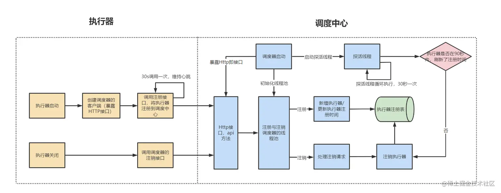
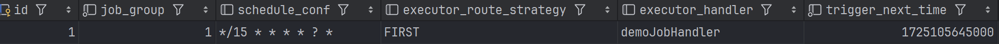
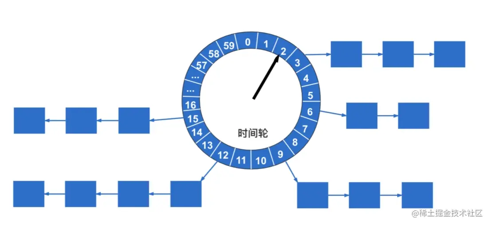

[toc]

## 概述

* 整体可以分为三个角色：调度中心、执行器、任务。

  调度中心保存执行器和任务信息，负责任务的触发和将任务分配到执行器；

  执行器将自身注册到调度中心，负责处理调度中心分配任务，找到并执行任务，最后先调度中心反馈执行结果；任务为将要被执行逻辑的抽象，负责具体的业务逻辑。

* 其中调度中心、执行器都可以集群部署。每个节点都可以提供服务，用于处理单点故障问题，同一时间只会有一个调度中心执行调度任务由于执行器与调度器是分离，大大降低调度中心性能压力。执行器集群部署可以保证高可用，同时提高任务执行的的并发能力。一个任务将根据规则选择某一个执行器执行，或者广播到全部执行器。


## 执行器初始化

### handler注册



* 定义的任务需要添加注解`@XxlJob`，同时指明任务名称，以及初始化和回收方法。
* 任务注册由`XxlJobSpringExecutor`完成，`XxlJobSpringExecutor`实现了`SmartInitializingSingleton`接口，在`afterSingletonsInstantiated`方法中完成任务收集，以及通过`netty`暴漏接口以供任务调度器调用，开启回调线程，以向调度器汇报任务执行状况，最后向调度器注册任务执行器。

```java
public class XxlJobSpringExecutor extends XxlJobExecutor implements SmartInitializingSingleton{
    public void afterSingletonsInstantiated() {
        // 扫描所有任务
        initJobHandlerMethodRepository(applicationContext);
        // 开启web服务，以供任务调度器调度；开启回调线程，以向调度器汇报任务执行状况；向调度器注册任务执行器
        super.start();
    }
}
```

* 注册任务时，通过`ApplicationContext`获得全部添加有`XxlJob`注解的方法，以及注解对象本身。完成任务对象`MethodJobHandler`的构建，再将任务对象加入容器`ConcurrentMap<String, IJobHandler>`中，等待后续注册到调度器。

```java
public class XxlJobSpringExecutor extends XxlJobExecutor implements SmartInitializingSingleton{
    private void initJobHandlerMethodRepository(ApplicationContext applicationContext) {
        // 获得全部beanName
        String[] beanDefinitionNames = applicationContext.getBeanNamesForType(Object.class, false, true);
        for (String beanDefinitionName : beanDefinitionNames) {
            // 获得全部bean对象
            bean = applicationContext.getBean(beanDefinitionName);
            // 获得有@XxlJob注解方法，key=方法对象，vlaue=XxlJob注解对象
            Map<Method, XxlJob> annotatedMethods = null;   
            annotatedMethods = MethodIntrospector.selectMethods(bean.getClass(),
                    new MethodIntrospector.MetadataLookup<XxlJob>() {
                        @Override
                        public XxlJob inspect(Method method) {
                            return AnnotatedElementUtils.findMergedAnnotation(method, XxlJob.class);
                        }
                    });
            // 注册任务
            for (Map.Entry<Method, XxlJob> methodXxlJobEntry : annotatedMethods.entrySet()) {
                Method executeMethod = methodXxlJobEntry.getKey();
                XxlJob xxlJob = methodXxlJobEntry.getValue();
                registJobHandler(xxlJob, bean, executeMethod);
            }
        }
    }
}
```

### 执行器注册

* 在通过`XxlJobExecutor#start`初始化执行器时，会触发`ExecutorRegistryThread#start`的执行，对象内部开启独立线程，只要执行器未停止就通过死循环的方式不断向调度中心注册执行器，通过这种方式更新调度中心处执行器最新注册时间，即`xxl_job_registry`中`update_time`字段。


```java
public class ExecutorRegistryThread {
    private Thread registryThread;
    private volatile boolean toStop = false;
    public void start(final String appname, final String address){
        registryThread = new Thread(new Runnable() {
            @Override
            public void run() {
                // 死循环的方式不断向调度中心注册执行器
                // 不断更新最近注册时间，完成心跳保活
                while (!toStop) {
                    // 携带执行器名称，地址，端口注册到调度中心
                    RegistryParam registryParam = new RegistryParam(RegistryConfig.RegistType.EXECUTOR.name(), appname, address);
                    for (AdminBiz adminBiz: XxlJobExecutor.getAdminBizList()) {
                        ReturnT<String> registryResult = adminBiz.registry(registryParam);
                        if (registryResult!=null && ReturnT.SUCCESS_CODE == registryResult.getCode()) {
                            registryResult = ReturnT.SUCCESS;
                            break;
                        } 
                    }
                    // 如果执行器未被停止，休眠30s后再次注册执行器
                    if (!toStop) {
                        TimeUnit.SECONDS.sleep(RegistryConfig.BEAT_TIMEOUT);
                    }
                }
                // 当执行器主动停止时，跳出循环注册流程，触发注销执行器流程
                RegistryParam registryParam = new RegistryParam(RegistryConfig.RegistType.EXECUTOR.name(), appname, address);
                for (AdminBiz adminBiz: XxlJobExecutor.getAdminBizList()) {
                        ReturnT<String> registryResult = adminBiz.registryRemove(registryParam);
                        if (registryResult!=null && ReturnT.SUCCESS_CODE == registryResult.getCode()) {
                            registryResult = ReturnT.SUCCESS;
                            break;
                        } 
                }
            }
        });
        registryThread.setDaemon(true);
        registryThread.setName("xxl-job, executor ExecutorRegistryThread");
        registryThread.start();
    }
```

### 执行器注销

* 当执行器主动退出时，由于`XxlJobSpringExecutor`实现`DisposableBean`接口，`destory`方法将调用父类的`XxlJobExecutor#destory`，再跳转到`ExecutorRegistryThread#toStop`方法，将执行器停止标志位`toStop=true`。将终止循环注册流程，进入主动执行注销过程`registryRemove`，将自己从调度中心移除。

```java
public class ExecutorRegistryThread {
    public void toStop() {
        // 修改停止标志位，停止循环注册
        toStop = true;
        // 主动终端注册线程
        if (registryThread != null) {
            registryThread.interrupt();
            try {
                registryThread.join();
            } catch (InterruptedException e) {
                logger.error(e.getMessage(), e);
            }
        }
    }
}
```

* 同时调度器开启监控线程`registryMonitorThread`，每30秒触发查询`xxl_job_registry`表中的数据，如果执行器`update_time`与当前时间的差值大于90s，说明该执行器异常，调度器将移除该执行器，执行器被动注销，本质上是通过循环的方式，实现心跳保活。

```java
public class JobRegistryHelper {
	private Thread registryMonitorThread;
	public void start(){
		// 监控线程
		registryMonitorThread = new Thread(new Runnable() {
			@Override
			public void run() {
				while (!toStop) {
                    // 找出最最近更新时间距离当前大于90s执行器
                    List<Integer> ids = XxlJobAdminConfig.getAdminConfig().getXxlJobRegistryDao().findDead(RegistryConfig.DEAD_TIMEOUT, new Date());
                    // 移除异常执行器
                    if (ids!=null && ids.size()>0) {
XxlJobAdminConfig.getAdminConfig().getXxlJobRegistryDao().removeDead(ids);
                    }
                    // 休眠30s后再次自行触发注册超时判断
					TimeUnit.SECONDS.sleep(RegistryConfig.BEAT_TIMEOUT);
				}
			}
		});
		registryMonitorThread.setDaemon(true);
		registryMonitorThread.setName("xxl-job, admin JobRegistryMonitorHelper-registryMonitorThread");
		registryMonitorThread.start();
	}
}
```

## 任务触发

### 任务扫描

* 在调度中心，任务触发通过独立线程定时扫描任务表完成。在`JobScheduleHelper#start`方法中初始化了任务触发线程`scheduleThread`。

* 任务触发线程用于扫描任务配置表格`xxl_job_info`，查询出将要被触发任务。任务触发线程每秒执行一次，每秒读出任务数上限默认设定为6000。这主要是考虑到任务调度的瓶颈，平均每个任务数调度耗时50ms，每秒可调度任务数即为线程数乘以20，默认共有200+100=300调度线程，则每秒可调度任务数上限为6000，多余任务可能无法被及时触发。

    

* 每次执行任务扫描前通过执行

    ```sql
    select * from xxl_job_lock where lock_name = 'schedule_lock' for update
    ```

    给`xxl_job_lock`表中记录加上写锁。`xxl_job_lock`中只存在一条`lock_name = 'schedule_lock'`的记录，通过为唯一记录加互斥写锁的方式，实现分布式锁，保证同一时刻最多只有一个调度中心节点执行任务调度，方式任务被对各调度中心节点重复调度。

    

* 在获得分布式锁后，从`xxl_job_info`读取触发时间小于等于当前时间+5s的任务。此处读取的是一个时间范围内的任务，而非某个时间点的任务。为了保证任务不被重复触发，调度中心的触发流程为单线程，如果触发线程每次只读取某个准确时间的任务，当触发线程被柱塞时，将会遗漏应该在线程柱塞时间段内触发任务。通过批量读取一定时间范围内任务，防止因为触发线程柱塞，导致任务遗漏的问题。
* 读出的任务中可能存在某些任务触发时间已经过去，并且距离当前已经超过5s，此时根据配置策略可以选择立即调度该任务，或者放弃本次调度；如果任务触发时间已经过去，并且距离当前未超过5s，选择立即调度该任务；如果任务触发时刻未到，将被加入时间轮中，等待被调度。
* 最后更新所有任务的最近触发时间、下次触发时间、触发状态。将休眠`1000-curr_mill%1000`的时间，以完成时间对齐，保证在下一秒开始时立即开始扫描任务，保证任务被及时触发。

```java
public class JobScheduleHelper {
    private Thread scheduleThread;
    // 预读取时间
    public static final long PRE_READ_MS = 5000;   
    
    public void start() {
        scheduleThread = new Thread(new Runnable() {
            @Override
            public void run() {
                // 等待5s后开始任务触发流程
                TimeUnit.MILLISECONDS.sleep(5000 - System.currentTimeMillis() % 1000);
                // 每次读取数据条数：任务调度线程数*单线程任务调度QPS，默认(200+100)*20=6000
                int preReadCount = (XxlJobAdminConfig.getAdminConfig().getTriggerPoolFastMax()
                        + XxlJobAdminConfig.getAdminConfig().getTriggerPoolSlowMax()) * 20;
                while (!scheduleThreadToStop) {
                    long start = System.currentTimeMillis();
                    Connection conn = null;
                    Boolean connAutoCommit = null;
                    PreparedStatement preparedStatement = null;
                    boolean preReadSuc = true;
                    conn = XxlJobAdminConfig.getAdminConfig().getDataSource().getConnection();
                    connAutoCommit = conn.getAutoCommit();
                    conn.setAutoCommit(false);
                    // 调度中心实例尝试获得分布式锁
                    preparedStatement = conn.prepareStatement(
                            "select * from xxl_job_lock where lock_name = 'schedule_lock' for update");
                    preparedStatement.execute();
                    // 读取触发时间小于等于当前时间+5s的任务
                    long nowTime = System.currentTimeMillis();
                    List<XxlJobInfo> scheduleList = XxlJobAdminConfig.getAdminConfig().getXxlJobInfoDao()
                            .scheduleJobQuery(nowTime + PRE_READ_MS, preReadCount);
                    if (scheduleList != null && scheduleList.size() > 0) {
                        for (XxlJobInfo jobInfo : scheduleList) {
                            // 任务已经到触发时间，并且已经过期PRE_READ_MS
                            // 根据策略决定是立即出发还是放弃触发
                            if (nowTime > jobInfo.getTriggerNextTime() + PRE_READ_MS) {
                                MisfireStrategyEnum misfireStrategyEnum = MisfireStrategyEnum
                                        .match(jobInfo.getMisfireStrategy(), MisfireStrategyEnum.DO_NOTHING);
                                if (MisfireStrategyEnum.FIRE_ONCE_NOW == misfireStrategyEnum) {
                                    // 立即触发
                                    JobTriggerPoolHelper.trigger(jobInfo.getId(), TriggerTypeEnum.MISFIRE, -1, null,
                                            null, null);
                                }
                                // 放弃触发，更新下次触发时间
                                refreshNextValidTime(jobInfo, new Date());
                            } else if (nowTime > jobInfo.getTriggerNextTime()) {
                                // 任务已经到触发时间，并且过期时间小于PRE_READ_MS
                                // 立即触发
                                JobTriggerPoolHelper.trigger(jobInfo.getId(), TriggerTypeEnum.CRON, -1, null, null,
                                        null);
                                // 更新下次触发时间
                                refreshNextValidTime(jobInfo, new Date());
                                // 如果下次触发时间距离当前小于5s，直接加入时间轮
                                if (jobInfo.getTriggerStatus() == 1
                                        && nowTime + PRE_READ_MS > jobInfo.getTriggerNextTime()) {
                                    int ringSecond = (int) ((jobInfo.getTriggerNextTime() / 1000) % 60);
                                    pushTimeRing(ringSecond, jobInfo.getId());
                                    refreshNextValidTime(jobInfo, new Date(jobInfo.getTriggerNextTime()));
                                }
                            } else {
                                // 触发事件距离当前5s内
                                // 加入时间轮
                                int ringSecond = (int) ((jobInfo.getTriggerNextTime() / 1000) % 60);
                                pushTimeRing(ringSecond, jobInfo.getId());
                                // 更新下次执行时间
                                refreshNextValidTime(jobInfo, new Date(jobInfo.getTriggerNextTime()));
                            }
                        }
                        // 更新任务最近触发和下一次触发时间信息
                        for (XxlJobInfo jobInfo : scheduleList) {
                            XxlJobAdminConfig.getAdminConfig().getXxlJobInfoDao().scheduleUpdate(jobInfo);
                        }
                        long cost = System.currentTimeMillis() - start;
                        if (cost < 1000) {
                            // 时间对齐，等待下一个完整的秒时刻
                            TimeUnit.MILLISECONDS
                                    .sleep((preReadSuc ? 1000 : PRE_READ_MS) - System.currentTimeMillis() % 1000);
                        }
                    }
                }
            }
        });
        scheduleThread.setDaemon(true);
        scheduleThread.setName("xxl-job, admin JobScheduleHelper#scheduleThread");
        scheduleThread.start();
    }
}
```

### 触发时间判定

* 此处的时间轮使用`HashMap`实现，`key`表示任务被调度时间的秒数，`value`为任务ID。根据任务的触发时间，决定任务将被放置于`HashMap`中哪个桶中，任务调度线程通过当前时间秒数定位哪个桶中任务将被触发。



```java
public class JobScheduleHelper {
    private void pushTimeRing(int ringSecond, int jobId){
        // 任务被触发事件的秒数
        //  ringSecond = (int) ((jobInfo.getTriggerNextTime() / 1000) % 60);
        List<Integer> ringItemData = ringData.get(ringSecond);
        if (ringItemData == null) {
            ringItemData = new ArrayList<Integer>();
            ringData.put(ringSecond, ringItemData);
        }
        ringItemData.add(jobId);
    }
}
```

## 任务调度

### 任务获取

* 在调度中心，任务调度同样通过独立线程完成。在`JobScheduleHelper#start`方法中初始化了任务调度线程`ringThread`。
* 首先时间对齐，休眠到下一个秒时刻开始，保证下一秒时刻到来后及时开始任务调度；获取当前与前一个时刻任务列表，目的是为了避免t-2时刻任务调度处理耗时太长，导致t-1时刻任务未被及时调度，在t时刻时同时检测t-1和t时刻任务，由于任务调度后被清理，向前校验t-1时刻不会导致任务被重复调度；最后执行任务触发。

```java
public class JobScheduleHelper {
    private Thread scheduleThread;
    public void start() { 
        ringThread = new Thread(new Runnable() {
            @Override
            public void run() {
                while (!ringThreadToStop) {
                    // 时间对齐，休眠到下一个秒时刻开始
                    TimeUnit.MILLISECONDS.sleep(1000 - System.currentTimeMillis() % 1000);
                    List<Integer> ringItemData = new ArrayList<>();
                    // 获取当前时间秒数
                    int nowSecond = Calendar.getInstance().get(Calendar.SECOND);
                    // 避免t-2时刻的任务调度处理耗时太长，导致t-1时刻任务未被及时调度，在t时刻时同时检测t-1和t时刻任务
                    // 由于任务调度后都会被清理，向前校验t-1时刻不会导致任务被重复调度
                    for (int i = 0; i < 2; i++) {
                        List<Integer> tmpData = ringData.remove((nowSecond + 60 - i) % 60);
                        if (tmpData != null) {
                            ringItemData.addAll(tmpData);
                        }
                    }
                    if (ringItemData.size() > 0) {
                        for (int jobId : ringItemData) {
                            // 触发任务
                            JobTriggerPoolHelper.trigger(jobId, TriggerTypeEnum.CRON, -1, null, null, null);
                        }
                        ringItemData.clear();
                    }
                }
            }
        });
        ringThread.setDaemon(true);
        ringThread.setName("xxl-job, admin JobScheduleHelper#ringThread");
        ringThread.start();
    }
}
```

### 任务派发

* 任务的派发和任务的触发、任务的调度同样使用独立线程，异步执行。任务派发线程有两个可选线程池`fastTriggerPool`和`slowTriggerPool`，分别用于短派发耗时任务和长派发耗时任务的派发。当前所在分钟内派发时间超过500ms的次数超过10次的任务被标记为长派发耗时任务，长短派发耗时任务使用不同线程池，通过资源隔离的方式，避免执行较慢的任务占用过多资源，影响到其他正常任务的调度，导致后续任务无法及时派发。
* 此处使用较为简单的固定窗口的方式统计任务派发耗时，而非滑动窗口的方式，通过` ConcurrentMap<Integer, AtomicInteger>`直接统计当前时刻所在分钟内任务超时次数，`key`为任务ID，`value`为当前分钟内超时次数。当到达下一个分钟时清空统计值，开始新的统计周期。当任务派发完成后还需要将当前派发耗时加入统计集合。

```java
public class JobTriggerPoolHelper {

    private ThreadPoolExecutor fastTriggerPool = null;
    private ThreadPoolExecutor slowTriggerPool = null;
    // 任务最近1min内派发超时记录
    // key=jobId value=timeoutCount
    private volatile ConcurrentMap<Integer, AtomicInteger> jobTimeoutCountMap = new ConcurrentHashMap<>();

    public void addTrigger(final int jobId,
            final TriggerTypeEnum triggerType,
            final int failRetryCount,
            final String executorShardingParam,
            final String executorParam,
            final String addressList) {

        // 选择任务派发线程池
        ThreadPoolExecutor triggerPool_ = fastTriggerPool;
        AtomicInteger jobTimeoutCount = jobTimeoutCountMap.get(jobId);
        // 任务在最近1min内派发时间超过500ms的次数超过10次
        if (jobTimeoutCount != null && jobTimeoutCount.get() > 10) {
            triggerPool_ = slowTriggerPool;
        }

        // 线程池完成任务派发
        triggerPool_.execute(new Runnable() {
            @Override
            public void run() {
                long start = System.currentTimeMillis();
                // 派发流程
                XxlJobTrigger.trigger(jobId, triggerType, failRetryCount, executorShardingParam, executorParam,
                        addressList);
                // 派发耗时
                long minTim_now = System.currentTimeMillis() / 60000;
                if (minTim != minTim_now) {
                    minTim = minTim_now;
                    jobTimeoutCountMap.clear();
                }
                // 如果任务派发时间大于500ms，记录一次超时
                long cost = System.currentTimeMillis() - start;
                if (cost > 500) {
                    AtomicInteger timeoutCount = jobTimeoutCountMap.putIfAbsent(jobId, new AtomicInteger(1));
                    if (timeoutCount != null) {
                        timeoutCount.incrementAndGet();
                    }
                }
            }
        });
    }
}
```

### 任务路由

* 任务派发具体由`XxlJobTrigger#trigger`完成。将根据任务配置的基本信息，获取执行该任务的执行器分组信息、路由参数、以及是否进行任务广播。一个任务执行器分组下可以包含多个任务执行器，拥有提高执行任务的并发能力，在分发任务时，可以选择广播任务，该分组下所有执行器都将收到派发任务，也可以指定具体的路由参数和路由策略，选择分组下某一个执行器执行任务。

```java
public class XxlJobTrigger {

    public static void trigger(int jobId,
            TriggerTypeEnum triggerType,
            int failRetryCount,
            String executorShardingParam,
            String executorParam,
            String addressList) {

        // 任务基本信息
        XxlJobInfo jobInfo = XxlJobAdminConfig.getAdminConfig().getXxlJobInfoDao().loadById(jobId);
        if (executorParam != null) {
            jobInfo.setExecutorParam(executorParam);
        }
        int finalFailRetryCount = failRetryCount >= 0 ? failRetryCount : jobInfo.getExecutorFailRetryCount();
        // 执行器group信息
        XxlJobGroup group = XxlJobAdminConfig.getAdminConfig().getXxlJobGroupDao().load(jobInfo.getJobGroup());
        if (addressList != null && addressList.trim().length() > 0) {
            group.setAddressType(1);
            group.setAddressList(addressList.trim());
        }
        // 执行器路由参数
        int[] shardingParam = null;
        if (executorShardingParam != null) {
            String[] shardingArr = executorShardingParam.split("/");
            if (shardingArr.length == 2 && isNumeric(shardingArr[0]) && isNumeric(shardingArr[1])) {
                shardingParam = new int[2];
                shardingParam[0] = Integer.valueOf(shardingArr[0]);
                shardingParam[1] = Integer.valueOf(shardingArr[1]);
            }
        }
        // 是否广播任务
        if (ExecutorRouteStrategyEnum.SHARDING_BROADCAST == ExecutorRouteStrategyEnum
                .match(jobInfo.getExecutorRouteStrategy(), null)
                && group.getRegistryList() != null && !group.getRegistryList().isEmpty()
                && shardingParam == null) {
            // 所有执行器都将收到任务
            for (int i = 0; i < group.getRegistryList().size(); i++) {
                processTrigger(group, jobInfo, finalFailRetryCount, triggerType, i, group.getRegistryList().size());
            }
        } else {
            if (shardingParam == null) {
                shardingParam = new int[] { 0, 1 };
            }
            // 非广播场景，将选择某一个执行器执行任务
            processTrigger(group, jobInfo, finalFailRetryCount, triggerType, shardingParam[0], shardingParam[1]);
        }

    }
}
```

* 路由选择策略将在`XxlJobTrigger#processTrigger`下执行。如果使用广播策略，将从`XxlJobTrigger#trigger`处获得执行器下标，直接发往指定执行器即可。如果使用非广播策略，需要根据指定的路由的策略，从执行器分组中，选择执行器。获得执行器地址后将委托`ExecutorBizClient`完成`http`请求的构建和发送。

```java
public class XxlJobTrigger {
    private static void processTrigger(XxlJobGroup group, XxlJobInfo jobInfo, int finalFailRetryCount,
            TriggerTypeEnum triggerType, int index, int total) {
        // 路由策略
        ExecutorRouteStrategyEnum executorRouteStrategyEnum = ExecutorRouteStrategyEnum
                .match(jobInfo.getExecutorRouteStrategy(), null);
        // 执行器选择
        String address = null;
        ReturnT<String> routeAddressResult = null;
        if (group.getRegistryList() != null && !group.getRegistryList().isEmpty()) {
            if (ExecutorRouteStrategyEnum.SHARDING_BROADCAST == executorRouteStrategyEnum) {
                // 广播策略，向指定执行器发送任务
                if (index < group.getRegistryList().size()) {
                    address = group.getRegistryList().get(index);
                } else {
                    address = group.getRegistryList().get(0);
                }
            } else {
                // 非广播策略，根据路由选择某一个执行器
                routeAddressResult = executorRouteStrategyEnum.getRouter().route(triggerParam, group.getRegistryList());
                if (routeAddressResult.getCode() == ReturnT.SUCCESS_CODE) {
                    address = routeAddressResult.getContent();
                }
            }
        } 
        // 发送请求
        ReturnT<String> triggerResult = null;
        triggerResult = runExecutor(triggerParam, address);
    }
}
```

### 路由策略

* 执行器选择使用了策略设计模式，`ExecutorRouteStrategyEnum`为一个枚举类，内部持有路由策略名称`title`和路由策略实现类`router`。

    预先定义了多个策略，如轮询策略`jobconf_route_round`，随机策略`jobconf_route_random`，一致性哈希策略`jobconf_route_consistenthash`，最近最少使用策略`jobconf_route_lru`，最近最低频率使用`jobconf_route_lfu`，空闲执行器策略`ExecutorRouteBusyover`，状态正常执行器策略`ExecutorRouteFailover`。

```java
public enum ExecutorRouteStrategyEnum {
    ROUND(I18nUtil.getString("jobconf_route_round"), new ExecutorRouteRound()),
    RANDOM(I18nUtil.getString("jobconf_route_random"), new ExecutorRouteRandom()),
    CONSISTENT_HASH(I18nUtil.getString("jobconf_route_consistenthash"), new ExecutorRouteConsistentHash()),
    LEAST_FREQUENTLY_USED(I18nUtil.getString("jobconf_route_lfu"), new ExecutorRouteLFU()),
    LEAST_RECENTLY_USED(I18nUtil.getString("jobconf_route_lru"), new ExecutorRouteLRU()),
    FAILOVER(I18nUtil.getString("jobconf_route_failover"), new ExecutorRouteFailover()),
    BUSYOVER(I18nUtil.getString("jobconf_route_busyover"), new ExecutorRouteBusyover()),

    ExecutorRouteStrategyEnum(String title, ExecutorRouter router) {
        this.title = title;
        this.router = router;
    }
}
```

* 所有策略实现类继承自`ExecutorRouter`，重写`route`方法，实现了自身的路由策略。

```java
public abstract class ExecutorRouter {
    public abstract ReturnT<String> route(TriggerParam triggerParam, List<String> addressList);
}
```

#### 空闲执行器策略

* 对于空闲执行器策略`ExecutorRouteBusyover`，调度中心向执行器群组中全部执行器依次发送空闲心跳信号，如果能收到正确的响应，则任务该执行器空闲，将选择向该执行器派发任务。

```java
public ReturnT<String> route(TriggerParam triggerParam, List<String> addressList) {
    StringBuffer idleBeatResultSB = new StringBuffer();
    // 向执行器群组中全部执行器依次发送空闲心跳信号
    for (String address : addressList) {
        ReturnT<String> idleBeatResult = null;
        try {
            ExecutorBiz executorBiz = XxlJobScheduler.getExecutorBiz(address);
            idleBeatResult = executorBiz.idleBeat(new IdleBeatParam(triggerParam.getJobId()));
        } catch (Exception e) {
            logger.error(e.getMessage(), e);
            idleBeatResult = new ReturnT<String>(ReturnT.FAIL_CODE, ""+e );
        }
        // 能收到正确的响应，则任务该执行器空闲，将选择向该执行器派发任务
        if (idleBeatResult.getCode() == ReturnT.SUCCESS_CODE) {
            idleBeatResult.setMsg(idleBeatResultSB.toString());
            idleBeatResult.setContent(address);
            return idleBeatResult;
        }
    }
    return new ReturnT<String>(ReturnT.FAIL_CODE, idleBeatResultSB.toString());
}

```

#### 一致性哈希策略

* 对于一致性哈希路由策略`ExecutorRouteConsistentHash`，通过构建哈希环，计算每一个执行器节点在哈希环上位置，在获取执行任务的执行器时，同样计算任务的哈希值，找到在哈希环上顺时针方向，第一个执行器节点。通过这种方法保证同一个人将始终被同一个执行器执行，实现了亲和性调度，适合于需要依赖上下文的任务。此外由于哈希算法的随机性，每个执行器负责的哈希值区间的任务数相近，保证了每个执行器都具有相同的负载。

    此处使用`md5`算法构建32位的字符串哈希值，相较于传统的基于字符串`ASCII`码的哈希值，可以减少哈希冲突，并提供更均匀的哈希值分布。此外为保证每个执行器节点负责任务数相近，为每个真实的执行器节点构建了100个虚拟执行器节点，实现执行器节点负责多个均匀分布于哈希环上区间对应任务的执行，使得任务分配更加均衡。

    具体实现上使用`TreeMap`构建哈希环，`TreeMap`底层实现为红黑树，将全部物理执行器的虚拟节点加入`TreeMap`，初始化哈希环。当查询任务对应执行器时，通过`tailMap`找到第一个大于当前`key`哈希值的节点即为目标执行器。

```java
private static long hash(String key) {
    // 构建md5摘要
    MessageDigest md5;
    md5 = MessageDigest.getInstance("MD5");
    md5.reset();
    byte[] keyBytes = null;
    keyBytes = key.getBytes("UTF-8");
    md5.update(keyBytes);
    byte[] digest = md5.digest();
    // 依据md5摘要生成32位二进制数字，为key的哈希值
    long hashCode = ((long) (digest[3] & 0xFF) << 24)
            | ((long) (digest[2] & 0xFF) << 16)
            | ((long) (digest[1] & 0xFF) << 8)
            | (digest[0] & 0xFF);

    long truncateHashCode = hashCode & 0xffffffffL;
    return truncateHashCode;
}

public String hashJob(int jobId, List<String> addressList) {
    // 构建hash环
    TreeMap<Long, String> addressRing = new TreeMap<Long, String>();
    // 生成虚拟节点
    for (String address : addressList) {
        for (int i = 0; i < VIRTUAL_NODE_NUM; i++) {
            long addressHash = hash("SHARD-" + address + "-NODE-" + i);
            addressRing.put(addressHash, address);
        }
    }
    // 计算jobid在hash环中位置
    long jobHash = hash(String.valueOf(jobId));
    // 找到第一个hash值大于jobid的节点，作为选择的执行器
    SortedMap<Long, String> lastRing = addressRing.tailMap(jobHash);
    if (!lastRing.isEmpty()) {
        return lastRing.get(lastRing.firstKey());
    }
    return addressRing.firstEntry().getValue();
}

@Override
public ReturnT<String> route(TriggerParam triggerParam, List<String> addressList) {
    String address = hashJob(triggerParam.getJobId(), addressList);
    return new ReturnT<String>(address);
}
```

#### LRU策略

* 最近最少使用策略`jobconf_route_lru`实现较为简单，使用`LinkedHashMap`保存执行器访问历史，其`key, value`均为执行器地址，`LinkedHashMap`内部通过链表的方式维护了数据的插入顺序。通过迭代器可获得访问间隔最远的执行器节点，并通过重新插入的方式，更新全部节点访问顺序。

    ```java
    String eldestKey = lruItem.entrySet().iterator().next().getKey();
    String eldestValue = lruItem.get(eldestKey);
    ```

    #### LFU策略

* 最近最低频率使用`jobconf_route_lfu`，使用固定窗口的方式，通过`HashMap<String, Integer>`保存24小时内，执行器及其访问次数。通过对`value`排序的方式获得最近24内访问次数至少的执行器，作为当前任务的执行器。该方法时间复杂度为`O(nlogn)`，存在时间复杂度为`O(1)`的`LFU`实现，可以降低复杂度。

    ```java
    // 对执行器按照访问次数排序
    List<Map.Entry<String, Integer>> lfuItemList = new ArrayList<Map.Entry<String, Integer>>(lfuItemMap.entrySet());
    Collections.sort(lfuItemList, new Comparator<Map.Entry<String, Integer>>() {
        @Override
        public int compare(Map.Entry<String, Integer> o1, Map.Entry<String, Integer> o2) {
            return o1.getValue().compareTo(o2.getValue());
        }
    });
    // 选择24h内访问次数最少的执行器
    Map.Entry<String, Integer> addressItem = lfuItemList.get(0);
    String minAddress = addressItem.getKey();
    // 该执行器访问次数加一
    addressItem.setValue(addressItem.getValue() + 1);
    ```

#### 轮询策略

* 轮询策略`ExecutorRouteRound`，使用`ConcurrentMap<Integer, AtomicInteger>`记录每个任务被执行次数，`key`为任务ID，`value`为执行次数。通过执行次数除以执行器群组下执行器数目取余的方式获得目标执行器。

    ```java
    private static ConcurrentMap<Integer, AtomicInteger> routeCountEachJob = new ConcurrentHashMap<>();
    private static int count(int jobId) {
        // 获得并更新任务执行次数
        AtomicInteger count = routeCountEachJob.get(jobId);
        count.addAndGet(1);
        routeCountEachJob.put(jobId, count);
        return count.get();
    }
    @Override
    public ReturnT<String> route(TriggerParam triggerParam, List<String> addressList) {
        // 执行次数除以执行器群组下执行器数目取余的方式获得目标执行器
        String address = addressList.get(count(triggerParam.getJobId()) % addressList.size());
        return new ReturnT<String>(address);
    }
    ```

## 任务执行

* 当任务执行器收到派发任务时，先获取任务的执行线程和真正的执行体。任务的执行同样使用异步策略，每个`jobHander`对应一个单独的线程和柱塞队列，实现资源隔离。

#### 阻塞策略

* 任务将根据配置的柱塞策略决定任务的执行行为：如果使用`DISCARD_LATER`策略，则如果前一个任务没有执行完毕，直接丢弃当前任务；如果使用`COVER_EARLY`策略，如果前一个任务没有执行完毕，将单独新开任务线程取代原有线程，当前任务被立即执行，先前的线程会在执行完毕后被GC回收；如果使用`SERIAL_EXECUTION`策略，如果前一个任务没有执行完毕，则加入柱塞队列，等待被调用。

```java
public class ExecutorBizImpl implements ExecutorBiz{
    public ReturnT<String> run(TriggerParam triggerParam) {
        // 加载jobHandler + jobThread
        JobThread jobThread = XxlJobExecutor.loadJobThread(triggerParam.getJobId());
        IJobHandler jobHandler = jobThread != null ? jobThread.getHandler() : null;
        String removeOldReason = null;
        // 阻碍策略
        if (jobThread != null) {
            ExecutorBlockStrategyEnum blockStrategy = ExecutorBlockStrategyEnum
                    .match(triggerParam.getExecutorBlockStrategy(), null);
            if (ExecutorBlockStrategyEnum.DISCARD_LATER == blockStrategy) {
                // 直接丢弃当前请求
                if (jobThread.isRunningOrHasQueue()) {
                    return new ReturnT<String>(ReturnT.FAIL_CODE,
                            "block strategy effect：" + ExecutorBlockStrategyEnum.DISCARD_LATER.getTitle());
                }
            } else if (ExecutorBlockStrategyEnum.COVER_EARLY == blockStrategy) {
                // 丢弃当前忙碌线程，开启新的执行线程
                if (jobThread.isRunningOrHasQueue()) {
                    removeOldReason = "block strategy effect：" + ExecutorBlockStrategyEnum.COVER_EARLY.getTitle();

                    jobThread = null;
                }
            } else {
                // 加入阻塞队列
            }
        }
        // 当第一次运行或者选择COVER_EARLY策略需要新建线程
        if (jobThread == null) {
            jobThread = XxlJobExecutor.registJobThread(triggerParam.getJobId(), jobHandler, removeOldReason);
        }
        // 加入队列异步执行
        ReturnT<String> pushResult = jobThread.pushTriggerQueue(triggerParam);
        return pushResult;
    }
}
```

#### 超时控制

* 在任务线程内，根据色否设定任务执行超时时间，决定任务的执行方。如果设定超时时间，则新开线程通过`FutureTask`控制执行时间；未设定超时时间，当前线程直接执行。`jobHander`最终通过反射调用执行。

```java
// JobThread#run
triggerParam = triggerQueue.poll(3L, TimeUnit.SECONDS);
if (triggerParam.getExecutorTimeout() > 0) {
    // 添加任务超时参数，新开线程通过FutureTask控制执行时间
    Thread futureThread = null;
    try {
        FutureTask<Boolean> futureTask = new FutureTask<Boolean>(new Callable<Boolean>() {
            @Override
            public Boolean call() throws Exception {
                XxlJobContext.setXxlJobContext(xxlJobContext);
                handler.execute();
                return true;
            }
        });
        futureThread = new Thread(futureTask);
        futureThread.start();
        // 超时等待结果
        Boolean tempResult = futureTask.get(triggerParam.getExecutorTimeout(), TimeUnit.SECONDS);
    } catch (TimeoutException e) {
        // 任务超时
        XxlJobHelper.handleTimeout("job execute timeout ");
    } finally {
        // 中断新开线程
        futureThread.interrupt();
    }
} else {
    // 未设定超时时间，当前线程直接执行
    handler.execute();
}
```

#### 反射调用

* 注册任务时，任务对象本身保存添加注解`XxlJob`的方法、所在对象，以及可选的任务前置后后置方法。当任务被调度执行时，通过反射调用原始添加有`XxlJob`注解的方法。

```java
public class MethodJobHandler extends IJobHandler {
    private final Object target;
    private final Method method;
    private Method initMethod;
    private Method destroyMethod;
    public void execute() throws Exception {
        Class<?>[] paramTypes = method.getParameterTypes();
        // 反射调用原始添加有`XxlJob`注解的方法
        if (paramTypes.length > 0) {
            method.invoke(target, new Object[paramTypes.length]);
        } else {
            method.invoke(target);
        }
    }
}
```

## 回调反馈

* 任务被触发执行后，需要将执行结果反馈给调度中心。反馈方式同样使用异步执行，流程和`JobThread`相似。`JobThread#run`中将任务执行信息加入`TriggerCallbackThread`的`callBackQueue`后即返回。

```java
// JobThread#run
TriggerCallbackThread.pushCallBack(new HandleCallbackParam(
        triggerParam.getLogId(),
        triggerParam.getLogDateTime(),
        XxlJobContext.getXxlJobContext().getHandleCode(),
        XxlJobContext.getXxlJobContext().getHandleMsg() )
);
```

* `triggerCallbackThread`线程将不断轮询`callBackQueue`，完成反馈请求的发送。由于任务反馈不涉及复杂执行逻辑，所以`triggerCallbackThread`线程为单例对象，不用于`JobThread`每个`job`对应一个`JobThread`。

```java

public class TriggerCallbackThread {
    private Thread triggerCallbackThread;
    public void start() {
        // 回调线程
        triggerCallbackThread = new Thread(new Runnable() {
            @Override
            public void run() {
                // normal callback
                while (!toStop) {
                    HandleCallbackParam callback = getInstance().callBackQueue.take();
                    if (callback != null) {
                        // 获取全部回调任务
                        List<HandleCallbackParam> callbackParamList = new ArrayList<HandleCallbackParam>();
                        int drainToNum = getInstance().callBackQueue.drainTo(callbackParamList);
                        callbackParamList.add(callback);

                        // 触发回调
                        if (callbackParamList != null && callbackParamList.size() > 0) {
                            doCallback(callbackParamList);
                        }
                    }
                }
                // 再次获取任务，触发回调
                List<HandleCallbackParam> callbackParamList = new ArrayList<HandleCallbackParam>();
                int drainToNum = getInstance().callBackQueue.drainTo(callbackParamList);
                if (callbackParamList != null && callbackParamList.size() > 0) {
                    doCallback(callbackParamList);
                }
            }
        });
        triggerCallbackThread.setDaemon(true);
        triggerCallbackThread.setName("xxl-job, executor TriggerCallbackThread");
        triggerCallbackThread.start();
    }
}
```

## 优化思考

### 现有瓶颈

* 单点数据库问题：缺乏高可用保证，同时数据库的又是在于事务和持久化当前设计下，未用到事务特性。
* 分布式锁问题：使用数据库实现分布式锁，加锁解锁耗时较长；同时限制同一时刻只有一个调度节点进行任务调度，并发度受限。
* 任务阻塞队列不可靠：每个任务对应一个阻塞队列，用于缓存待执行任务，队列未实现持久化机制，可能导致任务丢失。

### 优化设计

* 使用redis集群替代数据库，此处使用`write thought`策略，任务的写入和读取都直接与redis交互，同时使用异步方式完成任务信息持久化到数据库，同时数据库为redis集群初始化提供支持。

* redis中对任务的操作主要是读取将要被触发任务，之后更新该任务下次触发时间，读写比例为1:1。可以使用redis集群的方式部署，通过哈希槽，每个主从redis集合负责存储部分数据，降低主从集合读写压力，并且由于读写比例接近1:1，以一主一从方式配置主从节点，从节点负责读取，主节点负责写入，二者互为灾备。

* `redis`中使用`z-set`方式保存任务ID、下次触发时间，并且按照下次触发时间排序，通过`zrangeByScore`获得触发时间小于当前时间+5s的全部任务。`z-set`使用跳表数据结构，可以以`log(n)+m`复杂度时间复杂度获取目标任务，其中`n`为集合中任务总数，`m`为取出的任务数。

    ```java
    jedis.zadd("biz-group", nextTime, jobId);
    jedis.zrangeByScore("biz-group", 0, currTime+5s);
    ```

* 调度集群设计为允许多个调度节点同时调度，集群中以当前任期为`key`，通过向`zk`抢锁的方式确定当前任期下主节点。主调度节点使用扫描线程从`redis`集群中获得将要被触发任务，之后根据负载均衡策略(如一致性哈希、随机、轮询等)将任务分配给调度集群中的全部节点。
* 每个调度节点在收到任务，将任务放入时间轮后，由于时间轮为内存中结构，断点数据丢失，需要持久化保存，以供当前节点崩溃后，将未处理任务转移到其他健康节点。此时分配到单个节点且将要的被触发的任务数量有有限，持久化压力较小，可以使用数据库或者`redis`实现。
* 调度集群中主节点需要定时发送心跳信号给从节点，当从节点超时未获得主节点心跳信号时，向其余节点发起主节点下线确认请求，获得过半确认后，则认为主节点下线，当前节点成为候选人节点，将当前集群任期`term`递增，以新的任期数构建`key`，尝试去`zk`获得分布式锁，成为新的主节点，成功后向所有从节点广播心跳信号，更新集群任期。此时再有节点发起主节点下线确认请求时，从节点将否认主节点下线，阻止节点成为候选人节点。如果多个节点同时确认主节点下线，将任期加一后，得到相同的下一个任期，生成相同的`key`，此时只有一个候选人节点能成功从`zk`获得锁，其余失败节点在收到新主节点心跳后，放弃继续抢锁。
* 主节点也需要检测从节点健康状况，如果从节点崩溃，主节点负责将该节点未处理完任务从持久化截至中取出，转移给其它节点。如果是主节点崩溃，在新主节点选举后，由新主节点负责将老主节点任务转移到其他健康节点。通过任务持久化+健康检测机制+故障转移保证调度集群高可用。
* 任务派发到执行器使用MQ实现，由MQ实现任务队列的持久化与可靠性传输，执行器重启后也能连接上订阅任务队列，保证任务可靠执行。每种任务对应一个`topic`，每个`topic`下多个队列，队列与执行器一一对应，执行器通过订阅对应队列获得任务。在进行任务投递到MQ时，同样需要支持负载均衡策略，以`RocketMQ`为例，需要实现对用的`selector`，让任务路由到正确的队列，最终流向正确的执行器。
* 每个执行器可以执行多种类型任务，需要订阅支持任务类型对应`topic`下，响应的队列，以获取负载均衡后分配给自己的任务。


