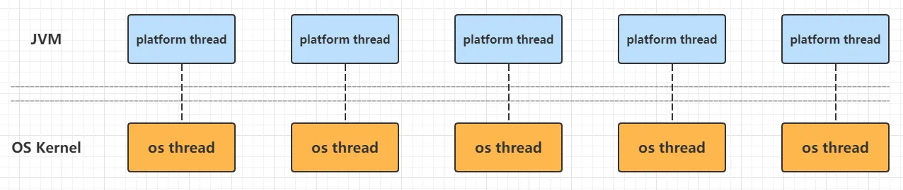
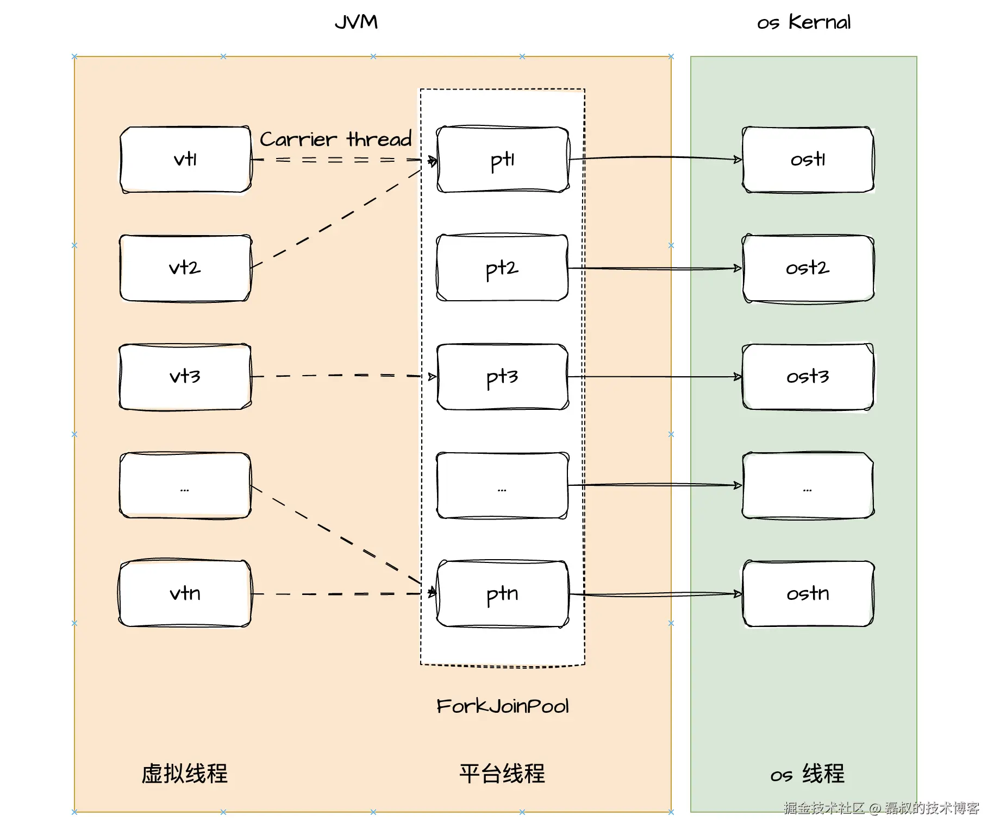
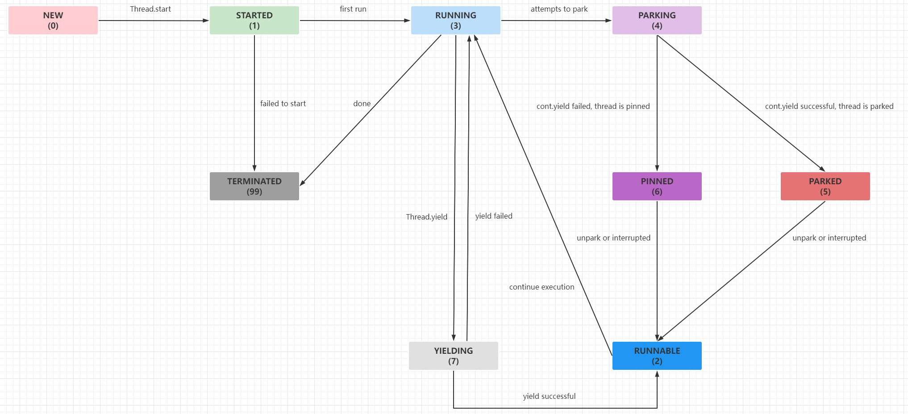

## 虚拟线程

### 动机

* 原始的后端开发，采用简单的  `thread-per-request `模式编写的服务器应用程序，一个线程专用于处理请求完整的调用链路，这使得可以使用线程的堆栈跟踪排查问题，使用性能分析工具跟踪线程调用链路，分析每个节点调用成本，帮助程序调优。同时线程隔离的方式使程序易于编写和理解。

* JDK 中的每个 `Thread `实例都是平台线程，平台线程的数量受限于OS线程的数量，上下文切换成本高，栈空间占用大。在其余资源如CPU尚未达到瓶颈时，线程数已达到上限。在该并发环境下，无法做到  `thread-per-request `模式，转而采用"共享线程"。只有在执行计算时才保持线程，请求处理的代码在等待I/O操作完成时会将其线程返回给一个线程池，实现有限线程处理海量并发。

    

* "共享线程"模式下只能使用异步编程风格，通过异步回调来处理I/O操作结果。请求的每个阶段可能在不同线程执行，导致堆栈跟踪提供不了可用的上下文，调试器无法逐步执行请求处理逻辑。

### 概述

* 通过将大量虚拟线程映射到多个平台线程，采用 M:N 调度，其中大量（M）虚拟线程被调度在较少（N）的平台线程上运行，实现低成本的创建大量虚拟线程。虚拟线程占用空间小，任务切换由JVM完成，开销几乎可以忽略不计。

* 在web环境下，web请求并发量大，并且请求大部分时间内都在等待。使用虚拟线程实现 thread-per-request 编程风格，整个请求将在虚拟线程中运行，仅在它在CPU上执行计算时才会消耗平台线程资源。当在虚拟线程中运行阻塞I/O操作时，自动暂停虚拟线程，直到可稍后恢复，虚拟线程的切换在用户态完成，切换成本低。

    虚拟线程同时适用于大批量的处理时间较短的计算任务，或者存在大量的`IO`阻塞的任务，这类非CPU密集型任务。

    

### 任务包装

* 虚拟线程的实现和线程池类似：`virtual thread = continuation + scheduler`。`continuation `为任务的封装，负责将虚拟线程数据挂载到平台线程和从平台线程卸载，`scheduler`持有平台线程，完成调度并执行任务。具体实现上，虚拟线程把任务包装到一个`Continuation`实例中，再交由`ForkJoinPool`调度执行。

* `Continuation`表示可以执行一次的任务回调，内部维护任务对象、任务执行与挂载状态。

    ```java
    public class Continuation {
        // 任务本身
        private final Runnable target;
        // 是否已完成
        private boolean done;
        // 是否已挂载到carrier thread
        private volatile boolean mounted;
    }
    ```


* `Continuation`负责在运行前将虚拟线程数据挂载到`carrier thread`栈中，再将任务交由`ForkJoinPool`调度执行，从而执行基于`Runnable`包装的用户任务，最后将虚拟线程栈数据从`carrier thread`中解除挂载。

    ```java
    // Continuation#run
    public final void run() {
        while (true) {
            // 将虚拟线程数据挂载到`carrier thread`栈中
            mount();
            // 获取carrier thread
            Thread t = currentCarrierThread();
            // 将当前Continuation实例与`carrier thread`绑定
            JLA.setContinuation(t, this);
            if (!isStarted()) { 
                // Continuation入口方法，执行用户任务入口target.run()
                enterSpecial(this, false, isVirtualThread);
            } else {
                enterSpecial(this, true, isVirtualThread);
            }
            // yield触发后，清理流程
            postYieldCleanup();
            // 将虚拟线程栈数据从`carrier thread`中解除挂载
            unmount();
            if (PRESERVE_SCOPED_VALUE_CACHE) {
                scopedValueCache = JLA.scopedValueCache();
            } else {
                scopedValueCache = null;
            }
            JLA.setScopedValueCache(null);
            }
        }
    }
    ```

* `Continuation`实现了`yield`调用，当触发`Continuation#run`执行时，遇到`yield`调用会返回，当再次调用`Continuation#run`时，将恢复到前一次停止的`yield`调用处，继续执行。虚拟线程的调度由`JVM`调度，在执行任务调度时，如果需要阻塞当前任务，通过`yield`调用实现，当任务阻塞结束后，再次运行`run`方法，将在上次停止的`yield`方法调用后接着执行。

    ```java
    // Continuation#yield作用
    ContinuationScope scope = new ContinuationScope("scope");
    Continuation continuation = new Continuation(scope, () -> {
        System.out.println("before yield");
        Continuation.yield(scope);
        System.out.println("after yield");
    });
    continuation.run();// before yield
    continuation.run();// after yield
    ```

    ```java
    // Continuation.yield
    public static boolean yield(ContinuationScope scope) {
        // 获取当前运载线程的Continuation实例
        Continuation cont = JLA.getContinuation(currentCarrierThread());
        // 把当前的Continuation挂起到给定的ContinuationScope
        return cont.yield0(scope, null);
    }
    
    private boolean yield0(ContinuationScope scope, Continuation child) {
        // 当前Continuation阻塞在此
        int res = doYield();
        if (child != null) { 
            if (res != 0) {
                child.yieldInfo = res;
            } else if (yieldInfo != null) {
                assert yieldInfo instanceof Integer;
                child.yieldInfo = yieldInfo;
            } else {
                child.yieldInfo = res;
            }
            this.yieldInfo = null;
        } else {
            if (res == 0 && yieldInfo != null) {
                res = (Integer)yieldInfo;
            }
            this.yieldInfo = null;
            if (res == 0)
                // 当该方法再次唤醒，res为0时，当前Continuation实例会继续执行
                onContinue();
            else
                onPinned0(res);
        }
        // 返回布尔值结果表示当前Continuation实例是否会继续执行
        return res == 0;
    }
    ```

### 线程实例

* `VirtualThread`的继承关系为`VirtualThread -> BaseVirtualThread -> Thread`，`VirtualThread`作为`Thread`子类很好的融合到`JUC`体系。

* `VirtualThread`维护任务的包装类`cont`，调度并执行任务的线程池`DEFAULT_SCHEDULER`，用于唤醒定时休眠虚拟线程的线程池`UNPARKER`。

```java
final class VirtualThread extends BaseVirtualThread {
    // 调度运行虚拟线程
    private static final ForkJoinPool DEFAULT_SCHEDULER = createDefaultScheduler();
    // 用于唤醒带超时阻塞的虚拟线程实例
    private static final ScheduledExecutorService UNPARKER = createDelayedTaskScheduler();
    // 调度器实例，默认为DEFAULT_SCHEDULER
    private final Executor scheduler;
    // Continuation实例，任务的包装类
    private final Continuation cont;
    // cont的Runnable包装实例
    private final Runnable runContinuation;
    // 虚拟线程状态
    private volatile int state;
    // 运载当前虚拟线程的平台线程
    private volatile Thread carrierThread;
}
```

* `ForkJoinPool`作为调度并运行虚拟线程的`scheduler`，其内部持有平台线程，接受并执行提交的任务。`ForkJoinPool`内部可能对应M个平台线程和N个虚拟线程，通过将虚拟线程挂载到平台线程，为其分配平台线程来执行，虚拟线程由其所在平台线程进行调度，平台线程由平台调度，虚拟线程调度行为对OS透明。
* `ForkJoinPool`主要参数为：

>- `parallelism`表示同一时刻最多有多少个任务在执行，默认值为线程数`Runtime.getRuntime().availableProcessors()`；
>- `maxPoolSize`表示线程池最大线程数，参数默认值为256；
>- `minRunnable`表示正在运行的任务中，处于非阻塞态的任务数的最小值，用于维持线程池活跃度，参数默认值为`max(parallelism / 2, 1)`

* 虚拟线程主要有`new, started, running, yielding, runnable, parking, parked, terminated`8种状态。如果触发`yield`调用，状态将发生状态转移：`running -> yielding -> runnable -> running`；如果触发阻塞线程操作，状态将发生状态转移：`running -> parking -> parked -> runnable -> running`；



### 启动入口

* 虚拟线程启动入口为`VirtualThread#start`，将修改虚拟线程状态为`started`，并将任务提交给调度执行器`scheduler`，等待任务被调度执行。

    ```java
    // VirtualThread#start
    // 调度虚拟线程让之运行
    void start(ThreadContainer container) {
        // CAS由NEW转换为STARTED状态
        if (!compareAndSetState(NEW, STARTED)) {
            throw new IllegalThreadStateException("Already started");
        }
        // 绑定当前虚拟线程到线程容器
        setThreadContainer(container);
        boolean started = false;
        try {
            // 提交'runContinuation'任务到调度器
            submitRunContinuation();
            started = true;
        } finally {
        }
    }
    ```

* `VirtualThread#submitRunContinuation`用于首次运行封装的任务，具体作用是将封装为`Runnble`的`Continuation`提交到执行器`DEFAULT_SCHEDULER`中运行。

    ```java
    // VirtualThread#submitRunContinuation
    private void submitRunContinuation() {
        try {
            // 向调度器提交任务
            scheduler.execute(runContinuation);
        } catch (RejectedExecutionException ree) {
            submitFailed(ree);
            throw ree;
        }
    }
    ```

### 调度执行

* 当任务被调度器执行时，将由调度器调度`runContinuation.run`启动任务执行，此处使用函数式编程，`runContinuation.run`指向`VirtualThread#runContinuation`。`VirtualThread#runContinuation`将修改虚拟线程状态为`RUNNING`，之后执行`Continuation#run`完成任务的真正执行。同时在任务执行完成后，根据任务退出原因，执行相应的后续处理。

    ```java
    // VirtualThread#runContinuation
    // 在carrierThread线程上运行或继续Continuation的执行
    private void runContinuation() {
        boolean firstRun;
        int initialState = state();
        // 第一次执行任务，虚拟线程状态为STARTED，并且成功将状态CAS更新为RUNNING状态，则标记首次运行为true
        if (initialState == STARTED && compareAndSetState(STARTED, RUNNING)) {
            firstRun = true;
        } else if (initialState == RUNNABLE && compareAndSetState(RUNNABLE, RUNNING)) {
            // 回复中断虚拟任务时，虚拟线程状态为RUNNABLE，并且成功将状态CAS更新为RUNNING状态，则标记首次运行为false，park许可为false
            setParkPermit(false);
            firstRun = false;
        } else {
            return;
        }
        try {
            // 执行Continuation.run()
            cont.run();
        } finally {
            // Continuation执行完成，回调afterTerminate
            if (cont.isDone()) {
                afterTerminate(/*executed*/ true);
            } else {
                // Continuation没有完成，说明调用了Continuation.yield进行park操作
                afterYield();
            }
        }
    }
    ```

* 触发任务包装类`Continuation`执行后，任务可能因为任务执行完毕，或者执行了`yield`调用，任务结束执行`VirtualThread`。如果是因为任务执行完毕而退出，将调用`afterTerminate`唤醒等待在当前虚拟线程上的其他线程，并执行虚拟线程清理任务。

    ```java
    // VirtualThread#afterTerminate
    // Continuation执行完成回调
    private void afterTerminate(boolean executed) {
        // 如果有其他线程阻塞等待虚拟线程的返回，如join方法
        CountDownLatch termination = this.termination;
        if (termination != null) {
            assert termination.getCount() == 1;
            termination.countDown();
        }
        // 如果虚拟线程执行成功，则通知线程容器当前线程实例退出，清空线程本地变量引用
        if (executed) {
            threadContainer().onExit(this);
            clearReferences();
        }
    }
    ```

### 中断与恢复

* 当虚拟线程在 JDK 中的某些阻塞操作阻塞时，将被从当前平台线程卸载，释放其底层平台线程以承担新工作。当阻塞操作完成时，将虚拟线程提交回调度程序，将挂载虚拟线程到载体上以恢复执行。虚拟线程的挂载和卸载在用户态完成，不会阻塞任何平台线程。

* 如果当前虚拟线程是因为执行了`yield`调用而退出，则当前虚拟线程将在之后再次被调度执行，需要将当前虚拟线程提交到调度器`scheduler`，等待下次调用。在提交时，如果触发`yield`调用的是`CarrierThread`，则使用`lazySubmitRunContinuation`向调度器提交任务，表示将用当前线程，也即是`CarrierThread`作为运载线程继续执行任务，用于保证任务一直执行在同一个平台线程，向外屏蔽虚拟线程调度。

    ```java
    // VirtualThread#afterYield
    // 由于yield操作导致任务挂起
    private void afterYield() {
        int s = state();
        // 如果当前状态是PARKING，对应于Continuation#yield操作
        if (s == PARKING) {
            // 更变为PARKED状态
            setState(PARKED);
            // 得到park许可，并且将虚拟线程状态CAS为RUNNABLE
            if (parkPermit && compareAndSetState(PARKED, RUNNABLE)) {
                if (currentThread() instanceof CarrierThread ct) {
                    // 懒提交
                    lazySubmitRunContinuation(ct.getPool());
                } else {
                    submitRunContinuation();
                }
            }
        } else if (s == YIELDING) {   
            // 如果当前状态是YIELDING状态，对应于Thread#yield
            // 更变为RUNNABLE状态
            setState(RUNNABLE);
            if (currentThread() instanceof CarrierThread ct && ct.getQueuedTaskCount() == 0) {
                // 进行懒提交
                externalSubmitRunContinuation(ct.getPool());
            } else {
                submitRunContinuation();
            }
        }
    }
    ```

* 对于`Continuation.yield()`调用后的再次提交，用当前调用线程执行任务，可以把`Continuation.run()`方法链分配到同一个运载线程实例，执行任务的运载线程没有改变，使得虚拟线程调度对外透明。

    ```java
    // VirtualThread#nsubmitRunContinuation
    // 提交'runContinuation'任务到调度器
    private void submitRunContinuation(boolean lazySubmit) {
        try {
            if (lazySubmit && scheduler instanceof ForkJoinPool pool) {
                // ForkJoinPool类型调度器，并且lazySubmit=true
                // 对runContinuation实例适配为ForkJoinTask类型，进行"懒提交"到ForkJoinPool
                pool.lazySubmit(ForkJoinTask.adapt(runContinuation));
            } else {
                // 非ForkJoinPool类型调度器或者lazySubmit=false，直接使用Executor.execute()提交任务
                scheduler.execute(runContinuation);
            }
        } catch (RejectedExecutionException ree) {
            throw ree;
        }
    }
    ```

### 休眠与唤醒

* 由于`VirtualThread`继承自`Thread`需要实现`sleep(), sleep(time)`方法，完成任务的休眠、定时休眠与唤醒。休眠的具体执行者为`VirtualThread#doSleepNanos`，通过循环休眠的方式，直至到达指定时限。

    ```java
    // VirtualThread#sleepNanos
    // 给定休眠时间让当前虚拟线程休眠
    private void doSleepNanos(long nanos) throws InterruptedException {
        if (nanos == 0) {
            // 直接进行yield操作，具体是Continuation#yield
            tryYield();
        } else {
            try {
                long remainingNanos = nanos;
                long startNanos = System.nanoTime();
                // 循环休眠，直至到达指定时限
                while (remainingNanos > 0) {
                    // park操作
                    parkNanos(remainingNanos);
                    if (getAndClearInterrupt()) {
                        throw new InterruptedException();
                    }
                    // 重新计算剩余休眠事件
                    remainingNanos = nanos - (System.nanoTime() - startNanos);
                }
            } finally {
                setParkPermit(true);
            }
        }
    }
    ```

- 具体休眠行为的执行由`VirtualThread#parkNanos`完成，由于需要定时唤醒，通过创建定时任务交由`UNPARKER`，完成在任务指定休眠时间到达后，执行`VirtualThread#unpark()`完成唤醒休眠虚拟线程，解除虚拟线程阻塞等待,交由调度器，等待下一次调度执行。

    ```java
    // VirtualThread#parkNanos
    // 虚拟线程阻塞直至指定等候时间，unpark操作或者中断可以解除park状态
    void parkNanos(long nanos) {
        if (nanos > 0) {
            long startTime = System.nanoTime();
            boolean yielded;
            // 通过调度线程池提交延时unpark任务，用于在休眠指定事件后解除虚拟线程阻塞等待
            Future<?> unparker = scheduleUnpark(nanos);
            // 设置为PARKING状态
            setState(PARKING);
            try {
                // 执行Continuation.yield()
                yielded = yieldContinuation();
            } finally {
                cancel(unparker);
            }
        }
    }
    
    // VirtualThread#scheduleUnpark
    // 创建定时任务，在虚拟线程阻塞时限到达后，唤醒阻塞线程
    private Future<?> scheduleUnpark(long nanos) {
        Thread carrier = this.carrierThread;
        carrier.setCurrentThread(carrier);
        try {
            // 创建定时任务，在虚拟线程阻塞时限到达后，唤醒阻塞线程
            return UNPARKER.schedule(() -> unpark(), nanos, NANOSECONDS);
        } finally {
            carrier.setCurrentThread(this);
        }
    }
    ```

* 唤醒虚拟线程的过程由`VirtualThread#unpark`完成，通过`CAS`设置虚拟线程的状态为`RUNNABLE`状态，表明该任务可以被调度执行。同时切换提交提交任务到调度器`scheduler`的线程的运载线程，表明任务将有运载线程完成执行。任务提交到调度器后，将在合适时刻被调度，使用运载线程执行任务，恢复虚拟线程执行。

    ```java
    // VirtualThread#unpark
    // 重新启用虚拟线程进行调度,解除阻塞状态
    void unpark() {
        Thread currentThread = Thread.currentThread();
        if (!getAndSetParkPermit(true) && currentThread != this) {
            int s = state();
            // 虚拟线程PARKED状态，CAS设置为RUNNABLE状态
            // 重新提交Continuation包装器到调度器中
            if (s == PARKED && compareAndSetState(PARKED, RUNNABLE)) {
                if (currentThread instanceof VirtualThread vthread) {
                    Thread carrier = vthread.carrierThread;
                    // 任务提交调度器时，需要切换到当前运载线程，由运载线程执行任务，之后恢复为当前虚拟线程
                    carrier.setCurrentThread(carrier);
                    try {
                        submitRunContinuation();
                    } finally {
                        carrier.setCurrentThread(vthread);
                    }
                } else {
                    submitRunContinuation();
                }
            } else if (s == PINNED) {
                synchronized (carrierThreadAccessLock()) {
                    Thread carrier = carrierThread;
                    if (carrier != null && state() == PINNED) {
                        U.unpark(carrier);
                    }
                }
            }
        }
    }
    ```

### 空间成本

* 平台线程通常是预留`1 mb`线程栈空间，额外需要`16 kb`操作系统核心数据源结构，对于已经启动的平台线程实例，会占据`2000+ byte`数据，包括`VM`中平台线程的元数据等；

    * 虚拟线程中`Continuation`栈会占据数百`byte`到数百`kb`内存空间，虚拟线程实例会占据`200 - 240 byte`。

        ```java
        public class Main {
            private static final int COUNT = 100000;
            /**
             * platform thread footprint: `Java`  -XX:NativeMemoryTracking=detail Main.`Java`
             */
            public static void testThread() throws Exception {
                for (int i = 0; i < COUNT; i++) {
                    new Thread(() -> {
                        try {
                            Thread.sleep(Long.MAX_VALUE);
                        } catch (Exception e) {
                            e.printStackTrace();
                        }
                    }, String.valueOf(i)).start();
                }
                Thread.sleep(Long.MAX_VALUE);
            }
        
            /**
             * virtual thread footprint: `Java`  -XX:NativeMemoryTracking=detail Main.`Java`
             */
            public static void testVThread() throws Exception {
                for (int i = 0; i < COUNT; i++) {
                    Thread.startVirtualThread(() -> {
                        try {
                            Thread.sleep(Long.MAX_VALUE);
                        } catch (Exception e) {
                            e.printStackTrace();
                        }
                    });
                }
                Thread.sleep(Long.MAX_VALUE);
            }
        }
        ```

        ```go
        package main
        import (
        	"fmt"
        	"runtime"
        )
        var n = 10000
        var ch = make(chan byte)
        var counter = 0
        func f() {
        	counter++
        	<-ch // Block this goroutine
        }
        func main() {
        	var m0 runtime.MemStats
        	runtime.ReadMemStats(&m0)
        	for i := 0; i < n; i++ {
        		go f()
        	}
        	var m1 runtime.MemStats
        	runtime.ReadMemStats(&m1)
            // 1.09KB
        	fmt.Printf("%.2f KB\n", float64(m1.Sys-m0.Sys)/float64(n)/8/1024)
        }
        ```
        
        通过`jcmd pid VM.native_memory`获得平台线程和虚拟线程空间占用情况，得到`Java`中平台线程平均占用`402KB`空间，虚拟线程平均占用`0.23KB`空间，`Golang`中虚拟线程占据`1.09KB`空间。可见`Java`中虚拟线程占据空间降低为平台线程的`1/1748`，极大的降低了空间占用，虚拟线程的空间占用甚至低于原生支持协议的`Golang`语言，猜测是因为`Java`中虚拟线程依赖于平台线程，部分信息可以保存于平台线程，而`Golang`语言协程需要保存全部堆栈信息。
        
        ```java
        // 平台线程
        Thread  (reserved=61597127KB, committed=4029355KB)
                (thread #59975)
                (stack: reserved=61414400KB, committed=3846628KB)
                (malloc=112446KB #423548)
                (arena=70281KB #119948)
        // 虚拟线程
        Thread  (reserved=46204KB, committed=2300KB)
                (thread #45)
                (stack: reserved=46080KB, committed=2176KB)
                (malloc=73KB #277)
                (arena=51KB #88)
        ```

