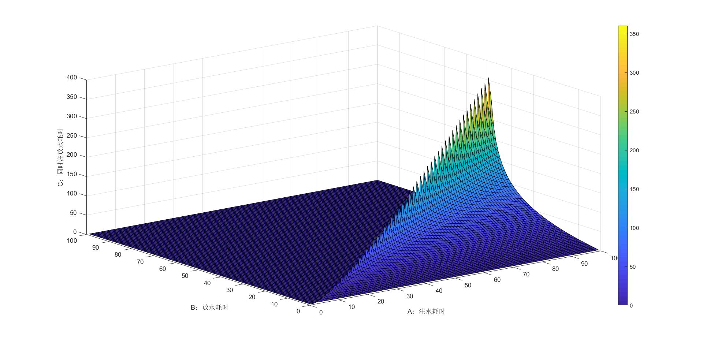

### 注放水问题

问题：假设有一个水池，深度为$ H $，使用水龙头注水，注满水要 $ A$秒，通过池底排水管道排水，放空水要$ B $秒，求同时注水、放水时注满水池耗时$C$。

---

解：

令$ h$为当前水深。

注水时水为匀速加入:
$$
\begin{equation}
\begin{aligned}
\frac{dh^+}{dt}&=\frac{H}{A}   \\
\int_0^Hdh&=\int_0^A \frac{H}{A} dt\\
\end{aligned}
\end{equation}
$$
放水时非匀速流动，依据伯努利定律:

$$
\begin{equation}
\begin{aligned}
\frac{1}{2}\rho v^2 + \rho g h + p &= \mbox{constant}\\
\end{aligned}
\end{equation}
$$
在出水口两侧：
$$
\begin{aligned}
\frac{1}{2}\rho v_1^2 + \rho g h_1 + p_1 &= \frac{1}{2}\rho v_2^2 + \rho g h_2 + p_2\\
\end{aligned}
$$
其中$\rho$为水的密度，$v_1、v_2$为流速，$h_1、 h_2$为两侧高度，$p_1、p_2$为两侧压强。

求解得到：
$$
\begin{aligned}
v&=\sqrt{2gh}
\end{aligned}
$$

因为 流速$ Q\propto v $所以$  Q \propto \sqrt{h} $，放水速度：
$$
\begin{equation}
\begin{aligned}
\frac{dh^-}{dt}&=-c \sqrt h \\
\int_H^0 \frac{dh}{\sqrt h} &=\int_0^B -c dt \\
\end{aligned}
\end{equation}
$$
求解得到：
$$
\begin{aligned}
c&=\frac{2\sqrt h}{B} \\
\end{aligned}
$$
放水速度为：
$$
\begin{aligned}
\frac{dh^-}{dt}&=\frac{-2 \sqrt{Hh}}{B}  \\
\end{aligned}
$$

联立注放水：
$$
\begin{equation}
\begin{aligned}
\frac{dh^-}{dt}+\frac{dh^+}{dt}&=\frac{-2 \sqrt{Hh}}{B}+\frac{H}{A}=\frac{HB-2A\sqrt{Hh}}{AB} 
\end{aligned}
\end{equation}
$$

图一 高度与高度变化关系

分析知：

* 当$ HB-2A\sqrt{Hh}<0$时:水位无法再增长，反而会下降。

* 当$ HB-2A\sqrt{Hh}=0$时: $ h=\frac{HB^2}{4A^2} $,流入流出达到平衡，水深最终维持在$\frac{HB^2}{4A^2}$处，如果$\frac{HB^2}{4A^2}<H $水池无法注满，如果$\frac{HB^2}{4A^2} >H 即B>2A$时可以注满。

* 当$ HB-2A\sqrt{Hh}>0$时:水位可以继续增长，如果维持此状态可以注满：

  
    $$
    \begin{aligned}
    \int_0^C \frac{dt}{AB}&=\int_0^H \frac{dh}{HB-2A\sqrt{Hh}}\\
    \end{aligned}
    $$
    令 $x=\sqrt h :h=x^2,dh=x2dx\\$

    $$
    \begin{aligned}
    \frac{C}{AB}&=\int_0^\sqrt H \frac{2xdx}{HB-2A\sqrt Hx}\\
    \end{aligned}
    $$

    令 $w=HB-2A\sqrt Hx:x=\frac{w-HB}{-2A\sqrt H} ,dx=\frac{-dw}{2A\sqrt H}\\$
    $$
    \begin{aligned}
    \frac{C}{AB}&=\int_{HB}^{HB-2AH}\frac{(w-HB)dw}{2A^2Hw}\\
    \end{aligned}
    $$
    求解得到：
    $$
    \begin{aligned}
    C&=-B-\frac{B^2}{2A}ln(1-\frac{2A}{B})\\
    \end{aligned}
    $$
    
    若要$ C$非负，$ 0<1-\frac{2A}{B}<1即0<2A<B$

综上所述：

​		要想能注满水，要求$2A<B $.最终耗时：$C=-B-\frac{B^2}{2A}ln(1-\frac{2A}{B})\\$

仿真效果
								