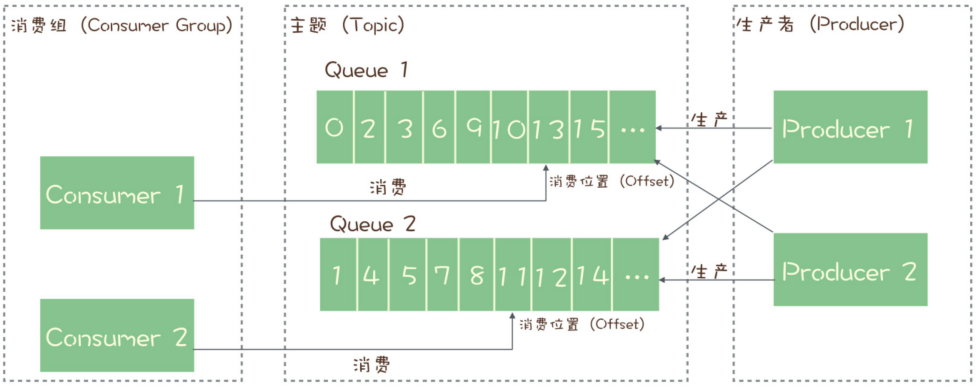
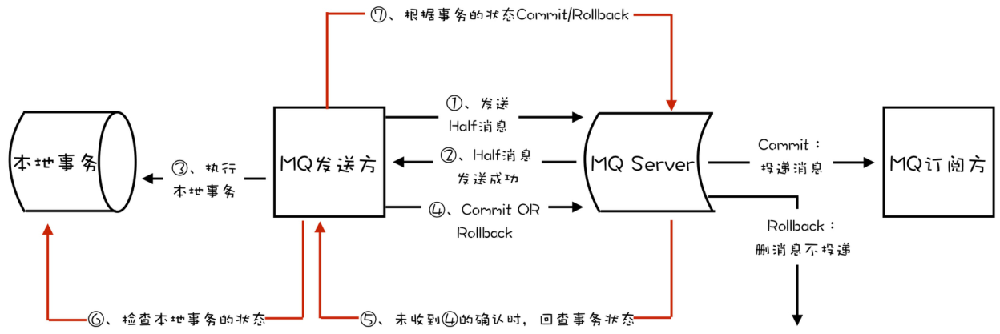
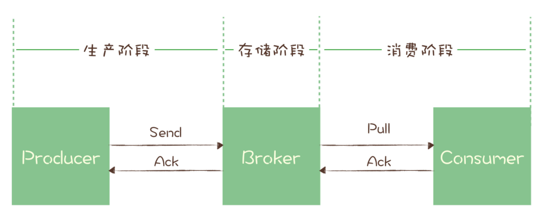
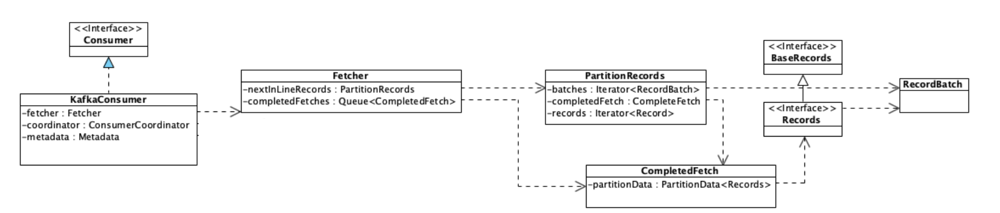

[toc]

### 1，MQ作用

* 异步处理：事件发生后投递到MQ，多个无依赖关系的消费者组订阅该主题，实现后续多个任务的异步处理。可以减少等待，实现步骤之间的并发，提升性能。缺点：同步操作变成异步，降低了数据的一致性，需要分布式事务补偿。

* 限流：网关处将请求放入MQ，MQ性能优于Redis，不会造成性能瓶颈，后端按照自身处理能力消费请求。MQ同时提供持久化机制，保证消息可靠传输。超时请求直接丢弃，后端可自行调整消费者数量，提升处理能力。
* 解耦：新增任务只需要订阅所需数据的主题，无需上游改动，实现上下游数据解耦。

### 2，数据流动

<center></center>

* 主题：服务端存储消息的容器，包含多个队列/分区，每个队列/分区存取部分数据。
* 消费者组：包含多个消费者，当订阅某个主题后，每个消费者被分配一个或者多个队列/分区(一个队列/分区只对应一个消费者)，多消费者并行处理。消费者间为竞争关系，不会收到同一份数据。同一个主题的多个消费者组间独立，各自可以获得完整的主题内数据。
* 可靠性保证：使用“请求-确认”机制，消息保存到服务端后，给生产者发送成功响应，消费者再发送下一条消息；消费者成功消费消息后，给MQ发送成功响应，消费者才能消费下一条消息，否则队列将被当前消费者独占，拒绝其他消费者的拉取请求，当超时后还未收到消费者反馈，则将结束消费者独占，当前消息可以被再次拉取消费。
* 有序性保证：由于一个队列只对应一个消费者，多个队列的消费者独立。所以==主题层面消息无有序性保证，只在队列/分区层面能保证。如果需要保证局部有序性，使用使用 `MessageQueueSelector` 根据共同ID进行一致性哈希运算指定发送队列，消费端注册 `MessageListenerOrderly` 监听器，从队列中有序地获取消息并处理。如果要求全局严格顺序，只能把生产者、消息队列/分区、消费者数配置成1。==
* 消费关系：MQ维护每个消费者组在每个队列/分区的偏移，消费者数量<=队列/分区数，由MQ均衡策略选择队列与消费者对应关系，保证分区平衡。多消费者并行处理，可以手动增加队列/分区、消费者数量以提高并发度。

### 3，RocketMQ消息事务

<center></center>

* 适用场景为需要异步更新数据，并且对数据实时性要求不高的场景。

* 发送半消息：本地事务执行前发送半消息，半消息对消费者不可见。

    ==为什么要在本地事务执行前发送，而不是本地事务执行成功后发送：发送半消息+确认机制本质为一种两阶段提交，类似于MySQL的两阶段提交保证持久性。如果本地事务执行完成宕机，未向MQ发送提交或者回滚指令，MQ将在超时后手动查询本地事务状态，自动提交或者回滚半消息，保证本地事务如果执行成功，下游一定可见所发半消息。==

* 回查状态：RocketMQ中broker超时未收到提交或回滚请求，将定期去生产者上反查这个消息事务对应的本地事务的状态，然后根据反查结果决定提交或者回滚这个事务。

* ACID准则：假设本地事务操作为X，下游消息消费者需要执行操作为Y，当X成功执行，而消息未被消费，Y尚未执行时：==X，Y操作分离，不满足原子性；本地状态已改变，下游状态未改变，不满足一致性；本地事务提交后对本地其他操作可见，不满足隔离性；持久性依赖于消息的可靠传输与可靠投递机制。==

* 具体实现依赖于`TransactionListener`，该类执行本地事务，并反馈执行状态，如果是`COMMIT_MESSAGE`则提交半消息，如果是`ROLLBACK_MESSAGE`回滚半消息；同时支持MQ回查本事事务状态，实现自动提交/回滚半消息。

    ```java
    public interface TransactionListener {
    	// 执行本地事务，并根据执行状态提交/回滚半消息
        // LocalTransactionState.ROLLBACK_MESSAGE;
        // LocalTransactionState.COMMIT_MESSAGE;
        LocalTransactionState executeLocalTransaction(final Message msg, final Object arg);
    	// 回查本事事务状态，实现自动提交/回滚半消息。
        LocalTransactionState checkLocalTransaction(final MessageExt msg);
    }
    ```

* 生产者半消息处理：发送半消息->执行本地事务->提交/回滚本消息

    ```java
    //DefaultMQProducerImpl#sendMessageInTransaction()
    public TransactionSendResult sendMessageInTransaction(final Message msg,
        final TransactionListener localTransactionListener, final Object arg)
        //给待发送消息添加半消息属性
        MessageAccessor.putProperty(msg, MessageConst.PROPERTY_TRANSACTION_PREPARED, "true");
    	//发送这条半消息
        sendResult = this.send(msg);
    	// 如果发送成功,调用TransactionListener实现类执行本地事务方法 executeLocalTransaction()
        switch (sendResult.getSendStatus()) {
            case SEND_OK: {
                  localTransactionState = transactionListener.executeLocalTransaction(msg, 
            }
        }
    	// 根据半消息发送的结果和本地事务执行的结果，事务的提交或者回滚
        this.endTransaction(msg, sendResult, localTransactionState, localException);
    }
    ```

* 服务端半消息处理

    先记录半消息原始的主题队列，再把半消息保存在一个特殊内部主题`RMQ_SYS_TRANS_HALF_TOPIC`下队列号为0的队列，这个主题和队列对消费者不可见。

    ```java
    //TransactionalMessageBridge#parseHalfMessageInner()
    private MessageExtBrokerInner parseHalfMessageInner(MessageExtBrokerInner msgInner) {
        // 记录消息的主题和队列，到新的属性中
        MessageAccessor.putProperty(msgInner, MessageConst.PROPERTY_REAL_TOPIC, msgInner.getTopic());
        MessageAccessor.putProperty(msgInner, MessageConst.PROPERTY_REAL_QUEUE_ID,
         // 替换消息的主题和队列为：RMQ_SYS_TRANS_HALF_TOPIC，0
        msgInner.setTopic(TransactionalMessageUtil.buildHalfTopic());
        msgInner.setQueueId(0);
                                    		msgInner.setPropertiesString(MessageDecoder.messageProperties2String(msgInner.getProperties()));
        return msgInner;
    }
    ```

* 在`TransactionalMessageCheckService` 服务中启动一个定时器，定时从半消息队列中读出所有待反查的半消息，`Broker`会给对应的`Producer `发送执行事务状态反查的请求。根据返回响应中的反查结果，决定半消息提交/回滚，或者继续反查。如果是提交半消息，MQ将半消息从半消息队列复制到消息真正的主题和队列中，消费者可以开始消费。

    ```java
    // AbstractTransactionalMessageCheckListener#sendCheckMessage()
    public void sendCheckMessage(MessageExt msgExt) throws Exception {
        Channel channel = brokerController.getProducerManager().getAvailableChannel(groupId);
        if (channel != null) {
            // Broker给对应半消息的Producer发一个要求执行事务状态反查的 RPC 请求
            brokerController.getBroker2Client().checkProducerTransactionState(groupId, channel, checkTransactionStateRequestHeader, msgExt);
        } else {
            LOGGER.warn("Check transaction failed, channel is null. groupId={}", groupId);
        }
    }
    
    //EndTransactionProcessor#processRequest()
    public RemotingCommand processRequest(ChannelHandlerContext ctx, RemotingCommand request){
        if (MessageSysFlag.TRANSACTION_COMMIT_TYPE == requestHeader.getCommitOrRollback()) {
            // 提交,把半消息从半消息队列中复制到这个消息真正的主题和队列中去
            this.brokerController.getTransactionalMessageService().deletePrepareMessage(result.getPrepareMessage());
            this.brokerController.getTransactionalMessageService().getTransactionMetrics().addAndGet(msgInner.getTopic(), -1);
        } else if (MessageSysFlag.TRANSACTION_ROLLBACK_TYPE == requestHeader.getCommitOrRollback()) {
            // 回滚
            this.brokerController.getTransactionalMessageService().deletePrepareMessage(result.getPrepareMessage());
        
    }
    ```

### 4，可靠传输

* 丢失检测：为每个生产者指定要发送的队列/分区，再利用发送端拦截器，给每个消费者的消息附加生产者信息+连续递增的序号，各个生产者序列独立，然后在消费者端检查每个队列/分区中各个生产者生成消息序号是否连续。

    <center></center>

* 生产阶段可靠性保证：确认服务器是否正确收到消息，如果反馈失败将重试。

    ```java
    // 同步发送，等待服务器返回
    try {
        RecordMetadata metadata = producer.send(record).get();
    } catch (Throwable e) {
        //消息发送失败
    }
    
    // 异步发送，通过回调处理确认消息
    producer.send(record, (metadata, exception) -> {
        if (metadata != null) {
        } else {
          //消息发送失败
        }
    });
    ```

* 存储阶段可靠性保证：当服务器将消息持久化到磁盘后，将向生产者发送确认请求，否则生产者将重试发送。具体的策略可以分为：当主节点成功存储就返回成功；当至少两个节点成功存储就返回成功；当过半节点成功存储就返回成功。
* 消费阶段可靠性保证：执行消费业务逻辑成功后，才会给Broker发送消费确认响应，保证消息一定被成功消费，否则下次拉消息的时候将返回同一条消息。

### 5，防止重复消费

* 根据消息投递次数，给出三种传递消息时能够提供的服务质量标准

    * `At most once`: 消息在传递时，最多会被送达一次，允许丢消息。

    * `At least once`: 消息在传递时，至少会被送达一次，不允许丢消息，但允许有少量重复消息出现。绝大多数MQ提供该等级服务质量，此时==消息队列很难保证消息不重复==。

    * `Exactly once`：消息在传递时，只会被送达一次，不允许丢失也不允许重复。

* 由于消息队列很难保证消息不重复，只能在消费端保证幂等性。==`At least once` + 幂等消费 = `Exactly once`==
    * 存储系统唯一性约束：DB中创建消息中转流水表，并为消息标识字段添加唯一性约束，或者使用Redis的`SETNX`指令，消息能成功插入则可以被消费，否则丢弃消息。
    * 版本约束：为数据增加版本号属性，类似乐观锁，比较当前数据的版本号是否和消息中的版本号一致，如果不一致就拒绝更新数据，更新数据的同时将版本号 +1。
    * 全局唯一约束：给每条消息指定全局唯一的ID，消费时如果该消息未被消费过，才更新数据，然后将消费状态置为已消费。难点：全局唯一ID；全局消费状态存储；为防止并发消费同一条消息时，导致重复消费，{检测消息消费状态、消费消息、设置消息消费状态}需要使用事务或者分布式锁，保证复合操作原子性。

* 为什么舍弃`Exactly once`：消费者消费时MQ需要判断是否重复，增大开销；消息超时后未收到消费者反馈，不能简单的再次投递，需要MQ利用回查机制去查询消费者是否成功消费，增大开销。

### 6，避免消息积压

* 发送端：通过增大队列/分区数量来增大系统可支持的并行度，该举措适合在线业务系统；批量发送消息，提高整体吞吐量，但是将增大反馈时延，适合离线分析系统。

* 消费端：通过增大消费者组中消费者数量，提高消费端消费能力。注意：由于一个队列/分区只能对应一个消费者，所以队列/分区数要大于等于消费者数量。

    禁止在未开启批量消费时，将多条消息取出加入JVM队列，使用多线程消费队列中消息。对于队列/分区，只有前一个消息确认消费后才能获取下一条消息，这将导致内存队列中消息尚未被消费，但是MQ中已标记为消费，当JVM宕机，将导致消息丢失，同时单个队列/分区并发消费将丢失有序保证。

* 批量消费：MQ支持批量消费获得多条消息，批量处理。适用于无有序性要求，支持多线程并发批量处理的任务。

    对于kafka只支持批量确认，如果批次中某些任务失败，只能反馈失败，然后重试整个批次，或者反馈成功，这将丢弃失败任务。

    对于RocketMQ 支持单个消息确认，对于返回 `RECONSUME_LATER` 的消息，将这些消息放入重试队列，并在配置的延迟后重新投递这些消息给消费者，在此期间将停止向消费者发送更多消息，直到失败的消息被成功消费，以保证有序性。

* 积压处理：消费降级降低发送端消息数，保证下游正常运行；下游将低优先级消息转储，延后处理。

### 7，Kafka性能优化方式

* 批量+异步处理：消息在生产者客户端、服务器、消费者客户端以批量为单位传输、写入磁盘、集群复制。在生产者客户端收集发往相同分区的消息打包为批量消息，在消费者客户端解包为单个消息，批次消息被确认后再异步给消息的生产者发送反馈。

    批量异步消费实现：

    

    -->消费者通过`fetcher.sendFetches()`构造请求，向`fetcher`获取指定的消息;

    -->在`fetcher`中通过`client.send()`将请求异步发送出去，并注册回调处理返回`Response`。此时`Request`并没有被真正发出，而是被暂存在`client.unsend`中等待被发送；

    -->调用`client.poll()`方法，将之前构造的请求发送出去，返回的请求被暂时存放在`Fetcher.completedFetches`中，再通过注册的回调处理收到的响应；

    -->在`fetcher.fetchedRecords()`中，将返回的响应反序列化后转换为消息列表，返回给调用者。

    ```java
    // KafkaConsumer#pollForFetches()
    private Fetch<K, V> pollForFetches(Timer timer) {
        // 如果缓存里面有未读取的消息，直接返回这些消息
        final Fetch<K, V> fetch = fetcher.collectFetch();
        if (!fetch.isEmpty()) {
            return fetch;
        }
        // 构造拉取消息请求，并加入待发送请求集合
        // 内部调用client.send()
        sendFetches();
        // 发送网络请求拉取消息，等待直到有消息返回或者超时
        client.poll(pollTimer, () -> {
            return !fetcher.hasAvailableFetches();
        });
        // 返回拉到的消息
        return fetcher.collectFetch();
    }
    ```

* 顺序读盘：磁盘顺序读写性能优于随机读写，MQ将分区消息顺序写入对应log文件，消费消息时顺序读取log文件。

* 数据压缩：节省存储空间，提升网络传输性能。MQ将一批消息一起压缩，在服务端不用进行解压，整批直接存储， 然后整批发送给消费者，批消息由消费者进行解压。

* Pagecache缓存：PageCache作为磁盘高速读写缓存，读写文件优先使用Pagechage。在MQ中消息读写比例约为1:1，每条消息只会被读取一次，所以使用只读缓存没有意义，使用系统维护PageCache的读写缓存即可。如果消息写入服务端就被消费，缓存命中率高，免去磁盘IO。

* 传统消息发送流程，磁盘将数据写入磁盘缓冲区->DMA将磁盘缓存拷贝到内核态缓冲->cpu将数据从内核态拷贝到用户态->cpu将数据拷贝到socket缓冲区。

    使用零拷贝消息发送流程，磁盘将数据写入磁盘缓冲区->DMA将磁盘缓存拷贝到内核态缓冲->零拷贝技术使用`mmap()` 系统调用，把内核缓冲区里的数据映射到用户空间->`sendfile()`在内核缓冲区中操作数据，将数据发到socket缓冲区。数据通过 DMA 进行传输，不需 CPU 参与。

### 8，RocketMQ发送消息

1，参数

* 通信模式`CommunicationMode`，决定生产者行为和回调执行：
    * 单向发送：发送消息后立即返回，不处理响应，不关心是否发送成功。
    * 同步发送：发送消息后等待响应；
    *  异步发送：发送消息后立即返回，在提供的回调方法中处理响应。

* 队列选择器`MessageQueueSelector`：选择消息存入topic下哪个队列
* 消息发送结果处理回调`SendCallback`

2，异步发送流程：==注意底层的netty已经实现异步发送，当前的异步是指在选择消息队列等操作，由线程池异步实现，最终callback仍旧由netty线程调用==。

 -> 通过`ExecutorService` 创建发送任务，实现异步发送，生产者提交后即返回。

```java
// DefaultMQProducerImpl#send()
public void send(final Message msg, final MessageQueueSelector selector, final Object arg,
        final SendCallback sendCallback, final long timeout){
    // 线程池异步发送
    Runnable runnable = new Runnable() {
        @Override
        public void run() {
            try {
                sendSelectImpl(msg, selector, arg, CommunicationMode.ASYNC, newCallBack,
                    timeout - costTime);
            } catch (Exception e) {
                newCallBack.onException(e);
            } 
        }
    };
    executeAsyncMessageSend(runnable, msg, newCallBack, timeout, beginStartTime);
}
```

 ->根据队列选择器`MessageQueueSelector`选择要发送的队列。这里使用策略模式来实现不同场景下使用不同的队列选择算法。如果需要实现消息局部有序性，需要自行实现对应的`MessageQueueSelector`。

```java
// DefaultMQProducerImpl#sendSelectImpl()
private SendResult sendSelectImpl(
        Message msg,
        MessageQueueSelector selector,
        Object arg,
        final CommunicationMode communicationMode,
        final SendCallback sendCallback, final long timeout
) {
  	//根据队列选择器`MessageQueueSelector`选择要发送的队列
    mq = mQClientFactory.getClientConfig().queueWithNamespace(selector.select(messageQueueList, userMessage, arg));
    if (mq != null) {
        return this.sendKernelImpl(msg, mq, communicationMode, sendCallback, null, timeout - costTime);
    }
}
```

3，同步发送流程：当前线程执行队列选择等操作，并等待发送操作返回，但是由于发送由`netty`实现，所以最终`callback`由`netty`线程调用。

```java
// DefaultMQProducerImpl#send()
public SendResult send(Message msg,
    long timeout) throws MQClientException, RemotingException, MQBrokerException, InterruptedException {
    // 当前线程执行队列选择等操作，并等待发送操作返回
    return this.sendDefaultImpl(msg, CommunicationMode.SYNC, null, timeout);
}
```

### 7，集群管理

1，RocketMQ集群复制

* 复制的基本单位是`Broker`，对应的多个队列将整体复制。在写入消息时，要求至少消息复制到半数以上的节点，才给客户端返回成功，保证宕机数不过半时数据不丢失，数据一致。
* 支持通过选举来动态切换主节点，保证可用性。

2，Kafka集群复制

* 复制的基本单位是分区，消息在写入到主节点，且等待ISR个节点都复制成功后再返回。
* Kafka 使用 ZooKeeper 来监控每个分区的多个节点，如果某个分区的主节点宕机，会利用 ZooKeeper 来选出一个新的主节点，解决可用性问题。
