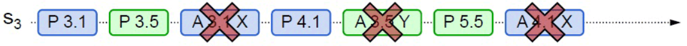

[toc]

# Basic Poxos

### 前置共识

* 为什么需要分布式共识：集群场景一个操作的数据需要同步到多个从节点，使用“状态转移”方式，通过复制全量数据做同步时，需要等待全部从节点记录下数据修改后，再返回操作成功，如果某个从节点阻塞，将导致整个操作受阻。

* 状态机复制：任何初始状态一样的状态机，如果执行的命令序列一样，则最终达到的状态也一样。
* 操作转移方式同步：==确保主从节点初始状态一致， 并且接收到的操作指令序列也一致，主从节点将保持最终一致。==

### 成员

* 提案节点：提出修改某个值请求的节点；
* 决策节点：接受提案节点请求，决定该请求是否可以接受；
* 记录节点：不参与提案与决策，只负责记录决策节点通过的提案。

### 流程

* 分为准备、批准两个阶段


#### 准备阶段

* 为什么需要准备阶段：为保证并发场景修改操作结果正确，需要为操作加锁，防止多个请求串行执行。==准备过程起到锁抢占作用，防止某个节点获取锁后宕机，导致锁无法释放==。

* 流程

    > ->  初始化：决策节点保存通过准备阶段的请求的最大请求ID为`pre_id`、通过批准阶段的请求中最大请求ID和对应值`acc_id, acc_value`；
    >
    > -> 提案节点发起请求，请求中携带全局唯一且递增的`n`作为提案ID；
    >
    > -> 在决策节点，如果`n>pre_id`，当前准备请求被接受，更新`pre_id=n`，之后将不再接受提案ID小于等于`n`的准备请求，==不再接受开启版本号小于当前的会话==；如果`n<=pre_id`证明已存在新的准备请求，当前准备请求结束已过时，直接返回失败；
    >
    > -> 如果当前准备请求被接受，决策节点将返回批准过的提案中，最大提案ID对应的ID和值：`<acc_id,  acc_value>`。

#### 批准阶段

* 流程

    > ->如果所有决策节点返回的`acc_value`都是`null`，说明当前请求获取锁，可以向所有决策节点发送数据`<id, value>`，完成数据更新。
    >
    > ->如果存在决策节返回的`acc_value`不是`null`，==说明当前请求获取锁失败，将放弃当前请求，向所有决策节点发送数据`<id, acc_value>`，协助获得锁的请求完成数据更新；==
    >
    > ->在决策节点，如果请求`id>=pre_id`，当前批准求情将被处理，更新`acc_id=id, acc_value=value`，回复成功。如果`id<pre_id`当前请求将被无视，==只处理最新会话的批准请求，之前开启会话的批准请求将被无视，防止新旧操作交替，导致数据不一致==；
    >
    > ->当提案节点收到过半决策节点的应答后，协商结束，共识已完成，将决策广播发送到记录节点。

上述流程额可以总结为下列伪代码

```pseudocode
// 初始化变量
pre_id = -1
acc_id = -1
acc_value = null

// 提案节点请求中携带全局唯一且递增的提案ID n
// 决策节点返回批准过的提案中最大提案ID对应的 ID 和设置的值
function proposal_request(n):
    if n > pre_id:
        // 当前准备请求被接受，更新 pre_id
        pre_id = n
        // 不再接受提案ID小于等于 n 的准备请求
        // 不再接受开启版本号小于当前的会话
        if acc_value is null:
            // 当前请求是第一个请求，成功获得锁
            return (acc_id, null)
        else:
            // 当前锁已被其它请求抢占，放弃当前请求，协助获得锁的请求完成同步流程
            return (acc_id, acc_value)
    else:
        // 已存在更新的准备请求，当前准备请求结束，直接返回
        return rejected

// 提案节点处理决策节点的响应
function handle_decision_responses(responses):
    if all(response.acc_value is null for response in responses):
        // 当前请求获取锁，可以向所有决策节点发送数据
        send_data_to_decision_nodes(id, value)
    else:
        // 当前请求获取锁失败，向所有决策节点发送数据协助获得锁的请求完成数据更新
        send_data_to_decision_nodes(id, acc_value)

// 决策节点处理批准请求
function approve_request(id, value):
    if id >= pre_id:
        // 当前批准请求被处理，更新 acc_id 和 acc_value
        acc_id = id
        acc_value = value
        // 回复成功，不再接受提案ID小于 pre_id 的批准提案
        // 只处理最新会话的批准请求，之前开启会话的批准请求将被无视
        return approved
    else:
        // 当前请求将被无视
        return ignored

// 提案节点处理过半决策节点的应答后
function consensus_achieved(responses):
    if count_success_responses(responses) > half_of_decision_nodes:
        // 协商结束，共识已完成，将决策发送到记录节点
        send_decision_to_record_nodes()

```


# Multi Paxos

### 如何改进

* `Basic Paxos`中，如果两个提案节点争相提出提案，抢占同一个值的修改权限，导致某个决策节点轮流通过他们的准备请求，使得两个提案的批准请求通过数未过半，整个系统处于无法提交的状态，例如：

    

    > (0)->A发起版本为3.1准备请求 `prepare(3.1, A)`，决策节点修改`pre_id=3.1`；
    >
    > (1)->B发起版本为3.5准备请求 `prepare(3.5, B)`，决策节点修改`pre_id=3.5`；
    >
    > (2)->A提交版本为3.1批准请求`accept(3.1, A, value)`，由于决策节点处`pre_id=3.5`，批准请求被拒绝；
    >
    > (3)->A重新发起版本为4.1准备请求`prepare(4.1, A)`，决策节点修改`pre_id=4.1`；
    >
    > (4)->B提交版本为3.5批准请求`accept(3.5, B, value)`，由于决策节点处`pre_id=4.1`，批准请求被拒绝；
    >
    > (5)->B重新发起版本为5.5准备请求`prepare(5.5, B)`，决策节点修改`pre_id=5.5`；
    >
    > 后续将不断重复(2)到(5)步，将导致该节点永远无法完成批准请求的处理。

* `Multi Paxos`通过选取主从节点，保证节点平等的同时，在提案节点中实现主次之分，限制每个节点都有不受控的提案权利，防止并发提交提案时数据错乱的问题；

    ==只有主节点能提交提案，无需`Basic Poxos`中抢占锁的准备阶段，相当于处于无并发环境中==。

* `Basic Poxos`中无节点异常处理机制，==`Multi Paxos`通过新增主节点选举，保证正常节点数过半，系统就能正常工作，解决节点异常的问题==。

### 流程


#### 选主

* 当网络节点中无主节点时，触发`Basic Poxos`方式选举过程，获得过半批准请求的节点成为主节点，并将任期编号加一。

#### 提交

* 用户提交请求ID、当前主节点任期和想要设置的值`<ID, i, value>`给主节点；
* 主节点将日志持久化，再向所有从节点传递数据日志，当主节点收到过半从节点确认后，提交变更，返回操作成功。

#### 节点异常处理

* 通过主节点选举和提案提交需要过半节点赞成的机制，保证正常节点过半，系统就能正常工作。

* 例如集群产生脑裂,得到分区`X, Y`，其中`X`不满足过半节点要求。

* 如果原主节点位于`X`，由于`Y`中节点数过半，可以选举新的主节点，并将任期数加一。提交修改时，分区`X`由于无法收到超过原先从节点数一半的确认，将无法批准新的更改，分区`Y`将能正常工作；

    分区解除后，分区`Y`中主节点由于任期更大，将成为所有节点的主节点，并将脑裂期间`Y`中修改同步到`X`中节点。

* 如果原主节点位于`Y`，由于`X`中节点数未过半，不能收到过半从节点确认，不再能提供服务，分区`Y`将能正常工作。

    分区解除后，分区`Y`中主节点将成为所有节点的主节点，并将脑裂期间`Y`中修改同步到`X`中节点。

    
