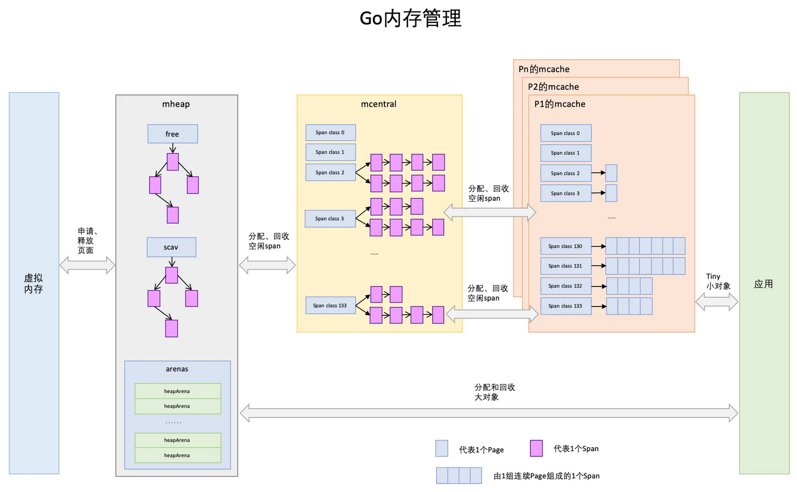

[toc]

### 内存管理

##### 垃圾回收

“⾮分代的、⾮移动的、并发的、三⾊的”标记清除垃圾回收算法。

整个进程空间⾥申请每个对象占据的内存可以视为⼀个图，初始状态下每个内存对象都是⽩⾊标记。

1. 做⼀些准备⼯作：收集根对象（全局变量，和G stack），开启写屏障。全局变量、开启写屏障需要STW（暂停所有正在执行的用户线程/协程）。然后取消STW，将扫描任务作为多个并发的goroutine⽴即⼊队给调度器，进⽽被CPU处理。
2. 第⼀轮先并发扫描root对象（全局指针和 goroutine 栈上的指针），从根出发扫描所有可达对象，标记为灰色，放入待处理队列，并把root标记为黑色。第⼆轮从队列取出灰色对象，将其引用对象标记为灰色放入队列，自身标记为黑色。循环往复，最后队列为空时，标记完成后只有黑色和白色对象，黑色代表使用中对象，白色对象代表垃圾，并使用写屏障最终变化的引用关系。
3. 第三轮再次STW，重新扫描全局变量，和上一轮改变的stack（写屏障），完成标记工作。标记结束阶段的最后会关闭写屏障，然后关闭STW，唤醒熟睡已久的负责清扫垃圾的goroutine。
4. 清扫goroutine是应用启动后立即创建的一个后台goroutine，它会立刻进入睡眠，等待被唤醒，然后执行垃圾清理：把白色对象挨个清理掉，清扫goroutine和应用goroutine是并发进行的。清扫完成之后，它再次进入睡眠状态，等待下次被唤醒。

GC有3种触发方式：

1. 辅助GC：在分配内存时，会判断当前的Heap内存分配量是否达到了触发一轮GC的阈值（每轮GC完成后，该阈值会被动态设置），如果超过阈值，则启动一轮GC。

2. 调用runtime.GC()强制启动一轮GC。

3. 当超过 forcegcperiod (2分钟)没有运行GC会启动一轮GC。

Dijistra写屏障：满足强三色不变性：黑色节点不允许引用白色节点 当黑色节点新增了白色节点的引用时，将对应的白色节点改为灰色。

混合写屏障：满足弱三色不变性：黑色节点允许引用白色节点，但是该白色节点有其他灰色节点间接的引用（确保不会被遗漏），当白色节点被删除了一个引用时，悲观地认为它一定会被一个黑色节点新增引用，所以将它置为灰色。减少了第二次STW的时间。

##### 内存分配

Go语⾔的运⾏环境（runtime）会在goroutine需要的时候动态地分配栈空间。

分块式的栈：初始分配⼀个8KB的内存空间来给goroutine的栈使⽤。每个Go函数的开头都有⼀⼩段检测代码。这段代码会检查我们是否已经⽤完了分配的栈空间。如果是的话，它会调⽤morestack函数。morestack函数分配⼀块新的内存作为栈空间，并且在这块栈空间的底部填⼊各种信息（包括之前的那块栈地址）。在分配了这块新的栈空间之后，它会重试刚才造成栈空间不⾜的函数。这个过程叫做栈分裂（stack split）。新分配的栈底部，还插⼊了⼀个叫做lessstack的函数指针。当从刚才造成栈空间不⾜的那个函数返回时做准备的。当我们从那个函数返回时，它会跳转到lessstack。lessstack函数会查看在栈底部存放的数据结构⾥的信息，如果新栈已空，然后调整栈指针（stack pointer）。这样就完成了从新的栈块到⽼的栈块的跳转。接下来，新分配的这个块栈空间就可以被释放掉了。

按照需求来扩展和收缩栈的⼤⼩。 热分裂问题：缩减栈空间是⼀个开销相对较⼤的操作。如果在⼀个循环⾥有栈分裂，那么它的开销就变得不可忽略了。⼀个函数会扩展，然后分裂栈。当它返回的时候⼜会释放之前分配的内存块。

栈复制法：当goroutine运⾏并⽤完栈空间的时候，栈溢出检查会被触发。会分配⼀个两倍⼤的内存块并把⽼的内存块内容复制到新的内存块⾥。这样做意味着当栈缩减回之前⼤⼩时，我们不需要做任何事情。栈的缩减没有任何代价。⽽且，当栈再次扩展时，运⾏环境也不需要再做任何事。它可以重⽤之前分配的空间。

存储在栈上的变量的地址可能已经被使⽤到。也就是说程序使⽤到了⼀些指向栈的指针。当移动栈的时候，所有指向栈⾥内容的指针都会变得⽆效。当我们移动栈的时候，我们可以更新栈⾥的指针让它们指向新的地址，使⽤了垃圾回收的引用关系信息来复制栈。

##### 逃逸

1，堆适合不可预知大小的内存分配。但是为此付出的代价是分配速度较慢，而且会形成内存碎片。

- 如果分配在栈中，则函数执行结束可自动将内存回收；
- 如果分配在堆中，则函数执行结束可交给GC（垃圾回收）处理

逃逸分析的好处应该是尽量将变量分配到栈上，栈的分配比堆快，性能好，可以避免 Go 频繁地进行垃圾回收。

2，编译器在编译阶段完成，根据变量是否被外部引用来决定是否逃逸：

* 指针逃逸：返回局部变量指针被外界引用。
* 栈空间不足逃逸：当栈空间不足以存放当前对象时或无法判断当前切片长度时会将对象分配到堆中。
* 动态类型逃逸：空接口 interface{} 可以表示任意的类型，如果函数参数为 interface{}，编译期间很难确定其参数的具体类型，也会发生逃逸。
* 闭包引用对象逃逸：返回函数中引用局部变量，以致产生逃逸：

##### 内存管理

1，结构

- 程序文件段（.text），包括二进制可执行代码；
- 已初始化数据段（.data），包括初始化的静态常量；
- 未初始化数据段（.bss），包括未初始化的静态变量；
- 堆段，包括动态分配的内存，从低地址开始向上增长；进程的堆区这是所有线程共享的，需要一套机制来进行分配（考虑内存碎片、公平性、冲突解决）。
- 栈段，包括局部变量和函数调用的上下文等，每个线程的栈空间是独立的，但是都位于进程的栈区域中。线性内存，管理简单，分配比堆上更快。

2，Go通过细致的对象划分、极致的多级缓存+无锁策略缓存、精确的位图管理来进行精细化的内存管理和性能保障。Go中把所有对象分为三个层级：

- 微小对象（0,16byte）：分配流程为，mcahe->mcentral->mheap位图查找->mheap基数树查找->操作系统分配
- 小对象 [16byte, 32KB]：分配流程与微小对象一样
- 大对象(32KB以上)：分为流程为，mheap基数树查找->操作系统分配（不经过mcache和mcentral）

3，mspan 是一分配内存的单位。，mcache、mcentral、mheap 起到了内存池的作用，会被预分配内存，当有对应大小的对象需要分配时会先到它们这一层请求。如果这一层内存池不够用时，会按照下面的顺序一层一层的往上申请内存：mcache -> mcentral-> mheap -> 操作系统。

* page：一个page大小为8kb（为操作系统中页的两倍），下图中一个浅蓝色的长方形代表一个page

* span是Go中内存管理的基本单位，span的大小是page的倍数，表示一组连续的页面。一共划分了67级的mspan，每一级mspan设定拥有的page数和要存储对象的大小，通过精细化分配能有效地减少内存碎片；下图中一个淡紫色的长方形为一个span。
* mcache：每个层级的span都会在mcache中保存一份，当前最多有GOMAXPROCS个线程在运行，所以最多需要GOMAXPROCS个mcache就可以保证各线程对mcache的无锁访问；每个逻辑处理器P会有自己的mcache，对这部分区域的访问是无锁的。每个类别的mspan对象对应两个mspan，一个分配给含有指针的的对象，一个分配给不含有指针的对象，共计134个span类别，这样垃圾回收时，针对无指针对象的span区域不需要进行复杂的标记处理，提升效果。
* mcentral是所有线程共享的的缓存，需要加锁访问；它的主要作用是为mcache提供切分好的mspan资源。每个spanClass对应一个级别的mcentral；mcentral整体是在mheap中管理的，它之中包含两个mspan链表，分别为partial代表经过gc后至少有1个空闲的对象空间span，用于为mcache分配可用mspan、full代表无空闲区域的span列表，mcache将已满的mspan交由mcentral，进行垃圾回收。
* mheap代表Go中所持有的堆空间。当mcentral没有空闲span时，会向mheap申请，如果mheap中也没有资源了，会向操作系统来申请内存。向操作系统申请是按照页为单位来的（4kb），然后把申请来的内存页按照page（8kb）、span（page的倍数）、chunk（512kb）、heapArena（64m）这种级别来组织起来。

