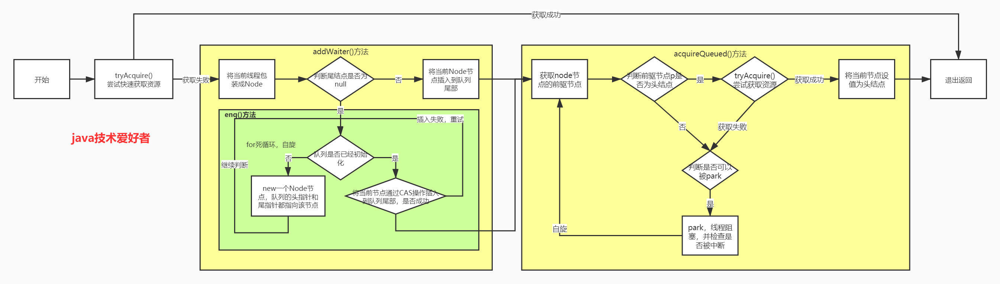

# 多线程

[toc]

### 多线程基础

1：把一个任务称为一个进程，某些进程内部还需要同时执行多个子任务，把子任务称为线程。一个进程可以包含一个或多个线程，但至少会有一个线程。操作系统调度的最小任务单位其实不是进程，而是线程。多线程编程的特点在于：多线程经常需要读写共享数据，并且需要同步

2：实现多任务的方法，有以下几种：

* 多进程模式（每个进程只有一个线程）

* 多线程模式（一个进程有多个线程）

* 多进程＋多线程模式（复杂度最高）：

3：    多进程与多线程比较：

- 创建进程比创建线程开销大，尤其是在Windows系统上；
- 进程间通信比线程间通信要慢，因为线程间通信就是读写同一个变量，速度很快。
- 多进程稳定性比多线程高，因为在多进程的情况下，一个进程崩溃不会影响其他进程，而在多线程的情况下，任何一个线程崩溃会直接导致整个进程崩溃。

4：Java语言内置了多线程支持：当Java程序启动的时候，实际上是启动了一个JVM进程，然后，JVM启动主线程来执行`main()`方法。在`main()`方法中，我们又可以启动其他线程。

### 创建多线程

* 继承 Thread 类，并重写它的 run 方法，对对象调用start()开始执行。编写简单，线程类已经继承了Thread类，所以不能再继承其他父类。
* 一个类实现 Runnable 接口，并实现 run 方法。然后创建 Runnable 实现类对象，并把它作为 target 传入 Thread 的构造函数中，最后调用 start 方法启动线程。
* 首先定义一个实现 Callable 接口的实现类，并实现 call 方法。call 方法是带返回值的。然后通过 FutureTask 的构造方法，把这个 Callable 实现类传进去。把 FutureTask 作为 Thread 类的 target ，创建 Thread 线程对象。通过 FutureTask 的 get 方法获取线程的执行结果。
* 线程类只是实现了Runnable接口或Callable接口，还可以继承其他类，实现其它接口。同时在这种方式下，多个线程可以共享同一个target对象，所以非常适合多个相同线程来处理同一份资源的情况，从而可以将CPU、代码和数据分开，形成清晰的模型，较好地体现了面向对象的思想。
* Executors 来创建线程池对象。定一个 Runnable 的实现类，重写 run 方法。然后创建一个拥有固定线程数的线程池。最后通过 ExecutorService 对象的 execute 方法传入线程对象。
* Executors 来创建线程池对象。定一个 Callable 的实现类，重写 call方法。然后创建一个拥有固定线程数的线程池。最后通过 ExecutorService 对象的 submit方法传入线程对象,并拿到一个Future对象。通过Future对象可以了解任务执行情况，可取消任务的执行，还可获取执行结果。

*  可以通过Runnable和ExecutorService 来执行，而Callable则只能通过ExecutorService 或者包装为FutureTask来执行。

方法一：从`Thread`派生一个自定义类，然后覆写`run()`方法：

```java
public class Main {
    public static void main(String[] args) {
        Thread t = new MyThread();
        // 启动新线程,start()方法会在内部自动调用实例的run()方法
        // 直接调用run()方法，相当于调用了一个普通的Java方法，当前线程并没有任何改变，也不会启动新线程。上述代码实际上是在main()方法内部又调用了run()方法，打印语句是在main线程中执行的，没有任何新线程被创建。必须调用Thread实例的start()方法才能启动新线程，一个线程对象只能调用一次start()方法。
        // main线程和t线程就开始同时运行了，并且由操作系统调度，程序本身无法确定线程的调度顺序。
        t.start(); 
    }
}

class MyThread extends Thread {
    @Override
    public void run() {
        System.out.println("start new thread!");
    }
}

// 简写为
public class Main {
    public static void main(String[] args) {
        Thread t = new Thread(){
            @Override
            public void run() {
                System.out.println("start new thread!");
            }
        };
        t.start(); 
    }
}

```

方法二：创建`Thread`实例时，传入一个`Runnable`实例：

```java
public class Main {
    public static void main(String[] args) {
        Thread t = new Thread(new MyRunnable());
        t.start(); // 启动新线程
    }
}

class MyRunnable implements Runnable {
    @Override
    public void run() {
        System.out.println("start new thread!");
    }
}

// 简写为：
public class Main {
    public static void main(String[] args) {
        Thread t = new Thread(() -> {
            System.out.println("start new thread!");
        });
        t.start(); // 启动新线程
    }
}

```

### Callable 、Runble

*  Runnable不返回任务执行结果，Callable可返回任务执行结果。
*  Callable在任务无法计算结果时抛出异常，而Runnable不能。
*  运行Callable任务可以拿到一个Future对象，表示异步计算的结果。它提供了检查计算是否完成的方法，以等待计算的完成，并检索计算的结果。通过Future对象可以了解任务执行情况，可取消任务的执行，还可获取执行结果。
*  Runnable

###  线程的状态

1：Java线程的状态有以下几种：

- New：新创建的线程，尚未执行；
- Runnable：运行中的线程，正在执行`run()`方法的Java代码；
- Blocked：运行中的线程，因为某些操作被阻塞而挂起，离开执行队列；
- Waiting：运行中的线程，因为某些操作在等待中，仍在执行队列；
- Timed Waiting：运行中的线程，因为执行`sleep()`方法正在计时等待；
- Terminated：线程已终止，因为`run()`方法执行完毕。

当线程启动后，它可以在`Runnable`、`Blocked`、`Waiting`和`Timed Waiting`这几个状态之间切换，直到最后变成`Terminated`状态，线程终止。

2：线程终止的原因有：

- 线程正常终止：`run()`方法执行到`return`语句返回；
- 线程意外终止：`run()`方法因为未捕获的异常导致线程终止；
- 对某个线程的`Thread`实例调用`stop()`方法强制终止（强烈不推荐使用）。

3：当`main`线程对线程对象`t`调用`join()`方法时，主线程将等待变量`t`表示的线程运行结束，即`join`就是指等待该线程结束，然后才继续往下执行自身线程。`join(long)`的重载方法也可以指定一个等待时间，超过等待时间后就不再继续等待。对已经运行结束的线程调用`join()`方法会立刻返回。主线程在等待子线程结束，这个时候主线程是在waiting状态。

### 中断线程

1：方法一：中断一个线程只需要在其他线程中对目标线程调用`interrupt()`方法，`interrupt()`方法仅仅向`t`线程发出了“中断请求”，至于`t`线程是否能立刻响应,要看具体代码。目标线程需要反复检测自身状态是否是interrupted状态``while (! isInterrupted()）``，如果是，就立刻结束运行。标线程检测到`isInterrupted()`为`true`或者捕获了`InterruptedException`都应该立刻结束自身线程。`interrupt()`并不具备阻塞效果，传递完信号后直接继续执行下一句。

如果线程处于正常运行状态，调用``interrupt()``会向目标线程传递被中断信号，目标线程自行处理中断信号，不会出现抛出异常。Interrupt一般用于清理，他在接收到中断信号后自行处理，不强制要求立刻推出，被中断可以选择不退出。

如果线程处于等待状态，例如，`t.join()`会让`main`线程进入等待状态，此时，如果对`main`线程调用`interrupt()`，`join()`方法会立刻结束等待并抛出`InterruptedException`，因此，目标线程只要捕获到`join()`方法抛出的`InterruptedException`，就说明有其他线程对其调用了`interrupt()`方法，如果捕获了该方法的这个异常。依然可以根据代码正常运行。但是通常情况下该线程应该执行资源清理然后立刻结束运行。当前线程被``interrupt()`,并不影响由它创建的子线程的正常运行。

```java
public class Main {
    public static void main(String[] args) throws InterruptedException {
        Thread t = new MyThread();
        t.start();
        t.interrupt(); // 中断t线程
        t.join(); // 等待t线程结束
    }
}

class MyThread extends Thread {
    public void run() {
        Thread hello = new HelloThread();
        hello.start(); // 启动hello线程
        try {
            hello.join(); // 等待hello线程结束，等待状态被`interrupt()`会抛出异常。
        } catch (InterruptedException e) {
        }
        hello.interrupt(); //正常运行状态被`interrupt()`会正常结束，无异常产生。
    }
}

class HelloThread extends Thread {
    public void run() {
        while (!isInterrupted()) {
            try {
                Thread.sleep(100);
            } catch (InterruptedException e) {
            	//若线程在在wait,sleep,occupied状态时，调用了它的interrupt()方法，那么它的“中断状态”会被清除，也就是isInterrupted() 会返回false，并且会收到一个InterruptedException异常。如果没有break的话，while会条件会一直返回true，就死循环了
            	// 可以通过Thread.currentThread.interrupt()恢复中断标志位true
            	break; 
            }
        }
    }
}

```


2：方法二：一个常用的中断线程的方法是设置标志位。我们通常会用一个`running`标志位来标识线程是否应该继续运行，在外部线程中，通过把`HelloThread.running`置为`false`，就可以让线程结束：

```java
public class Main {
    public static void main(String[] args)  throws InterruptedException {
        HelloThread t = new HelloThread();
        t.start();
        t.running = false; // 标志位置为false
    }
}

class HelloThread extends Thread {
	// 线程间共享变量需要使用volatile关键字标记，确保每个线程都能读取到更新后的变量值。
    // 在Java虚拟机中，变量的值保存在主内存中，但是，当线程访问变量时，它会先获取一个副本，并保存在自己的工作内存中。如果线程修改了变量的值，虚拟机会在某个时刻把修改后的值回写到主内存，但是，这个时间是不确定的！这会导致如果一个线程更新了某个变量，另一个线程读取的值可能还是更新前的,这就造成了多线程之间共享的变量不一致。
    // volatile关键字的目的是告诉虚拟机：每次访问变量时，总是获取主内存的最新值；每次修改变量后，立刻回写到主内存。当一个线程修改了某个共享变量的值，其他线程能够立刻看到修改后的值
    public volatile boolean running = true;
    public void run() {
        while (running) {
        }
    }
}

```

### 守护线程

1： Java程序入口就是由JVM启动`main`线程，`main`线程又可以启动其他线程。当所有线程都运行结束时，JVM退出，进程结束。

如果有一个线程没有退出，JVM进程就不会退出。所以，必须保证所有线程都能及时结束。

2：但是有一种线程的目的就是无限循环，例如，一个定时触发任务的线程，他是为其他线程服务的，当被服务线程结束后，他也应该结束，但由于是死循环无法正常结束，所以可以他把标记为守护线程。守护线程是指为其他线程服务的线程。在JVM中，所有非守护线程都执行完毕后，无论有没有守护线程，虚拟机都会自动退出。JVM退出时，不必关心守护线程是否已结束。

3：使用

方法和普通线程一样，只是在调用`start()`方法前，调用`setDaemon(true)`把该线程标记为守护线程：

```java
t.setDaemon(true);
t.start();
```

守护线程不能持有任何需要关闭的资源，例如打开文件等，因为虚拟机退出时，守护线程没有任何机会来关闭文件，这会导致数据丢失。

### 线程同步

1： 多线程模型下，要保证逻辑正确，对共享变量进行读写时，必须保证一组指令以原子方式执行：即某一个线程执行时，其他线程必须等待。通过加锁和解锁的操作，就能保证指令总是在一个线程执行期间，不会有其他线程会进入此指令区间。即使在执行期线程被操作系统中断执行，其他线程也会因为无法获得锁导致无法进入此指令区间。只有执行线程将锁释放后，其他线程才有机会获得锁并执行。这种加锁和解锁之间的代码块我们称之为临界区（Critical Section），任何时候临界区最多只有一个线程能执行。

```ascii
┌───────┐   ┌───────┐
│Thread1  │   │Thread2  │
└───┬───┘   └───┬───┘
     │             │
     │-- lock --   │
     │ILOAD (100)  │
     │IADD         │
     │ISTORE (101) │
     │-- unlock -- │
     │             │-- lock --
     │             │ILOAD (101)
     │             │IADD
     │             │ISTORE (102)
     │             │-- unlock --
     ▼            ▼
```

2：使用`synchronized`关键字对一个对象进行加锁，`synchronized`保证了代码块在任意时刻最多只有一个线程能执行：

```java
// 线程在执行各自的synchronized(lock) { ... }代码块时，必须先获得锁，才能进入代码块进行。执行结束后，在synchronized语句块结束会自动释放锁。这样一来，对n变量进行读写就不可能同时进行。
// 缺点是带来了性能下降。因为synchronized代码块无法并发执行。此外，加锁和解锁需要消耗一定的时间，所以，synchronized会降低程序的执行效率。
// 不必担心抛出异常。因为无论是否有异常，都会在synchronized结束处正确释放锁
//  public static final Object lock = new Object();静态字段作为锁。
// synchronized除了加锁外，还具有内存屏障功能，并且强制读取所有共享变量的主内存最新值，退出synchronized时再强制回写主内存（如果有修改），已经包含了volatile的功能，所以n不用加volatile修饰。
synchronized(lock) {
    n = n + 1;
}// 释放锁
```

3：`volatile`和`synchronized`

volatile只保证：读主内存到本地副本；操作本地副本；回写主内存。这3步多个线程可以同时进行，一个线程读取变量后，另一个线程照样可以正常读取，即获取值和回写值时都不会阻塞线程，它只是保证了其他线程能更快的看到修改后的值，只保证线程读取内存的时效的问题，不保证原子性。所以 volatile 不能用于线程同步，只是用于提高程序执行效率。

synchronized除了加锁外，还具有内存屏障功能，并且强制读取所有共享变量的主内存最新值，退出synchronized时再强制回写主内存（如果有修改），已经包含了volatile的功能，所以变量不用额外加volatile修饰。

4：原语

JVM规范定义了几种原子操作：

- 基本类型（`long`和`double`除外）赋值，例如：`int n = m`；
- 引用类型赋值，例如：`List<String> list = anotherList`。

单条原子操作的语句不需要同步，如果是多行赋值语句，就必须保证是同步操作

```java
synchronized(this) {
    this.first = first;
    this.last = last;
}
```

### 同步方法

1：如果一个类被设计为允许多线程正确访问，我们就说这个类就是“线程安全”的（thread-safe）

* 一些不变类，例如`String`，`Integer`，`LocalDate`，它们的所有成员变量都是`final`，多线程同时访问时只能读不能写，这些不变类也是线程安全的。

* 类似`Math`这些只提供静态方法，没有成员变量的类，也是线程安全的。

* 大部分类，例如`ArrayList`，都是非线程安全的类，不能在多线程中修改它们。但是，如果所有线程都只读取，不写入，那么`ArrayList`是可以安全地在线程间共享的。

* 没有特殊说明时，一个类默认是非线程安全的。

2：Java程序依靠`synchronized`对线程进行同步，使用`synchronized`的时候，锁住的是哪个对象非常重要。

```java
public class Counter {
    private int count = 0;
	public static int lock=Object();
    public void add(int n) {
    	// 常用方法是把synchronized逻辑封装起来，方便调用
        synchronized(this) { // 锁住this即当前实例，这又使得创建多个Counter实例的时候，它们之间互不影响，可以并发执行
            count += n;
        }
    }
    // 等价写法，它表示整个方法都必须用this实例加锁。
    public synchronized void add(int n) { // 锁住this
    	count += n;
	} 
	// static方法，是没有this实例的，锁住的是该类的Class实例,即synchronized(Counter.class) {ops;},一个类只有一个Class实例，所以各个实例无法并发执行。
	public synchronized static void test(int n) {
    	ops;
	}
	// 读取单个变量无需同步，说过是多个就要同步
	public int get() {
        return count;
    }

}

// 各个线程可以并发执行
new Thread(() -> {
     new Counter().add();
}).start();
new Thread(() -> {
     new Counter().add();
}).start();

////////////////////////////////////////
 public class Counter {
    private int count = 0;
	public static int lock=Object();
    public void add(int n) {
    	// 常用方法是把synchronized逻辑封装起来，方便调用
        synchronized(Counter.lock) { // 锁住静态变量，由于静态变量属于类本身，各个实例共享一个静态变量，这使得创建多个Counter实例的时候无法并发执行
            count += n;
        }
    }
}

// 各个线程无法并发执行
new Thread(() -> {
     Counter().add();
}).start();
new Thread(() -> {
     Counter().dec();
}).start();

```

3：同步只保证多线程执行的synchronized块是依次执行，最终状态对不对还取决于你的逻辑。比如要等所有线程操作完毕再去读取的结果才是正确的，如果各个线程正在执行，直接读取结果就会之错误的。

### 死锁

1：Java的线程锁是可重入的锁：JVM允许同一个线程重复获取同一个锁，这种能被同一个线程反复获取的锁，就叫做可重入锁，原因是：不是方法获取锁，是线程获取锁，一个线程获取锁后就可以在线程里面的方法中传递。获取锁的时候，不但要判断是否是第一次获取，还要记录这是第几次获取。每获取一次锁，记录+1，每退出`synchronized`块，记录-1，减到0的时候，才会真正释放锁。

```java
public class Counter {
    private int count = 0;

    public synchronized void add(int n) {
        if (n < 0) {
        // 不会柱塞
            dec(-n);
        } else {
            count += n;
        }
    }

    public synchronized void dec(int n) {
        count += n;
    }
}
```

2：两个线程各自持有不同的锁，然后各自试图获取对方手里的锁，造成了双方无限等待下去，这就是死锁。死锁发生后，没有任何机制能解除死锁，只能强制结束JVM进程。解决方法是：线程获取锁的顺序要一致。即严格按照先获取`lockA`，再获取`lockB`的顺序。

```java
public void add(int m) {
    synchronized(lockA) { // 获得lockA的锁
        this.value += m;
        synchronized(lockB) { // 获得lockB的锁
            this.another += m;
        } // 释放lockB的锁
    } // 释放lockA的锁
}

// 可能发生死锁
public void dec(int m) {
    synchronized(lockB) { // 获得lockB的锁
        this.another -= m;
        synchronized(lockA) { // 获得lockA的锁
            this.value -= m;
        } // 释放lockA的锁
    } // 释放lockB的锁
}

线程1：进入add()，获得lockA；
线程2：进入dec()，获得lockB。
随后：
线程1：准备获得lockB，失败，等待中；
线程2：准备获得lockA，失败，等待中。

// 不会发生死锁
public void dec(int m) {
    synchronized(lockA) { // 获得lockA的锁
        this.value -= m;
        synchronized(lockB) { // 获得lockB的锁
            this.another -= m;
        } // 释放lockB的锁
    } // 释放lockA的锁
}


```

###  使用wait和notify

1：多线程协调运行的原则就是：当条件不满足时，线程进入等待状态；当条件满足时，线程被唤醒，继续执行任务。

```java
class TaskQueue {
    Queue<String> queue = new LinkedList<>();
	// 添加任务
    public synchronized void addTask(String s) {
        this.queue.add(s);
        // 对this锁对象调用notify()方法，这个方法会唤醒一个正在this锁等待的线程,当他获得锁后从wait()方法返回。
        // 要在synchronized内部调用
        this.notify(); 
        //锁会对应一个队列，里面存储正在等待该锁的进程。使用notifyAll()将唤醒所有当前正在this锁等待的线程，而notify()只会唤醒其中一个（具体哪个依赖操作系统，有一定的随机性）。这是因为可能有多个线程正在wait()中等待，使用notifyAll()将一次性全部唤醒。通常来说，notifyAll()更安全。有些时候，如果我们的代码逻辑考虑不周，用notify()会导致只唤醒了一个线程，而其他线程可能永远等待下去醒不过来了。
        this.notifyAll();
    }
	// 可能死循环
	// 当quene为空，进入死循环，直到添加任务。但是getTask()已经持有this锁，addTask()会被阻塞，所以无法添加任务，无法跳出死循环。
    public synchronized String getTask() {
        while (queue.isEmpty()) {
      	  // doSomething();
        }
        return queue.remove();
    }
    // 非死循环版本。
    public synchronized String getTask() {
    // 始终在while循环中wait()，并且每次被唤醒,并拿到this锁后必须再次判断，因为可能多个线程竞争一个锁，如果时使用if(queue.isEmpty()){  this.wait();},可能多个线程同时被唤醒，但只有一个线程能获得锁假设为t1，t1从离开wait()，其余线程被再次阻塞，当t1执行完毕释放锁，其余线程再次竞争，又有一个线程能获取到锁假设为t2，如果使用if，t2获得锁后直接remove(),但这时quene可能为空，出现逻辑错误。所以每次被唤醒并拿到this锁就必须再次判断。
        while (queue.isEmpty()) { 
        	// 如果队列为空，线程将执行this.wait()，进入等待状态。
       	    // wait()方法必须在当前获取的锁对象上调用，这里获取的是this锁，因此调用this.wait()。如果是其他锁：someLock.wait()
            // wait()方法不会返回，直到将来某个时刻，线程从等待状态被其他线程唤醒并拿到锁后，wait()方法才会返回，然后，继续执行下一条语句。
            // 必须在synchronized块中才能调用wait()方法,wait()方法调用时，会释放线程获得的锁，wait()方法返回后，线程又会重新试图获得锁。
            this.wait(); // 先释放this锁，当被唤醒并获得锁后从wait（）返回。
        // 重新获取this锁，已唤醒的线程还需要重新获得锁后才能继续执行，当多个线程竞争一个锁后，未获得锁的线程会再次阻塞，当获得锁的线程释放锁，被阻塞线程再次竞争锁，如此往复。
        }
        return queue.remove();
	}
```

### ReentrantLock

1: `synchronized`关键字用于加锁，但这种锁一是很重，二是获取时必须一直等待，没有额外的尝试机制。`java.util.concurrent.locks`包提供的`ReentrantLock`用于替代`synchronized`加锁

```java
public class Counter {
    private final Lock lock = new ReentrantLock();
    private int count;

    public void add(int n) {
        lock.lock();
        // 要考虑异常。
        try {
            count += n;
        } finally {
        // synchronized是Java语言层面提供的语法，所以我们不需要考虑异常，而ReentrantLock是Java代码实现的锁，我们就必须先获取锁,在finally中正确释放锁。
            lock.unlock();
        }
    }
}
```

2:`ReentrantLock`可以尝试获取锁

```java
if (lock.tryLock(1, TimeUnit.SECONDS)) {// 尝试获取锁的时候，最多等待1秒。如果1秒后仍未获取到锁，tryLock()返回false，程序自己从wait()返回，然后程序就可以做一些不需要加锁资源的额外处理，而不是无限等待下去。线程在tryLock()失败的时候不会导致死锁。
    try {
        ...
    } finally {
        lock.unlock();
    }
}
```

3：在`ReentrantLock`下使用`Condition`对象来实现`wait`和`notify`的功能。

```java
class TaskQueue {
    private final Lock lock = new ReentrantLock();
    // 引用的Condition对象必须从Lock实例的newCondition()返回，这样才能获得一个绑定了Lock实例的Condition实例。
    private final Condition condition = lock.newCondition();
    private Queue<String> queue = new LinkedList<>();

    public void addTask(String s) {
        lock.lock();
        try {
            queue.add(s);
            // 会唤醒某个等待线程
            condition.signal();
            // 会唤醒所有等待线程；
            condition.signalAll();
        } finally {
            lock.unlock();
        }
    }

    public String getTask() {
        lock.lock();
        try {
            while (queue.isEmpty()) {
                // 会释放当前锁，加入锁对应的等待队列，进入等待状态
                condition.await();
                // 线程唤醒后需要重新获得锁，无法获取就会再次进入阻塞状态
            }
            return queue.remove();
        } finally {
            lock.unlock();
        }
    }
}

// 释放锁，等待指定时间后，如果还没有被其他线程通过signal()或signalAll()唤醒，可以自己醒来,并返回false;如果时间限定内被唤醒返回true,无论是被唤醒还是自动醒来，都会从等待队列进入同步队列，等待获取lock，在获得lock前会保持阻塞。
if (condition.await(1, TimeUnit.SECOND)) {
    // 被其他线程唤醒
    
} else {
    // 指定时间内没有被其他线程唤醒
}
```

4：一个condition内部维护一个等待队列(不带头结点的链式队列)，一个同步队列（双向队列）。所有调用condition.await方法的线程会程释放lock然后加入到等待队列中，并且线程状态转换为等待状态,直至被signal/signalAll（doSignal方法只会对等待队列的头节点进行操作，而doSignalAll等待队列中的每一个节点都移入到同步队列中，即“通知”当前调用condition.await()方法的每一个线程。）后会使得当前线程/全部等待线程从等待队列中移至到同步队列中去，调用condition的signal/signalAll的前提条件是当前调用signal的线程已经获取了lock，调用condition的signal方法可以将等待队列中等待时间最长的节点移动到同步队列中，按照等待队列是先进先出（FIFO）的，所以等待队列的头节点必然会是等待时间最长的节点，也就是每次调用condition的signal方法是将头节点移动到同步队列中，使得该节点能够有机会获得lock，直到获得了lock后才会从await方法返回，或者在等待时被中断会做中断处理,也即退出await方法必须是已经获得了condition引用（关联）的lock。signalAll把全部等待线程移到同步队列，多个线程竞争一个锁。

可以多次调用lock.newCondition()方法创建多个condition对象，也就是一个lock可以持有多个等待队列和多个同步队列，所以多个同步队列间存在竞争关系。

线程awaitThread先通过lock.lock()方法获取锁成功后调用了condition.await方法释放锁并进入等待队列，而另一个线程signalThread通过lock.lock()方法获取锁成功后调用了condition.signal或者signalAll方法，使得线程awaitThread能够有机会移入到同步队列中，当其他线程释放lock后使得线程awaitThread能够有机会获取lock，从而使得线程awaitThread能够从await方法中退出执行后续操作。如果awaitThread获取lock失败会重新进入到同步队列的尾部。

### ReadWriteLock

1：`ReadWriteLock`可以解决这个问题，它保证：

- 只允许一个线程写入（其他线程既不能写入也不能读取）；
- 没有写入时，多个线程允许同时读（提高性能）。

把读写操作分别用读锁和写锁来加锁，在读取时，多个线程可以同时获得读锁，这样就大大提高了并发读的执行效率。适用条件是同一个数据，有大量线程读取，但仅有少数线程修改。

```java
 private final ReadWriteLock rwlock = new ReentrantReadWriteLock();
 private final Lock rlock = rwlock.readLock();
 private final Lock wlock = rwlock.writeLock();
 public void inc(int index) {
     wlock.lock(); // 加写锁
     try {
         // 对于写入原子操作不加锁是多线程安全的，但是加锁的目的是保证逻辑正确，比如连续写入多个，可能中途被阻断
     } finally {
     	wlock.unlock(); // 释放写锁
     }
 }

public int[] get() {
    rlock.lock(); // 加读锁
    try {
    	// 允许多个并发读取
    	// 对于一次读取多个变量，如果读的时候如果没有加锁，读到一半可能会有线程写入数据 从而导致读取的数据出错，
    } finally {
    	rlock.unlock(); // 释放读锁
    }
}
```

###  StampedLock

1：对于`ReadWriteLock`如果有线程正在读，写线程需要等待读线程释放锁后才能获取写锁，即读的过程中不允许写，这是一种悲观的读锁。

`StampedLock`和`ReadWriteLock`相比，改进之处在于：读的过程中也允许获取写锁后写入！读的数据就可能不一致，所以，需要一点额外的代码来判断读的过程中是否有写入，这种读锁是一种乐观锁。

2：乐观锁：乐观地估计读的过程中大概率不会有写入，因此被称为乐观锁。

悲观锁：读的过程中拒绝有写入，也就是写入必须等待。

显然乐观锁的并发效率更高，但一旦有小概率的写入导致读取的数据不一致，需要能检测出来，再读一遍就行。

3：写入的加锁是完全一样的，不同的是读取。注意到首先我们通过`tryOptimisticRead()`获取一个乐观读锁，并返回版本号。接着进行读取，读取完成后，我们通过`validate()`去验证版本号，如果在读取过程中没有写入，版本号不变，验证成功，我们就可以放心地继续后续操作。如果在读取过程中有写入，版本号会发生变化，验证将失败。在失败的时候，我们再通过获取悲观读锁再次读取。由于写入的概率不高，程序在绝大部分情况下可以通过乐观读锁获取数据，极少数情况下使用悲观读锁获取数据。

```java
	private final StampedLock stampedLock = new StampedLock();

    private double x;
    private double y;

    public void move(double deltaX, double deltaY) {
    	// 写锁互斥，一个线程获取到了，另一个线程就只能在stampedLock.writeLock()等着
        long stamp = stampedLock.writeLock(); // 获取写锁
        try {
            x += deltaX;
            y += deltaY;
        } finally {
            stampedLock.unlockWrite(stamp); // 释放写锁
        }
    }

    public double distanceFromOrigin() {
        long stamp = stampedLock.tryOptimisticRead(); // 获得一个乐观读锁
        // 注意下面两行代码不是原子操作
        // 假设x,y = (100,200)
        double currentX = x;
        // 此处已读取到x=100，但x,y可能被写线程修改为(300,400)
        double currentY = y;
        // 此处已读取到y，如果没有写入，读取是正确的(100,200)
        // 如果有写入，读取是错误的(100,400)
        if (!stampedLock.validate(stamp)) { // 检查乐观读锁后是否有其他写锁发生，
            stamp = stampedLock.readLock(); // 获取一个悲观读锁，保证x,y读值配对。不会读到一部分写入前的数据一部分写入后的数据
            try {
                currentX = x;
                currentY = y;
            } finally {
                stampedLock.unlockRead(stamp); // 释放悲观读锁
            }
        }
        return Math.sqrt(currentX * currentX + currentY * currentY);
    }
```

4：把读锁细分为乐观读和悲观读，能进一步提升并发效率。但这也是有代价的：一是代码更加复杂，二是`StampedLock`是不可重入锁，不能在一个线程中反复获取同一个锁。

对于悲观锁：读写不能同时进行，一般来说写锁的优先级要高于读锁，read-write-lock假定读很多几乎不会间断，假设现在存在大量读取，如果突然来个写锁，那么只需等当前正在读的释放读锁后，写就立刻获得写锁，其它后续读都得等，不然在一直都有读的情况下，永远写不了。

对于乐观锁：读写可以同时进行。乐观锁其实不上锁，只检查版本号，也不必释放，它的目的是把read-write-lock的read加读锁这一步给去了，因为绝大多数情况下没有写，不需要加读锁，当发现读的时候发生了写，数据前后版本不一致，获取悲观锁，保证读取数据逻辑正确性。

### concurrent

1：对`List`、`Map`、`Set`、`Deque`等，`java.util.concurrent`包也提供了并发集合类

| interface | non-thread-safe         | thread-safe                              |
| :-------- | :---------------------- | :--------------------------------------- |
| List      | ArrayList               | CopyOnWriteArrayList                     |
| Map       | HashMap                 | ConcurrentHashMap                        |
| Set       | HashSet / TreeSet       | CopyOnWriteArraySet                      |
| Queue     | ArrayDeque / LinkedList | ArrayBlockingQueue / LinkedBlockingQueue |
| Deque     | ArrayDeque / LinkedList | LinkedBlockingDeque                      |

使用这些并发集合与使用非线程安全的集合类完全相同，所有的同步和加锁的逻辑都在集合内部实现，对外部调用者来说，只需要正常按接口引用，其他代码和原来的非线程安全代码完全一样

2：把一个旧的非安全集合转换为线程安全集合

```java
Map unsafeMap = new HashMap();
Map threadSafeMap = Collections.synchronizedMap(unsafeMap);
```

但是它实际上是用一个包装类包装了非线程安全的`Map`，然后对所有读写方法都用`synchronized`加锁，这样获得的线程安全集合的性能比`java.util.concurrent`集合要低很多，所以不推荐使用。

### Atomic

1：一组原子操作的封装类，如`AtomicInteger`，原子操作实现了无锁的线程安全；适用于计数器，累加器等。原子操作可以看做最小的执行单位，该操作在执行完毕前不会被任何其他任务或事件打断。最底层基于汇编语言实现，总体性能比Synchronized高很多。

2：Atomic类是通过无锁（lock-free）的方式实现的线程安全（thread-safe）访问。它的主要原理是利用了CAS：Compare and Set。CAS是指，在这个操作中，如果`AtomicInteger`的当前值是`prev`，那么就更新为`next`，返回`true`。如果`AtomicInteger`的当前值不是`prev`，就什么也不干，返回`false`。通过CAS操作并配合`do ... while`循环，即使其他线程修改了`AtomicInteger`的值，最终的结果也是正确的。

```java
public int incrementAndGet(AtomicInteger var) {
    int prev, next;
    do {
        prev = var.get();
        next = prev + 1;
    } while ( ! var.compareAndSet(prev, next)); //如果var的值不是prev证明var之后被修改过放弃加一。
    return next;
}
```

### 线程池

1：线程池内部维护了若干个线程，没有任务的时候，这些线程都处于等待状态。如果有新任务，就分配一个空闲线程执行。如果所有线程都处于忙碌状态，新任务要么放入队列等待，要么增加一个新线程进行处理。

2：常用实现类有：

*   SingleThreadExecutor：仅单线程执行的线程池。

    ```java
    new ThreadPoolExecutor(1, 1,0L, TimeUnit.MILLISECONDS,new LinkedBlockingQueue<Runnable>()));
    ```

    当一个任务提交时，首先会创建一个核心线程来执行任务，如果超过核心线程的数量，将会放入队列中，因为LinkedBlockingQueue是长度为Integer.MAX_VALUE的队列，可以认为是无界队列，因此往队列中可以插入无限多的任务，在资源有限的时候容易引起OOM异常，同时因为无界队列，maximumPoolSize和keepAliveTime参数将无效，压根就不会创建非核心线程

-   FixedThreadPool：线程数固定的线程池；

    ```java
    new ThreadPoolExecutor(nThreads, nThreads,0L, TimeUnit.MILLISECONDS, new LinkedBlockingQueue<Runnable>());
    ```

    corePoolSize==maxinumPoolSize，那么则创建了一个固定大小的线程池。和SingleThreadExecutor类似，唯一的区别就是核心线程数不同，并且由于使用的是LinkedBlockingQueue，允许的请求队列长度为Integer.MAX_VALUE，可能会堆积大量的请求，从而在资源有限的时候容易引起OOM异常

-   CachedThreadPool：线程数根据任务动态调整的线程池；

    ```java
    new ThreadPoolExecutor(0, Integer.MAX_VALUE,60L, TimeUnit.SECONDS,new SynchronousQueue<Runnable>());
    ```

    当一个任务提交时，corePoolSize为0不创建核心线程，SynchronousQueue是一个不存储元素的队列，可以理解为队里永远是满的，因此最终会创建非核心线程来执行任务。对于非核心线程空闲60s时将被回收。因为Integer.MAX_VALUE非常大，可以认为是可以无限创建线程的，在资源有限的情况下容易引起OOM异常

    

创建这些线程池的方法都被封装到`Executors`这个类中：``ExecutorService es = Executors.newXXXX();``

```java
// 创建一个固定大小的线程池:
ExecutorService es = Executors.newFixedThreadPool(4);
for (int i = 0; i < 6; i++) {
	es.submit(new Task("" + i));//提交执行,返回的Future对象可以用来取消任务和等待任务执行完成
}
// 关闭线程池,使用shutdown()方法关闭线程池的时候，线程池中不再接受后续添加的任务，允许已经提交的任务（尚未开始执行和已经开始执行的）继续执行，执行完后再关闭。
// shutdownNow()阻止新的任务提交，尚未开始执行的任务不再执行，同时尝试终止正在执行的任务。
// awaitTermination()则会等待指定的时间后返回布尔值判断线程是否关闭。常用在shutdown()后判断线程池是否已经关闭。
// 一个在程序中不再被引用的线程池如果同时没有剩余的线程，那么这个线程池会被自动的shutdown.
es.shutdown();
boolean isDone;
// 等待线程池终止
do {
    isDone = es.awaitTermination(1, TimeUnit.DAYS);
} while(!isDone);
```

4：ScheduledThreadPool：放入ScheduledThreadPool的任务可以定期反复执行。内部维护一个`DelayedWorkQueue`,本质为一个优先队列，按任务到下次执行的时间间隔长短进行排序，一个任务在当前周期执行完成后不会一直持有线程资源，而是释放线程资源，以到下次执行时间长短为优先级重新入优先队列。注意如果线程池关闭，周期任务终止。

```java
ScheduledExecutorService ses = Executors.newScheduledThreadPool(4);
// 1秒后执行一次性任务:
ses.schedule(new Task("one-time"), 1, TimeUnit.SECONDS);
// 2秒后开始执行定时任务，每3秒执行，FixedRate是指任务总是以固定时间间隔触发，在开始执行后开始计时。如果任务的执行时间超过其周期，则后续执行可能会延迟开始，但不会并发执行。如果任务的任何执行遇到异常，则将禁止后续任务的执行。假设第n次任务开始时间是t，运行时间是p，设置的间隔周期为T则第n+1次任务的开始时间是max(t + p,t + T)
ses.scheduleAtFixedRate(new Task("fixed-rate"), 2, 3, TimeUnit.SECONDS);
// 2秒后开始执行定时任务，以3秒为间隔执行，FixedDelay是指，上一次任务执行完毕后，等待固定的时间间隔，在任务完成后计时，再执行下一次任务
ses.scheduleWithFixedDelay(new Task("fixed-delay"), 2, 3, TimeUnit.SECONDS);
```

5：`java.util.Timer`类可以定期执行任务，但是，一个`Timer`会对应一个`Thread`，所以，一个`Timer`只能定期执行一个任务，多个定时任务必须启动多个`Timer`，而一个`ScheduledThreadPool`就可以调度多个定时任务

6：线程池线程数量的设置：

*   CPU密集型 => 线程池的大小推荐为CPU数量 + 1，CPU数量可以根据Runtime.availableProcessors方法获取
*   IO密集型 => CPU数量 * CPU利用率 * (1 + 线程等待时间/线程CPU时间)
*   混合型 => 将任务分为CPU密集型和IO密集型，然后分别使用不同的线程池去处理，从而使每个线程池可以根据各自的工作负载来调整

7：ThreadPoolExecutor

 Executors.newXXXThreadPool()去创建线程池的底层实现中允许的请求队列长度为 Integer.MAX_VALUE，可能会堆积大量的请求，从而导致 OOM。通过 ThreadPoolExecutor 的方式，这样的处理方式让写的同学更加明确线程池的运行规则，规避资源耗尽的风险。前面几种方法内部也是通过ThreadPoolExecutor方式实现。提交执行：``pool.execute(new ThreadTask());``

```java
new ThreadPoolExecutor（
    int corePoolSize,
    int maximumPoolSize,
    long keepAliveTime,
    TimeUnit unit,
    BlockingQueue<Runnable>workQueue，
    ThreadFactory threadFactory,
    RejectedExecutionHandler handler）
```

*   corePoolSize:指定了线程池中的核心线程数量，如果当前线程线程数小于coresize就开辟新的线程去执行，否则就放到workQueue任务队列中去；可以动态改变：setCorePoolSize 。

*   maximumPoolSize:指定了线程池中的最大线程数量，这个参数会根据你使用的workQueue任务队列的类型，决定线程池会开辟的最大线程数量；可以动态改变：setMaximumPoolSize

*   keepAliveTime:如果已创建的线程大于了corePoolSize，并且如果有线程的空闲时间大于了keepAliveTime，那么这些线程会被kill掉直到剩下corePoolSize个线程。可以动态设置：setKeepAliveTime

*   unit:keepAliveTime的单位

*   workQueue:任务队列，被添加到线程池中但尚未被执行的任务；它一般分为直接提交队列、有界任务队列、无界任务队列、优先任务队列几种；

    *   直接提交队列（new SynchronousQueue<Runnable>()）：设置为SynchronousQueue队列，SynchronousQueue是一个特殊的BlockingQueue，它没有容量，也可以视为容量为0，入队列会总是失败，每执行一个插入操作就会阻塞，需要再执行一个删除操作才会被唤醒，反之每一个删除操作也都要等待对应的插入操作。如果创建的线程数大于maximumPoolSize时，直接执行了拒绝策略。使用SynchronousQueue队列，提交的任务不会被保存，总是会马上提交执行。如果用于执行任务的线程数量小于maximumPoolSize，则尝试创建新的进程，如果达到maximumPoolSize设置的最大值，则根据你设置的handler执行拒绝策略。因此这种方式你提交的任务不会被缓存起来，而是会被马上执行，在这种情况下，你需要对你程序的并发量有个准确的评估，才能设置合适的maximumPoolSize数量，否则很容易就会执行拒绝策略。使用这种队列能在maxPoolSize条件下尽可能快的创建（或选择空闲的线程）来执行新提交的任务。

    *   有界的任务队列（new ArrayBlockingQueue<Runnable>(10)）：若有新的任务需要执行时，线程池会创建新的线程，直到创建的线程数量达到corePoolSize时，则会将新的任务加入到等待队列中。若等待队列未满，则添加到队列中；若等待队列已满，即超过ArrayBlockingQueue初始化的容量，则继续创建线程，直到线程数量达到maximumPoolSize设置的最大线程数量，若已经大于maximumPoolSize，则执行拒绝策略。在这种情况下，线程数量的上限与有界任务队列的状态有直接关系，如果有界队列初始容量较大或者没有达到超负荷的状态，线程数将一直维持在corePoolSize以下，反之当任务队列已满时，则会以maximumPoolSize为最大线程数上限。一个新的任务提交会创建新的线程的条件：已创建的的线程数小于corePoolSize（即便有线程是空闲的）；已创建的线程数大于corePoolSize小于maxPoolSize，同时任务队列已经满。使用长队列和小的线程池，可以降低CPU使用率，降低系统资源的消耗，以及降低线程上下文切换的消耗，但是会导致低吞吐量。如果任务频繁的阻塞，系统可能会创建比允许的线程数多的线程。使用短队列和大的线程池，可以提高CPU使用率，但也有可能导致吞吐量下降

    *   无界的任务队列（new LinkedBlockingQueue<Runnable>()），线程池的任务队列可以无限制的添加新的任务，总会入队成功，而线程池创建的最大线程数量就是corePoolSize设置的数量，也就是说在这种情况下maximumPoolSize这个参数是无效的，哪怕你的任务队列中缓存了很多未执行的任务，当线程池的线程数达到corePoolSize后，就不会再增加了；若后续有新的任务加入，则直接进入队列等待，当使用这种任务队列模式时，一定要注意你任务提交与处理之间的协调与控制，不然会出现队列中的任务由于无法及时处理导致一直增长，直到最后资源耗尽的问题。

    *   优先任务队列（new PriorityBlockingQueue<Runnable>()）：除了前corePoolSize个任务直接创建线程执行外，其他的任务都被放入了优先任务队列，按优先级进行了重新排列执行，且线程池的线程数一直为corePoolSize。PriorityBlockingQueue它其实是一个特殊的无界队列，它其中无论添加了多少个任务，线程池创建的线程数也不会超过corePoolSize的数量，只不过其他队列一般是按照先进先出的规则处理任务，而PriorityBlockingQueue队列可以自定义规则根据任务的优先级顺序先后执行。此时任务类要实现`Comparable<ThreadTask>接口，

        ```java
        //当前对象和其他对象做比较，当前优先级高就返回-1，优先级低就返回1,priority越小优先级越高
        public int compareTo(ThreadTask o) {
        	return Integer.compare(this.priority, o.priority);
        }
        ```

*   threadFactory:线程工厂，用于创建线程，一般用默认即可：`Executors.defaultThreadFactory()`；线程池中线程就是通过ThreadPoolExecutor中的ThreadFactory，线程工厂创建的。那么通过自定义ThreadFactory，可以按需要对线程池中创建的线程进行一些特殊的设置，如命名、优先级等。

    ```java
    new ThreadFactory() {
        public Thread newThread(Runnable r) {
            System.out.println("线程"+r.hashCode()+"创建");
            Thread th = new Thread(r,"threadPool"+r.hashCode());
            return th;
        }
    }
    ```

    

*   handler:拒绝策略；当任务太多来不及处理时，如何拒绝任务；

    创建线程池时，为防止资源被耗尽，任务队列都会选择创建有界任务队列，但这种模式下如果出现任务队列已满且线程池创建的线程数达到你设置的最大线程数时，这时就需要指定ThreadPoolExecutor的RejectedExecutionHandler参数即合理的拒绝策略，来处理线程池"超载"的情况。ThreadPoolExecutor自带的拒绝策略如下：

    *   AbortPolicy策略：该策略会直接抛出异常，阻止系统正常工作；

    *   CallerRunsPolicy策略：如果线程池的线程数量达到上限，该策略会把任务队列中的任务放在调用者线程当中运行；哪个线程提交的任务就哪个线程执行

    *   DiscardOledestPolicy策略：该策略会丢弃任务队列中最老的一个任务，也就是当前任务队列中最先被添加进去的，马上要被执行的那个任务，并尝试再次提交；

    *   DiscardPolicy策略：该策略会默默丢弃无法处理的任务，不予任何处理。当然使用此策略，业务场景中需允许任务的丢失；

    以上内置的策略均实现了RejectedExecutionHandler接口，也可以自己扩展RejectedExecutionHandler接口，定义自己的拒绝策略

*   ThreadPoolExecutor扩展主要是围绕beforeExecute()、afterExecute()和terminated()三个接口实现的，通过重写这三个方法实现自定义：
    
    *   beforeExecute：线程池中每个任务运行前执行
    *   afterExecute：线程池中每个任务运行完毕后执行
    *   terminated：线程池退出后执行
    
    ```java
    ExecutorService pool = new ThreadPoolExecutor(...) {
        @Override
        protected void beforeExecute(Thread t, Runnable r) {  }
        @Override
        protected void afterExecute(Runnable r, Throwable t) {   }
        @Override
        protected void terminated() {  }
    };
    ```
    
*  创建指定动态范围的线程池：

```java
int min = 4;
int max = 10;
ExecutorService es = new ThreadPoolExecutor(min, max,60L, TimeUnit.SECONDS, new SynchronousQueue<Runnable>());
```

### Future

1，`Runnable`接口的方法没有返回值。如果任务需要一个返回结果，那么只能保存到变量，还要提供额外的方法读取。Java标准库还提供了一个`Callable`接口，它多了一个返回值：

```java
// 接口是一个泛型接口，可以返回指定类型的结果
class Task implements Callable<String> {
    public String call() throws Exception {
        return longTimeCalculation(); 
    }
}
```

2，`ExecutorService.submit()`方法返回了一个`Future`类型，一个`Future`类型的实例代表一个未来能获取结果的对象：

```java
Future<String> future = executor.submit(task);
// 从Future获取异步执行返回的结果:
String result = future.get(); // 如果异步任务已经完成，我们就直接获得结果。如果异步任务还没有完成，那么get()会阻塞，直到任务完成后才返回结果。
```

3，定义的方法有：

-   `get()`：获取结果（可能会等待）
-   `get(long timeout, TimeUnit unit)`：获取结果，但只等待指定的时间；
-   `cancel(boolean mayInterruptIfRunning)`：取消当前任务；
-   `isDone()`：判断任务是否已完成。

### CompletableFuture

1，`Future`获得异步执行结果时，要么调用阻塞方法`get()`，要么轮询看`isDone()`是否为`true`，主线程也会被迫等待。`CompletableFuture`针对`Future`做了改进，可以传入回调对象，当异步任务完成或者发生异常时，在任务线程中自动调用回调对象的回调方法。

```java
// 传入对象要实现接口：public interface Supplier<T> { T get();}
// CompletableFuture被提交给默认的线程池执行，thenAccept，exceptionally都是在任务线程执行，和主线程无关。
// 主线程设置好回调后，不再关心异步任务的执行，任务线程在内部启动
// 主线程不要立刻结束，否则CompletableFuture默认使用的线程池会立刻关闭:
CompletableFuture<Double> cf = CompletableFuture.supplyAsync(() -> {return queryCode("中国石油");});
// 如果执行成功,异步任务结束时，会自动回调某个对象的方法；
// 传入对象要实现接口：public interface Consumer<T> {void accept(T t);}
cf.thenAccept((result) -> {System.out.println("price: " + result);});
// 如果执行异常,异步任务出错时，会自动回调某个对象的方法；
// 传入对象要实现接口：public interface Function<T, R> {R apply(T t);}，这里<T，R>被限定为<Throwable, ? extends T>
cf.exceptionally((e) -> {e.printStackTrace();return null;});
```

2，多个`CompletableFuture`可以串行执行，串行化时各个CompletableFuture重用一个线程

```java
// 第一个任务，创建线程1
CompletableFuture<String> cfQuery = CompletableFuture.supplyAsync(() -> {return queryCode("中国石油");});
// cfQuery成功后继续执行下一个任务，thenApplyAsync串行化另一个CompletableFuture，重用线程1
CompletableFuture<Double> cfFetch = cfQuery.thenApplyAsync((code) -> {return fetchPrice(code);});
// cfFetch成功后打印结果，重用线程1
cfFetch.thenAccept((result) -> {System.out.println("price: " + result);});
```

3，多个`CompletableFuture`还可以并行执行

`anyOf()`可以实现“任意个`CompletableFuture`只要一个成功就执行下一步”，`allOf()`可以实现“所有`CompletableFuture`都必须成功后才进行下一步。用于并行化多个`CompletableFuture`

`CompletableFuture`的命名规则：

-   `xxx()`：表示该方法将继续在已有的线程中执行；
-   `xxxAsync()`：表示将异步在线程池中执行

并行转串行：合并时重用并行任务线程中第一个完成任务的线程；

串行转并行：构建新的并行化线程时第一个并行线程重用串行线程。

```java
// 两个CompletableFuture并行执行异步查询:
// 创建线程1
CompletableFuture<String> cfQueryFromSina = CompletableFuture.supplyAsync(() -> {return queryCode("中国石油","https://finance.sina.com.cn/code/");});
// 创建线程2
CompletableFuture<String> cfQueryFrom163 = CompletableFuture.supplyAsync(() -> {return queryCode("中国石油","https://money.163.com/code/");});

// 用anyOf合并为一个新的CompletableFuture,任意一个任务完成就执行下一步，此时未完成任务的线程仍然会继续运行
// 假设上一步中线程2先完成，cfQuery将重用线程2
CompletableFuture<Object> cfQuery = CompletableFuture.anyOf(cfQueryFromSina, cfQueryFrom163);

// 两个CompletableFuture并行执行异步查询:
// cfFetchFromSina重用线程2
CompletableFuture<Double> cfFetchFromSina = cfQuery.thenApplyAsync((code) -> {return fetchPrice((String) code,"https://finance.sina.com.cn/price/");});
// 创建线程3
CompletableFuture<Double> cfFetchFrom163 = cfQuery.thenApplyAsync((code) -> {return fetchPrice((String) code,"https://money.163.com/price/");});

// 用anyOf合并为一个新的CompletableFuture，任意一个任务完成就执行下一步，此时未完成任务的线程仍然会继续运行
// 假设第二个查询中线程3先完成，cfFetch重用线程3
CompletableFuture<Object> cfFetch = CompletableFuture.anyOf(cfFetchFromSina, cfFetchFrom163);

// cfFetch重用线程3，最终结果:
cfFetch.thenAccept((result) -> {System.out.println("price: " + result);});
```

### ForkJoin

1，Fork/Join任务的原理：判断一个任务是否足够小，如果是，直接计算，否则，就分拆成几个小任务分别计算。这个过程可以反复“裂变”成一系列小任务。Fork/Join是一种基于“分治”的算法：通过分解任务，并行执行，最后合并结果得到最终结果。`ForkJoinPool`线程池可以把一个大任务分拆成小任务并行执行，任务类必须继承自`RecursiveTask`或`RecursiveAction`。使用Fork/Join模式可以进行并行计算以提高效率。

2，

```java
// SumTask继承自RecursiveTask，重写compute()方法
class SumTask extends RecursiveTask<Long> {
    protected Long compute() {
    	// 如果任务足够小，直接计算，返回结果，
    	return sum(...)
    	// 任务太大,“分裂”子任务:
        SumTask subtask1 = new SumTask(...);
        SumTask subtask2 = new SumTask(...);
        // invokeAll会并行运行两个子任务:
        invokeAll(subtask1, subtask2);
        // 获得子任务的结果:
        Long subresult1 = subtask1.join();
        Long subresult2 = subtask2.join();
        // 汇总结果:
        return subresult1 + subresult2;
    }
}
```

```java
// 创建任务,任务类必须继承自RecursiveTask或RecursiveAction
ForkJoinTask<Long> task = new SumTask(array, 0, array.length);
// 最终结果
Long result = ForkJoinPool.commonPool().invoke(task);
```

### ThreadLocal

1，在一个线程中，横跨若干方法调用，需要传递的对象，我们通常称之为上下文（Context），它是一种状态，可以是用户身份、任务信息等。

```java
public void process(User user) {
	// 往往一个方法又会调用其他很多方法，这样会导致User传递到所有地方
    checkPermission(user);
    doWork(user);
    saveStatus(user);
    sendResponse(user);
}
```

`ThreadLocal`，它可以在一个线程中传递同一个对象,可以把`ThreadLocal`看成一个全局`Map<Thread, Object>`：每个线程获取`ThreadLocal`变量时，总是使用`Thread`自身作为key,`ThreadLocal`相当于给每个线程都开辟了一个独立的存储空间，各个线程的`ThreadLocal`关联的实例互不干扰。在JDK的实际代码中，为了提高速度，每个Thread自带一个Map，用ThreadLocal作为key存取Thread自己的Map，目的是避免单个全局Map多个线程访问带来的加锁问题。

```java
static ThreadLocal<User> threadLocalUser = new ThreadLocal<>();
void processUser(user) {
    try {
    	// 设置一个User实例关联到ThreadLocal中，在移除之前，所有方法都可以随时获取到该User实例
    	// 普通的方法调用一定是同一个线程执行的，step1()、step2()方法内，threadLocalUser.get()获取的User对象是同一个实例。同时在一个线程的处理流程中保持上下文（避免了同一参数在所有方法中传递）。
        threadLocalUser.set(user);
        step1();
        step2();
    } finally {
    	// ThreadLocal一定要在finally中清除,因为当前线程执行完相关代码后，很可能会被重新放入线程池中，如果ThreadLocal没有被清除，该线程执行其他代码时，会把上一次的状态带进去。
        threadLocalUser.remove();
    }
}

void step1() {
	// 设置一个User实例关联到ThreadLocal中，在移除之前，所有方法都可以随时获取到该User实例
    User u = threadLocalUser.get();
    doSomething();
}
```

了保证能释放`ThreadLocal`关联的实例，可以通过`AutoCloseable`接口配合`try (resource) {...}`结构，让编译器自动为我们关闭。

```java
public class UserContext implements AutoCloseable {
    static final ThreadLocal<String> ctx = new ThreadLocal<>();
    public UserContext(String user) {
        ctx.set(user);
    }
    public static String currentUser() {
        return ctx.get();
    }
    @Override
    public void close() {
        ctx.remove();
    }
}
try (var ctx = new UserContext("Bob")) {
    // 可任意调用UserContext.currentUser():
    String currentUser = UserContext.currentUser();
} // 在此自动调用UserContext.close()方法释放ThreadLocal关联对象
```

### 锁机制

[参考](https://zhuanlan.zhihu.com/p/71156910)

1，乐观锁与悲观锁

悲观锁（Pessimistic Lock）, 就是很悲观，每次去拿数据的时候都认为别人会修改。所以每次在拿数据的时候都会上锁。这样别人想拿数据就被挡住，直到悲观锁被释放。乐观锁（Optimistic Lock）, 就是很乐观，每次去拿数据的时候都认为别人不会修改。所以不会上锁，不会上锁！但是如果想要更新数据，则会在更新前检查在读取至更新这段时间别人有没有修改过这个数据。如果修改过，则重新读取，再次尝试更新，循环上述步骤直到更新成功。

悲观锁阻塞事务，乐观锁回滚重试，乐观锁适用于写比较少的情况下，即冲突真的很少发生的时候，这样可以省去锁的开销，加大了系统的整个吞吐量。但如果经常产生冲突，上层应用会不断的进行重试，这样反倒是降低了性能，所以这种情况下用悲观锁就比较合适。

乐观锁允许多个线程同时读取，但是只有一个线程可以成功更新数据，并导致其他要更新数据的线程回滚重试。 CAS利用CPU指令，从硬件层面保证了操作的原子性，以达到类似于锁的效果。乐观锁其实不是“锁”，它仅仅是一个循环重试CAS的算法而已，java.util.concurrent.atomic包里面的原子类都是利用乐观锁实现的。

JDK提供的Lock实现类全是悲观锁。其实只要有“锁对象”出现，那么就一定是悲观锁。因为乐观锁不是锁，而是一个在循环里尝试CAS的算法。

2，自旋锁

就是一个 while(true) 无限循环，

```cpp
while (get(lock) == false) {
}
```

只要没有锁上，就不断重试。显然，如果别的线程长期持有该锁，那么你这个线程就一直在 while while while 地检查是否能够加锁，浪费 CPU 做无用功。

3，互斥锁

必要一直去尝试加锁，因为只要锁的持有状态没有改变，加锁操作就肯定是失败的。抢锁失败后只要锁的持有状态一直没有改变，那就让出 CPU 给别的线程先执行。

```java
while (get(lock) == false) {
    thread.sleepUtilLockStatusChange(lock);
}
```

现在的问题是资源状态属于业务逻辑代码，比如通过锁对资源列表进行存取操作，列表是否为空不能由能否获得锁衡量，需要不断判断，属于另一种自旋锁。

```java
while(!list.isEmpty()){
    lock.unlock();
    thread.sleep(1000);// 释放锁让生产者线程能往list中添加任务。
    lock.lock();
}
list.get();// 此时list中非空，并且当前线程持有锁。
```

4，条件变量

使用条件变量，在资源不可用时线程在该资源的等待队列中，在资源可用时通知等待的线程，消费者线程不用不断判断条件是否成立。

```java
public void addTask(String s) {
    lock.lock();
    try {
        queue.add(s);
        // 会唤醒某个等待线程
        condition.signal();
        // 会唤醒所有等待线程；
        condition.signalAll();
    } finally {
        lock.unlock();
    }
}

public String getTask() {
    lock.lock();
    try {
        while (queue.isEmpty()) {
            // 会释放当前锁，加入锁对应的等待队列，进入等待状态
            condition.await();
            // 线程唤醒后需要重新获得锁，无法获取就会再次进入阻塞状态
        }
        return queue.remove();
    } finally {
        lock.unlock();
    }
}
```


5，synchronized锁

当加synchronized锁后锁对象会从无锁升级为偏向锁，再升级为轻量级锁（本质为自旋锁），最后升级为重量级锁。

初次执行到synchronized代码块的时候，锁对象变成偏向锁（通过CAS修改对象头里的锁标志位），字面意思是“偏向于第一个获得它的线程”的锁。执行完同步代码块后，线程并不会主动释放偏向锁。当第二次到达同步代码块时，线程会判断此时持有锁的线程是否就是自己（持有锁的线程ID也在对象头里），如果是则正常往下执行。由于之前没有释放锁，这里也就不需要重新加锁。如果自始至终使用锁的线程只有一个，很明显偏向锁几乎没有额外开销，性能极高。此时并非只存在一个线程，当一个线程执行完同步去代码后，不主动释放锁，此时如果另外一个线程请求获得锁，则将空闲的锁给请求锁的线程，该线程执行完后同样不主动释放锁。此时虽然存在多个请求一个锁的线程，但他们之间能轮流获得锁，不用等待，并不构成竞争关系。

偏向锁的一个特性是，持有锁的线程在执行完同步代码块时不会释放锁。之前是线程A持有偏向锁，现在当线程B尝试获取锁的时候，发现是偏向锁，会判断线程A是否仍然存活。如果线程A仍然存活，此时偏向锁升级为轻量级锁，然后虚拟机会让线程A尽快在安全点挂起，将线程A暂停，然后在它的栈中“伪造”一些信息，让线程A在被唤醒之后，认为自己一直持有的是轻量级锁。如果线程A被暂停之前正在同步代码块中，那么线程A苏醒后正常执行，执行完同步代码后主动释放锁，线程B自旋等待A释放锁即可。如果线程A被暂停之前不在同步代码块中，它会在被唤醒后检查到这一情况并立即释放锁，让线程B可以拿到，B立即执行。如果判断结果是线程A不存在了，则线程B持有此偏向锁，锁不升级。

一旦有第二个线程加入锁竞争，偏向锁就升级为轻量级锁（自旋锁）。（锁竞争：如果多个线程轮流获取一个锁，但是每次获取锁的时候都很顺利，没有发生阻塞，那么就不存在锁竞争。只有当某线程尝试获取锁的时候，发现该锁已经被占用，只能等待其释放，这才发生了锁竞争。）在轻量级锁状态下继续锁竞争，没有抢到锁的线程将自旋，即不停地循环判断锁是否能够被成功获取。获取锁的操作，其实就是通过CAS修改对象头里的锁标志位。先比较当前锁标志位是否为“释放”，如果是则将其设置为“锁定”，比较并设置是原子性发生的。这就算抢到锁了，然后线程将当前锁的持有者信息修改为自己。长时间的自旋操作是非常消耗资源的，一个线程持有锁，其他线程就只能在原地空耗CPU，执行不了任何有效的任务，这种现象叫做忙等（busy-waiting）。如果多个线程用一个锁，但是没有发生锁竞争，或者发生了很轻微的锁竞争，那么synchronized就用轻量级锁，允许短时间的忙等现象。这是一种折衷的想法，短时间的忙等，换取线程在用户态和内核态之间切换的开销。

忙等是有限度的（锁有一个计数器记录自旋次数，默认允许循环10次，可以通过虚拟机参数更改）。如果锁竞争情况严重，某个达到最大自旋次数的线程，会将轻量级锁升级为重量级锁（依然是CAS修改锁标志位，但不修改持有锁的线程ID）。当后续线程尝试获取锁时，发现被占用的锁是重量级锁，则直接将自己挂起（而不是忙等），等待将来被唤醒。

一个锁只能按照 偏向锁、轻量级锁、重量级锁的顺序逐渐升级（也有叫锁膨胀的），不允许降级。

6，可重入锁（递归锁）
可重入锁的字面意思是“可以重新进入的锁”，即允许同一个线程多次获取同一把锁。比如一个递归函数里有加锁操作。JDK提供的所有现成的Lock实现类，包括synchronized关键字锁都是可重入的。

7，公平锁、非公平锁
如果多个线程申请一把公平锁，那么当锁释放的时候，先申请的先得到，非常公平。如果是非公平锁，后申请的线程可能先获取到锁，是随机或者按照其他任务优先级排序的。对ReentrantLock类而言，通过构造函数传参可以指定该锁是否是公平锁，默认是非公平锁。一般情况下，非公平锁的吞吐量比公平锁大（按优先级排序，重要任务优先处理，而不是先来后到，能获得更大吞吐量），如果没有特殊要求，优先使用非公平锁。对于synchronized而言，它也是一种非公平锁，但是并没有任何办法使其变成公平锁。

8，可中断锁：可以响应中断的锁

Java并没有提供任何直接中断某线程的方法，中断不能直接终止线程，只提供了中断机制，需要被中断的线程自己决定怎么处理。线程A向线程B发出“停止运行”的请求（ interrupt()），但线程B并不会立刻停止运行，而是自行选择合适的时机以自己的方式响应中断（isInterrupted()），也可以直接忽略此中断。

如果线程A持有锁，线程B等待获取该锁。线程A持有锁，线程B申请锁，线程B加入锁对应的等待队列，由于线程A持有锁的时间过长，线程B不想继续等待，可以让线程B中断自己或者在别的线程里中断它，这种就是可中断锁。

synchronized就是不可中断锁，在该锁等待队列的线程不可中断，而Lock的实现类都是可中断锁。

```java
/* Lock接口 */
public interface Lock {
    void lock(); // 拿不到锁就一直等，拿到马上返回。
    void lockInterruptibly() throws InterruptedException; // 拿不到锁就一直等，如果等待时收到中断请求，则需要处理InterruptedException。
    boolean tryLock(); // 无论拿不拿得到锁，都马上返回。拿到返回true，拿不到返回false。
    boolean tryLock(long time, TimeUnit unit) throws InterruptedException; // 同上，可以自定义等待的时间。
    void unlock();
    Condition newCondition();
}
```

9，读写锁

很多情况下，线程知道自己读取数据后，是否是为了更新它。如果读取值是为了更新它，那么加锁的时候就直接加写锁，当前线程持有写锁的时候别的线程无论读还是写都需要等待；如果读取数据仅为了前端展示，那么加锁时就明确地加一个读锁，其他线程如果也要加读锁，不需要等待，可以直接获取（读锁计数器+1）,当读者数量为0时释放读锁。

读写锁是悲观锁策略。因为读写锁并没有在更新前判断值有没有被修改过，而是在加锁前决定应该用读锁还是写锁。乐观锁特指无锁编程

# AQS

### 原理

抽象的队列式的同步器，AQS定义了一套多线程访问共享资源的同步器框架

https://www.cnblogs.com/waterystone/p/4920797.html

https://www.cnblogs.com/wang-meng/p/12816829.html

https://developer.aliyun.com/article/779674#slide-16

https://pdai.tech/md/java/thread/java-thread-x-lock-AbstractQueuedSynchronizer.html


1，维护了一个volatile int state（代表共享资源，使用volatile修饰，保证多线程间的可见性。采用乐观锁思想的CAS算法，保证原子性操作。）和一个FIFO线程同步队列（多线程争用资源被阻塞此线程以及等待的状态等信息封装成Node加入到队列中，同时阻塞该线程，等待后续的被唤醒）。

2，Node结点是对每一个等待获取资源的线程的封装，其包含了需要同步的线程本身、前后节点、以及Node结点的等待状态（CANCELLED：表示当前结点已取消调度、SIGNAL：表示后继结点在等待当前结点唤醒、CONDITION：表示结点等待在Condition上，当其他线程调用了Condition的signal()方法后，CONDITION状态的结点将从等待队列转移到同步队列中，等待获取同步锁）

```java
public abstract class AbstractQueuedSynchronizer extends AbstractOwnableSynchronizer implements java.io.Serializable {
    //头结点
    private transient volatile Node head;
    //尾节点
    private transient volatile Node tail;
    //共享状态
    private volatile int state;

	//从父类继承来的字段：Thread exclusiveOwnerThread;表示占有锁的线程

    //内部类，构建链表的Node节点
    static final class Node {
        volatile Node prev;
        volatile Node next;
        volatile Thread thread;
        // 结点状态
        // CANCELLED，值为1，表示当前的线程被取消
        // SIGNAL，值为-1，表示当前节点的后继节点包含的线程需要运行，也就是unpark
        // CONDITION，值为-2，表示当前节点在等待condition，也就是在condition队列中
        // PROPAGATE，值为-3，表示当前场景下后续的acquireShared能够得以执行
        // 值为0，表示当前节点在sync队列中，等待着获取锁
        static final int CANCELLED =  1;
        static final int SIGNAL    = -1;
        static final int CONDITION = -2;
    	static final int PROPAGATE = -3;      
        volatile int status;  
    }
}
```

3，AQS定义两种资源共享方式：Exclusive（独占，只有一个线程能执行，如ReentrantLock）和Share（共享，多个线程可同时执行，如Semaphore/CountDownLatch）。

独占式：以ReentrantLock为例，state初始化为0，表示未锁定状态。A线程lock()时，会调用tryAcquire()独占该锁并将state+1。此后其他线程再tryAcquire()时就会失败，被`park()`操作挂起，直到A线程unlock()到state=0（即释放锁）为止，其它线程才有机会获取该锁。当然，释放锁之前，A线程自己是可以重复获取此锁的（state会累加），这就是可重入的概念。但要注意，获取多少次就要释放多么次，这样才能保证state是能回到零态的。

* acquire：

  ```java
  public final void acquire(int arg) {
      if (!tryAcquire(arg) && acquireQueued(addWaiter(Node.EXCLUSIVE), arg))
          selfInterrupt();
  }
  ```

  >非公平锁：使用tryAcquire()不再判断是否需要排队，直接尝试获取锁，首先会获取state的值，如果不为0则说明当前对象的锁已经被其他线程所占有，接着判断占有锁的线程是否为当前线程，如果是则累加state值，这就是可重入锁的具体实现，累加state值，释放锁的时候也要依次递减state值，如果不是返回false。如果state为0，则执行CAS操作，尝试更新state值为1，如果更新成功则代表当前线程加锁成功。如果获取到资源，acquire（）直接返回，否则把使用addWaiter()把当前线程包装成Node进入同步队列队尾，acquireQueued（）对新加入的节点进行判断，如果该节点就是队列中第一个节点，则尝试获取资源，成功则返回，失败则调用park()方法被挂起，同步队列中休息，有机会时（轮到自己会被unpark()）会去尝试获取资源。
  >
  >公平锁：使用tryAcquire()尝试获取锁，会判断是否需要排队，如果不需要排队，则直接cas操作更新同步状态为1，如果需要排队，表示上锁失败，会入队排队。

  

* release：不需要分公平锁和非公平锁的情况，只需要考虑可重入的逻辑。调用tryRelease（）释放指定量的资源，如果彻底释放了（可重入锁下即state=0）,它会唤醒（unpark()）同步队列里的下一个线程用`CAS`指令修改`state`数据来尝试获取资源,下一个线程acquire()成功返回。

* 非公平锁：当线程A释放锁的时候，唤醒被挂起的线程B，线程B执行tryAcquire()方法使用CAS操作来尝试修改state值，如果此时又来了一个线程C也来执行加锁操作，同样会执行tryAcquire()方法。这种情况就会出现竞争，线程C如果获取锁成功，线程B仍然需要待在同步队列中被挂起。

* 公平锁：公平锁在加锁的时候，会先判断`AQS`同步队列中是存在节点，如果存在节点则会直接入队等待。tryAcquire()会先判断state值，如果不为0且获取锁的线程不是当前线程，直接返回false代表获取锁失败，被加入同步队列。如果是当前线程则可重入获取锁。如果state=0则代表此时没有线程持有锁，判断AQS同步队列中是否有元素存在，如果存在其他等待线程，那么自己也会加入到同步队列尾部，做到真正的先来后到，有序加锁。

* 非公平锁和公平锁的区别：1，非公平锁性能高于公平锁性能。非公平锁可以减少CPU唤醒线程的开销，整体的吞吐效率会高点，CPU也不必取唤醒所有线程，会减少唤起线程的数量。2，非公平锁性能虽然优于公平锁，但是会存在导致线程饥饿的情况。在最坏的情况下，可能存在某个线程一直获取不到锁。不过相比性能而言，饥饿问题可以暂时忽略，这可能就是ReentrantLock默认创建非公平锁的原因之一了。

共享式：即共享资源可以被多个线程同时占有，直到共享资源被占用完毕。以CountDownLatch以例，任务分为N个子线程去执行，state也初始化为N（注意N要与线程个数一致）。这N个子线程是并行执行的，每个子线程执行完后countDown()一次，state会CAS减1。等到所有子线程都执行完后(即state=0)，会unpark()主调用线程，然后主调用线程就会从await()函数返回，继续后余动作。

###  Condition

1，相比使用Object的wait()、notify()，使用Condition中的await()、signal()这种方式实现线程间协作更加安全和高效，每个lock可以对应多个condition，每个 Condition 对象都包含着一个 FIFO 队列，实现更精细控制，比如生产者消费者模型下生产满了就fullCondition.await()等待产品被消费后唤醒，往仓库添加元素后emptyCondition.signal()唤醒等待产品的线程。消费者消费产品后fullCondition.signal()唤醒等待空位的生产者，当产品空时emptyCondition.await()等待有产品后被唤醒。


* `await()`：方法中首先调用`addConditionWaiter()`，用当前线程创建一个Node节点，waitStatus为CONDITION，并将节点加入到该队列的尾部。接着会调用fullyRelease()释放该节点的锁，然后使用isOnSyncQueue()不断检测该节点代表的线程是否在出现在同步队列中（收到signal信号之后就会在AQS队列中检测到），如果不存在则一直挂起，否则参与竞争同步状态，来阻塞线程，直到被唤醒或被中断。当被唤醒后使用acquireQueued()来尝试获取锁。

  ```java
  public final void await() throws InterruptedException { 
      if (Thread.interrupted())   // 如果当前线程被中断过，则抛出中断异常
          throw new InterruptedException();
      Node node = addConditionWaiter();   // 添加一个waitStatus为CONDITION的节点到条件队列尾部
      int savedState = fullyRelease(node);    // 释放操作。我们知道只有在拥有锁（acquire成功）的时候才能调用await()方法，因此，调用await()方法的线程的节点必然是同步队列的头节点。所以，当调用await()方法时，相当于同步队列的首节点（获取了锁的节点）移动到Condition的条件队列中。
      int interruptMode = 0;  
      while (!isOnSyncQueue(node)) {  // isOnSyncQueue：判断node是否在同步队列（注意和条件队列区分。调用signal方法会将节点从条件队列移动到同步队列，因此这边就可以跳出while循环）
          LockSupport.park(this); // node如果不在同步队列则进行park（阻塞当前线程）
          if ((interruptMode = checkInterruptWhileWaiting(node)) != 0)    
              break;
      }
      if (acquireQueued(node, savedState) && interruptMode != THROW_IE)   // acquireQueued返回true代表被中断过，如果中断模式不是THROW_IE，则必然为REINTERRUPT（见上面的checkInterruptWhileWaiting方法）
          interruptMode = REINTERRUPT;
      if (node.nextWaiter != null) // clean up if cancelled
          unlinkCancelledWaiters();   // 移除waitStatus为CANCELLED的节点
      if (interruptMode != 0) // 如果跳出while循环是因为被中断
          reportInterruptAfterWait(interruptMode);    // 则根据interruptMode，选择抛出InterruptedException 或 重新中断当前线程
  }
  ```

  

* `signal()`：调用`doSignal()`方法来唤醒在等待队列中等待最长时间的节点（条件队列里的首节点）,执行`enq()`方法加入到AQS同步队列中，接着开始通过CAS修改当前节点的前置节点waitStatus为SIGNAL，并且唤醒当前线程，被唤醒后尝试重新获取锁，如果获取锁失败继续会被挂起，直到另外线程释放锁才被唤醒。

2，Condition可以精准的对多个不同条件进行控制，Lock只能唤醒一个或者全部的等待队列。Condition需要使用Lock进行控制，使用的时候要注意lock()后及时的unlock()。

```java
public class Condition{    
    private LinkedList<String> buffer; //容器    
    private int maxSize ;    
    private Lock lock;    
    private Condition emptyCondition;    
    private Condition fullCondition;
    
	public ConditionTest(int maxSize){
        this.maxSize = maxSize;
        buffer = new LinkedList<String>();
        lock = new ReentrantLock();
        emptyCondition = lock.newCondition();
        fullCondition = lock.newCondition();
    }

    public void set(String string) throws InterruptedException {
        lock.lock();    //获取锁
        try {
            while (maxSize == buffer.size()){
                fullCondition.await();       //满了，添加的线程进入等待状态
            }

            buffer.add(string);
            emptyCondition.signal();
        } finally {
            lock.unlock();      //记得释放锁
        }
    }

    public String get() throws InterruptedException {
        String string;
        lock.lock();
        try {
            while (buffer.size() == 0){
                emptyCondition.await();
            }
            string = buffer.poll();
            fullCondition.signal();
        } finally {
            lock.unlock();
        }
        return string;
    }
}
```

### Synchronize、ReentrantLock

* Synchronized是java语言的关键字，是原生语法层面的互斥，需要jvm实现。ReentrantLock它是JDK 提供的API层面的互斥锁，需要lock()和unlock()方法来完成。

* synchronized既可以修饰方法，也可以修饰代码块。ReentrantLock用永远加锁、释放锁之间单位区间。Lock必须手动获取与释放锁，而synchronized不需要手动释放和开启锁。

* 使用synchronized，如果线程得不到想要的锁，将一直等待，不能被中断。使用ReentrantLock，如果等待了很长时间以后，可以中断等待。

* synchronized的锁是非公平锁，ReentrantLock默认情况下也是非公平锁，但可以通过带布尔值的构造函数要求使用公平锁。

* 绑定条件：ReentrantLock可以同时绑定多个Condition对象，实现精细控制（生产者、消费者），只需多次调用newCondition方法即可。synchronized中，锁对象的wait()和notify()或notifyAll()方法可以实现一个隐含的条件，但如果要和多于一个的条件关联的时候，就不得不额外添加一个锁。

