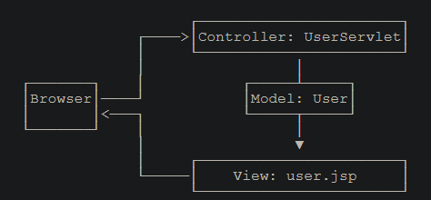
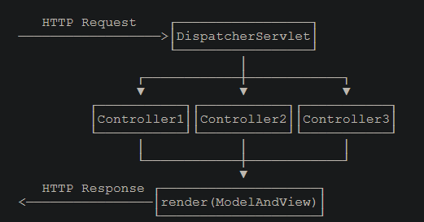
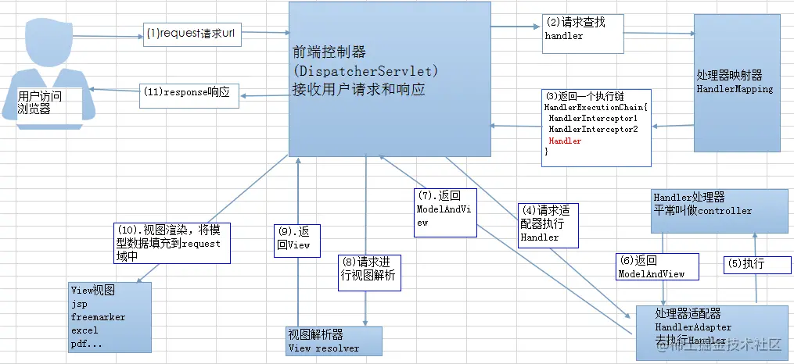

[toc]

# MVC

### 基础

0，注意事项：

* 打包为war：<packaging>war</packaging>

* JDK版本不能太高：File->ProjectSrtucture + File->Settings->Build Exception Deployment ->compiler->Java compiler + pom.xml

* tomat依赖级别为provide，run->debug-> config->Application->Main->build and run->modify options->include provide scope

    ```
    <dependency>
        <groupId>javax.servlet</groupId>
        <artifactId>javax.servlet-api</artifactId>
        <version>4.0.0</version>
        <scope>provided</scope> <!--表示编译时使用，但不会打包到.war文件中，因为运行期Web服务器本身已经提供了Servlet API相关的jar包。 -->
    </dependency>
    <dependency>
        <groupId>org.apache.tomcat.embed</groupId>
        <artifactId>tomcat-embed-core</artifactId>
        <version>9.0.26</version>
        <scope>provided</scope>
    </dependency>
    <dependency>
        <groupId>org.apache.tomcat.embed</groupId>
        <artifactId>tomcat-embed-jasper</artifactId>
        <version>9.0.26</version>
        <scope>provided</scope>
    </dependency>
    ```

* 把注解打包到Class文件，File->Settings->Build Exception Deployment ->compiler->Java compiler->Addition command line parameters添加：-parameters

    ```
      <build>
        <finalName>LearnJava</finalName>
        <plugins>
          <plugin>
            <groupId>org.apache.maven.plugins</groupId>
            <artifactId>maven-compiler-plugin</artifactId>
            <configuration>
              <compilerArgs>
                <arg>-parameters</arg>
              </compilerArgs>
            </configuration>
          </plugin>
        </plugins>
      </build>
    ```

* 模板必须放在`webapp/WEB-INF/templates`目录下，服务器会自动阻止用户直接访问WEB-INF下没有数据的模板，静态文件必须放在`webapp/static`目录下。

* 文件结构

    ```
    web-mvc
    ├── pom.xml
    └── src
        └── main
            ├── java
            │   └── com
            │       └── itranswarp
            │           └── learnjava
            │               ├── Main.java
            │               ├── bean
            │               │   ├── SignInBean.java
            │               │   └── User.java
            │               ├── filters
            │               │   └── MyFilter.java
            │               ├── Lisenter
            │               │   └── MyListener.java
            │               ├── controller
            │               │   ├── IndexController.java
            │               │   └── UserController.java
            │               └── framework
            │                   ├── DispatcherServlet.java
            │                   ├── FileServlet.java
            │                   ├── GetMapping.java
            │                   ├── ModelAndView.java
            │                   ├── PostMapping.java
            │                   └── ViewEngine.java
            └── webapp
                ├── WEB-INF
                │   ├── templates
                │   │   ├── _base.html
                │   │   ├── hello.html
                │   │   ├── index.html
                │   │   ├── profile.html
                │   │   └── signin.html
                │   └── web.xml
                └── static
                    ├── css
                    │   └── bootstrap.css
                    └── js
                        ├── bootstrap.js
                        └── jquery.js
    ```
    
    

1，Servlet提供的接口仍然偏底层，需要实现Servlet调用相关接口；JSP对页面开发不友好，更好的替代品是模板引擎；业务逻辑最好由纯粹的Java类实现，而不是强迫继承自Servlet。

2，MVC：

控制器：接受并处理请求，并把结果封装成模型传递给视图。视图：接收控制器传递的模型渲染传递HTML文件给用户。模型：控制器处理结果的封装，用于在控制器与视图间传递数据。



3，高级MVC：

* 定义注解用于修饰方法，指定方法类型：Get/Post，与负责处理的URL。
* 定义ModelAndView指明用于渲染的模板路径和用于渲染的数据Bean。

* 定义多个Controller，每个Controller处理一类请求，Controller中定义多个方法， 通过注解为每个方法绑定一个请求路径，并指明要处理的时Get还是Post请求，方法可以接受HttpServletRequest`、`HttpServletResponse`、`HttpSession，和其它类型作为方法参数，通过处理获得要显示的数据Bean，并指明显示Bean所需要的渲染模板，构建ModelAndView对象。Controller不需要实现特定接口，方法只需返回ModelAndView对象。
* 定义Dispatcher类，包含四个成员变量：Controller实例，Controller中的一个Method，方法中的参数名称，方法中的参数类型。定义方法run，接收HttpServletRequest , HttpServletResponse作为参数，方法内部通过遍历参数类型字段构建实参数列表，如果参数类型为HttpServletRequest 或者HttpServletResponse直接把传入run的参数加入实参列表，如果参数类型为HttpSession，则从HttpServletRequest 中获得session加入实参列表，如果是其它普通参数，则从HttpServletRequest 中通过参数名称获取，然后加入实参列表，最后通过反射调用Method字段的invoke方法并传入Controller实例字段和实参列表返回ModelAndView返回值。
* 定义DispatcherServlet继承自 HttpServlet，它总是映射到`/`，`/`表示根请求或者未知的请求，所以所有的请求都会经由DispatcherServlet处理。内部首先扫描所有的Controller，为其中的每个方法建立一个Dispatcher，并构建两个Map保存扫描结果，一个map对应所有的处理Get请求的方法，一个map对应所有的处理Post请求的方法，map中key为方法要处理的URL，value为方法对应的Dispatcher。然后override doPost和doGet方法，在 doPost和doGet方法中通过HttpServletRequest 获得URL并从Map中根据URL获得处理该请求的Dispatcher，然后调用Dispatcher的run方法并传入HttpServletRequest ，HttpServletResponse参数，获得ModelAndView对象，将ModelAndView对象传递给渲染引擎进行渲染。
* 定义MyFilter类，该类实现Filter接口，并指定过滤的URL，该类拦截指定URL，对ServletRequest 和ServletResponse处理后传递请求给 DispatcherServlet，用于后续处理。可以把很多公共预处理逻辑放到Filter中完成，如日志记录。
* 定义MyListener，该类实现 ServletContextListener接口，它会在整个Web应用程序启动时自动调用它的初始化方法初始化`ServletContext`，以及Web应用程序关闭后自动调用它的摧毁方法摧毁`ServletContext`。对于每个WebApp，Web服务器都会为其创建一个全局唯一的`ServletContext`实例，可用于设置和共享配置信息，如数据库连接。
* 定义FileServlet类继承自HttpServlet ，MVC中静态资源文件放入`/static/`目录，有些Web服务器会自动为加一个专门负责处理静态文件的Servlet，但如果`IndexServlet`映射路径为`/`，会屏蔽掉处理静态文件的Servlet映射。因此，需要自己编写一个处理静态文件的`FileServlet`。



##### MVC工作流程

* HTTP请求
* 被控制器`DispatcherServlet`捕获
* 根据根据请求的信息（方法类型，URL，请求头参数）找到处理器（`Handler`），最后以`HandlerExecutionChain` 对象的形式返回
* 提取`Request`中的模型数据，填充`Handler`入参，开始执行`Handler`（`Controller`)
* 返回一个`ModelAndView`给`DispatcherServlet`
* 逻辑视图名到真实视图对象的解析工作
* `View`对象对`ModelAndView`中的模型数据进行视图渲染
* HTML页面，将渲染结果返回给客户端。



### url->页面

* DNS 解析: 域名树(.->…->单台计算机)、递归查询的过程 ，本地域名服务器 -> 向根域名服务器（. ） -> com顶级域名服务器（.com. ）->google.com域名服务器（google.com.） ->… 找到后缓存到本地域名服务器。

  缓存机制：浏览器缓存，系统缓存，路由器缓存，IPS服务器缓存，域名服务器缓存。

  根域名服务器(.)收到请求后->返回这个(.com)顶级DNS服务器的IP->请求者（本地域名服务器）收到这台顶级DNS的服务器IP->向该服务器发起查询->.com服务器就会返回下一级的DNS服务器（google.com）的IP->请求者（本地域名服务器）继续查找，直到服务器找到(www.google.com)的主机。

  DNS负载均衡：又叫做DNS重定向，返回一个跟用户最接近的点的IP地址给用户。

* TCP 连接：三次握手：请求连接、同意连接、同意连接信号的确认。

* 发送 HTTP 请求：HTTPS：HTTP + SSL(or TLS)，非对称加密，对称加密。HTTP请求报文: 请求行（GET index.html HTTP/1.1）, 请求报头（附加信息）和请求正文（POST, PUT等方法需要客户端向服务器传递数据）。

* 服务器处理请求并返回 HTTP 报文：HTTP响应报文: 状态码, 响应报头和响应报文。缓存：Last-Modify(响应头) + If-Modified-Since（请求头），时间比对后若未修改返回304状态码，浏览器将从缓存中获取资源。反之返回200和资源内容。

* 浏览器解析渲染页面：WebKit渲染，边解析边渲染，下载资源（图片）。

* 连接结束：TCP释放连接四次握手、持久连接（keep-alive）
