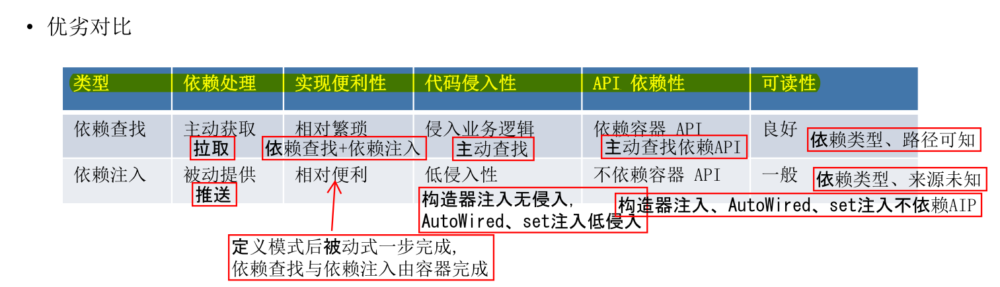
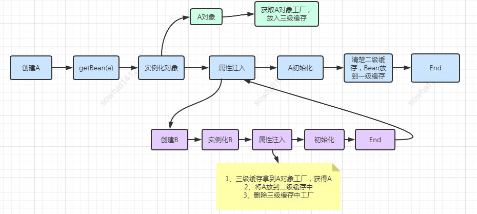
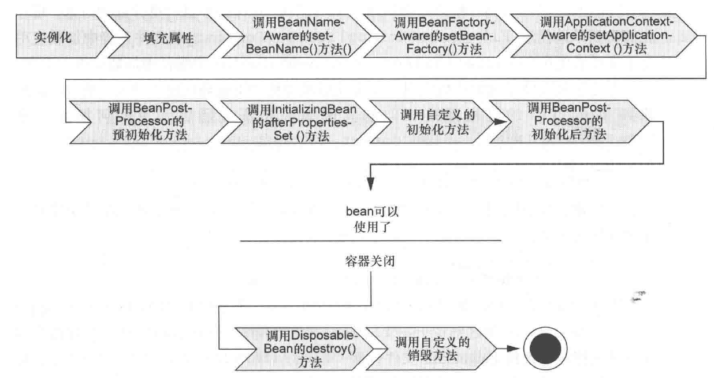
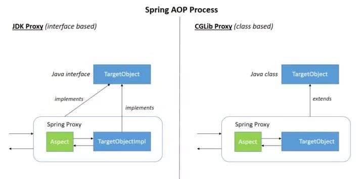
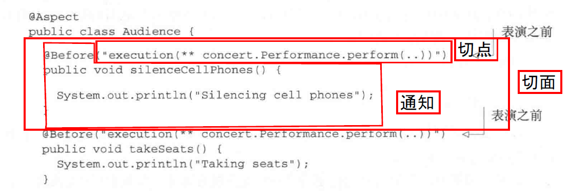

# Spring

[toc]

### IoC 容器

容器是一种为某种特定组件的运行提供必要支持的一个软件环境。例如，Tomcat就是一个Servlet容器，它可以为Servlet的运行提供运行环境。类似Docker这样的软件也是一个容器，它提供了必要的Linux环境以便运行一个特定的Linux进程。

使用容器运行组件，除了提供一个组件运行环境之外，容器还提供了许多底层服务。如Servlet容器底层实现了TCP连接，解析HTTP协议等非常复杂的服务，减轻开发人员工作量。

Spring的核心就是提供了一个IoC容器（Inversion of Control，直译为控制反转），它可以管理所有轻量级的JavaBean组件（并非严格意义上的JavaBean），提供的底层服务包括组件的生命周期管理、配置和组装服务、AOP支持，以及建立在AOP基础上的声明式事务服务等。

##### IOC

1，传统开发，每个组件通过字段持有另外一个组件，实例化一个字段组件通常需要读取配置等一系列操纵，开销巨大。相同类型的字段组件分布在各个组件，依赖关系复杂，统一管理困难，导致字段组件测试要在生产环境下进行。如果由组件自身来维护，不但大大增加了系统的复杂度，而且会导致组件之间极为紧密的耦合，继而给测试和维护带来了极大的困难。

2，在IoC模式下，控制权发生了反转，即从应用程序转移到了IoC容器，所有组件不再由应用程序自己创建和配置，而是由IoC容器负责，这样，应用程序只需要通过依赖注入直接使用已经创建好并且配置好的组件。

将组件的创建+配置与组件的使用相分离，并且，由IoC容器负责管理组件的生命周期。程序不必知道如何创建组件；组件可以在各个程序间共享；组件唯一，对组件的测试简单。不使用IoC，类的创建形成多对多依赖关系，各个组件要自行创建，耦合度高。IoC相当于一个中间层，IoC与类之间是一对多依赖，将多对多关系变为一对多关系，最基础组件由IoC管理，然后通过对基础组件的装配形成复杂的组件，减少系统整体耦合度。

##### 创建组件

Spring的IoC容器是一个高度可扩展的无侵入容器，指应用程序的组件无需实现Spring的特定接口，组件根本不知道自己在Spring的容器中运行。应用程序组件既可以在Spring的IoC容器中运行，也可以自己编写代码自行组装配置；测试的时候并不依赖Spring容器，可单独进行测试，大大提高了开发效率。

[Spring创建bean的三种方式 ](https://my.oschina.net/zhangxufeng/blog/838649)

1，方法一：通过XML方式。把所有组件统称为JavaBean，即配置一个组件就是配置一个Bean。依赖注入可以通过`set()`方法（必须要求该类中有一个该属性的set方法）、构造方法实现，入也可以注解实现。

使用xml进行显示的配置这种方式比较复杂，而且因为其使用的是字符串，这不是类型安全的。

```xml
// 设值注入：id为dataSource的组件通过bookService组件的属性dataSource（即调用bookService的setDataSource()方法）注入到bookService组件中。
<beans>
    <bean id="dataSource" class="HikariDataSource" />
    // id用来指定要声明的bean的名称,class属性则是用来指定要创建的类（包含包名）。如果要创建的对象的构造器中有参数，可以使用<bean>标签的子标签<constructor-arg>标签，其有两个属性ref和value，如果参数为其他的bean类型，那么就用ref指向其他的bean的id即可，如果参数为基本数据类型，那么就用value执行基本数据类型的值即可。
    <bean id="bookService" class="BookService">
        // 注入Bean
        <property name="dataSource" ref="dataSource" />
        // 注入boolean、int、String等数据类型，通过value注入
         <property name="autoCommit" value="true" />
        // 构造方法参数
        <constructor-arg ref="dataSource"/>
        <constructor-arg value="true" "/>
    </bean>
</beans>
// 等价于,Spring容器是通过读取XML文件后使用反射完成的。
HikariDataSource dataSource=new HikariDataSource();
BookService bookService=new BookService();
bookService.setDataSource(dataSource);
```

创建一个Spring的IoC容器实例，然后加载配置文件。

```java
// 创建并装配好配置文件中指定的所有Bean，
// ClassPathXmlApplicationContext自动从classpath中查找指定的XML配置文件
ApplicationContext context = new ClassPathXmlApplicationContext("application.xml");
// 从Spring容器中“取出”装配好的Bean然后使用它
UserService userService = context.getBean(UserService.class);
// BeanFactory的实现是按需创建，即第一次获取Bean时才创建这个Bean，而ApplicationContext会一次性创建所有的Bean。ApplicationContext还提供了一些额外的功能，包括国际化支持、事件和通知机制等。
BeanFactory factory = new XmlBeanFactory(new ClassPathResource("application.xml"));
UserService userService= factory.getBean(UserService.class);
```

2，方法二：通过注解

XML配置的优点是所有的Bean都能一目了然地列出来，并通过配置注入能直观地看到每个Bean的依赖。它的缺点是写起来非常繁琐，每增加一个组件，就必须把新的Bean配置到XML中。可以使用Annotation配置，不需要XML，让Spring自动扫描Bean并组装它们。

每个Bean被标注为`@Component`并正确使用`@Autowired`注入。

隐式的bean发现机制和自动装配则可以扫描大量的bean，但其不能将第三方库的bean收录到Spring容器中，因为第三方库的代码中不能添加Spring的注解。

```java
//用于修饰类，相当于定义了一个Bean，它有一个可选的名称，默认小写开头的类名，Spring就可以自动创建一个实例，并且将其放到Spring容器中进行管理
@Component 
// 用于依赖注入，修饰字段、SetXXX方法、构造方法。相当于把指定类型的Bean注入到指定的字段，一般把@Autowired写在字段上，通常使用package权限的字段，便于测试。Spring就会在bean容器中查找需要的实例，并将其注入进来。
@Autowired 
```

```JAVA
// 修饰字段
@Autowired
MailService mailService;
// 修饰构造方法
public UserService(@Autowired MailService mailService) {
    this.mailService = mailService;
}
// 修饰set方法
public setMailService(@Autowired MailService mailService) {
    this.mailService = mailService;
}
```

`AppConfig`类启动容器，配置类被标注为`@Configuration`和`@ComponentScan`；所有Bean均在AppConfig所在包以及子包内。通常来说，启动配置`AppConfig`位于自定义的顶层包，其他Bean按类别放入子包。

```java
@Configuration // 表示它是一个配置类，标注该接口是用于定义配置的
@ComponentScan // 用于指定扫描的bean的文件夹的，默认情况下自动搜索当前类所在的包以及子包，把所有标注为@Component的Bean自动创建出来，并根据@Autowired进行装配。
public class AppConfig {
    public static void main(String[] args) {
        // 必须传入一个标注了@Configuration的类名
        ApplicationContext context = new AnnotationConfigApplicationContext(AppConfig.class);
        UserService userService = context.getBean(UserService.class);

    }
}
```

3，方法三：显示的配置

创建bean则不需要进行组件扫描了，其是通过在配置类中通过方法显示的创建一个bean。实例的名称默认情况下是和方法名称是一样的。在@Bean标注的方法上如果有参数，那么Spring会自动在容器中查找是否有参数类型的bean，并将其注入进来；如果不使用参数的方式注入依赖的bean，可以使用调用方法的方式。

本方法需要对每个bean都进行显示声明，对于一些额外的类库中的类，无法在其中加入Spring的注解，但是却要将其加入到Spring容器中进行管理，那么就可以通过这种方式来显示的声明这些类的bean,并自动加入容器，要用到他的地方同样要使用`@Autowired`自动装配。。

只能创建少量的bean，但是其可以为第三方库的类创建bean。

```java
@Configuration // 表示它是一个配置类，标注该接口是用于定义配置的
public class CDPlayer {
   // 向IoC容器中天降一个Bean，值为方法的返回值。对标记为@Bean的方法只调用一次，因此返回的Bean仍然是单例。
  @Bean
  public CompactDisc sgtPeppers() {
    return new SgtPeppers();
  }
  // Spring的bean都是单例的相悖，为了避免出现两个sgtPeppers，Spring会拦截创建CDPlayer类型的bean时调用的sgtPeppers()方法，而直接从容器中获取该bean并将其返回。
  @Bean
  public CDPlayer cdPlayer() {
    return new CDPlayer(sgtPeppers());
  }
}
```

##### 定制bean

1，当把一个Bean标记为`@Component`后，它就会自动创建一个单例（Singleton），即容器初始化时创建Bean，容器关闭前销毁Bean。在容器运行期间，调用`getBean(Class)`获取到的Bean总是同一个实例。

声明一个Prototype的Bean时，需要再添加一个额外的`@Scope`注解，每次装配时调用`getBean(Class)`，容器都返回一个新的实例，这种Bean称为Prototype（原型），它的生命周期显然和Singleton不同。

慎用``@Scope(ConfigurableBeanFactory.SCOPE_PROTOTYPE)``

```java
@Component
@Scope(ConfigurableBeanFactory.SCOPE_PROTOTYPE) // @Scope("prototype")
public class MailSession {
    ...
}
```

2，注入List

Spring会自动把所有类型为`Validator`的Bean装配为一个`List`注入进来，这样一来，我们每新增一个`Validator`类型，就自动被Spring装配到`Validators`中了

```java
@Autowired
List<Validator> validators;
```

因为Spring是通过扫描classpath获取到所有的Bean，而`List`是有序的，要指定`List`中Bean的顺序，可以加上`@Order`注解,指出顺序1~N：

```java
@Component
@Order(1)
public class EmailValidator implements Validator {
    ...
}
```

3，可选注入

当标记了一个`@Autowired`后，Spring如果没有找到对应类型的Bean，它会抛出`NoSuchBeanDefinitionException`异常。可以给`@Autowired`增加一个`required = false`的参数：如果找到一个目标类型的Bean，就注入，如果找不到，就忽略,使用默认类型。非常适合有定义就使用定义，没有就使用默认值的情况。

```java
@Component
public class MailService {
    @Autowired(required = false)
    // 找到一个目标类型的Bean就注入，如果找不到就忽略,使用默认类型。
    ZoneId zoneId = ZoneId.systemDefault();
    ...
}
```

4，创建第三方Bean

如果一个Bean不在自己的package管理之内，可以在`@Configuration`类中编写一个Java方法创建并返回它，注意给方法标记一个`@Bean`注解。对标记为`@Bean`的方法只调用一次，因此返回的Bean仍然是单例。`@Bean`同样是创建一个实例放入容器，在使用的地方使用`@@Autowired()`注入。

```java
@Bean
ZoneId createZoneId() {
	return ZoneId.of("Z");
}
```

也可以使用工厂方法创建外部类的Bean详见7。

5，初始化销毁

一个Bean在注入必要的依赖后，需要进行初始化（监听消息等）。在容器关闭时，有时候还需要清理资源（关闭连接池等）。通常会定义一个`init()`方法进行初始化，定义一个`shutdown()`方法进行清理。

```xml
<dependency>
    <groupId>javax.annotation</groupId>
    <artifactId>javax.annotation-api</artifactId>
    <version>1.3.2</version>
</dependency>
```

在Bean的初始化和清理方法上标记`@PostConstruct`和`@PreDestroy`，Spring只根据Annotation查找*无参数*方法，对方法名不作要求。

```
@PostConstruct
public void init() {
	System.out.println("Init");
}

@PreDestroy
public void shutdown() {
	System.out.println("Shutdown");
}
```

初始化流程：

- 调用构造方法创建Bean实例；
- 根据`@Autowired`进行注入；
- 调用标记有`@PostConstruct`的`init()`方法进行初始化。
- 销毁时，容器会首先调用标记有`@PreDestroy`的`shutdown()`方法，（要手动调用applicationContext.close()不能直接点结束进程。)

6，别名

默认情况下，对一种类型的Bean，容器只创建一个实例。但有些时候，需要对一种类型的Bean创建多个实例。

如果存在多个相同类型实例，Spring实际上也不会报异常，因为创建多个同类型的bean如果不指定bean名，默认用方法名。当在config中显示通过bean name（默认方法名）获取bean``context.getBean("BeanName")``，时不会报错；当通过type获取bean时`context.getBean(SomeBean.class)`，会报bean不唯一的异常。在Bean中自动装配时默认使用Type匹配，会报异常。

需要给每个Bean添加不同的名字，可以用`@Bean("name")`指定别名，也可以用`@Bean`+`@Qualifier("name")`指定别名。

```
@Bean("alias")
ZoneId createZoneOfZ() {
    return ZoneId.of("Z");
}

@Bean
@Qualifier("name")
ZoneId createZoneOfZ() {
    return ZoneId.of("Z");
}
```

由于存在多个相同类型的Bean，注入时，要指定Bean的名称：

```A
@Autowired(required = false)
@Qualifier("alias") // 指定注入名称为"z"的ZoneId
ZoneId zoneId = ZoneId.systemDefault();
```

或者把其中某个Bean指定为`@Primary`,其中只能有一个指定为`@Primary`，其他必须用`@Quanlifier("beanName")`指定别名；

```java
@Bean
@Primary // 指定为主要Bean
@Qualifier("z")
ZoneId createZoneOfZ() {
	return ZoneId.of("Z");
}

@Bean
@Qualifier("utc8")
ZoneId createZoneOfUTC8() {
	return ZoneId.of("UTC+08:00");
}
```

在注入时，如果没有指出Bean的名字，Spring会注入标记有`@Primary`的Bean。

```
@Autowired(required = false)
// 找到多个目标类型的Bean就注入标记有`@Primary`的Bean，找到一个目标类型的Bean直接注入，找不到使用摩恩配型。
ZoneId zoneId = ZoneId.systemDefault();
```

7，使用FactoryBean

可以通过工厂模式创建对象。Spring也提供了工厂模式，允许定义一个工厂，然后由工厂创建真正的Bean。用工厂模式创建Bean需要实现`FactoryBean`接口,当一个Bean实现了`FactoryBean`接口后，Spring会先实例化这个工厂，然后调用`getObject()`创建真正的Bean。`getObjectType()`可以指定创建的Bean的类型，因为指定类型不一定与实际类型一致，可以是接口或抽象类。

```java
@Component
// 为了和普通Bean区分，我们通常都以XxxFactoryBean命名。
public class ZoneIdFactoryBean implements FactoryBean<ZoneId> {
	// Spring创建的Bean实际上是这个FactoryBean的getObject()方法返回的Bean。
    @Override
    public ZoneId getObject() throws Exception {
        return ZoneId.of("Z");
    }

    @Override
    public Class<?> getObjectType() {
        return ZoneId.class;
    }
}
```

##### 使用Resource

1，使用Spring容器时，可以把“文件”注入进来，方便程序读取,使用`@Value`注入。

通过classpath：即类似`@Value("classpath:/logo.txt")`表示在classpath中搜索文件，资源文件放入`src/main/resources`即可；

直接指定文件的路径：``@Value("file:/path/to/logo.txt")``;

然后直接调用`Resource.getInputStream()`就可以获取到输入流。

```java
@Component
public class AppService {
    @Value("1") //默认值
    private int version;
    @Value("classpath:/logo.txt")
    private Resource resource;
    private String logo;
    @PostConstruct
    public void init() throws IOException {
        try (var reader = new BufferedReader(
                new InputStreamReader(resource.getInputStream(), StandardCharsets.UTF_8))) {
            this.logo = reader.lines().collect(Collectors.joining("\n"));
        }
    }
}
```

2，`@PropertySource`来自动读取配置文件。只需要在`@Configuration`配置类上再添加一个注解,Spring自动读取这个配置文件，然后使用`@Value`以`${key:defaultValue}`的形式注入：

```java
@Configuration
@ComponentScan
@PropertySource("app.properties") // 表示读取classpath的app.properties
public class AppConfig {
    @Value("${app.zone:Z}")// 表示读取key为app.zone的value，但如果key不存在，就使用默认值Z。
    String zoneId;
    @Bean
    ZoneId createZoneId() {
        return ZoneId.of(zoneId);
    }
}
```

可以把注入的注解写到方法参数中

```java
@Bean
ZoneId createZoneId(@Value("${app.zone:Z}") String zoneId) {
    return ZoneId.of(zoneId);
}
```

3，使用一个独立的JavaBean持有所有属性，然后在其他Bean中以`#{bean.property}`注入的好处是，多个Bean都可以引用同一个Bean的某个属性，便于后续维护。同时config类中也要指定@PropertySource()

```java
// 通过一个简单的JavaBean持有所有的配置
@Component
public class SmtpConfig {
    @Value("${smtp.host}")
    private String host;

    @Value("${smtp.port:25}")
    private int port;

    public String getHost() {
        return host;
    }

    public int getPort() {
        return port;
    }
}
```

在需要读取的地方，使用`#{smtpConfig.host}`注入，`#{}`表示从JavaBean读取属性。`"#{smtpConfig.host}"`：从名称为`smtpConfig`的Bean读取`host`属性，即调用他的`getHost()`方法。一个Class名为`SmtpConfig`的Bean，它在Spring容器中的默认名称就是`smtpConfig`，除非用`@Qualifier`指定了名称。

```java
@Component
public class MailService {
    @Value("#{smtpConfig.host}")
    private String smtpHost;

    @Value("#{smtpConfig.port}")
    private int smtpPort;
}
```

4,Profile用来表示不同的环境,开发、测试和生产这3个环境：native，test，production。创建某个Bean时，Spring容器可以根据JVM的启动参数和注解`@Profile`来决定是否创建

```java
@Bean
@Profile("!test") //适用于test环境
ZoneId createZoneId() {
    return ZoneId.systemDefault();
}

@Bean
@Profile("test") //适用于非test环境
ZoneId createZoneIdForTest() {
    return ZoneId.of("America/New_York");
}
```

在运行程序时，加上JVM参数`-Dspring.profiles.active=test`就可以指定以`test`环境启动。

5，可以根据`@Conditional`决定是否创建某个Bean，

* 当条件为True才装配：

    ```java
    @Component
    @Conditional(OnSmtpEnvCondition.class)
    public class SmtpMailService implements MailService {
        ...
    }
    ```

    ```java
    // OnSmtpEnvCondition 实现Condition接口，返回true/false
    public class OnSmtpEnvCondition implements Condition {
        public boolean matches(ConditionContext context, AnnotatedTypeMetadata metadata) {
            // 具体判断逻辑还需要我们自己实现,这里是通过环境变量来控制
            return "true".equalsIgnoreCase(System.getenv("smtp"));
        }
    }
    ```

* 配置文件中存在期望的配置时才装配:

    ```java
    @Component
    // 如果配置文件中存在app.smtp=true，则创建MailService：
    @ConditionalOnProperty(name="app.smtp", havingValue="true")
    public class MailService {
        ...
    }
    ```

* 案列

    ```java
    @Component
    // 开发时文件本地存储
    @ConditionalOnProperty(name = "app.storage", havingValue = "file", matchIfMissing = true)
    public class FileUploader implements Uploader {
        ...
    }
    ```
    
    ```java
    
    @Component
    // 开发时文件云端存储
    @ConditionalOnProperty(name = "app.storage", havingValue = "s3")
    public class S3Uploader implements Uploader {
        ...
    }
    ```
    
    ```java
    // 需要存储的服务则注入`Uploader`，根据环境，自动选择合适Bean
    @Component
    public class UserImageService {
        @Autowired
        Uploader uploader;
    }
    ```
    
    当应用程序检测到配置文件存在`app.storage=s3`时，自动使用`S3Uploader`，如果存在配置`app.storage=file`，或者配置`app.storage`不存在，则使用`FileUploader`。

##### 依赖查找与依赖注入



##### 构造器注入与set注入

对强制依赖项使用构造函数，对可选依赖项使用 setter 方法或配置方法是一个很好的经验法则。请注意在 setter 方法上使用@Required注释可用于使属性成为必需的依赖项；但是，最好使用带有参数编程验证的构造函数注入。

 Spring 团队通常提倡构造函数注入，因为它可以让您将应用程序组件实现为不可变对象，并确保所需的依赖项不是null. 此外，构造函数注入的组件总是以完全初始化的状态返回给客户端调用代码。此外大量的构造函数参数意味着该类可能有太多的责任，应该重构以更好地解决适当的关注点分离问题。 Setter 注入应该主要仅用于可以在类中分配合理默认值的可选依赖项。否则，必须在代码使用依赖项的任何地方执行非空检查。setter 注入的一个好处是 setter 方法使该类的对象可以在以后重新配置或重新注入。因此，通过JMX MBean 进行管理是 setter 注入的一个引人注目的用例。

使用对特定类最有意义的 DI 样式。有时，在处理您没有源码的第三方类时，如果第三方类不公开任何 setter 方法，则构造函数注入可能是 DI 的唯一可用形式。

set注入：

- 优点：getXXX,setXXX方法名准确描述功能；JavaBean属性可被继承，get/set的存在让属性可读可写，灵活多变；set注入可以提供默认值，如果找不到注入对象就使用默认值，构造器注入需要注入对象非空，默认值必然被覆盖。
- 缺点：多个set方法调用顺序不定，而构造器注入参数顺序一定；对象被调用前无法保证set方法被调用，状态不一定。

构造器注入：

- 优点：保证被调用前被完全配置，状态一定；相较于set代码量更少（build模式下无明显差异）
- 缺点：构造器参数名无法在调用构造器时获取，相较于set注入自文档性更差（swagger可生成构造器解释）；长构造器参数列表或复杂构造方法显得笨重。

##### 解决循环依赖

构造函数注入不允许您在 bean 之间创建循环依赖关系，直接抛出异，常这个限制实际上是构造函数注入的一个优点。非单例循环依赖：无法处理。单例模式下使用 setter 注入时，Spring 可以通过“三级缓存”解决循环依赖。

https://cloud.tencent.com/developer/article/1749830



一个完整的对象包含三部分：当前对象实例化（构造器）、对象属性的实例化（set方法）以及初始化（xml中的 init方法）。在Spring中，对象的实例化是通过反射实现的，而对象的属性实例化则是在对象实例化之后通过一定的方式设置的。

Spring通过三级缓存解决了循环依赖，其中一级缓存为单例池（singletonObjects）缓存完成对象、属性实例化以及初始化的完成品对象，二级缓存为早期曝光对象earlySingletonObjects，完成了对象实例化，未完成属性实例化以及初始化，三级缓存为早期曝光对象工厂（singletonFactories），该工厂用于创建早期曝光对象。

当A、B两个类发生循环引用时，在A完成对象实例化后，就使用实例化后的对象去创建一个对象工厂，添加到三级缓存中，如果A被AOP代理，那么通过这个工厂获取到的就是A代理后的对象，如果A没有被AOP代理，那么这个工厂获取到的就是A实例化的对象。当A进行属性注入时，此时就尝试去get(B)，发现B还没有被create，所以走create流程，同时B又依赖了A，所以完成B对象的实例化后又会去调用getBean(a)来获取需要的依赖，此时的getBean(a)会从缓存中获取：第一步：先获取到三级缓存中的工厂；第二步：调用对象工厂的getObject方法来获取到对应的早期曝光对象，得到这个对象后将其注入到B中。紧接着B会走完它的生命周期流程，包括初始化、后置处理器等，放入到一级缓存。第三步：当B创建完后，会将B再注入到A中，此时A再完成它的整个生命周期。至此，循环依赖结束。

##### 依赖注入

* 依赖注入和面向接口->松耦合；不强迫实现spring的接口继承spring的类（无侵入）、通过组件扫描（发现应用上下文定义的bean）和自动装配(自动满足依赖关系)来使用自定义的POJO;
* 耦合代码难以测试和复用（四处分布），在对象关系比较复杂时，依赖关系难以维护；依赖注入：将原本在程序中手动创建对象的控制权，交由 Spring 框架来管理（并且管理这些对象的整个生命周期。将对象之间的相互依赖关系交给 IOC 容器来管理，并由 IOC 容器完成对象的注入，松耦合、声明依赖即可，使用者不用创建和管理依赖，组件之间依赖关系由容器在运行期决定，专注本身业务功能，大大增加了项目的可维护性且降低了开发难度、接口（多态、不用知道到底由谁提供服务，通过面向接口编程的方式来是实现对业务组件的动态依赖）。
* 容器：创建、装配、生命周期管理；使用DI管理组件间关连、简洁、重用、易于测试。类别：BeanFactory（是 Spring 里面最底层的接口，包含了各种 Bean 的定义，读取 bean 配置文档，管理 bean 的加载、实例化，控制 bean 的生命周期，维护 bean 之间的依赖关系。简单，提供完整的IoC服务支持、延迟初始化（不能发现一些存在的 Spring 的配置问题）、资源有限，并且功能要求不是很严格）+ApplicationContex（ClassPathXmlApplicationContext、FileSystemXmlApplicationContext，BeanFactory的基础上、框架级、启动之后全部初始化（在容器启动时，我们就可以发现 Spring 中存在的配置错误），资源充足，并且要求更多功能，国际化、从xml、配置类加载配置、getBean(name，Class)）
* 依赖注入的基本原则：应用组件不应该负责查找资源或者其他依赖的协作对象。配置对象的工作应该由 IoC 容器负责，“查找资源” 的逻辑应该从应用组件的代码中抽取出来，交给 IoC 容器负责。容器全权负责组件的装配，它会把符合依赖关系的对象通过属性（JavaBean 中的 setter）或者是构造器传递给需要的对象。
* 优势：让容器全权负责依赖查询，受管组件只需要暴露 JavaBean 的 setter 方法或者带参数的构造器或者接口，使容器可以在初始化时组装对象的依赖关系：查找定位操作与应用代码完全无关；不依赖于容器的 API，可以很容易地在任何容器以外使用应用对象；不需要特殊的接口，绝大多数对象可以做到完全不必依赖容器。
* @Autowired 和 @Resource 之间的区别：Autowired 默认是按照类型装配注入的，默认情况下它要求依赖对象必须存在（可以设置它 required 属性为 false）。@Resource 默认是按照名称来装配注入的，只有当找不到与名称匹配的 bean 才会按照类型来装配注入。

##### 生命周期

1，Bean 容器找到配置文件中Spring Bean的定义，创建一个 Bean 的实例。

2，如果涉及到一些属性值 利用 set()方法设置一些属性值。

3，Aware 接口声明了依赖关系，注入Bean对容器基础设施层面的依赖，来感知到自身的一些属性。如果Bean实现了BeanNameAware接口，调用setBeanName()方法，传入Bean的名字。同样如果 Bean 实现了 BeanFactoryAware 接口，传入 BeanFactory对象的实例。实现了ApplicationContexAware接口，传入ApplicationContex对象的实例。

4，如果有实现了BeanPostProcessor接口的对象对该bean进行进行拦截，执行postProcessBeforeInitialization() 方法，完成 initial 前的自定义逻辑。

5，如果存在该Bean种存在@PostConstru注解的方法，则执行该方法。

6，如果Bean实现了InitializingBean接口，执行afterPropertiesSet()方法，完成一些属性被设定后的自定义的事情。

7，如果Bean在xml配置文件中的定义包含init-method属性或者，执行指定的方法，做一些初始化相关的工作。

8，如果有实现了BeanPostProcessor接口的对象对该bean进行进行拦截，执行postProcessAfterInitialization() 方法，做一些 bean 初始化之后的自定义工作。

9，要销毁 Bean 的时候，如果存在该Bean种存在@PreDestroy注解的方法，则执行该方法。

10，如果 Bean 实现了 DisposableBean 接口，执行 destroy() 自定义的销毁方法。

11，如果 Bean 在配置文件中的定义包含 destroy-method 属性，执行指定的方法。

容器上下文被摧毁开始bean的回收。干预节点：@PostConstruct注解、@PreDestroy注解，xml配置（init-method 和 destroy-method），用它们你可以自己定制初始化和注销方法。



##### BeanPostProcessor

spring会自动从它的所有的bean定义中检测BeanPostProcessor类型的bean定义，然后实例化它们，再将它们应用于随后创建的每一个bean实例，在bean实例的初始化方法回调之前调用BeanPostProcessor的postProcessBeforeInitialization的方法（进行bean实例属性的填充），在bean实例的初始化方法回调之后调用BeanPostProcessor的postProcessAfterInitialization的方法（可以进行bean实例的代理封装）

https://www.cnblogs.com/lifullmoon/p/14677287.html

```java
@Override
public Object postProcessBeforeInitialization(Object bean, String beanName) throws BeansException {
    if(bean instanceof SomeBean){
        try {
            Field valueField=bean.getClass().getDeclaredField("value");
            valueField.set(bean,"new value");
        } catch (NoSuchFieldException e) {
            e.printStackTrace();
        } catch (IllegalAccessException e) {
            e.printStackTrace();
        }
    }
    return bean;
}
```

```java
@Override
public Object postProcessAfterInitialization(@Nullable Object bean, String beanName) {
    // <1> 如果 bean 不为空则进行接下来的处理
    if (bean != null) {
        // <1.1> 获取这个 Bean 的缓存 Key，默认为 Bean 的名称，没有则取其对应的 Class 对象
        Object cacheKey = getCacheKey(bean.getClass(), beanName);
        /*
         * <1.2> 移除 `earlyProxyReferences` 集合中保存的当前 Bean 对象（如果有的话）
         * 如果 earlyProxyReferences 集合中没有当前 Bean 对象，表示在前面没有创建代理对象
         */
        if (this.earlyProxyReferences.remove(cacheKey) != bean) {
            // 这里尝试为这个 Bean 创建一个代理对象（如果有必要的话）
            // 获取bean对应的Advisor,如果有 Advisor，则利用JDK 动态代理或者 CGLIB 动态代理创建并返回代理对象
            return wrapIfNecessary(bean, beanName, cacheKey);
        }
    }
    // <2> 直接返回 bean 对象
    return bean;
}
```

##### 装配bean的方式

隐式自动化装配：隐式操作降低维护成本；组件扫描发现上下文中的bean（@component+@ComponentScan）;自动装配满足bean之间依赖（@Autowired()修饰构造方法、字段、普通方法，自动运行修饰的方法从容器中查找bean）； 

配置类显示装配：不包含业务逻辑、@Cinfiguration包含创建Bean的细节；方法添加@Bean注解（一次调用、单列，参数为待注入的依赖，返回注入依赖的对象，适用于第三方库）；

XML装配显示装配：构造器注入bean；属性设置；格式复杂且纯字符操作ide的类型检查困难，以后项目结构变化还要手动更新配置。可以和javaconfig合作共同实现装配。

* 环境装配：根据环境决定创建哪个bean；@profile指明该bean在何种条件下被激活（和@Configration和@Bean共同使用）；环境由profile.active和profile.default指定，可激活多个环境。
* 条件装配：条件计算为True才装配；@Condition()参数为实现condition的接口实现类；
* 歧义装配：一个接口多个实现类；指定@Pimary、限定符限定bean、自定义注解（在创建注解时指明他是一个限定注解，在创建Bean时添加上自定义的注解，表明该bean拥有某种属性，装配时添加自定义的注解，表明装配进来的bean要满足某种属性，多个限定自定义注解合作，相较于string的限定符更安全）。
* 运行时注入：@propertySource指定配置文件中的一块区域，其配置项与类字段对应。@value指定常量、配置文件项、bean属性为注入的值。

##### 同名bean

* 同一个配置文件内同名的 Bean，以最上面定义的为准。

* 不同配置文件中存在同名 Bean，后解析的配置文件会覆盖先解析的配置文件。

* 同文件中 ComponentScan 和 @Bean 出现同名 Bean。同文件下 @Bean 的会生效，@ComponentScan 扫描进来不会生效。通过 @ComponentScan 扫描进来的优先级是最低的，原因就是它扫描进来的 Bean 定义是最先被注册的。

##### bean作用域

* 单例：一个bean
* 原型：每次注入都创建新的bean
* 会话：每个会话一个bean,购物车；单例bean依赖会话bean：创建代理类（接口：动态代理，类：cglib）注入到单例类，代理类暴露和会话bean 相同方法，具体调用时间委托给会话作用域内具体的会话bean实现。
* 请求：一个请求一个bean，原题同会话bean
* 全局会话：在一个全局的 HTTP Session 中，一个 bean 定义对应一个实例。该作用域仅在基于 web 的 Spring ApplicationContext 情形下有效。 

##### Bean的线程安全策略

如果单例的Bean是一个无状态（不保存数据，是不变类），只有读操作，而无写操作的Bean，那么这个单例的Bean是线程安全的。若有多个线程同时执行写操作，一般都需要考虑线程同步，否则就可能影响线程安全。如果单例的Bean是一个有状态的Bean，则可以在 Bean 对象中尽量避免定义可变的成员变量（不太现实），在类中定义一个 ThreadLocal 成员变量，将需要的可变成员变量保存在 ThreadLocal 中（推荐的一种方式）。

##### 应用上下文

https://www.cnblogs.com/lifullmoon/p/14453083.html

运行环境，保证应用的正常运行，具体就是管理应用所依赖的bean，并在需要该bean的地方注入依赖，容器是Spring框架实现功能的核心，容器不只是帮我们创建了对象那么简单，它负责了对象整个的生命周期的管理——创建、装配、销毁。应用上下文即是Spring容器的一种抽象化表述，是一维护Bean定义以及对象之间协作关第的高级接口。将需要管理的对象（Spring中我们都称之问bean）、bean之间的协作关系配置好，然后利用应用上下文对象加载进我们的Spring容器，容器就能为你的程序提供你想要的对象管理服务。

DefaultListableBeanFactory：这就是大家常说的 ioc 容器，它里面有很多 map、list。spring 帮我们创建的 singleton 类型的 bean 就存放在其中一个 map 中。扩展点集合：存放 spring 扩展点（BeanPostProcessor）接口的 list 集合。 启动其实就是调用refresh 完成 spring context 的初始化和启动过程：创建 BeanFactory、注册 BeanPostProcessor 等。

### AOP

##### 基础

1,OOP的主要功能是数据封装、继承和多态。OOP把系统看作多个对象的交互，AOP把系统分解为不同的关注点，或者称之为切面。常用功能分离形成可重用组件（日志），减少系统的重复代码，降低模块间的耦合度，集中管理维护方便，声明式（切面构成、将功能应用到要影响的组件中，无需修改受影响的类）编程较少模板代码，解耦，有利于未来的可拓展性和可维护性；核心代码更关注业务逻辑（高内聚、简单），无感知；

把权限检查等附加功能视作一种切面（Aspect），然后以某种自动化的方式，把切面织入到核心逻辑中，实现Proxy模式。避免在每个核心代码都插入功能代码。它本质就是一个动态代理，让我们把一些常用附加功能，从每个业务方法中剥离出来。

通知（什么+时机）：定义切面功能与出发时机；（bofore,after,around等）。连接点：程序中能够插入切面的点（方法调用、抛出异常），通过切入点添加新功能。切点（何处）：表达式匹配要织入的连接点。切面（是什么+何时+何处）=通知+切点。织入：把切面应用到目标对象并创建代理对象的过程，运行期：创建动态代理、springAOP。

静态代理（在编译阶段就可生成 AOP 代理类，AspectJ），动态代理（spring AOP:运行时借助于JDK动态代理、CGLIB等在内存中“临时”生成AOP动态代理类,final修饰的类不能被代理，同样static和final修饰的方法也不会代理，因为static和final方法是不能被覆盖的）



对于AOP的织入，有3种方式：

* 编译期：在编译时，由编译器把切面调用编译进字节码，这种方式需要定义新的关键字并扩展编译器。
* 类加载器：在目标类被装载到JVM时，通过一个特殊的类加载器，对目标类的字节码重新“增强”；
* 运行期：目标对象和切面都是普通Java类，通过JVM的动态代理功能或者第三方库实现运行期动态织入。

使用AOP时必须适合特定的场景：AOP对于解决某些模式固定的问题很有用，例如事务管理，因为分散在各处的事务代码几乎是完全相同的，并且它们需要的参数（JDBC的Connection）也是固定的。而另一些与上下文交互性强的问题的不宜用AOP，如打印日志的时候，经常需要捕获局部变量，如果使用AOP实现日志，只能输出固定格式的日志。

2，依赖

```xml
<dependency>
    <groupId>org.springframework</groupId>
    <artifactId>spring-aspects</artifactId>
    <version>${spring.version}</version>
</dependency>
```

##### spring注解AOP

基于jdk动态代理，拦截接口方法，创建接口的代理实例，只支持方法连接点只能拦截方法；代理类包裹目标类，拦截方法调用，执行切面逻辑，转发给真正的bean。核心InvocationHandler接口和Proxy类，InvocationHandler 通过invoke()方法反射来调用目标类中的代码，动态地将横切逻辑和业务编织在一起；接着，Proxy利用 InvocationHandler动态创建一个符合某一接口的的实例, 生成目标类的代理对象。

cglib代理：目标对象不是接口，字节码生成代理类继承目标类，并覆盖其中特定方法并添加增强代码，所以final修饰的类不能被代理，同样static和final修饰的方法也不会代理。CGLib创建的代理对象性能比JDK动态代理创建的代理对象高很多，但花费的时间多，spectJ需要特定的编译器进行处理，而Spring AOP则无需特定的编译器处理，cglib适合单例的对象代理创建，jdk动态代理合多例的对象代理创建。

只能对IoC容器中的Bean进行增强。

* 切点：切点的定义会匹配通知所要织入的一个或多个连接点，描述要连接的连接点进行匹配，这个点可以是调用方法时、抛出异常时、甚至修改一个字段时。切面代码可以利用这些点插入到应用的正常流程之中，并添加新的行为。spring AOP只能方法拦截(execution)。多条件与或非复杂逻辑，被影响的类无感知。

  

  

* 通过在代理类中包裹切面，Spring在运行期把切面织入到Spring管理的bean中。代理封装了目标类，并拦截被通知方法的调用，再把调用转发给真正的目标bean。当代理拦截到方法调用时，在调用目标bean方法之前，会执行切面逻辑。

  直到应用需要被代理的bean时，Spring才创建代理对象。如果使用的是ApplicationContext的话，在ApplicationContext从BeanFactory中加载所有bean的时候，Spring才会创建被代理的对象。因为Spring运行时才创建代理对象，所以我们不需要特殊的编译器来织入SpringAOP的切面。

* 新建功能：通过AOP为bean添加新方法；代理类不仅暴漏被包装bean的方法还暴漏新加入接口，一个bean的实现拆分到多个bean中；添加新功能同时不对原bean造成修改、无侵入性；对代理对对象的方法调用会转接给原始bean或者新加入的接口的实现类。@DeclareParents(value,defaultImple)中指明哪种bean要引进该接口以及该接口的实现类。

* Spring AOP 属于运行时增强，动态代理，而 AspectJ 是编译时增强，静态代理。 Spring AOP 基于代理 (Proxying)，而 AspectJ 基于字节码操作 (Bytecode Manipulation)。AspectJ 最完整的 AOP 框架了，可以实现方法、等段等拦截，spring AOP功能受限，但是 Spring AOP 相对来说更简单，如果我们的切面比较少，那么两者性能差异不大。但是，当切面太多的话，最好选择 AspectJ ，它比 Spring AOP 快很多。

#####  JDK动态代理

可以在运行期动态创建某个`interface`的实例。直接通过JDK提供的一个`Proxy.newProxyInstance()`创建了一个接口对象。1，定义一个InvocationHandler实例，它负责实现接口的方法调用；2，通过Proxy.newProxyInstance()创建interface实例，它需要3个参数：使用的ClassLoader，通常就是接口类的ClassLoader；需要实现的接口数组，至少需要传入一个接口进去；用来处理接口方法调用的InvocationHandler 实例。3，将返回的Object强制转型为接口。

```java
public class DynamicProxy {
    public static void main(String[] args) {
        // 普通学生类
        Student ordinaryStudents = new OrdinaryStudents();
        ordinaryStudents.write();

        /**
         *  InvocationHandler作用就是，当代理对象的原本方法被调用的时候，会重定向到一个方法，
         *  这个方法就是InvocationHandler里面定义的内容，同时会替代原本方法的结果返回。
         *  InvocationHandler接收三个参数：proxy，代理后的实例对象。 method，对象被调用方法。args，调用时的参数。
         */
        InvocationHandler handler = (proxy, method, handlerArgs) -> {
            // 从定义write方法。
            if ("write".equals(method.getName())) {
                System.out.println("增强型学生write()执行前");
                method.invoke(ordinaryStudents, handlerArgs);
                System.out.println("增强型学生write()执行后");
                return null;
            }
            return null;
        };
        /**
         *  对这个实例对象代理生成一个代理对象。
         *  被代理后生成的对象，是通过People接口的字节码增强方式创建的类而构造出来的。它是一个临时构造的实现类的对象。
         *  loader和interfaces基本就是决定了这个类到底是个怎么样的类。InvocationHandler决定了这个代理类到底是多了什么功能.
         *  通过这些接口和类加载器，拿到这个代理类class。然后通过反射的技术复制拿到代理类的构造函数，
         *  最后通过这个构造函数new个一对象出来，同时用InvocationHandler绑定这个对象。
         *  最终实现可以在运行的时候才切入改变类的方法，而不需要预先定义它。
         */
        Student sonOfDistrict = (Student) Proxy.newProxyInstance(ordinaryStudents.getClass().getClassLoader(), ordinaryStudents.getClass().getInterfaces(), handler);
        sonOfDistrict.write();
    }
}
/**
 * 学生接口
 */
interface Student {
    void write();
}
/**
 * 普通学生
 */
class OrdinaryStudents implements Student {
    @Override
    public void write() {
        System.out.println("我在写作文!");
    }
}
```

#####   CGLIB

SpringBoot 2.x 开始，为了解决使用 JDK 动态代理可能导致的类型转化异常而默认使用 CGLIB。如果需要默认使用 JDK 动态代理可以通过配置项 spring.aop.proxy-target-class=false来进行修改。

```java
public class Dao {
    
    public void update() {
        System.out.println("PeopleDao.update()");
    }
}

public class DaoProxy implements MethodInterceptor {
    @Override
    public Object intercept(Object object, Method method, Object[] objects, MethodProxy proxy) throws Throwable {
        //Object表示要进行增强的对象
        //Method表示拦截的方法
        //Object[]数组表示参数列表，基本数据类型需要传入其包装类型，如int-->Integer、long-Long、double-->Double
        //MethodProxy表示对方法的代理，invokeSuper方法表示对被代理对象方法的调用
        System.out.println("Before Method Invoke");
        proxy.invokeSuper(object, objects);
        System.out.println("After Method Invoke");
        
        return object;
    }
}

public class CglibTest {

    public void testCglib() {

        DaoProxy daoProxy = new DaoProxy();
        Enhancer enhancer = new Enhancer();
        // setSuperclass表示设置要代理的类
        enhancer.setSuperclass(Dao.class);
        // setCallback表示设置回调即MethodInterceptor的实现类
        enhancer.setCallback(daoProxy);
        // 使用create()方法生成一个代理对象
        Dao dao = (Dao)enhancer.create();
        dao.update();
        dao.select();
    }
    
}
```

##### 注解

1，拦截器有以下类型：

- @Before：这种拦截器先执行拦截代码，再执行目标代码。如果拦截器抛异常，那么目标代码就不执行了；
- @After：这种拦截器先执行目标代码，再执行拦截器代码。无论目标代码是否抛异常，拦截器代码都会执行；
- @AfterReturning：和@After不同的是，只有当目标代码正常返回时，才执行拦截器代码；
- @AfterThrowing：和@After不同的是，只有当目标代码抛出了异常时，才执行拦截器代码；
- @Around：能完全控制目标代码是否执行，并可以在执行前后、抛异常后执行任意拦截代码，可以说是包含了上面所有功能。

`@Aspect`注解：表示它的`@Before`和`@Around`等标注的方法需要注入到特定的Bean中。

`@Configuration`类加上一个`@EnableAspectJAutoProxy`注解：Spring自动查找带有`@Aspect`的Bean，然后根据每个方法的`@Before`、`@Around`等注解把AOP注入到特定的Bean中。

```java
@Aspect
@Component
public class LoggingAspect {
    // 在执行UserService的每个public方法前执行:
    @Before("execution(public * org.huangqiang.service.UserService.*(..))")
    public void doAccessCheck() {
        System.err.println("[Before] do access check...");
    }

    // 在执行MailService的每个public方法前后执行:
    @Around("execution(public * org.huangqiang.service.MailService.*(..))")
    public Object doLogging(ProceedingJoinPoint pjp) throws Throwable {
        // 方法真正执行前
        System.err.println("[Around] start " + pjp.getSignature());
        // 真正执行目标方法
        Object retVal = pjp.proceed();
        // 方法真正执行后
        System.err.println("[Around] done " + pjp.getSignature());
        return retVal;
    }
}
```

2，具体的底层实现是：创建一个类B实现额外功能，创建子类C继承自目标类A，C持有一个目标类A的字段和一个类B的字段，C重写父类被代理的方法，方法中先执行B的功能代码，再返回A的真正执行方法。

Spring容器启动时为我们自动创建的注入了Aspect的子类，它取代了原始的`UserService`（原始的`UserService`实例作为内部变量隐藏在`UserServiceAopProxy`中）。实际上是Spring使用CGLIB动态创建的子类，但对于调用方来说，感觉不到任何区别，``userService.getClass().getName()``获取到的将是动态生成的子类。

3，Spring对接口类型使用JDK动态代理，对普通类使用CGLIB创建子类。如果一个Bean的class是final，Spring将无法为其创建子类。

```java
public UserServiceAopProxy extends UserService {
    private UserService target;
    private LoggingAspect aspect;

    public UserServiceAopProxy(UserService target, LoggingAspect aspect) {
        this.target = target;
        this.aspect = aspect;
    }

    public User login(String email, String password) {
        // 先执行Aspect的代码:
        aspect.doAccessCheck();
        // 再执行UserService的逻辑:
        return target.login(email, password);
    }

    public User register(String email, String password, String name) {
        aspect.doAccessCheck();
        return target.register(email, password, name);
    }

    ...
}
```

Java中没有装饰器的概念，注解跟装饰器有点像。注解其实就是一个标记而已，需要自己去解释它的含义，而且这个解释也需要自己主动调用去才会执行。注解的这种定义可以使其实现很多功能。Python中的装饰器，也可以认为是注解，但使用范围比注解小，而且它是一个可调用对象，Python会自动执行它。

4,范围

`("execution(public * org.huangqiang.service.*.*(..))")`: 代理整个包下类的public方法

`("execution(public * update*(..))")`: 代理所有以update开头的public方法。

如果自动装配时，因为不恰当的范围，容易导致意想不到的结果，即很多不需要AOP代理的Bean也被自动代理了，并且后续新增的Bean，如果不清楚现有的AOP装配规则，容易被强迫装配,使用AOP时，被装配的Bean最好自己能清清楚楚地知道自己被代理。

更好的方式是给将要代理的方法使用某一类注解，Spring只给某一类打上注解的方法代理。

```java
// 定义注解
@Target(METHOD)
@Retention(RUNTIME)
public @interface MetricTime {
    String value();
}
```

```java
@Component
public class UserService {
    // 给将要代理的方法打上注解
    @MetricTime("register")
    public User register(String email, String password, String name) {
        ...
    }
    ...
}
```

```java
@Aspect
@Component
public class MetricAspect {
    // 符合条件的目标方法是带有@MetricTime注解的方法,注解名称要和metric方法里面的注解变量名称一致。
    @Around("@annotation(metricTime)")
    public Object metric(ProceedingJoinPoint joinPoint, MetricTime metricTime) throws Throwable {
        String name = metricTime.value();
        long start = System.currentTimeMillis();
        try {
            return joinPoint.proceed();
        } finally {
            long t = System.currentTimeMillis() - start;
            // 写入日志或发送至JMX:
            System.err.println("[Metrics] " + name + ": " + t + "ms");
        }
    }
}
```

##### 局限

1，Spring使用CGLIB生成Proxy的原理：第一步，正常创建一个`UserService`的原始实例，这是通过反射调用构造方法实现的；第二步，通过CGLIB创建一个`UserService`的子类，并引用了原始实例和`LoggingAspect`：

```java
@Component
public class UserService {
    // 成员变量:
    public final ZoneId zoneId = ZoneId.systemDefault();

    // 构造方法:
    public UserService() {
        System.out.println("UserService(): zoneId = " + this.zoneId);
    }

    // public方法:
    public ZoneId getZoneId() {
        return zoneId;
    }

    // public final方法:
    public final ZoneId getFinalZoneId() {
        return zoneId;
    }
}
```

```java
// 代理类会覆写所有public和protected方法，并在内部将调用委托给原始的UserService实例。
public UserService$$EnhancerBySpringCGLIB extends UserService {
    UserService target;
    LoggingAspect aspect;

    public UserService$$EnhancerBySpringCGLIB() {
        // Spring使用CGLIB构造的Proxy类，是直接生成字节码，不会自动加入super()。
    }

    public ZoneId getZoneId() {
        aspect.doAccessCheck();
        return target.getZoneId();
    }
}
```

这里出现了两个`UserService`实例：一个是代码中定义的*原始实例*，他被spring自动创建，它的成员变量已经按照我们预期的方式被初始化完成；第二个`UserService`实例实际上类型是`UserService$$EnhancerBySpringCGLIB`，它的一个字段引用了原始的`UserService`实例。

2，从`ApplicationContext`中获取的`UserService`实例是proxy，注入到需要他的地方`@Autowired`的`UserService`实例也是proxy。并且proxy的成员变量全为null:`ZoneId zoneId = userService.zoneId;=>null`。

原因在于，`UserService`成员变量的初始化：`public final ZoneId zoneId = ZoneId.systemDefault();`在`UserService$$EnhancerBySpringCGLIB`中，并未执行,原因是没必要初始化proxy的成员变量，因为proxy的目的是代理方法。实际上，成员变量的初始化是在构造方法中完成的:

```java
public class UserService {
    public final ZoneId zoneId;
    public UserService() {
        super(); // 构造方法的第一行代码总是调用super()
        zoneId = ZoneId.systemDefault(); // 继续初始化成员变量
    }
}
```

`UserService$$EnhancerBySpringCGLIB`代理类，它的构造方法中，并未调用`super()`，因此，从父类继承的成员变量，包括`final`类型的成员变量，统统都没有初始化。原因：因为自动加`super()`的功能是Java编译器实现的。但实际上，如果直接构造字节码，一个类的构造方法中，不一定非要调用`super()`。Spring使用CGLIB构造的Proxy类，是直接生成字节码，并没有源码-编译-字节码这个步骤。

3，Spring通过CGLIB创建的代理类，不会初始化代理类自身继承的任何成员变量，包括final类型的成员变量！需要把直接访问字段的代码，改为通过方法访问:` ZoneId zoneId = userService.getZoneId();` 因为代理类会覆写`getZoneId()`方法，并将其委托给原始实例:

```java
@Override
public ZoneId getZoneId() {
    // 此时不是使用代理类从父类继承而来的未被初始化的字段，而是使用已经初始化完成的对象的字段。
    return target.getZoneId();
}
```

如果被代理的`UserService`有一个`final`方法`getFinalZoneId()`，由于final方法无法被子类覆写，这会导致其他Bean如果调用此方法，无法将其代理到真正的原始实例，从而可能发生NPE异常。

访问被注入的Bean时，总是调用方法获取字段而非直接访问字段，防止访问到未被初始化的字段；编写Bean时，如果可能会被代理，就不要编写`public final`方法，final方法无法覆写，无法将其代理到真正的原始实例。

4，

```java
UserService us = new UserService(); // 这是你的UserService
UserService proxy = new UserService$$EnhancerBySpringCGLIB(us); // 这是Proxy
```

proxy内部调super，这个super不是us实例,而是父类实例，父类实例中字段值与子类字段值随子类构造方法、子类调用Super()而同步变化保持一致，此处子类构造方法未初始化，也没用调用Super()初始化，所以就是默认的零值。

5，

Spring刻意不初始化Proxy继承的字段：spring无法在逻辑上正常初始化proxy的字段，Spring无法知道业务逻辑上该字段该初始化为什么值，所以干脆不初始化，并通过NPE直接暴露出来；此外如果对字段进行修改，只会体现在原始实例上，proxy的字段其实根本没改。

防止一个类被代理：声明为final类

```java
@Component
public final class UnproxyableService {
}
```

6，proxy类只承诺了要代理目标类的public方法，所以理论上一切的交互都应该被限制在被代理的方法集合里，不应该越过proxy的接口而直接交互。如果有新增的交互需求，都应该被统一到这个“被代理的方法集合”里去。

