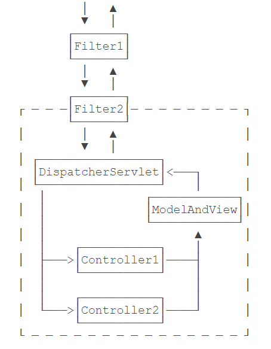
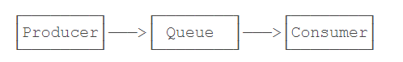
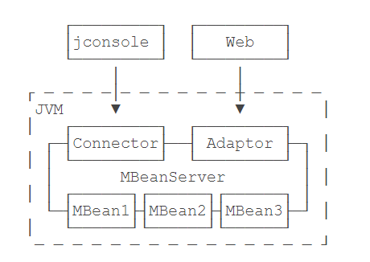

# Spring

[toc]

### DB

##### 基础

1，Spring简化数据库访问：

- 提供了简化的访问JDBC的模板类，不必手动释放资源；
- 提供了一个统一的DAO类以实现Data Access Object模式；
- 把`SQLException`封装为`DataAccessException`，这个异常是一个`RuntimeException`，并且让我们能区分SQL异常的原因，例如，`DuplicateKeyException`表示违反了一个唯一约束；
- 能方便地集成Hibernate、JPA和MyBatis这些数据库访问框架。

##### JDBC

1，首先通过IoC容器创建并管理一个`DataSource`实例，然后，Spring提供了一个`JdbcTemplate`，可以方便地让我们操作JDBC，因此，通常情况下，我们会实例化一个`JdbcTemplate`，通常情况下，会实例化一个`JdbcTemplate`，使用Template模式：父类定义骨架，子类实现某些细节，为了防止子类重写父类的骨架方法，可以在父类中对骨架方法使用`final`，对于需要子类实现的抽象方法，一般声明为`protected`，使得这些方法对外部客户端不可见。

２，`JdbcTemplate`只是对JDBC操作的一个简单封装，它的目的是尽量减少手动编写`try(resource) {...}`的代码，对于查询，主要通过`RowMapper`实现了JDBC结果集到Java对象的转换。

- 针对简单查询，优选`query()`和`queryForObject()`，因为只需提供SQL语句、参数和`RowMapper`。如果在设计表结构的时候，能够和JavaBean的属性一一对应，那么直接使用`BeanPropertyRowMapper`就很方便。
- 针对更新操作，优选`update()`，因为只需提供SQL语句和参数；
- 任何复杂的操作，最终也可以通过`execute(ConnectionCallback)`实现，因为拿到`Connection`就可以做任何JDBC操作。

３，创建连接

```java
// 创建一个DataSource实例，它的实际类型是HikariDataSource
@Bean
DataSource createDataSource() {
    HikariConfig config = new HikariConfig();
	// init config
    return new HikariDataSource(config);
}
// 创建一个JdbcTemplate实例，它需要注入DataSource，这是通过方法参数完成注入的
@Bean
JdbcTemplate createJdbcTemplate(@Autowired DataSource dataSource) {
    return new JdbcTemplate(dataSource);
}
```

编写示例代码或者测试代码时，推荐使用[HSQLDB](http://hsqldb.org/)这个数据库，它是一个用Java编写的关系数据库，可以以内存模式或者文件模式运行。可以通过HSQLDB自带的工具来初始化数据库表，通过写一个Bean，在Spring容器启动时自动创建一个测试用数据表。

```java
@Component
public class DatabaseInitializer {
    @Autowired
    JdbcTemplate jdbcTemplate;

    @PostConstruct
    public void init() {
        jdbcTemplate.update("DROP TABLE IF EXISTS users");
        jdbcTemplate.update("CREATE TABLE IF NOT EXISTS users (" //
                + "id BIGINT IDENTITY NOT NULL PRIMARY KEY, " //
                + "email VARCHAR(100) NOT NULL, " //
                + "password VARCHAR(100) NOT NULL, " //
                + "name VARCHAR(100) NOT NULL, " //
                + "UNIQUE (email))");
    }
}
```

只需要在需要访问数据库的Bean中，注入`JdbcTemplate`即可

```java
@Autowired
JdbcTemplate jdbcTemplate;
```

4，提供了一系列以回调为特点的工具方法，目的是避免繁琐的`try...catch`语句。

回调函数：包含运行环境，被调用的库，传入的回调函数。回调函数在被运行环境传入到库之后，由库回过头来调用。

* `T execute(ConnectionCallback<T> action)`: jdbcTemplate自动执行action方法，并将action的返回值作为jdbcTemplate.execute的结果返回。回调方法允许获取Connection，然后做任何基于Connection的操作。

```java
public User getUserById(long id) {
    // 注意传入的是ConnectionCallback:
    return jdbcTemplate.execute((Connection conn) -> {
        // 可以直接使用conn实例，不要释放它，回调结束后JdbcTemplate自动释放，:
        // 在内部手动创建的PreparedStatement、ResultSet必须用try(...)释放:
        try (var ps = conn.prepareStatement("SELECT * FROM users WHERE id = ?")) {
            ps.setObject(1, id);
            try (var rs = ps.executeQuery()) {
                if (rs.next()) {
                    return new User( // new User object:
                            rs.getLong("id"), // id
                            rs.getString("email"), // email
                            rs.getString("password"), // password
                            rs.getString("name")); // name
                }
                throw new RuntimeException("user not found by id.");
            }
        }
    });
}
```

* `T execute(String sql, PreparedStatementCallback<T> action)`：jdbcTemplate自动执行action方法，并将action的返回值作为jdbcTemplate.execute的结果返回。

```java
public User getUserByName(String name) {
    // 需要传入SQL语句，以及PreparedStatementCallback:
    return jdbcTemplate.execute("SELECT * FROM users WHERE name = ?", (PreparedStatement ps) -> {
        // PreparedStatement实例已经由JdbcTemplate创建，并在回调后自动释放:
        ps.setObject(1, name);
        try (var rs = ps.executeQuery()) {
            if (rs.next()) {
                return new User( // new User object:
                        rs.getLong("id"), // id
                        rs.getString("email"), // email
                        rs.getString("password"), // password
                        rs.getString("name")); // name
            }
            throw new RuntimeException("user not found by id.");
        }
    });
}
```

* `T queryForObject(String sql, Object[] args, RowMapper<T> rowMapper)`：jdbcTemplate自动执行action方法，并将action的返回值作为jdbcTemplate.execute的结果返回。`JdbcTemplate`会自动创建`PreparedStatement`，自动填入参数，自动执行查询并返回`ResultSet`，需要额外提供`RowMapper`需要做的事情就是把`ResultSet`的当前行映射成一个JavaBean或者就是简单数值，可以返回任何Java对象。整个过程中，使用`Connection`、`PreparedStatement`和`ResultSet`都不需要我们手动管理。

```java
public User getUserByEmail(String email) {
    // 传入SQL，参数和RowMapper实例:
    return jdbcTemplate.queryForObject("SELECT * FROM users WHERE email = ?", new Object[] { email },
            (ResultSet rs, int rowNum) -> {
                // rs 为查询的结果集合，rowNum为受影响的记录数量 
                // 将ResultSet的当前行映射为一个JavaBean:
                return new User( // new User object:
                        rs.getLong("id"), // id
                        rs.getString("email"), // email
                        rs.getString("password"), // password
                        rs.getString("name")); // name
            });
}
```

* `T query(String sql, Object[] args, BeanPropertyRowMapper<T> rowMapper)`：jdbcTemplate自动执行action方法，并将action的返回值作为jdbcTemplate.execute的结果返回。`JdbcTemplate`会自动创建`PreparedStatement`，自动填入参数，自动执行查询并返回`ResultSet`，如果数据库表的结构恰好和JavaBean的属性名称一致，那么`BeanPropertyRowMapper`就可以直接把一行记录按列名转换为JavaBean。如果表结构和JavaBean不一致，需要稍微改写一下查询，使结果集的结构和JavaBean保持一致(`SELECT office_address AS workAddress FROM users WHERE`)。

```java
public List<User> getUsers(int limit) {
    return jdbcTemplate.query("SELECT * FROM users LIMIT ? ", new Object[] { limit },
            new BeanPropertyRowMapper<>(User.class));
}
```

* `int update (String sql, Object ... args)`：返回受影响的行数。

```java
public void updateUser(User user) {
    // 传入SQL，SQL参数，返回更新的行数:
    if (1 != jdbcTemplate.update("UPDATE user SET name = ? WHERE id=?", user.getName(), user.getId())) {
        throw new RuntimeException("User not found by id");
    }
}
```

##### 事务

1，Spring提供了一个`PlatformTransactionManager`来表示事务管理器，所有的事务都由它负责管理。而事务由`TransactionStatus`表示。

2，使用声明式事务

```java
@Configuration
@ComponentScan
@EnableTransactionManagement // 启用声明式
@PropertySource("jdbc.properties")
public class AppConfig {
    ...
    @Bean
    PlatformTransactionManager createTxManager(@Autowired DataSource dataSource) {
        return new DataSourceTransactionManager(dataSource);
    }
}
```

对需要事务支持的方法，加一个`@Transactional`注解；或者直接在Bean的`class`处加上`@Transactional`注解，表示所有`public`方法都具有事务支持。底层实现原理是AOP代理，即通过自动创建Bean的Proxy实现，自动加上`try-catch-final`和`rollback`。

3，回滚事务

默认情况下，在一个事务方法中，如果发生了`RuntimeException`，Spring的声明式事务将自动回滚。如果程序判断需要回滚事务，只需抛出`RuntimeException`。

如果要针对Checked Exception回滚事务，需要在方法或者类上的`@Transactional`注解中写出来：``@Transactional(rollbackFor = {RuntimeException.class, IOException.class})``,表示在抛出`RuntimeException`或`IOException`时，事务将回滚。

为了简化代码，建议业务异常体系从`RuntimeException`派生，这样就不必声明任何特殊异常，只需要正常抛出业务异常即可让Spring的声明式事务正常回滚。

4，事务边界

单个事务方法的事务边界就是方法开始和结束。

Spring的声明式事务为事务传播定义了几个级别：

* 默认传播级`REQUIRED`：如果当前没有事务，就创建一个新事务，如果当前有事务，就加入到当前事务中执行。因此如果事务方法A内部调用了事务方法B，方法B不会创建新的事务，B会自动加入方法A创建的事务中，全程只有一个事务，并且范围就是A方法。

* `SUPPORTS`：表示如果有事务，就加入到当前事务，如果没有，那也不开启事务执行。这种传播级别可用于查询方法，因为SELECT语句既可以在事务内执行，也可以不需要事务；

* `REQUIRES_NEW`：表示不管当前有没有事务，都必须开启一个新的事务执行。如果当前已经有事务，那么当前事务会挂起，等新事务完成后，再恢复执行；

定义事务的传播级别也是写在`@Transactional`注解里的：``@Transactional(propagation = Propagation.REQUIRES_NEW)``

事务传播的底层实现是Spring把JDBC相关的`Connection`和`TransactionStatus`实例绑定到`ThreadLocal`。如果一个事务方法从`ThreadLocal`未取到事务，那么它会打开一个新的JDBC连接，同时开启一个新的事务，否则，它就直接使用从`ThreadLocal`获取的JDBC连接以及`TransactionStatus`。因此，事务能正确传播的前提是方法调用是在一个线程内，事务只能在当前线程传播，无法跨线程传播。

##### DAO

1，Web层调用业务层，业务层调用数据访问层。业务层负责处理各种业务逻辑，而数据访问层只负责对数据进行增删改查。Spring提供JdbcDaoSupport`类，用于简化DAO的实现。

DAO模式就是一个简单的数据访问模式，是否使用DAO，根据实际情况决定，很多时候直接在Service层操作数据库也是完全没有问题的。

```java
public abstract class JdbcDaoSupport extends DaoSupport {

    private JdbcTemplate jdbcTemplate;

    public final void setJdbcTemplate(JdbcTemplate jdbcTemplate) {
        this.jdbcTemplate = jdbcTemplate;
        initTemplateConfig();
    }

    public final JdbcTemplate getJdbcTemplate() {
        return this.jdbcTemplate;
    }

    ...
}

```

JdbcDaoSupport中`jdbcTemplate`未标注`@Autowired`，子类要手动注入`JdbcTemplate`，可以编写一个`AbstractDao`专门负责注入`JdbcTemplate`

```java
public abstract class AbstractDao extends JdbcDaoSupport {
    @Autowired
    private JdbcTemplate jdbcTemplate;

    @PostConstruct
    public void init() {
        super.setJdbcTemplate(jdbcTemplate);
    }
}
```

子类可以直接调用`getJdbcTemplate()`

```java
@Component
@Transactional
public class UserDao extends AbstractDao {
    public User getById(long id) {
        return getJdbcTemplate().queryForObject(
                "SELECT * FROM users WHERE id = ?",
                new BeanPropertyRowMapper<>(User.class),
                id
        );
    }
    User createUser(User user) {
        ...
    }

    User updateUser(User user) {
        ...
    }

    void deleteUser(User user) {
        ...
    }
}
```

##### Hibernate

1，把关系数据库的表记录映射为Java对象的过程就是ORM：Object-Relational Mapping。ORM既可以把记录转换成Java对象，也可以把Java对象转换为行记录。

2，创建一个`LocalSessionFactoryBean`

```java
@Bean
LocalSessionFactoryBean createSessionFactory(@Autowired DataSource dataSource) {
    var props = new Properties();
    // 表示自动创建数据库的表结构，注意不要在生产环境中启用；
    props.setProperty("hibernate.hbm2ddl.auto", "update");
    // 指示Hibernate使用的数据库是HSQLDB。Hibernate使用一种HQL的查询语句，它和SQL类似，但真正在“翻译”成SQL时，会根据设定的数据库“方言”来生成针对数据库优化的SQL；
    props.setProperty("hibernate.dialect", "org.hibernate.dialect.HSQLDialect");
    // 让Hibernate打印执行的SQL，这对于调试非常有用，我们可以方便地看到Hibernate生成的SQL语句是否符合我们的预期。
    props.setProperty("hibernate.show_sql", "true");
    var sessionFactoryBean = new LocalSessionFactoryBean();
    sessionFactoryBean.setDataSource(dataSource);
    // 指示Hibernate扫描这个包下面的所有Java类，自动找出能映射为数据库表记录的JavaBean
    sessionFactoryBean.setPackagesToScan("com.itranswarp.learnjava.entity");
    sessionFactoryBean.setHibernateProperties(props);
    return sessionFactoryBean;
}

@Bean
// s数据库工具类，可以简化数据库操作。
HibernateTemplate createHibernateTemplate(@Autowired SessionFactory sessionFactory) {
    return new HibernateTemplate(sessionFactory);
}

@Bean
// 配合Hibernate使用声明式事务
PlatformTransactionManager createTxManager(@Autowired SessionFactory sessionFactory) {
    return new HibernateTransactionManager(sessionFactory);
}
```

`LocalSessionFactoryBean`是一个`FactoryBean`，它会再自动创建一个`SessionFactory`，在Hibernate中，`Session`是封装了一个JDBC `Connection`的实例，而`SessionFactory`是封装了JDBC `DataSource`的实例，即`SessionFactory`持有连接池，每次需要操作数据库的时候，`SessionFactory`创建一个新的`Session`，相当于从连接池获取到一个新的`Connection`。

3，如果一个JavaBean被用于映射，就标记一个`@Entity`告诉Hibernate如何把`JavaBean`映射到表记录

```java
// 表示它用于继承
@MappedSuperclass
public abstract class AbstractEntity {
	private Long id;
	private Long createdAt;
    // 主键需要用@Id标识，自增主键再追加一个@GeneratedValue以便Hibernate能读取到自增主键的值
	@Id
	@GeneratedValue(strategy = GenerationType.IDENTITY)
    // 每个属性到数据库列的映射用@Column()标识,nullable指示列是否允许为NULL，updatable指示该列是否允许被用在UPDATE语句，length指示String类型的列的长度（如果没有指定，默认是255）
	@Column(nullable = false, updatable = false)
    // 作为映射使用的JavaBean，所有属性都使用包装类型而不是基本类型。
    // 包装类未指定类型为null，Hibernate能识别出来该值未指定；基本类型未指定使用默认值0，此时Hibernate无法确定这个0是用户指定的，还是未指定的默认值。
	public Long getId() {
		return id;
	}

	public void setId(Long id) {
		this.id = id;
	}

	@Column(nullable = false, updatable = false)
	public Long getCreatedAt() {
		return createdAt;
	}

	public void setCreatedAt(Long createdAt) {
		this.createdAt = createdAt;
	}

	// 返回一个虚拟的属性,CreatedDateTime是计算得出的属性，而不是从数据库表读出的值，
	// 需要标注@Transient，否则Hibernate会尝试从数据库读取名为createdDateTime这个不存在的字段从而出错。
	@Transient
	public ZonedDateTime getCreatedDateTime() {
        // 依据从数据库中读取的createdAt属性创建onedDateTime
		return Instant.ofEpochMilli(this.createdAt).atZone(ZoneId.systemDefault());
	}

	// 表示在将一个JavaBean持久化到数据库之前（即执行INSERT语句），Hibernate会先执行该方法
	@PrePersist
	public void preInsert() {
		setCreatedAt(System.currentTimeMillis());
	}
}


@NamedQueries(@NamedQuery(name = "login", query = "SELECT u FROM User u WHERE u.email=?0 AND u.password=?1"))
@Entity
// 默认情况下，映射的表名是JavaBean名称的小写，如果实际的表名不同，可以追加一个@Table(name="tablename")
@Table(name="users")
public class User extends AbstractEntity {

	private String email;
	private String password;
	private String name;

	public User() {
	}

	public User(long id, String email, String password, String name) {
		setId(id);
		setEmail(email);
		setPassword(password);
		setName(name);
	}

	@Column(nullable = false, unique = true, length = 100)
	public String getEmail() {
		return email;
	}

	public void setEmail(String email) {
		this.email = email;
	}

	@Column(nullable = false, length = 100)
	public String getPassword() {
		return password;
	}

	public void setPassword(String password) {
		this.password = password;
	}

	@Column(nullable = false, length = 100)
	public String getName() {
		return name;
	}

	public void setName(String name) {
		this.name = name;
	}
}
```

数据操作直接对JavaBean操作即可，Hibernate自动读写数据库。

```java
@Component
@Transactional
public class UserService {
    @Autowired
    HibernateTemplate hibernateTemplate;
    void func(){
        //持久化一个User实例，我们只需调用save()方法
        User user = new User();
        // 设置好各个属性:
        user.setEmail(email);
        user.setPassword(password);
        user.setName(name);
        // 保存到数据库:
        hibernateTemplate.save(user);
        // Hibernate插入数据后自动获取到自增属性，自动保存到JavaBean实例中。
        long id=user.getId();

        // 通过主键获取用户
        // load()和get()都可以根据主键加载记录，它们的区别在于，当记录不存在时，get()返回null，而load()抛出异常。
        User user = hibernateTemplate.get(User.class, id);

        // 条件查询获取用户
        // 使用findByExample()，给出一个User实例，Hibernate把该实例所有非null的属性拼成WHERE条件(属性必须使用包装类，如果使用基本类型就存在默认值，额外增加了一个使用默认值的匹配条件，使用findByExample()时，注意基本类型字段总是会加入到WHERE条件)
        User example = new User();
        example.setEmail(email);
        example.setPassword(password);
        // 等价于根据给定email和password查询用户： SELECT * FROM user WHERE email = ? AND password = ?
        List<User> list = hibernateTemplate.findByExample(example);

        // 条件查询获取用户
        // 使用Criteria查询，使用链式语句来添加多个AND,OR 条件，更灵活（add等价于and,连接多个平级条件)
        //  (email = ? OR name = ?) AND password = ?
        //    criteria.add(
        //            Restrictions.and(
        //            Restrictions.or(
        //            Restrictions.eq("email", email),
        //            Restrictions.eq("name", email)
        //            ),
        //            Restrictions.eq("password", password)
        //            )
        DetachedCriteria criteria = DetachedCriteria.forClass(User.class);
        criteria.add(Restrictions.eq("email", email)).add(Restrictions.eq("password", password));
        List<User> list = (List<User>) hibernateTemplate.findByCriteria(criteria);

        // 条件查询获取用户
        // 直接编写Hibernate内置的HQL查询。
        // HQL使用类名和属性名，由Hibernate自动转换为实际的表名和列名。
        List<User> list = (List<User>) hibernateTemplate.find("FROM User WHERE email=? AND password=?", email, password);
        
        // 条件查询获取用户
        // NamedQuery
        // 名称为login的查询语句保存在JavaBean类开头的注解中注解中,,可以在User类统一管理所有相关查询
        //       @NamedQueries(
        //		@NamedQuery(
        //				// 查询名称:
        //				name = "login",
        //				// 查询语句:占位符使用?0、?1
        //				query = "SELECT u FROM User u WHERE u.email=?0 AND u.password=?1"
        //		)
        //)
        //@Entity
        //public class User extends AbstractEntity {...}
        List<User> list = (List<User>) hibernateTemplate.findByNamedQuery("login", email, password);

        // 删除用户，通过主键删除记录时，一个常见的用法是先根据主键加载该记录，再删除
         hibernateTemplate.delete(user);

        // 更新记录相当于先更新User的指定属性，然后调用update()方法.
        // Hibernate在更新记录时，只会把@Column(updatable=true)的属性加入到UPDATE语句中,如果修改了标记为禁止修改的属性，并不会更新对应的数据库列，提供一层额外的安全性。
        // 这个功能是Hibernate提供的，如果绕过Hibernate直接通过JDBC执行UPDATE语句仍然可以更新数据库的任意列的值。
        user.setName(name);
        hibernateTemplate.update(user);
    }
}
```

##### JPA 

1，Java Persistence API是JavaEE的一个ORM标准，JPA只是接口，Spring内置了JPA的集成，还需要选择一个实现产品：Hibernate或EclipseLink

2，使用

先创建一个`LocalContainerEntityManagerFactoryBean`，并让它再自动创建一个`EntityManagerFactory`

DBC、Hibernate和JPA提供的接口关系如下：

| JDBC       | Hibernate      | JPA                  |
| :--------- | :------------- | :------------------- |
| DataSource | SessionFactory | EntityManagerFactory |
| Connection | Session        | EntityManager        |

```java
// 创建LocalContainerEntityManagerFactoryBean，实现数据库连接
@Bean
LocalContainerEntityManagerFactoryBean createEntityManagerFactory(@Autowired DataSource dataSource) {
    var entityManagerFactoryBean = new LocalContainerEntityManagerFactoryBean();
    // 设置DataSource:
    entityManagerFactoryBean.setDataSource(dataSource);
    // 扫描指定的package获取所有entity class:
    entityManagerFactoryBean.setPackagesToScan("org.huangqiang.entity");
    // 指定JPA的提供商是Hibernate:
    JpaVendorAdapter vendorAdapter = new HibernateJpaVendorAdapter();
    entityManagerFactoryBean.setJpaVendorAdapter(vendorAdapter);
    // 设定特定提供商自己的配置:
    var props = new Properties();
    props.setProperty("hibernate.hbm2ddl.auto", "update");
    props.setProperty("hibernate.dialect", "org.hibernate.dialect.HSQLDialect");
    props.setProperty("hibernate.show_sql", "true");
    entityManagerFactoryBean.setJpaProperties(props);
    return entityManagerFactoryBean;
}
// 声明式事务
@Bean
PlatformTransactionManager createTxManager(@Autowired EntityManagerFactory entityManagerFactory) {
    return new JpaTransactionManager(entityManagerFactory);
}
```

使用Spring+Hibernate作为JPA实现，无需任何配置文件。

```java
@Component
@Transactional
public class UserService {
    // 在需要使用JPA接口的地方注入一个EntityManager，相当于注入数据库连接。
    // 实际上这里注入的并不是真正的EntityManager(数据库连接），而是一个EntityManager的代理类，避免了同一个连接被多个线程共享。Spring遇到标注了@PersistenceContext的EntityManager会自动注入代理，该代理会在必要的时候自动打开EntityManager。多线程引用的EntityManager虽然是同一个代理类，但该代理类内部针对不同线程会创建不同的EntityManager实例。所以标注了@PersistenceContext的EntityManager可以被多线程安全地共享。
    // public class EntityManagerProxy implements EntityManager {
    //    private EntityManagerFactory emf;
    //	}
    @PersistenceContext
    EntityManager em;
    void func(){
        // 主键查询
         User user = this.em.find(User.class, id);
        // JPQL查询条件查询
        // JPQL查询:使用类名和属性名，由Hibernate自动转换为实际的表名和列名。使用 :x 作为占位符
        TypedQuery<User> query = em.createQuery("SELECT u FROM User u WHERE u.email = :e", User.class);
        query.setParameter("e", email);
        List<User> list = query.getResultList();
        // NamedQuery条件查询
        // NamedQuery通过注解标注在JavaBean类上
        // @NamedQueries(
        //		@NamedQuery(
        //				name = "login",
        //				query = "SELECT u FROM User u WHERE u.email=:e AND u.password=:p"
        //		)
        // )
        // @Entity
        // public class User extends AbstractEntity {...}
        TypedQuery<User> query = em.createNamedQuery("login", User.class);
        query.setParameter("e", email);
        query.setParameter("p", password);
        List<User> list = query.getResultList();
        
        // 对数据库进行增删改的操作，可以分别使用em.persist(user)、em.remove(user)和em.merge(user)方法
    }
}
```

##### MyBatis

1，ORM主要工作就是依据在Java Bean的属性上的注解，把ResultSet的每一行变成Java Bean，或者把Java Bean自动转换到INSERT或UPDATE语句的参数中。

2，全自动ORM框架：使用Proxy模式跟踪Java Bean的修改，以便在`update()`操作中更新必要的属性。从ORM框架读取的User实例实际上并不是User类，而是代理类，代理类继承自User类，但针对每个setter方法做了覆写，代理类可以跟踪到每个属性的变化：

```java
public class UserProxy extends User {
    boolean _isNameChanged;

    public void setName(String name) {
        super.setName(name);
        _isNameChanged = true;
    }
    // 代理类可以直接通过getter方法查询数据库
    // 为了实现这样的查询，UserProxy必须保存Hibernate的当前Session。但是，当事务提交后，Session自动关闭，此时再获取getAddress()将无法访问数据库，或者获取的不是事务一致的数据。因此，ORM框架总是引入了Attached/Detached状态，表示当前此Java Bean到底是在Session的范围内，还是脱离了Session变成了一个“游离”对象,这种隐式状态使得普通Java Bean的生命周期变得复杂。
    // Hibernate和JPA为了实现兼容多种数据库，它使用HQL或JPQL查询，经过一道转换，变成特定数据库的SQL，理论上这样可以做到无缝切换数据库，但这一层自动转换除了少许的性能开销外，给SQL级别的优化带来了麻烦。
    // ORM框架通常提供了缓存，并且还分为一级缓存和二级缓存。缓存极大的增加了数据的不一致性，原因在于数据库通常会支持多个应用程序，常常会导致意外的更新。
    public Address getAddress() {
        Query q = _session.createQuery("from Address where userId = :userId");
        q.setParameter("userId", this.getId());
        List<Address> list = query.list();
        return list.isEmpty() ? null : list(0);
    }
}
```

手动JDBC：Spring提供的JdbcTemplate，它和ORM框架相比差别：查询后需要手动提供Mapper实例以便把ResultSet的每一行变为Java对象；增删改操作所需的参数列表，需要手动传入，比较麻烦。JdbcTemplate的优势在于它的确定性：即每次读取操作一定是数据库操作而不是缓存，所执行的SQL是完全确定的，缺点就是代码比较繁琐。使用MyBatis最大的问题是所有SQL都需要全部手写，优点是执行的SQL就是我们自己写的SQL，对SQL进行优化非常简单，也可以编写任意复杂的SQL，或者使用数据库的特定语法，但切换数据库可能就不太容易。

半自动的ORM：只负责把ResultSet自动映射到Java Bean，或者自动填充Java Bean参数，但仍需自己写出SQL。


3，MyBatis使用

使用MyBatis的核心就是创建`SqlSessionFactory`

| JDBC       | Hibernate      | JPA                  | MyBatis           |
| :--------- | :------------- | :------------------- | :---------------- |
| DataSource | SessionFactory | EntityManagerFactory | SqlSessionFactory |
| Connection | Session        | EntityManager        | SqlSession        |

```java
// 创建SqlSessionFactoryBean
@Bean
SqlSessionFactoryBean createSqlSessionFactoryBean(@Autowired DataSource dataSource) {
    var sqlSessionFactoryBean = new SqlSessionFactoryBean();
    sqlSessionFactoryBean.setDataSource(dataSource);
    return sqlSessionFactoryBean;
}
// 事务管理
@Bean
PlatformTransactionManager createTxManager(@Autowired DataSource dataSource) {
    return new DataSourceTransactionManager(dataSource);
}
```

MyBatis使用Mapper来实现映射，而且Mapper必须是接口。这里的Mapper不是JdbcTemplate的RowMapper的概念，它是定义访问数据库表的接口方法。查询方法不仅要定义接口方法本身，还要明确写出查询的SQL，用注解`@Select`标记。SQL语句的任何参数，都与方法参数按名称对应。

```java
public interface UserMapper {
    // 方法参数id的名字通过注解@Param()标记为id，则SQL语句里将来替换的占位符就是#{id}。如果有多个参数，那么每个参数命名后直接在SQL中写出对应的占位符即可
    // MyBatis执行查询后，将根据方法的返回类型自动把ResultSet的每一行转换为User实例，转换规按列名和属性名对应。如果列名和属性名不同，最简单的方式是编写SELECT语句的别名:created_time AS createdAt
	@Select("SELECT * FROM users WHERE id = #{id}")
	User getById(@Param("id") long id);
    
    @Select("SELECT * FROM users LIMIT #{offset}, #{maxResults}")
	List<User> getAll(@Param("offset") int offset, @Param("maxResults") int maxResults);
    
    // 方法传入的参数名称是user，参数类型是User类，在SQL中引用的时候，以#{obj.property}的方式写占位符。MyBatis必须写出完整的INSERT语句。
    // 获取插入后的自增主键，keyProperty和keyColumn分别指出JavaBean的属性和数据库的主键列名
    @Options(useGeneratedKeys = true, keyProperty = "id", keyColumn = "id")
    @Insert("INSERT INTO users (email, password, name, createdAt) VALUES (#{user.email}, #{user.password}, #{user.name}, #{user.createdAt})")
	void insert(@Param("user") User user);
    
    @Update("UPDATE users SET name = #{user.name}, createdAt = #{user.createdAt} WHERE id = #{user.id}")
	void update(@Param("user") User user);

    @Delete("DELETE FROM users WHERE id = #{id}")
    void deleteById(@Param("id") long id);
}
```

`Mapper`接口，还需要对应的实现类才能真正执行这些数据库操作的方法，`MapperFactoryBean`来自动创建所有Mapper的实现类。就可以让MyBatis自动扫描指定包的所有Mapper并创建实现类。在真正的业务逻辑中，可以直接注入。业务逻辑主要就是通过`XxxMapper`定义的数据库方法来访问数据库。

```java
// 通过@MapperScan，MyBatis在启动时自动给每个Mapper接口创建如下Bean:
// @Component
// public class UserMapperImpl implements UserMapper {
//     // 使用到之前创建的SqlSessionFactoryBean
//     @Autowired
//     SqlSessionFactory sessionFactory;

// public List<User> getAllUsers() {
//     String sql = getSqlFromAnnotation(...);
//     try (SqlSession session = sessionFactory.createSession()) {
//         ...
//     }
// }
// }
@MapperScan("org.huangqiang.mapper")
public class AppConfig {
    ...
}
```

```java
@Component
@Transactional
public class UserService {
    // 注入UserMapper:
    @Autowired
    UserMapper userMapper;
    public User getUserById(long id) {
        // 调用Mapper方法:
        User user = userMapper.getById(id);
        return user;
    }
}
```

4，Hibernate，MyBatis，JPA区别

JPA：JavaEE提供的ORM API，实现ORM必须引入第三方ORM框架(Hibernate或EclipseLink,不能将MyBatis作为底层实现)进行具体实现。

Hibernate：全自动ORM。在JavaBean类中将字段与表字段进行显式映射，封装了完整的对象关系映射机制。开发者操作的是JavaBean类中的字段，而不是数据表中的字段，通过HQL完成两者之间的自动转换，程序员可以使用对象编程思维来操纵数据库。Hibernate对各个主流RDB都有支持，理论上可以无缝切换，有较好的数据库移植性。在Spring中，JPA可以将Hibernate作为底层实现，也可以直接集成Hibernate，不经过JPA。

Mybatis：半自动ORM。在JavaBean类中不会将字段与数据表的字段进行显式映射。需要在另外的地方定义数据表的字段类型，如length, isnull等。还需要定义Mapper接口，实现方法与SQL语句的映射关系。开发者直接操作数据表的字段，将sql的入参和查询结果映射成POJOs，面向于ResultMap的映射。如果JavaBean中字段名与数据库字段名不一致，需要手动加as语句，相较于Hibernate需要维护SQL和查询结果集的映射,而且数据库的移植性较差,针对不同的数据库编写不同的SQL。 但是可以进行更细致的SQL优化,查询必要的字段。

### Web

##### Spring MVC

1，标准的Servlet组件：

- Servlet：能处理HTTP请求并将HTTP响应返回；
- JSP：一种嵌套Java代码的HTML，将被编译为Servlet；
- Filter：能过滤指定的URL以实现拦截功能；
- Listener：监听指定的事件，如ServletContext、HttpSession的创建和销毁。

此外，Servlet容器为每个Web应用程序自动创建一个唯一的`ServletContext`实例，这个实例就代表了Web应用程序本身。

2，Spring提供IoC容器，所有的Bean，Component，包括Controller，都在Spring IoC容器中被初始化，而Servlet容器由JavaEE服务器提供（如Tomcat），Servlet容器对Spring一无所知。普通的Java应用程序中可以通过`main()`方法可以很简单地创建一个Spring容器的实例；而Web应用程序总是由Servlet容器创建，在Web应用中启动Spring容器有很多种方法，可以通过Listener启动，也可以通过Servlet启动，可以使用XML配置，也可以使用注解配置。

最简单的启动方式：在`web.xml`中配置Spring MVC提供的`DispatcherServlet`。Servlet容器会首先初始化Spring MVC的`DispatcherServlet`，在`DispatcherServlet`启动时，它根据配置`AppConfig`创建了一个类型是WebApplicationContext的IoC容器，完成所有Bean的初始化，并将容器绑到ServletContext上。

因为`DispatcherServlet`持有IoC容器，能从IoC容器中获取所有`@Controller`的Bean，因此，`DispatcherServlet`接收到所有HTTP请求后，根据Controller方法配置的路径，就可以正确地把请求转发到指定方法，并根据返回的`ModelAndView`决定如何渲染页面。

```xml
<web-app>
	<display-name>Archetype Created Web Application</display-name>

	<servlet>
		<servlet-name>dispatcher</servlet-name>
		<servlet-class>org.springframework.web.servlet.DispatcherServlet</servlet-class>
		<init-param>
			<!--初始化参数contextClass指定使用注解配置的AnnotationConfigWebApplicationContext-->
			<param-name>contextClass</param-name>
			<param-value>org.springframework.web.context.support.AnnotationConfigWebApplicationContext</param-value>
		</init-param>
		<init-param>
			<!--配置文件的位置参数contextConfigLocation指向AppConfig的完整类名-->
			<param-name>contextConfigLocation</param-name>
			<param-value>org.huangqiang.AppConfig</param-value>
		</init-param>
		<load-on-startup>0</load-on-startup>
	</servlet>

	<servlet-mapping>
		<!--把这个Servlet映射到/*，即处理所有URL-->
		<servlet-name>dispatcher</servlet-name>
		<url-pattern>/*</url-pattern>
	</servlet-mapping>
</web-app>

```

3，Maven Web工程目录结构如下：

```ascii
spring-web-mvc
├── pom.xml
└── src
    └── main
        ├── java
        │   └── org
        │        └── learnjava
        │               ├── AppConfig.java
        │               ├── DatabaseInitializer.java
        │               ├── entity
        │               │   └── User.java
        │               ├── service
        │               │   └── UserService.java
        │               └── web
        │                   └── UserController.java
        ├── resources
        │   ├── jdbc.properties
        │   └── logback.xml
        └── webapp
            ├── WEB-INF
            │   ├── templates
            │   │   ├── _base.html
            │   │   ├── index.html
            │   │   ├── profile.html
            │   │   ├── register.html
            │   │   └── signin.html
            │   └── web.xml
            └── static
                ├── css
                │   └── bootstrap.css
                └── js
                    └── jquery.js
```

`src/main/webapp`是标准web目录，`WEB-INF`存放`web.xml`，编译的class，第三方jar，以及不允许浏览器直接访问的View模版，`static`目录存放所有静态文件。在`src/main/resources`目录中存放的是Java程序读取的classpath资源文件

4，编写正常的`AppConfig`后，只需加上`@EnableWebMvc`注解，就“激活”了Spring MVC

```java
@Configuration
@ComponentScan
@EnableWebMvc // 启用Spring MVC
@EnableTransactionManagement
@PropertySource("classpath:/jdbc.properties")
public class AppConfig {
    // 创建用于Spring MVC的Bean
    @Bean
    WebMvcConfigurer createWebMvcConfigurer() {
        return new WebMvcConfigurer() {
            // 让Spring MVC自动处理静态文件，并且映射路径为/static/**。
            @Override
            public void addResourceHandlers(ResourceHandlerRegistry registry) {
                registry.addResourceHandler("/static/**").addResourceLocations("/static/");
            }
        };
    }
    // 创建模板引擎
    @Bean
    ViewResolver createViewResolver(@Autowired ServletContext servletContext) {
        // 指定模板引擎
        PebbleEngine engine = new PebbleEngine.Builder().autoEscaping(true)
                .cacheActive(false)
                .loader(new ServletLoader(servletContext))
                .extension(new SpringExtension())
                .build();
        PebbleViewResolver viewResolver = new PebbleViewResolver();
        // ViewResolver通过指定prefix和suffix来确定如何查找View,此处指定模板文件存放在/WEB-INF/templates/目录下
        viewResolver.setPrefix("/WEB-INF/templates/");
        viewResolver.setSuffix("");
        viewResolver.setPebbleEngine(engine);
        return viewResolver;
    }
    // 启动嵌入式Tomcat,Servlet容器会首先初始化Spring MVC的DispatcherServlet，在DispatcherServlet启动时，它根据配置AppConfig创建了一个类型是WebApplicationContext的IoC容器，完成所有Bean的初始化，并将容器绑到ServletContext上。
    public static void main(String[] args) throws Exception {
    Tomcat tomcat = new Tomcat();
    tomcat.setPort(Integer.getInteger("port", 8080));
    tomcat.getConnector();
    Context ctx = tomcat.addWebapp("", new File("src/main/webapp").getAbsolutePath());
    WebResourceRoot resources = new StandardRoot(ctx);
    resources.addPreResources(
            new DirResourceSet(resources, "/WEB-INF/classes", new File("target/classes").getAbsolutePath(), "/"));
    ctx.setResources(resources);
    tomcat.start();
    tomcat.getServer().await();
}
}
```

5，普通的Bean都是普通的`@Component`，但Controller虽然也是Bean但是必须标记为`@Controller`。Spring MVC对Controller没有固定的要求，也不需要实现特定的接口，但要求总是标记`@Controller`而不是`@Component`

```java
// Controller使用@Controller标记而不是@Component:
@Controller
// 对URL进行分组，每组对应一个Controller是一种很好的组织形式，并可以在Controller的class定义出添加URL前缀和后缀，可以有效避免不小心导致的重复的URL映射。
@RequestMapping("/user")
public class UserController {
    // 正常使用@Autowired注入:
    @Autowired
    UserService userService;

    // 处理一个URL映射:一个方法对应一个HTTP请求路径，用@GetMapping或@PostMapping表示GET或POST请求。
    // 需要接收的HTTP参数以@RequestParam()标注，可以设置默认值。如果方法参数需要传入HttpServletRequest、HttpServletResponse或者HttpSession，直接添加这个类型的参数即可，Spring MVC会自动按类型传入。
    // 添加前缀和后缀后注意实际URL映射是/user//signin
    @PostMapping("/signin")
    public ModelAndView doSignin(
            @RequestParam("email") String email,
            @RequestParam("password") String password,
            HttpSession session) {
        	...
            // 返回的ModelAndView通常包含View的路径和一个Map作为Model，
            return new ModelAndView("xxx.html", model);
        	// 返回的ModelAndView也可以没有Model如登录页面:
            return new ModelAndView("signin.html")。
            // 返回重定向时既可以写
            new ModelAndView("redirect:/signin")，
            // 返回重定向时也可以直接返回
            String:return "redirect:/signin";
            // 在方法内部直接操作HttpServletResponse发送响应，返回null表示无需进一步处理
        	response.setContentType("application/octet-stream");
            OutputStream output = response.getOutputStream();
            output.write(data);
            output.flush();
            return null;
            
    }
    ...
}
```

6，使用Spring MVC时，整个Web应用程序按如下顺序启动：

1. 启动Tomcat服务器；
2. Tomcat读取web.xml并初始化DispatcherServlet；
3. DispatcherServlet创建IoC容器并自动注册到ServletContext中。

启动后，浏览器发出的HTTP请求全部由DispatcherServlet接收，并根据配置转发到指定Controller的指定方法处理。

##### REST

1，REST：通常输入输出都是JSON，便于第三方调用或者使用页面JavaScript与之交互。

​      REST：看Url就知道要什么；看http method就知道干什么；看http status code就知道结果如何。

2，在Controller中处理JSON

加入Jackson依赖：`com.fasterxml.jackson.core:jackson-databind:2.11.0`

```java
// 使用consumes声明能接收的类型，使用produces声明输出的类型。
@PostMapping(value = "/rest",
             consumes = "application/json;charset=UTF-8",
             produces = "application/json;charset=UTF-8")
// @ResponseBody表示返回的String无需额外处理，直接作为输出内容写入HttpServletResponse。
@ResponseBody
// 输入的JSON则根据注解@RequestBody直接被Spring反序列化为User这个JavaBean。
public String rest(@RequestBody User user) {
    return "{\"restSupport\":true}";
}
```

3，Spring额外提供了一个`@RestController`注解，使用`@RestController`替代`@Controller`后，每个方法自动变成API接口方法。自动接收Json输入并根据参类型序列化，自动反序列化并直接输出到HttpServletResponse。要求输入和输出要能被Jackson序列化或反序列化为JSON

```java
@RestController
@RequestMapping("/api")
public class ApiController {
    @Autowired
    UserService userService;

    @GetMapping("/users")
    public List<User> users() {
        return userService.getUsers();
    }

    @GetMapping("/users/{id}")
    public User user(@PathVariable("id") long id) {
        return userService.getUserById(id);
    }

    @PostMapping("/signin")
    public Map<String, Object> signin(@RequestBody SignInRequest signinRequest) {
        try {
            User user = userService.signin(signinRequest.email, signinRequest.password);
            return Map.of("user", user);
        } catch (Exception e) {
            return Map.of("error", "SIGNIN_FAILED", "message", e.getMessage());
        }
    }
	// 内部类：非static类隐式地引用了主类实例，不能独立于主类使用。
    public static class SignInRequest {
        public String email;
        public String password;
    }
}
```

是直接在`User`的`password`属性定义处加上`@JsonIgnore`表示完全忽略该属性：

```java
public class User {
    ...

    @JsonIgnore // 禁用password属性，不可读：不能将password属性通过序列化写入json返回；不可写：不能通过用户传入的参数反序列化User对象时初始化password属性。。
    @JsonProperty(access = Access.WRITE_ONLY) //允许输入，不允许输出
    @JsonProperty(access = Access.READ_ONLY) //允许输出，不允许输入
    public String getPassword() {
        return password;
    }

    ...
}
```

##### 使用Filter

1，通过指定过滤的URL，拦截指定URL，对`HttpServletRequest`和`HttpServletResponse`处理后传递请求给 DispatcherServlet，用于后续处理。可以把很多公共预处理逻辑放到Filter中完成。

2，引入CharacterEncodingFilter处理中文输入,`CharacterEncodingFilter`其实和Spring的IoC容器没有任何关系，两者均互不知晓对方的存在。

`web.xml`

```xml
<web-app>
    <!--处理文本编码-->
    <filter>
        <filter-name>encodingFilter</filter-name>
        <filter-class>org.springframework.web.filter.CharacterEncodingFilter</filter-class>
        <init-param>
            <param-name>encoding</param-name>
            <param-value>UTF-8</param-value>
        </init-param>
        <init-param>
            <param-name>forceEncoding</param-name>
            <param-value>true</param-value>
        </init-param>
    </filter>
	<!--	所有的请求都要经过这个Filter-->
    <filter-mapping>
        <filter-name>encodingFilter</filter-name>
        <url-pattern>/*</url-pattern>
    </filter-mapping>
    ...
</web-app>
```

3，对于使用Spring组件的Filter，如果在Spring中创建的这个`Filter`是一个普通Bean，Servlet容器并不知道，所以它不会起作用。如果直接在`web.xml`中声明这个`Filter`，`Filter`的实例将由Servlet容器而不是Spring容器初始化，Spring不知道该实例的存在，`@Autowire`根本不生效。

`DelegatingFilterProxy`可以让Servlet容器实例化的Filter，间接引用Spring容器实例化的`AuthFilter`，本质上IOC容器持有此组件。

```java
@Component
public class AuthFilter implements Filter {
    @Autowired
    UserService userService;

    public void doFilter(ServletRequest request, ServletResponse response, FilterChain chain)
            throws IOException, ServletException {
        HttpServletRequest req = (HttpServletRequest) request;
        // 获取Authorization头:
        String authHeader = req.getHeader("Authorization");
        if (authHeader != null && authHeader.startsWith("Basic ")) {
            // 从Header中提取email和password:
            String email = prefixFrom(authHeader);
            String password = suffixFrom(authHeader);
            // 登录:
            User user = userService.signin(email, password);
            // 放入Session:
            req.getSession().setAttribute(UserController.KEY_USER, user);
        }
        // 继续处理请求:
        chain.doFilter(request, response);
    }
}
```

```xml
<web-app>
    <!-- 让Servlet容器实例化的Filter，间接引用Spring容器实例化的AuthFilter -->
    <filter>
        <filter-name>authFilter</filter-name>
        <filter-class>org.springframework.web.filter.DelegatingFilterProxy</filter-class>
            <!--如果在web.xml中配置的Filter名字和Spring容器的Bean的名字不一致，那么需要指定Bean的名字-->
			<!--   <init-param>-->
            <!--	<param-name>targetBeanName</param-name>-->
            <!--	<param-value>authFilter</param-value>-->
            <!--	</init-param>-->
    </filter>
	<!--所有的请求都要经过这个认证Filter-->	
    <filter-mapping>
        <filter-name>authFilter</filter-name>
        <url-pattern>/*</url-pattern>
    </filter-mapping>

    ...
</web-app>
```

实现原理：

1. Servlet容器从`web.xml`中读取配置，实例化命名是`authFilter`的`DelegatingFilterProxy`

2. Spring容器通过扫描`@Component`实例化`AuthFilter`。

3. 当`DelegatingFilterProxy`生效后，自动查找注册在`ServletContext`上的Spring容器，再试图从容器中查找名为`authFilter`（Bean实例由Spring自动创建，名称为类名的驼峰命名形式)的Bean，也就是用`@Component`声明的`AuthFilter`。

4. `DelegatingFilterProxy`将请求代理给`AuthFilter`

    ```java
    public class DelegatingFilterProxy implements Filter {
        private Filter delegate;
        public void doFilter(...) throws ... {
            if (delegate == null) {
                delegate = findBeanFromSpringContainer();
            }
            delegate.doFilter(req, resp, chain);
        }
    }
    ```

引用关系如下：

Servlet Container中的DelegatingFilterProxy通过代理模式，持有Spring Container中的Filter实例，最终由Filter实例实现过滤功能。Servlet Container中的DispatcherServlet引用Spring Container中的Controllers，根据URL的类型调用对应的Controllers处理请求，并获得ModelAndView返回。


##### Interceptor

1，Filter由Servlet容器管理，拦截所有的请求，Filter组件实际上并不知道后续内部处理是通过Spring MVC提供的`DispatcherServlet`还是其他Servlet组件，因为Filter是Servlet规范定义的标准组件，它可以应用在任何基于Servlet的程序中。



2，Interceptor和Filter相比，Interceptor拦截范围不是后续整个处理流程，而是仅针对Controller拦截。Interceptor的拦截范围其实就是Controller方法，它实际上就相当于基于AOP的方法拦截。因为Interceptor只拦截Controller方法，所以返回`ModelAndView`后，后续对View的渲染就脱离了Interceptor的拦截范围。使用Interceptor的好处是Interceptor本身是Spring管理的Bean，因此向Interceptor注入任意Bean都非常简单。此外，可以应用多个Interceptor，并通过简单的`@Order`指定顺序


```java
@Order(1)
@Component
// 一个Interceptor必须实现HandlerInterceptor接口，可以选择实现preHandle()、postHandle()和afterCompletion()方法。
public class LoggerInterceptor implements HandlerInterceptor {

    final Logger logger = LoggerFactory.getLogger(getClass());

    @Override
    // Controller方法调用前执行,可以直接处理响应，然后返回false表示无需调用Controller方法继续处理了，通常在认证或者安全检查失败时直接返回错误响应。
    public boolean preHandle(HttpServletRequest request, HttpServletResponse response, Object handler) throws Exception {
        logger.info("preHandle {}...", request.getRequestURI());
        if (request.getParameter("debug") != null) {
            PrintWriter pw = response.getWriter();
            pw.write("<p>DEBUG MODE</p>");
            pw.flush();
            return false;
        }
        return true;
    }

    @Override
    // Controller方法正常返回后执行,因为捕获了Controller方法返回的ModelAndView，所以可以继续往ModelAndView里添加一些通用数据，很多页面需要的全局数据如Copyright信息等都可以放到这里，无需在每个Controller方法中重复添加。
    public void postHandle(HttpServletRequest request, HttpServletResponse response, Object handler, ModelAndView modelAndView) throws Exception {
        logger.info("postHandle {}.", request.getRequestURI());
        if (modelAndView != null) {
            modelAndView.addObject("__time__", LocalDateTime.now());
        }
    }

    @Override
    // 无论Controller方法是否抛异常都会执行
    public void afterCompletion(HttpServletRequest request, HttpServletResponse response, Object handler, Exception ex) throws Exception {
        logger.info("afterCompletion {}: exception = {}", request.getRequestURI(), ex);
    }
}
```

```java
@Order(2)
@Component
public class AuthInterceptor implements HandlerInterceptor {
	
    // Interceptor本身是Spring管理的Bean，因此向Interceptor注入任意Bean都非常简单
    @Autowired
    UserService userService;

    @Override
    public boolean preHandle(HttpServletRequest request, HttpServletResponse response, Object handler)
            throws Exception {
       
    }
}
```

让拦截器生效，在`WebMvcConfigurer`中注册所有的Interceptor：

```java
@Bean
WebMvcConfigurer createWebMvcConfigurer(@Autowired HandlerInterceptor[] interceptors) {
    return new WebMvcConfigurer() {
        public void addInterceptors(InterceptorRegistry registry) {
            for (var interceptor : interceptors) {
                registry.addInterceptor(interceptor);
            }
        }
        ...
    };
}
```

3，Spring MVC允许定义基于`@ExceptionHandler`注解的异常处理方法。

异常处理方法没有固定的方法签名，可以传入`Exception`、`HttpServletRequest`等，返回值可以是`void`，也可以是`ModelAndView`。通过返回了一个新的`ModelAndView`，在应用程序内部如果发生了预料之外的异常，可以给用户显示一个出错页面，而不是简单的500 或404 ,可以编写多个错误处理方法，每个方法针对特定的异常。

使用`ExceptionHandler`时，要注意它仅作用于当前的Controller，即ControllerA中定义的一个`ExceptionHandler`方法对ControllerB不起作用。如果有很多Controller，可以创建父类处理一些通用的异常，其它Controller继承它，避免重复方法

```java
@Controller
public class UserController {
    // @ExceptionHandler(RuntimeException.class)表示当发生`RuntimeException`的时候，就自动调用此方法处理。
    @ExceptionHandler(RuntimeException.class)
    public ModelAndView handleUnknowException(Exception ex) {
        return new ModelAndView("500.html", Map.of("error", ex.getClass().getSimpleName(), "message", ex.getMessage()));
    }
    ...
}
```

##### CORS

1，在JavaScript与REST交互的时候，有很多安全限制。默认情况下，浏览器按同源策略放行JavaScript调用API，同源要求域名要完全相同（`a.com`和`www.a.com`不同），协议要相同（`http`和`https`不同），端口要相同 。

- 如果A站在域名`a.com`页面的JavaScript调用A站自己的API时，没有问题；
- 如果A站在域名`a.com`页面的JavaScript调用B站`b.com`的API时，将被浏览器拒绝访问，因为不满足同源策略。

2，如果A站的JavaScript访问B站API的时候，B站能够返回响应头`Access-Control-Allow-Origin: http://a.com`，那么，浏览器就允许A站的JavaScript访问B站的API。跨域访问能否成功，取决于B站是否愿意给A站返回一个正确的`Access-Control-Allow-Origin`响应头，所以决定权永远在提供API的服务方手中。

3，使用`@CrossOrigin`注解，可以在`@RestController`的class级别或方法级别定义一个`@CrossOrigin`，`@CrossOrigin`指定允许的跨域访问，允许多个域访问需要写成数组形式，例如`origins = {"http://a.com", "https://www.b.com"})`。如果要允许任何域访问，写成`origins = "*"`即可。该注解只对该Controller生效，如果有多个REST Controller都需要使用CORS，那么，每个Controller都必须标注`@CrossOrigin`注解。

```java
// 只允许来自local.liaoxuefeng.com跨域访问,
@CrossOrigin(origins = "http://local.liaoxuefeng.com:8080")
@RestController
@RequestMapping("/api")
public class ApiController {
    ...
}
```

4，在`WebMvcConfigurer`中定义一个全局CORS配置,创建一个全局CORS配置。

```java
@Bean
WebMvcConfigurer createWebMvcConfigurer() {
    return new WebMvcConfigurer() {
        @Override
        public void addCorsMappings(CorsRegistry registry) {
            registry.addMapping("/api/**")
                    .allowedOrigins("http://local.liaoxuefeng.com:8080")
                    .allowedMethods("GET", "POST")
                    .maxAge(3600);
        }
    };
}
```

##### 国际化

1，支持多语言，指根据地区调整类似姓名、日期的显示等。Java支持多语言和本地化是通过`MessageFormat`配合`Locale`实现的。i18n：多语言；L10n：本地化；g11n：多语言+本地化

2，对于Web应用程序，要实现国际化功能，主要是渲染View的时候，要把各种语言的资源文件提出来，这样，不同的用户访问同一个页面时，显示的语言就是不同的。

实现国际化的第一步是获取到用户的`Locale`。在Web应用程序中，HTTP规范规定了浏览器会在请求中携带`Accept-Language`头，用来指示用户浏览器设定的语言顺序：`Accept-Language: zh-CN,zh;q=0.8,en;q=0.2`,，把它转换为Java的`Locale`，即获得了用户的`Locale`。

3，流程

* Spring MVC通过`LocaleResolver`来自动从`HttpServletRequest`中获取`Locale`。`CookieLocaleResolver`从`HttpServletRequest`中获取`Locale`时，首先根据一个特定的Cookie判断是否指定了`Locale`，如果没有，就从HTTP头获取，如果还没有，就返回默认的`Locale`。当用户第一次访问网站时，`CookieLocaleResolver`只能从HTTP头获取`Locale`，即使用浏览器的默认语言。通常网站也允许用户自己选择语言，此时，`CookieLocaleResolver`就会把用户选择的语言存放到Cookie中，下一次访问时，就会返回用户上次选择的语言而不是浏览器默认语言。

    ```java
    @Bean
    LocaleResolver createLocaleResolver() {
        var clr = new CookieLocaleResolver();
        clr.setDefaultLocale(Locale.ENGLISH);
        clr.setDefaultTimeZone(TimeZone.getDefault());
        return clr;
    }
    ```

* 把写死在模板中的字符串以资源文件的方式存储在外部,每个资源文件都有相同的key，value为响应语言的对应值。对于多语言，主文件名如果命名为`messages`，资源文件必须按如下方式命名并放入classpath中：

    * 默认语言，文件名必须为`messages.properties`；
    * 简体中文，Locale是`zh_CN`，文件名必须为`messages_zh_CN.properties`；
    * 其它语言

* 创建一个Spring提供的`MessageSource`实例，`ResourceBundleMessageSource`会自动根据主文件名自动把所有相关语言的资源文件都读进来，并提供一个统一接口来实现“翻译”

    ```java
    // 多语言,Spring容器会创建不只一个MessageSource实例，此MessageSource是专门给页面国际化使用的，因此命名为i18n，不会与其它MessageSource实例冲突。
    @Bean("i18n")
    MessageSource createMessageSource() {
        var messageSource = new ResourceBundleMessageSource();
        // 指定文件是UTF-8编码:
        messageSource.setDefaultEncoding("UTF-8");
        // 指定主文件名:
        messageSource.setBasename("messages");
        return messageSource;
    }
    ```

    ```java
    // signin是在.properties文件中定义的key，第二个参数是Object[]数组作为格式化时传入的参数，最后一个参数就是获取的用户Locale实例。
    String text = messageSource.getMessage("signin", null, locale);
    ```

* 通过编写一个`MvcInterceptor`，把相关资源注入到`ModelAndView`中，在View中使用`MessageSource`加上`Locale`输出多语言：

    ```java
    @Component
    public class MvcInterceptor implements HandlerInterceptor {
        @Autowired
        LocaleResolver localeResolver;
    
        // 注意注入的MessageSource名称是i18n:
        @Autowired
        @Qualifier("i18n")
        MessageSource messageSource;
    
        public void postHandle(HttpServletRequest request, HttpServletResponse response, Object handler, ModelAndView modelAndView) throws Exception {
            if (modelAndView != null) {
                // 解析用户的Locale:
                Locale locale = localeResolver.resolveLocale(request);
                // 放入Model:
                modelAndView.addObject("__messageSource__", messageSource);
                modelAndView.addObject("__locale__", locale);
            }
        }
    }
    ```

* 在`WebMvcConfigurer`中注册`MvcInterceptor`

* 在View中调用`MessageSource.getMessage()`方法来实现多语言：

    ```html
    <a href="/signin">{{ __messageSource__.getMessage('signin', null, __locale__) }}</a>
    ```

* 允许用户手动切换`Locale`

    ```java
    @Controller
    public class LocaleController {
        final Logger logger = LoggerFactory.getLogger(getClass());
    
        @Autowired
        LocaleResolver localeResolver;
    
        @GetMapping("/locale/{lo}")
        public String setLocale(@PathVariable("lo") String lo, HttpServletRequest request, HttpServletResponse response) {
            // 根据传入的lo创建Locale实例:
            Locale locale = null;
            // zh-CN
            int pos = lo.indexOf('_');
            if (pos > 0) {
                // zh
                String lang = lo.substring(0, pos);
                // CN
                String country = lo.substring(pos + 1);
                locale = new Locale(lang, country);
            } else {
                locale = new Locale(lo);
            }
            // 设定此Locale:
            localeResolver.setLocale(request, response, locale);
            logger.info("locale is set to {}.", locale);
            // 刷新页面:
            String referer = request.getHeader("Referer");
            return "redirect:" + (referer == null ? "/" : referer);
        }
    }
    ```

##### 异步

1，在Servlet模型中，Servlet容器总是通过线程池来处理请求，每个请求都是由某个线程处理，然后，将响应写入IO流，发送给客户端。从开始处理请求，到写入响应完成，都是在同一个线程中处理的，保证在处理请求的过程中，各个线程互不影响。

如果一个请求处理的时间较长，基于线程池的同步模型很快就会把所有线程耗尽，导致服务器无法响应新的请求。如果把长时间处理的请求改为异步处理，那么线程池的利用率就会大大提高。

异步适用于IO密集型任务，IO忙，CPU闲；计算密集型任务是CPU忙，异步就没啥用，只能加CPU。

同步操作=不管当前任务是在处理何种需求，CPU都在等待该需求的完成，比如一个长IO操作，尽管不需要CPU的参与CPU仍要等待需求的完后。

异步操作=当不需要CPU时，释放CPU资源，该thread去处理请他请求。待会操作完成后发送完成的信号，空闲的thread继续回来处理，但不保证两次是相同的线程。

2，实现

* `web.xml`主要有几点不同：
    * 不能再使用`<!DOCTYPE ...web-app_2_3.dtd">`的DTD声明，必须用新的支持Servlet 3.1规范的XSD声明；
    * 对`DispatcherServlet`的配置多了一个`<async-supported>`，默认值是`false`，必须明确写成`true`，这样Servlet容器才会支持async处理。

```xml
<web-app xmlns="http://xmlns.jcp.org/xml/ns/javaee"
    xmlns:xsi="http://www.w3.org/2001/XMLSchema-instance"
    xsi:schemaLocation="http://xmlns.jcp.org/xml/ns/javaee http://xmlns.jcp.org/xml/ns/javaee/web-app_3_1.xsd"
    version="3.1">
    <display-name>Archetype Created Web Application</display-name>

    <servlet>
        <servlet-name>dispatcher</servlet-name>
        <servlet-class>org.springframework.web.servlet.DispatcherServlet</servlet-class>
        <init-param>
            <param-name>contextClass</param-name>
            <param-value>org.springframework.web.context.support.AnnotationConfigWebApplicationContext</param-value>
        </init-param>
        <init-param>
            <param-name>contextConfigLocation</param-name>
            <param-value>com.itranswarp.learnjava.AppConfig</param-value>
        </init-param>
        <load-on-startup>0</load-on-startup>
        <async-supported>true</async-supported>
    </servlet>

    <servlet-mapping>
        <servlet-name>dispatcher</servlet-name>
        <url-pattern>/*</url-pattern>
    </servlet-mapping>
</web-app>
```

* Controller中编写async处理逻辑

    第一种async处理方式是返回一个`Callable`，Spring MVC自动把返回的`Callable`放入线程池执行，等待结果返回后再写入响应：

    ```java
    @GetMapping("/users")
    public Callable<List<User>> users() {
        return () -> {
            // 模拟3秒耗时:
            try {
                Thread.sleep(3000);
            } catch (InterruptedException e) {
            }
            return userService.getUsers();
        };
    }
    ```

    第二种async处理方式是返回一个`DeferredResult`对象，然后在另一个线程中，设置此对象的值并写入响应：

3，使用Filter

当使用async模式处理请求时，原有的Filter也可以工作，但必须在`web.xml`中添加`<async-supported>`并设置为`true`。一个声明为支持`<async-supported>`的Filter既可以过滤async处理请求，也可以过滤正常的同步处理请求，而未声明`<async-supported>`的Filter无法支持async请求，如果一个普通的Filter遇到async请求时，会直接报错，因此，务必注意普通Filter的`<url-pattern>`不要匹配async请求路径。

```xml
<filter>
    <filter-name>async-filter</filter-name>
    <filter-class>com.itranswarp.learnjava.web.AsyncFilter</filter-class>
    <!-- 异步过滤器-->
    <async-supported>true</async-supported>
</filter>

<filter>
    <filter-name>sync-filter</filter-name>
     <!-- 同步过滤器-->
    <filter-class>com.itranswarp.learnjava.web.SyncFilter</filter-class>
</filter>
<!-- 注意普通Filter的<url-pattern>不要匹配async请求路径。 -->
<filter-mapping>
    <filter-name>sync-filter</filter-name>
    <url-pattern>/api/version</url-pattern>
</filter-mapping>

<filter-mapping>
    <filter-name>async-filter</filter-name>
    <url-pattern>/api/*</url-pattern>
</filter-mapping>
```

4，同步请求下：请求的各个Filter，controller，返回结果的都是同一个线程。异步请求下：请求的各个Filter，controller，返回结果的线程可能不是同一个线程

5，Servlet 3.0规范添加的异步支持是针对同步模型打了一个“补丁”，虽然可以异步处理请求，但高并发异步请求时，它的处理效率并不高，因为这种异步模型并没有用到真正的“原生”异步。Java标准库提供了封装操作系统的异步IO包`java.nio`，是真正的多路复用IO模型，可以用少量线程支持大量并发。使用NIO编程复杂度比同步IO高很多，因此很少直接使用NIO。相反，大部分需要高性能异步IO的应用程序会选择Netty这样的框架，它基于NIO提供了更易于使用的API，方便开发异步应用程序。

##### WebSocket

1，WebSocket是一种基于HTTP的长链接技术。传统的HTTP协议是一种请求-响应模型（无状态协议)，如果浏览器不发送请求，那么服务器无法主动给浏览器推送数据。如果需要定期给浏览器推送数据，或者不定期给浏览器推送数据，基于HTTP协议实现这类需求，只能依靠浏览器的JavaScript定时轮询，效率很低且实时性不高。

2，因为HTTP本身是基于TCP连接的，所以，WebSocket在HTTP协议的基础上做了一个简单的升级，即建立TCP连接后，浏览器发送请求时，附带几个头，示客户端希望升级连接，变成长连接的WebSocket：

```
GET /chat HTTP/1.1
Host: www.example.com
Upgrade: websocket
Connection: Upgrade
```

服务器返回升级成功的响应：

```
HTTP/1.1 101 Switching Protocols
Upgrade: websocket
Connection: Upgrade
```

收到成功响应后表示WebSocket“握手”成功，这样，代表WebSocket的这个TCP连接将不会被服务器关闭，而是一直保持，服务器可随时向浏览器推送消息，浏览器也可随时向服务器推送消息。

3，实现

* 依赖：

    - org.apache.tomcat.embed:tomcat-embed-websocket:9.0.26
    - org.springframework:spring-websocket:5.2.0.RELEASE

* 嵌入式Tomcat支持WebSocket的组件，Spring封装的支持WebSocket的接口。

    AppConfig中加入Spring Web对WebSocket的配置：

    ```java
    // 此实例在内部通过WebSocketHandlerRegistry注册能处理WebSocket的WebSocketHandler，以及可选的WebSocket拦截器HandshakeInterceptor。
    @Bean
    WebSocketConfigurer createWebSocketConfigurer(
            @Autowired ChatHandler chatHandler,
            @Autowired ChatHandshakeInterceptor chatInterceptor)
    {
        return new WebSocketConfigurer() {
            public void registerWebSocketHandlers(WebSocketHandlerRegistry registry) {
                // 把URL与指定的WebSocketHandler关联，可关联多个:
                registry.addHandler(chatHandler, "/chat").addInterceptors(chatInterceptor);
            }
        };
    }
    ```

* 和处理普通HTTP请求不同，没法用一个方法处理一个URL。Spring提供了`TextWebSocketHandler`和`BinaryWebSocketHandler`分别处理文本消息和二进制消息，根据业务要求创建对应的Component继承`TextWebSocketHandler`或者`BinaryWebSocketHandler`。

    当浏览器请求一个WebSocket连接后，如果成功建立连接，Spring会自动调用`afterConnectionEstablished()`方法，任何原因导致WebSocket连接中断时，Spring会自动调用`afterConnectionClosed`方法，因此，覆写这两个方法即可处理连接成功和结束后的业务逻辑：

    ```java
    @Component
    public class ChatHandler extends TextWebSocketHandler {
      // 保存所有Client的WebSocket会话实例,用实例变量clients持有当前所有的WebSocketSession是为了广播，即可以向所有用户推送同一消息;如果要推送给指定的几个用户，那就需要在clients中根据条件查找出某些WebSocketSession，然后发送消息。
        private Map<String, WebSocketSession> clients = new ConcurrentHashMap<>();
    
        @Override
        public void afterConnectionEstablished(WebSocketSession session) throws Exception {
            // 每个WebSocket会话以WebSocketSession表示，且已分配唯一ID。和WebSocket相关的数据，例如用户名称等，均可放入关联的session中。
            // 新会话根据ID放入Map:
            clients.put(session.getId(), session);
            session.getAttributes().put("name", "Guest1");
        }
    
        @Override
        public void afterConnectionClosed(WebSocketSession session, CloseStatus status) throws Exception {
            clients.remove(session.getId());
        }
        
        // 每收到一个用户的消息后，广播给所有用户：
         @Override
        protected void handleTextMessage(WebSocketSession session, TextMessage message) throws Exception {
            String s = message.getPayload();
            String r = ... // 根据输入消息构造待发送消息
            broadcastMessage(r); // 推送给所有用户
        }
    }
    ```

* `ChatHandshakeInterceptor`，这个类实际上可以从`HttpSessionHandshakeInterceptor`继承，它的主要作用是在WebSocket建立连接后，把HttpSession的一些属性复制到WebSocketSession，例如，用户的登录信息等，在`ChatHandler`中，可以从`WebSocketSession.getAttributes()`中获取到复制过来的属性。

    ```java
    @Component
    public class ChatHandshakeInterceptor extends HttpSessionHandshakeInterceptor {
        public ChatHandshakeInterceptor() {
            // 指定从HttpSession复制属性到WebSocketSession:
            super(List.of(UserController.KEY_USER));
        }
    }
    ```

4，Servlet的线程模型并不适合大规模的长链接。基于NIO的Netty等框架更适合处理WebSocket长链接

##### 邮件

1，依赖

- org.springframework:spring-context-support:5.2.0.RELEASE
- javax.mail:javax.mail-api:1.6.2
- com.sun.mail:javax.mail:1.6.2

2，`JavaMailSender`接口的实现类是`JavaMailSenderImpl`，初始化时，传入的参数与JavaMail是完全一致的

```java
@Bean
JavaMailSender createJavaMailSender(
        // smtp.properties:
        @Value("${smtp.host}") String host,
        @Value("${smtp.port}") int port,
        @Value("${smtp.auth}") String auth,
        @Value("${smtp.username}") String username,
        @Value("${smtp.password}") String password,
        @Value("${smtp.debug:true}") String debug)
{
    var mailSender = new JavaMailSenderImpl();
    mailSender.setHost(host);
    mailSender.setPort(port);
    mailSender.setUsername(username);
    mailSender.setPassword(password);
    Properties props = mailSender.getJavaMailProperties();
    props.put("mail.transport.protocol", "smtp");
    props.put("mail.smtp.auth", auth);
    if (port == 587) {
        props.put("mail.smtp.starttls.enable", "true");
    }
    if (port == 465) {
        props.put("mail.smtp.socketFactory.port", "465");
        props.put("mail.smtp.socketFactory.class", "javax.net.ssl.SSLSocketFactory");
    }
    props.put("mail.debug", debug);
    return mailSender;
}
```

3，封装一个`MailService`，并定义`sendRegistrationMail()`方法

```java
@Component
public class MailService {
    @Value("${smtp.from}")
    String from;

    @Autowired
    JavaMailSender mailSender;

    public void sendRegistrationMail(User user) {
        try {
            MimeMessage mimeMessage = mailSender.createMimeMessage();
            // MimeMessage是JavaMail的邮件对象，而MimeMessageHelper是Spring提供的用于简化设置MimeMessage的类
            MimeMessageHelper helper = new MimeMessageHelper(mimeMessage, "utf-8");
            helper.setFrom(from);
            helper.setTo(user.getEmail());
            helper.setSubject("Welcome to Java course!");
            String html = String.format("<p>Hi, %s,</p><p>Welcome to Java course!</p><p>Sent at %s</p>", user.getName(), LocalDateTime.now());
            helper.setText(html, true);
            // 发送邮件
            mailSender.send(mimeMessage);
        } catch (MessagingException e) {
            throw new RuntimeException(e);
        }
    }
}
```

4，在MVC的某个Controller方法中，当用户注册成功后，我们就启动一个新线程来异步发送邮件,发送邮件是一种耗时的任务，从几秒到几分钟不等，因此，异步发送是保证页面能快速显示的必要措施。

```java
User user = userService.register(email, password, name);
logger.info("user registered: {}", user.getEmail());
// send registration mail:
new Thread(() -> {
    mailService.sendRegistrationMail(user);
}).start();
```

##### JMS

1，JMS即Java Message Service，所谓消息服务，就是两个进程之间，通过消息服务器传递消息：


使用消息服务，而不是直接调用对方的API，它的好处是：

- 双方各自无需知晓对方的存在，消息可以异步处理，因为消息服务器会在Consumer离线的时候自动缓存消息；
- 如果Producer发送的消息频率高于Consumer的处理能力，消息可以积压在消息服务器，不至于压垮Consumer；
- 通过一个消息服务器，可以连接多个Producer和多个Consumer。

2，到JMS是一组接口定义，如果我们要使用JMS，还需要选择一个具体的JMS产品。

JMS把生产消息的一方称为Producer，处理消息的一方称为Consumer。有两种类型的消息通道，一种是Queue，Queue是一种一对一的通道，如果Consumer离线无法处理消息时，Queue会把消息存起来，等Consumer再次连接的时候发给它。设定了持久化机制的Queue不会丢失消息。如果有多个Consumer接入同一个Queue，那么它们等效于以集群方式处理消息，每个消息只会交给其中一个Consumer处理。



一种是Topic：Topic则是一种一对多通道。一个Producer发出的消息，会被多个Consumer同时收到，即每个Consumer都会收到一份完整的消息流。如果某个Consumer暂时离线，过一段时间后又上线了：如果消息服务器不存储Topic消息，那么离线的Consumer会丢失部分离线时期的消息，如果消息服务器存储了Topic消息，那么离线的Consumer可以收到自上次离线时刻开始后产生的所有消息。JMS规范通过Consumer指定一个持久化订阅可以在上线后收取所有离线期间的消息，如果指定的是非持久化订阅，那么离线期间的消息会全部丢失。如果一个Topic的消息全部都持久化了，并且只有一个Consumer，那么它和Queue其实是一样的


无论是Queue还是Topic，对Producer没有什么要求。多个Producer也可以写入同一个Queue或者Topic，此时消息服务器内部会自动排序确保消息总是有序的。

3，具体到某个消息服务器时，Producer和Consumer通常是通过TCP连接消息服务器

- ConnectionFactory：代表一个到消息服务器的连接池，类似JDBC的DataSource；
- Connection：代表一个到消息服务器的连接，类似JDBC的Connection；
- Session：代表一个经过认证后的连接会话；
- Message：代表一个消息对象。

```java
// JMSContext实现了AutoCloseable接口，可以使用try(resource)语法
try (JMSContext context = connectionFactory.createContext()) {
    context.createProducer().send(queue, text);
}
```

4，流程

* 依赖：
    * org.springframework:spring-jms:5.2.0.RELEASE
    * javax.jms:javax.jms-api:2.0.1
    * org.apache.activemq:artemis-jms-client:2.13.0
    * io.netty:netty-handler-proxy:4.1.45.Final

* 在AppConfig中，通过`@EnableJms`让Spring自动扫描JMS相关的Bean，并加载JMS配置文件`jms.properties`

* 创建的Bean是ConnectionFactory，即连接消息服务器的连接池

    ```java
    @Bean
    ConnectionFactory createJMSConnectionFactory(
        @Value("${jms.uri:tcp://localhost:61616}") String uri,
        @Value("${jms.username:admin}") String username,
        @Value("${jms.password:password}") String password)
    {
        // 使用的消息服务器是ActiveMQ Artemis
        return new ActiveMQJMSConnectionFactory(uri, username, password);
    }
    ```

* `JmsTemplate`工具类，简化发送消息的代码

    ```java
    @Bean
    JmsTemplate createJmsTemplate(@Autowired ConnectionFactory connectionFactory) {
        return new JmsTemplate(connectionFactory);
    }
    ```

* 创建的是`JmsListenerContainerFactory`，必须指定Bean的名称为`jmsListenerContainerFactory`外，这个Bean的作用是处理和Consumer相关的Bean。它的作用就是为每个`MessageListener`创建`MessageConsumer`并启动消息接收循环。

    ```java
    @Bean("jmsListenerContainerFactory")
    DefaultJmsListenerContainerFactory createJmsListenerContainerFactory(@Autowired ConnectionFactory connectionFactory) {
        var factory = new DefaultJmsListenerContainerFactory();
        factory.setConnectionFactory(connectionFactory);
        return factory;
    }
    ```

* `MessagingService`来发送消息

    JMS的消息类型支持以下几种：

    - TextMessage：文本消息；
    - BytesMessage：二进制消息；
    - MapMessage：包含多个Key-Value对的消息；
    - ObjectMessage：直接序列化Java对象的消息；
    - StreamMessage：一个包含基本类型序列的消息。

    ```java
    @Component
    public class MessagingService {
        @Autowired ObjectMapper objectMapper;
        @Autowired JmsTemplate jmsTemplate;
    	// 真正的JMS消息是创建的TextMessage，它的内容是JSON。
        public void sendMailMessage(MailMessage msg) throws Exception {
            String text = objectMapper.writeValueAsString(msg);
            // 通过JmsTemplate创建一个TextMessage并发送到名称为jms/queue/mail的Queue
            // Artemis消息服务器默认配置下会自动创建Queue，因此不必手动创建一个名为jms/queue/mail的Queue，但不是所有的消息服务器都会自动创建Queue，生产环境的消息服务器通常会关闭自动创建功能，需要手动创建Queue。
            // MailMessage是自定义的一个JavaBean，真正的JMS消息是创建的TextMessage，它的内容是JSON。
            jmsTemplate.send("jms/queue/mail", new MessageCreator() {
                public Message createMessage(Session session) throws JMSException {
                    return session.createTextMessage(text);
                }
            });
        }
    }
    ```

* 编写Consumer处理消息，处理消息的核心代码是编写一个Bean，并在处理方法上标注`@JmsListener`。Spring在通过`MessageListener`接收到消息后，并不是直接调用`mailMessageListener.onMailMessageReceived()`，而是用线程池调用，因此，要时刻牢记，`onMailMessageReceived()`方法可能被多线程并发执行，一定要保证线程安全。

    ```java
    @Component
    public class MailMessageListener {
        final Logger logger = LoggerFactory.getLogger(getClass());
    
        @Autowired ObjectMapper objectMapper;
        @Autowired MailService mailService;
        // onMailMessageReceived()相当于消息处理器：
        // Spring根据AppConfig的注解@EnableJms自动扫描带有@JmsListener的Bean方法，并为其创建一个MessageListener把它包装起来。
        // JmsListenerContainerFactory的Bean的作用就是为每个MessageListener创建MessageConsumer并启动消息接收循环。
    	// @JmsListener指定了Queue的名称，凡是发到此Queue的消息都会被这个onMailMessageReceived()方法处理。concurrency表示可以最多同时并发处理消息数，本质为线程池调用，要保证线程安全。"10":最多同时并发处理10个消息,"5-10":表示并发处理的线程可以在5~10之间调整。
        @JmsListener(destination = "jms/queue/mail", concurrency = "10")
        public void onMailMessageReceived(Message message) throws Exception {
            logger.info("received message: " + message);
            if (message instanceof TextMessage) {
                // 方法参数是JMS的Message接口，我们通过强制转型为TextMessage并提取JSON，反序列化后获得自定义的JavaBean，也就获得了发送邮件所需的所有信息。
                String text = ((TextMessage) message).getText();
                MailMessage mm = objectMapper.readValue(text, MailMessage.class);
                mailService.sendRegistrationMail(mm);
            } else {
                logger.error("unable to process non-text message!");
            }
        }
    }
    ```

* `JmsListenerContainerFactory`配合`@EnableJms`扫描所有`@JmsListener`方法，自动创建`MessageConsumer`、`MessageListener`以及线程池，启动消息循环接收处理消息，最终用户编写的`@JmsListener`方法处理消息，可能会由多线程同时并发处理。
* 通过JMS服务器实现消息的异步处理，主要解决Producer和Consumer生产和处理速度不匹配的问题。使用消息服务对发送Email进行改造的好处是，发送Email的能力通常是有限的，通过JMS消息服务，如果短时间内需要给大量用户发送Email，可以先把消息堆积在JMS服务器上慢慢发送，对于批量发送邮件、短信等尤其有用。

##### Scheduler

1，用户定时或者按一定频率重复完成某项任务。

2，直接在`AppConfig`中加上`@EnableScheduling`就开启了定时任务的支持

3，可以直接在一个Bean中编写一个`public void`无参数方法，然后加上`@Scheduled`注解：

* fixedDelay：上一次任务执行完毕后，等待固定的时间间隔，再执行下一次任务。

    ` @Scheduled(initialDelay = 60_000, fixedDelay= 60_000)`

* fixedRate：指任务总是以固定时间间隔触发，不管任务执行多长时间

    ` @Scheduled(initialDelay = 60_000, fixedRate = 60_000)`

* fixedDelayString：通过读取配置文件动态配置，如果配置文件不存在，使用默认值。效果同fixedDelay。 ` @Scheduled(initialDelay = 60_000, fixedDelayString = "${task.checkDiskSpace:30000}"`

* fixedRateString：通过读取配置文件动态配置，如果配置文件不存在，使用默认值。效果同fixedRate。

    `@Scheduled(initialDelay = 60_000, fixedRateString = "${task.checkDiskSpace:30000}"`

* Duration：`fixedDelayString/fixedRateString = "${task.checkDiskSpace:P1Y2M3DT4H5M6S}"，`以`P...T...`的形式表示，`P...T`之间表示日期间隔，`T`后面表示时间间隔。

    `@Scheduled(initialDelay = 30_000, fixedDelayString = "${task.checkDiskSpace:PT2M30S}")`

```java
@Component
public class TaskService {
    final Logger logger = LoggerFactory.getLogger(getClass());
	// 启动延迟60秒，并以60秒的间隔执行任务
    @Scheduled(initialDelay = 60_000, fixedRate = 60_000)
    public void checkSystemStatusEveryMinute() {
        logger.info("Start check system status...");
    }
}
```

4，定时任务按时间触发，使用Cron表达式来执行Cron任务，格式是：

```
秒 分 小时 天 月份 星期 年
0 15 2 * * * //每天凌晨2:15执行
0 0 12 * * MON-FRI // 每个工作日12:00执行
0 0 12 1-3,10 * * // 每个月1号，2号，3号和10号12:00执行
0 */10 * * * * // 每10分钟执行
```

```java
// 每天凌晨2:15执行   
@Scheduled(cron = "${task.report:0 15 2 * * *}")
public void cronDailyReport() {
    logger.info("Start daily report task...");
}
```

##### JMX

1，JMX是Java Management Extensions，它是一个Java平台的管理和监控接口。Java平台使用JMX作为管理和监控的标准接口，任何程序，只要按JMX规范访问这个接口，就可以获取所有管理与监控信息。可以实现在应用程序运行期间对参数、配置等进行热更新并要求尽快生效。JMX是一个标准接口，不但可以用于管理JVM，还可以管理应用程序自身。

JMX把所有被管理的资源都称为MBean（Managed Bean），这些MBean全部由MBeanServer管理，如果要访问MBean，可以通过MBeanServer对外提供的访问接口。除了JVM会把自身的各种资源以MBean注册到JMX中，我们自己的配置、监控信息也可以作为MBean注册到JMX，管理程序就可以直接控制我们暴露的MBean：编写MBean提供管理接口和监控数据 => 注册MBean。



2，流程

* 在`AppConfig`中加上`@EnableMBeanExport`注解，告诉Spring自动注册MBean

* JMX的MBean通常以MBean结尾，因此遵循标准命名规范。使用MBean和普通Bean是完全一样的。

    以实现IP黑名单为例：

    ```java
    @Component
    // 表示这是一个MBean，将要被注册到JMX,objectName指定了这个MBean的名字，通常以company:name=Xxx来分类MBean。
    @ManagedResource(objectName = "sample:name=blacklist", description = "Blacklist of IP addresses")
    public class BlacklistMBean {
        private Set<String> ips = new HashSet<>();
    	
        // 对于属性，使用@ManagedAttribute注解标注
        @ManagedAttribute(description = "Get IP addresses in blacklist")
        public String[] getBlacklist() {
            return ips.toArray(String[]::new);
        }
    	
        // 对于操作，使用@ManagedOperation注解标准
        @ManagedOperation
        @ManagedOperationParameter(name = "ip", description = "Target IP address that will be added to blacklist")
        public void addBlacklist(String ip) {
            ips.add(ip);
        }
    
        @ManagedOperation
        @ManagedOperationParameter(name = "ip", description = "Target IP address that will be removed from blacklist")
        public void removeBlacklist(String ip) {
            ips.remove(ip);
        }
    
        // shouldBlock()不会被暴露给JMX。
        public boolean shouldBlock(String ip) {
            return ips.contains(ip);
        }
    }
    ```

    ```java
    @Order(1)
    @Component
    public class BlacklistInterceptor implements HandlerInterceptor {
        final Logger logger = LoggerFactory.getLogger(getClass());
    
        @Autowired
        BlacklistMBean blacklistMBean;
    
        @Override
        public boolean preHandle(HttpServletRequest request, HttpServletResponse response, Object handler)
                throws Exception {
            String ip = request.getRemoteAddr();
            logger.info("check ip address {}...", ip);
            // 是否在黑名单中:
            if (blacklistMBean.shouldBlock(ip)) {
                logger.warn("will block ip {} for it is in blacklist.", ip);
                // 发送403错误响应:
                response.sendError(403);
                return false;
            }
            return true;
        }
    }
    ```

* `jconsole`启动JavaSE自带的一个JMX客户端程序，通过Jconsole可以连接到目标程序，可以查看MBean爆露出来的属性，并可以通过暴漏的操作修改属性，并立即生效，热更新程序。

