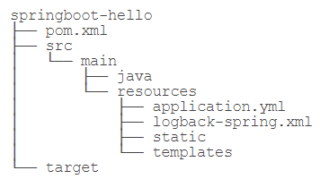

# Spring Boot

### 基础

1，文件结构



* Spring Boot默认的配置文件采用[YAML](https://yaml.org/)格式而不是`.properties`格式，文件名必须是`application.yml`而不是其他名称。YAML是一种层级格式，去掉了大量重复的前缀，并且更加易读。

    YAML可以读取环境变量：`${DB_HOST:localhost}`，首先从环境变量查找`DB_HOST`，如果环境变量定义了，那么使用环境变量的值，否则，使用默认值`localhost`。实际线上运行的时候只需要传入环境变量即可:` java -jar xxx.jar -DB_HOST=10.0.1.123 --DB_USER=prod --DB_PASSWORD=xxxx `

    ```yaml 
    spring:
      application:
        name: ${APP_NAME:unnamed}
      datasource:
        url: jdbc:hsqldb:file:testdb
    ```

* logback-spring.xml是Spring Boot的logback配置文件名称

* `static`是静态文件目录，`templates`是模板文件目录，注意它们不再存放在`src/main/webapp`下，而是直接放到`src/main/resources`这个classpath目录，因为在Spring Boot中已经不需要专门的webapp目录了。

* 在存放源码的`src/main/java`目录中，Spring Boot要求`main()`方法所在的启动类必须放到根package下，命名不做要求。

    启动Spring Boot应用程序需要加上注解`@SpringBootApplication`，该注解实际上又包含了：`@SpringBootConfiguration,@EnableAutoConfiguration,@ComponentScan`，相当于启动了自动配置和自动扫描。

    ```java
    @SpringBootApplication
    public class Application {
        public static void main(String[] args) throws Exception {
            SpringApplication.run(Application.class, args);
        }
    }
    ```

* pom.xml为maven配置文件，使用Spring Boot时，推荐从`spring-boot-starter-parent`继承，因为这样就可以引入Spring Boot的预置配置。Spring包含的组件无需指定版本号，因为引入的`<parent>`内已经指定了，只有自己引入的某些第三方jar包需要指定版本号。

* 定义的数据源、声明式事务、JdbcTemplate，通过AutoConfiguration可以直接注入到自己编写的`Service`中，无需手动处理。

    1，当引入`spring-boot-starter-jdbc`时，启动时会自动扫描所有的`XxxAutoConfiguration`：

    - `DataSourceAutoConfiguration`：自动创建一个`DataSource`，其中配置项从`application.yml`的`spring.datasource`读取；
    - `DataSourceTransactionManagerAutoConfiguration`：自动创建了一个基于JDBC的事务管理器；
    - `JdbcTemplateAutoConfiguration`：自动创建了一个`JdbcTemplate`。

    2，当引入`spring-boot-starter-web`时，自动创建了：

    - `ServletWebServerFactoryAutoConfiguration`：自动创建一个嵌入式Web服务器，默认是Tomcat；
    - `DispatcherServletAutoConfiguration`：自动创建一个`DispatcherServlet`；
    - `HttpEncodingAutoConfiguration`：自动创建一个`CharacterEncodingFilter`；
    - `WebMvcAutoConfiguration`：自动创建若干与MVC相关的Bean。
    - ...

    3，当引入第三方`pebble-spring-boot-starter`时，自动创建了：

    - `PebbleAutoConfiguration`：自动创建了一个`PebbleViewResolver`。

    Spring Boot大量使用`XxxAutoConfiguration`来使得许多组件被自动化配置并创建，而这些创建过程又大量使用了Spring的Conditional功能。在不同场景下通过Conditional判断当前环境是否满足当前`XxxAutoConfiguration`的运行条件，满足则启动自动装配。Spring Boot自动装配功能是通过自动扫描+条件装配实现的，这一套机制在默认情况下工作得很好，但是，如果要手动控制某个Bean的创建，就需要详细地了解Spring Boot自动创建的原理，很多时候还要跟踪`XxxAutoConfiguration`，以便设定条件使得某个Bean不会被自动创建。

### 开发工具

1，Spring Boot提供了一个开发者工具，可以监控classpath路径上的文件。只要源码或配置文件发生修改，Spring Boot应用可以自动重启。默认配置下，针对`/static`、`/public`和`/templates`目录中的文件修改，不会自动重启，因为禁用缓存后，这些文件的修改可以实时更新。

```xml
<dependency>
    <groupId>org.springframework.boot</groupId>
    <artifactId>spring-boot-devtools</artifactId>
</dependency>
```

2，打包软件

pom.xml配置

```xml
<build>
     <finalName>MyAppName</finalName>
       <plugins>
            <plugin>
                <groupId>org.springframework.boot</groupId>
                <artifactId>spring-boot-maven-plugin</artifactId>
            </plugin>
       </plugins>
</build>
```

执行以下Maven命令即可打包：

```
$ mvn clean package
```

打包后可以在`target`目录下可以看到两个jar文件：`MyAppName.jar.original`是Maven标准打包插件打的jar包，它只包含自己的Class，不包含依赖，而`MyAppName.jar`是Spring Boot打包插件创建的包含依赖的jar，可以直接运行：` java -jar MyAppName.jar`

2，使用`spring-boot-thin-launcher`只打包自己编写的代码，同时又自动把依赖包下载到某处，并自动引入到classpath中。解决打包文件臃肿的问题。

```xml
<build>
        <finalName>MyAppName</finalName>
        <plugins>
            <plugin>
                <groupId>org.springframework.boot</groupId>
                <artifactId>spring-boot-maven-plugin</artifactId>
                <dependencies>
                    <dependency>
                        <groupId>org.springframework.boot.experimental</groupId>
                        <artifactId>spring-boot-thin-layout</artifactId>
                        <version>1.0.27.RELEASE</version>
                    </dependency>
                </dependencies>
            </plugin>
        </plugins>
</build>
```

直接运行`java -jar MyAppName.jar`，效果和未删减依赖完全一样。实际上`spring-boot-thin-launcher`这个插件改变了`spring-boot-maven-plugin`的默认行为。它输出的jar包只包含我们自己代码编译后的class，一个很小的`ThinJarWrapper`，以及解析`pom.xml`后得到的所有依赖jar的列表。运行的时候，入口实际上是`ThinJarWrapper`，它会先在指定目录搜索看看依赖的jar包是否都存在，如果不存在，先从Maven中央仓库下载到本地，然后，再执行我们自己编写的`main()`入口方法。

`spring-boot-thin-launcher`在启动时搜索的默认目录是用户主目录的`.m2`，也可以指定下载目录，将下载目录指定为当前目录：``$ java -Dthin.root=. -jar MyAppName.jar`。通过环境变量`thin.root`传入当前目录，执行后发现当前目录下自动生成了一个`repository`目录，它仅包含`MyAppName.jar`所需的运行期依赖项。

第一次在服务器上运行`MyAppName.jar`时，仍需要从Maven中央仓库下载大量的jar包，``spring-boot-thin-launcher`还提供了一个`dryrun`选项，专门用来下载依赖项而不执行实际代码：`java -Dthin.dryrun=true -Dthin.root=. -jar MyAppName.jar`，执行上述代码会在当前目录创建`repository`目录，并下载所有依赖项，但并不会运行我们编写的`main()`方法。此过程称之为“预热”（warm up）。如果服务器由于安全限制不允许从外网下载文件，那么可以在本地预热，然后把`MyAppName.jar`和`repository`目录上传到服务器。只要依赖项没有变化，后续改动只需要上传`MyAppName.jar`即可。

### Actuator

1，使用JMX需要把一些监控信息以MBean的形式暴露给JMX Server，而Spring Boot已经内置了一个监控功能，它叫Actuator。

2，依赖：

```xml
<dependency>
    <groupId>org.springframework.boot</groupId>
    <artifactId>spring-boot-starter-actuator</artifactId>
</dependency>
```

3，然后正常启动应用程序，Actuator会把它能收集到的所有信息都暴露给JMX。此外，Actuator还可以通过URL`/actuator/`挂载一些监控点，`http://localhost:8080/actuator/health`，可以查看应用程序当前状态，用于探测后端集群应用是否存活。Actuator默认把所有访问点暴露给JMX，但处于安全原因，只有`health`和`info`会暴露给Web。要暴露更多的访问点给Web，需要在`application.yml`中加上配置,要特别注意暴露的URL的安全性

```yaml
management:
  endpoints:
    web:
      exposure:
        include: info, health, beans, env, metrics
```

### Profiles

1，Profile表示一个环境的概念，如开发、测试和生产这3个环境：native，test，production。在启动一个Spring应用程序的时候，可以传入一个或多个环境：`java -Dspring.profiles.active=test -jar MyApp.jar`，如果不指定就就是用默认配置。

2，Spring Boot可以在`application.yml`中为每个环境进行配置。

```yaml
spring:
  application:
    name: ${APP_NAME:unnamed}
  datasource:
    url: jdbc:hsqldb:file:testdb
    username: sa
    password:
    dirver-class-name: org.hsqldb.jdbc.JDBCDriver
    hikari:
      auto-commit: false
      connection-timeout: 3000
      validation-timeout: 3000
      max-lifetime: 60000
      maximum-pool-size: 20
      minimum-idle: 1

pebble:
  suffix:
  cache: false

server:
  port: ${APP_PORT:8080}

---

spring:
  profiles: test

server:
  port: 8000

---

spring:
  profiles: production

server:
  port: 80

pebble:
  cache: true
```

不同环境类型用分隔符`---`分离，最前面的配置是默认配置，不需要指定Profile，后面的每段配置都必须以`spring.profiles: xxx`开头，表示一个Profile。非默认值配置只是修改申明的项，其余的沿用默认配置。

3，Spring Boot可以在通过`@Profile()`为`JavaBean`指明类型，根据环境类型，创建不同的`JavaBean`

```java
public interface StorageService {
    // 根据URI打开InputStream:
    InputStream openInputStream(String uri) throws IOException;
    // 根据扩展名+InputStream保存并返回URI:
    String store(String extName, InputStream input) throws IOException;
}
```

```java
@Component
// 默认启用本地存储实现
@Profile("default")
public class LocalStorageService implements StorageService {
    @Value("${storage.local:/var/static}")
    String localStorageRootDir;
    private File localStorageRoot;

    @PostConstruct
    public void init() {
        doSomething();
    }
    @Override
    public InputStream openInputStream(String uri) throws IOException {
		doSomething();
    }
    @Override
    public String store(String extName, InputStream input) throws IOException {
        doSomething();
    }
}
```

```java
@Component
// 非默认使用云端存储
@Profile("!default")
public class CloudStorageService implements StorageService {
    @Value("${storage.cloud.bucket:}")
    String bucket;
    @Value("${storage.cloud.access-key:}")
    String accessKey;
    @Value("${storage.cloud.access-secret:}")
    String accessSecret;

     @PostConstruct
    public void init() {
        doSomething();
    }
    @Override
    public InputStream openInputStream(String uri) throws IOException {
		doSomething();
    }
    @Override
    public String store(String extName, InputStream input) throws IOException {
        doSomething();
    }
}

```

自动装配

```java
@AutoWired
StorageService storageService
```

### Conditional

1，Profile能根据不同的Profile进行条件装配，但是Profile控制比较糙，如果想要精细控制可以使用原生的条件装配`@Conditional`，但是要自己编写比较复杂的`Condition`来做判断；也可以使用Spring Boot准备好了几个非常有用的条件：

- @ConditionalOnProperty：从application.yml读取配置，如果有指定的配置，条件生效；

    `@ConditionalOnProperty(value = "storage.type", havingValue = "local", matchIfMissing = true)`

- @ConditionalOnBean：如果有指定的Bean，条件生效；

- @ConditionalOnMissingBean：如果没有指定的Bean，条件生效；

- @ConditionalOnMissingClass：如果没有指定的Class，条件生效；

- @ConditionalOnWebApplication：在Web环境中条件生效；

- @ConditionalOnExpression：根据表达式判断条件是否生效。

### 加载配置文件

1，载配置文件可以直接使用注解`@Value`，在不同文件多次引用同一个`@Value`不但麻烦，而且`@Value`使用字符串，缺少编译器检查，容易造成多处引用不一致。

Spring Boot允许创建一个Bean，持有一组配置，并由Spring Boot自动注入。

```yml
# YAML配置
storage:
  local:
    # 文件存储根目录:
    root-dir: ${STORAGE_LOCAL_ROOT:/var/storage}
    # 最大文件大小，默认100K:
    max-size: ${STORAGE_LOCAL_MAX_SIZE:102400}
    # 是否允许空文件:
    allow-empty: false
    # 允许的文件类型:
    allow-types: jpg, png, gif
```

```java
// 定义一个Java Bean，持有该组配置。
// Configuration表面StorageConfiguration也是一个Spring管理的Bean，可直接注入到其他Bean中
@Configuration
// 表示将从配置项storage.local读取该项的所有子项配置
@ConfigurationProperties("storage.local")
public class StorageConfiguration {
    //保证Java Bean的属性名称与配置一致:YAML单词全小写，用‘-’连接，Java变量名采用驼峰命名。
    private String rootDir;
    private int maxSize;
    private boolean allowEmpty;
    private List<String> allowTypes;
    // TODO: getters and setters
}
```

```java
@Component
public class StorageService {
    // 注入到其他Bean中,因为只需要注入StorageConfiguration这个Bean，这样可以由编译器检查类型，无需编写重复的@Value注解
    @Autowired
    StorageConfiguration storageConfig;
}
```

### 禁用自动配置

1，用`exclude`指定需要关掉的自动配置，需要手动创建需要的组件，如果未添加`@Configuration`和`@Component`，要使之生效，可以使用`@Import`导入到IOC容器。

```java
@SpringBootApplication
// 启动自动配置，但排除指定的自动配置:
@EnableAutoConfiguration(exclude = DataSourceAutoConfiguration.class)
// 手动注入手动创建的组件到IOC容器
@Import({ MasterDataSourceConfiguration.class, SlaveDataSourceConfiguration.class})
public class Application {
    ...
}
```

### Filter

1，Spring Boot会自动扫描所有的`FilterRegistrationBean`类型的Bean，然后，将它们返回的`Filter`自动注册到Servlet容器中，无需任何配置。

`FilterRegistrationBean`本身不是`Filter`，它实际上是`Filter`的工厂。Spring Boot会调用`getFilter()`，把返回的`Filter`注册到Servlet容器中。因为我们可以在`FilterRegistrationBean`中注入需要的资源，然后，在返回的`AuthFilter`中，这个内部类可以引用外部类的所有字段（闭包），整个过程完全基于Spring的IoC容器完成。

```java
// 给多个Filter排序，数字小的在前面
@Order(10)
@Component
public class AuthFilterRegistrationBean extends FilterRegistrationBean<Filter> {
    @Autowired
    UserService userService;

    @Override
    public Filter getFilter() {
        return new AuthFilter();
    }

    class AuthFilter implements Filter {
        ...
    }
}
```

```java
@Order(20)
@Component
public class ApiFilterRegistrationBean extends FilterRegistrationBean<Filter> {
    // 在@PostConstruct方法中，通过setFilter()设置一个Filter实例后，再调用setUrlPatterns()传入要过滤的URL列表。
    @PostConstruct
    public void init() {
        setFilter(new ApiFilter());
        setUrlPatterns(List.of("/api/*"));
    }

    class ApiFilter implements Filter {
        ...
    }
}
```

### Open API

1，[Open API](https://www.openapis.org/)是一个标准，它的主要作用是描述REST API，既可以作为文档给开发者阅读，又可以让机器根据这个文档自动生成客户端代码等。

2，在`pom.xml`中加入以下依赖，自动扫描`@RestController`标注的Controller，生成URL对应的方法的文档，在http://localhost:8080/swagger-ui.html访问。

```xml
org.springdoc:springdoc-openapi-ui:1.4.0
```

3，给API加入一些描述信息,用于生成API文档的描述信息，该API文档总是和代码保持同步，大大简化了文档的编写工作。

```java
// @Operation可以对API进行描述
@Operation(summary = "Get specific user object by it's id.")
@GetMapping("/users/{id}")
// @Parameter可以对参数进行描述
public User user(@Parameter(description = "id of the user.") @PathVariable("id") long id) {
    return userService.getUserById(id);
}
```

### RabbitMQ

1，AMQP是一种使用广泛的独立于语言的消息协议，它的全称是Advanced Message Queuing Protocol，即高级消息队列协议，它定义了一种二进制格式的消息流，任何编程语言都可以实现该协议。

2，MQP协议只有Queue，没有Topic，并且引入了Exchange的概念。当Producer想要发送消息的时候，它将消息发送给Exchange，由Exchange将消息根据各种规则投递到一个或多个Queue。

如果某个Exchange总是把消息发送到固定的Queue，那么这个消息通道就相当于JMS的Queue。如果某个Exchange把消息发送到多个Queue，那么这个消息通道就相当于JMS的Topic。和JMS的Topic相比，Exchange的投递规则更灵活，路由规则称之为Binding，通常都在RabbitMQ的管理后台设置，在传递消息时指定Routing Key，RabbitMQ根据对应exchange设定的规则将消息发送到指定的Queue。

要实现一对多的投递就必须自己配置Exchange。直接指定一个Queue并投递消息也是可以的，此时指定Routing Key为Queue的名称即可，因为RabbitMQ提供了一个`default exchange`用于根据Routing Key查找Queue并直接投递消息到指定的Queue。


