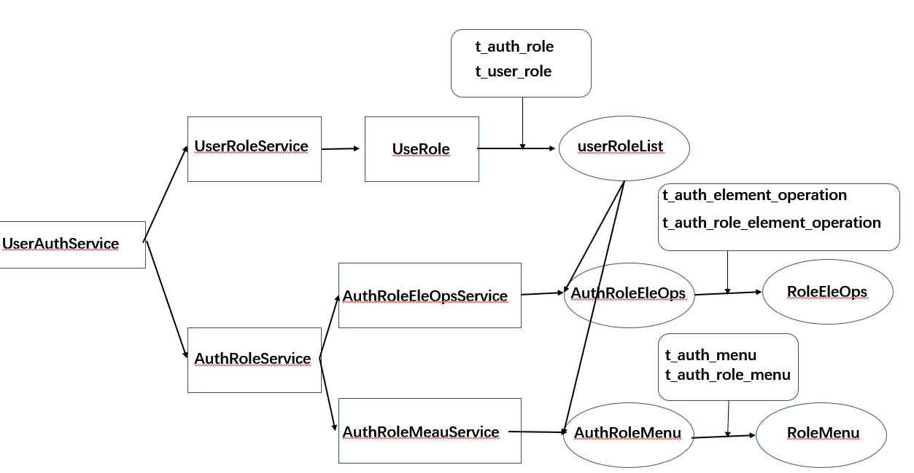
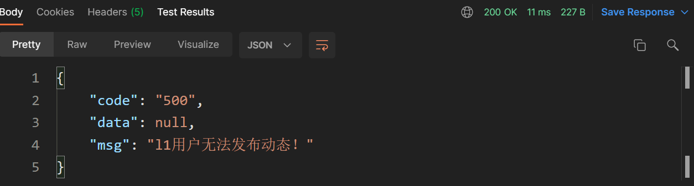
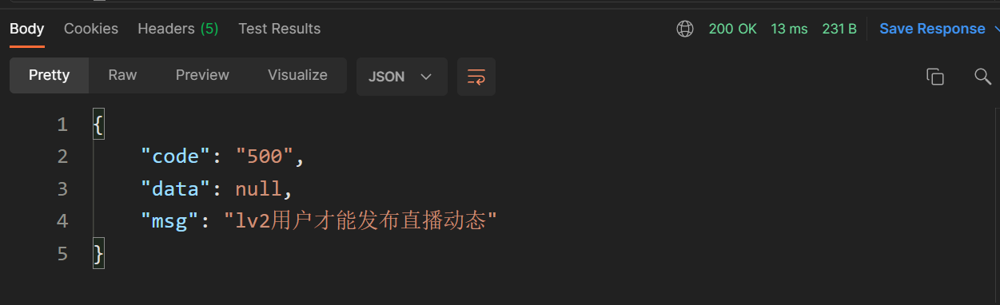
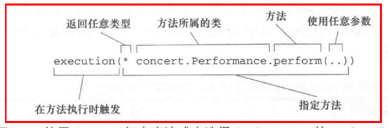
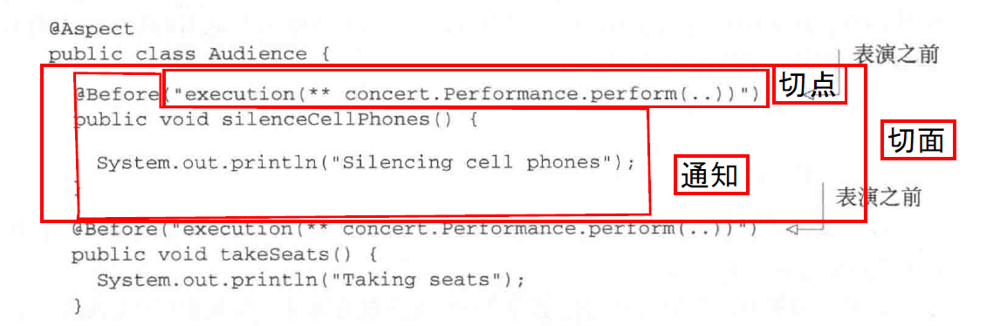

[TOC]

### 权限管理

##### RBAC模型

1，控制用户对系统资源（URI）的操作。前端的权限控制：对页面或页面元素的权限控制。后端的权限控制：对接口及数据的权限控制。

访问权限：哪些页面可以访问、哪些页面元素可见等等；操作权限：如页面按钮是否可点击、是否可以增删改查等等；接口与数据权限：接口是否可以调用、接口具体字段范围等等。

2，RBAC权限控制模型（Role-Based Access Control）：基于角色的权限控制。RBAC模型的层级由低到高为：RBAC0、RBAC1、RBAC2、RBAC3。RBAC权限模型核心授权逻辑如下：某用户是什么角色；某角色具有什么权限；通过角色的权限推导用户的权限。

一个用户有一个或多个角色；一个角色包含多个用户；一个角色有多种权限；一个权限属于多个角色。用户：注册用户；角色：Lv0~Lv2会员；权限：视频投稿、发布动态、各种弹幕功能等等的权限；资源：页面、页面元素；操作：按钮点击、页面跳转、数据增删改查等等。

##### 数据表设计

1，四张核心表，三张关联表。后续权限变更只需要更改连接表，关键信息表不变，方便拓展。


2，核心表：用户表存储用户（`id`，`phone`）；角色表存储可选的用户等级（lv0，lv1，lv2）；页面元素操作表存储可对前端页面上某个元素进行的操作(比如可点击的上传视频按钮)；页面访问表存储页面（比如购买邀请码的页面）。为加速查询为经常匹配字段建立索引。

```sql
-- ----------------------------
-- Table structure for t_auth_role
-- ----------------------------
DROP TABLE IF EXISTS `t_auth_role`;
CREATE TABLE `t_auth_role` (
    `id` bigint NOT NULL AUTO_INCREMENT COMMENT '主键id',
    `name` varchar(255) CHARACTER SET utf8mb4 COLLATE utf8mb4_0900_ai_ci DEFAULT NULL COMMENT '角色名称',
    `code` varchar(50) CHARACTER SET utf8mb4 COLLATE utf8mb4_0900_ai_ci DEFAULT NULL COMMENT '角色唯一编码',
    `createTime` datetime DEFAULT NULL COMMENT '创建时间',
    `updateTime` datetime DEFAULT NULL COMMENT '更新时间',
    PRIMARY KEY (`id`) USING BTREE
) ENGINE=InnoDB AUTO_INCREMENT=4 DEFAULT CHARSET=utf8mb4 COLLATE=utf8mb4_0900_ai_ci ROW_FORMAT=DYNAMIC COMMENT='权限控制--角色表';

-- ----------------------------
-- Table structure for t_auth_menu
-- ----------------------------
DROP TABLE IF EXISTS `t_auth_menu`;
CREATE TABLE `t_auth_menu` (
    `id` bigint NOT NULL AUTO_INCREMENT COMMENT '主键id',
    `name` varchar(255) CHARACTER SET utf8mb4 COLLATE utf8mb4_0900_ai_ci DEFAULT NULL COMMENT '菜单项目名称',
    `code` varchar(50) CHARACTER SET utf8mb4 COLLATE utf8mb4_0900_ai_ci DEFAULT NULL COMMENT '唯一编码',
    `createTime` datetime DEFAULT NULL COMMENT '创建时间',
    `updateTime` datetime DEFAULT NULL COMMENT '更新时间',
    PRIMARY KEY (`id`) USING BTREE
) ENGINE=InnoDB AUTO_INCREMENT=4 DEFAULT CHARSET=utf8mb4 COLLATE=utf8mb4_0900_ai_ci ROW_FORMAT=DYNAMIC COMMENT='权限控制-页面访问表';

-- ----------------------------
-- Table structure for t_auth_element_operation
-- ----------------------------
DROP TABLE IF EXISTS `t_auth_element_operation`;
CREATE TABLE `t_auth_element_operation` (
    `id` bigint NOT NULL AUTO_INCREMENT COMMENT '主键id',
    `elementName` varchar(255) CHARACTER SET utf8mb4 COLLATE utf8mb4_0900_ai_ci DEFAULT NULL COMMENT '页面元素名称',
    `elementCode` varchar(50) CHARACTER SET utf8mb4 COLLATE utf8mb4_0900_ai_ci DEFAULT NULL COMMENT '页面元素唯一编码',
    `operationType` varchar(5) CHARACTER SET utf8mb4 COLLATE utf8mb4_0900_ai_ci DEFAULT NULL COMMENT '操作类型：0可点击  1可见',
    `createTime` datetime DEFAULT NULL COMMENT '创建时间',
    `updateTime` datetime DEFAULT NULL COMMENT '更新时间',
    PRIMARY KEY (`id`) USING BTREE
) ENGINE=InnoDB AUTO_INCREMENT=2 DEFAULT CHARSET=utf8mb4 COLLATE=utf8mb4_0900_ai_ci ROW_FORMAT=DYNAMIC COMMENT='权限控制--页面元素操作表';
```

3，连接表：用户-角色关联表`t_user_role`存储用户与角色的关联关系（指明用户所处等级）；角色-元素操作关联表`t_auth_role_element_operation`存储角色与页面元素操作间关联（指明不同等级与不同可操作元素间关系，比如lv0不能点击视频上传按钮，lv1可以点击）；角色-页面关联表`t_auth_role_menu`存储角色与可访问页面的关系(指明角色与页面间的可访问关系，比如lv0不能访问邀请码购买页面，lv1可以正常访问)。由于关联表关联两个表的主键，需要添加外键约束。同时为加速查询为经常匹配字段建立索引。

```sql
-- ----------------------------
-- Table structure for t_user_role
-- ----------------------------
DROP TABLE IF EXISTS `t_user_role`;
CREATE TABLE `t_user_role` (
    `id` bigint NOT NULL AUTO_INCREMENT,
    `userId` bigint DEFAULT NULL COMMENT '用户id',
    `roleId` bigint DEFAULT NULL COMMENT '角色id',
    `createTime` datetime DEFAULT NULL COMMENT '创建时间',
    PRIMARY KEY (`id`) USING BTREE,
    INDEX  userId_index ( `userId`)
) ENGINE=InnoDB AUTO_INCREMENT=4 DEFAULT CHARSET=utf8mb4 COLLATE=utf8mb4_0900_ai_ci ROW_FORMAT=DYNAMIC COMMENT='用户角色关联表';
alter table `t_user_role` add constraint FK_user_role_userId foreign key (`userId`) references `t_user`(`id`);
alter table `t_user_role` add constraint FK_user_role_roleId foreign key (`roleId`) references `t_auth_role`(`id`);

-- ----------------------------
-- Table structure for t_auth_role_element_operation
-- ----------------------------
DROP TABLE IF EXISTS `t_auth_role_element_operation`;
CREATE TABLE `t_auth_role_element_operation` (
    `id` bigint NOT NULL AUTO_INCREMENT COMMENT '主键id',
    `roleId` bigint DEFAULT NULL COMMENT '角色id',
    `elementOperationId` bigint DEFAULT NULL COMMENT '元素操作id',
    `createTime` datetime DEFAULT NULL COMMENT '创建时间',
    PRIMARY KEY (`id`) USING BTREE,
    INDEX  roleId_index ( `roleId`)
) ENGINE=InnoDB AUTO_INCREMENT=2 DEFAULT CHARSET=utf8mb4 COLLATE=utf8mb4_0900_ai_ci ROW_FORMAT=DYNAMIC COMMENT='权限控制--角色与元素操作关联表';
alter table `t_auth_role_element_operation` add constraint FK_role_element_operation_roleId foreign key (`roleId`) references `t_auth_role`(`id`);
alter table `t_auth_role_element_operation` add constraint FK_role_element_operation_elementOperationId foreign key (`elementOperationId`) references `t_auth_element_operation`(`id`);

-- ----------------------------
-- Table structure for t_auth_role_menu
-- ----------------------------
DROP TABLE IF EXISTS `t_auth_role_menu`;
CREATE TABLE `t_auth_role_menu` (
    `id` bigint NOT NULL AUTO_INCREMENT COMMENT '主键id',
    `roleId` bigint DEFAULT NULL COMMENT '角色id',
    `menuId` bigint DEFAULT NULL COMMENT '页面菜单id',
    `createTime` datetime DEFAULT NULL COMMENT '创建时间',
    PRIMARY KEY (`id`) USING BTREE,
    INDEX  roleId_index ( `roleId`)
) ENGINE=InnoDB AUTO_INCREMENT=3 DEFAULT CHARSET=utf8mb4 COLLATE=utf8mb4_0900_ai_ci ROW_FORMAT=DYNAMIC COMMENT='权限控制--角色页面菜单关联表';
alter table `t_auth_role_menu` add constraint FK_role_menu_roleId foreign key (`roleId`) references `t_auth_role`(`id`);
alter table `t_auth_role_menu` add constraint FK_role_menu_menuId foreign key (`menuId`) references `t_auth_menu`(`id`);

```

##### 级联查询

1，为方便之后根据关联表查询到与之关联表的内容，使用级联查询， 免得需要右表内容时再去数据库查询，加快响应速度，同时查询出对象体积变大，增大了存储需求，如果被包含对象体积较大，在大量查询时会带来较大压力。

级联查询：先确定所连接的表，再确定所要查询的字段，确定连接条件以及连接方式

* inner join返回两个表基于连接条件实际匹配的行，即两个表交集。outer join返回两个表的并集结果，即匹配条件不满足的两个表的记录也将返回，mysql没有outer join 相关语句，但可以对left join和right join的结果用union连接来实现。

  ```sql
  select * from A a inner join B b on a.ID = b.ID;
  select * from A a left join B b on a.ID = b.ID union select * from A a right join B b on a.ID = b.ID;
  ```

* left join表示左侧表所有记录都将返回，并且不满足匹配条件的右侧连接表记录将返回null。

  ```sql
  select * from A a left join B b on a.ID = b.ID;
  ```

* right join与left join恰恰相反，表示右侧表所有记录都将返回，并且不满足匹配条件的左侧连接表记录将返回null。

  ```sql
  select * from A a right join B b on a.ID = b.ID;
  ```

  

2，ibatis下级联查询实现

由于涉及到两张表，所以存在两个数据bean，常见做法是将右表bean放入左表bean，最后返回左表bean。如果右表字段较少，直接将右表字段直接加入左表bean。

```sql
<--右表字段较少，直接将右表字段直接加入左表bean。-->
<select id="getUserRoleByUserId" parameterType="java.lang.Long" resultType="com.imooc.bilibili.domain.auth.UserRole">
    select
        ur.*,
        ar.name roleName,
        ar.code roleCode
    from
        t_user_role ur
        left join t_auth_role ar on ur.roleId = ar.id
    where
        ur.userId = #{userId}
</select>
```

如果右表结构复杂，需要设定resultMap将返回的多个平铺字段构建为右表bean，再嵌入左表bean返回。

```sql
<--定义复合结构组装方式-->
<resultMap id="AuthElementOperationResultMap" type="com.imooc.bilibili.domain.auth.AuthRoleElementOperation">
    <!--左表字段        -->
    <id column="id" property="id"/>
    <id column="roleId" property="roleId"/>
    <id column="elementOperationId" property="elementOperationId"/>
    <!-- 将左表bean嵌入右表bean-->
    <association property="authElementOperation" javaType="com.imooc.bilibili.domain.auth.AuthElementOperation">
        <!--右表字段            -->
        <id column="elementName" property="elementName"/>
        <id column="elementCode" property="elementCode"/>
        <id column="operationType" property="operationType"/>
    </association>
</resultMap>

```

```sql
<--将返回的多个平铺字段构建为右表bean，再嵌入左表bean返回-->
<select id="getRoleElementOperationsByRoleIds" parameterType="java.util.Set"
        resultMap="AuthElementOperationResultMap">
    select
    areo.*,
    aeo.elementName,
    aeo.elementCode,
    aeo.operationType
    from
    t_auth_role_element_operation areo
    left join t_auth_element_operation aeo on areo.elementOperationId = aeo.id
    where
    areo.roleId in
    <foreach collection="roleIdSet" item="roleId" index="index" open="(" close=")" separator=",">
        #{roleId}
    </foreach>
</select>
```

##### 权限service结构

`UserAuthService`中通过`UserRoleService`实现获得用户角色(等级)信息`userRoleList`；通过`AuthRoleService`查询用户对应的`userRoleList`所拥有的页面元素操作权限`RoleEleOps`与后台数据操作权限`RoleMeau`。在获取到用户角色信息(等级信息)、页面元素操作权限信息、菜单操作权限信息后，前端就可以对按钮是否可点击做出限制，后端就可以根据预设权限规则对用户操作进行鉴权、拦截。



##### 权限验证

1，在进行后台操作前需要验证权限，无操作权限直接抛出异常并返回；验证成功才继续后续处理。上述流程对多个`controller`通用，可以使用面向切面编程，将通用功能抽取，避免重复代码，使被影响代码更加专注于业务逻辑的处理。

2，实现功能：lv1及以上用户页面上发表动态按钮才是可点击的，并且lv2用户才可发表直播信息动态。对于按钮可点击限制，可能存在用户绕过前端无法点击按钮的限制直接访问接口的情形，定义注解`ApiLimitedRole`用于拦截lv0用户直接访问发送动态接口的情形。定义注解`DataLimitedAspect`用于拦截lv1用户发送直播动态的情形。

```java
@Retention(RetentionPolicy.RUNTIME)
@Target({ElementType.METHOD})
@Documented
@Component
public @interface ApiLimitedRole {
	// 被限制访问的等级，类似和名单
    String[] limitedRoleCodeList() default {};
}
```

```java
@Retention(RetentionPolicy.RUNTIME)
@Target({ElementType.METHOD})
@Documented
@Component
public @interface DataLimited {

}
```

3，定义切面`ApiLimitedRoleAspect`，拦截有`ApiLimitedRole`注解的方法，在进行业务的执行之前根据传入注解的限制等级集合，验证当前用户是否在黑名单中，如果在将报异常，否则正常进行后续流程。

```java
@Order(1)
@Component
@Aspect
public class ApiLimitedRoleAspect {

    @Autowired
    private UserSupport userSupport;

    @Autowired
    private UserRoleService userRoleService;

    // 拦截带有ApiLimitedRole的方法
    @Pointcut("@annotation(com.imooc.bilibili.domain.annotation.ApiLimitedRole)")
    public void check() {
    }

    // 在带有ApiLimitedRole注解的方法执行前进行前置处理
    @Before("check() && @annotation(apiLimitedRole)")
    public void doBefore(JoinPoint joinPoint, ApiLimitedRole apiLimitedRole) {
        Long userId = userSupport.getCurrentUserId();
        // 用户等级ID
        List<UserRole> userRoleList = userRoleService.getUserRoleByUserId(userId);
        // 黑名单等级ID集合
        String[] limitedRoleCodeList = apiLimitedRole.limitedRoleCodeList();
        Set<String> limitedRoleCodeSet = Arrays.stream(limitedRoleCodeList).collect(Collectors.toSet());
        Set<String> roleCodeSet = userRoleList.stream().map(UserRole::getRoleCode).collect(Collectors.toSet());
        // 求交集，如果用户等级在黑名单中roleCodeSet，交集非空
        roleCodeSet.retainAll(limitedRoleCodeSet);
        if (roleCodeSet.size() > 0) {
            throw new ConditionException("权限不足！");
        }
    }
}

```

定义切面`DataLimitedAspect`，拦截有`DataLimited`注解的方法，在进行业务的执行之前判断拦截当前用户等级低于lv2且发送的动态类型为直播动态的情形，否则正常进行后续流程。

```java
@Order(1)
@Component
@Aspect
public class DataLimitedAspect {

    @Autowired
    private UserSupport userSupport;

    @Autowired
    private UserRoleService userRoleService;

    // 拦截带有DataLimitedAspect的方法
    @Pointcut("@annotation(com.imooc.bilibili.domain.annotation.DataLimited)")
    public void check() {
    }

    // 在带有DataLimitedAspect注解的方法执行前进行前置处理
    @Before("check()")
    public void doBefore(JoinPoint joinPoint) {
        Long userId = userSupport.getCurrentUserId();
        // 用户等级ID
        List<UserRole> userRoleList = userRoleService.getUserRoleByUserId(userId);
        // 用户等级ID对应的编码
        Set<String> roleCodeSet = userRoleList.stream().map(UserRole::getRoleCode).collect(Collectors.toSet());
        Object[] args = joinPoint.getArgs();
        // 遍历被注解方法参数，只对发布动态的方法起作用
        for (Object arg : args) {
            if (arg instanceof UserMoment) {
                UserMoment userMoment = (UserMoment) arg;
                String type = userMoment.getType();
                // 发布直播动态且等级非lv2将报权限异常
                if ("2".equals(type) && !roleCodeSet.contains(AuthRoleConstant.ROLE_LV2)) {
                    throw new ConditionException("lv2用户才能发布直播动态");
                }
            }
        }
    }
}
```

在需要权限验证的地方添加注解

```java
@ApiLimitedRole(limitedRoleCodeList = {AuthRoleConstant.ROLE_LV0})
@DataLimited
@PostMapping("/user-moments")
public JsonResponse<String> addUserMoments(@RequestBody UserMoment userMoment) throws Exception 
```

对于等级为0的用户发表动态时将提示权限不足：



对于等级为1的用户发表直播动态时时也将提示权限不足：



针对后续功能不断丰富，权限越来越多的情形，可以使用权限组的概念，同一个权限组中的不同用户拥有一系列相同的权限，简化多个权限挨个判断的情形。

##### AOP

1，常用功能分离形成可重用组件（日志），减少系统的重复代码，降低模块间的耦合度，集中管理维护方便，声明式（切面构成、将功能应用到要影响的组件中，无需修改受影响的类）编程较少模板代码，解耦，有利于未来的可拓展性和可维护性；核心代码更关注业务逻辑（高内聚、简单），无感知；

2，静态代理（在编译阶段就可生成 AOP 代理类，AspectJ），动态代理（spring AOP:运行时借助于JDK动态代理、CGLIB等在内存中“临时”生成AOP动态代理类,final修饰的类不能被代理，同样static和final修饰的方法也不会代理，因为static和final方法是不能被覆盖的）


3，通知（什么+时机）：定义切面功能与出发时机；（bofore,after,around等）。连接点：程序中能够插入切面的点（方法调用、抛出异常），通过切入点添加新功能。切点（何处）：表达式匹配要织入的连接点。切面（是什么+何时+何处）=通知+切点。织入：把切面应用到目标对象并创建代理对象的过程，运行期：创建动态代理、springAOP。

##### springAOP

1，jdk动态代理：拦截接口方法，创建接口的代理实例，只支持方法连接点只能拦截方法；代理类包裹目标类，拦截方法调用，执行切面逻辑，转发给真正的bean。核心InvocationHandler接口和Proxy类，InvocationHandler 通过invoke()方法反射来调用目标类中的代码，动态地将横切逻辑和业务编织在一起；接着，Proxy利用 InvocationHandler动态创建一个符合某一接口的的实例, 生成目标类的代理对象。

定义一个InvocationHandler实例，它负责实现接口的方法调用->通过Proxy.newProxyInstance()创建interface实例，它需要3个参数：使用的ClassLoader，通常就是接口类的ClassLoader；需要实现的接口数组，至少需要传入一个接口进去；用来处理接口方法调用的InvocationHandler 实例->将返回的Object强制转型为接口。

```java
public class DynamicProxy {
    public static void main(String[] args) {
        // 普通学生类
        Student ordinaryStudents = new OrdinaryStudents();
        ordinaryStudents.write();

        /**
         *  InvocationHandler作用就是，当代理对象的原本方法被调用的时候，会重定向到一个方法，
         *  这个方法就是InvocationHandler里面定义的内容，同时会替代原本方法的结果返回。
         *  InvocationHandler接收三个参数：proxy，代理后的实例对象。 method，对象被调用方法。args，调用时的参数。
         */
        InvocationHandler handler = (proxy, method, handlerArgs) -> {
            // 从定义write方法。
            if ("write".equals(method.getName())) {
                System.out.println("增强型学生write()执行前");
                method.invoke(ordinaryStudents, handlerArgs);
                System.out.println("增强型学生write()执行后");
                return null;
            }
            return null;
        };
        /**
         *  对这个实例对象代理生成一个代理对象。
         *  被代理后生成的对象，是通过People接口的字节码增强方式创建的类而构造出来的。它是一个临时构造的实现类的对象。
         *  loader和interfaces基本就是决定了这个类到底是个怎么样的类。InvocationHandler决定了这个代理类到底是多了什么功能.
         *  通过这些接口和类加载器，拿到这个代理类class。然后通过反射的技术复制拿到代理类的构造函数，
         *  最后通过这个构造函数new个一对象出来，同时用InvocationHandler绑定这个对象。
         *  最终实现可以在运行的时候才切入改变类的方法，而不需要预先定义它。
         */
        Student sonOfDistrict = (Student) Proxy.newProxyInstance(ordinaryStudents.getClass().getClassLoader(), ordinaryStudents.getClass().getInterfaces(), handler);
        sonOfDistrict.write();
    }
}
/**
 * 学生接口
 */
interface Student {
    void write();
}
/**
 * 普通学生
 */
class OrdinaryStudents implements Student {
    @Override
    public void write() {
        System.out.println("我在写作文!");
    }
}
```

2，cglib代理：目标对象不是接口，字节码生成代理类继承目标类，并覆盖其中特定方法并添加增强代码，所以final修饰的类不能被代理，同样static和final修饰的方法也不会代理。CGLib创建的代理对象性能比JDK动态代理创建的代理对象高很多，但花费的时间多，spectJ需要特定的编译器进行处理，而Spring AOP则无需特定的编译器处理，cglib适合单例的对象代理创建，jdk动态代理合多例的对象代理创建。

SpringBoot 2.x 开始，为了解决使用 JDK 动态代理可能导致的类型转化异常而默认使用 CGLIB。如果需要默认使用 JDK 动态代理可以通过配置项 spring.aop.proxy-target-class=false来进行修改。

```java
public class Dao {
    
    public void update() {
        System.out.println("PeopleDao.update()");
    }
}

public class DaoProxy implements MethodInterceptor {
    @Override
    public Object intercept(Object object, Method method, Object[] objects, MethodProxy proxy) throws Throwable {
        //Object表示要进行增强的对象
        //Method表示拦截的方法
        //Object[]数组表示参数列表，基本数据类型需要传入其包装类型，如int-->Integer、long-Long、double-->Double
        //MethodProxy表示对方法的代理，invokeSuper方法表示对被代理对象方法的调用
        System.out.println("Before Method Invoke");
        proxy.invokeSuper(object, objects);
        System.out.println("After Method Invoke");
        
        return object;
    }
}

public class CglibTest {

    public void testCglib() {

        DaoProxy daoProxy = new DaoProxy();
        Enhancer enhancer = new Enhancer();
        // setSuperclass表示设置要代理的类
        enhancer.setSuperclass(Dao.class);
        // setCallback表示设置回调即MethodInterceptor的实现类
        enhancer.setCallback(daoProxy);
        // 使用create()方法生成一个代理对象
        Dao dao = (Dao)enhancer.create();
        dao.update();
        dao.select();
    }
    
}
```

3，切点：切点的定义会匹配通知所要织入的一个或多个连接点，描述要连接的连接点进行匹配，这个点可以是调用方法时、抛出异常时、甚至修改一个字段时。切面代码可以利用这些点插入到应用的正常流程之中，并添加新的行为。spring AOP只能方法拦截(execution)。多条件与或非复杂逻辑，被影响的类无感知。





4，通过在代理类中包裹切面，Spring在运行期把切面织入到Spring管理的bean中。代理封装了目标类，并拦截被通知方法的调用，再把调用转发给真正的目标bean。当代理拦截到方法调用时，在调用目标bean方法之前，会执行切面逻辑。

直到应用需要被代理的bean时，Spring才创建代理对象。如果使用的是ApplicationContext的话，在ApplicationContext从BeanFactory中加载所有bean的时候，Spring才会创建被代理的对象。因为Spring运行时才创建代理对象，所以我们不需要特殊的编译器来织入SpringAOP的切面。

5，Spring AOP 属于运行时增强，动态代理，而 AspectJ 是编译时增强，静态代理。 Spring AOP 基于代理 (Proxying)，而 AspectJ 基于字节码操作 (Bytecode Manipulation)。AspectJ 最完整的 AOP 框架了，可以实现方法、等段等拦截，spring AOP功能受限，但是 Spring AOP 相对来说更简单，如果我们的切面比较少，那么两者性能差异不大。但是，当切面太多的话，最好选择 AspectJ ，它比 Spring AOP 快很多。