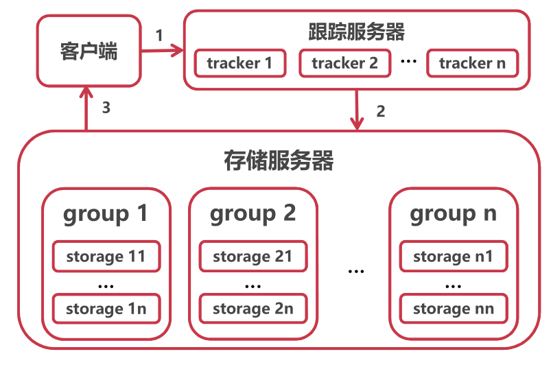

[toc]

### 文件上传

##### FastDFS

1，开源的轻量级分布式文件系统，通过集群扩展用于解决大数据量存储和负载均衡等问题。支持HTTP协议传输文件（结合Nginx）；对文件内容做Hash处理，节约磁盘空间；通过Nginx多tracker、多group、group下多存储主机实现负载均衡，整体性能较佳。适用中小型系统。

2，FastDFS的二个角色：跟踪服务器（Tracker）、存储服务器（Storage）。跟踪服务器：主要做调度工作，起到负载均衡的作用。它是客户端和存储服务器交互的枢纽，将数据请求落到某个group上。存储服务器：主要提供容量和备份服务，存储服务器是以组（Group）为单位，每个组内可以有多台存储服务器，数据互为备份。文件及属性（Meta Data）都保存在该服务器上。


3，安装

```shell
# 环境
yum install git gcc gcc-c++ make automake autoconf libtool pcre pcre-devel zlib zlib-devel openssl-devel wget vim -y

# 保存目录
mkdir /home/dfs #创建数据存储目录
cd /usr/local/src #切换到安装目录准备下载安装包

# 安装libfastcommon
git clone https://github.com/happyfish100/libfastcommon.git --depth 1
cd libfastcommon/
./make.sh && ./make.sh install #编译安装

# 安装FastDFS
cd ../ #返回上一级目录
git clone https://github.com/happyfish100/fastdfs.git --depth 1
cd fastdfs/
./make.sh && ./make.sh install #编译安装
#fastdfs配置文件准备，新版本下tracker.conf，storage.conf，client.conf已经存在不用再次复制
cp /etc/fdfs/tracker.conf.sample /etc/fdfs/tracker.conf
cp /etc/fdfs/storage.conf.sample /etc/fdfs/storage.conf
cp /etc/fdfs/client.conf.sample /etc/fdfs/client.conf #客户端文件，测试用
#nginx相关配置文件准备
cp /usr/local/src/fastdfs/conf/http.conf /etc/fdfs/ #供nginx访问使用
cp /usr/local/src/fastdfs/conf/mime.types /etc/fdfs/ #供nginx访问使用

# 安装fastdfs-nginx-module
cd ../ #返回上一级目录
git clone https://github.com/happyfish100/fastdfs-nginx-module.git --depth 1
cp /usr/local/src/fastdfs-nginx-module/src/mod_fastdfs.conf /etc/fdfs

# 安装nginx
wget http://nginx.org/download/nginx-1.15.4.tar.gz #下载nginx压缩包
tar -zxvf nginx-1.15.4.tar.gz #解压
cd nginx-1.15.4/
#添加fastdfs-nginx-module模块
./configure --add-module=/usr/local/src/fastdfs-nginx-module/src/ 
make && make install #编译安装

# tracker配置
vim /etc/fdfs/tracker.conf
#需要修改的内容如下
port=22122  # tracker服务器端口（默认22122,一般不修改）
base_path=/home/dfs  # 存储日志和数据的根目录

# storage配置
vim /etc/fdfs/storage.conf
#需要修改的内容如下
port=23000  # storage服务端口（默认23000,一般不修改）
base_path=/home/dfs  # 数据和日志文件存储根目录
store_path0=/home/dfs  # 第一个存储目录
tracker_server=tracker_server_ip:22122  # tracker服务器IP和端口
http.server_port=8888  # http访问文件的端口(默认8888,看情况修改,和nginx中保持一致)

# client测试
vim /etc/fdfs/client.conf
#需要修改的内容如下
base_path=/home/dfs
tracker_server=tracker_server_ip:22122    #tracker服务器IP和端口

# 配置nginx访问
vim /etc/fdfs/mod_fastdfs.conf
#需要修改的内容如下
tracker_server=tracker_server_ip:22122  #tracker服务器IP和端口
url_have_group_name=true
store_path0=/home/dfs
#配置nginx.config
vim /usr/local/nginx/conf/nginx.conf
#添加如下配置
server {
    listen       8888;    ## 该端口为storage.conf中的http.server_port相同
    server_name  localhost;
    location ~/group[0-9]/ {
        ngx_fastdfs_module;
    }
    error_page   500 502 503 504  /50x.html;
    location = /50x.html {
    root   html;
    }
}
```

将上述配置好的容器提交为镜像。

4，启动服务

* 启动容器：` docker  container run -it -p 8888:8888 -p 22122:22122 -p 23000:23000 -privileged --name fastdfs-nginx fastdfs-nginx:v1`

* 配置路由表：存储服务器在tracker中注册IP地址为容器的虚拟IP地址，当外界通过tracker获得储存服务器的地址时，由于是内部地址导致无法访问存储服务器。通过将请求tracker:22122的数据源地址修改为宿主机地址，当storage的注册请求发送到tracker上时，注册ip就变成宿主机ip，由此tracker在接收查询时也将返回数据集地址，以此保证服务在本地的可见性。

  `yum install iptables -y;`

  `iptables -t nat -A POSTROUTING -p tcp -m tcp --dport 22122 -d tracker_server_ip -j SNAT --to 宿主机IP`

* 注意tracker、nginx、storage配置文件中的`tracker_server_ip`要设置正确。

  启动tracker：`fdfs_trackerd /etc/fdfs/tracker.conf`

  启动storage：`fdfs_storaged /etc/fdfs/storage.conf`

  启动nginx：`/usr/local/nginx/sbin/nginx`

5，测试

* 测试fastdfs：`fdfs_upload_file /etc/fdfs/client.conf /usr/local/src/nginx-1.15.4.tar.gz`

* 测试nginx：`http://localhost:8888/XXXX.gz`

##### 代理

1，正向代理的特点：正向代理是代理客户端，为客户端收发请求，使真实客户端对服务器不可见。服务端不知道客户端、客户端知道服务端，隐藏真实客户端。为了从原始服务器取得内容，客户端向代理发送一个请求并指定目标(原始服务器)，然后代理向原始服务器转交请求并将获得的内容返回给客户端。由于代理对客户端是可感知的，所以必须要进行一些特别的设置才能使用正向代理。
优点：为在防火墙内的局域网客户端提供访问 Internet 的途径。可以做缓存，加速访问资源。对客户端访问授权，上网进行认证。代理可以记录用户访问。记录（上网行为管理），对外隐藏用户信息。


2，反向代理的特点：反向代理是代理服务器端，为服务器收发请求，使真实服务器对客户端不可见。服务端知道客户端、客户端不知道服务端，隐藏真实服务端。客户端请求会先被代理端处理，代理端从另外一台服务器上取回来，然后作为自己的内容吐给用户，客户端对上述流程未知，对于客户端而言代理端就像是原始服务器，并且客户端不需要进行任何特别的设置。

优点：在计算机世界里，由于单个服务器的处理客户端（用户）请求能力有一个极限，当用户的接入请求蜂拥而入时，会造成服务器忙不过来的局面，可以使用多个服务器来共同分担成千上万的用户请求，这些服务器提供相同的服务，对于用户来说，根本感觉不到任何差别。通过将反向代理作为公网访问地址，Web 服务器是内网，由代理端实现请求转发，优化网站的负载，保证内网的安全，隐藏和保护原始服务器。当新加入/移走服务器时，仅仅需要修改负载均衡的服务器列表，而不会影响现有的服务。

Nginx是反向代理服务器。代理其实就是中间人，客户端通过代理发送请求到互联网上的服务器，从而获取想要的资源。实现反向代理、负载均衡。


3，fastdfs代理流程：外界访问http://外网IP:8888/group1/MM0/dasfarwfddfd.mp4，其中外网IP:8888为nginx地址，而不是直接访问DFS系统，group1/MM0/dasfarwfddfd.mp4也不在代理端上，nginx从多个tracker选择一个tracker转发请求，实现第一层负载均衡，tracker再从多个group下选择一个group实现第二重负载均衡。




##### 负载均衡

1，内置均衡策略：

* 轮询（默认）：Nginx根据请求次数，将每个请求均匀分配到每台服务器；会话信息丢失：采用ip_hash方式解决，当用户再次访问时，会将该请求通过哈希算法定位到之前登录的服务器（粘滞性会话）；复制会话；中心会话保存；基于token的用户认证。缺点：可靠性低和负载分配不均衡。适用于服务器性能相近的集群情况，其中每个服务器承载相同的负载。

  ```
  upstream mybalance01 {
       server 172.24.10.22:9090;
       server 172.24.10.23:9090;
       server 172.24.10.24:9090;
   }
   
   server {
       listen  80;
       server_name  balance.linuxds.com;
       location / {
           proxy_pass http://mybalance01;
  	 }
   }
  ```

* weight：加权轮询，加权轮询则是在第一种轮询的基础上对后台的每台服务赋予权重，服务器的权重比例越大，被分发到的概率也就越大。weight和访问比率成正比，用于后端服务器性能不均的情况。会话信息丢失。

  ```
  upstream mybalance01 {
       server 172.24.9.11:9090 weight=1 ;
       server 172.24.9.12:9090 weight=8 ;
   }
  ```

* least_conn：最少连接，将请求分配给连接数最少的服务器。Nginx会统计哪些服务器的连接数最少。

* ip_hash：IP 哈希，绑定处理请求的服务器。第一次请求时，根据该客户端的IP算出一个HASH值，将请求分配到集群中的某一台服务器上。后面该客户端的所有请求，都将通过HASH算法，找到之前处理这台客户端请求的服务器，然后将请求交给它来处理。每个访客固定访问一个后端服务器，可以解决session的问题。

  ```
  upstream mybalance01 {
  	 ip_hash;
       server 172.24.10.22:9090;
       server 172.24.10.23:9090;
       server 172.24.10.24:9090;
   }
  ```

2，扩展均衡策略：

* fair：按后端服务器的响应时间来分配请求，响应时间短的优先分配。 

* url_hash：按访问url的hash结果来分配请求，使每个url定向到同一个后端服务器，后端服务器为缓存时比较有效。

  ```
  upstream mybalance01 {
  	 hash $request_uri;
       hash_method crc32;
       server 172.24.10.22:9090;
       server 172.24.10.23:9090;
       server 172.24.10.24:9090;
   }
  ```

  

3，健康检查

如果后端某台服务器响应失败，nginx会标记该台服务器失效，在特定时间内，请求不分发到该台上。

* fail_timeout：该指令定义了多长时间服务器将被标记为失败。

* max_fails：该指令设置在fail_timeout期间内连续的失败尝试。

  ```
  upstream mybalance01 {
       server 172.24.9.11:9090  max_fails=1 fail_timeout=2;
       server 172.24.9.12:9090  max_fails=2 fail_timeout=2;
   }
  ```

##### 分片传输

文件整体传输时，如果文件较大，则会长时间占用网络带宽，挤占其它应用网络；同时当传输被迫中断时，之前传输数据将被丢弃，并从头开始传输。通过对文件分片，按照一定间隔传输分片，不会长时间占据带宽，并且如果传输中断，只会从被中断分片开始传输，之前分片不会重复传输。上传第一个分片时会创建一个新的文件，并返回访问路径，上传后续分片时，路径和偏移量，直接在原始文件的后面添加。分片任务由客户端完成。

```java
//上传可以断点续传的文件时的第一个分片，会创建一个新的文件，并访问路径
// 需要指定所在分组，以便后续负载均衡的处理
private String uploadAppenderFile(MultipartFile file) throws Exception {
        String fileType = this.getFileType(file);
        StorePath storePath = appendFileStorageClient.uploadAppenderFile(DEFAULT_GROUP, file.getInputStream(), file.getSize(), fileType);
        return storePath.getPath();
}

//上传可以断点续传的文件时的后续分片，根据传入文件分组、路径和偏移量，直接在原始文件的后面添加
private void modifyAppenderFile(MultipartFile file, String filePath, long offset) throws Exception {
        appendFileStorageClient.modifyFile(DEFAULT_GROUP, filePath, file.getInputStream(), file.getSize(), offset);
}

```

在对文件分片上传时，需要暂存文件路径和已上传比特数用于将后续分片添加到初始分片文件的尾部，以及当已上传分片数与总分片书相同时，表示数据已传输完成，返回文件路径，每当完成一个分片的传输，都要更新已上传比特数以及已上传分片数。由于这些数据都是临时数据，所以使用redis暂存，key为存储信息种类+文件数值摘要构成，保证唯一性。

```java

/**
     * 保存分片文件，在所有分片上传完成后返回路径
     *
     * @param [file:分片文件, fileMD5:整个文件摘要, sliceNo:分片编号, totalSliceNo:总分片数]
     * @return java.lang.String
     * @throws
     */
public String uploadFileBySlices(MultipartFile file, String fileMd5, Integer sliceNo, Integer totalSliceNo) throws Exception {

    if (file == null || sliceNo == null || totalSliceNo == null) {
        throw new ConditionException("参数异常！");
    }
    // 保存分片文件上传信息，用户后续分片文件的上传
    // 初始分片路径
    String pathKey = PATH_KEY + fileMd5;
    // 已上传大小
    String uploadedSizeKey = UPLOADED_SIZE_KEY + fileMd5;
    // 已上传分片数
    String uploadedNoKey = UPLOADED_NO_KEY + fileMd5;
    // 已上传大小，初始分片为0
    String uploadedSizeStr = redisTemplate.opsForValue().get(uploadedSizeKey);
    Long uploadedSize = 0L;
    if (!StringUtil.isNullOrEmpty(uploadedSizeStr)) {
        uploadedSize = Long.valueOf(uploadedSizeStr);
    }
    //上传的是第一个分片，需要在存储服务器上创建文件
    if (sliceNo == 1) {
        String path = this.uploadAppenderFile(file);
        if (StringUtil.isNullOrEmpty(path)) {
            throw new ConditionException("上传失败！");
        }
        // 保存文件路径
        redisTemplate.opsForValue().set(pathKey, path);
        // 保存已上传分片数
        redisTemplate.opsForValue().set(uploadedNoKey, "1");
    } else {
        // 上传的是后续分片，直接存储服务器上文件后面添加数据
        String filePath = redisTemplate.opsForValue().get(pathKey);
        if (StringUtil.isNullOrEmpty(filePath)) {
            throw new ConditionException("上传失败！");
        }
        this.modifyAppenderFile(file, filePath, uploadedSize);
        // 保存已上传分片数
        redisTemplate.opsForValue().increment(uploadedNoKey);
    }
    // 修改历史上传分片文件大小
    uploadedSize += file.getSize();
    redisTemplate.opsForValue().set(uploadedSizeKey, String.valueOf(uploadedSize));

    //如果所有分片全部上传完毕，则清空redis里面不再用到的相关的key和value
    String uploadedNoStr = redisTemplate.opsForValue().get(uploadedNoKey);
    Integer uploadedNo = Integer.valueOf(uploadedNoStr);
    String resultPath = "";
    if (uploadedNo.equals(totalSliceNo)) {
        resultPath = redisTemplate.opsForValue().get(pathKey);
        // 删除所有key
        List<String> keyList = Arrays.asList(uploadedNoKey, pathKey, uploadedSizeKey);
        redisTemplate.delete(keyList);
    }
    // 所有分片上传完成后返回路径，否则返回空字符串
    return resultPath;
}

```

##### 秒传

对要保存的完整文件生成MD5摘要，MD5摘要之和文件内容相关，与文件名无关，将生成的摘要与已经保存过的文件的摘要进行对比，如果存在匹配项则表示相同文件已经存在，不必重复上传，直接返回已保存文件路径即可，防止保存重复数据。如果不存在相同摘要的文件，则表示是一个新文件，在保存完文件之后一个分片后，将该文件的路径、摘要保存，用于后续文件的摘要比较。

数据表保存文件上传者、路径、md5摘要等信息，由于md5经常被查询，所以建立索引以加快查询速度。

```sql
-- ----------------------------
-- Table structure for t_file
-- ----------------------------
DROP TABLE IF EXISTS `t_file`;
CREATE TABLE `t_file`  (
    `id` bigint NOT NULL AUTO_INCREMENT COMMENT '主键id',
    `url` varchar(500) CHARACTER SET utf8mb4 COLLATE utf8mb4_0900_ai_ci NULL DEFAULT NULL COMMENT '文件存储路径',
    `type` varchar(50) CHARACTER SET utf8mb4 COLLATE utf8mb4_0900_ai_ci NULL DEFAULT NULL COMMENT '文件类型',
    `md5` varchar(500) CHARACTER SET utf8mb4 COLLATE utf8mb4_0900_ai_ci NULL DEFAULT NULL COMMENT '文件md5唯一标识串',
    `createTime` datetime NULL DEFAULT NULL COMMENT '创建时间',
    PRIMARY KEY (`id`) USING BTREE,
    INDEX  userId_index ( `md5`)

) ENGINE = InnoDB AUTO_INCREMENT = 4 CHARACTER SET = utf8mb4 COLLATE = utf8mb4_0900_ai_ci COMMENT = '文件表' ROW_FORMAT = Dynamic;
```

在开始存储分片数据前，先去数据库中查询是否存在与当前完整数字摘要相匹配的数据项，如果存在表示相同文件已保存过，直接返回查询到路径，如果不存在匹配项，则将分片数据保存到FastDFS中，当最后一个分片保存完成后，把文件上传者、路径、md5摘要等信息存入数据库，用于以后秒传时的匹配查找。

```java
/**
     * 分片上传文件
     *
     * @param [slice:分片文件, fileMD5:整个文件摘要, sliceNo:分片编号, totalSliceNo:总分片数, userId:用户id]
     * @return java.lang.String
     * @throws
     */
public String uploadFileBySlices(MultipartFile slice, String fileMD5, Integer sliceNo, Integer totalSliceNo) throws Exception {

    // 根据文件数值摘要查找完整文件是否已经存在
    DFSFile dbDFSFileMD5 = DFSFileDao.getFileByMD5(fileMD5);
    if (dbDFSFileMD5 != null) {
        // 文件已存在直接返回
        return dbDFSFileMD5.getUrl();
    }
    // 分片上传文件
    String url = fastDFSUtil.uploadFileBySlices(slice, fileMD5, sliceNo, totalSliceNo);


    // 判断当前分片是否是最后一片
    if (!StringUtil.isNullOrEmpty(url)) {
        // 构建文件信息保存
        dbDFSFileMD5 = new DFSFile();
        dbDFSFileMD5.setCreateTime(new Date());
        dbDFSFileMD5.setMd5(fileMD5);
        dbDFSFileMD5.setUrl(url);
        dbDFSFileMD5.setType(fastDFSUtil.getFileType(slice));
        DFSFileDao.addFile(dbDFSFileMD5);
    }
    return url;
}
```

以上传一个254MB视频为例，分片上传完成后返回文件在存储服务器上的相对地址，耗时10.90S。


再次上传相同文件时，由于文件md5相同，直接返回该md5对应文件的相对路径，不用上传文件，整个过程耗时158ms。


### 视频

##### 视频上传

1，数据表设计

`t_video`视频表存储视频基本信息，包括视频上传者ID、在文件服务器中链接（由文件上传得到）、标题、视频分区（鬼畜、音乐、电影），由于后续会经常对某个用户上传的视频、根据视频标题、视频分区进行查询，所以对`userId`，`title`，`area`建立索引，同时对`userId`建立外键约束。

```sql
-- ----------------------------
-- Table structure for t_video
-- ----------------------------
DROP TABLE IF EXISTS `t_video`;
CREATE TABLE `t_video`  (
    `id` bigint NOT NULL AUTO_INCREMENT COMMENT '主键id',
    `userId` bigint NOT NULL COMMENT '用户id',
    `url` varchar(500) CHARACTER SET utf8mb4 COLLATE utf8mb4_0900_ai_ci NOT NULL COMMENT '视频链接',
    `thumbnail` varchar(500) CHARACTER SET utf8mb4 COLLATE utf8mb4_0900_ai_ci NOT NULL COMMENT '封面链接',
    `title` varchar(255) CHARACTER SET utf8mb4 COLLATE utf8mb4_0900_ai_ci NOT NULL COMMENT '视频标题',
    `type` varchar(5) CHARACTER SET utf8mb4 COLLATE utf8mb4_0900_ai_ci NOT NULL COMMENT '视频类型：0原创 1转载',
    `duration` varchar(255) CHARACTER SET utf8mb4 COLLATE utf8mb4_0900_ai_ci NOT NULL COMMENT '视频时长',
    `area` varchar(255) CHARACTER SET utf8mb4 COLLATE utf8mb4_0900_ai_ci NOT NULL COMMENT '所在分区：0鬼畜 1音乐 2电影',
    `description` text CHARACTER SET utf8mb4 COLLATE utf8mb4_0900_ai_ci NULL COMMENT '视频简介',
    `createTime` datetime NULL DEFAULT NULL COMMENT '创建时间',
    `updateTime` datetime NULL DEFAULT NULL COMMENT '更新时间',
    PRIMARY KEY (`id`) USING BTREE,
    INDEX  userId_index ( `userId`),
    INDEX  title_index ( `title`),
    INDEX  area_index ( `area`)

) ENGINE = InnoDB AUTO_INCREMENT = 26 CHARACTER SET = utf8mb4 COLLATE = utf8mb4_0900_ai_ci COMMENT = '视频投稿记录表' ROW_FORMAT = Dynamic;
alter table `t_video` add constraint FK_video_userId foreign key (`userId`) references `t_user`(`id`);

```

`t_tag`表存储视频可选的标签，如二刺螈、老八、孙笑川等。后续可以根据历史观看视频的标签，向用户推送他可能感兴趣的拥有相同标签的视频。由于视频标签类似于公共属性，可以被多用户共享，不想之前的用户关注分组信息那样属于个人独有信息，所以`t_tag`表不用存储标签的所有者。

```sql
-- ----------------------------
-- Table structure for t_tag
-- ----------------------------
DROP TABLE IF EXISTS `t_tag`;
CREATE TABLE `t_tag`  (
  `id` bigint NOT NULL AUTO_INCREMENT COMMENT '主键id',
  `name` varchar(255) CHARACTER SET utf8mb4 COLLATE utf8mb4_0900_ai_ci NULL DEFAULT NULL COMMENT '标签名称',
  `createTime` datetime NULL DEFAULT NULL,
  PRIMARY KEY (`id`) USING BTREE
) ENGINE = InnoDB AUTO_INCREMENT = 3 CHARACTER SET = utf8mb4 COLLATE = utf8mb4_0900_ai_ci COMMENT = '标签表' ROW_FORMAT = Dynamic;

```

 `t_video_tag`用于存储视频与标签对应的关系。因为经常需要根据视频ID查询查询视频对应的标签ID，所以建立联合索引`(videoId,tagId)`，直接获取的`tagId`避免回表，加快查询速度。同时加上外键约束。

```sql
-- ----------------------------
-- Table structure for t_video_tag
-- ----------------------------
DROP TABLE IF EXISTS `t_video_tag`;
CREATE TABLE `t_video_tag`  (
    `id` bigint NOT NULL AUTO_INCREMENT COMMENT '主键id',
    `videoId` bigint NOT NULL COMMENT '视频id',
    `tagId` bigint NOT NULL COMMENT '标签id',
    `createTime` datetime NULL DEFAULT NULL ON UPDATE CURRENT_TIMESTAMP COMMENT '创建时间',
    PRIMARY KEY (`id`) USING BTREE,
    INDEX  videoId_tagId_index ( `videoId`,`tagId`)
) ENGINE = InnoDB AUTO_INCREMENT = 32 CHARACTER SET = utf8mb4 COLLATE = utf8mb4_0900_ai_ci COMMENT = '视频标签关联表' ROW_FORMAT = Dynamic;
alter table `t_video_tag` add constraint FK_video_tag_videoId foreign key (`videoId`) references `t_video`(`id`);
alter table `t_video_tag` add constraint FK_video_tag_tagId foreign key (`tagId`) references `t_tag`(`id`);
```

2，上传

客户端先将文件分片上传到文件服务器，获得文件在存储服务器中路径。然后构建视频Bean包含上传者ID、视频路径、视频分区、视频标签、标签等信息，服务端再保存这些信息。服务端先保存视频信息，再根据回填的视频ID信息，保存频标签信息。

```java
// 上传视频
@Transactional
public void addVideos(Video video) {
    // 保存视频，回填视频ID
    Date now = new Date();
    video.setCreateTime(new Date());
    videoDao.addVideos(video);
    // 保存视频标签信息
    Long videoId = video.getId();
    List<VideoTag> tagList = video.getVideoTagList();
    tagList.forEach(item -> {
        item.setCreateTime(now);
        item.setVideoId(videoId);
    });
    videoDao.batchAddVideoTags(tagList);
}
```

##### 查找

根据视频类别查询视频，用于首页的分类别展示。

流程与之前根据昵称分组查询用户相似，先构建分页查询对应的起始位置和每页查询条目数，再查询复合条件的视频条目数，当结果数目大于0时再进行分页查询。

```java
public PageResult<Video> pageListVideos(Integer size, Integer no, String area) {
    if (size == null || no == null) {
        throw new ConditionException("参数异常！");
    }
    // 分页查询信息
    Map<String, Object> params = new HashMap<>();
    params.put("start", (no - 1) * size);
    params.put("limit", size);
    params.put("area", area);
    List<Video> list = new ArrayList<>();
    // 查询复合条件的视频数
    Integer total = videoDao.pageCountVideos(params);
    if (total > 0) {
        // 根据调差分页查询用户
        list = videoDao.pageListVideos(params);
    }
    return new PageResult<>(total, list);
}
```

##### 视频播放

在线播放视频与下载视频相似，在线播放最简单的形式就是直接向客户端发送完整链接地址，其缺点是向外界暴露了文件所处位置`http://localhost:8888/group1/M00/00/00/CsYy72JidI6EeNK7AAAAAJUikZg655.mp4`，用户可以绕过登录等权限控制，直接访问视频文件，同时如果是在下载场景下，传输终端将导致从头开始传输数据。


在线播放建议采用分片传输比特流的形式，客户端向服务器发起对某一个分段数据获取请求，`http://localhost:9191/video-slices?url=M00/00/00/rBEABGJZKpCEaoV6AAAAAJUikZg683.mp4`，其中相对地址指明的视频并不在`localhost`上（此处演示为单机，处理请求的服务器和文件存储服务器都是本地主机，可以拓展为多机场景），服务端接受请求再去文件存储服务器查找文件，最终以比特流的形式将数据写入http响应，这样外界无法知道文件具体位置，对用户而言数据就保存在`localhost`，避免文件暴露，同时分片的方式使得断点续传得以实现。

分片请求时客户端通过相对路径指明要获取的视频，并请求头中通过`<Range,bytes=start_byte-end_byte>`，指明当前分片请求的开始和结束比特数。服务端通过对存储服务器地址和文件相对路径的拼接获得完整路径，并从存储服务器中读取指定比特数，写入http响应。同时向响应头中写入数据，对返回的比特流进行说明描述：`<Content-Range, "bytes+start_byte-end_byte+/+total_size>` ，`<Accept-Ranges, bytes>`，`<Content-Type, video/mp4>`，设置内容长度为分片长度，响应码为`HttpServletResponse.SC_PARTIAL_CONTENT`表示返回部分内容。

```java
	/**
     * 分片返回视频比特流数据
     *
     * @param request, response, path
     * @return void
     * @throws
     */
public void viewVideoOnlineBySlices(HttpServletRequest request,HttpServletResponse response,String path) throws Exception {
    // 获得文件基本信息
    FileInfo fileInfo = fastFileStorageClient.queryFileInfo(DEFAULT_GROUP, path);
    long totalFileSize = fileInfo.getFileSize();
    // path为相对路径，格式为: M00/00/00/rBEABGJZI3GAeeQOAA-itrfn0m4.tar.gz
    // 需要补全存储服务器的ip,端口,以及文件所在group，最终获得完整地址
    String url = httpFdfsStorageAddr + path;
    //获取请求头信息
    Enumeration<String> headerNames = request.getHeaderNames();
    Map<String, Object> headers = new HashMap<>();
    while (headerNames.hasMoreElements()) {
        String header = headerNames.nextElement();
        headers.put(header, request.getHeader(header));
    }
    // 获得请求的比特范围
    String rangeStr = request.getHeader("Range");
    String[] range;
    if (StringUtil.isNullOrEmpty(rangeStr)) {
        // 未指定直接返回完整比特
        rangeStr = "bytes=0-" + (totalFileSize - 1);
    }
    // [,start],[,start,end]
    // 获取起始比特
    range = rangeStr.split("bytes=|-");
    long begin = 0;
    if (range.length >= 2) {
        begin = Long.parseLong(range[1]);
    }
    // 获取终止比特
    long end = totalFileSize - 1;
    if (range.length >= 3) {
        end = Long.parseLong(range[2]);
    }
    long len = (end - begin) + 1;
    // 分片传输时设置响应头
    String contentRange = "bytes " + begin + "-" + end + "/" + totalFileSize;
    response.setHeader("Content-Range", contentRange);
    response.setHeader("Accept-Ranges", "bytes");
    response.setHeader("Content-Type", "video/mp4");
    response.setContentLength((int) len);
    response.setStatus(HttpServletResponse.SC_PARTIAL_CONTENT);
    // 读取文件并写入http响应
    HttpUtil.get(url, headers, response);
}
```

读取文件流时先构建http连接，前客户端请求头参数填入，从与文件储存服务器建立的连接获得输出流，读取数据从将要返回的响应获取输出流，写入数据，完成文件比特流的传输。

```java
/**
     * http get请求 返回输出流，可以配置请求头
     *
     * @param url      请求链接
     * @param headers  请求头
     * @param response 响应
     */
public static OutputStream get(String url,Map<String, Object> headers,HttpServletResponse response) throws Exception {
    // 打开链接
    URL urlObj = new URL(url);
    HttpURLConnection con = (HttpURLConnection) urlObj.openConnection();
    con.setDoInput(true);
    con.setRequestMethod(REQUEST_METHOD_GET);
    con.setConnectTimeout(CONNECT_TIME_OUT);
    // 设置请求参数
    for (Entry<String, Object> entry : headers.entrySet()) {
        String key = entry.getKey();
        String value = String.valueOf(entry.getValue());
        con.setRequestProperty(key, value);
    }
    con.connect();
    // 读取输出流
    BufferedInputStream bis = new BufferedInputStream(con.getInputStream());
    OutputStream os = response.getOutputStream();
    // 响应码
    int responseCode = con.getResponseCode();
    byte[] buffer = new byte[1024];
    // 响应码[200,300)表示读取正常
    if (responseCode >= 200 && responseCode < 300) {
        // 从文件输入流读取，下入http相应的输出流
        int i = bis.read(buffer);
        while ((i != -1)) {
            os.write(buffer, 0, i);
            i = bis.read(buffer);
        }
        bis.close();
    }
    bis.close();
    con.disconnect();
    return os;
}
```

分片播放效果如下：


##### 点赞

`t_video_like`保存用户的点赞记录，关联用户ID与被点赞的视频的ID，由于需要查询某个用户点赞了哪些视频，索引建立联合索引`(userId,videoId)`，避免回表，加快查询数据。

```sql
-- ----------------------------
-- Table structure for t_video_like
-- ----------------------------
DROP TABLE IF EXISTS `t_video_like`;
CREATE TABLE `t_video_like`  (
    `id` bigint NOT NULL AUTO_INCREMENT COMMENT '主键id',
    `userId` bigint NOT NULL COMMENT '用户id',
    `videoId` bigint NOT NULL COMMENT '视频投稿id',
    `createTime` datetime NULL DEFAULT NULL COMMENT '创建时间',
    PRIMARY KEY (`id`) USING BTREE,
    INDEX  userId_videoId_index ( `userId`,`videoId`)
) ENGINE = InnoDB AUTO_INCREMENT = 3 CHARACTER SET = utf8mb4 COLLATE = utf8mb4_0900_ai_ci COMMENT = '视频点赞记录表' ROW_FORMAT = Dynamic;
alter table `t_video_like` add constraint FK_video_like_userId foreign key (`userId`) references `t_user`(`id`);
alter table `t_video_like` add constraint FK_video_like_videoId foreign key (`videoId`) references `t_video`(`id`);

```

客户端传递要点赞的视频ID，后端一次验证视频ID是否合法，用户是否已经点赞过该视频，通过后往``t_video_like`添加点赞记录。

```java
// 添加点赞记录
public void addVideoLike(Long videoId, Long userId) {
    // 视频ID验证
    Video video = videoDao.getVideoById(videoId);
    if (video == null) {
        throw new ConditionException("非法视频！");
    }
    // 该用户是否已经点赞过该视频
    VideoLike videoLike = videoDao.getVideoLikeByVideoIdAndUserId(videoId, userId);
    if (videoLike != null) {
        throw new ConditionException("已经赞过！");
    }
    // 添加点赞记录
    videoLike = new VideoLike();
    videoLike.setVideoId(videoId);
    videoLike.setUserId(userId);
    videoLike.setCreateTime(new Date());
    videoDao.addVideoLike(videoLike);
}
```

取消点赞、查看视频被点赞数、查看用户点赞过的视频依据数据表实现即可，不再赘述。

##### 投币

1，数据表设计

`t_video_coin` 保存用户视频投币记录，包含用户ID，视频ID，投币数。由于经常查询某用户投币了哪些视频，所以建立联合索引`( userId,videoId)`，避免回表加快查询。由于一行记录包含两个其它表的主键，所以对`userId`、`videoId`添加外键约束。`t_user_coin`保存用户的硬币账户余额，由于经常查询某用户的账户余额，所以建立联合索引`( userId,amount)`，避免回表加快查询，同时对`userId`添加外键约束。

```sql
-- ----------------------------
-- Table structure for t_video_coin
-- ----------------------------
DROP TABLE IF EXISTS `t_video_coin`;
CREATE TABLE `t_video_coin`  (
    `id` bigint NOT NULL AUTO_INCREMENT COMMENT '主键ID'
    `userId` bigint NULL DEFAULT NULL COMMENT '用户id',
    `videoId` bigint NULL DEFAULT NULL COMMENT '视频投稿id',
    `amount` int NULL DEFAULT NULL COMMENT '投币数',
    `createTime` datetime NULL DEFAULT NULL COMMENT '创建时间',
    `updateTime` datetime NULL DEFAULT NULL COMMENT '更新时间',
    PRIMARY KEY (`id`) USING BTREE,
    INDEX  userId_videoId_index ( `userId`,`videoId`)
) ENGINE = InnoDB AUTO_INCREMENT = 3 CHARACTER SET = utf8mb4 COLLATE = utf8mb4_0900_ai_ci COMMENT = '视频硬币表' ROW_FORMAT = Dynamic;
alter table `t_video_coin` add constraint FK_video_coin_videoId foreign key (`videoId`) references `t_video`(`id`);
alter table `t_video_coin` add constraint FK_video_coin_userId foreign key (`userId`) references `t_user`(`id`);

-- ----------------------------
-- Table structure for t_user_coin
-- ----------------------------
CREATE TABLE `t_user_coin`(
    `id` bigint NOT NULL AUTO_INCREMENT COMMENT '主键id',
    `userId` bigint DEFAULT NULL COMMENT '用户id',
    `amount` bigint DEFAULT NULL COMMENT '硬币总数' ,
    `createTime` datetime DEFAULT NULL COMMENT '创建时间' ,
    `updateTime` datetime DEFAULT NULL COMMENT '更新时间' ,
    PRIMARY KEY (`id`) USING BTREE,
    INDEX  userId_amount_index ( `userId`,`amount`)
)ENGINE=InnoDB AUTO_INCREMENT=3 DEFAULT CHARSET=utf8mb4 COLLATE=utf8mb4_0900_ai_ci ROW_FORMAT=DYNAMIC COMMENT='用户';
alter table `t_user_coin` add constraint FK_user_coin_userId foreign key (`userId`) references `t_user`(`id`);
```

每个用于对一个视频最多投两枚硬币，可以一次投两枚，也可以分两次投。投币时先检查余额是否充足，并保证当前投币完成后，该用户对该视频投币总数小于等于2，更新投币记录条目，最后更新账户余额。

```java
// 视频投币
@Transactional
public void addVideoCoins(VideoCoin videoCoin, Long userId) {
    // 参数检验
    Long videoId = videoCoin.getVideoId();
    Integer amount = videoCoin.getAmount();
    if (videoId == null) {
        throw new ConditionException("参数异常！");
    }
    Video video = videoDao.getVideoById(videoId);
    if (video == null) {
        throw new ConditionException("非法视频！");
    }
    //查询当前登录用户是否拥有足够的硬币
    Integer userCoinsAmount = userCoinService.getUserCoinsAmount(userId);
    userCoinsAmount = userCoinsAmount == null ? 0 : userCoinsAmount;
    if (amount > userCoinsAmount) {
        throw new ConditionException("硬币数量不足！");
    }
    //查询当前登录用户对该视频已经投了多少硬币
    VideoCoin dbVideoCoin = videoDao.getVideoCoinByVideoIdAndUserId(videoId, userId);
    //新增视频投币
    if (dbVideoCoin == null) {
        if (amount > 2) {
            throw new ConditionException("最多只能投两枚硬币");
        }
        videoCoin.setUserId(userId);
        videoCoin.setCreateTime(new Date());
        videoDao.addVideoCoin(videoCoin);
    } else {
        Integer dbAmount = dbVideoCoin.getAmount();
        dbAmount += amount;
        if (dbAmount > 2) {
            throw new ConditionException("总共可以投两枚硬币");
        }
        //更新视频投币
        videoCoin.setUserId(userId);
        videoCoin.setAmount(dbAmount);
        videoCoin.setUpdateTime(new Date());
        videoDao.updateVideoCoin(videoCoin);
    }
    //更新用户当前硬币总数
    userCoinService.updateUserCoinsAmount(userId, (userCoinsAmount - amount));
}
```

查看视频被投币总数、查看用户投币过的视频依据数据表实现即可，不再赘述。

##### 收藏

1，数据表设计

`t_collection_group`保存用户建立的收藏分组，由于收藏分组为用户私有，需要将分组信息与用户关联，同时默认分组为用户共享，预先插入一条不予用户关联的默认分组。同时对 `userId`建立索引与外键约束。


`t_video_collection`保存收藏记录，包括用户ID、被收藏视频ID和收藏分组，由于经常查询某用户收藏视频，所以建立联合索引`( userId,videoId)`，避免回表加快查询。由于一行记录包含三个其它表的主键，所以对`groupId`、`userId`、`videoId`添加外键约束。

```sql
-- ----------------------------
-- Table structure for t_collection_group
-- ----------------------------
DROP TABLE IF EXISTS `t_collection_group`;
CREATE TABLE `t_collection_group`  (
    `id` bigint NOT NULL AUTO_INCREMENT COMMENT '主键id',
    `userId` bigint NULL DEFAULT NULL COMMENT '用户id',
    `name` varchar(50) CHARACTER SET utf8mb4 COLLATE utf8mb4_0900_ai_ci NULL DEFAULT NULL COMMENT '关注分组名称',
    `type` varchar(5) CHARACTER SET utf8mb4 COLLATE utf8mb4_0900_ai_ci NULL DEFAULT NULL COMMENT '关注分组类型：0默认分组  1用户自定义分组',
    `createTime` datetime NULL DEFAULT NULL COMMENT '创建时间',
    `updateTime` datetime NULL DEFAULT NULL COMMENT '更新时间',
    PRIMARY KEY (`id`) USING BTREE,
    INDEX  userId_index ( `userId`)
) ENGINE = InnoDB AUTO_INCREMENT = 16 CHARACTER SET = utf8mb4 COLLATE = utf8mb4_0900_ai_ci COMMENT = '收藏分组表' ROW_FORMAT = Dynamic;
alter table `t_collection_group` add constraint FK_collection_group_userId foreign key (`userId`) references `t_user`(`id`);

-- ----------------------------
-- Table structure for t_video_collection
-- ----------------------------
DROP TABLE IF EXISTS `t_video_collection`;
CREATE TABLE `t_video_collection`  (
    `id` bigint NOT NULL AUTO_INCREMENT COMMENT '主键id',
    `videoId` bigint NULL DEFAULT NULL COMMENT '视频投稿id',
    `userId` bigint NULL DEFAULT NULL COMMENT '用户id',
    `groupId` bigint NULL DEFAULT NULL COMMENT '收藏分组id',
    `createTime` datetime NULL DEFAULT NULL COMMENT '创建时间',
    PRIMARY KEY (`id`) USING BTREE,
    INDEX  userId_videoId_index ( `userId`,`videoId`)
) ENGINE = InnoDB AUTO_INCREMENT = 1 CHARACTER SET = utf8mb4 COLLATE = utf8mb4_0900_ai_ci COMMENT = '视频收藏记录表' ROW_FORMAT = Dynamic;
alter table `t_video_collection` add constraint FK_video_collection_videoId foreign key (`videoId`) references `t_video`(`id`);
alter table `t_video_collection` add constraint FK_video_collection_userId foreign key (`userId`) references `t_user`(`id`);
alter table `t_video_collection` add constraint FK_video_collection_groupId foreign key (`groupId`) references `t_collection_group`(`id`);
```

添加收藏、删除收藏、查询收藏过视频等功能频依据数据表实现即可，不再赘述。

##### 评论

1，数据表设计

`t_video_comment`存储评论信息。包括被评论视频ID、发表评论的用户ID、评论本身、本条评论回复的用户、以及评论所在评论组的根评论对应的用户，由于设计到多个表的主键，所以对`userId`和`videoId`添加外键约束。多用户回复是一个嵌套的树形结构，B站为简化存储使用两次存储结构，第一级为根评论，第二季为由根评论衍生的评论。


比如视频下初始评论`A`，之后用户回复了评论`A`，得到评论`B`，之后用户回复了评论`B`，得到评论`C`。

```shell
A--
	|
	B--
	|	|
	D C--
			|
			E
```

对于评论`A`，由于是最顶层评论，所以`replyUserId`、`rootId`都为空；对于评论`B`，由于是第二层评论，所以`replyUserId`、`rootId`都为`A`对应用户；对于评论`C`，由于是第三层评论，所以`replyUserId`为`B`对应用户、`rootId`为`A`对应用户。

```sql
-- ----------------------------
-- Table structure for t_video_comment
-- ----------------------------
DROP TABLE IF EXISTS `t_video_comment`;
CREATE TABLE `t_video_comment`  (
    `id` bigint NOT NULL AUTO_INCREMENT COMMENT '主键id',
    `videoId` bigint NOT NULL COMMENT '视频id',
    `userId` bigint NOT NULL COMMENT '用户id',
    `comment` text CHARACTER SET utf8mb4 COLLATE utf8mb4_0900_ai_ci NOT NULL COMMENT '评论',
    `replyUserId` bigint NULL DEFAULT NULL COMMENT '回复用户id',
    `rootId` bigint NULL DEFAULT NULL COMMENT '根节点评论id',
    `createTime` datetime NULL DEFAULT NULL COMMENT '创建时间',
    `updateTime` datetime NULL DEFAULT NULL COMMENT '更新时间',
    PRIMARY KEY (`id`) USING BTREE
) ENGINE = InnoDB AUTO_INCREMENT = 7 CHARACTER SET = utf8mb4 COLLATE = utf8mb4_0900_ai_ci COMMENT = '视频评论表' ROW_FORMAT = Dynamic;
alter table `t_video_comment` add constraint FK_video_comment_videoId foreign key (`videoId`) references `t_video`(`id`);
alter table `t_video_comment` add constraint FK_video_comment_userId foreign key (`userId`) references `t_user`(`id`);
```

2，分页查询评论

由于使用两级存储体系，返回给前端数据需要以根评论为单位，每个根评论内部保存其对应的子评论，根评论本身保存：评论文本、发表评论的用户信息、被评论视频ID，子评论除了根评论保存的信息，还包含回复的用户的信息和根评论ID。

```java
 /**
     * 分页查询视频评论，返回一个根评论的列表，每个根评论保存其对应子评论的信息。
     *
     * @param size:分页大小
     * @param no:第几页
     * @param videoId:视频ID
     * @return
     */
public PageResult<VideoComment> pageListVideoComments(Integer size, Integer no, Long videoId) {
    // 参数校验
    Video video = videoDao.getVideoById(videoId);
    if (video == null) {
        throw new ConditionException("非法视频！");
    }
    // 分页信息
    Map<String, Object> params = new HashMap<>();
    params.put("start", (no - 1) * size);
    params.put("limit", size);
    params.put("videoId", videoId);
    // 当前视频根评论数(root=null)
    Integer rootCommitTotal = videoDao.pageCountVideoComments(params);
    // 当前视频根评论(root=null)
    List<VideoComment> rootCommitList = new ArrayList<>();
    if (rootCommitTotal > 0) {
        rootCommitList = videoDao.pageListVideoComments(params);
        // 根评论ID
        List<Long> rootCommitIdList = rootCommitList.stream().map(VideoComment::getId).collect(Collectors.toList());
        // 查询各个根评论下子评论
        List<VideoComment> childCommentList = videoDao.batchGetVideoCommentsByRootIds(rootCommitIdList);
        // 批量查询根评论对应用户信息
        Set<Long> commitUserIdList = rootCommitList.stream().map(VideoComment::getUserId).collect(Collectors.toSet());
        // 获得子评论回复的对象的ID
        Set<Long> replyUserIdList = childCommentList.stream().map(VideoComment::getReplyUserId).collect(Collectors.toSet());
        // 初始commitUserIdList和replyUserIdList存在重复，使用set去重
        // 获得全部评论对应的用户ID
        commitUserIdList.addAll(replyUserIdList);
        // 获得全部评论对应的用户信息
        List<UserInfo> userInfoList = userService.batchGetUserInfoByUserIds(commitUserIdList);
        // 构建<userId,userInfo>键值对，方便后续匹配
        Map<Long, UserInfo> userInfoMap = userInfoList.stream().collect(Collectors.toMap(UserInfo::getUserId, userInfo -> userInfo));
        rootCommitList.forEach(comment -> {
            // 根评论ID
            Long id = comment.getId();
            // 当前根评论对应的子评论集合
            List<VideoComment> childList = new ArrayList<>();
            childCommentList.forEach(child -> {
                // 找到当前根评论对应的子评论
                if (id.equals(child.getRootId())) {
                    // 设置子评论对应的用户信息
                    child.setUserInfo(userInfoMap.get(child.getUserId()));
                    // 设置子评论所回复用户对应的用户信息
                    child.setReplyUserInfo(userInfoMap.get(child.getReplyUserInfo()));
                    childList.add(child);
                }
            });
            // 设定根评论对应的子评论列表
            comment.setChildList(childList);
            // 设置根评论自身对应的用户信息
            comment.setUserInfo(userInfoMap.get(comment.getUserId()));
        });
    }
    return new PageResult<>(rootCommitTotal, rootCommitList);
}
```

##### 获取视频信息

视频信息包含：视频标题、上传时间、分区、标签、简介、在存储服务器上的相对路径，以上信息由`Video`封装；点赞数、投币数、收藏数，需要到数据库中查询；视频上传者信息使用`UserInfo`封装。


```java
/**
     * 获取视频详情，包括视频信息、上传用户信息、点赞、收藏、投币
     *
     * @param videoId
     * @return
     */
public Map<String, Object> getVideoDetails(Long videoId, Long userId) {
    // 获得视频信息
    Video video = videoDao.getVideoDetails(videoId);
    // 获得上传者信息
    Long upUserId = video.getUserId();
    User user = userService.getUserInfo(upUserId);
    UserInfo userInfo = user.getUserInfo();
    // 获得点赞信息
    Map<String, Object> likeResult = getVideoLikes(videoId, userId);
    // 获得投币信息
    Map<String, Object> coinResult = getVideoCoins(videoId, userId);
    // 获得收藏信息
    Map<String, Object> collectionResult = getVideoCollections(videoId, userId);
    Map<String, Object> result = new HashMap<>();
    result.put("video", video);
    result.put("upUserInfo", userInfo);
    // 点赞总数
    result.put("likeCount", likeResult.get("count"));
    // 当前用户是否点赞
    result.put("isLike", likeResult.get("like"));
    // 投币总数
    result.put("coinCount", coinResult.get("count"));
    // 当前用户投币数
    result.put("isCoin", coinResult.get("coined"));
    // 收藏总数
    result.put("collectCount", collectionResult.get("count"));
    // 当前用户是否收藏
    result.put("isCollect", collectionResult.get("collect"));
    return result;
}
```

返回给前端信息如下：

```json
{
    "coinCount": 0, #投币数
    "collectCount": 0, #收藏数 
    "isCoin": 0,# 当前用户是否已投币
    "isCollect": false,# 当前用户是否已收藏
    "isLike": false,# 当前用户是否已点赞
    "likeCount": 0, #点赞数数 
    # up主信息
    "upUserInfo": {
        "avatar": "",
        "birth": "1999-10-01",
        "createTime": "2022-04-11 15:34:58",
        "followed": null,
        "gender": "0",
        "id": 10,
        "nick": "萌新",
        "sign": "",
        "updateTime": null,
        "userId": 17 # 用户ID
    },
	# 视频信息
    "video": {
        "area": "0",# 分区
        "createTime": "2022-04-16 12:44:27",# 上传时间
        "description": "wrewe",# 描述
        "duration": "111",# 视频时长
        "id": 33,#视频ID
        "thumbnail": "thumbnail",
        "title": "前进4Eva",# 视频标题
        "type": "0",# 视频类型
        "updateTime": null,
        "url": "M00/00/00/rBEABGJZKpCEaoV6AAAAAJUikZg683.mp4",# 在文件存储服务器中相对位置
        "userId": 17,# 上传者ID
        "videoTagList": []# 视频标签
    }
}
```

