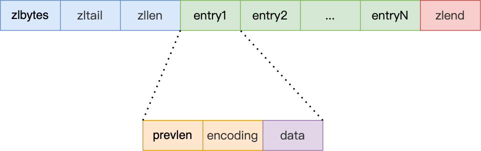
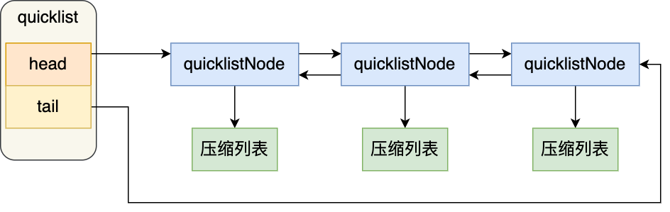

[toc]

### Redis

性能优秀，数据在内存中，读写速度非常快。单进程单线程，是线程安全的。丰富的数据类型，支持字符串 (strings)、散列(hashes)、列表(lists)、集合(sets)、有序集合(sorted sets) 等。支持数据持久化,可以将内存中数据保存在磁盘中，重启时加载。主从复制，哨兵，高可用。

Redis 是使用了一个「哈希表」保存所有键值对，哈希桶存放的是指向键值对数据的指针（dictEntry*）， key 指向的是 String 对象。

void * key 和 void * value 指针指向的是 Redis 对象。Redis 中的每个对象都由 redisObject 结构表示：type，标识该对象是什么类型的对象（String 对象、 List 对象、Hash 对象、Set 对象和 Zset 对象）；encoding，标识该对象使用了哪种底层的数据结构；ptr，指向底层数据结构的指针。


##### 数据类型

* String 数据结构是简单的 key-value 类型，value 其实不仅可以是 String，可以包含任何数据，比如 数字、jpg 图片或者序列化的对象。

  redis使用简单动态字符串（simple dynamic string，SDS） 的数据结构来表示字符串。 O（1)复杂度获取字符串长度的时候；有个专门的 len 成员变量来记录长度，`buf[]`字符数组，用来保存实际数据，所以可存储包含 “\0” 的数据，可以保存任意格式的二进制数据；通过 `alloc - len` 计算出剩余的空间大小，可以用来判断空间是否满足修改需求，避免缓冲区溢出；flags 成员变量指明数据类型，保存不同大小的字符串时选择不同类型，从而数据结构中的 len 和 alloc 成员变量的数据类型不同，字符越短len 和 alloc数据类型范围越小(uint32_t->uint16_t)，结构头占用空间也比较少，从而有效节省内存空间。

  

  

* Hash 是一个 string 类型的 field 和 value 的映射表，Key仍然是设定的值，采用「链式哈希」来解决哈希冲突 ，value是一个Map，这个Map的key是成员的属性名，value是属性值 。特别适合用于存储对象，后续操作的时候，你可以直接仅仅修改这个对象中的某个字段的值。避免取出、保存完整对象的开销，同时避免了序列化、反序列化开销。

  扩容时使用两个哈希表，给「哈希表 2」 分配空间，一般会比「哈希表 1」 大 2 倍；将「哈希表 1 」的数据迁移到「哈希表 2」 中；迁移完成后，「哈希表 1 」的空间会被释放，并把「哈希表 2」 设置为「哈希表 1」，然后在「哈希表 2」 新创建一个空白的哈希表，为下次 rehash 做准备。如果「哈希表 1 」的数据量非常大，那么在迁移至「哈希表 2 」的时候，因为会涉及大量的数据拷贝。

  渐进式 rehash 给「哈希表 2」 分配空间；在 rehash 进行期间，每次哈希表元素进行新增、删除、查找或者更新操作时，Redis 除了会执行对应的操作之外，还会顺序将「哈希表 1 」中索引位置上的所有 key-value 迁移到「哈希表 2」 上；随着处理客户端发起的哈希表操作请求数量越多，最终在某个时间，会把「哈希表 1 」的所有 key-value 迁移到「哈希表 2」，从而完成 rehash 操作。渐进式 rehash 进行期间，哈希表元素的删除、查找、更新等操作都会在这两个哈希表进行，新增一个 key-value 时会被保存到「哈希表 2 」里面，而「哈希表 1」 则不再进行任何添加操作，这样保证了「哈希表 1 」的 key-value 数量只会减少。

  触发 rehash 操作的条件，主要有两个：当负载因子大于等于 1 ，并且 Redis 没有执行 RDB 快照或没有进行 AOF 重写的时候，就会进行 rehash 操作；当负载因子大于等于 5 时，此时说明哈希冲突非常严重了，强制进行 rehash 操作。

* Redis list 的实现为一个双向链表/压缩列表/quicklist/listpack。

  双向列表可以支持反向查找和遍历，O(1)复杂度获取长度和首尾节点，listNode 链表节使用 void* 指针保存节点值，可以指向各种类型数据。链表每个节点之间的内存都是不连续的，意味着无法很好利用 CPU 缓存；头信息、前后节点指针带来了部分额外的内存开销。

  

  压缩列表的最大特点，就是它被设计成一种内存紧凑型的数据结构，占用一块连续的内存空间，不仅可以利用 CPU 缓存，而且会针对不同长度的数据，进行相应编码，这种方法可以有效地节省内存开销。头尾节点可以查询列表头轻松获得，查找其他元素时，由于每个节点大小各异，只能逐个查找，此时的复杂度就是 O(N) 了，因此压缩列表不适合保存过多的元素。新增或修改某个元素时，压缩列表占用的内存空间需要重新分配，节点中使用字段prevlen记录了「前一个节点」的长度，同时会根据数据的大小，prevlen使用不同空间大小，当新插入的元素较大时，可能会导致后续元素的 prevlen 占用空间都发生变化，从而引起「连锁更新」问题，导致每个元素的空间都要重新分配，造成访问压缩列表性能的下降。

  

  quicklist 就是「双向链表 + 压缩列表」组合，因为一个 quicklist 就是一个链表，而链表中的每个元素又是一个压缩列表。通过控制每个链表节点中的压缩列表的大小或者元素个数，来规避连锁更新的问题。因为压缩列表元素越少或越小，连锁更新带来的影响就越小，从而提供了更好的访问性能。

  

  listpack：quicklist 虽然通过控制 quicklistNode 结构里的压缩列表的大小或者元素个数，来减少连锁更新带来的性能影响，但是并没有完全解决连锁更新的问题。它最大特点是 listpack 中每个节点不再包含前一个节点的长度了，压缩列表每个节点正因为需要保存前一个节点的长度字段，就会有连锁更新的隐患。

  

* set 元素是没有顺序的，通过 HashMap 实现的，只是 value永远为null，通过计算key的hash的方式来快速去重。

* sorted set 和 set 相比，增加了一个权重参数 score，使得集合中的元素能够按 score 进行有序排列。内部使用 HashMap 和跳跃表 (skipList，多级索引) 来保证数据的存储和有序，HashMap 里放的是成员到 Score 的映射。而跳跃表里存放的是所有的成员，排序依据是 HashMap 里存的 Score，使用跳跃表的结构可以获得比较高的查找效率。

  跳表是在链表基础上改进过来的，实现了一种「多层」的有序链表，有序+多层索引，跳表的优势是能支持平均 O(logN) 复杂度的节点查找。跳表的相邻两层的节点数量最理想的比例是 2:1(k=2)，查找复杂度O(log_k(N)+K)->O(logN)。如果采用新增节点或者删除节点时，来调整跳表节点以维持比例的方法的话，会带来额外的开销。

  

  

##### 有效期

Redis 中有个设置缓存时间过期的功能，即对存储在 redis 数据库中的值可以设置一个过期时间。`redisTemplate.opsForValue().set(key, value, 20, TimeUnit.SECONDS);`

* 定期删除：redis 默认是每隔 100ms 就随机抽取(降低遍历开销)一些设置了过期时间的 key，检查其是否过期，如果过期就删除。
* 惰性删除：定期删除可能会导致很多过期 key 到了时间并没有被删除掉，假如过期 key，靠定期删除没有被删除掉，还停留在内存里，除非手动去查一下那个 key，才会被 redis 给删除掉。

##### 内存淘汰机制

如果定期删除漏掉了很多过期 key，然后也没及时去查，也就没走惰性删除，如果大量过期 key 堆积在内存里，导致 redis 内存块耗尽。

* volatile-lru：从已设置过期时间的数据集（server.db[i].expires）中挑选最近最少使用的数据淘汰
* volatile-ttl：从已设置过期时间的数据集（server.db[i].expires）中挑选将要过期的数据淘汰
* volatile-random：从已设置过期时间的数据集（server.db[i].expires）中任意选择数据淘汰
* allkeys-lru：当内存不足以容纳新写入数据时，在键空间中，移除最近最少使用的 key
* allkeys-random：从数据集（server.db[i].dict）中任意选择数据淘汰
* no-eviction：禁止驱逐数据，也就是说当内存不足以容纳新写入数据时，新写入操作会报错。

##### 持久化机制

1，只追加文件（append-only file，AOF）：类似mysql的基于语句的binlog方式，每执行一条会更改 Redis 中的数据的命令，先执行写操作命令后，再将该命令记录到 AOF 日志里的（避免额外的语法检查开销，不会阻塞当前写操作命令的执行）。

当 Redis 在还没来得及将命令写入到硬盘时，服务器发生宕机了，这个数据就会有丢失的风险。写操作命令执行成功后才记录到 AOF 日志，所以不会阻塞当前写操作命令的执行，但是可能会给「下一个」命令带来阻塞风险（写操作和日志是同步的，上一次的写日志会阻塞下一次的写数据）。

Redis 执行完写操作命令后，会将命令追加到 server.aof_buf 缓冲区->然后通过 write() 系统调用，将 aof_buf 缓冲区的数据拷贝到了内核缓冲区 page cache，等待内核将数据写入硬盘->具体内核缓冲区的数据什么时候写入到硬盘，由内核决定。写文件频率可以根据需求调节，高性能VS高可靠：总是、每秒、被动由OS决定，三种策略只是将内核缓冲区写入文件的频率不同。


重写机制：尽管某个键值对被多条写命令反复修改，最终也只需要根据这个「键值对」当前的最新状态，然后用一条命令去记录键值对，代替之前记录这个键值对的多条命令，这样就减少了 AOF 文件中的命令数量。最后在重写工作完成后，将新的 AOF 文件覆盖现有的 AOF 文件。重写的过程是由后台子进程完成的，这样可以使得主进程可以继续正常处理命令。

用 AOF 日志的方式来恢复数据其实是很慢的，因为 Redis 执行命令由单线程负责的，而 AOF 日志恢复数据的方式是顺序执行日志里的每一条命令，如果 AOF 日志很大，这个「重放」的过程就会很慢了。 

2，快照（snapshotting，RDB）：Redis 可以通过创建快照来获得存储在内存里面的数据在某个时间点上的副本，内容是二进制数据。Redis 创建快照之后，可以对快照进行备份，可以将快照复制到其他服务器从而创建具有相同数据的服务器副本（Redis 主从结构，主要用来提高 Redis 性能），还可以将快照留在原地以便重启服务器的时候使用。

在 Redis 恢复数据时，直接将 RDB 文件（二进制文件）读入内存就可以，不需要像 AOF 那样还需要额外执行操作命令的步骤才能恢复数据。执行快照是一个比较重的操作，如果频率太频繁，可能会对 Redis 性能产生影响。如果频率太低，服务器故障时，丢失的数据会更多。

执行快照时，数据被修改：如果主线程（父进程）要修改共享数据里的某一块数据（比如键值对 A）时，就会发生写时复制，于是这块数据的物理内存就会被复制一份（键值对 A'），然后主线程在这个数据副本（键值对 A'）进行修改操作。与此同时，bgsave 子进程可以继续把原来的数据（键值对 A）写入到 RDB 文件。

3，混合持久化，AOF 文件的前半部分是 RDB 格式的全量数据，后半部分是 AOF 格式的增量数据。重启 Redis 加载数据的时候，由于前半部分是 RDB 内容，这样加载的时候速度会很快。AOF内容写入成本底，可以频繁写入，可以使得数据更少的丢失。

##### 缓存雪崩

为了保证缓存中的数据与数据库中的数据一致性，会给 Redis 里的数据设置过期时间，缓存同一时间大面积的失效或者 Redis 故障宕机，所以后面的请求都会落到数据库上，造成数据库短时间内承受大量请求而崩掉。

解决办法：宕机：1，尽量保证整个 redis 集群的高可用性，发现机器宕机尽快补上；2，对请求限流 ，避免 MySQL在redis崩溃后也崩掉，只要数据库正常工作，就可以处理用户请求，保证系统仍然可用。缓失效：1，把每个 Key 的失效时间都加个随机值，保证数据不会再同一时间大面积失效。2，对请求限流 。3，对缓存数据可以使用两个 key，一个是主 key，会设置过期时间，一个是备 key，不会设置过期，它们只是 key 不一样，但是 value 值是一样的，相当于给缓存数据做了个副本。4，让缓存“永久有效”，并将更新缓存的工作交由后台线程定时更新。

当业务线程访问不到「主 key 」的缓存数据时，就直接返回「备 key 」的缓存数据，然后在更新缓存的时候，同时更新「主 key 」和「备 key 」的数据。3，选择合适的内存淘汰策略，防止爆内存。5，利用 redis 持久化机制保存的数据尽快恢复缓存。


##### 缓存击穿

缓存击穿是指一个 Key 非常热点，在不停地扛着大量的请求，大并发集中对这一个点进行访问，当这个 Key 在失效的瞬间，持续的大并发直接落到了数据库上，就在这个 Key 的点上击穿了缓存。

解决办法：1，设置热点数据永不过期，由后台异步更新缓存。2，在访问数据据时加上互斥锁，保证同一时间只有一个业务线程更新缓存。

##### 缓存穿透

黑客恶意攻击时请求大量既不在缓存中，也不在数据库中的数据，导致所有的请求都落到数据库上，造成数据库短时间内承受大量请求而崩掉。

解决办法：1，在接口层增加校验，比如用户鉴权，参数做校验；2，采用布隆过滤器，将所有可能存在的数据哈希到一个足够大的 bitmap 中，用于快速判断出 Key 是否在数据库中存在，一个一定不存在的数据会被这个 bitmap 拦截掉，这个恶意请求就会被提前拦截，从而避免了对DB的查询压力。3，如果一个查询返回的数据为空（不管是数据不存在，还是系统故障），仍然把这个空结果进行缓存，但它的过期时间会很短，最长不超过五分钟。4，在访问数据据时加上互斥锁。


##### 快

Redis 单进程单线程的模型，因为 Redis 完全是基于内存的操作，CPU 不是 Redis 的瓶颈，Redis 的瓶颈最有可能是机器内存的大小或者网络带宽。既然单线程容易实现，而且 CPU 不会成为瓶颈，那就顺理成章的采用单线程的方案了。

* Redis 完全基于内存，绝大部分请求是纯粹的内存操作，非常迅速，数据存在内存中，类似于 HashMap，HashMap 的优势就是查找和操作的时间复杂度是 O(1)。

* 数据结构简单，对数据操作也简单。

* 采用单线程，避免了不必要的上下文切换和竞争条件，不存在多线程导致的 CPU 切换，不用去考虑各种锁的问题，不存在加锁释放锁操作，没有死锁问题导致的性能消耗。

* 使用多路复用 IO 模型，非阻塞 IO。

##### 主从复制

* 全量同步
  Redis全量复制一般发生在Slave初始化阶段，这时Slave需要将Master上的所有数据都复制一份。

  1，从服务器连接主服务器，间其注册为从从服务器，之后发送SYNC命令； 
  2， 主服务器接收到SYNC命名后，开始执行BGSAVE命令生成RDB文件，并使用缓冲区记录此后执行的所有写命令(不阻塞主服务器端)； 
  3， 主服务器BGSAVE执行完后，向所有从服务器发送快照文件，并在发送期间继续记录被执行的写命令； 
  4， 从服务器收到快照文件后丢弃所有旧数据，载入收到的快照； 从复制对于从redis服务器来说也是非阻塞的，进行主从复制过程中也可以接受外界的查询请求，只不过这时候从redis返回的是以前老的数据，
  5， 主服务器快照发送完毕后开始向从服务器发送缓冲区中的写命令； 
  6， 从服务器完成对快照的载入，开始接收命令请求，并执行来自主服务器缓冲区的写命令；

  

* 增量同步
  Redis增量复制是指Slave初始化后开始正常工作时主服务器发生的写操作同步到从服务器的过程。 增量复制的过程主要是主服务器每执行一个写命令就会向从服务器发送相同的写命令，从服务器接收并执行收到的写命令。

##### redis和数据库一致性

1，双写：无论是「先更新数据库，再更新缓存」，还是「先更新缓存，再更新数据库」，这两个方案都存在并发问题，当两个请求并发更新同一条数据的时候，因为两个请求执行更新的顺序是不可预测的（DB：0->1->2，缓存：0->2->1），可能会出现缓存和数据库中的数据不一致的现象。数据库和缓存双写，就必然会存在不一致的问题。如果对数据有强一致性要求，不能放缓存。

如果我们的业务对缓存命中率有很高的要求，我们可以采用「更新数据库 + 更新缓存」的方案，因为更新缓存并不会出现缓存未命中的情况。为解决数据不一致：在更新缓存前先加个分布式锁，保证同一时间只运行一个请求更新缓存，就会不会产生并发问题了，当然引入了锁后，对于写入的性能就会带来影响；在更新完缓存时，给缓存加上较短的过期时间，这样即时出现缓存不一致的情况，缓存的数据也会很快过期，对业务还是能接受的。

2，删除更新：在更新数据时，只更新数据库，不更新缓存，而是删除缓存中的数据。读取数据时，发现缓存中没了数据之后，再从数据库中读取数据，更新到缓存中。

* 先删除缓存，再更新数据库：写请求删除缓存旧值，写入新值到DB间发生读请求。更新请求A将缓存删除之后，数据写入DB之前，读请求B到来，缓存未命中，读取DB中旧值，并写入缓存，请求A再更新DB为新值->数据不一致。延迟双删：加了个睡眠时间，主要是为了确保请求 A 在睡眠的时候，请求 B 能够在这这一段时间完成「从数据库读取数据，再把缺失的缓存写入缓存」的操作，然后请求 A 睡眠完，再删除缓存。

  ```text
  #删除缓存
  redis.delKey(X)
  #更新数据库
  db.update(X)
  #睡眠,请求 A 的睡眠时间就需要大于请求 B 「从数据库读取数据 + 写入缓存」的时间。
  Thread.sleep(N)
  #再删除缓存
  redis.delKey(X)
  ```

* 先更新数据库，再删除缓存：某个用户数据在缓存中不存在，请求 A 读取数据时从数据库中查询到年龄为 20，在未写入缓存中时另一个请求 B 更新数据。它更新数据库中的年龄为 21，并且清空缓存。这时请求 A 把从数据库中读到的年龄为 20 的数据写入到缓存中->数据不一致。

  在实际中，这个问题出现的概率并不高。因为缓存的写入通常要远远快于数据库的写入，所以在实际中很难出现请求 B 已经更新了数据库并且删除了缓存，请求 A 才更新完缓存的情况。

  保证两个操作都能执行成功：删除缓存（第二个操作）的时候失败了，导致缓存还是旧值，而数据库是最新值。

  > 重试机制：可以引入消息队列，将第二个操作（删除缓存）要操作的数据加入到消息队列，由消费者来操作数据。如果应用删除缓存失败，可以从消息队列中重新读取数据，然后再次删除缓存，如果删除缓存成功，就要把数据从消息队列中移除，避免重复操作。
  >
  > 订阅 MySQL binlog，再操作缓存：策略的第一步是更新数据库，那么更新数据库成功，就会产生一条变更日志，记录在 binlog 里。可以通过订阅 binlog 日志，拿到具体要操作的数据，然后再执行缓存删除。

如果一致性不是太高可以采取正确更新策略，先更新数据库，再删缓存，并且给缓存数据加上了「过期时间」，就算在这期间存在缓存数据不一致，有过期时间来兜底，这样也能达到最终一致。

##### 工作模式

* 单机：一个节点、简单低成本、数据一致、可靠性差、性能有限。
* 主从复制：master只写、slave只读；master到slave单向复制保证一致性；数据冗余、master宕机选取新master、读取分流高性能、master宕机后要通知外界新master地址，并复制新master数据到slave上，写能力受单个master限制。
* 哨兵模式：自动化的故障恢复、哨兵节点（不存储数据）和数据节点（主节点和从节点），访问redis集群的数据都是通过哨兵集群的，哨兵监控整个redis集群，新master产生不对外界产生影响，哨兵维护集群信息。哨兵定时发送询问信号监控其它哨兵和数据节点，主节点下线进行选取和数据复制。主从复制优点、健康监控、对外界屏蔽内部信息，难支持在线扩容。
* 集群： 高可用、可扩展性、分布式、容错。分布式：集群的键空间被分割为多个hash槽，通过hash的方式将数据分到不同的分片上的，每个分片认为主从结构，读请求分配给slave节点，写请求分配给master，数据同步从master到slave节点，高并发。可扩展：master节点可以做扩充，从新分配每个分片对应的hash值范围，数据迁移redis内部自动完成。容错：master故障，其slave节点选取产生新master节点并完成数据复制。

##### 分布式锁

Redis因为单进程、性能高的特点，它还经常被用于做分布式锁，用来控制分布式系统之间同步访问共享资源。

1，`SETEX key seconds value`如果不存在就设定键值对，并添加过期时间，两步动作是原子性的，会在同一时间完成，防止加锁成功后设置有效时间失败导致其它线程永远获取不到锁，最后返回1，如果已经存在直接返回0。获得锁就尝试设置某个key，成功后当过期时间到或者手动删除键值对表示释放锁，如果设置失败，表示有其它地方占据该锁需要等待对方释放。

2，缺陷

* 锁误解除：如果线程 A 成功获取到了锁，x线程任务耗时长，锁过期自动释放，此时线程 B 获取到了锁；随后 A 执行完成，线程 A 使用 DEL 命令来释放锁，但此时线程 B 任务尚未执行完成，线程 A 实际释放的线程 B 加的锁。

  解决方法：通过在 value 中设置当前线程加锁的标识，在删除之前验证 key 对应的 value 判断锁是否是当前线程持有。

* 客户端长时间阻塞导致锁失效问题，业务程序还没执行完锁就过期了，如果其它线程拿到锁，可能会导致线程安全的问题。

  解决方案：将过期时间设置足够长，确保代码逻辑在锁释放之前能够执行完成。为获取锁的线程增加守护线程，为将要过期但未释放的锁增加有效时间

* redis服务器时钟漂移问题，服务器时钟比客户端快，导致key在服务端失效，而客户端端锁却未过期，可能导致多个客户端同时持有同一把锁。

* 因为redis的主从同步是异步进行的，可能会出现客户端1设置完锁后，master挂掉，slave提升为master，因为异步复制的特性，客户端1设置的锁丢失了，这时候客户端2设置锁也能够成功，导致客户端1和客户端2同时拥有锁。

3，RedLock算法：Redis必须是多节点部署的，可以有效防止单点故障。

流程：

* 获取当前时间戳（ms）；
* 先设定key的有效时长（TTL），client尝试使用相同的key和value对所有redis实例进行设置，每次链接redis实例时设置一个比TTL短很多的获取锁超时时间，这是为了不要过长时间等待已经关闭的redis服务。
* 将有效时常减去获取锁的耗时，还有redis服务器的时钟漂移误差，得到这正可用的时长，并且成功设置锁的实例数>= N/2 + 1
* 如果客户端由于某些原因获取锁失败，便会开始解锁所有redis实例。

缺点：

* 如果获取锁时由于网络问题导致耗时太长，最终留给锁的有效时长就会大大减少，客户端访问共享资源的时间很短，很可能程序处理的过程中锁就到期了。
* 服务器的时钟漂移难以确定。
* 如果有节点发生崩溃重启的话，有可能出现多个客户端同时获取锁的情况：A、B、C、D、E，客户端1和2分别加锁->客户端1成功锁住了A，B，C，获取锁成功->节点C的master挂了，然后锁还没同步到slave，slave升级为master后丢失了客户端1加的锁->客户端2这个时候获取锁，锁住了C，D，E，获取锁成功。