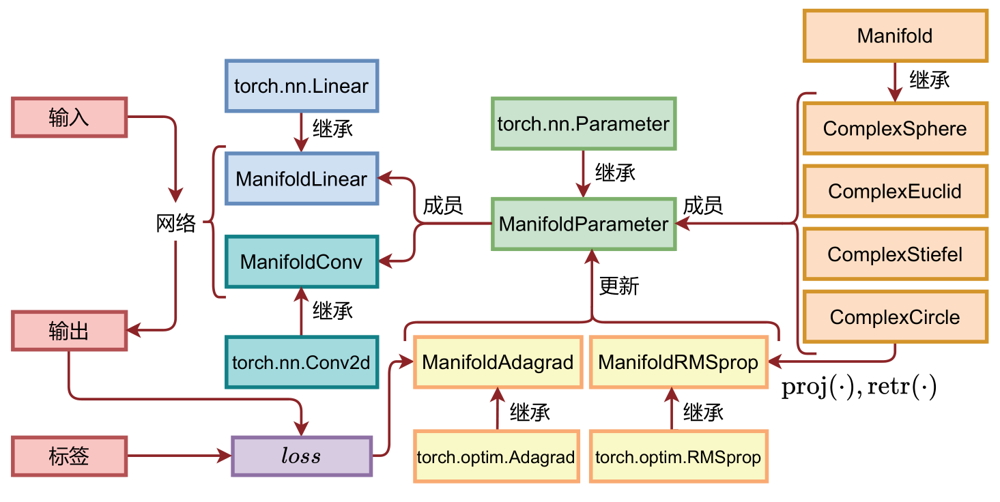

## Welcome to my homepage

### 开源项目

> [Manifold Constrained Neural Network (MCNN) ](https://github.com/HuangQiang97/mcnn)为复数神经网络提供约束性优化和流形优化的深度学习优化框架。为在`PyTorch`中进行复数约束性优化和流形优化提供了一种简单的方法，无需任何模板，提供开箱即用的流形优化器、流形网络层和流形网络模型。延伸阅读：[算法设计](./doc/blog/mcnn_framework.html)、[研究应用](./doc/blog/mcnn_beamtraining.html)。

---

### 博客

> [PageRank网页排序算法](./doc/blog/rangerank.html)
>
> [短URL生成算法](./doc/blog/short-url-generator.html)
>
> [DelayQueue实现](./doc/blog/DelayQueue实现.html)
>
> 调用解耦：[Guava EventBus解读](./doc/blog/EventBus.html)，[京东AsyncTool任务编排](./doc/blog/async-tools.html)，[消息队列之技：使用解读](./doc/blog/MQ.html)，[消息队列之术：排队理论](./doc/blog/消息队列中的排队理论.html)
>
> 分布式基石：[Basic Paxos与Multi Paxos解读](./doc/blog/paxos.html)，[Raft解读与etcd实现](./doc/blog/raft.html)

---

### 笔记

**仿B站**

>[MVC](./doc/coding/仿B站/仿B站0.html#mvc模式)，[RESTful](./doc/coding/仿B站/仿B站0.html#restful)
>
>[加密](./doc/coding/仿B站/仿B站1.html#加密)，[用户认证](./doc/coding/仿B站/仿B站1.html#用户认证)，[注册与登录](./doc/coding/仿B站/仿B站1.html#注册与登录)，[令牌更新](./doc/coding/仿B站/仿B站1.html#更新access-token)
>
>[关注订阅](./doc/coding/仿B站/仿B站2.html#关注订阅)，[发送动态](./doc/coding/仿B站/仿B站2.html#发送动态)，[接收动态](./doc/coding/仿B站/仿B站2.html#接收动态)
>
>[RBAC模型](./doc/coding/仿B站/仿B站3.html#rbac模型)，[权限验证](./doc/coding/仿B站/仿B站3.html#权限验证)
>
>[代理](./doc/coding/仿B站/仿B站4.html#代理)，[负载均衡](./doc/coding/仿B站/仿B站4.html#负载均衡)，[分片传输](./doc/coding/仿B站/仿B站4.html#分片传输)，[秒传](./doc/coding/仿B站/仿B站4.html#秒传)，[视频上传](./doc/coding/仿B站/仿B站4.html#视频上传)，[播放](./doc/coding/仿B站/仿B站4.html#视频播放)，[点赞](./doc/coding/仿B站/仿B站4.html#点赞)，[投币](./doc/coding/仿B站/仿B站4.html#投币)，[收藏](./doc/coding/仿B站/仿B站4.html#收藏)，[评论](./doc/coding/仿B站/仿B站4.html#评论)，[获取视频信息](./doc/coding/仿B站/仿B站4.html#获取视频信息)
>
>[长连接](./doc/coding/仿B站/仿B站5.html#长连接)，[建立连接](./doc/coding/仿B站/仿B站5.html#连接建立)，[接收弹幕](./doc/coding/仿B站/仿B站5.html#接收消息)，[查询弹幕](./doc/coding/仿B站/仿B站5.html#查询弹幕)，[人数更新](./doc/coding/仿B站/仿B站5.html#人数更新)
>
>[全局搜索](./doc/coding/仿B站/仿B站6.html)

**Java**

>[基础](./doc/coding/Java/Java0.html#入门)，[OOP](./doc/coding/Java/Java0.html#oop)，[核心类](./doc/coding/Java/Java0.html#核心类)，[异常](./doc/coding/Java/Java0.html#异常处理)，[反射](./doc/coding/Java/Java0.html#反射)，[注解](./doc/coding/Java/Java0.html#注解)
>
>[泛型](./doc/coding/Java/Java1.html#泛型)，[集合](./doc/coding/Java/Java1.html#集合)，[IO](./doc/coding/Java/Java1.html#io)，[时间](./doc/coding/Java/Java1.html#时间)
>
>[测试](./doc/coding/Java/Java2.html#测试)，[正则](./doc/coding/Java/Java2.html#正则)，[加密](./doc/coding/Java/Java2.html#加密)，[多线程](./doc/coding/Java/Java3.html#多线程基础)，[AQS](./doc/coding/Java/Java3.html#aqs)
>
>[Maven](./doc/coding/Java/Java4.html#maven)，[网络](./doc/coding/Java/Java4.html#网络)，[XML](./doc/coding/Java/Java4.html#xml)，[JDBC](./doc/coding/Java/Java4.html#jdbc)，[函数式编程](./doc/coding/Java/Java4.html#函数式编程)
>
>[设计模式原则](./doc/coding/Java/Java5.html#基础)，[工厂模式](./doc/coding/Java/Java5.html#工厂模式)，[装饰器模式](./doc/coding/Java/Java5.html#装饰器模式)，[单例模式](./doc/coding/Java/Java5.html#单例模式)，[模板模式](./doc/coding/Java/Java5.html#模板模式)，[观察者模式](./doc/coding/Java/Java5.html#观察者模式)，[适配器模式](./doc/coding/Java/Java5.html#适配器模式)，[代理模式](./doc/coding/Java/Java5.html#代理模式)
>
>[MVC](./doc/coding/Java/Java6.html##基础)，[IOC](./doc/coding/Java/Java7.html#ioc)，[AOP](./doc/coding/Java/Java7.html#aop)
>
>[线程限制](./doc/coding/Java/Java10.html#线程数限制)，[CPU占用高](./doc/coding/Java/Java10.html#cpu占用过高)，[服务缓慢](./doc/coding/Java/Java10.html#服务缓慢)，[频繁GC](./doc/coding/Java/Java10.html#频繁gc)，[OOM](./doc/coding/Java/Java10.html#oom)

**Go**

> [环境](./doc/coding/Go/part0.html#环境)，[格式](./doc/coding/Go/part0.html#编写)，[数据类型](./doc/coding/Go/part0.html#数据类型)，[流程控制](./doc/coding/Go/part0.html#流程控制)，[内存分配](./doc/coding/Go/part0.html#内存分配)
>
> [结构体](./doc/coding/Go/part1.html#结构体)，[线性结构](./doc/coding/Go/part1.html#线性结构)，[堆](./doc/coding/Go/part1.html#堆)，[string](./doc/coding/Go/part1.html#string)，[映射](./doc/coding/Go/part1.html#映射)，[接口](./doc/coding/Go/part1.html#接口)，[类型](./doc/coding/Go/part1.html#类型)
>
> [Go程](./doc/coding/Go/part2.html#go程)，[信道](./doc/coding/Go/part2.html#信道)，[互斥锁](./doc/coding/Go/part2.html#互斥锁)，[并行与并发](./doc/coding/Go/part2.html#并行与并发)，[初始化](./doc/coding/Go/part2.html#初始化)，[异常](./doc/coding/Go/part2.html#异常)，[测试](./doc/coding/Go/part2.html#测试)，[库](./doc/coding/Go/part2.html#动态库与静态库)，[命令行](./doc/coding/Go/part2.html#命令行参数)
>
> [并发机制](./doc/coding/Go/part3-1.html)，[内存管理](./doc/coding/Go/part3-2.html)，[容器实现](./doc/coding/Go/part3-3.html)

**基础**

> [Docker](./doc/coding/基础/docker.html)，[Redis](./doc/coding/基础/redis.html)[数据库](./doc/coding/基础/redis.html)，[操作系统](./doc/coding/基础/操作系统.html)，[计算机网络](./doc/coding/基础/网络.html)
> 

### 闲聊
>[开题答辩](./doc/blog/2020_01_05.html)
>
>[注放水问题](./doc/blog/2020_01_13.html)
>
>[推免经验](./doc/blog/2020_02_08.html)
>
>[求职](./doc/blog/2020_04_23.html)

---
