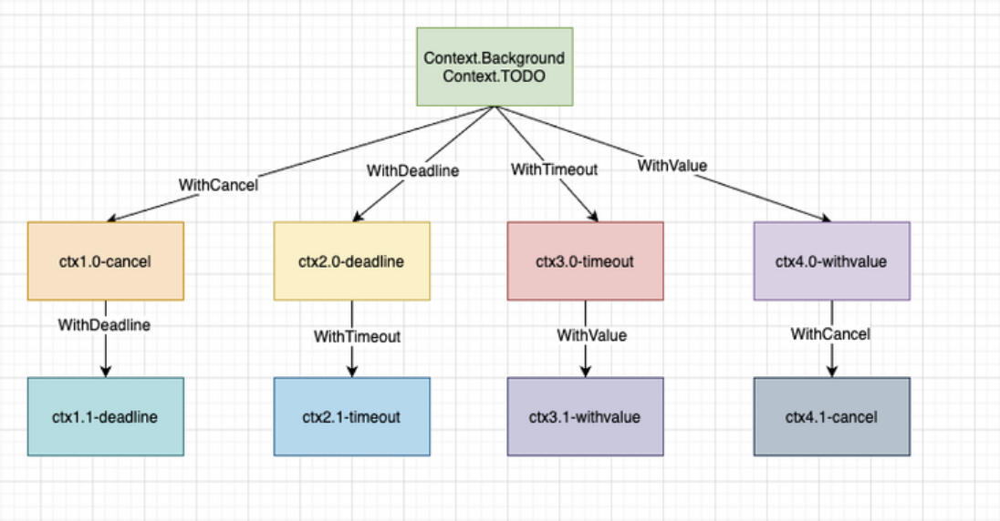

[toc]

### 并发

##### go协程

线程池有效的减少线程创建和销毁所带来的开销。若 worker 线程执行的 G 任务中发生系统调用，则操作系统会将该线程置为阻塞状态，浪费线程资源，线程池消费任务队列的能力变弱了。增加线程池中线程数量可以一定程度上提高消费能力，但随着线程数量增多，过多线程会争抢 CPU，线程数过多，那么操作系统会频繁的切换线程，频繁的上下文切换就成了性能瓶颈。

- 进程: 进程是具有一定独立功能的程序，由程序+数据集合+进程控制块组成，程控制块（PCB）来描述进程，进程是系统资源分配的最小单位。每个进程都有自己的独立内存空间，独立的堆栈、由操作系统调度（抢占式调度）、切换开销大(栈、寄存器、虚拟内存、文件句柄等)、稳定安全、不同进程通过进程间通信来通信。
- 线程: 线程是进程的一个实体,线程是内核态,而且是CPU调度和分派的基本单位,它是比进程更小的能独立运行的基本单位。独立的栈和程序计数器和共享的代码段、数据段、打开的文件等资源、地址空间等，由操作系统调度（抢占式调度），线程间通信主要通过共享内存，上下文切换很快，资源开销较少，但相比进程不够稳定容易丢失数据。多核并行高性能、适合IO密集型、通信不需要OS干预。
- 协程: 协程是组织好的代码流程，是一种用户态的轻量级线程，协程的调度完全是由用户来控制的，内存占用小2KB 。协程拥有自己的寄存器上下文和栈。协程调度切换时，将寄存器上下文和栈保存到其他地方，在切回来的时候，恢复先前保存的寄存器上下文和栈，对内核透明，直接操作栈则基本没有内核切换的开销，可以不加锁的访问全局变量，所以上下文的切换非常快，难以实现强制的 CPU 控制权切换，需要协程自己主动把控制权转让出去之后，其他协程才能被执行到。
- goruntime ：Golang 从语言层面支持了协程，在 runtime、系统调用等多方面对 goroutine 调度进行了封装和处理。网络编程： 高并发、程序生命期短、高IO，低计算。适配协程特点。

##### CSP并发机制

以通信的⽅式来共享内存。Golang内部有三个对象：

* P对象(processor) 代表上下⽂，包含运行 Go 代码的必要资源，代表了真正的并发度，即有多少个 goroutine 可以同时运行，数量由启动时环境变量决定，一般设置为 CPU 的核数，使 Go 程序能充分利用 CPU。在确定了P的最大数量n后，运行时系统会根据这个数量创建n个P。

* M(work thread)代表⼯作线程，一个M阻塞了，P会创建新的M，运行时动态创建，M与P的数量没有绝对关系。

* G对象（goroutine，Goroutine 是Golang实际并发执⾏的实体，它底层是使⽤协程(coroutine)实现并发，coroutine是⼀种运⾏在⽤户态的⽤户线程）。M必须拥有P才可以执行G中的代码，P含有一个包含多个G的队列，P可以调度G交由M执行。

  ```go
  struct G
  {
      uintptr    stackguard;    // 分段栈的可用空间下界
      uintptr    stackbase;    // 分段栈的栈基址
      Gobuf    sched;        //进程切换时，利用sched域来保存上下文
      uintptr    stack0;
      FuncVal*    fnstart;        // goroutine运行的函数
      void*    param;        // 用于传递参数，睡眠时其它goroutine设置param，唤醒时此goroutine可以获取
      int16    status;        // 状态Gidle,Grunnable,Grunning,Gsyscall,Gwaiting,Gdead
      int64    goid;        // goroutine的id号
      G*    schedlink;
      M*    m;        // for debuggers, but offset not hard-coded
      M*    lockedm;    // G被锁定只能在这个m上运行
      uintptr    gopc;    // 创建这个goroutine的go表达式的pc
      ...
  };
  ```

每⼀个线程（M0）维护⼀个上下⽂（P），任何时刻，⼀个上下⽂中只有⼀个Goroutine，其他Goroutine在上下文对应的runqueue中等待。

队列轮转：每个 P有个局部队列，局部队列保存待执⾏的 goroutine(流程2)，当 M绑定的 P的的局部队列已经满了之后就会把 goroutine 放到全局队列(流程2-1)。P 会周期性的将G调度到M中执行，执行一段时间后，保存上下文，将G放到队列尾部，然后从队列中再取出一个G进行调度。当 M绑定的 P的局部队列为空时，M会从全局队列获取到本地队列来执⾏，全局队列中 G 的来源，主要有从系统调用中恢复的 G，防止全局队列中的 G 被“饿死”。

工作窃取：多个 P 中维护的 G 队列有可能是不均衡的。当从全局队列中没有获取到可执⾏的 G时候，M会从其他 P 的局部队列中偷取 G来执⾏(流程3.2)。确保了每个 OS 线程都能充分的使用


系统调用：一般 M 的个数会略大于 P 的个数，多出来的 M 会在 G 产生系统调用时发挥作用。当G0即将进入系统调用时，M0将释放P，进而某个空闲的M1获取P，继续执行P队列中剩下的G。当G0系统调用结束后，如果有空闲的P，则获取一个P，继续执行G0。如果没有，则将G0放入全局队列，等待被其他的P调度，然后M0将进入缓存池睡眠。

 阻塞：当 G因 channel 或者 network I/O 阻塞时，不会阻塞 M，M会寻找其他 runnable 的 G；当阻塞的 G恢复后会重新进⼊ runnable 进⼊ P队列等待执⾏。


线程实现，m内核线程：n用户线程

* m=1多对一，用户态切换开销小；一个用户线程阻塞，使得全部用户线程阻塞。
* n=n1对1，用户线程间独立，可实现多核并行；核心态下切换
* n>=m多对多，并发高，防止一个用户进程占据大量内核线程。

##### Mutex

正常模式(⾮公平锁)：正常模式下，所有等待锁的 goroutine 按照 FIFO(先进先出)顺序等待。唤醒的 goroutine 不会直接拥有锁，⽽是会和新请求锁的 goroutine 竞争锁的拥有。新请求锁的 goroutine 具有优势：它正在 CPU上执⾏，⽽且可能有好⼏个，所以刚刚唤醒的 goroutine 有很⼤可能在锁竞争中失败。如果⼀个等待的 goroutine 超过1ms没有获取锁，那么它将会把锁转变为饥饿模式。

饥饿模式(公平锁)：为了解决了等待 G队列的⻓尾问题，饥饿模式下，直接由 unlock 把锁交给等待队列中排在第⼀位的 G(队头)，同时，饥饿模式下，新进来的 G不会参与抢锁也不会进⼊⾃旋状态，会直接进⼊等待队列的尾部,这样很好的解决了⽼的 g ⼀直抢不到锁的场景。

对于两种模式，正常模式下的性能是最好的，goroutine 可以连续多次获取锁，免去上下文切换开销，饥饿模式解决了取锁公平的问题，但是性能会下降，其实是性能和公平的⼀个平衡模式。

sync.Mutex互斥锁，使同一时刻只能有一个协程执行某段程序，其他协程等待该协程执行完再依次执行。

```go
var sum = 0
var lock = sync.Mutex{}
var msgChan = make(chan struct{})
func main() {
	//开启100个协程来让 sum + 1
	for i := 1; i <= 1000; i++ {
		go add()
	}
	for i := 1; i <= 1000; i++ {
		<-msgChan
	}
	fmt.Println(sum)
}
func add() {
	lock.Lock()
	defer lock.Unlock()
	sum += 1
	msgChan <- struct{}{}
}
```


##### RWMutex

RWMutex 是单写多读锁，适⽤于读多写少的场景，通过记录 readerCount 读锁的数量来进⾏控制，当有⼀个写锁的时候，会将读锁数量设置为负数1<<30。⽬的是让新进⼊的读锁等待写锁释放之后再获取读锁。同样的写锁也会等待之前的读锁都释放完毕，才会开始进⾏后续的操作。

写锁释放完之后，会将值重新加上1<<30,并通知刚才新进⼊的读锁(rw.readerSem)，所有因操作锁定读锁⽽被阻塞的 goroutine 会被唤醒，并都可以成功锁定读锁。读锁被解锁后，在没有被其他读锁锁定的前提下，所有因操作锁定写锁⽽被阻塞的 goroutine，其中等待时间最⻓的⼀个 goroutine 会被唤醒。

sync.RWMutex，写所互斥，读锁不互斥

```go
var sum = 0
var lock = sync.RWMutex{}
var msgChan = make(chan struct{})
func main() {
	//开启100个协程来让 sum + 1
	for i := 0; i <= 64; i++ {
		go add()
	}
	for i := 0; i <= 64; i++ {
		go get()
	}
	for i := 0; i <= 64; i++ {
		<-msgChan
	}
	fmt.Println(sum)
}
func add() {
	// 获得写锁
	lock.Lock()
	defer lock.Unlock()
	sum += 1
	msgChan <- struct{}{}
}
func get() {
	// 获得读锁
	lock.RLock()
	defer lock.RUnlock()
	fmt.Println(sum)
}
```

##### WaitGroup

⼀个 WaitGroup 对象可以等待⼀组协程结束。调⽤ wg.Add(delta int)设置 worker 协程的个数，然后创建 worker 协程；worker 协程执⾏结束以后，都要调⽤ wg.Done()；main 协程调⽤ wg.Wait()且被 block，直到所有 worker 协程全部执⾏结束后返回。

WaitGroup 主要维护了2 个计数器，⼀个是请求计数器 v，⼀个是等待计数器 w，⼆者组成⼀个64bit 的值，请求计数器占⾼32bit，等待计数器占低32bit。每次 Add执⾏，请求计数器 v 加1，Done⽅法执⾏，请求计数器减1，v 为0 时通过信号量唤醒 Wait()。

sync.WaitGroup等待多个任务执行完毕

```go
var sum = 0
var lock = sync.Mutex{}
var wg = sync.WaitGroup{}
func main() {
	// 添加64个任务
	wg.Add(64)
	//开启100个协程来让 sum + 1
	for i := 0; i < 64; i++ {
		go add()
	}
	// 等待任务执行完毕
	wg.Wait()
	fmt.Println(sum)
}
func add() {
	// 获得写锁
	lock.Lock()
	defer lock.Unlock()
	sum += 1
	// 剩余任务减一
	wg.Done()
}
```

##### Context 包

1，`Context `包提供上下文机制在 `goroutine `之间传递 deadline、取消信号（cancellation signals）或者其他请求相关的信息。

```go
type Context interface {
     Deadline() (deadline time.Time, ok bool)
     Done() <-chan struct{}
     Err() error
     Value(key interface{}) interface{}
}
```

* 服务器程序通过 `context.Background()`为每个接受的请求创建一个 `Context `实例，称为`rootContext`。

* 之后的 `goroutine `中将`rootContext `作为参数通过调用 `context.WithCancel `、`context.WithDeadline`、`context.WithTimeout`方法，创建的子 `context`。

  ```go
  // 返回的 cancelFunc，如果被调用，会导致 Done channel 关闭
  func WithCancel(parent Context) (ctx Context, cancel CancelFunc)
  // 到达指定的截至时间或者cannelFunc被调用，将关闭消息通道
  func WithDeadline(parent Context, d time.Time) (Context, CancelFunc)
  // 经过指定的时间间隔或者cannelFunc被调用，将关闭消息通道
  func WithTimeout(parent Context, timeout time.Duration) (Context, CancelFunc)
  // 用于在不同goroutine间传递数据(签名、trace_id)，类似Java中的ThreadLocal。ctx.Value(k)
  func WithValue(parent Context, key, val interface{}) Context
  ```

  

* `goroutine `通过 `context.Done()` 方法监听取消信号。`func Done() <-chan struct{}` 返回一个只读channel，用于接收取消信号。（可以借助 select 语句，如果收到取消信号，就退出 `goroutine`；否则，默认子句是继续执行 `goroutine`）；

* 关闭消息通道条件：当一个 `Context `被取消（比如执行了 `cancelFunc()`）；`WithDeadline `创建的 context，deadline 到期；`WithTimeout` 创建的 context，timeout 到期。

  ```go
  func Stream(ctx context.Context, out chan<- Value) error {
      for {
          v, err := DoSomething(ctx)
          if err != nil {
              return err
          }
          select {
          case <-ctx.Done():
              return ctx.Err()
          case out <- v:
          }
      }
  }
  ```

##### once

sync.Once在高并发的场景下，来保证代码只执行一次， 适合用于创建单例、只加载一次资源等只需要执行一次的场景。

```go
var once = sync.Once{}
func doInit() {
	fmt.Println("init done")
}
func main() {
	//开启100个协程来让 sum + 1
	for i := 0; i < 64; i++ {
		go func() {
			once.Do(doInit)
		}()
	}
}
```

启动时没有任何go程被执行完毕，标志位为0，多个go程竞争一个同步锁，竞争成功的go程获得同步锁，其它线程阻塞，在他执行完毕后将执行标志位写为1并释放锁，其他go程再次开始竞争锁，拿到锁后检查标志位，发现标志位为1，直接返回并释放锁。

```go
func (o *Once) Do(f func()) {
	if atomic.LoadUint32(&o.done) == 0 {
		o.doSlow(f)
	}
}

// 使用lock和在执行完f后再设置标志位是为了保证f执行成功，如果f执行失败，将不更新标志位，并释放锁，其它等待锁的go程继续尝试执行f。
// 如果使用CAS，如果第一个执行失败，当时由于标志位已被修改，其它go程无法继续尝试完成f。
// if atomic.CompareAndSwapUint32(&o.done, 0, 1) {
//      f()
//  }
func (o *Once) doSlow(f func()) {
	o.m.Lock()
	defer o.m.Unlock()
	if o.done == 0 {
		defer atomic.StoreUint32(&o.done, 1)
		f()
	}
}
```

##### Cond

条件变量 sync.Cond，基于互斥锁的基础上，增加了一个通知队列，协程刚开始是等待的，通知的协程会从通知队列中唤醒一个或多个被通知的协程。

```go
func main() {
	// 3个工人共享一个话筒，同一时刻只能有一个发言
	// 阻塞等待通知的操作以及通知解除阻塞的操作就是基于sync.Mutex来实现
	cond := sync.NewCond(&sync.Mutex{})
	var wg sync.WaitGroup
	// 3工人+1指令员
	wg.Add(4) 
	for i := 1; i <= 3; i++ {
		go func(num int) {
			defer wg.Done()
			// 获得话筒
			cond.L.Lock()
			fmt.Println(num, "就绪")
			// 阻塞当前协程，并释放锁资源，直到被其他协程调用 Broadcast 或者 Signal 方法唤醒，使用的时候需要加锁
			cond.Wait()
			fmt.Println(num, "运行中")
			// 释放话筒
			cond.L.Unlock()
		}(i)
	}
	//等待所有goroutine都进入wait状态
	time.Sleep(2 * time.Second)
	go func() {
		defer wg.Done()
		fmt.Println("开始运行")
		// 广播通知，唤醒所有等待的协程
		cond.Broadcast() 
	}()
	//防止函数提前返回退出
	wg.Wait()
}
```

```go
func (c *Cond) Wait() {
	c.checker.check()
    // 把调用它的 goroutine（也就是当前的 goroutine）加入到当前条件变量的通知队列中。
	t := runtime_notifyListAdd(&c.notify)
    // 解锁当前的条件变量基于的那个互斥锁。
	c.L.Unlock()
    // 让当前的 goroutine 处于等待状态，等到通知到来时再决定是否唤醒它。此时，这个 goroutine 就会阻塞在调用这个Wait方法的那行代码上。
	runtime_notifyListWait(&c.notify, t)
    // 如果通知到来并且决定唤醒这个 goroutine，那么就在唤醒它之后,尝试重新锁定当前条件变量基于的互斥锁，成功后返回。
	c.L.Lock()
}
```

##### select

`select` 语句使一个 Go 程可以等待多个通信操作。每个`case`表达式中都必须包含通道的读或者写；`select`语句会查看哪些case的读写操作能成功执行，然后开始选择能成功执行的候选分支，进行读写操作，执行对应case内容，然后结束当前select ；当多个分支都准备好时会随机选择一个执行case，而随机的引入就是为了避免饥饿问题的发生，然后结束当前select 。如果所有的候选分支都不满足选择条件，那么默认分支就会被执行，如果这时没有默认分支，那么`select`语句就会立即进入阻塞状态，直到至少有一个候选分支满足选择条件为止。

```go
//break 方式
loop:
    for {
        select { 
        case _, ok := <-ch1: //ch1非空或许信道被关闭且没有值时执行此语句
            if !ok {
                ch1 = nil //ch1已经关闭且没有值，将他设置为nil，以屏蔽ch1
            }
            fmt.Println("ch1")
        case _, ok := <-ch2: //ch2非空或许信道被关闭且没有值时执行此语句
            if !ok {
                break loop //跳出for循环
            }
            fmt.Println("ch2")
        default: // 所有分支都阻塞时执行此分支
            time.Sleep(50 * time.Millisecond)
        }
    }
    fmt.Println("END")
```

##### 并发限制

```go
// 通过有限容量的管道，限制并发数
// 为每个进入的请求都创建了新的Go程,只是只有MaxOutstabding个操作同时进行，其它Go程被阻塞。若请求来得很快,该程序就会无限地消耗资源
var sem = make(chan int, MaxOutstanding)
func handle(r *Request) {
    sem <- 1 // 往信道中写数据，标志占用一个资源
    process(r)  // 可能需要很长时间。
    <-sem    // 往信道中取数据，标志释放一个资源
}
func Serve(queue chan *Request) {
    for {
        req := <-queue
        go handle(req)  // 无需等待 handle 结束。
    }
}
```

```go
// 通过有限容量的管道，限制并发数
func Serve(queue chan *Request) {
    for req := range queue {
        sem <- 1
        go func(req *Request) { //默认情况下闭包类变量只在被执行时才求值，可能导致变量值与创建闭包时的变量不一致。将当前req与函数绑定，立即执行求值。
            process(req)
            <-sem
        }(req)
    }
}
```

```go
// 启动固定数量的 handle Go程，一起从请求信道中读取数据。
func handle(queue chan *Request) {
    // 从quene中取出还没被处理的请求，quene长度减一
    for r := range queue { 
        process(r)
    }
}
func Serve(clientRequests chan *Request, quit chan bool) {
    // 启动处理程序
    for i := 0; i < MaxOutstanding; i++ {
        // MaxOutstanding个handle同时从clientRequests获取任务处理请求
        go handle(clientRequests) 
    }
    <-quit  // 等待通知退出。
}
```

##### 函数传参

因为拷贝的内容有时候是非引用类型（int、string、struct等这些），这样就在函数中就无法修改原内容数据；有的是引用类型（指针、map、slice、chan等这些），这样就可以修改原内容数据。

- 传值（值传递）：将实际参数拷贝（浅拷贝）一份传递到函数中，独立变化。Go里面函数传参只有值传递一种方式。
- 传指针：传递指针的拷贝，形参、实参的值虽然相同，但是存放这两个指针的内存地址是不同的，因此这是两个不同的指针。任何存放在内存里的东西都有自己的地址，指针也不例外，它虽然指向别的数据，但是也有存放该指针的内存。
- 传引用（引用传递）：在调用函数时将实际参数的地址传递到函数中，在函数中对参数所进行的修改，将影响实际参数。

### 