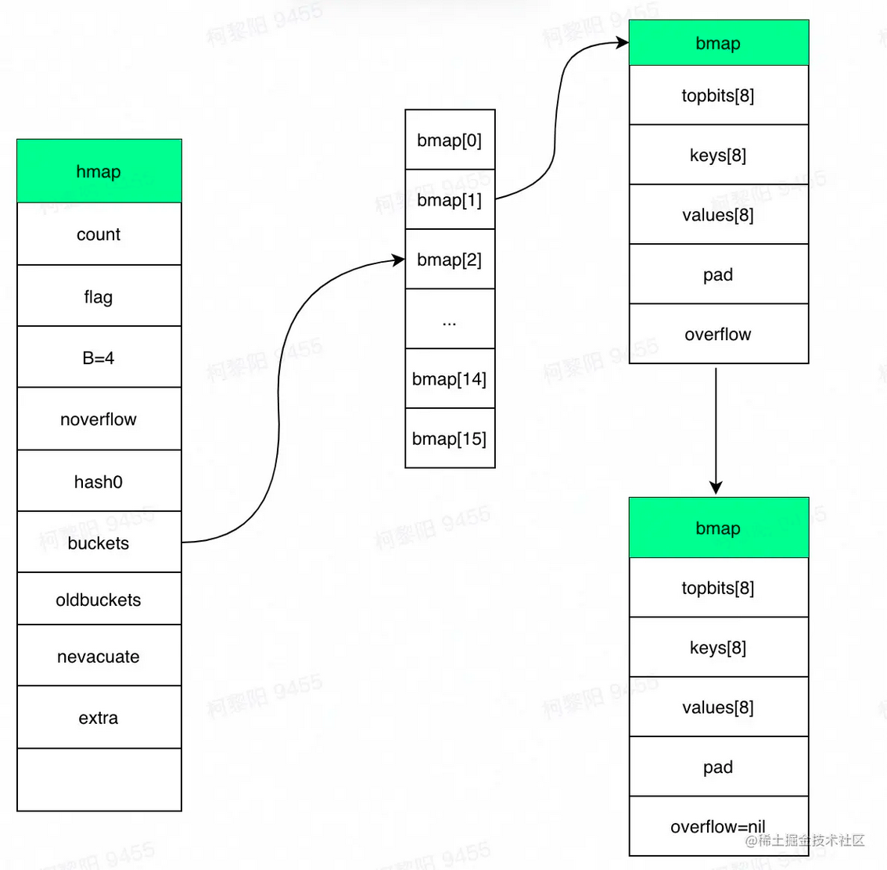
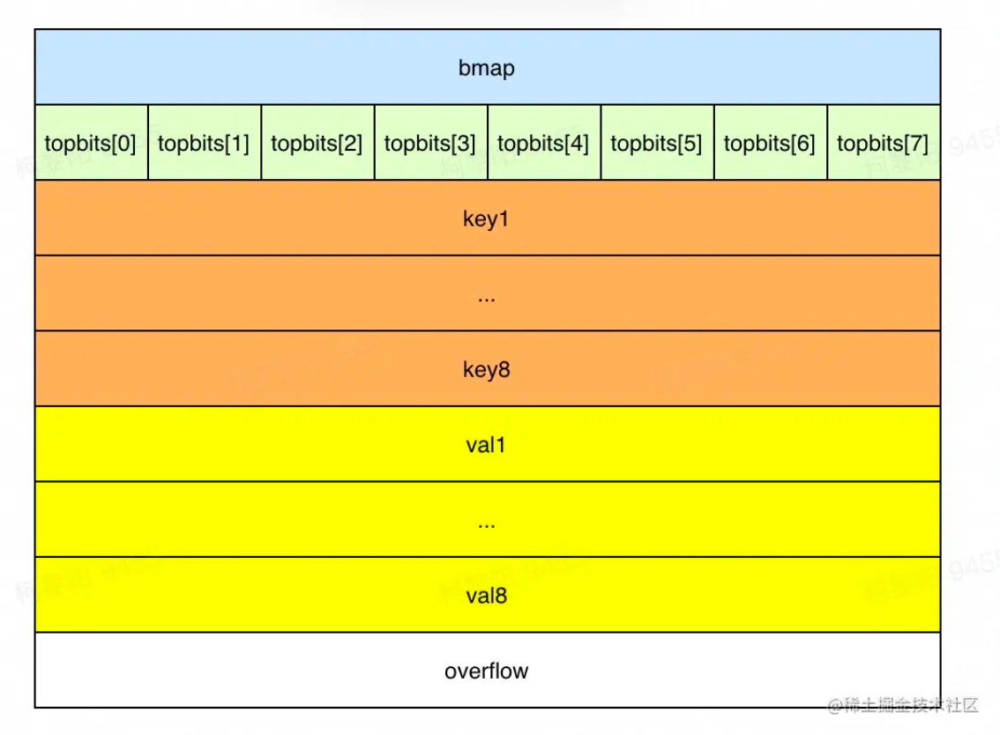
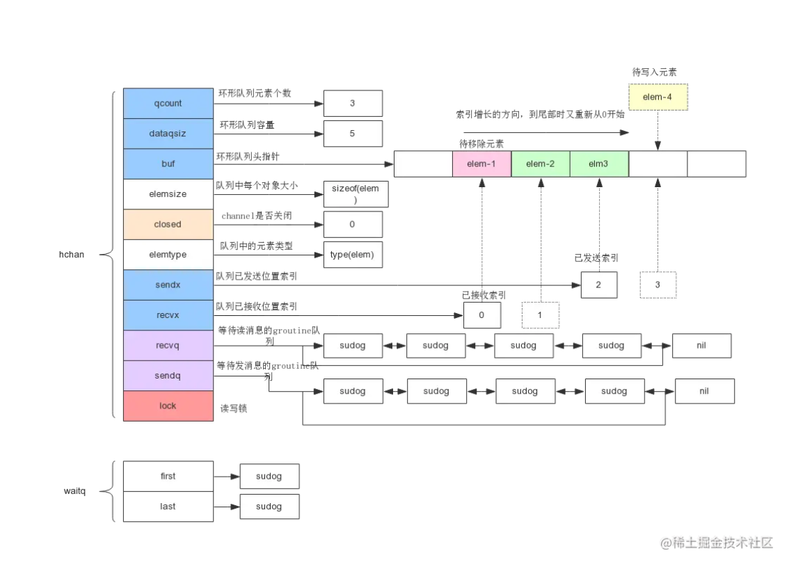

[toc]

### 容器

##### Map实现

1，结构体，map是个指针，底层指向hmap，所以是个引用类型

```go
type hmap struct {
   // 键值对的数量
 	count     int 
   // 标记当前是否有协程在写，或遍历
 	flags     uint8
   // 桶数组长度 = 2 ^ B。当n=3时，桶数组长度=8
   B         uint8  
   // 溢出桶的大概数量
 	noverflow uint16 
   // hash种子，新建map时生成。每个map的hash种子都是随机生成，同样的key在两个map中大概率定位到不同的桶，以保证随机性。
 	hash0     uint32 
   // 指向桶数组
 	buckets    unsafe.Pointer 
   // 指向老桶数组，扩容时用。渐进式扩容，需要同时保存老桶和新桶，两个桶同时用于查找，遍历等操作，当扩容完毕删除oldbuckets。老的buckets数组大小是新的buckets的1/2;非扩容状态下，它为nil。
 	oldbuckets unsafe.Pointer 
   // 表示扩容进度，小于此地址的buckets代表已搬迁完成。
 	nevacuate  uintptr        
 	extra *mapextra // optional fields
}
```

```go
type bmap struct {
    // 根据hash值的高8位来决key到底落入桶内的哪个位置，用来快速定位key是否在这个bmap中
    topbits  [bucketCnt]uint8   // bucketCnt = 8，一个桶最多存储8个键值对，
    keys     [bucketCnt]keytype
    values   [bucketCnt]valuetype
    pad      uintptr
    // 指向溢出桶，用到溢出桶需要一个桶8位塞满8个元素，这在其他语言发生概率较低，比如java的hashmap，默认装置因子0.75表示平均一个桶有0.75个元素就要发生扩容，但go map的扩容条件比较苛刻，装载因子为6.5，因此有一定的概率使用溢出桶若超过8个元素都被定位到该桶时，需建新桶，挂到前一个桶的overflow上
    overflow uintptr
}
```



2，定位

===>计算hash(key)，每种类型的哈希方法由系统初始化，再加上随机种子` hash := alg.hash(key, uintptr(h.hash0))`

===>定位桶：根据hash值（64位机下共 64 个 bit 位）的后B位定位桶，` b := (*bmap)(unsafe.Pointer(uintptr(h.buckets) + (hash&mask)*uintptr(t.bucketsize)))`。如果map未在扩容或者当前bucket已经完成扩容，在当前bucket中查找，若当前bucket正在扩容，则到老bucket查找。

===>定位槽：每个key生成了一个tophash，取值为hash值前8位。先和tophash的每个值比较，若不等，则key一定不在该槽，若相等，进一步调用` alg.equal(key, k)`方法验证。



===>当前桶遍历完没有key时，若bmap.overflow不为空，需要继续寻找溢出桶，定位方式和之前一样。

3，扩容

触发：元素个数大于8且元素个数大于 6.5 * 桶的数量；溢出桶过多（此时哈希表中可能元素不多，但有大量桶，且有大量空槽，这种场景出现的原因一般是先大量添加元素，再大量删除，再插入很多元素，就会留下一些空洞，定位key需要额外扫描空的位置，降低性能，需要进行处理）。

若为元素过多，则将数组容量翻倍。否则是溢出桶过多，采用原桶容量（元素不多，不需要更大的容量，只是需要重新整合，消除溢出桶）

渐进式扩容，在插入、修改或者删除时，使用(oldbuckets != nil )触发搬迁数据，每次搬迁2个桶到新桶上，其中一个是key所在的桶，和一个另外的桶，新桶下标计算与java相同。这样扩容的好处是将扩容的复杂度均摊到每次操作，保证在map操作上耗时稳定，缺点是实现复杂。

在扩容过程中，写入数据时会把该key对应的老bucket迁移，并将数据写入新桶；遍历时key对应的老桶还没被搬迁，则需要到老桶上找元素。

4，遍历

随机性：每次for-range遍历map的顺序不一样。开始遍历的桶startBucket不一样，且遍历每个桶时开始位置offset也不同（不同rang的offset不同，同一个range内全部桶得offset相同）。编程语言没有定义map的迭代顺序，不同平台的遍历顺序可能不一样，这导致基于特定顺序的代码在不同平台之间的运行结果可能不一致，另外map扩容后，一个bucket的数据会分散到两个bucket，也会导致顺序产生变化，因此为了防止程序员依赖特定的迭代顺序，map的迭代就不可预测。如果想顺序遍历 map，需要对 map key 先排序，再按照 key 的顺序遍历 map。

```go
// 实现有序遍历
var sl []int
// 把 key 单独取出放到切片
for k := range m {
    sl = append(sl, k)
}
// 排序切片
sort.Ints(sl)
// 以切片中的 key 顺序遍历 map 就是有序的了
for _, k := range sl {
    t.Log(k, m[k])
}
```

考虑扩容：由于是渐进式扩容，可能遍历的过程中同时扩容也在进行，有些bucket可能已经被搬到新map，有些没有。因此遍历时需要考虑在新老哪个map取数据。

map无法并发读写，需要对写和读操作进行加锁，或者使用使用sync.Map。

```go
// fatal error: concurrent map read and map write
m := make(map[int]int)
go func() {
    for {
        _ = m[1]
    }
}()
go func() {
    for {
        m[2] = 2
    }
}()
```

```go
// 1.19前解决办法：加全局读写锁，或者根据hash值分片加读写锁
var counter = struct{
    sync.RWMutex
    m map[string]int
}{m: make(map[string]int)}
// 读数据加读锁,读锁减少读写的时候因为锁带来的性能
counter.RLock()
n := counter.m["some_key"]
counter.RUnlock()
fmt.Println("some_key:", n)
// 读数据加写锁
counter.Lock()
counter.m["some_key"]++
counter.Unlock()
```

##### sync.Map 

* 空间换时间。通过冗余的两个数据结构(read、dirty)，读写操作分开，读+更新+删除相关的操作尽量通过不加锁的 read 实现，写+新增相关的操作通过 dirty 加锁实现。实现加锁对性能的影响。
* 使用只读数据(read)，避免读写冲突。
* 动态调整，新写入的 key 都只存在 dirty 中，如果 dirty 中的 key 被多次读取，dirty 就会上升成不需要加锁的 read。
* double-checking。
* 延迟删除。删除一个键值只是打标记，dirty 上升成 read 的时候，标记删除的 key 被批量移出 map。这样的好处是 dirty 变成 read 之前，这些 key 都会命中 read，而 read 不需要加锁。

```go
type Map struct {
	// 当涉及到dirty数据的操作的时候，需要使用这个锁
	mu Mutex
	// 一个只读的数据结构，因为只读，所以不会有读写冲突。它包含的元素其实也是通过原子操作更新的。
	read atomic.Value 
	// 包括所有在read字段中但未被expunged（删除）的元素以及新加的元素。虽有冗余，但是提升dirty字段为read的时候非常快，不用一个一个的复制，而是直接将这个数据结构作为read字段的一部分。
	// 对于dirty的操作需要加锁，因为对它的操作可能会有读写竞争。
	dirty map[interface{}]*entry
	// 当从Map中读取entry的时候，如果read中不包含这个entry,会尝试从dirty中读取，这个时候会将misses加一，
	// 当misses累积到 dirty的长度的时候， 就会将dirty提升为read,避免从dirty中miss太多次。因为操作dirty需要加锁。
	misses int
}
```

虽然read和dirty有冗余数据，但这些数据是通过指针指向同一个数据，所以尽管Map的value会很大，但是冗余的空间占用还是有限的。read的数据结构是：

```go
type readOnly struct {
	m       map[interface{}]*entry
	amended bool // 如果Map.dirty有些数据不在中的时候，这个值为true。如果从Map.read找不到数据的话，还要进一步到Map.dirty中查找。
}
```

readOnly.m和Map.dirty存储的值类型是*entry,它包含一个指针p, 指向用户存储的value值。

```go
type entry struct {
	p unsafe.Pointer // *interface{}
}
```

1，加载方法，也就是提供一个键key,查找对应的值value,如果不存在，通过ok反映：

```go
func (m *Map) Load(key interface{}) (value interface{}, ok bool) {
	// 1.首先从m.read中得到只读readOnly,从它的map中查找，不需要加锁
	read, _ := m.read.Load().(readOnly)
	e, ok := read.m[key]
	// 2. 如果没找到，并且m.dirty中有新数据，需要从m.dirty查找，这个时候需要加锁
    // 这两行语句并不是一个原子操作，需要双检查
	if !ok && read.amended {
		m.mu.Lock()
		// 双检查，避免加锁的时候m.dirty提升为m.read,这个时候m.read可能被替换了。
		read, _ = m.read.Load().(readOnly)
		e, ok = read.m[key]
		// 如果m.read中还是不存在，并且m.dirty中有新数据
		if !ok && read.amended {
			// 从m.dirty查找
			e, ok = m.dirty[key]
			// 不管m.dirty中存不存在，都将misses计数加一
			// missLocked()中满足条件后就会提升m.dirty
			m.missLocked()
		}
		m.mu.Unlock()
	}
	if !ok {
		return nil, false
	}
	return e.load()
}
```

如果我们查询的键值正好存在于m.read中，无须加锁，直接返回，理论上性能优异。即使不存在于m.read中，经过miss几次之后，m.dirty会被提升为m.read，又会从m.read中查找。所以对于更新／增加较少，加载存在的key很多的case,性能基本和无锁的map类似。

2，missLocked方法中可能会将m.dirty提升。

```go
func (m *Map) missLocked() {
	m.misses++
	if m.misses < len(m.dirty) {
		return
	}
    // 将m.dirty作为readOnly的m字段，原子更新m.read
	m.read.Store(readOnly{m: m.dirty})
    // m.dirty、m.misses重置
	m.dirty = nil
	m.misses = 0
}
```

##### 切片实现

1，使用指针指向底层数组，作为参数传递时指针作为值被复制，由同一个数组生成的两个切片是两个不同的变量，只有通过array指针指向同一个底层数组。当切片作为参数时，其实也是切片的拷贝，在拷贝的切片中其包含的指针成员变量的值是一样的，也就是说它们指向的数据源是一样

```go
type slice struct {
	array unsafe.Pointer
	len   int
	cap   int
}
```

2，初始化

```go
// 内存空间大小 = 切片中元素大小 * 容量大小
// 计算根据cap需要分配的内存空间和内存是否有溢出
mem, overflow := math.MulUintptr(et.size, uintptr(cap))
// 如果cap溢出，计算根据len需要分配的内存空间和内存是否有溢出
em, overflow := math.MulUintptr(et.size, uintptr(len))
// 分配内存
mallocgc(mem, et, true)
```

3，扩容，扩容切片指向新开辟的数组，而对于上层切片来说是没有变化的。

```go
newcap := old.cap
doublecap := newcap + newcap
//这个cap为old.cap+新加元素数量，即至少扩容值
// 如果两倍扩容达不到这个cap，新数组的容量就为这个cap
if cap > doublecap {
    newcap = cap
} else {
    // 如果两倍扩容达到了这个最小值,且老数组长度小于1024，就正常扩容两倍。
    if old.len < 1024 {
        newcap = doublecap
    } else {
        // 如果两倍扩容达到了这个最小值,且老数组长度大于等于1024，就循环扩容1.25倍，直到达到或者超过cap
        for newcap < cap {
            newcap += newcap / 4
        }
    }
}
```

slice是并发不安全的。slice在并发执行中不会报错，但是数据会丢失，可以在写入数据时加锁，保证同一时间只能有一个在执行写操作。或者将要写入的数据写入channel，由另一个独立的协程负责向切片写入数据。

```go
lock.Lock()
defer lock.Unlock()
slc = append(slc, a)
```

```go
type ServiceData struct {
	ch   chan int // 用来 同步的channel
	data []int    // 存储数据的slice
}
func (s *ServiceData) Schedule() {
	// 从 channel 接收数据
	for i := range s.ch {
		s.data = append(s.data, i)
	}
}
func (s *ServiceData) AddData(v int) {
	s.ch <- v // 发送数据到 channel
}
```

##### channel

用于在协程间传递消息，收发遵循先进先出 FIFO，golang实现基于通信的资源内存，可实现生产者、消费者模型，以及多协程间的并发控制（缓存区大小即为资源数，占用资源时就可以向channel写入，结束资源占用就从channel读出，缓冲区满其它写入协程将阻塞）。

1. 给⼀个 nil channel 发送、接收数据，造成永远阻塞
2. 给⼀个已经关闭的 channel 发送数据，引起 panic 
3. 从⼀个已经关闭的 channel 接收数据，如果缓冲区中为空，则返回⼀个零值，非空返回缓冲区值
4. ⽆缓冲的 channel 是同步的，⽽有缓冲的 channel 是⾮同步的
5. 关闭⼀个 nil channel 将会发⽣ panic

channel 中使⽤了 ring buffer(环形缓冲区)来缓存写⼊的数据。

```golang
type hchan struct {
     qcount   uint  // 队列中的总元素个数
     dataqsiz uint  // 环形队列大小，即可存放元素的个数
     buf      unsafe.Pointer // 环形队列指针，固定长度的双向循环列表
     elemsize uint16  //每个元素的大小
     closed   uint32  //标识关闭状态
     elemtype *_type // 元素类型
     sendx    uint   // 下一个可接收发送数据的索引，buf[sendx]=newData
     recvx    uint   // 下一个可读取数据的索引,data=buf[recvx]
     recvq    waitq  // 等待读消息的goroutine队列，如果缓冲空，将当前 goroutine 加入 recvq ，进入睡眠，等待被写 goroutine 唤醒。
     sendq    waitq  // 等待写消息的goroutine队列。若缓冲区中没有空余位置，则将发送数据写入 G，将当前 G 加入 sendq ，进入睡眠，等待被读 goroutine 唤醒。若等待接收队列 recvq 不为空，则缓冲区中无数据或无缓冲区，将直接从 recvq 取出 G ，并把数据写入，最后把该 G 唤醒，结束发送过程。
     lock mutex  //互斥锁，chan不允许并发读写
}
// 等待读写的队列数据结构，保证先进先出
type waitq struct {
  first *sudog
  last  *sudog
}
```



* 初始化：

  ===> 缓冲区大小：`buff_size = elem.size* size`

  ===>`buff_size`为0或者每个元素占用的大小为0（无缓冲区或者重送空结构体，不占据内存）,只需要分配hchan结构体本身占用的大小。`c = (*hchan)(mallocgc(hchanSize, nil, true))`

  ===>传送内容为指针对象，为buf单独开辟mem大小的空间，用来保存所有的数据。`c = new(hchan)`，`c.buf = mallocgc(buff_size , elem, true)`

  ===>传送内容不是指针对象，占据空间为`hchanSize+buff_size`，其中`hchanSize`为hchan自身占据的空间。`c = (*hchan)(mallocgc(hchanSize+mem, nil, true))`

* 向 channel 写数据:

1. 若等待接收队列 recvq 不为空，则缓冲区中无数据或无缓冲区，将直接从 recvq 取出 G ，并把数据写入，最后把该 G 唤醒，结束发送过程。
2. 若等待接收队列 recvq 空，缓冲区中有空余位置，则将数据写入缓冲区，结束发送过程。
3. 若等待接收队列 recvq 空，缓冲区中没有空余位置，则将要发送的数据和当前的Groutine打包成Sudog对象放入sendq，并将groutine置为等待状态，等待被读 goroutine 唤醒。

* 从 channel 读数据

1. 若等待发送队列 sendq 不为空，且没有缓冲区，直接从 sendq 中取出 G ，把 G 中数据读出，最后把 G 唤醒，结束读取过程。
2. 如果等待发送队列 sendq 不为空，且缓冲区已满，从缓冲区中首部读出数据，把 G 中数据写入缓冲区尾部，把 G 唤醒，结束读取过程。
3. 若等待发送队列 sendq 空，且缓冲区中有数据，则从缓冲区取出数据，结束读取过程。
4. 若等待发送队列 sendq 空，且缓冲区空，则阻塞该Groutine，并将groutine打包为sudogo加入到recevq等待队列中，等待被写 goroutine 唤醒。

* 关闭：唤醒所有等待读取chanel的协程；所有等待写入channel的协程，抛出异常
* 并发安全：指针一段写入一段读取，防止随意未知写入数据造成竞争；每次读取或者写入数据都要加锁，同一时刻最多只有一个读或者写；

